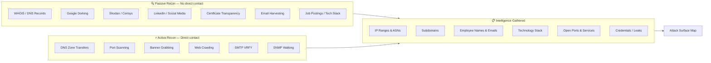

# Reconnaissance

> **The art of gathering intelligence about a target before launching any attacks — knowing your enemy before they know you're watching.**

## 🧠 What Is It?

Reconnaissance (recon) is the intelligence-gathering phase of a penetration test. Think of it like a spy casing a bank before a heist: they study the building layout, staff schedules, security cameras, and alarm systems — without ever setting foot inside.

In cyber terms, you collect information about a target's infrastructure, employees, technologies, and exposures before attempting exploitation.

**Two fundamental types:**
- **Passive Recon**: Gathering info without directly touching the target's systems. Uses public sources.
- **Active Recon**: Directly interacting with the target (DNS queries, port scans). Leaves traces.

## 🏗️ How It Works

Recon follows an expanding concentric circle approach: start from publicly available data and progressively move toward more targeted, direct intelligence gathering.

### Passive vs Active Recon

| Aspect | Passive Recon | Active Recon |
|--------|--------------|-------------|
| **Definition** | Using public data sources | Directly probing target systems |
| **Target Awareness** | None | May be logged |
| **Examples** | WHOIS, Google, Shodan, LinkedIn | DNS queries, port scans, banner grabbing |
| **Legal Risk** | Very low | Requires authorization |
| **Detection Risk** | None | Can trigger IDS/firewall alerts |
| **Timing** | Pre-engagement | During engagement |
| **Tools** | theHarvester, Maltego, Shodan | Nmap, dig, Netcat |

## 📊 Diagram



## ⚙️ Technical Details

### OSINT Framework

The OSINT Framework (osintframework.com) categorizes hundreds of OSINT tools by data type:
- Username lookups
- Email address searches
- IP address geolocation
- Domain/DNS research
- Social networks
- People search
- Public records

### WHOIS Lookups

WHOIS reveals registration information for domains and IP blocks.

```bash
# Basic domain WHOIS
whois target.com

# IP address WHOIS (ARIN, RIPE, APNIC)
whois 93.184.216.34

# Finding registration info
whois target.com | grep -E "Registrant|Admin|Tech|Name Server|Created|Expires"

# Using online WHOIS with more data
whois -h whois.arin.net 93.184.216.0

# Bulk WHOIS lookups
for domain in $(cat domains.txt); do whois $domain | grep "Registrant Name"; done
```

**What to look for in WHOIS output:**
- Registrant name/org (may reveal real company or privacy service)
- Registration/expiration dates (old domains = possible takeover candidates)
- Name servers (identifies DNS provider, sometimes self-hosted)
- Registrar (useful for social engineering vectors)
- Contact emails (harvesting targets)

### DNS Reconnaissance

DNS is a goldmine for recon. Every record type reveals something.

```bash
# Query all record types
dig any target.com

# A Record (IPv4 address)
dig A target.com
nslookup target.com

# AAAA Record (IPv6 address)
dig AAAA target.com

# MX Records (mail servers)
dig MX target.com
# Output reveals mail providers (e.g., Google, Microsoft, Proofpoint)

# NS Records (name servers)
dig NS target.com
# Reveals DNS hosting provider

# TXT Records (SPF, DKIM, DMARC, verification tokens)
dig TXT target.com
# Look for: v=spf1 (email providers), google-site-verification, MS verification keys

# CNAME Records (aliases)
dig CNAME www.target.com

# PTR Records (reverse DNS — IP to hostname)
dig -x 93.184.216.34

# SRV Records (service discovery)
dig SRV _ldap._tcp.target.com
dig SRV _kerberos._tcp.target.com   # Reveals AD domain controllers!
dig SRV _sip._tls.target.com

# SOA Record (Start of Authority — zone info)
dig SOA target.com

# Using specific DNS server
dig @8.8.8.8 target.com A

# Trace the full DNS resolution path
dig +trace target.com

# Short output only
dig +short target.com

# Read SPF record (authorized mail senders)
dig TXT target.com | grep "v=spf1"
# Example output: "v=spf1 include:_spf.google.com include:sendgrid.net ~all"
# This tells you they use Google and SendGrid for email

# nslookup interactive mode
nslookup
> server 8.8.8.8
> set type=MX
> target.com
> set type=TXT
> target.com
```

### DNS Zone Transfers

A misconfigured DNS server will dump its entire zone database to any requester. This gives you **every hostname and IP address** in the domain.

```bash
# Attempt zone transfer (dig)
dig axfr target.com @ns1.target.com
dig axfr target.com @ns2.target.com

# Using nslookup
nslookup
> server ns1.target.com
> ls -d target.com

# Using host command
host -l target.com ns1.target.com

# Automated with dnsx
dnsx -d target.com -axfr

# Using fierce (tests multiple name servers automatically)
fierce --domain target.com

# dnsrecon
dnsrecon -d target.com -t axfr

# Successful zone transfer looks like:
# target.com.      SOA   ns1.target.com. admin.target.com. 2024010101 3600 900 604800 300
# target.com.      NS    ns1.target.com.
# target.com.      MX    10 mail.target.com.
# www              A     93.184.216.34
# dev              A     10.0.1.50        ← Internal IP leaked!
# admin            A     10.0.1.10        ← Admin panel!
# vpn              A     93.184.216.35
```

### Subdomain Enumeration

Subdomains often host forgotten, under-secured services.

```bash
# Amass (most comprehensive)
amass enum -d target.com
amass enum -d target.com -passive     # Passive only
amass enum -d target.com -brute       # Brute force
amass enum -d target.com -o amass_output.txt

# dnsx (fast DNS probing)
dnsx -d target.com -w /usr/share/seclists/Discovery/DNS/subdomains-top1million-20000.txt

# Subfinder (passive, API-based)
subfinder -d target.com
subfinder -d target.com -all -o subdomains.txt

# gobuster DNS mode
gobuster dns -d target.com -w /usr/share/seclists/Discovery/DNS/subdomains-top1million-5000.txt

# ffuf DNS brute force
ffuf -w /usr/share/seclists/Discovery/DNS/subdomains-top1million-5000.txt -u http://FUZZ.target.com -H "Host: FUZZ.target.com"

# Sublist3r
sublist3r -d target.com -o subdomains.txt

# assetfinder
assetfinder --subs-only target.com

# Certificate Transparency (crt.sh)
curl -s "https://crt.sh/?q=%.target.com&output=json" | jq -r '.[].name_value' | sort -u

# theHarvester for subdomains
theHarvester -d target.com -b bing,baidu,crtsh
```

### Shodan

Shodan is a search engine for internet-connected devices. It indexes banners, certificates, and metadata.

```bash
# Install Shodan CLI
pip install shodan
shodan init YOUR_API_KEY

# Basic search
shodan search "org:TargetCorp"
shodan search "hostname:target.com"
shodan search "ssl:target.com"

# Find specific services
shodan search "port:22 org:TargetCorp"
shodan search "port:3389 org:TargetCorp"   # RDP
shodan search "port:445 org:TargetCorp"    # SMB
shodan search "port:23 org:TargetCorp"     # Telnet (misconfiguration!)

# Find specific technologies
shodan search "product:Apache org:TargetCorp"
shodan search "product:IIS version:7.5"   # Old IIS versions
shodan search 'http.title:"Dashboard" org:TargetCorp'
shodan search 'http.title:"Login" org:TargetCorp'

# Vulnerable systems
shodan search "vuln:CVE-2021-44228"        # Log4Shell
shodan search "vuln:CVE-2019-19781"        # Citrix CVE
shodan search "vuln:MS17-010"              # EternalBlue

# Get host details
shodan host 93.184.216.34

# Download results (requires paid plan)
shodan download results "org:TargetCorp"
shodan parse results.json.gz --fields ip_str,port,product

# Common Shodan filters
# net:    - CIDR range
# country: - Country code
# city:   - City
# os:     - Operating system
# after:  - Indexed after date
# before: - Indexed before date

# Shodan web interface queries
# Search for Cisco devices in target's ASN:
# "cisco" net:93.184.216.0/24

# Find webcams
# "webcamXP" country:US
# product:webcam

# Find default credentials pages
# "default password" http.title:"router"
```

### Censys

Alternative to Shodan with excellent TLS certificate analysis.

```bash
# Censys CLI
pip install censys
censys config    # Set API key

# Search for hosts
censys search "target.com" --index-type hosts

# Search by IP
censys view 93.184.216.34 --index-type hosts

# Certificate search
censys search "parsed.names: target.com" --index-type certs

# Web interface queries (search.censys.io):
# ip: 93.184.216.34
# parsed.names: target.com
# autonomous_system.name: "TargetCorp"
# services.port: 443 AND parsed.names: target.com
```

### Email Harvesting

```bash
# theHarvester — the go-to tool
theHarvester -d target.com -b google
theHarvester -d target.com -b bing
theHarvester -d target.com -b linkedin
theHarvester -d target.com -b twitter
theHarvester -d target.com -b baidu
theHarvester -d target.com -b dnsdumpster
theHarvester -d target.com -b crtsh
theHarvester -d target.com -b all -f harvest_results    # All sources, save to file

# hunter.io (API)
curl "https://api.hunter.io/v2/domain-search?domain=target.com&api_key=YOUR_KEY"

# phonebook.cz (web)
# Search: target.com (finds emails, domains, URLs)

# clearbit (API)
curl "https://person.clearbit.com/v2/combined/find?email=person@target.com" \
  -H "Authorization: Bearer YOUR_KEY"

# LinkedIn email pattern discovery
# Find employees on LinkedIn → deduce email format (firstname.lastname@target.com)

# Verify email existence (SMTP probe — use carefully)
smtp-user-enum -M VRFY -u admin -t target.com
```

### Google Dorking Masterclass

Google dorking uses advanced search operators to find sensitive information indexed by Google.

**Core Operators:**

```
site:        - Restrict to specific domain
inurl:       - Text must appear in URL
intext:      - Text must appear in page body
intitle:     - Text must appear in page title
filetype:    - Specific file extension
ext:         - Same as filetype
link:        - Pages linking to URL
cache:       - Google's cached version
related:     - Similar sites
before:      - Published before date (YYYY-MM-DD)
after:       - Published after date (YYYY-MM-DD)
```

**Finding Login Pages:**
```
site:target.com inurl:login
site:target.com intitle:"login"
site:target.com inurl:admin
site:target.com inurl:portal
site:target.com intitle:"dashboard"
site:target.com inurl:signin
site:target.com inurl:wp-login.php
site:target.com inurl:administrator
```

**Finding Configuration Files:**
```
site:target.com filetype:xml
site:target.com filetype:conf
site:target.com filetype:cnf
site:target.com filetype:cfg
site:target.com filetype:env
site:target.com filetype:ini
site:target.com filetype:json
site:target.com ext:properties
site:target.com inurl:".git" intitle:"index of"
site:target.com inurl:config
```

**Finding Backup Files:**
```
site:target.com filetype:bak
site:target.com filetype:old
site:target.com filetype:backup
site:target.com filetype:sql
site:target.com filetype:db
site:target.com filetype:dump
site:target.com inurl:backup
site:target.com intitle:"index of" inurl:backup
```

**Finding Exposed API Keys & Credentials:**
```
site:target.com intext:"api_key"
site:target.com intext:"apikey"
site:target.com intext:"secret_key"
site:target.com intext:"password"
site:target.com filetype:env intext:DB_PASSWORD
site:github.com "target.com" password
site:pastebin.com "target.com"
site:target.com intext:"BEGIN RSA PRIVATE KEY"
```

**Finding Exposed Documents:**
```
site:target.com filetype:pdf
site:target.com filetype:docx
site:target.com filetype:xlsx
site:target.com filetype:pptx
site:target.com filetype:xls intext:password
site:target.com filetype:doc confidential
```

**Finding Exposed Directories:**
```
site:target.com intitle:"index of"
site:target.com intitle:"index of /" intext:".git"
site:target.com intitle:"index of" "parent directory"
site:target.com intitle:"directory listing"
```

**Finding Vulnerable Parameters:**
```
site:target.com inurl:?id=
site:target.com inurl:?page=
site:target.com inurl:?file=
site:target.com inurl:?cat=
site:target.com inurl:?lang=
site:target.com inurl:.php?
```

**Finding Cameras & IoT:**
```
intitle:"webcamXP 5" inurl:8080
inurl:"/view/index.shtml"
inurl:ViewerFrame?Mode=
intitle:"Network Camera" inurl:ViewerFrame
```

**Finding Default Credentials Pages:**
```
intitle:"router" intext:"default password"
intitle:"VMware ESXi" inurl:ui
intitle:"Cisco" intext:"default username"
inurl:"/wp-admin/setup-config.php"
```

**Dorking GitHub for Secrets:**
```
site:github.com "target.com" password
site:github.com "target.com" secret
site:github.com "target.com" api_key
site:github.com "target.com" "BEGIN PRIVATE KEY"
site:github.com "target.com" ".env"
```

### Social Media OSINT

**LinkedIn Recon for Corporate Targets:**

LinkedIn reveals organizational structure, technology stack, and potential phishing targets.

```
# Manual LinkedIn searches:
"TargetCorp" employees → map org chart
"IT Manager at TargetCorp" → find sysadmin names
"CTO at TargetCorp" → find technical decision makers
"TargetCorp" "DevOps" OR "SRE" → infrastructure team
"TargetCorp" "CISO" OR "Security" → security team

# Tools for LinkedIn recon:
# linkedin2username: generates email addresses from LinkedIn profiles
python3 linkedin2username.py -u your@email.com -c TargetCorp

# CrossLinked: LinkedIn enumeration without official API
python3 crosslinked.py -f '{first}.{last}@target.com' "TargetCorp"
```

**Job Postings as Intelligence:**

Job postings reveal technology stack and infrastructure details:
- "Experience with VMware vSphere" → they run VMware
- "Terraform for AWS infrastructure" → AWS + Terraform
- "Splunk or QRadar experience" → their SIEM
- "CrowdStrike Falcon" → their EDR solution

Search: `site:linkedin.com/jobs "TargetCorp"` or `site:indeed.com "TargetCorp"`

**Twitter/X OSINT:**
```bash
# twint (Twitter scraping without API)
twint -u targetceo -o tweets.txt
twint -s "TargetCorp breach" -o search.txt

# Look for:
# - Employee complaints about technology issues (reveals tech stack)
# - Accidental credential leaks
# - Conference attendance (physical location intel)
# - Technology announcements
```

### Certificate Transparency Logs

Every TLS certificate issued is publicly logged. This reveals subdomains including internal ones.

```bash
# crt.sh web search
curl -s "https://crt.sh/?q=%.target.com&output=json" | jq -r '.[].name_value' | sort -u

# Including expired certificates (reveals old infrastructure)
curl -s "https://crt.sh/?q=%.target.com&output=json" | \
  jq -r '.[].name_value' | \
  sort -u | \
  grep -v "^*"

# certspotter
curl -s "https://api.certspotter.com/v1/issuances?domain=target.com&include_subdomains=true&expand=dns_names" | \
  jq -r '.[].dns_names[]' | sort -u

# Facebook CT API
curl -s "https://ct.googleapis.com/logs/argon2024/ct/v1/get-entries?start=0&end=10"
```

### Maltego

Maltego is a visual OSINT tool for mapping relationships between entities.

**Key Entity Types:**
- Person → Email → Phone → Social Media
- Domain → DNS → IP → ASN → Organization
- Company → Person → Email → Infrastructure

**Key Transforms:**
- `To IP Address [DNS]` — Resolve domain to IPs
- `To Email address [PGP KEY SERVER]` — Find emails in PGP keyservers  
- `To Domains [Google]` — Find related domains via Google
- `To Shodan Results` — Map to Shodan data
- `To Social Media [FullContact]` — Link to social profiles

```
# Maltego workflow for corporate recon:
1. Start with Domain entity (target.com)
2. Run "To DNS Name [DNS]" transform
3. Run "To IP Address [DNS]" on each DNS record
4. Run "To Organization [whois]" on each IP
5. Run "To Email Address [whois]" on domain
6. Run "To Person [LinkedIn]" on email addresses
7. Run "To Social Accounts" on persons
```

## 💥 Exploitation Step-by-Step

### Complete Recon Workflow

```bash
# =========================================
# STEP 1: Passive DNS & Registration
# =========================================
TARGET="target.com"
mkdir -p recon/$TARGET

# WHOIS
whois $TARGET > recon/$TARGET/whois.txt

# DNS records
dig any $TARGET > recon/$TARGET/dns_all.txt
dig MX $TARGET >> recon/$TARGET/dns_mx.txt
dig TXT $TARGET >> recon/$TARGET/dns_txt.txt
dig NS $TARGET >> recon/$TARGET/dns_ns.txt

# =========================================
# STEP 2: Subdomain Enumeration
# =========================================
subfinder -d $TARGET -all -o recon/$TARGET/subdomains_subfinder.txt
amass enum -passive -d $TARGET -o recon/$TARGET/subdomains_amass.txt
curl -s "https://crt.sh/?q=%.$TARGET&output=json" | jq -r '.[].name_value' | sort -u > recon/$TARGET/subdomains_crt.txt

# Merge and deduplicate
cat recon/$TARGET/subdomains_*.txt | sort -u > recon/$TARGET/all_subdomains.txt
echo "[*] Found $(wc -l < recon/$TARGET/all_subdomains.txt) unique subdomains"

# =========================================
# STEP 3: Check which subdomains are live
# =========================================
cat recon/$TARGET/all_subdomains.txt | \
  httpx -silent -status-code -title -tech-detect \
  > recon/$TARGET/live_subdomains.txt

# =========================================
# STEP 4: Zone Transfer Attempts
# =========================================
for NS in $(dig NS $TARGET +short); do
    echo "=== Trying zone transfer from $NS ==="
    dig axfr $TARGET @$NS 2>&1
done > recon/$TARGET/zone_transfers.txt

# =========================================
# STEP 5: Email Harvesting
# =========================================
theHarvester -d $TARGET -b google,bing,linkedin,crtsh -f recon/$TARGET/harvester

# =========================================
# STEP 6: Shodan
# =========================================
shodan search "hostname:$TARGET" --fields ip_str,port,product,os > recon/$TARGET/shodan_hostname.txt
shodan search "ssl:$TARGET" --fields ip_str,port,product > recon/$TARGET/shodan_ssl.txt

# =========================================
# STEP 7: Google Dorking (manual)
# =========================================
# Execute in browser and save results:
# site:$TARGET filetype:pdf
# site:$TARGET inurl:login
# site:$TARGET intitle:"index of"
# site:github.com "$TARGET" password

# =========================================
# STEP 8: Generate Attack Surface Summary
# =========================================
echo "=== RECON SUMMARY ===" > recon/$TARGET/summary.txt
echo "Subdomains: $(wc -l < recon/$TARGET/all_subdomains.txt)" >> recon/$TARGET/summary.txt
echo "Live hosts: $(wc -l < recon/$TARGET/live_subdomains.txt)" >> recon/$TARGET/summary.txt
echo "Emails harvested: $(grep -c "@" recon/$TARGET/harvester.txt 2>/dev/null || echo 0)" >> recon/$TARGET/summary.txt
```

## 🛠️ Tools

| Tool | Type | Purpose | Key Command |
|------|------|---------|-------------|
| **theHarvester** | Email/Domain | Harvest emails, subdomains | `theHarvester -d target.com -b all` |
| **Amass** | Subdomain | Comprehensive enumeration | `amass enum -d target.com` |
| **Subfinder** | Subdomain | API-based passive enum | `subfinder -d target.com -all` |
| **dnsx** | DNS | Fast DNS probing | `dnsx -d target.com -a -resp` |
| **Shodan CLI** | Infrastructure | IoT/service search | `shodan search "org:Target"` |
| **dig** | DNS | Manual DNS queries | `dig any target.com` |
| **fierce** | DNS | Zone transfer + brute | `fierce --domain target.com` |
| **dnsrecon** | DNS | Comprehensive DNS recon | `dnsrecon -d target.com -t std` |
| **Maltego** | OSINT | Visual relationship mapping | GUI |
| **recon-ng** | OSINT | Modular framework | `marketplace install all` |
| **httpx** | Web | Probe live HTTP hosts | `cat subs.txt \| httpx -silent` |
| **waybackurls** | Web | Historical URLs | `waybackurls target.com` |
| **gau** | Web | Known URLs from sources | `gau target.com` |
| **nuclei** | Vuln | Template-based scanning | `nuclei -l urls.txt` |

## 🔍 Detection

**How organizations detect reconnaissance:**

- **DNS query logs**: Unusual burst of DNS queries from single IP
- **Web server logs**: Sequential URL scanning pattern
- **Firewall logs**: Port scan detection (many ports in short time)
- **SIEM rules**: Alert on `theHarvester` or `Shodan` user agents
- **Canary tokens**: Fake credentials in public places that alert when used
- **Honey DNS records**: Fake subdomains that alert when queried

**OPSEC for reconnaissance:**
```bash
# Use a VPN or Tor for passive recon
# Rotate between different OSINT tools/services
# Don't query target DNS servers directly for passive recon
# Use proxies for web-based OSINT
```

## 🛡️ Mitigation

1. **Redact WHOIS data** — Use privacy services (e.g., Domains By Proxy)
2. **Disable DNS zone transfers** — `allow-transfer { none; };` in BIND config
3. **Minimize TXT record exposure** — Remove unnecessary TXT records
4. **Monitor Shodan/Censys** — Set up alerts for your IP ranges: `shodan alert create "net:YOUR_CIDR"`
5. **Google Alerts** — Alert on company name + "password", "leak", "breach"
6. **Remove sensitive files from web** — `.git` directories, backup files, config files
7. **Private GitHub repositories** — Don't expose internal tooling or credentials
8. **SPF/DMARC/DKIM** — Prevent email spoofing (which often uses harvested emails)
9. **Certificate wildcard** — Use wildcard certs to reduce subdomain exposure
10. **Employee security awareness** — Train staff about LinkedIn oversharing

## 📚 References

- [OSINT Framework](https://osintframework.com/)
- [Amass Documentation](https://github.com/owasp-amass/amass)
- [Shodan Filters Reference](https://help.shodan.io/the-basics/search-query-fundamentals)
- [Google Hacking Database (GHDB)](https://www.exploit-db.com/google-hacking-database)
- [DNSDumpster](https://dnsdumpster.com/)
- [crt.sh Certificate Search](https://crt.sh/)
- [theHarvester GitHub](https://github.com/laramies/theHarvester)
- [PTES Intelligence Gathering](http://www.pentest-standard.org/index.php/Intelligence_Gathering)
- [OWASP Testing Guide — Information Gathering](https://owasp.org/www-project-web-security-testing-guide/v42/4-Web_Application_Security_Testing/01-Information_Gathering/)
- [Bellingcat OSINT Toolkit](https://www.bellingcat.com/resources/how-tos/2019/06/01/using-the-bellingcat-online-investigation-toolkit/)
