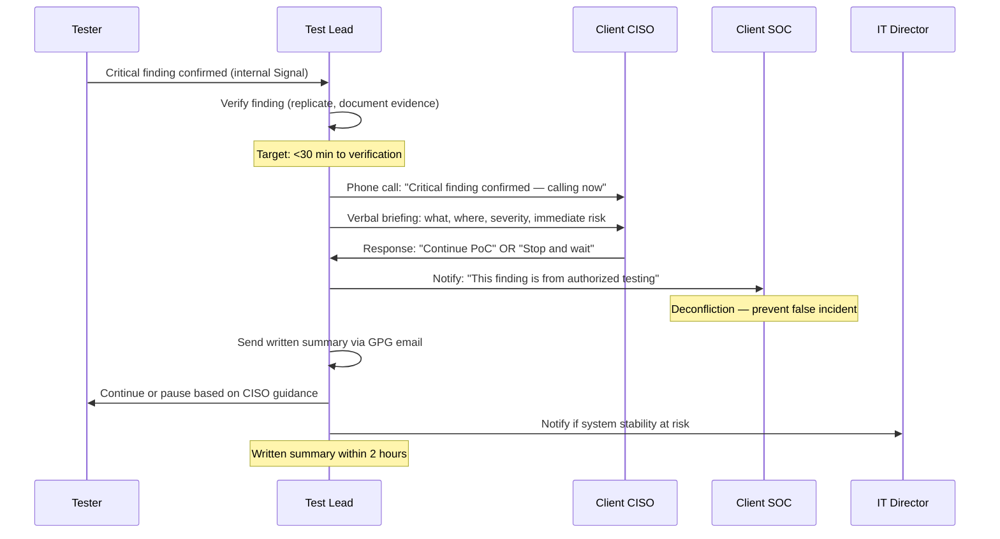
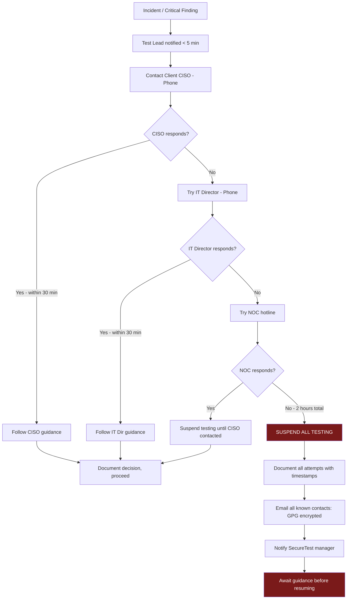
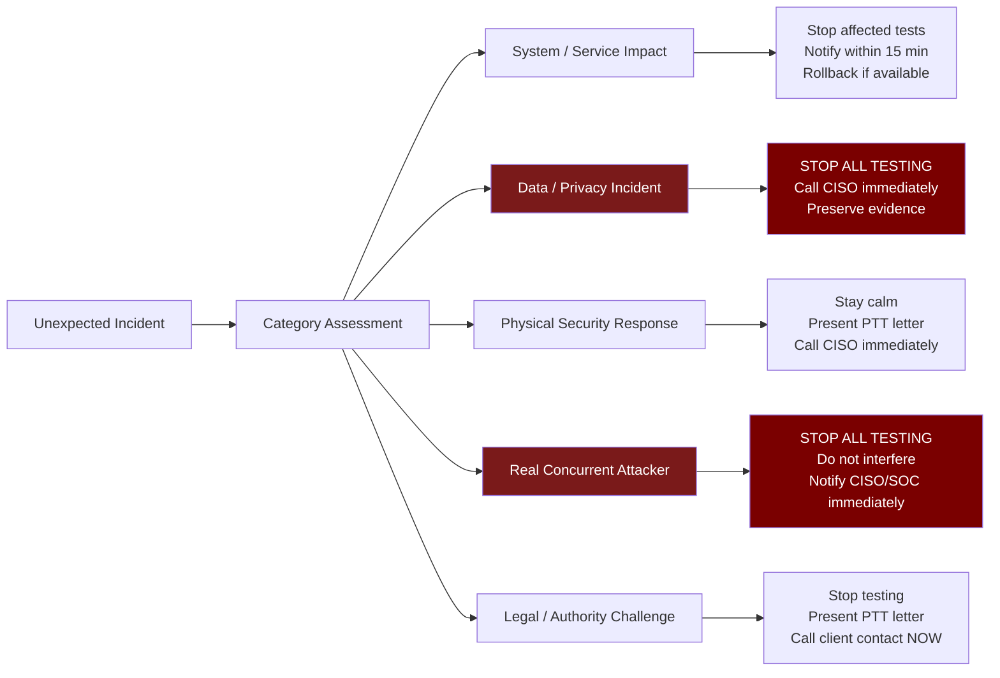

# Communication Protocol

> **Difficulty:** Beginner → Advanced | **Category:** Penetration Testing

Communication is the operational backbone of a professional penetration test. While hacking skills get the headlines, it is communication discipline — who gets notified, when, through what channel, with what information — that determines whether an engagement runs smoothly or devolves into panic, misunderstanding, and damaged client relationships. This document covers everything from the kickoff meeting agenda that sets expectations, to the minute-by-minute escalation procedure for a critical zero-day finding discovered at 11 PM, to the final debrief that turns technical findings into lasting organizational improvements. Every professional tester needs these protocols memorized and implemented.

---

## Table of Contents

1. [Communication Planning Overview](#overview)
2. [Kickoff Meeting](#kickoff)
3. [Communication Channels and Security](#channels)
4. [Status Reporting Cadence](#status-reports)
5. [Critical Finding Notification](#critical-findings)
6. [Emergency Escalation Path](#escalation)
7. [Deconfliction with Blue Team](#deconfliction)
8. [End-of-Day Status Reports](#eod-reports)
9. [Final Debrief Structure](#debrief)
10. [Handling Unexpected Incidents](#incidents)
11. [Sample Communication Plan Template](#template)

---

## Communication Planning Overview {#overview}

**Communication planning** for a penetration test engagement must answer five questions before testing begins:

1. **Who** needs to know what information?
2. **When** must they be notified?
3. **How** will communication occur (channel, format)?
4. **What** level of detail is shared with each stakeholder?
5. **What** triggers escalation to the next level?

```mermaid
graph TD
    subgraph TestingTeam["Testing Team"]
        TL[Test Lead]
        T1[Tester 1]
        T2[Tester 2]
        TM[Testing Manager / QA]
    end

    subgraph ClientTechnical["Client Technical"]
        CISO[CISO]
        ITDir[IT Director]
        SOC[SOC / Blue Team]
        DBA[DBA / SysAdmin On-Call]
    end

    subgraph ClientExecutive["Client Executive (if needed)"]
        CTO[CTO / CIO]
        Legal[Legal Counsel]
        CEO[CEO (critical only)]
    end

    T1 -->|Real-time findings| TL
    T2 -->|Real-time findings| TL
    TL -->|Daily status reports| CISO
    TL -->|Deconfliction| SOC
    TL -->|On-call support| DBA
    TL -.->|Critical findings only| CTO
    TL -.->|Legal issues only| Legal
    TL -.->|Business-critical only| CEO
    TM -->|QA review| TL
    CISO -->|Guidance and decisions| TL
    SOC -->|Blue team feedback| TL

    style TL fill:#1a4a7a,color:#fff
    style CISO fill:#1a5a1a,color:#fff
```

### Communication Protocol Hierarchy

| Stakeholder | Gets What | Frequency | Channel |
|---|---|---|---|
| Test Lead | All findings, real-time | Continuous | Team chat (encrypted) |
| Client CISO | Critical findings, daily status | Real-time (critical), Daily | Encrypted email, phone |
| SOC/Blue Team | Deconfliction, IOCs | Daily | Secure email, deconfliction call |
| IT Director | Service impact, system issues | As needed | Phone, email |
| DBA/SysAdmin | Database/system changes | Before high-risk tests | Phone |
| CTO/CIO | Business-critical findings only | As needed | Phone first |
| Client Legal | Legal/compliance findings | As needed | Encrypted email |
| Testing Manager | Engagement health | Daily | Team report |

---

## Kickoff Meeting {#kickoff}

The **kickoff meeting** is the single most important communication event of the engagement. Done well, it aligns expectations, establishes trust, and prevents every category of preventable incident. Done poorly, it creates misunderstandings that haunt the engagement.

### Kickoff Meeting Agenda

```
PENETRATION TEST KICKOFF MEETING AGENDA
=========================================
Engagement: ACME Corp External Assessment
Date: March 14, 2024 (day before testing starts)
Duration: 60-90 minutes
Format: Video call (recorded if client agrees) + shared screen
Attendees Required:
  Testing Firm:  Test Lead, Testing Manager
  Client:        CISO (required), IT Director (required),
                 SOC Lead (required), Legal rep (optional)

AGENDA ITEMS:
─────────────────────────────────────────────────────────────────

1. INTRODUCTIONS (5 minutes)
   □ Testing firm team introductions, credentials
   □ Client team introductions, roles during engagement
   □ Confirm all required attendees are present

2. SCOPE CONFIRMATION (10 minutes)
   □ Walk through signed scope document together
   □ Confirm in-scope IP ranges (verify each CIDR)
   □ Confirm in-scope domains (walk through wildcard implications)
   □ Confirm in-scope applications
   □ Review OUT-OF-SCOPE systems explicitly
   □ Any changes since scope was signed? → Amendment process
   □ Q&A: "Is there anything we should know about these systems?"

3. TECHNICAL LOGISTICS (15 minutes)
   □ Confirm authorized source IPs (client will whitelist)
   □ Timeline: start/end dates, testing hours
   □ VPN access for internal testing (if applicable)
   □ Test credentials: confirmed received? Any issues?
   □ Network access: any additional firewall rules needed?
   □ Confirm no scheduled maintenance that conflicts with testing

4. RULES OF ENGAGEMENT (10 minutes)
   □ Walk through authorized techniques
   □ Walk through PROHIBITED techniques
   □ Confirm pre-exploitation notification requirement (if any)
     (Some clients want notification before triggering critical CVEs)
   □ Production system testing guidelines
   □ Data handling: what happens if PII is found
   □ Confirm testing rate limits accepted

5. COMMUNICATION PROTOCOL (15 minutes)
   □ Introduce this communication plan document
   □ Confirm emergency contacts — TEST each number live on the call
     "Let's just do a quick dial test while we're together"
   □ Confirm stop phrase (client knows it, can activate it)
   □ Critical finding notification procedure
   □ Daily status report format and timing
   □ End-of-day check-in call: scheduled? or email only?
   □ Final debrief date/time agreed

6. DECONFLICTION WITH SOC (10 minutes)
   □ SOC Lead confirms they have been briefed on the engagement
   □ Confirm testing IP addresses are known to SOC
   □ Agreed procedure: what happens if SOC blocks test IPs?
   □ "Don't burn" agreement (SOC won't block test IPs during window)
   □ Shared indicator list protocol

7. RISK AND EMERGENCY PROCEDURES (10 minutes)
   □ High-risk activities: client aware and has accepted?
   □ Rollback plan confirmed for any production database testing
   □ DBA on-call contact confirmed
   □ What to do if a system goes down
   □ Incident report obligation review

8. Q&A AND CLOSE (5-10 minutes)
   □ Any client concerns?
   □ Any testing firm clarifications needed?
   □ Confirm: testing begins [Date] at [Time] [TZ]
   □ Confirm next scheduled communication: [first status report time]

POST-MEETING:
   □ Send meeting notes within 2 hours
   □ Any scope clarifications in writing within 24 hours
   □ Testing firm confirms all logistics are in order
```

### Pre-Kickoff Checklist

```bash
# Create pre-kickoff checklist file for engagement
cat > pre_kickoff_checklist.txt << 'EOF'
PRE-KICKOFF TECHNICAL CHECKLIST
================================
Complete before kickoff meeting

□ Scope document reviewed and signed
□ PTT letter reviewed and signed  
□ Test credentials received and validated:
    - Can log in to each application
    - Correct role/permission level
□ VPN credentials tested (if applicable)
□ Source IP confirmed: $(curl -s https://api.ipify.org)
□ Evidence directory created and encrypted
□ scope_validator.sh run — output saved
□ Team briefed on scope, rules, communication protocol
□ Emergency contacts saved in phone
□ GPG key for encrypted email obtained from client
□ Secure channel (Signal group) established with client POC
□ Cloud provider authorization confirmed (if cloud in scope)
□ Third-party authorization confirmed (if applicable)
□ Engagement tracking system set up
□ All tools tested and functional
□ Backup systems available if primary tool fails
EOF

cat pre_kickoff_checklist.txt
```

---

## Communication Channels and Security {#channels}

### Channel Security Requirements

> **Warning:** All communication containing vulnerability details, credentials, network information, or client-identifying information MUST use encrypted channels. Unencrypted email, Slack DMs, SMS, or plain HTTP file transfer are NEVER appropriate for engagement communications.

```
COMMUNICATION CHANNEL SECURITY MATRIX

Channel Type     | Acceptable For           | NOT Acceptable For
-----------------|--------------------------|------------------------------
Signal           | Real-time comms, alerts  | File transfer of reports
ProtonMail       | Daily status, findings   | Large file attachments
GPG-encrypted    | All written comms        | Unverified recipient key
email            | with verified client key |
SFTP (client)    | Report delivery          | Unverified server cert
Encrypted USB    | Final report delivery    | Unencrypted drives
Phone (voice)    | Critical verbal notif.   | Discussing specific vuln details
Zoom/Teams (E2E) | Status meetings          | Screen-sharing vuln details
                 |                          | on non-E2E calls
```

### Setting Up Secure Channels

```bash
# 1. GPG email encryption setup
# Get client contact's public key
gpg --keyserver keys.openpgp.org --recv-keys <CLIENT_KEY_ID>
# Or import from file:
gpg --import client_ciso_key.asc

# Verify the key fingerprint with client by phone (not email!)
gpg --fingerprint jsmith@acmecorp.com

# Send encrypted email (using mutt or thunderbird Enigmail)
# Or encrypt attachment:
gpg --recipient jsmith@acmecorp.com \
  --encrypt \
  --armor \
  daily_status_2024-03-16.pdf

# 2. Signal for real-time communications
# Create a Signal group with:
#   - Test Lead
#   - Testing Manager
#   - Client CISO
#   - Client IT Director
# Group name: "[Engagement ID] - Secure Comms"
# Enable disappearing messages: 1 week

# 3. SFTP for report delivery
# Client provides SFTP server or use:
sftp -i ~/.ssh/pentest_rsa pentest@sftp.acmecorp.com << 'EOF'
put final_report_ACME-2024-003_DRAFT.pdf.gpg /deliverables/
put final_report_ACME-2024-003_DRAFT.pdf.gpg.sha256 /deliverables/
bye
EOF

# 4. Send hash separately (different channel) for integrity verification
echo "Report SHA-256 hash (verify against file received):"
sha256sum final_report_ACME-2024-003_DRAFT.pdf.gpg
# Send this via Signal or phone
```

---

## Status Reporting Cadence {#status-reports}

### Daily Communication Schedule

```
DAILY COMMUNICATION SCHEDULE — EXTERNAL ASSESSMENT
====================================================
Testing Hours: 08:00–18:00 EST

08:00  Start-of-day check — Test Lead confirms team online, scope refreshed
       Signal message to CISO: "Engagement Day [X] active. No issues."

10:00  Morning status — verbal or Signal update
       Format: "Tested [X] so far today. [Y notable observations]. No critical."

12:00  Midday check-in (optional if no notable findings)
       Skip if nothing notable to report

15:00  Afternoon status — significant findings noted
       Format: "Afternoon update: [Finding summary]. Plan for rest of day: [X]."

17:30  End-of-day report sent via encrypted email (see EOD template below)

18:00  Testing ceases for the day
       Signal message to CISO: "Day [X] testing complete. EOD report sent."

WEEKLY (for engagements >1 week):
  Friday afternoon: Midpoint status call (30 min)
  Format: Progress review, finding preview, next week priorities
```

### Status Report Template

```
DAILY STATUS REPORT — PENETRATION TESTING
==========================================
[ACME Corp Assessment — CONFIDENTIAL — ENCRYPTED]

Engagement:       ACME Corp External Assessment
Engagement ID:    ACME-2024-003
Report Date:      March 16, 2024
Reporting Period: March 16, 2024 08:00–18:00 EST
Test Lead:        Jane Tester
Report Number:    Day 2 of 7

═══ EXECUTIVE SUMMARY ═══════════════════════════════════════

Testing progressed on schedule today. Two significant vulnerabilities
were identified requiring client attention. No production impact
occurred. Testing resumed tomorrow at 08:00 EST.

═══ PROGRESS ════════════════════════════════════════════════

Targets tested today:
  ✓ www.acmecorp.com         — Complete (no critical findings)
  ✓ app.acmecorp.com         — Complete (see F-002 below)
  ✓ api.acmecorp.com/v1      — In progress (~60% complete)
  ○ api.acmecorp.com/v2      — Scheduled for Day 3
  ○ admin.acmecorp.com       — Scheduled for Day 3

Overall engagement progress: 35% of planned scope

═══ FINDINGS IDENTIFIED TODAY ══════════════════════════════

F-001 | MEDIUM | Information Disclosure — www.acmecorp.com
  Status: Confirmed
  Summary: Server version and framework disclosed in HTTP headers.
           Nginx 1.20.1 and PHP 8.1.2 visible in Server/X-Powered-By.
  Business risk: Low (facilitates further targeted attacks)
  Client action needed: No immediate action required.

F-002 | HIGH | Broken Access Control — app.acmecorp.com/api/users
  Status: Confirmed — awaiting pre-exploitation approval from CISO
  Summary: Authenticated low-privilege user can access /api/users endpoint
           and enumerate all user accounts. IDOR vulnerability on user IDs.
  Business risk: Customer PII exposure (names, emails, account details)
  Client action needed: CISO: Please confirm authorization to proceed
           with exploitation PoC for severity confirmation (reply by 09:00 Day 3)

NOTE: Per rules of engagement, HIGH and CRITICAL findings require
client confirmation before full exploitation PoC is executed.

═══ INCIDENTS / ANOMALIES ══════════════════════════════════

None today.

═══ TOMORROW'S PLAN ════════════════════════════════════════

  - Complete API v1 testing
  - Begin API v2 and admin.acmecorp.com
  - Execute F-002 exploitation PoC upon CISO confirmation
  - Estimated progress by end of Day 3: 55% of planned scope

═══ ACTION ITEMS ════════════════════════════════════════════

  For CISO (John Smith):
  [ ] Confirm F-002 exploitation authorization by 09:00 Day 3

  For Testing Team:
  [ ] Complete API v1 testing before starting API v2
  [ ] Review admin.acmecorp.com application documentation if available

═══ ATTACHMENTS ════════════════════════════════════════════

  Attached (GPG encrypted): daily_evidence_day2.tar.gz.gpg
  No attachments for status report (full evidence in final report)

─────────────────────────────────────────────────────────────
SecureTest LLC | Confidential Engagement Communication
Encrypt at rest | Delete per data handling agreement | Handle as CONFIDENTIAL
```

---

## Critical Finding Notification {#critical-findings}

**Critical finding notification** is the most time-sensitive communication in penetration testing. When a critical vulnerability is discovered — active exploitation, authentication bypass, remote code execution, exposed production data — the clock starts immediately.

### Severity Classification for Notification

```
FINDING SEVERITY → NOTIFICATION REQUIREMENT

CRITICAL (CVSS 9.0-10.0) — Examples:
  - Remote code execution on production server
  - Authentication bypass to admin panel
  - SQL injection exposing customer PII
  - Exposed plaintext credentials for privileged accounts
  - Public S3 bucket containing sensitive business data
  - Payment card data accessible without authentication
  
  NOTIFICATION REQUIREMENT:
  ⏱ Verbal (phone): WITHIN 1 HOUR of confirmation
  📧 Written summary: WITHIN 2 HOURS
  ⏸ PAUSE testing on affected system pending client response

HIGH (CVSS 7.0-8.9) — Examples:
  - Privilege escalation to admin/root
  - Stored XSS in application used by many users
  - IDOR exposing user account data
  - Outdated software with known exploits
  
  NOTIFICATION REQUIREMENT:
  📧 Written notification in same-day status report
  📞 Phone call if finding requires immediate remediation
  ▶ Continue testing unless client requests pause

MEDIUM (CVSS 4.0-6.9):
  Included in daily status report
  No special notification procedure

LOW (CVSS 0.1-3.9):
  Included in final report
  Mentioned in relevant daily status report if notable
```

### Critical Finding Notification Procedure



### Critical Finding Phone Script

```
CRITICAL FINDING PHONE NOTIFICATION SCRIPT
============================================
For use when calling client CISO with a critical finding

BEFORE CALLING:
  1. Verify the finding is real (at least 2 confirmations)
  2. Have evidence ready (screenshot, request/response)
  3. Know: What system, what vulnerability, what data at risk
  4. Know: Is exploitation already complete, or just confirmed?

THE CALL:
─────────────────────────────────────────────────────────────
"Hi John, this is Jane from SecureTest. This is a critical 
 finding notification per our communication protocol.
 
 I have confirmed a [vulnerability type] on [system name].
 
 Specifically: [one sentence, plain English description]
 Example: "An authentication bypass on admin.acmecorp.com 
           allows anyone on the internet to log in as any 
           admin user without a password."
 
 At this point I have [confirmed the vulnerability exists /
 confirmed the vulnerability and obtained a shell / 
 obtained a shell and accessed the users table].
 
 Per our rules of engagement, I am pausing exploitation
 of this system and waiting for your guidance.
 
 Do you want me to:
   A) Continue with full PoC exploitation to confirm impact
   B) Stop at this point and document as confirmed critical
   C) Stop all testing while you review
 
 I will send you a written summary within 2 hours.
 What email should I use? [confirm GPG-encrypted email address]
 
 Any questions about what I found?"
─────────────────────────────────────────────────────────────

POST-CALL:
  1. Document the call: time, who spoke, what was decided
  2. Send written summary within 2 hours (GPG encrypted)
  3. Update engagement notes with CISO's decision
  4. If CISO was unreachable: try secondary contact
     If both unreachable: PAUSE testing, attempt every 30 minutes
```

### Written Critical Finding Summary Template

```
CRITICAL FINDING IMMEDIATE NOTIFICATION
[CONFIDENTIAL — ENCRYPTED — TIME SENSITIVE]

Engagement:     ACME Corp External Assessment (ACME-2024-003)
Finding ID:     F-007-CRITICAL
Date/Time:      March 18, 2024 14:47 EST
Reported by:    Jane Tester, SecureTest LLC
Reported to:    John Smith, CISO, ACME Corporation

FINDING SUMMARY
────────────────
Vulnerability:  Authentication Bypass — admin.acmecorp.com
Severity:       CRITICAL (CVSS v3.1: 9.8)
CVSS Vector:    CVSS:3.1/AV:N/AC:L/PR:N/UI:N/S:U/C:H/I:H/A:H
Status:         Confirmed — exploitation paused per RoE

DESCRIPTION
────────────
The administrative interface at https://admin.acmecorp.com/login
does not verify session tokens server-side after initial
authentication. By replaying a captured session cookie with the
`admin=true` parameter, unauthenticated access to the full
administrative dashboard is possible from any IP address.

PROOF OF CONCEPT (partial)
────────────────────────────
Request:
  GET /dashboard HTTP/1.1
  Host: admin.acmecorp.com
  Cookie: session=<any valid token>; admin=true

Result: Full administrative access granted, user management
visible, 847 active customer records accessible.

[Full request/response available. Not including in this email
 due to data sensitivity — available in final report.]

BUSINESS IMPACT
───────────────
Any unauthenticated internet user could:
  1. Access all customer account data (estimated 847 accounts visible)
  2. Modify or delete customer accounts
  3. Access administrative configuration settings
  4. Potentially pivot to internal systems via admin functions

IMMEDIATE RECOMMENDATIONS
──────────────────────────
  1. URGENT: Disable public access to admin.acmecorp.com immediately
     or restrict to authorized IP addresses (VPN-only access)
  2. Invalidate all current admin session tokens
  3. Implement server-side session validation

CURRENT STATUS
──────────────
Per our rules of engagement, full exploitation PoC has been paused.
Testing on admin.acmecorp.com is suspended pending your guidance.
All other in-scope systems continue to be tested normally.

Please respond with your decision by [2 hours from this email]:
  A) Authorize full PoC exploitation to confirm additional impact
  B) Mark as confirmed critical and proceed without further exploitation
  C) Suspend all testing pending your review

─────────────────────────────────────────────────────────────────
SecureTest LLC | Jane Tester | jane@securetest.com | PGP: [KEY ID]
```

---

## Emergency Escalation Path {#escalation}

### Escalation Trigger Matrix

| Situation | Primary Contact | Secondary | Escalate To | Time Limit |
|---|---|---|---|---|
| Critical vulnerability found | CISO (call) | IT Director | CTO if CISO unavailable | 1 hour |
| Production system down | CISO + IT Director | NOC | N/A | 15 minutes |
| PII/PHI data accessed | CISO + Legal | Privacy Officer | CEO if breach reportable | Immediate |
| Physical security response | CISO (call) | HR | N/A | Immediate |
| Real attacker concurrent | CISO + SOC | IR Team | N/A | Immediate |
| OOS contact with data access | CISO (call) + Legal | N/A | N/A | 30 minutes |
| Tester safety concern | SecureTest Manager | Legal | N/A | Immediate |
| Tester unable to reach client | Test Lead → Manager | Try all contacts | Suspend testing | 2 hours |

### Escalation Path Diagram



### Escalation Log Template

```bash
# Maintain an escalation log during any incident
cat >> escalation_log.txt << EOF
=== ESCALATION LOG ENTRY ===
Date/Time: $(date -u +"%Y-%m-%d %H:%M:%S UTC")
Incident:  [Brief description]
Tester:    Jane Tester

Attempt 1: Called John Smith (CISO) +1(512)555-0100 at [time]
  Result:  [No answer / Reached, briefed / Voicemail left]

Attempt 2: Called Sarah Jones (IT Dir) +1(512)555-0101 at [time]
  Result:  [No answer / Reached, briefed / Voicemail left]

Attempt 3: Called NOC +1(512)555-0911 at [time]
  Result:  [No answer / Reached, briefed]

Testing status: [Suspended / Paused on affected system / Continuing]
Decision:  [What was decided, by whom, at what time]

Next step: [What happens next]
EOF
```

---

## Deconfliction with Blue Team {#deconfliction}

**Deconfliction** is the process of ensuring the client's security operations team (SOC, blue team, SIEM analysts) knows that anomalous activity they observe is from the authorized penetration test, not a real attack.

> **Note:** Deconfliction is a deliberate, planned activity — not just "tell the SOC you're testing." Done properly, it ensures the SOC can still observe test activity (for their own detection validation) while not burning incident response resources on false positives.

### Deconfliction Models

```
DECONFLICTION MODEL COMPARISON

MODEL 1: FULL BLIND (No Deconfliction)
  ─────────────────────────────────────
  SOC knows:   Nothing — testing is completely covert
  Use case:    Red team engagements testing SOC detection capability
  Risk:        SOC declares real incident, may block testing
               CISOs may be surprised if incident report filed
  When to use: Only when testing SOC detection specifically, and
               CISO is separately briefed

MODEL 2: PARTIAL DECONFLICTION (Recommended for most engagements)
  ─────────────────────────────────────────────────────────────────
  SOC knows:   Testing is happening, general time window
  SOC does NOT know: Source IPs (to maintain semi-realistic conditions)
  Use case:    Standard penetration tests where detection is secondary
  Risk:        SOC may block source IPs if activity is very noisy
  Benefit:     SOC doesn't waste resources on false incidents

MODEL 3: FULL DECONFLICTION (Low-noise engagements)
  ────────────────────────────────────────────────────
  SOC knows:   Testing is happening, source IPs, testing hours
  SOC has:     Whitelist of test IPs (no blocking)
  Use case:    Vulnerability assessments, compliance testing
               Time-sensitive engagements where blocks would be costly
  Risk:        May miss detection testing opportunity
  Benefit:     No false incident response, no blocking of test activity
```

### Deconfliction Meeting Agenda

```
DECONFLICTION CALL — SOC BRIEFING
===================================
Duration: 20-30 minutes
Attendees: Test Lead, SOC Lead, CISO

1. PURPOSE (2 min)
   "We are here to deconflict our testing activity from real attacker activity.
    We want you to be able to do your job without wasting resources on us."

2. WHAT SOC WILL SEE (10 min)
   - Port scans from: [source IPs] — expected
   - HTTP(S) requests with unusual parameters — expected
   - Authentication attempts from [source IPs] — expected
   - Potential exploit attempts against [target apps] — expected
   - DNS queries for [domain names] — expected
   
   SOC should NOT see:
   - Traffic from any other source IPs (would be real attacker)
   - Activity outside [time window]
   - Traffic to [OOS systems]

3. WHAT TO DO IF SOMETHING LOOKS WRONG (10 min)
   If SOC sees traffic from our test IPs that:
   - Targets OOS systems → Call Test Lead immediately
   - Occurs outside hours → Call Test Lead immediately
   - Causes outage → Call Test Lead immediately
   
   If SOC sees traffic from OTHER IPs that looks malicious:
   - This is likely a real attacker — do NOT assume it's us
   - Follow normal incident response
   - Notify Test Lead: "Is this you? Source IP: X.X.X.X"

4. SHARED ARTIFACTS
   □ Testing source IPs (whitelist for blocking, not for alerting)
   □ Testing time window
   □ Daily start/stop confirmation (Test Lead will message SOC lead daily)
   □ IOC list of test-generated artifacts (Nmap signatures, tool UA strings)

5. AGREEMENT
   □ SOC will NOT block test source IPs during testing window
   □ SOC WILL alert Test Lead if they see any concerning OOS activity
   □ Test Lead will send daily confirmation of active testing
   □ Mutual stop: either party can escalate to CISO to pause testing
```

### Daily SOC Deconfliction Message

```
DAILY DECONFLICTION MESSAGE (send via pre-agreed channel)
==========================================================
Template — send at START and END of each testing day

START OF DAY:
  "Day [X] penetration testing is active.
   Testing hours today: 08:00–18:00 EST
   Source IPs: 192.0.2.10, 192.0.2.11
   Today's target areas: [app.acmecorp.com, api.acmecorp.com]
   Any questions, contact Jane at +1(415)555-0200"

END OF DAY:
  "Day [X] penetration testing complete for today.
   All testing activity from our source IPs has ceased as of 18:00 EST.
   Any activity from our IPs after this time should be flagged immediately.
   Next testing day: [Tomorrow/Monday] starting at 08:00 EST"
```

---

## End-of-Day Status Reports {#eod-reports}

End-of-day reports keep the client continuously informed and demonstrate professional engagement management. They also create a documented record that protects both parties.

### EOD Report Delivery Checklist

```bash
#!/bin/bash
# eod_report_generator.sh — Framework for daily EOD report

ENGAGEMENT="ACME-2024-003"
DATE=$(date +%Y-%m-%d)
DAY_NUM="$1"  # Passed as argument: ./eod_report_generator.sh 3

cat > "eod_report_${ENGAGEMENT}_day${DAY_NUM}_${DATE}.md" << 'TEMPLATE'
# End-of-Day Status Report
**Engagement:** ACME Corp External Assessment  
**Date:** {{DATE}}  
**Day:** Day {{DAY_NUM}} of 7  
**Testing Hours:** {{START_TIME}} – {{END_TIME}} EST  

## Today's Activity
| Target | Status | Findings |
|--------|--------|----------|
| app.acmecorp.com | Complete | F-001 (Medium) |
| api.acmecorp.com/v1 | 80% Complete | None |
| api.acmecorp.com/v2 | Not Started | — |

## Findings Summary
| ID | Severity | Location | Summary |
|----|----------|----------|---------|
| F-001 | Medium | www.acmecorp.com | Server version disclosure |
| F-002 | High | app.acmecorp.com | IDOR on user endpoint |

## Tomorrow's Plan
1. Complete API v1 testing
2. Begin API v2 and admin panel
3. Execute F-002 PoC (pending CISO confirmation)

## Action Items
**Client:** Confirm F-002 exploitation authorization by 09:00 Day 4  
**Tester:** Complete scope coverage before Friday deadline

## Issues / Blockers
None today.

---
*Confidential — GPG encrypted — Handle per Data Handling Agreement*
TEMPLATE

# Encrypt the report
gpg --recipient jsmith@acmecorp.com \
  --encrypt --armor \
  "eod_report_${ENGAGEMENT}_day${DAY_NUM}_${DATE}.md"

echo "EOD report created and encrypted for: jsmith@acmecorp.com"
```

---

## Final Debrief Structure {#debrief}

The **final debrief** is the culminating communication event. Done well, it transforms a list of vulnerabilities into organizational learning and a roadmap to improved security.

### Debrief Meeting Agenda

```
FINAL DEBRIEF MEETING AGENDA
===============================
Engagement: ACME Corp External Assessment
Timing: 2–5 business days after draft report delivery
Duration: 90–120 minutes
Attendees:
  Testing Firm: Test Lead, Testing Manager
  Client: CISO (required), CTO/CIO, IT Director, SOC Lead,
          Application owners for affected systems (if applicable),
          Legal (if compliance findings present)

AGENDA:
───────────────────────────────────────────────────────────────

1. EXECUTIVE SUMMARY WALKTHROUGH (20 minutes)
   • Overall security posture summary
   • Attack narrative: how an attacker could move through the environment
   • Risk quantification (critical/high/medium/low counts)
   • Most impactful findings in plain business language
   • Comparison to industry benchmarks (if applicable)
   
2. CRITICAL AND HIGH FINDINGS DEEP DIVE (40 minutes)
   For each Critical/High finding:
   • Demo (live or recorded video) — seeing is believing
   • Root cause explanation: why did this vulnerability exist?
   • Business impact in concrete terms (not "attacker could...")
   • Remediation recommendation with specific steps
   • Remediation complexity: quick win vs. architectural change
   • Q&A per finding
   
3. MEDIUM AND LOW FINDINGS OVERVIEW (15 minutes)
   • Walk through findings table
   • Highlight any patterns (e.g., "version disclosure found in 12 places")
   • Systemic issues that cause multiple findings

4. ATTACK PATH DISCUSSION (15 minutes)
   • Full attack chain walkthrough
   • "If a real attacker had done this, here is what they could achieve"
   • Crown jewels at risk: what was accessible?

5. REMEDIATION ROADMAP (15 minutes)
   • Quick wins (< 1 week effort)
   • Medium-term priorities (1 month)
   • Long-term architectural improvements
   • Recommended order of remediation

6. RETESTING AND VERIFICATION (10 minutes)
   • What is included in remediation verification?
   • Scheduling retesting (if included in SOW)
   • How client confirms fixes before retesting

7. Q&A AND CLOSE (10 minutes)
   • Any findings requiring clarification?
   • Report finalization timeline
   • Data destruction schedule
   • Future testing recommendations
```

---

## Handling Unexpected Incidents {#incidents}

### Unexpected Incident Categories



### Real Attacker Detection Procedure

```
IF YOU DISCOVER EVIDENCE OF A REAL CONCURRENT ATTACKER:
=========================================================

IMMEDIATE ACTIONS:
1. STOP all testing immediately
2. Do NOT tip off the attacker (don't modify logs, don't block their access)
3. Preserve all evidence you have already collected

NOTIFY WITHIN 15 MINUTES:
4. Call Client CISO: "During testing I found evidence of activity that
   does not appear to be from our testing. I'm stopping all testing.
   This may be a real attacker. I need to brief you now."

5. Provide exact indicators:
   - Source IP(s) of suspicious activity
   - Target systems involved
   - Type of activity observed
   - When you first observed it
   - Whether the activity succeeded (if determinable)

EVIDENCE PRESERVATION:
6. Capture current state of any affected systems (if possible)
7. Preserve your own logs showing you did NOT conduct the suspicious activity
8. Document timeline: when you were testing vs. when suspicious activity started

DO NOT:
  ✗ Continue testing (you are now potentially interfering with a real incident)
  ✗ Try to track or identify the attacker yourself
  ✗ Alert the attacker by modifying the environment
  ✗ Access systems you haven't already been authorized to access

WAIT FOR CLIENT DECISION:
  The client's incident response team handles it from here.
  Your role: witness and information source, not incident responder.
  Testing may resume after client IR team clears the environment.
```

### Physical Security Challenge Response

```
PHYSICAL SECURITY CHALLENGE SCRIPT
=====================================
Scenario: You are stopped by security, facility management,
          or law enforcement during an on-site assessment.

STEP 1: REMAIN CALM
  - Stop what you are doing
  - Keep hands visible
  - Speak clearly and professionally

STEP 2: IDENTIFY YOURSELF
  "My name is [Name]. I am a security consultant with SecureTest LLC.
   I am conducting an authorized security assessment for ACME Corporation.
   I have documentation of this authorization."

STEP 3: PRODUCE DOCUMENTATION
  - Present printed and digital copy of Permission to Test letter
  - Present your identification (driver's license or passport)
  - Do NOT hand over laptop or devices unless legally compelled

STEP 4: CALL CLIENT CONTACT IMMEDIATELY
  "I am calling my client contact right now to confirm this authorization."
  Call: John Smith (CISO) +1 (512) 555-0100
  If John is unavailable: Sarah Jones +1 (512) 555-0101

STEP 5: ALLOW CLIENT TO SPEAK
  Hand phone to security/law enforcement
  Let client confirm authorization directly

STEP 6: IF DETAINED BY LAW ENFORCEMENT
  "I understand. I am not resisting. I would like to call my attorney."
  Call: SecureTest legal line: +1 (415) 555-0350
  Do not speak further about the engagement without counsel present.
  Do not consent to device search without counsel.
```

---

## Sample Communication Plan Template {#template}

### Complete Communication Plan Document

```markdown
PENETRATION TEST COMMUNICATION PLAN
=====================================
Engagement:    ACME Corp External Assessment
Engagement ID: ACME-2024-003
Version:       1.0 (final, approved 2024-03-10)

━━━ SECTION 1: STAKEHOLDERS ━━━━━━━━━━━━━━━━━━━━━━━━━━━━━━━━

TESTING TEAM
  Jane Tester (Lead)  | jane@securetest.com    | +1(415)555-0200 | Signal: +14155550200
  Bob Analyst         | bob@securetest.com     | +1(415)555-0201 | Signal: +14155550201
  Tom Director (Mgr)  | tom@securetest.com     | +1(415)555-0300 | Signal: +14155550300

CLIENT TEAM
  John Smith (CISO)   | jsmith@acmecorp.com    | +1(512)555-0100 | Primary
  Sarah Jones (ITDir) | sjones@acmecorp.com    | +1(512)555-0101 | Secondary
  NOC Hotline         | noc@acmecorp.com       | +1(512)555-0911 | 24/7 operations
  Mike Chen (SOC)     | mchen@acmecorp.com     | +1(512)555-0102 | Deconfliction
  Michael Brown (Legal)| mbrown@acmecorp.com   | +1(512)555-0150 | Legal issues only

━━━ SECTION 2: COMMUNICATION CHANNELS ━━━━━━━━━━━━━━━━━━━━━━━

Channel             | Platform    | Used For                   | Security Level
--------------------|-------------|----------------------------|---------------
Real-time comms     | Signal      | Alerts, quick questions    | High (E2E encrypted)
Daily status reports| GPG Email   | Formal status, findings    | High (encrypted)
Critical findings   | Phone first,| Critical vulnerability     | Verbal + encrypted email
                    | then email  | notification               |
File delivery       | SFTP        | Report delivery            | TLS in transit
Kickoff/debrief     | Zoom (E2E)  | Formal meetings            | Medium

━━━ SECTION 3: REPORTING SCHEDULE ━━━━━━━━━━━━━━━━━━━━━━━━━━

Daily:  End-of-day status report via GPG email by 18:30 EST
Weekly: Midpoint call on Day 4 (Friday March 19) — 30 minutes

━━━ SECTION 4: FINDING NOTIFICATION PROCEDURES ━━━━━━━━━━━━━━

CRITICAL  → Phone call within 1 hour, written summary within 2 hours
            PAUSE testing on affected system until CISO responds
HIGH      → Same-day status report; phone if immediate action needed
MEDIUM    → Daily EOD report
LOW       → Final report only

━━━ SECTION 5: EMERGENCY ESCALATION ━━━━━━━━━━━━━━━━━━━━━━━━

Event                    | Primary     | Time Limit | Action if no response
-------------------------|-------------|------------|----------------------
Production system down   | CISO (call) | 15 min     | Suspend testing
Data exposure            | CISO (call) | Immediate  | STOP ALL TESTING
OOS contact              | CISO (call) | 30 min     | Suspend and wait
Real attacker suspected  | CISO + SOC  | 15 min     | STOP ALL TESTING
Physical challenge       | CISO (call) | Immediate  | Present PTT letter

If CISO unreachable: → IT Director → NOC → Suspend testing

━━━ SECTION 6: DECONFLICTION ━━━━━━━━━━━━━━━━━━━━━━━━━━━━━━━

Model: Partial deconfliction
SOC lead (Mike Chen) briefed: March 14, 2024
Test source IPs shared with SOC: 192.0.2.10, 192.0.2.11
Daily SOC notification: Signal message to Mike Chen at start/end of each day
SOC agreement: Will not block test IPs; will alert Test Lead if OOS activity seen

━━━ SECTION 7: STOP PHRASE ━━━━━━━━━━━━━━━━━━━━━━━━━━━━━━━━━

"BRAVO STOP" — All testing ceases within 5 minutes of receipt
Communicated by: Any authorized client contact via any channel

━━━ SECTION 8: FINAL DELIVERABLES ━━━━━━━━━━━━━━━━━━━━━━━━━━

Draft report:   March 25, 2024 — Encrypted email to John Smith
Review period:  5 business days (client returns comments by March 30)
Final report:   April 2, 2024 — SFTP delivery + encrypted email
Debrief:        April 3, 2024, 10:00 EST — Zoom (E2E)
Data destruction: May 2, 2024 (30 days post-delivery)

━━━ SECTION 9: ACKNOWLEDGMENT ━━━━━━━━━━━━━━━━━━━━━━━━━━━━━

Testing Firm Lead:  _________________ Date: _________
Client CISO:        _________________ Date: _________
```

> **Note:** This communication plan should be reviewed and signed at the kickoff meeting. It is a living document — update it immediately when contacts change, when scope is amended, or when communication procedures are modified by mutual agreement.

> **Warning:** Communication breakdowns are the primary cause of engagement failures that are not technical. Test Lead contact numbers must be reachable 24/7 during the engagement window. A Test Lead whose phone is off during a critical finding situation has failed professionally.

---

*Last updated: 2024 | Category: Engagement Planning | Previous: [Risk Management](./risk-management.md) | Start: [Scope Definition](./scope-definition.md)*
