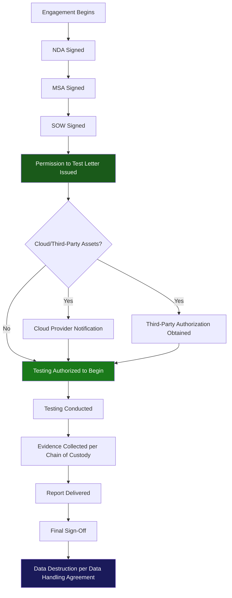
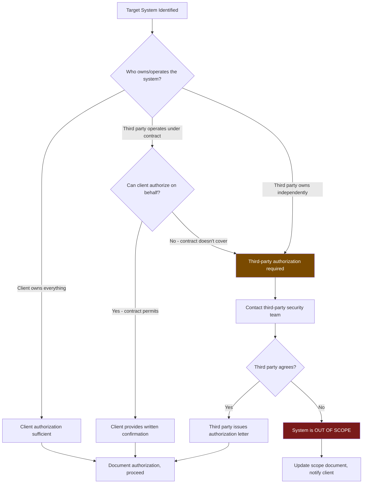

# Legal Authorizations

> **Difficulty:** Beginner → Advanced | **Category:** Penetration Testing

Legal authorization is the foundation upon which every penetration test stands. Without proper documentation, skilled hackers become criminals — the only difference between a penetration tester and a criminal hacker is written permission. This document covers every legal instrument involved in a professional engagement: from the initial NDA that protects both parties, through the Statements of Work that define deliverables, to the critical Permission to Test letter that authorizes the actual hacking. It also covers cloud provider authorization requirements, third-party system handling, the treatment of personally identifiable information (PII), and the chain of custody for evidence collected during testing.

---

## Table of Contents

1. [Legal Document Overview](#overview)
2. [Non-Disclosure Agreement (NDA)](#nda)
3. [Master Services Agreement (MSA)](#msa)
4. [Statement of Work (SOW)](#sow)
5. [Permission to Test Letter](#ptt)
6. [Cloud Provider Authorization](#cloud-auth)
7. [Third-Party Authorization](#third-party)
8. [Handling PII and Sensitive Data](#pii)
9. [Sample Contract Clauses](#sample-clauses)
10. [Chain of Custody for Evidence](#chain-of-custody)

---

## Legal Document Overview {#overview}

A complete penetration testing engagement requires a layered set of legal documents. Each serves a distinct purpose and protects different interests.



### Document Hierarchy and Purpose

| Document | Who Signs | When | Primary Purpose |
|---|---|---|---|
| **NDA** | Both parties | Before any discussion | Protect confidential information |
| **MSA** | Both parties | Before SOW | Legal terms governing all work |
| **SOW** | Both parties | Per engagement | Specific work, timeline, deliverables |
| **Permission to Test** | Client system owner | Before testing | Legal authorization to attack systems |
| **Cloud Authorization** | Cloud provider portal | Before testing cloud | Comply with provider AUP |
| **Third-Party Auth** | Third-party owner | Before testing | Separate authorization for third-party systems |
| **Data Handling Agreement** | Both parties | With SOW or MSA | Define how sensitive data is handled |

> **Warning:** The permission to test letter is NOT optional. A signed SOW alone is not sufficient legal authorization for penetration testing in most jurisdictions. You need explicit written authorization from the **system owner** — the entity that has legal responsibility for the systems being tested.

---

## Non-Disclosure Agreement (NDA) {#nda}

The **Non-Disclosure Agreement** protects confidential information shared during the engagement. It is mutual — protecting both the client's business secrets and the tester's proprietary methodologies.

### What an NDA Must Cover in Pentesting

```
NDA ESSENTIAL ELEMENTS — PENETRATION TESTING
=============================================

1. DEFINITION OF CONFIDENTIAL INFORMATION
   Must explicitly include:
   - Network architecture and topology
   - Vulnerability findings (discovered during testing)
   - Client business information shared during scoping
   - Tester's proprietary tools and methodologies
   - All deliverables (reports, PoC code, screenshots)
   - Any credentials provided for testing

2. PERMITTED DISCLOSURE
   Must explicitly permit:
   - Disclosure to testing team members under same NDA terms
   - Disclosure required by law (subpoena, court order)
   - Disclosure to law enforcement if criminal activity discovered

3. DURATION
   Industry standard: 2–5 years after engagement completion
   For vulnerability data: 2 years minimum

4. RETURN/DESTRUCTION OF INFORMATION
   All confidential data returned or destroyed within [X days]
   of engagement completion, with written certification

5. REMEDIES
   Acknowledge that breach causes irreparable harm
   Permit injunctive relief without bond

6. CARVE-OUTS (what is NOT confidential)
   - Information already publicly known
   - Information independently developed
   - Information received from third party without restriction
```

### Sample NDA Clause — Findings Confidentiality

```
SAMPLE NDA CLAUSE: VULNERABILITY DISCLOSURE

Section 4.3 — Security Findings

All vulnerabilities, weaknesses, configuration errors, and security
deficiencies discovered during the Engagement ("Security Findings")
are deemed Confidential Information of Client and are subject to the
full protections of this Agreement.

Vendor shall not:
  (a) Publish, disclose, or share Security Findings with any party
      other than Client's authorized representatives;
  (b) Use Security Findings for any purpose other than preparation
      of the deliverables specified in the applicable Statement of Work;
  (c) Retain copies of Security Findings beyond the data retention
      period specified in the applicable Data Handling Agreement.

Notwithstanding the foregoing, Vendor may retain aggregated,
anonymized statistical data about vulnerability classes found across
engagements for the purpose of improving Vendor's methodologies,
provided that no information identifying Client or Client's specific
systems is retained.

Coordinated Vulnerability Disclosure: If Vendor discovers a
vulnerability that poses an imminent threat to public safety or
involves a third-party software product, Vendor shall notify Client
before any disclosure and coordinate with Client on any disclosure
to affected third parties or public disclosure under responsible
disclosure practices.
```

---

## Master Services Agreement (MSA) {#msa}

The **Master Services Agreement** is the umbrella contract governing all work between the testing firm and the client. It is negotiated once and applies to all subsequent engagements, with individual SOWs defining the specifics of each project.

### Critical MSA Clauses for Penetration Testing

#### Limitation of Liability

```
SAMPLE MSA CLAUSE: LIMITATION OF LIABILITY

Section 12 — Limitation of Liability

12.1 EXCLUSION OF CONSEQUENTIAL DAMAGES
NEITHER PARTY SHALL BE LIABLE TO THE OTHER FOR ANY INDIRECT,
INCIDENTAL, SPECIAL, CONSEQUENTIAL, OR PUNITIVE DAMAGES, INCLUDING
LOSS OF PROFITS, LOSS OF DATA, OR BUSINESS INTERRUPTION, ARISING
OUT OF OR RELATED TO THIS AGREEMENT OR ANY SOW, EVEN IF SUCH PARTY
HAS BEEN ADVISED OF THE POSSIBILITY OF SUCH DAMAGES.

12.2 LIABILITY CAP
VENDOR'S TOTAL CUMULATIVE LIABILITY TO CLIENT ARISING OUT OF OR
RELATED TO ANY SOW SHALL NOT EXCEED THE TOTAL FEES PAID BY CLIENT
TO VENDOR UNDER THAT SOW IN THE THREE (3) MONTHS IMMEDIATELY
PRECEDING THE EVENT GIVING RISE TO LIABILITY.

12.3 EXCEPTIONS
The limitations in 12.1 and 12.2 shall NOT apply to:
  (a) Vendor's gross negligence or willful misconduct;
  (b) Vendor's breach of confidentiality obligations under Section [X];
  (c) Vendor's infringement of Client's intellectual property;
  (d) Either party's indemnification obligations under Section [X].
```

#### Indemnification

```
SAMPLE MSA CLAUSE: INDEMNIFICATION

Section 13 — Indemnification

13.1 VENDOR INDEMNIFICATION
Vendor shall indemnify, defend, and hold harmless Client and its
officers, directors, employees, and agents from and against any
claims, damages, losses, and expenses (including reasonable
attorneys' fees) arising from:
  (a) Vendor's gross negligence or willful misconduct during testing;
  (b) Vendor's material breach of this Agreement;
  (c) Any third-party claims arising from Vendor's testing activities
      outside the authorized scope defined in the applicable SOW.

13.2 CLIENT INDEMNIFICATION
Client shall indemnify, defend, and hold harmless Vendor from claims
arising from:
  (a) Client's failure to obtain necessary authorizations for systems
      owned or operated by third parties;
  (b) Client's inaccurate representation of system ownership or authority;
  (c) Client's failure to notify affected third parties of testing.
```

#### Insurance Requirements

```
INSURANCE REQUIREMENTS (typical for penetration testing MSA)

Vendor shall maintain, at minimum:
  - General Liability:          $1,000,000 per occurrence / $2,000,000 aggregate
  - Professional Liability
    (E&O / Cyber Liability):    $2,000,000 per occurrence / $5,000,000 aggregate
  - Workers' Compensation:      As required by law
  - Umbrella/Excess Liability:  $5,000,000

Client shall be named as additional insured on General Liability policy.
Vendor shall provide certificates of insurance upon request.
```

---

## Statement of Work (SOW) {#sow}

The **Statement of Work** defines the specific work to be performed for a given engagement. Unlike the MSA (which covers the relationship broadly), the SOW is engagement-specific.

### SOW Required Sections

```
SOW STRUCTURE — PENETRATION TEST ENGAGEMENT
=============================================

1. ENGAGEMENT OVERVIEW
   - Engagement type (external, internal, web app, red team, etc.)
   - Objectives (what the client wants to learn)
   - Methodology reference (e.g., PTES, OWASP WSTG, NIST 800-115)

2. SCOPE (refer to separate Scope Addendum if lengthy)
   - In-scope systems (IP ranges, domains, applications)
   - Out-of-scope systems (explicitly listed)
   - Authorized techniques
   - Prohibited techniques

3. TESTING APPROACH
   - Black box / Gray box / White box
   - Authenticated / Unauthenticated
   - Evasion permitted (test detection) or not (test vulnerability only)

4. TIMELINE
   - Start date and time (with timezone)
   - End date and time
   - Milestones (kickoff, midpoint check-in, findings delivery)
   - Report delivery date

5. DELIVERABLES
   - Draft report by [date]
   - Final report by [date]
   - Report format (PDF, Word, both)
   - Executive summary
   - Technical findings
   - Remediation roadmap
   - Raw data (XML, CSV) included or not

6. PERSONNEL
   - Named testers (if required by client)
   - Background check requirement (Y/N)
   - Security clearance requirement (Y/N)

7. FEES AND PAYMENT
   - Fixed fee / time and materials
   - Payment terms
   - Expenses included/excluded

8. RULES OF ENGAGEMENT
   - Notification requirements before exploitation
   - Critical finding escalation
   - Emergency stop procedure
   - Communication cadence

9. ASSUMPTIONS AND DEPENDENCIES
   - Client provides test credentials by [date]
   - Client provides network access by [date]
   - VPN credentials for internal testing
   - Whitelist of source IPs provided to client
```

---

## Permission to Test Letter {#ptt}

The **Permission to Test (PTT) letter** — also called an **Authorization Letter** or **Get Out of Jail Free letter** — is the single most important document in a pentest engagement. It explicitly grants legal authorization to test specific systems.

### What MUST Be in a Permission to Test Letter

```
MANDATORY ELEMENTS — PERMISSION TO TEST LETTER
================================================

1. IDENTIFICATION OF AUTHORIZING PARTY
   - Full legal name of the authorizing organization
   - Name, title, and authority of the signatory
   - Statement confirming signatory has authority to authorize testing
     (e.g., "I am the Chief Information Officer and have authority to
      authorize security testing of ACME Corporation's systems")

2. IDENTIFICATION OF TESTING PARTY
   - Full legal name of the testing firm
   - Names of individual testers (required by some regulations)
   - Contact information

3. EXPLICIT AUTHORIZATION LANGUAGE
   Must include words to the effect:
   "ACME Corporation hereby authorizes [Vendor] to conduct
    penetration testing activities against the systems described
    herein. This authorization includes the right to probe,
    scan, exploit, and otherwise test the security of these
    systems within the defined scope and time period."

4. SCOPE (can reference SOW)
   - Specific IP ranges, CIDR notation
   - Specific domain names
   - Specific applications
   - Explicit out-of-scope exclusions

5. TIME PERIOD
   - Start date and time (with timezone) — MUST be specific
   - End date and time (with timezone) — MUST be specific
   - Any restrictions on testing hours

6. AUTHORIZED SOURCE IPs
   - IP addresses from which testing will originate
   - Required so client can deconflict with IDS/SIEM

7. PERMITTED TECHNIQUES
   - What methods are authorized
   - What methods are PROHIBITED

8. EMERGENCY CONTACT
   - Name, title, direct phone (not main line), email
   - Available during ALL testing hours

9. GOVERNING LAW
   - Jurisdiction (state/country)

10. SIGNATURE BLOCK
    - Authorizing party signature + date + title
    - Testing party acknowledgment signature + date
```

### Sample Permission to Test Letter

```
                    PENETRATION TESTING AUTHORIZATION LETTER

Date: March 10, 2024

TO WHOM IT MAY CONCERN — LAW ENFORCEMENT OR OTHER PARTIES:

This letter authorizes the penetration testing activities described below.

AUTHORIZING ORGANIZATION:
  ACME Corporation, Inc.
  123 Business Park Drive
  Austin, TX 78701
  EIN: 74-XXXXXXX

AUTHORIZING INDIVIDUAL:
  John Smith
  Chief Information Security Officer
  ACME Corporation, Inc.
  Tel: +1 (512) 555-0100
  Email: jsmith@acmecorp.com

  I, John Smith, certify that I am the duly authorized representative of
  ACME Corporation and have authority to authorize computer security
  testing of ACME Corporation's systems and networks.

AUTHORIZED TESTING FIRM:
  SecureTest LLC
  456 Security Lane
  San Francisco, CA 94102
  License #: ST-2024-001

AUTHORIZED TESTERS:
  Jane Tester    | Senior Penetration Tester | jane@securetest.com
  Bob Analyst    | Penetration Tester        | bob@securetest.com

AUTHORIZATION:
  ACME Corporation hereby grants SecureTest LLC and the above-named
  testers full authorization to conduct penetration testing and security
  assessment activities against ACME Corporation's computer systems,
  networks, and web applications within the scope defined below.

  This authorization includes, but is not limited to, the right to:
  - Probe, scan, and enumerate the listed systems
  - Attempt to exploit vulnerabilities in listed systems
  - Attempt to bypass authentication mechanisms
  - Attempt to escalate privileges on listed systems
  - Attempt to access, but not exfiltrate, sensitive data as proof
    of vulnerability exploitation

AUTHORIZED SCOPE:
  IP Ranges:
    203.0.113.0/28   (External DMZ)
    198.51.100.16/29 (Public web servers)

  Domains:
    *.acmecorp.com
    acmecorp.com

  Explicitly EXCLUDED (do NOT test):
    10.100.0.0/16    (PCI Cardholder Data Environment)
    hr.acmecorp.com  (Third-party HR system)

AUTHORIZED TIME PERIOD:
  Start: March 15, 2024 at 08:00 AM Eastern Standard Time (UTC-5)
  End:   March 22, 2024 at 06:00 PM Eastern Standard Time (UTC-5)
  Hours: Monday through Friday, 08:00 AM – 06:00 PM EST only.
         No testing shall occur outside these hours without prior
         written approval from the emergency contact below.

AUTHORIZED SOURCE IP ADDRESSES:
  All testing must originate from:
    192.0.2.10/32  (SecureTest primary test node)
    192.0.2.11/32  (SecureTest secondary test node)

PROHIBITED ACTIVITIES:
  The following activities are EXPRESSLY PROHIBITED:
  - Denial of Service attacks of any kind
  - Destruction or modification of production data
  - Testing of any system not listed above
  - Testing from IP addresses other than those listed above
  - Social engineering or phishing of ACME employees
  - Physical security testing

EMERGENCY CONTACT:
  Primary:   John Smith (CISO), +1 (512) 555-0100 — available 24/7 during engagement
  Secondary: Sarah Jones (IT Director), +1 (512) 555-0101

STOP PHRASE:
  If ACME personnel communicate "BRAVO STOP" to SecureTest by any means,
  all testing must cease immediately pending further instruction.

LEGAL NOTICE:
  This letter constitutes written authorization under the Computer Fraud
  and Abuse Act (18 U.S.C. § 1030) and all applicable state laws for
  the activities described herein, performed within the defined scope
  and time period. This authorization does not extend to systems,
  networks, or time periods not explicitly listed above.

SIGNATURES:

Client (Authorizing Party):
  Signature: _________________________
  Name:      John Smith
  Title:     Chief Information Security Officer
  Date:      ___________________________

Testing Firm (Acknowledging Party):
  Signature: _________________________
  Name:      Jane Tester
  Title:     Lead Penetration Tester, SecureTest LLC
  Date:      ___________________________
```

> **Note:** Always carry a digital copy (signed PDF) of this letter on your phone during an engagement. If you are questioned by law enforcement, security personnel, or anyone else, present this document immediately.

---

## Cloud Provider Authorization {#cloud-auth}

Each major cloud provider has specific policies governing penetration testing of their infrastructure. These policies **must be reviewed and followed** — testing cloud infrastructure without compliance may result in account suspension or referral to law enforcement.

### AWS Penetration Testing Policy

```
AWS PENETRATION TESTING POLICY SUMMARY
(as of 2024 — always verify current policy at aws.amazon.com/security/penetration-testing)

PERMITTED WITHOUT PRIOR NOTIFICATION:
  ✓ EC2 Instances (all instance types)
  ✓ RDS
  ✓ CloudFront
  ✓ Aurora
  ✓ API Gateway
  ✓ Lambda
  ✓ Elastic Beanstalk
  ✓ Amplify
  ✓ Lightsail

REQUIRES SUBMISSION OF VULNERABILITY REPORT TO AWS:
  - Any finding in AWS-managed infrastructure

PROHIBITED (regardless of account ownership):
  ✗ DoS/DDoS attacks on AWS infrastructure or other AWS customers
  ✗ Port flooding
  ✗ Protocol flooding
  ✗ Request flooding
  ✗ DNS zone walking via Amazon Route 53 hosted zones
  ✗ Testing AWS infrastructure itself (not your instances)
```

```bash
# AWS Authorization Verification Steps:
# 1. Login to AWS Management Console
# 2. Navigate to: Support → Support Center → Create Case
# 3. Select: Account and billing → Security → Report a security issue
# OR for self-service (most testing now permitted without notification):
# Review policy at https://aws.amazon.com/security/penetration-testing/

# Verify account ID before testing
aws sts get-caller-identity --profile pentest
# {
#     "UserId": "AIDAIOSFODNN7EXAMPLE",
#     "Account": "123456789012",   <-- This must match scope document
#     "Arn": "arn:aws:iam::123456789012:user/pentest-readonly"
# }
```

### Azure Penetration Testing Policy

```
AZURE PENETRATION TESTING POLICY SUMMARY
(verify current policy at microsoft.com/en-us/msrc/pentest-rules-of-engagement)

POLICY: Microsoft no longer requires pre-approval for penetration testing
        of your own Azure resources, but you MUST comply with the
        Microsoft Cloud Penetration Testing Rules of Engagement.

KEY REQUIREMENTS:
  1. Testing must be limited to YOUR Azure subscription
  2. Must not impact other Azure customers
  3. Must comply with Microsoft's Acceptable Use Policy
  4. Some activities still require notification:
     - Network penetration testing
     - Vulnerability scans

PROHIBITED:
  ✗ DoS testing of Azure infrastructure
  ✗ Testing Azure platform services (not your resources)
  ✗ Any activity that could impact other customers

NOTIFICATION PROCESS (if required):
  Form: https://msrc.microsoft.com/engage/pentest
  Fields required:
    - Test start and end dates
    - Source IPs
    - Target Azure subscription IDs
    - Types of testing
    - Contact information
```

### GCP Penetration Testing Policy

```
GCP PENETRATION TESTING POLICY SUMMARY
(verify at cloud.google.com/support/docs/vulnerability-testing)

POLICY: Google does not require advance notification for testing
        of your own GCP resources, provided testing complies with
        Google Cloud Acceptable Use Policy.

KEY REQUIREMENTS:
  1. Testing limited to your own GCP projects
  2. Must not violate Google's ToS or AUP
  3. DoS testing is prohibited
  4. Must not test shared infrastructure

PERMITTED:
  ✓ Vulnerability scanning of your GCP resources
  ✓ Penetration testing of your GCP Compute instances
  ✓ Web application testing on your Cloud Run/App Engine services
  ✓ Testing your Cloud Functions
  ✓ Storage access testing (your buckets)

PROHIBITED:
  ✗ DoS/DDoS testing
  ✗ Testing Google's infrastructure
  ✗ Network probing of Google's backbone
  ✗ Any activity that disrupts other GCP customers
```

### Cloud Authorization Documentation Template

```
CLOUD AUTHORIZATION RECORD
============================
Engagement:       ACME Corp Cloud Assessment Q1 2024
Cloud Provider:   Amazon Web Services
Account ID:       123456789012
Account Name:     acmecorp-production

Authorization Method: Self-service (AWS Penetration Testing policy)
Policy Reference:     https://aws.amazon.com/security/penetration-testing/
Policy Reviewed By:   Jane Tester
Policy Review Date:   2024-03-10

AWS Support Ticket:   AWS-XXXXXXXXXX (if notification was submitted)
Ticket Submitted:     2024-03-10
Ticket Approved:      2024-03-12

Regions Authorized:   us-east-1, us-west-2
Testing Window:       2024-03-15 to 2024-03-22

Notes:
  - RDS testing limited to read-only queries
  - S3 testing: enumeration and access control testing only
  - Lambda testing: no concurrent invocation limits to be tested
  - No DoS testing of any kind on any AWS resource
```

---

## Third-Party Authorization {#third-party}

Whenever in-scope testing could affect systems operated by third parties, separate authorization from those third parties is required.

### When Third-Party Authorization Is Required



### Common Third-Party Authorization Scenarios

| Scenario | Requirement |
|---|---|
| Client uses co-located server at MSP | MSP authorization required |
| Client uses CDN (Cloudflare, Fastly) | CDN provider policy review required; usually testing your origin, not CDN |
| Client uses SaaS (Salesforce, Zendesk) | SaaS provider has own security program; client cannot authorize |
| Client's app uses payment processor API | Payment processor is OOS; only client-controlled integration points |
| Client uses cloud-based WAF | WAF provider's policy governs bypass testing |
| Client uses managed DNS | DNS provider policies apply |
| Client hosts at colo data center | Data center may require notice of testing activities |

### Third-Party Authorization Request Template

```
THIRD-PARTY SECURITY TESTING AUTHORIZATION REQUEST

To:    [Third-Party Security Team / Legal Department]
From:  ACME Corporation Security Team
Date:  March 10, 2024
Re:    Authorization Request for Security Testing

Dear [Third-Party Company] Security Team,

ACME Corporation has engaged SecureTest LLC to conduct a penetration test
of ACME Corporation's infrastructure. In the course of this testing,
traffic may traverse or interact with services provided by [Third-Party
Company] to ACME Corporation under our service agreement dated [date].

We are writing to request authorization for the following testing
activities that may affect your infrastructure:

  Testing Period:  March 15–22, 2024
  Activity:        [Specific activity - e.g., "Web application testing
                   of ACME's application which uses [Third-Party]'s
                   authentication API at api.thirdparty.com/acme"]
  Source IPs:      192.0.2.10, 192.0.2.11

Please indicate whether:
  1. You authorize these testing activities on services provided to ACME
  2. You have any restrictions or requirements for the testing
  3. We need to submit a formal request through your security portal

Testing Firm Contact:
  Jane Tester, SecureTest LLC
  jane@securetest.com | +1 (415) 555-0200

ACME Corporation Contact:
  John Smith, CISO
  jsmith@acmecorp.com | +1 (512) 555-0100

Sincerely,
John Smith
Chief Information Security Officer, ACME Corporation
```

---

## Handling PII and Sensitive Data {#pii}

During penetration testing, testers frequently encounter personally identifiable information (PII), protected health information (PHI), payment card data (PCI DSS), and other sensitive data. How this data is handled is governed by law.

### Data Classification During Testing

```
DATA ENCOUNTERED DURING TESTING — HANDLING MATRIX

Type               | Regulation          | Action When Found
-------------------|---------------------|----------------------------------
Social Security #  | CCPA, State laws    | Document finding, do NOT copy
Credit Card #      | PCI DSS             | Document PAN found (masked), stop
Driver's License   | State privacy laws  | Document finding, do NOT copy
Medical Records    | HIPAA               | Document finding, STOP, notify
Passwords/Hashes   | Various             | May retain for PoC, destroy after
API Keys/Tokens    | Various             | Document, test, report, destroy
Source Code        | IP/Trade secret     | Review in-place, do NOT exfiltrate
Database Records   | GDPR, CCPA          | Screenshot as PoC only, no bulk copy
```

### GDPR Considerations for EU-Based Clients

```
GDPR ARTICLE 32 IMPLICATIONS FOR PENETRATION TESTING

When testing systems that process EU personal data:

1. DATA MINIMIZATION IN TESTING
   - Use only data needed to demonstrate the vulnerability
   - Do not perform bulk extraction of personal data
   - Document what categories of data were accessible (not the data itself)

2. DATA PROCESSING RECORD
   Vendor becomes a "data processor" under GDPR Article 28
   A Data Processing Agreement (DPA) is required:
   - Describe the nature and purpose of processing
   - Type of personal data and categories of data subjects
   - Technical and organizational security measures
   - Sub-processor requirements

3. BREACH NOTIFICATION
   If testing activity results in actual data exposure beyond
   the immediate testing team:
   - Notify client IMMEDIATELY (Article 33 requires client to
     notify supervisory authority within 72 hours)

4. DATA RETENTION
   All personal data encountered must be deleted within
   [defined timeframe, typically 30 days post-engagement]
   Documented proof of deletion required
```

### Sample Data Handling Agreement Clause

```
DATA HANDLING AGREEMENT — PENETRATION TESTING
===============================================

1. PURPOSE LIMITATION
Vendor shall use any Client data accessed during testing solely for the
purpose of demonstrating security vulnerabilities and preparing the
deliverables specified in the SOW. Vendor shall not use such data for
any other purpose.

2. PROHIBITION ON BULK DATA COLLECTION
Vendor shall NOT extract, copy, or exfiltrate bulk data from Client
systems, regardless of whether such extraction is technically possible.
Proof-of-concept demonstrations shall be limited to:
  - Screenshots of data exposure
  - Sample records sufficient to confirm data type (not bulk)
  - Hash values of files (not file contents)

3. PCI DSS DATA
Vendor shall not copy, extract, or retain full Primary Account Numbers
(PAN), cardholder names, service codes, or sensitive authentication data.
If such data is encountered, Vendor shall immediately document the
location and existence of exposure and cease access to the data.

4. PERSONAL DATA
Any personal data of Client's customers, employees, or other data
subjects that is encountered or accessed during testing:
  (a) Shall be treated as Confidential Information under the NDA
  (b) Shall be documented by category only (not individual records)
  (c) Shall be deleted from Vendor's systems within 30 days of
      engagement completion
  (d) Shall be subject to Vendor's information security program

5. EVIDENCE HANDLING
Evidence retained to support findings (screenshots, logs, proof-of-concept
output) that contains personal data shall be:
  (a) Stored in encrypted format (AES-256 minimum)
  (b) Accessible only to named testers on the engagement
  (c) Transferred to Client via encrypted channel only
  (d) Deleted from Vendor systems per Section 4(c)

6. DATA BREACH DURING TESTING
If Vendor's testing activities cause, contribute to, or reveal a data
breach (actual unauthorized access by third parties), Vendor shall
immediately notify Client's CISO by phone, followed by written
notification within two (2) hours.
```

---

## Sample Contract Clauses {#sample-clauses}

### Governing Law and Jurisdiction

```
Section X — Governing Law

This Agreement and all SOWs hereunder shall be governed by and construed
in accordance with the laws of the State of Delaware, without regard to
its conflict of laws provisions. Any dispute arising hereunder shall be
resolved exclusively in the state and federal courts located in
New Castle County, Delaware, and both parties hereby consent to the
personal jurisdiction of such courts.

For engagements involving EU personal data, EU GDPR shall apply to data
processing activities as specified in the applicable Data Processing
Agreement, regardless of the governing law of this Agreement.
```

### Get-Out-of-Jail-Free Clause

```
Section X — Authorization Acknowledgment

Client acknowledges that the testing activities authorized hereunder
constitute legitimate security research and are authorized under:
  (a) 18 U.S.C. § 1030 (Computer Fraud and Abuse Act)
  (b) The Electronic Communications Privacy Act, 18 U.S.C. §§ 2510-2523
  (c) Applicable state computer access laws
  (d) Any other applicable local, state, national, or international laws

Client agrees to provide written confirmation of this authorization to
Vendor's personnel upon request, including but not limited to if Vendor's
personnel are questioned by law enforcement or security personnel in
connection with testing activities conducted within scope.
```

### Penetration Test Results Ownership

```
Section X — Intellectual Property

All deliverables produced by Vendor under an SOW (reports, summaries,
recommendations) shall, upon full payment, be owned by Client as
"work for hire" under applicable copyright law.

Vendor retains ownership of:
  (a) Vendor's pre-existing tools, methodologies, and frameworks
  (b) Generic security knowledge and expertise
  (c) Any tools or scripts developed by Vendor that are not specific
      to Client's environment

Client grants Vendor a license to use anonymized, aggregated findings
from this engagement to improve Vendor's methodologies and services,
provided no Client-identifying information is included.
```

---

## Chain of Custody for Evidence {#chain-of-custody}

Evidence collected during a penetration test — screenshots, network captures, exploit output, logs — must be handled with the same care as forensic evidence. This protects both the integrity of the findings and the legal standing of the engagement.

### Evidence Collection Standards

```bash
#!/bin/bash
# evidence_collector.sh — Standardized evidence collection with timestamps

ENGAGEMENT_ID="ACME-2024-003"
TESTER="jane.tester"
EVIDENCE_DIR="/secure/evidence/$ENGAGEMENT_ID"
HASH_LOG="$EVIDENCE_DIR/hashes.sha256"

mkdir -p "$EVIDENCE_DIR"

collect_evidence() {
    local description="$1"
    local source="$2"
    local timestamp
    timestamp=$(date -u +%Y%m%dT%H%M%SZ)
    local filename="${ENGAGEMENT_ID}_${timestamp}_${description// /_}"
    local dest="$EVIDENCE_DIR/$filename"

    # Copy evidence
    cp "$source" "$dest" 2>/dev/null || \
        echo "$source" > "$dest"  # For screenshot paths, log instead

    # Hash immediately
    sha256sum "$dest" >> "$HASH_LOG"

    # Log the collection
    echo "$timestamp | COLLECTED | $description | $dest | $TESTER" >> "$EVIDENCE_DIR/chain_of_custody.log"

    echo "[+] Evidence collected: $dest"
}

# Example usage:
# collect_evidence "sql_injection_poc" "/tmp/sqli_output.txt"
# collect_evidence "admin_panel_access" "/tmp/admin_screenshot.png"

# Encrypt the evidence directory
# All evidence encrypted at rest
encrypt_evidence() {
    tar czf - "$EVIDENCE_DIR" | \
        gpg --symmetric \
            --cipher-algo AES256 \
            --compress-algo none \
            --output "${ENGAGEMENT_ID}_evidence.tar.gz.gpg"
    echo "[+] Evidence encrypted: ${ENGAGEMENT_ID}_evidence.tar.gz.gpg"
}
```

### Chain of Custody Log Format

```
CHAIN OF CUSTODY LOG
=====================
Engagement ID:    ACME-2024-003
Start Date:       2024-03-15 08:00 EST
End Date:         2024-03-22 18:00 EST
Lead Tester:      Jane Tester (jane@securetest.com)

EVIDENCE ENTRIES:

Timestamp (UTC)      | Action     | Description                          | File Hash (SHA-256)              | Custodian
---------------------|------------|--------------------------------------|----------------------------------|------------------
2024-03-16T14:23:00Z | COLLECTED  | SQLi PoC output - users table        | a3f8c2d1...                      | jane.tester
2024-03-16T14:24:00Z | VERIFIED   | Hash verification of above           | a3f8c2d1... (MATCH)              | jane.tester
2024-03-17T09:15:00Z | COLLECTED  | Admin panel unauthenticated access   | b7e4a9c3...                      | bob.analyst
2024-03-17T09:16:00Z | TRANSFERRED| Sent to jane.tester via encrypted    | b7e4a9c3... (MATCH)              | jane.tester
                     |            | channel (GPG)                        |                                  |
2024-03-22T18:00:00Z | COMPILED   | All evidence archived                | Full dir hash: d9f3b2...         | jane.tester
2024-03-23T10:00:00Z | DELIVERED  | Evidence archive delivered to CISO   | d9f3b2... (MATCH)                | jane.tester
2024-04-22T00:00:00Z | DESTROYED  | All copies deleted per DHA Section 4 | Deletion cert issued             | jane.tester

TRANSFER LOG:
  2024-03-23: Evidence delivered to John Smith (ACME CISO) via encrypted USB
              Recipient signature: _______________
              USB encrypted with: AES-256, key provided separately via Signal

DESTRUCTION LOG:
  2024-04-22: All copies of engagement evidence destroyed
              Method: secure file deletion (shred -u) on Linux systems,
                      Secure Empty Trash on macOS
              Destroyed by: Jane Tester
              Witnessed by: [Manager name]
              Certification signed: [attached]
```

### Evidence Storage Requirements

| Data Type | Storage | Encryption | Access | Retention |
|---|---|---|---|---|
| Screenshots | Encrypted volume | AES-256 | Named testers only | 30 days post-delivery |
| Network captures (.pcap) | Encrypted volume | AES-256 | Named testers only | 30 days post-delivery |
| Exploit code / PoC | Encrypted volume | AES-256 | Lead tester only | 30 days post-delivery |
| Test credentials | Password manager | Vault encryption | Lead tester only | Delete at engagement end |
| Final report | Encrypted email / SFTP | TLS in transit | Client + named testers | Per client's policy |
| Raw scan data | Encrypted volume | AES-256 | Named testers only | 30 days post-delivery |

> **Warning:** Storing unencrypted penetration test findings — especially exploit code and proof-of-concept files — on an unencrypted device is a serious data security failure. If your laptop is stolen, you may have just delivered a roadmap for attacking your client to a threat actor.

> **Note:** Some industries (government, healthcare, finance) have mandatory minimum retention periods for security assessment records. Always confirm record-keeping requirements with the client before agreeing to a destruction timeline.

---

*Last updated: 2024 | Category: Engagement Planning | Next: [Risk Management](./risk-management.md)*
