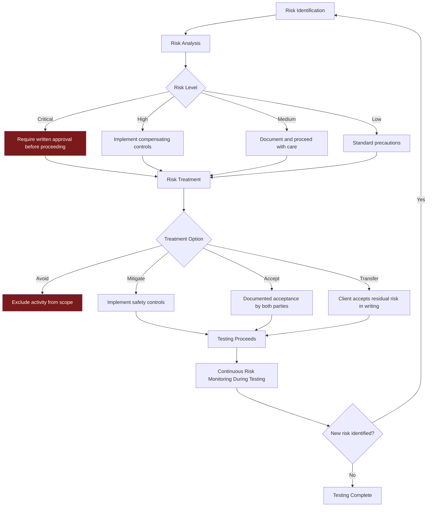
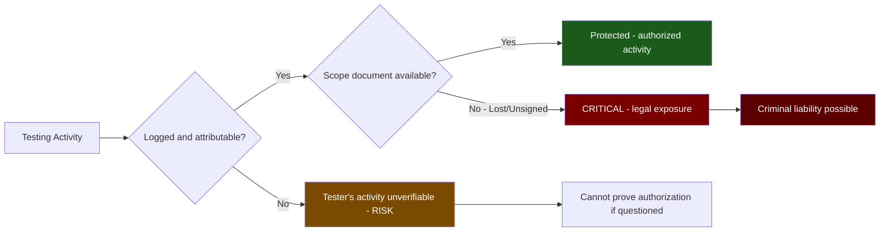
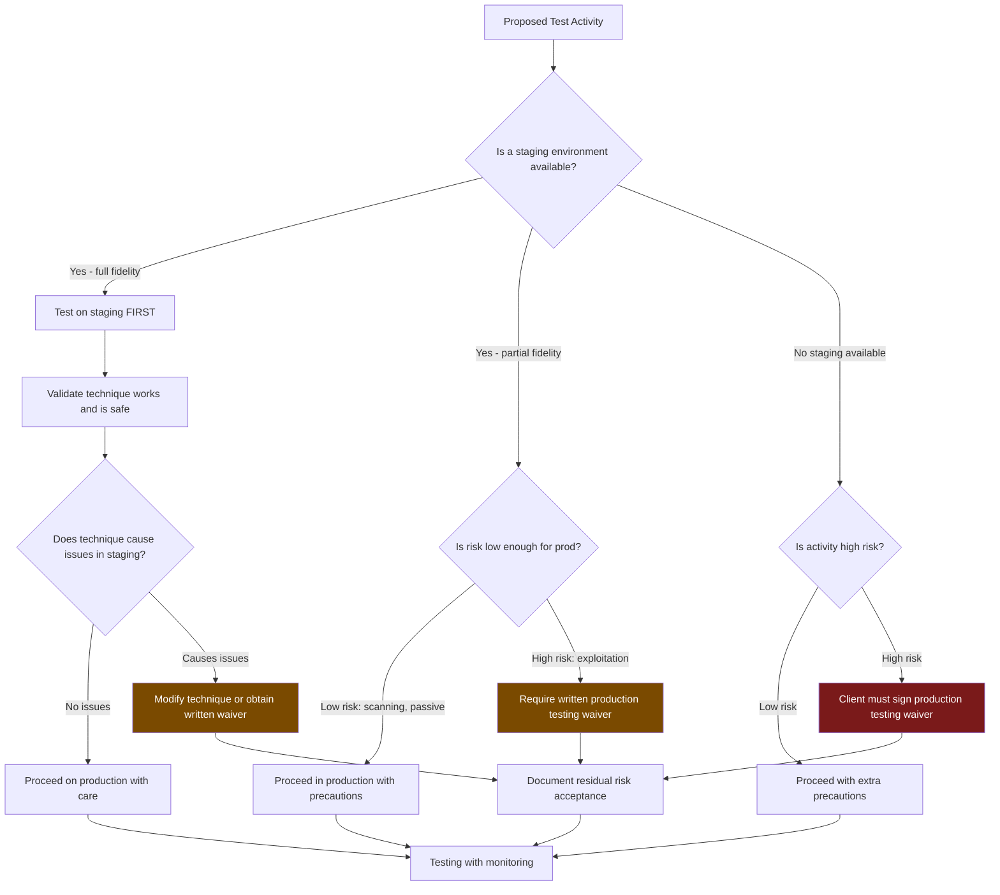
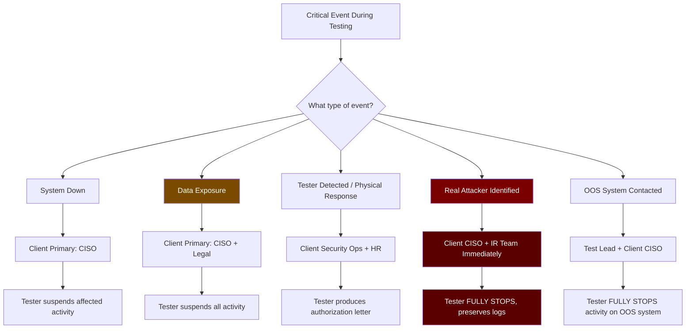

# Risk Management

> **Difficulty:** Beginner → Advanced | **Category:** Penetration Testing

Penetration testing is inherently risky — not only to the client's systems but to the testers themselves. Professionals distinguish themselves from script kiddies not by knowing how to exploit systems, but by knowing how to do so without causing unintended damage. This document covers every category of risk encountered in a professional engagement: from crashes and data loss, to detection and attribution, to the unique dangers posed by testing databases, production environments, and critical infrastructure. It includes risk assessment matrices, mitigation strategies, rollback plans, and the emergency response procedures that separate responsible professionals from dangerous amateurs.

---

## Table of Contents

1. [Risk Management Framework](#framework)
2. [Tester-Side Risks](#tester-risks)
3. [Client-Side Risks](#client-risks)
4. [Risk Assessment Matrix](#risk-matrix)
5. [Testing in Production vs. Staging](#prod-vs-staging)
6. [Rollback Plans and Recovery](#rollback)
7. [Emergency Contacts and Escalation](#emergency-contacts)
8. [Critical Infrastructure Precautions](#critical-infra)
9. [DoS Testing Risks](#dos-risks)
10. [Database Testing Risks](#db-risks)
11. [Risk Mitigation Strategies by Category](#mitigation)

---

## Risk Management Framework {#framework}

**Risk management** in penetration testing means systematically identifying, analyzing, and mitigating potential harms *before* they occur. Unlike corporate IT risk management, which focuses on threats from attackers, pentest risk management focuses on threats *from the testers themselves* — the unintended consequences of authorized attack simulation.



### Risk Register Template

```
ENGAGEMENT RISK REGISTER
=========================
Engagement:  ACME Corp External Assessment — March 2024
Prepared by: Jane Tester
Review date: 2024-03-14 (day before testing starts)

ID   | Risk Description                    | Likelihood | Impact  | Score | Treatment
-----|-------------------------------------|------------|---------|-------|------------------
R-01 | Web server crash from exploitation  | Medium     | High    | 12    | Test during maintenance window
R-02 | Database corruption from SQL test   | Low        | Critical| 12    | Read-only queries only
R-03 | IDS triggers incident response      | High       | Medium  | 12    | Deconfliction with SOC
R-04 | Out-of-scope system contacted       | Low        | High    | 8     | scope_validator.sh
R-05 | Credentials exposed in report       | Low        | High    | 8     | Mask credentials in deliverables
R-06 | Data exfil exceeds PoC minimum      | Low        | Critical| 12    | No bulk data collection policy
R-07 | Tester laptop lost/stolen           | Low        | Critical| 12    | Full disk encryption enforced
R-08 | DoS condition during load testing   | Medium     | Critical| 16    | Load testing PROHIBITED in scope
R-09 | Production data modified            | Low        | Critical| 12    | Test accounts only, no write ops
R-10 | Authentication lockouts (customers) | High       | High    | 16    | Max 3 attempts/account/hour
```

---

## Tester-Side Risks {#tester-risks}

Risks that primarily affect the penetration tester and testing firm.

### Legal and Attribution Risks



**Legal exposure risks:**

| Risk | Trigger | Mitigation |
|---|---|---|
| Criminal prosecution | Testing out-of-scope systems | scope_validator.sh before every scan |
| Civil liability | Causing system outage | Limit destructive testing, get indemnity |
| Regulatory investigation | Accessing PII/PHI without authorization | Strict data minimization |
| Contract breach | Missing deliverable deadlines | Realistic scope, adequate time |
| Attribution error | Logs show your IP attacking OOS system | Test only from authorized IPs |
| Disclosure liability | Report leaked | Encrypted delivery, NDA enforcement |

### Operational Security (OpSec) Risks for Testers

```bash
# Pre-engagement OpSec checklist

# 1. Verify source IP before testing
MY_IP=$(curl -s https://api.ipify.org)
AUTHORIZED_IP="192.0.2.10"

if [ "$MY_IP" != "$AUTHORIZED_IP" ]; then
    echo "STOP: Your IP ($MY_IP) is not the authorized test IP ($AUTHORIZED_IP)"
    echo "Do not proceed until this is resolved"
    exit 1
fi

# 2. Verify test laptop disk encryption is enabled
if command -v cryptsetup &>/dev/null; then
    # Linux - check LUKS
    lsblk -o NAME,TYPE,MOUNTPOINT | grep -E "crypt|luks"
fi

# macOS check: System Preferences → Security → FileVault

# 3. Verify VPN/tunnel is active if required
ip route | grep -E "tun|vpn"

# 4. Ensure evidence directory is encrypted
ls -la /secure/evidence/ 2>/dev/null || echo "WARN: Evidence dir not in encrypted mount"

# 5. Check that no unrelated background tools are running
# (e.g., personal Burp projects, other client work)
ps aux | grep -E "burpsuite|msfconsole|nmap" | grep -v grep
```

### Tester Credential Compromise

```bash
# Credential handling during engagements

# Never store credentials in plaintext files
# BAD:
echo "password123" > creds.txt  # NEVER do this

# GOOD: Use pass (password-store) or similar
pass insert acmecorp/testuser-password
pass show acmecorp/testuser-password

# Or use environment variables (clear after use)
export TARGET_PASS="provided_password"
# ... use in tool ...
unset TARGET_PASS

# For Metasploit, credentials should be stored in the DB
# (encrypted) not in notes files
msfconsole -q -x "
  use auxiliary/scanner/http/http_login
  set USERNAME testuser
  set PASSWORD ${TARGET_PASS}
  set RHOSTS 203.0.113.10
  run
  exit
"

# After testing: verify all client credentials are removed from local systems
grep -r "password\|passwd\|secret\|token\|apikey" ~/engagement_notes/ 2>/dev/null
```

---

## Client-Side Risks {#client-risks}

Risks that primarily affect the client organization during and after testing.

### Production System Impact Categories

```
PRODUCTION IMPACT RISK TAXONOMY

CATEGORY 1: AVAILABILITY IMPACT
  - Service degradation from scan load
  - Application crash from malformed input
  - Memory exhaustion from fuzzing
  - CPU spike from complex SQL queries
  - Connection pool exhaustion from concurrent scanning
  - Log volume overwhelming SIEM
  - Alerting fatigue (security team can miss real attacks)

CATEGORY 2: INTEGRITY IMPACT
  - Accidental data modification during SQLi testing
  - Configuration changes during privilege escalation
  - User account creation/modification during testing
  - File system changes during post-exploitation
  - Database record modification during ORM testing

CATEGORY 3: CONFIDENTIALITY IMPACT
  - Tester accesses more data than needed for PoC
  - Credentials captured that are later not securely destroyed
  - PII found and not handled per data handling agreement
  - Report containing sensitive data transmitted insecurely

CATEGORY 4: SECONDARY CASCADING IMPACTS
  - Production alert triggers incident response team (cost, distraction)
  - Automated backup of compromised state
  - Monitoring system alerts C-suite before deconfliction
  - Intrusion prevention system blocks legitimate traffic
  - IPS blocks test IPs, preventing testing completion
```

### Customer Impact Risk

> **Warning:** In production environments, testing activities can directly impact real customers. Rate-limiting tests, authentication tests, and any tests against user-facing endpoints carry customer impact risk that must be explicitly accepted by the client in writing.

```bash
# Before any test that could impact customers, estimate blast radius

# 1. Check current active sessions (to understand potential customer impact)
# This requires read access to the application's session store
# Ask client for this metric before testing

# 2. For authentication testing - verify lockout policy before testing
# Ask client: "What is your account lockout policy?"
# Standard safe approach: max 3 attempts per account, then skip that account

# 3. For load-based tests - confirm with client
# Safe scanning rate for most production web apps:
SAFE_RATE="100"  # requests per second
# For critical/legacy systems
CONSERVATIVE_RATE="10"  # requests per second

# Nuclei with rate limiting to protect production
nuclei -l targets.txt \
  -rate-limit 10 \         # 10 requests/second max
  -bulk-size 5 \            # 5 concurrent targets max
  -concurrency 5 \
  -timeout 5 \
  -o nuclei_safe_scan.txt

# Nikto with rate limiting
nikto -host app.acmecorp.com \
  -maxtime 60 \             # Max 60 seconds per host
  -Pause 1 \                # 1 second pause between requests
  -output nikto_results.xml
```

---

## Risk Assessment Matrix {#risk-matrix}

### Quantitative Risk Scoring

**Risk Score = Likelihood × Impact**

| Score | Level | Action Required |
|---|---|---|
| 16-25 | **Critical** | Executive approval required, testing may not proceed |
| 9-15 | **High** | Client CISO sign-off required, compensating controls mandatory |
| 5-8 | **Medium** | Document in risk register, implement precautions |
| 1-4 | **Low** | Standard precautions, document and proceed |

### Likelihood Scale

| Score | Level | Definition |
|---|---|---|
| 5 | Certain | Will almost certainly occur (>80% probability) |
| 4 | Likely | More likely than not (60-80%) |
| 3 | Possible | Could occur (40-60%) |
| 2 | Unlikely | Unlikely but possible (20-40%) |
| 1 | Rare | Very unlikely (<20%) |

### Impact Scale

| Score | Level | Definition |
|---|---|---|
| 5 | Catastrophic | Business-stopping impact, data loss, criminal liability |
| 4 | Major | Significant service disruption >1 hour, major data exposure |
| 3 | Moderate | Service disruption <1 hour, minor data exposure |
| 2 | Minor | Brief degradation, no data exposure |
| 1 | Negligible | Imperceptible impact |

### Full Engagement Risk Matrix

```
RISK ASSESSMENT MATRIX — ACME CORP EXTERNAL ASSESSMENT

+---------------------------+------------+---------+-------+--------------------------+
| Risk Scenario             | Likelihood | Impact  | Score | Mitigation               |
+---------------------------+------------+---------+-------+--------------------------+
| Web server crash (SQLi)   |     3      |    4    |  12   | Test on staging first;   |
|                           |            |         |       | read-only payloads only  |
+---------------------------+------------+---------+-------+--------------------------+
| Auth lockout - customers  |     4      |    4    |  16   | CRITICAL: Max 3          |
|                           |            |         |       | attempts/account/hour;   |
|                           |            |         |       | test off-peak hours      |
+---------------------------+------------+---------+-------+--------------------------+
| DB corruption (SQLi)      |     2      |    5    |  10   | Read-only SQL only;      |
|                           |            |         |       | no UPDATE/DELETE/DROP    |
+---------------------------+------------+---------+-------+--------------------------+
| IDS blocks test IPs       |     4      |    3    |  12   | Deconfliction with SOC;  |
|                           |            |         |       | whitelist source IPs     |
+---------------------------+------------+---------+-------+--------------------------+
| Tester contacts OOS system|     2      |    4    |   8   | scope_validator.sh;      |
|                           |            |         |       | nmap --excludefile       |
+---------------------------+------------+---------+-------+--------------------------+
| PII accessed beyond PoC   |     2      |    5    |  10   | Screenshot only policy;  |
|                           |            |         |       | no bulk data collection  |
+---------------------------+------------+---------+-------+--------------------------+
| DoS condition triggered   |     3      |    5    |  15   | HIGH: DoS testing        |
|                           |            |         |       | prohibited; rate limits  |
+---------------------------+------------+---------+-------+--------------------------+
| Real attacker concurrent  |     2      |    4    |   8   | Daily deconfliction with |
|                           |            |         |       | SOC; review IDS logs     |
+---------------------------+------------+---------+-------+--------------------------+
| AWS service limits hit    |     2      |    3    |   6   | Monitor API call rates;  |
|                           |            |         |       | stay below AWS limits    |
+---------------------------+------------+---------+-------+--------------------------+
| Report leaked to attacker |     1      |    5    |   5   | Encrypted delivery;      |
|                           |            |         |       | access controls on report|
+---------------------------+------------+---------+-------+--------------------------+
| Source code exposed in PoC|     2      |    4    |   8   | Redact proprietary code  |
|                           |            |         |       | from evidence/report     |
+---------------------------+------------+---------+-------+--------------------------+
```

---

## Testing in Production vs. Staging {#prod-vs-staging}

### Decision Framework



### Production Testing Risk Differential

| Activity | Staging Risk | Production Risk | Notes |
|---|---|---|---|
| Port scanning | Low | Low-Medium | May trigger IDS alerts, customer-facing load |
| Web crawling | Low | Medium | May affect CDN cache, analytics |
| SQLi testing (read) | Low | Medium | Log volume, query load |
| SQLi testing (write/drop) | Low | **Critical** | NEVER in production |
| Authentication brute force | Low | **Critical** | Customer lockouts |
| Buffer overflow exploitation | Medium | **Critical** | Service crash likely |
| Memory leak exploitation | Medium | High | May require reboot |
| File upload testing | Low | High | Malware scanners, monitoring |
| XXE/SSRF testing | Low | Medium | May trigger outbound blocks |
| DoS testing | Medium | **PROHIBITED** | Never in production |
| Privilege escalation | Low | High | May trigger EDR response |
| Persistence mechanisms | Low | **Critical** | Backdoors in production |

### Production Testing Waiver Template

```
PRODUCTION SYSTEM TESTING RISK ACCEPTANCE

Engagement:    ACME Corp Assessment — March 2024
Activity:      SQL injection exploitation testing on production database
Risk Level:    HIGH

RISK DESCRIPTION:
  Testing SQL injection vulnerabilities on the production database at
  10.10.3.10 carries the following risks:
  - Query execution may increase database load (acceptable: <10% CPU)
  - Malformed queries may cause application errors (logged, recoverable)
  - In worst case, exploitation payload may trigger unexpected stored
    procedure behavior (mitigated by read-only payloads only)

MITIGATIONS IN PLACE:
  - Only SELECT statements used in PoC exploitation
  - No UPDATE, DELETE, DROP, or INSERT statements
  - Testing conducted during off-peak hours (02:00-04:00 EST)
  - Client DBA on standby during testing (phone: +1-555-300-0001)
  - Database backup completed at 01:00 EST before testing
  - Testing rate limited to 10 requests/second maximum

RESIDUAL RISK ACCEPTANCE:
  I, [Client Name], on behalf of ACME Corporation, understand and
  accept the residual risk of conducting the above testing activities
  on production systems. I authorize SecureTest LLC to proceed with
  these activities under the stated conditions.

  Name:      ___________________
  Title:     ___________________
  Date/Time: ___________________
  Signature: ___________________
```

---

## Rollback Plans and Recovery {#rollback}

Before any test that could modify system state, a rollback plan must exist.

### Pre-Test Snapshot Requirements

```bash
# BEFORE testing any system that could be affected:

# 1. Virtual Machine snapshot (VMware/Hyper-V/KVM)
# VMware vSphere:
govc snapshot.create -m -q \
  -vm "acmecorp-web-01" \
  "pre-pentest-$(date +%Y%m%d)"

# 2. AWS EC2 AMI snapshot
aws ec2 create-image \
  --instance-id i-0abc123def456 \
  --name "pre-pentest-$(date +%Y%m%d-%H%M)" \
  --description "Snapshot before security assessment" \
  --no-reboot \
  --profile pentest

# 3. Database backup
# MySQL
mysqldump -h 10.10.3.10 \
  -u readonly_user \
  -p'PASS' \
  --all-databases \
  --single-transaction \
  --master-data=2 \
  > "db_backup_$(date +%Y%m%d_%H%M).sql"

# PostgreSQL
pg_dump -h 10.10.3.10 \
  -U readonly_user \
  -F c \
  -f "pgdump_$(date +%Y%m%d_%H%M).pgdump" \
  production_db

# 4. Confirm backup integrity
sha256sum "db_backup_$(date +%Y%m%d)*.sql" > backup_hashes.txt

# 5. Confirm backup is accessible and restorable (test restore to staging)
mysql -h staging-db.internal -u admin -p < db_backup_latest.sql
echo "Restore test result: $?"
```

### Rollback Execution Playbook

```
ROLLBACK EXECUTION PLAYBOOK
=============================
Trigger:       System crash, data corruption, or unintended modification detected

STEP 1 — STOP ALL TESTING (< 2 minutes)
  All testers: CTRL+C all running tools
  Notify Test Lead via Signal/encrypted channel: "ROLLBACK INITIATED"
  Note exact time: _____________

STEP 2 — ASSESS IMPACT (< 5 minutes)
  □ Which systems are affected?
  □ What was the last action before the incident?
  □ Are services currently down or degraded?
  □ Is customer traffic being impacted?

STEP 3 — NOTIFY CLIENT (< 5 minutes)
  Call: John Smith (CISO) — +1 (512) 555-0100
  Text:  "SECURITY TEST IMPACT — [brief description] — calling now"
  Confirm: Client has received notification

STEP 4 — CLIENT-SIDE RECOVERY
  (Client's team executes; Tester supports)
  □ Restore from VM snapshot if available
  □ Restore from database backup if DB affected
  □ Restart affected services if no data issue
  □ Verify service restoration

STEP 5 — INCIDENT DOCUMENTATION
  □ Preserve all tester logs from incident window
  □ Preserve network captures if active
  □ Write incident timeline (exact actions, timestamps)
  □ Identify root cause

STEP 6 — DECISION POINT
  □ Can testing resume? (Client decides)
  □ Does scope need to be modified?
  □ Does the activity need to be excluded?
  □ Is formal incident report required?
```

---

## Emergency Contacts and Escalation {#emergency-contacts}

### Emergency Contact Structure



### Emergency Contact Card Template

```
ENGAGEMENT EMERGENCY CONTACT CARD
====================================
Print this card and carry it during field work.

ENGAGEMENT: ACME Corp Assessment | March 15-22, 2024
TEST LEAD:  Jane Tester | +1 (415) 555-0200 | jane@securetest.com

CLIENT CONTACTS:
Primary (CISO):      John Smith         +1 (512) 555-0100  jsmith@acmecorp.com
Secondary (IT Dir):  Sarah Jones        +1 (512) 555-0101  sjones@acmecorp.com
Tertiary (NOC):      NOC Hotline        +1 (512) 555-0911  noc@acmecorp.com  (24/7)
Legal (if needed):   Michael Brown      +1 (512) 555-0150  mbrown@acmecorp.com
Incident Response:   IR Hotline         +1 (512) 555-0999  ir@acmecorp.com   (24/7)

INTERNAL ESCALATION (SecureTest):
Manager:             Tom Director       +1 (415) 555-0300  tdirector@securetest.com
Legal:               SecureTest Legal   +1 (415) 555-0350  legal@securetest.com

STOP PHRASE: "BRAVO STOP" — Stop all testing immediately

EMERGENCY PROCEDURES:
  System crash:      Call CISO, stop affected tests, document
  Data exposure:     Call CISO + Legal, STOP ALL TESTING, document
  Physical response: Produce PTT letter, call CISO immediately
  OOS contact:       Stop, call CISO within 15 minutes, document
  Real attacker:     STOP ALL, call CISO, do NOT tip off attacker

AUTHORIZATION REFERENCE:
  Permission to Test signed: 2024-03-10
  Scope document version: v2.3
  File location: /secure/evidence/ACME-2024-003/authorization/
```

### Escalation Time Requirements

| Event Type | Verbal Notification | Written Notification | Escalation Trigger |
|---|---|---|---|
| System crash | 15 minutes | 2 hours | Client decides to halt testing |
| Data exposure (minor) | 30 minutes | 4 hours | Client legal review |
| PII/PHI exposure | **Immediately** | 1 hour | GDPR/HIPAA reporting clock starts |
| OOS contact (no access) | 1 hour | Same day | If data accessed: immediately |
| OOS contact (data accessed) | **Immediately** | 2 hours | Legal review |
| Real attacker concurrent | **Immediately** | 2 hours | Engagement suspension |
| Physical detention | **Immediately** | N/A | Client calls security/police |

---

## Critical Infrastructure Precautions {#critical-infra}

Critical infrastructure — power grids, water treatment, healthcare systems, financial systems, transportation — requires extraordinary precautions. Failures in these environments have real-world physical consequences.

### Critical Infrastructure Categories (CISA)

```
CRITICAL INFRASTRUCTURE SECTORS (US CISA)
==========================================
These sectors require heightened precautions when in scope:

1.  Chemical Sector
2.  Commercial Facilities Sector
3.  Communications Sector
4.  Critical Manufacturing Sector
5.  Dams Sector
6.  Defense Industrial Base Sector
7.  Emergency Services Sector
8.  Energy Sector (CRITICAL: power grid, oil, gas)
9.  Financial Services Sector
10. Food and Agriculture Sector
11. Government Facilities Sector
12. Healthcare and Public Health Sector (CRITICAL: hospitals)
13. Information Technology Sector
14. Nuclear Reactors, Materials, and Waste Sector (EXTREMELY CRITICAL)
15. Transportation Systems Sector (CRITICAL: air traffic, rail)
16. Water and Wastewater Systems Sector (CRITICAL)
```

### SCADA/ICS Testing Precautions

```bash
# SCADA/ICS environments require passive scanning ONLY
# Never use intrusive scans against PLCs, RTUs, or HMI systems

# Passive network capture (no packets sent to targets)
tcpdump -i eth0 -w ics_traffic_$(date +%Y%m%d).pcap \
  -s 0 \
  host 192.168.100.0/24

# Analyze captured traffic with Wireshark/tshark
tshark -r ics_traffic.pcap \
  -T fields \
  -e ip.src \
  -e ip.dst \
  -e _ws.col.Protocol \
  -e frame.len | sort | uniq -c | sort -rn | head -30

# Identify ICS protocols passively
tshark -r ics_traffic.pcap \
  -Y "modbus or dnp3 or enip or s7comm or bacnet" \
  -T fields -e ip.src -e ip.dst -e _ws.col.Protocol

# DO NOT:
# - Run nmap against PLC IP addresses
# - Send Modbus/DNP3 commands to live systems
# - Attempt authentication against HMI systems
# - Test during operational hours (schedule maintenance window)
# - Test without physical safety personnel present

# If testing is authorized:
# Extremely gentle Nmap against KNOWN safe test systems only
nmap -sV --version-intensity 0 \
  -p 102,502,20000,44818 \  # Siemens S7, Modbus, DNP3, EtherNet/IP
  --scan-delay 2s \         # 2 second delay between probes
  --max-retries 0 \         # No retries
  192.168.100.50            # ONLY the specific authorized test PLC
```

### Healthcare Systems Precautions

```
HEALTHCARE ENVIRONMENT TESTING PRECAUTIONS

Pre-Test Requirements:
  □ Written confirmation that target systems are NOT connected to
    life-support, medication dispensing, or patient monitoring systems
  □ Clinical informatics approval (not just IT)
  □ Testing during off-shift hours (2AM-5AM typical)
  □ On-call clinical engineer available during testing
  □ Rollback plan verified with biomedical engineering team
  □ HIPAA-covered data handling agreement in place

During Testing:
  □ Monitor for any HL7, FHIR, DICOM protocol on network - report, don't exploit
  □ If medical device (FDA 510k registered) found in scope - STOP, consult client
  □ Authentication testing on clinical apps: max 2 attempts (patient safety first)
  □ No fuzzing of clinical APIs without clinical informatics approval
  □ Immediate stop if any indication of impact on patient care systems

Prohibited (always, in healthcare):
  ✗ Any testing of systems directly monitoring patient vitals
  ✗ Any testing of infusion pump controllers or similar
  ✗ Any testing that could cause medication errors
  ✗ DoS or load testing against clinical systems
```

---

## DoS Testing Risks {#dos-risks}

**Denial of Service** testing is the highest-risk category of penetration testing. Most professional engagements explicitly prohibit DoS testing; when it is authorized, extreme precautions are mandatory.

### Why DoS Testing Is Different

```
DoS Testing Risk Profile
========================
  Impact if failed:   Customer-facing outage, revenue loss, reputational damage
  Recovery time:      Minutes to hours (depends on mitigation)
  Evidence of testing: Immediately obvious to all monitoring systems
  Legal risk:         Even with authorization, exceeding agreed parameters = CFAA violation
  Client trust:       A DoS incident destroys the testing relationship

Standard policy: DoS testing is PROHIBITED in most external engagements.
When authorized: Only in isolated lab environments, OR during declared maintenance windows
                with explicit written authorization and recovery plan.
```

### When DoS Testing Is Permitted

```
DoS TESTING AUTHORIZATION REQUIREMENTS

Before ANY denial-of-service testing:
  □ Explicit written authorization (separate from general PTT)
  □ Load threshold defined (e.g., "test up to 10,000 RPS")
  □ Duration limited (e.g., "bursts of 30 seconds maximum")
  □ Recovery plan in place and tested
  □ Maintenance window declared to operations team
  □ All customers notified if public-facing service
  □ Client technical lead on call during testing
  □ Rate limiting and circuit breaker behavior confirmed
  □ Immediate stop signal defined
  □ Insurance coverage confirmed for potential outage
```

```bash
# If DoS testing IS authorized, use controlled tools with clear limits

# Controlled HTTP load test with wrk
wrk -t 4 \                    # 4 threads
  -c 100 \                    # 100 concurrent connections
  -d 30s \                    # 30 seconds MAXIMUM
  --latency \
  https://app.acmecorp.com/

# Monitor client-side during test
# Watch for: response time degradation, error rate increase
# STOP immediately if error rate exceeds 5%

# Slowloris (tests connection exhaustion) - controlled
# ONLY in authorized, isolated window
python3 slowloris.py \
  203.0.113.10 \
  --port 443 \
  --num-sockets 50 \  # Low socket count for controlled test
  --sleeptime 30

# NEVER use:
# - LOIC/HOIC (uncontrolled UDP/TCP flood)
# - Amplification attacks (UDP spoofing)
# - Botnet tools
# - Tools that target infrastructure (switches, routers) not application layer
```

---

## Database Testing Risks {#db-risks}

Databases contain the most sensitive and business-critical data. Database testing requires the most conservative approach of any testing category.

### Database Testing Risk Levels by Activity

| Activity | Risk | Authorization Required | Notes |
|---|---|---|---|
| `SELECT` queries via SQLi | Medium | Standard scope | Log volume may spike |
| Schema enumeration | Low-Medium | Standard scope | Reveals structure only |
| `UNION`-based injection | Medium | Standard scope | May cause errors |
| `UPDATE` via SQLi | **CRITICAL** | Production waiver + DBA on standby | NEVER without explicit auth |
| `DELETE` via SQLi | **CRITICAL** | Usually prohibited | Data loss is irreversible |
| `DROP TABLE` | **CRITICAL** | **ALMOST ALWAYS PROHIBITED** | Business-ending impact |
| `xp_cmdshell` (MSSQL) | High | Only with OS access already granted | Privilege escalation test |
| `LOAD_FILE` / `INTO OUTFILE` | High | Standard with data handling controls | Confirm file system access |
| Stored procedure enumeration | Low | Standard scope | Documentation only |
| Stored procedure execution | High | Explicit authorization | Side effects unknown |
| Blind SQLi time-based | Medium | Standard scope | `SLEEP(5)` × many queries = load |

### Safe Database Testing Practices

```bash
# Safe SQL injection testing methodology
# ==========================================

# 1. ALWAYS start with error-based or union-based detection
#    These are READ ONLY operations
#    Never start with time-based blind (high load)

# 2. Establish baseline first
curl -s "https://app.acmecorp.com/products?id=1" | wc -c
# Note: normal response size

# 3. Test for reflection safely
curl -s "https://app.acmecorp.com/products?id=1'" | grep -i "error\|mysql\|syntax\|warning"

# 4. Use sqlmap with conservative settings
sqlmap -u "https://app.acmecorp.com/products?id=1" \
  --level=2 \               # Conservative level (1-5, default 1)
  --risk=1 \                # Conservative risk (1-3, 1=safe, 3=may modify data)
  --technique=BEUST \       # Boolean, Error, Union, Stacked, Time - enables all
  --no-cast \
  --threads=1 \             # Single thread - reduces DB load
  --delay=1 \               # 1 second between requests
  --timeout=30 \
  --batch \                 # Non-interactive
  --answers="quit=N,merge=Y,follow=Y" \
  --exclude-sysdbs \        # Don't enumerate system databases first
  --dbms=mysql              # Specify to reduce probe variety

# 5. Enumerate schema before any data access
sqlmap -u "https://app.acmecorp.com/products?id=1" \
  --dbs \                   # List databases only
  --batch

# 6. Confirm with client BEFORE accessing specific tables
# Do NOT dump tables without asking:
#   "I've confirmed SQLi. There is a database called 'users' with a 'accounts' table.
#    May I retrieve 1-2 records to confirm data access as proof of impact?"

# 7. If authorized to retrieve records - MINIMUM VIABLE PROOF
sqlmap -u "https://app.acmecorp.com/products?id=1" \
  -D target_db \
  -T users \
  --dump \
  --start=1 \
  --stop=3 \                # THREE RECORDS MAXIMUM for PoC
  --batch

# NEVER use:
# sqlmap --dump-all           # Dumps entire database
# sqlmap --risk=3             # Enables data-modifying payloads
# sqlmap --os-shell           # OS shell (separate authorization needed)
```

---

## Risk Mitigation Strategies by Category {#mitigation}

### Comprehensive Mitigation Reference

```
RISK MITIGATION COMPENDIUM
===========================

SCANNING AND ENUMERATION
  Risk: Triggering IDS/IPS blocks
  Mitigation: 
    - Whitelist test IPs with client's SOC before scanning
    - Use --scan-delay 500ms minimum for production
    - Coordinate timing of scans with blue team

  Risk: Scan causing service degradation
  Mitigation:
    - Use -T3 (normal) instead of -T5 (insane) in Nmap
    - Avoid masscan against production services
    - Limit masscan rate to 1000pps for production
    - Test during off-peak hours

WEB APPLICATION TESTING
  Risk: Brute force causing customer lockouts
  Mitigation:
    - Maximum 3 attempts per account per hour
    - Use test accounts (not real customer accounts)
    - Confirm lockout policy with client before testing
    - Use Burp's "smart" login attack that respects lockout

  Risk: XSS payload affects real users
  Mitigation:
    - Use non-persisting, self-contained payloads for detection
    - Never use persistent XSS payloads in production
    - Use alert(document.domain) not alert(document.cookie)
    - Immediately report stored XSS so client can remove payload

  Risk: File upload creates malicious files on server
  Mitigation:
    - Use EICAR test file for AV testing, not real malware
    - Upload to test directories, never root
    - Delete all uploaded test files after testing
    - Document exact file paths of all uploaded content

NETWORK EXPLOITATION
  Risk: Exploiting buffer overflow crashes service
  Mitigation:
    - Test against staging first, always
    - Have rollback plan ready before triggering exploit
    - Use metasploit's --check flag to verify vulnerability
      without triggering exploit payload
    - Test during agreed maintenance window
    - Have client team watching service health monitors

  Risk: Lateral movement reaches out-of-scope systems
  Mitigation:
    - Define hard network boundaries in scope
    - Use --exclude in all scanning tools
    - Confirm route tables before moving laterally
    - "Stop and confirm" at each new network segment

POST-EXPLOITATION
  Risk: Persistence mechanisms not removed
  Mitigation:
    - Maintain meticulous log of ALL changes made
    - Template: "What was done, where, what changed, how to undo"
    - Dedicated cleanup phase at end of engagement
    - Verify removal with client security team

  Risk: Credentials not destroyed after engagement
  Mitigation:
    - Client rotates all test credentials at engagement end
    - Tester confirms deletion from all systems and password managers
    - Written certification of credential destruction
```

> **Note:** The best risk mitigation strategy for any high-risk activity is to discuss it with the client *before* the engagement begins. Surprises during testing cost time, money, and trust. Proactively identifying and documenting every risky activity during scoping prevents problems in the field.

> **Warning:** If you cause a production outage during a penetration test, even in scope, and you did not have a rollback plan, did not have a production testing waiver, or did not follow the agreed-upon rules of engagement — your client can still pursue civil damages against your firm. "But it was in scope" is not a sufficient defense against negligence.

---

*Last updated: 2024 | Category: Engagement Planning | Next: [Communication Protocol](./communication-protocol.md)*
