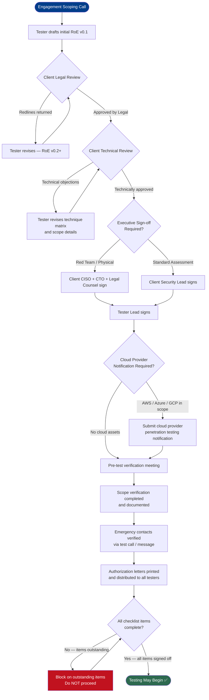

# Rules of Engagement (Engagement Planning)

> **Difficulty:** Intermediate → Expert | **Category:** Penetration Testing — Engagement Planning

> **See also:** [`01-fundamentals/rules-of-engagement.md`](../01-fundamentals/rules-of-engagement.md) — covers the conceptual foundations of ROE. This note focuses on the **operational and contractual specifics** of defining, negotiating, executing, and enforcing ROE for a live engagement.

Rules of Engagement are not boilerplate — they are a living operational contract negotiated between two technical teams. Getting them right before the first packet leaves your machine is the difference between a successful engagement, a failed engagement, and a criminal charge. This note walks through the full RoE lifecycle: drafting, negotiation, per-engagement customization, legal enforceability, emergency procedures, and real-world failure cases.

---

## Table of Contents

1. [RoE in the Context of a Live Engagement](#1-roe-in-the-context-of-a-live-engagement)
2. [Key RoE Components](#2-key-roe-components)
3. [RoE Document Structure and Templates](#3-roe-document-structure-and-templates)
4. [Common RoE Clauses](#4-common-roe-clauses)
5. [Emergency Stop Procedures](#5-emergency-stop-procedures)
6. [RoE by Engagement Type](#6-roe-by-engagement-type)
7. [Legal Enforceability](#7-legal-enforceability)
8. [Real-World RoE Violations](#8-real-world-roe-violations)
9. [RoE Approval Workflow](#9-roe-approval-workflow)
10. [Pre-Testing Sign-Off Checklist](#10-pre-testing-sign-off-checklist)

---

## 1. RoE in the Context of a Live Engagement

### What Shifts at the Engagement Planning Phase

The fundamentals note explains *what* RoE is. This note is about *building* it for a specific engagement.

By the time you reach engagement planning, you have already:
- Received a signed contract / MSA
- Signed mutual NDAs
- Agreed on deliverables in the SOW

Now you must translate those business-level agreements into **operational ground rules** that your testers can follow minute-by-minute in the field. The RoE answers questions like:

- "Can I run this Metasploit module against that server at 2 PM on a Tuesday?"
- "I just found domain admin credentials — who do I call right now?"
- "The client's firewall blocked me. Do I call them or route around it?"
- "I accidentally scanned an IP outside scope — what do I do?"

### RoE as a Negotiated Document

RoE is not handed to a client — it is negotiated. Your initial draft will almost always come back with redlines. Common client push-backs:

| Your Initial Draft | Client Counter | Resolved As |
|--------------------|---------------|-------------|
| Testing 24/7 | Testing business hours only | 09:00–17:00 Mon–Fri UTC+2 |
| Full exploit / DoS permitted | No availability impact at all | Exploit allowed, DoS prohibited |
| Phishing all staff | Executives excluded | Phishing all staff except C-level |
| Network pivoting anywhere | No production database servers | Pivot permitted, DB tier excluded |
| Physical access to data center | Server room off-limits | Reception and office floor only |

Every redline negotiation must be resolved in writing before testing begins. "We talked about it on a call" is not sufficient.

### The RoE Signing Chain

> **⚠️ Warning:** An RoE signed only by a mid-level IT manager may not be legally sufficient to authorize an engagement — especially for destructive techniques or physical testing. Always verify the authorization chain reaches someone with actual authority to grant access.

Minimum required signatories:

```
Tester Side                          Client Side
─────────────────────────────────    ─────────────────────────────────
Lead Tester / Project Manager        Client Security Lead / CISO
Firm Principal / Director            VP Engineering or CTO (for prod)
                                     Legal Counsel (for red team / physical)
```

---

## 2. Key RoE Components

Every RoE document must cover these six operational pillars. Missing any one of them creates risk for both parties.

### 2.1 Component Overview Table

| Component | What It Defines | Risk if Missing |
|-----------|----------------|-----------------|
| **Scope** | Exact systems, IPs, domains, applications in and out of bounds | Unauthorized access to third-party systems |
| **Timing** | Testing windows, blackout dates, maintenance periods | Testing during outage window, causing blame |
| **Allowed Techniques** | Permitted and prohibited attack classes | Illegal DoS, unintended data destruction |
| **Communication** | Escalation contacts, check-in cadence, reporting channels | Blocked on client firewall with no recourse |
| **Escalation Paths** | Critical finding procedures, incident-during-test handling | Major breach goes unreported for hours |
| **Deconfliction** | How blue team is (or isn't) notified | Tester blocked, arrested, or causes incident response |

### 2.2 Scope

Scope is the most critical component. Define it with absolute precision.

**In-Scope must specify:**
- IP ranges (CIDR notation preferred)
- Fully qualified domain names
- Application URLs (include subdomains explicitly)
- Cloud accounts / resource groups
- Physical locations (for on-site engagements)
- Mobile application bundle IDs / package names

**Out-of-Scope must explicitly list:**
- Third-party SaaS platforms (e.g., Salesforce, Workday)
- Shared infrastructure (CDN, DNS providers)
- Payment processing systems (PCI DSS scope triggers)
- Systems owned by subsidiaries not covered in the contract
- Specific IP ranges belonging to other tenants (cloud environments)

**Scope Validation Commands:**

Before any test activity, verify your target is in scope:

```bash
# Confirm IP resolves to expected range
dig +short target.example.com

# Verify WHOIS ownership matches client
whois 203.0.113.0/24 | grep -E "OrgName|Organization|netname"

# Cross-check ASN ownership
whois -h whois.radb.net 203.0.113.10 | grep origin

# For cloud assets — confirm account ownership before touching
# AWS: check account ID in instance metadata
curl -s http://169.254.169.254/latest/dynamic/instance-identity/document | python3 -m json.tool | grep accountId
```

**Generating a Verified In-Scope Target List:**

```bash
# Expand CIDR ranges to individual IPs and store as verified scope file
nmap -sL 203.0.113.0/24 --exclude 203.0.113.254 -n | grep "Nmap scan report" | awk '{print $5}' > verified_scope.txt

# Count targets before proceeding
wc -l verified_scope.txt

# Always scan ONLY against the verified list
nmap -iL verified_scope.txt -sV --open -oA scans/initial_sV
```

> **⚠️ Never begin scanning until scope verification is complete and documented.**

### 2.3 Timing

Timing restrictions protect the client's business operations. Respect them absolutely.

**Timing clause elements:**

| Element | Example Value | Notes |
|---------|--------------|-------|
| Testing window | Mon–Fri 09:00–18:00 local client time | Specify timezone explicitly |
| Out-of-hours escalation | Permitted only with prior written approval | Must name who approves |
| Blackout dates | Dec 20 – Jan 3 (end of year freeze) | Typically client's change freeze |
| Maintenance windows | Sat 02:00–06:00 UTC — no testing | Overlaps with planned reboots |
| Critical finding exception | 24/7 emergency contact permitted | Even outside testing window |

**Automated testing clock check (bash helper):**

```bash
#!/usr/bin/env bash
# scope-clock-check.sh — abort if outside allowed testing window
TZ="Europe/London"
HOUR=$(TZ=$TZ date +%H)
DOW=$(TZ=$TZ date +%u)   # 1=Mon ... 7=Sun

if [ "$DOW" -gt 5 ] || [ "$HOUR" -lt 9 ] || [ "$HOUR" -ge 18 ]; then
    echo "[!] OUTSIDE TESTING WINDOW — aborting"
    exit 1
fi
echo "[+] Within testing window — proceeding"
```

### 2.4 Allowed Techniques

Technique authorization must be unambiguous. Use an explicit matrix, not narrative prose.

**Technique Authorization Matrix:**

| Technique Class | Permitted | Conditions / Restrictions |
|----------------|-----------|--------------------------|
| Passive reconnaissance | ✅ Yes | No restriction |
| Active port scanning | ✅ Yes | Rate-limited, no UDP flood |
| Service version enumeration | ✅ Yes | No restriction |
| Vulnerability scanning (authenticated) | ✅ Yes | Off-hours only |
| Password spraying | ✅ Yes | Max 1 attempt per account per hour |
| Phishing (email) | ✅ Yes | All staff except C-suite |
| Phishing (voice/vishing) | ✅ Yes | Must record call (compliance req) |
| Exploitation (no persistence) | ✅ Yes | Low-stability exploits need approval |
| Exploitation (with persistence) | ✅ Yes | Must document all implants placed |
| Lateral movement | ✅ Yes | Exclude DB tier (192.168.50.0/24) |
| Privilege escalation | ✅ Yes | No restriction |
| Data exfiltration (simulated) | ✅ Yes | Max 1 MB sample, no real PII |
| Denial of Service | ❌ No | Explicitly prohibited |
| Destructive exploits (rm, wiper) | ❌ No | Explicitly prohibited |
| Zero-day use | ❌ No | Vendor notification required first |
| Physical access — server room | ❌ No | Explicitly out of scope |
| Wi-Fi attacks | ✅ Yes | Office network only (SSID: CorpWifi) |

### 2.5 Communication

Communication procedures prevent the most common engagement-blocking scenarios.

**Required communication contacts:**

```
Primary Technical Contact (Client)
  Name:    Jane Smith
  Role:    Lead Security Engineer
  Mobile:  +1-555-0100 (24/7 for critical)
  Email:   j.smith@client.example.com
  Signal:  +1-555-0100

Secondary Technical Contact (Client)
  Name:    Bob Nguyen
  Role:    IT Manager
  Mobile:  +1-555-0101 (business hours)
  Email:   b.nguyen@client.example.com

Primary Contact (Tester Firm)
  Name:    Alex Reyes
  Role:    Engagement Lead
  Mobile:  +1-555-0200 (24/7)
  Email:   a.reyes@pentestfirm.example.com

Emergency Legal Contact (Client)
  Name:    Sarah Okonkwo
  Role:    General Counsel
  Mobile:  +1-555-0300 (emergencies only)
```

**Communication cadence:**

| Event | Action | Timeframe |
|-------|--------|-----------|
| Test day start | Notify primary contact | Within 15 min of starting |
| Test day end | Send daily status summary | By end of testing window |
| Blocked by security controls | Notify contact, await guidance | Within 1 hour of block |
| Critical finding | Phone call + encrypted email | Within 2 hours of discovery |
| Suspected real attacker detected | Phone call immediately | Within 15 minutes |
| Accidental out-of-scope access | Phone call immediately | Immediately |

### 2.6 Escalation Paths

Escalation paths define exactly who to contact for specific scenarios — not just "contact the client."

```
Severity Tier        Scenario                        Action
─────────────────────────────────────────────────────────────────────────
CRITICAL (P1)        Active RCE on domain controller  Immediate phone call
                     PII or financial data exposed     to primary + legal
                     Suspected real attacker found     + STOP testing

HIGH (P2)            Domain admin access achieved      Phone call within 2h
                     Critical CVE exploited            + written notification
                     Cloud account compromised

MEDIUM (P3)          Significant service degradation   Email within 4h
                     Unexpected system reboot
                     Account lockouts triggered

LOW (P4)             Out-of-scope system contacted      Email + log entry
                     Test blocked by WAF / firewall
                     Credential found in code

INFORMATIONAL        Misconfiguration found            Include in daily summary
```

---

## 3. RoE Document Structure and Templates

### 3.1 Document Header Template

```
═══════════════════════════════════════════════════════════════════════
          RULES OF ENGAGEMENT — PENETRATION TEST ENGAGEMENT
═══════════════════════════════════════════════════════════════════════

Document Reference:   ROE-2025-[CLIENT]-001
Classification:       CONFIDENTIAL — RESTRICTED DISTRIBUTION
Version:              1.2
Effective Date:       [DATE]
Expiry Date:          [DATE + 30 DAYS]
Supersedes:           N/A

Prepared By:          [Tester Firm Name]
Client:               [Client Organization Name]
Engagement Type:      [Black Box / White Box / Grey Box / Red Team]

This document defines the operational parameters under which
[Tester Firm] ("Tester") is authorized to conduct penetration
testing activities against systems owned or operated by
[Client Organization] ("Client").

Any activity not explicitly authorized by this document is
PROHIBITED regardless of whether it falls within the broader
scope defined in the Statement of Work.
═══════════════════════════════════════════════════════════════════════
```

### 3.2 Scope Section Template

```markdown
## 2. Authorized Scope

### 2.1 In-Scope Systems

| Asset ID | Description           | IP / CIDR / URL                  | Notes                  |
|----------|-----------------------|----------------------------------|------------------------|
| SCOPE-01 | External web app      | https://app.client.example.com   | Staging environment    |
| SCOPE-02 | External web app API  | https://api.client.example.com   | REST API only          |
| SCOPE-03 | Corporate network     | 10.10.0.0/16                     | Physical access needed |
| SCOPE-04 | VPN gateway           | 203.0.113.10                     | SSL VPN endpoint       |
| SCOPE-05 | Mail server           | mail.client.example.com          | Phishing source target |

### 2.2 Explicitly Out-of-Scope

The following systems are PROHIBITED regardless of discovery:

| Asset                             | Reason                              |
|-----------------------------------|-------------------------------------|
| *.payment.client.example.com      | PCI DSS environment — separate audit|
| 10.50.0.0/16                      | Shared hosting — other tenants      |
| hr.client.example.com             | Hosted on third-party SaaS (Workday)|
| Salesforce CRM (salesforce.com)   | Third-party — not covered in auth   |
| Corporate HQ server room          | Physical — explicitly excluded      |
| All IPv6 addresses                | Not authorized unless listed above  |

### 2.3 Scope Verification Procedure

Tester shall verify all targets against this list before commencing
active testing. A scope verification log shall be maintained showing:
  - Time of verification
  - Method used (WHOIS, DNS, cloud console)
  - Result
  - Tester initials
```

### 3.3 Timing Section Template

```markdown
## 3. Testing Schedule

| Parameter         | Value                                   |
|-------------------|-----------------------------------------|
| Start Date        | YYYY-MM-DD 09:00 UTC                    |
| End Date          | YYYY-MM-DD 18:00 UTC                    |
| Testing Window    | Mon–Fri, 09:00–18:00 UTC                |
| Weekend Testing   | NOT PERMITTED unless written approval   |
| Blackout Dates    | YYYY-MM-DD through YYYY-MM-DD           |
| Timezone          | All times in UTC unless noted           |
| Critical Findings | Emergency notification 24/7 permitted   |

### Blackout Rationale
The following dates are excluded from testing:
- [DATE]: Monthly payroll processing run
- [DATE]: Board meeting / investor presentation
- [DATE]: Scheduled maintenance window (Tester: do NOT test during this window)
```

### 3.4 Signature Block Template

```markdown
## 9. Signatures and Authorization

By signing below, the parties confirm they have read, understood,
and agree to be bound by the terms of this Rules of Engagement document.

TESTER ORGANIZATION

Name:         ________________________________
Title:        ________________________________
Signature:    ________________________________
Date:         ________________________________

CLIENT ORGANIZATION — TECHNICAL AUTHORITY

Name:         ________________________________
Title:        ________________________________
Signature:    ________________________________
Date:         ________________________________

CLIENT ORGANIZATION — EXECUTIVE SPONSOR

Name:         ________________________________
Title:        ________________________________
Signature:    ________________________________
Date:         ________________________________

CLIENT ORGANIZATION — LEGAL COUNSEL (Required for Red Team / Physical)

Name:         ________________________________
Title:        ________________________________
Signature:    ________________________________
Date:         ________________________________

═══════════════════════════════════════════════
TESTING SHALL NOT BEGIN UNTIL ALL REQUIRED
SIGNATURES ARE OBTAINED AND VERIFIED.
═══════════════════════════════════════════════
```

---

## 4. Common RoE Clauses

### 4.1 Out-of-Scope Systems and Third-Party Services

This is the most frequently litigated RoE clause. Cloud environments and SaaS make it particularly complex.

**The Third-Party Problem:**

Modern applications depend on dozens of third-party services. When you test a web application, you may inadvertently interact with:

- CDN providers (Cloudflare, Akamai, Fastly)
- Cloud WAFs
- Authentication providers (Okta, Auth0, Azure AD)
- Payment processors (Stripe, Braintree)
- Email delivery services (SendGrid, Mailgun)
- Monitoring platforms (Datadog, Splunk)

> **⚠️ Critical:** Scanning or attacking any third-party service, even one used by your target, requires explicit authorization from *that third-party*. Client authorization does not extend to vendor infrastructure. Attacking Cloudflare because the client uses Cloudflare is unauthorized.

**Standard third-party clause:**

```
4.3 Third-Party Services

Tester acknowledges that Client's systems may utilize third-party
services and infrastructure. Tester is NOT authorized to conduct
any testing activities targeting third-party providers directly,
including but not limited to CDN endpoints, authentication
providers, SaaS platforms, and payment processors.

Where testing activities would necessarily interact with a
third-party service (e.g., authentication flow traversal),
Tester shall:
  (a) Document the interaction
  (b) Limit interaction to what is strictly necessary
  (c) Not attempt to exploit, enumerate, or attack the
      third-party infrastructure itself
  (d) Notify Client immediately if third-party credentials
      or access is obtained
```

**Bug Bounty programs (HackerOne, Bugcrowd) handle this slightly differently:**

Most bug bounty programs maintain a "do not test" list — third-party services are automatically out of scope. Always read the full program policy, not just the in-scope list.

```bash
# Identify third-party services before testing
# Check DNS for CDN indicators
dig +short target.example.com CNAME
# Look for: cloudflare.net, akamaiedge.net, fastly.net, etc.

# Check TLS certificate SANs for shared infra
echo | openssl s_client -connect target.example.com:443 2>/dev/null \
  | openssl x509 -noout -text | grep -A5 "Subject Alternative"

# Identify WAF presence before hitting it
wafw00f https://target.example.com
```

### 4.2 Production System Restrictions

Production systems require heightened care. A common RoE structure separates authorization tiers:

| System Tier | Scan | Exploit (Non-Destructive) | Exploit (Potentially Disruptive) | Post-Exploit |
|-------------|------|--------------------------|----------------------------------|--------------|
| Dev / sandbox | ✅ | ✅ | ✅ With approval | ✅ |
| Staging | ✅ | ✅ | ✅ Off-hours only | ✅ |
| Production (non-critical) | ✅ | ✅ Off-hours | ❌ Requires written waiver | ❌ |
| Production (critical / HA) | ✅ Passive only | ❌ | ❌ | ❌ |
| PCI/HIPAA data stores | ✅ NMAP only | ❌ | ❌ | ❌ |

**Standard production restriction clause:**

```
4.5 Production Environment Restrictions

Testing against production systems is subject to the following
additional constraints:

  (a) No technique that may cause system instability, data
      corruption, or service interruption shall be used
      against production systems without a signed Production
      Testing Waiver (Appendix C).

  (b) Exploitation of production systems is limited to:
      - Verification of vulnerability existence
      - Obtaining proof-of-concept evidence (screenshot, output)
      NOT including:
      - Persistence mechanisms
      - Lateral movement from production
      - Any data modification or deletion

  (c) All production testing activities shall be performed
      during the authorized maintenance window
      [Sat 02:00–04:00 UTC] unless otherwise approved in
      writing.
```

### 4.3 Data Handling Restrictions

When testers inevitably access sensitive data, the RoE must define handling rules.

```
4.7 Sensitive Data Handling

Should Tester encounter or obtain access to Client's sensitive
data (PII, financial records, health data, credentials) during
authorized testing:

  (a) Tester shall NOT copy, extract, or transmit actual sensitive
      data beyond the minimum necessary to document the finding.
      Proof-of-concept screenshots shall be redacted where possible.

  (b) Any credentials captured during testing shall be:
      - Documented in the engagement log
      - Reported to Client immediately via secure channel
      - Purged from Tester systems upon engagement close

  (c) Tester shall maintain a Data Encountered Log documenting:
      - What type of data was observed
      - What system it was found on
      - How it was handled
      This log shall be included as an appendix to the final report.
```

### 4.4 Cloud Environment Clauses

Cloud engagements require additional specificity because cloud providers have their own terms of service.

> **⚠️ AWS, Azure, and GCP all require separate penetration testing authorization for certain services.** Review each provider's current policy before testing cloud assets, even with client authorization in hand.

```
4.9 Cloud Infrastructure Testing

Tester acknowledges that Client's cloud infrastructure is subject
to the cloud provider's Acceptable Use Policy and Penetration
Testing Policy:

  AWS:    https://aws.amazon.com/security/penetration-testing/
  Azure:  https://www.microsoft.com/en-us/msrc/pentest-rules-of-engagement
  GCP:    https://cloud.google.com/terms/aup

Client confirms that all required pre-authorization notifications
have been submitted to cloud providers where required (Appendix D:
Cloud Provider Notifications).

The following cloud-specific restrictions apply:
  - No testing of shared network infrastructure (hypervisor level)
  - No DNS zone walking of provider-managed zones
  - No testing of cloud provider management consoles (e.g., AWS Console)
  - No crypto mining or resource abuse of any kind
```

---

## 5. Emergency Stop Procedures

### 5.1 The "Hard Stop" Concept

An emergency stop (also called a "hard stop" or "kill switch") is a pre-agreed trigger that immediately halts ALL testing activity. It must be:
- Pre-agreed and documented in writing
- Unambiguous (no interpretation required)
- Instantly executable by the tester in the field
- Honored without question — even mid-exploit

### 5.2 Hard Stop Trigger Conditions

| Trigger | Rationale |
|---------|-----------|
| Client issues stop order (any authorized contact) | Client authority is absolute |
| Real attacker detected on client systems | Don't contaminate incident response |
| Unintended access to critical production system | Prevent further damage |
| System outage or degradation attributable to testing | Stop before damage worsens |
| Third-party system accidentally accessed | Legal exposure — stop immediately |
| Medical/safety emergency on physical engagement | Human safety first |
| Law enforcement contact during testing | Halt, do not argue in the field |

### 5.3 Hard Stop Procedure

```
HARD STOP PROCEDURE — EXECUTE IN ORDER

Step 1: IMMEDIATELY cease all active scanning, exploitation,
        and lateral movement activity.
        Kill all running tools: Ctrl+C, terminate sessions.

Step 2: PRESERVE current state.
        Do NOT close terminals, do NOT delete logs.
        Capture a screenshot / terminal dump of current state.

Step 3: SECURE all captured data.
        Encrypt any captured credentials, data, or screenshots
        before leaving the engagement environment.

Step 4: NOTIFY client primary contact immediately.
        Phone call FIRST. Email confirmation within 15 minutes.
        State: What was happening, why stop was triggered,
               current state of all systems touched.

Step 5: DOCUMENT the stop.
        Time of stop, trigger condition, systems affected,
        tester name, steps taken. Sign and timestamp.

Step 6: AWAIT written authorization before resuming.
        Do NOT resume testing on verbal instruction alone.
        Require written (email) authorization from the same
        individual who authorized the original engagement.
```

### 5.4 The "Get Out of Jail Free" Card

Every tester operating in the field — physically or remotely — must carry proof of authorization. This is not just good practice; it can be the difference between a brief conversation and arrest and prosecution.

**What it must contain:**

```
═══════════════════════════════════════════════════════════
    AUTHORIZED PENETRATION TEST — LETTER OF AUTHORIZATION
═══════════════════════════════════════════════════════════

To Whom It May Concern (including Law Enforcement):

[Client Organization Legal Name] ("Client") hereby confirms
that it has engaged [Tester Firm Legal Name] ("Tester") to
conduct authorized penetration testing activities against
Client's systems.

AUTHORIZED TESTING PERIOD:
  From: YYYY-MM-DD HH:MM UTC
  To:   YYYY-MM-DD HH:MM UTC

AUTHORIZED TESTER PERSONNEL:
  Name: [Full Legal Name]
  ID:   [Government-issued ID type and number]

  Name: [Full Legal Name]
  ID:   [Government-issued ID type and number]

PHYSICAL LOCATIONS AUTHORIZED (if applicable):
  [Address 1]
  [Address 2]

Any questions regarding the validity of this authorization
should be directed to:

  [Client Executive Name]
  [Title, e.g., Chief Information Security Officer]
  [Direct Phone: +1-555-XXXX]
  [Email: exec@client.example.com]

Signed:

_________________________      Date: ____________
[Client Executive Signature]
[Printed Name and Title]
[Client Organization]

Document Reference: AUTH-2025-[CLIENT]-001
═══════════════════════════════════════════════════════════
```

**Practical field guidance:**

- Print TWO copies — keep one in wallet, one in bag
- Store a PDF copy on an encrypted USB
- Email the PDF to a secure external address before testing starts
- Have the client executive's mobile number in your phone under "CLIENT AUTH"
- If law enforcement stops you: **stay calm, present the letter, ask them to call the contact on the letter — do not resist, argue, or demonstrate your tools**

> **⚠️ Important:** Authorization letters are not a *get out of jail free* card for actions outside the RoE. If you exceeded scope, the letter will not protect you. The letter only protects activity *within* what was authorized.

---

## 6. RoE by Engagement Type

Different engagement types require substantially different RoE structures. Using a red team template for a black box web app assessment creates unnecessary bureaucracy; using a web app template for a red team engagement leaves dangerous gaps.

### 6.1 Black Box External Assessment

**Characteristics:** No prior knowledge, external-only, typically short duration (1–2 weeks).

**Key RoE differences:**
- Scope is usually a list of domains / IP ranges only
- No internal network access
- Timing restrictions less critical (external systems are always "on")
- No deconfliction needed with internal blue team (external only)
- DoS explicitly prohibited (uptime-critical)
- No persistence, no lateral movement clauses needed

**RoE emphasis areas:**

```
Black Box External RoE — Critical Clauses
──────────────────────────────────────────
✅ Precise IP/domain scope list (CIDR notation)
✅ Subdomain discovery: authorized (passive DNS, cert transparency)
✅ Third-party service identification and exclusion
✅ Rate limiting requirements (don't overwhelm WAF/CDN)
✅ DoS explicitly prohibited
✅ Credential stuffing: authorized / prohibited (specify)
✅ Social engineering: authorized / prohibited (specify)
✅ Screenshot/recording: authorized (for PoC only)
```

### 6.2 White Box / Crystal Box Assessment

**Characteristics:** Full documentation provided (source code, architecture diagrams, credentials), usually an application or infrastructure deep-dive.

**Key RoE differences:**
- Tester receives access credentials — data handling clause critical
- Source code review authorized (must specify languages/repos)
- Internal network or VPN access provided — subnet restrictions needed
- Authenticated testing adds account lockout risk — specify limits

```
White Box RoE — Critical Additional Clauses
────────────────────────────────────────────
✅ Credential handling: How test accounts are provisioned
✅ Source code access: Which repos, branches, tag versions
✅ Account lockout protection: Max auth attempts per minute
✅ Internal network access: Subnet whitelist
✅ Data accessed during review: Retention and purge requirements
✅ Deconfliction: Coordinate with dev team if testing breaks CI/CD
```

### 6.3 Red Team Engagement

Red team operations require the most comprehensive RoE — and the most executive-level sign-off. Red teams simulate real threat actors, which means prolonged access, full kill chain, and potential for significant business disruption.

**Critical red team RoE elements not present in standard assessments:**

| Element | Red Team Specific Consideration |
|---------|--------------------------------|
| **Assumed breach** | Starting conditions defined — what access is pre-granted |
| **White cell** | Independent arbiter who knows about the red team and enforces rules |
| **Purple team mode** | Can the engagement shift to collaborative mid-engagement? |
| **Physical access** | Specific buildings, floors, time windows, tailgating rules |
| **Social engineering** | Vishing, phishing, impersonation: what personas are allowed? |
| **Implant tracking** | Every C2 implant must be logged with host, time, persistence method |
| **Data exfil limits** | Simulated only vs. actual staging server |
| **Blue team notification** | Full no-notice (true red team) vs. some staff informed |
| **Flag definitions** | Specific objectives constitute "mission success" — define precisely |

> **⚠️ Red team engagements without a White Cell (an independent party who knows the operation is happening and can deconflict emergencies) carry significant risk. A Blue Team detecting and containing a Red Team without anyone knowing the difference has triggered real incident response declarations and even law enforcement calls.**

**Red team implant log template:**

```
IMPLANT TRACKING LOG — RED TEAM ENGAGEMENT
Document: RT-2025-[CLIENT]-IMPLANTS
Classification: CONFIDENTIAL

┌─────────────────────────────────────────────────────────────────────┐
│ Entry #  │ Hostname    │ IP           │ Time (UTC)     │ Method     │
│ 001      │ WS-FINANCE1 │ 10.10.5.22   │ 2025-01-15T10:22│ Phish/VBA │
│ 002      │ SRV-FILE01  │ 10.10.1.100  │ 2025-01-15T14:08│ Lateral   │
│ 003      │ DC01        │ 10.10.1.1    │ 2025-01-16T09:44│ DCSync    │
├─────────────────────────────────────────────────────────────────────┤
│ Persistence? │ Persistence Method   │ Removed? │ Removal Time       │
│ No           │ In-memory only       │ N/A      │ N/A                │
│ Yes          │ Scheduled task       │ Yes      │ 2025-01-20T16:00   │
│ No           │ In-memory only       │ N/A      │ N/A                │
└─────────────────────────────────────────────────────────────────────┘

ALL IMPLANTS MUST BE REMOVED BY END OF ENGAGEMENT.
TESTER LEAD MUST SIGN CONFIRMING ALL IMPLANTS CLEARED.
```

### 6.4 Bug Bounty Programs

Bug bounty programs are unique: the RoE is set unilaterally by the program owner and published publicly. Testers agree by participation, not negotiation. However, many of the same principles apply.

**Key differences from contracted engagements:**

| Factor | Contracted Assessment | Bug Bounty |
|--------|----------------------|------------|
| RoE negotiation | Bilateral | None — take it or leave it |
| Scope definition | Custom | Published program policy |
| Timing | Mutually agreed window | Usually 24/7, year-round |
| Payment | Fixed contract fee | Per-finding bounty |
| Authorization letter | Explicit document | Program policy = authorization |
| Duplicate findings | Not a concern | Duplicates disqualified |
| Disclosure | Agreed in RoE | Often coordinated / disclosed |
| Out-of-scope testing | Breach of contract | Disqualification / ban / legal |

**Bug bounty RoE reading checklist:**

```bash
# Before starting a bug bounty program, verify:
# 1. What is explicitly in scope (URLs, apps, APIs)?
# 2. What is explicitly out of scope?
# 3. Are subdomains automatically in scope or must they be listed?
# 4. What is the safe harbor language?
# 5. What is the disclosure policy (coordinated? full disclosure?)?
# 6. Are there rate-limiting requirements?
# 7. What vulnerability classes are prohibited regardless of impact?
#    (e.g., self-XSS, CSV injection, missing headers without PoC)
# 8. What is the duplicate / informational payout policy?
# 9. Is there a VDP (Vulnerability Disclosure Program) vs. paid bounty?
# 10. What is the remediation SLA?
```

---

## 7. Legal Enforceability

### 7.1 How RoE Creates Legal Authorization

In most jurisdictions, unauthorized access to computer systems is a criminal offense:

| Jurisdiction | Primary Legislation |
|-------------|-------------------|
| United States | Computer Fraud and Abuse Act (CFAA), 18 U.S.C. § 1030 |
| United Kingdom | Computer Misuse Act 1990 (CMA) |
| European Union | Directive 2013/40/EU (NIS Directive) + national laws |
| Australia | Criminal Code Act 1995, Part 10.7 |
| Canada | Criminal Code, Section 342.1 |

An RoE does **not** on its own create legal authorization. Authorization comes from the combination of:

1. **The contract** — establishes the commercial relationship and that testing is intended
2. **The RoE** — defines what specific activities are authorized
3. **The authorization letter** — portable, field-ready proof of #1 and #2
4. **System ownership** — client must actually own or have authority over the systems

> **⚠️ Client authorization does not protect you from criminal liability for unauthorized access to systems the client does not own.** If a client authorizes you to test systems they don't control (accidentally or maliciously), you are still liable.

### 7.2 How RoE Protects the Tester

| Protection Mechanism | How RoE Provides It |
|----------------------|---------------------|
| Defense against criminal prosecution | Written authorization pre-dates all testing activity |
| Defense against civil lawsuit | Scope and technique limits define what was permitted |
| Defense against "scope creep" allegations | Signed document shows exactly what was agreed |
| Evidence of professional conduct | Activity logs show compliance with agreed RoE |
| Protection from client changing story | Timestamped, signed document is independent record |

### 7.3 How RoE Protects the Client

| Client Risk | RoE Mitigation |
|-------------|---------------|
| Tester causes production outage | Timing and technique restrictions documented |
| Tester exfiltrates real data | Data handling and retention clauses |
| Tester sells vulnerability findings | NDA + RoE confidentiality clauses |
| Unauthorized techniques used | Technique matrix creates clear breach standard |
| Tester goes beyond agreed scope | Scope definition creates enforceable boundary |

### 7.4 What Happens When RoE is Breached

**Tester breaches RoE (e.g., tests out-of-scope system):**

1. Authorization for the exceeded activity is void
2. Tester may face criminal charges under CFAA / CMA for the exceeded activity
3. Tester firm faces civil liability for any resulting damage
4. Engagement may be terminated immediately
5. Tester's professional reputation and firm credibility significantly damaged

**Client breaches RoE (e.g., doesn't maintain agreed contacts, terminates prematurely without notice):**

1. Tester may be entitled to full payment under contract terms
2. Client loses the ability to claim testing caused specific damage (gap in causation)
3. Tester may retain right to disclose findings if confidentiality clause was conditional on payment

> **⚠️ Tip:** Always include a clause stating that fee payment is not contingent on finding vulnerabilities. Clients who expected a "clean bill of health" have attempted to withhold payment after significant findings.

---

## 8. Real-World RoE Violations and Consequences

These cases illustrate what happens when RoE fails — or is never properly created.

### 8.1 Case: The Out-of-Scope Third-Party Server

**What happened:** A penetration tester contracted to assess a retail company discovered the main application was proxied through a CDN. The tester, finding the application hardened, decided to test the "origin server" directly by bypassing the CDN. The origin IP was not in the client-provided scope. The origin server was actually a shared hosting server owned and operated by the client's web agency.

**Outcome:**
- The web agency's other clients' websites were disrupted
- Local law enforcement was contacted by the web agency
- The tester was charged under the CFAA
- The client was held jointly liable for authorizing the test
- The engagement was terminated and the firm was sued

**RoE failure:** No explicit clause about origin server / CDN bypass. No verification of asset ownership before testing.

**Lesson:** Every IP you actively exploit must be verified as client-owned *before* exploitation, not just before scanning.

### 8.2 Case: The Production Database Crash

**What happened:** A grey box assessment authorized the tester to "exploit confirmed vulnerabilities to demonstrate impact." The tester exploited a SQL injection flaw in a production web application. The payload caused an unanticipated cascading query that consumed all available database connections. The primary production database became unavailable for 4 hours during peak business hours.

**Outcome:**
- Estimated $2.1M business loss from the downtime
- Client claimed negligence and sued the testing firm
- Court found for the client — "demonstrate impact" did not authorize actions that could cause service disruption
- Firm paid significant damages

**RoE failure:** Ambiguous technique clause ("demonstrate impact"). No production system restrictions. No explicit prohibition on techniques that could cause availability impact.

**Lesson:** Never use ambiguous language in technique clauses. "Exploit" is not the same as "demonstrate existence." Define exactly what exploitation means in your RoE.

### 8.3 Case: The Overzealous Red Team

**What happened:** A red team was authorized to conduct a physical social engineering test including "impersonation of service personnel." A team member, in character as an HVAC technician, followed an employee into a secured data center area. A nervous employee called security and described the tester as an "intruder." The real security team restrained the tester physically while another employee called police. Officers arrived and the tester was detained.

**Outcome:**
- Tester was handcuffed and held for 3 hours before the authorization was confirmed
- Client's security team had never been told the test was happening and reacted correctly
- Tester was not charged but the experience was traumatic
- The firm and client issued a joint statement and reviewed the engagement process

**RoE failure:** No White Cell designated. Physical test authorized but no procedure for security team contact. No emergency stop procedure for law enforcement contact.

**Lesson:** Physical tests require a White Cell who can verify authorization to law enforcement in real time. Always carry printed authorization with direct-dial contact.

### 8.4 Case: The Post-Engagement Credential Use

**What happened:** After a penetration test concluded, a tester retained captured credentials "for notes." Eight months later, the tester was dismissed from the firm under unrelated circumstances. In anger, the tester used the still-valid credentials to log into the former client's VPN.

**Outcome:**
- The tester was prosecuted under the CFAA and received a 24-month federal prison sentence
- The testing firm was investigated for data handling failures
- The client implemented mandatory credential rotation post-engagement (a lesson learned)

**RoE failure:** No credential purge clause. No post-engagement data retention and destruction policy. No enforcement mechanism.

**Lesson:** RoE must include a post-engagement data purge clause with a specific timeline and confirmation signature. Credentials must be rotated by the client immediately after the engagement closes.

---

## 9. RoE Approval Workflow



---

## 10. Pre-Testing Sign-Off Checklist

Use this checklist as a gate — testing does not begin until every item is checked. Print this and have both the lead tester and client technical lead sign it.

### Legal and Contractual

- [ ] Master Service Agreement (MSA) fully executed by both parties
- [ ] Non-Disclosure Agreement (NDA) signed by all testers who will access client data
- [ ] Statement of Work (SOW) signed, confirming deliverables and timeline
- [ ] Rules of Engagement document signed by all required parties (see signature block)
- [ ] Authorization letters printed and distributed to all testers in the field
- [ ] Client confirmed they own / have authority over all in-scope systems
- [ ] Cloud provider penetration testing notification submitted (if applicable)
- [ ] Third-party service vendors notified (if applicable and required)

### Scope Verification

- [ ] Full in-scope target list compiled and reviewed with client
- [ ] Full out-of-scope exclusion list compiled and reviewed with client
- [ ] Every IP/CIDR range verified as client-owned (WHOIS / ASN lookup documented)
- [ ] Every domain verified as client-owned (WHOIS documented)
- [ ] Cloud account IDs / resource group names confirmed with client
- [ ] Scope file loaded into tooling — all automated scans scoped to verified list only
- [ ] CDN / WAF / proxy detection completed — origin IP ownership verified

### Timing and Scheduling

- [ ] Testing start date/time confirmed with client primary contact
- [ ] Testing end date/time confirmed
- [ ] All blackout dates added to team calendar with block reminders
- [ ] Timezone confirmed and all team members aware (UTC reference used)
- [ ] Client notified of maintenance windows to avoid
- [ ] Out-of-hours testing policy confirmed (authorized / not authorized)

### Communication and Contacts

- [ ] Client primary technical contact confirmed via test message / call
- [ ] Client secondary technical contact confirmed
- [ ] Client executive emergency contact confirmed
- [ ] Tester firm primary contact confirmed
- [ ] Encrypted communication channel established (Signal, PGP-encrypted email)
- [ ] Escalation path tested — contacts reachable at time of test
- [ ] Daily check-in procedure agreed and confirmed
- [ ] Critical finding notification procedure walkthrough completed

### Technique Authorization

- [ ] Technique authorization matrix reviewed and signed off
- [ ] Explicitly prohibited techniques documented and communicated to all testers
- [ ] Social engineering scope (if any) confirmed — specific exclusions noted
- [ ] Phishing: Target lists agreed; excluded personas (executives, etc.) listed
- [ ] Password spraying limits agreed (max attempts per account per hour)
- [ ] Destructive techniques explicitly prohibited and acknowledged by all testers
- [ ] Physical testing scope (if any) confirmed with facility security team

### Emergency Procedures

- [ ] Hard stop procedure briefed to all testers
- [ ] Emergency stop triggers confirmed with client
- [ ] Real-attacker-detected escalation path confirmed
- [ ] Post-engagement implant removal procedure confirmed (red team)
- [ ] Accidental out-of-scope access procedure documented and rehearsed

### Tooling and Infrastructure

- [ ] All tester workstations/VMs are clean and contain only authorized tools
- [ ] C2 infrastructure (red team) deployed in separate, dedicated infrastructure
- [ ] VPN / jump host for testing traffic established and verified
- [ ] Source IP addresses of testing infrastructure shared with client (for deconfliction / whitelist)
- [ ] Scan rate limits configured in all tools to prevent DoS
- [ ] Logging enabled on all test systems (timestamps, target, technique)
- [ ] Secure data storage for captured credentials and evidence confirmed

### Final Gate

- [ ] This checklist reviewed and confirmed complete by Tester Lead
- [ ] This checklist reviewed and confirmed complete by Client Technical Lead
- [ ] Both parties confirm: no outstanding questions or unresolved items
- [ ] Time of sign-off recorded: _____________________ UTC

```
SIGN-OFF

Tester Lead:  _________________________ Date: __________ Time: _____ UTC
Client Lead:  _________________________ Date: __________ Time: _____ UTC

TESTING AUTHORIZED TO BEGIN FROM THIS POINT FORWARD,
SUBJECT TO THE TERMS OF THE SIGNED RULES OF ENGAGEMENT DOCUMENT.
```

---

## Quick Reference Summary

| Topic | Key Takeaway |
|-------|-------------|
| RoE vs Contract | Contract = legal/commercial. RoE = operational rules. Both required. |
| Scope | Verify ownership of every target before touching it. Document it. |
| Third-party services | Client authorization does not cover vendor/third-party infrastructure. |
| Timing | Use UTC. Hardcode timezone in scripts. Never test outside the window. |
| Production systems | Treat separately. Require explicit written authorization per technique. |
| Emergency stop | Pre-agree triggers. Stop immediately when triggered. Document everything. |
| Authorization letter | Print two copies. Carry always. Present calmly to law enforcement. |
| Credential handling | Log all captured credentials. Purge on engagement close. Client rotates. |
| Red team | White Cell is mandatory. Implant log is mandatory. Physical needs legal sign-off. |
| Bug bounty | Read the whole program policy, not just the scope list. |
| Post-engagement | Confirm all implants removed. Data purge signed off. Scope closed. |

---

*References: NIST SP 800-115, PTES (Penetration Testing Execution Standard), OWASP Testing Guide v4.2, EC-Council Penetration Testing Professional (CPENT) Framework, CREST STAR Methodology*
