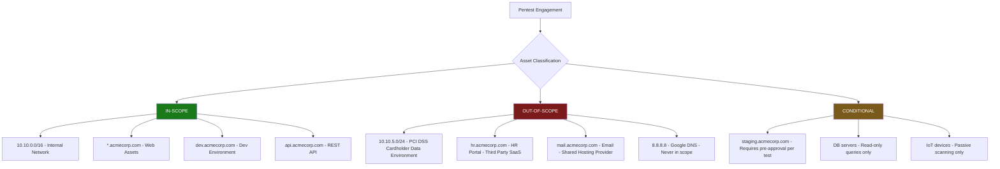
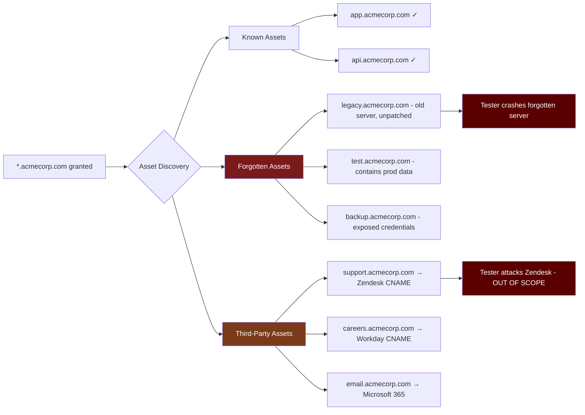
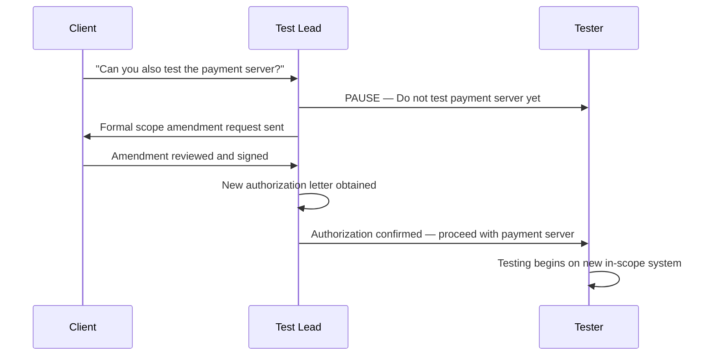
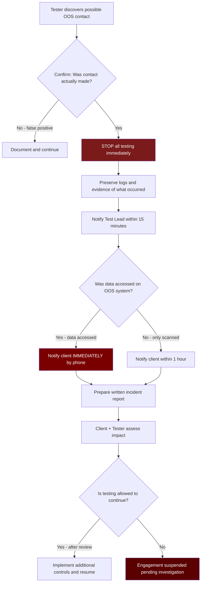

# Scope Definition

> **Difficulty:** Beginner → Advanced | **Category:** Penetration Testing

Defining scope is the most critical step before a single packet leaves your machine. A well-crafted scope statement is the legal contract between tester and client — it defines what systems you are authorized to touch, how you may interact with them, and what is explicitly off-limits. Scope failures have ended careers, triggered criminal prosecutions, and caused major production outages. This document covers everything from writing a clean scope statement to validating it in the field and handling accidental boundary violations.

---

## Table of Contents

1. [What Scope Means in a Pentest](#what-scope-means)
2. [In-Scope vs Out-of-Scope](#in-scope-vs-out-of-scope)
3. [Defining IP Ranges, Domains, and Applications](#defining-targets)
4. [Wildcard Scopes and Their Risks](#wildcard-scopes)
5. [Scope Creep](#scope-creep)
6. [Writing a Clear Scope Statement](#writing-scope)
7. [Scope Validation Techniques](#scope-validation)
8. [Accidental Out-of-Scope Activity](#accidental-oos)
9. [Sample Scope Documents](#sample-documents)
10. [Tools for Scope Management](#scope-tools)

---

## What Scope Means in a Pentest {#what-scope-means}

**Scope** is the formally agreed-upon boundary of a penetration test engagement. It is simultaneously a technical boundary, a legal boundary, and a contractual boundary. Without explicit written scope, any testing activity — no matter how well-intentioned — can be prosecuted under computer fraud and abuse laws in virtually every jurisdiction.

### Legal Foundation

In the United States, unauthorized access to computer systems is governed by:
- **Computer Fraud and Abuse Act (CFAA)** — 18 U.S.C. § 1030
- **Electronic Communications Privacy Act (ECPA)**
- State-level equivalents (e.g., California Penal Code § 502)

In the UK, the **Computer Misuse Act 1990** applies. EU member states follow the **NIS2 Directive** and national implementations. Scope documentation is your primary legal defense.

> **Warning:** "Implied permission" is not permission. You must have explicit, written authorization from the system owner — not just the IT manager, not just your client contact. The *owner* of the infrastructure must authorize testing.

### Scope as a Technical Boundary

Technically, scope defines:
- **Which IP addresses or CIDR ranges** you may send probes to
- **Which domain names or FQDNs** you may query or attack
- **Which web applications or APIs** are included
- **Which physical locations** you may attempt to access (for physical assessments)
- **Which attack techniques** are permitted or prohibited
- **Which time windows** are authorized for active testing

---

## In-Scope vs Out-of-Scope {#in-scope-vs-out-of-scope}

### Visual Scope Boundary Map



### Scope Classification Table

| Asset Type | In-Scope Example | Out-of-Scope Example | Notes |
|---|---|---|---|
| IP Range | `10.10.0.0/16` | `192.168.5.0/24` (HR VLAN) | Confirm subnet ownership |
| Domain | `*.acmecorp.com` | `acmecorp.zendesk.com` | Third-party SaaS, not owned |
| Web App | `shop.acmecorp.com` | `partners.acmecorp.com` | Partners access shared infra |
| Cloud Account | AWS Account `123456789012` | AWS Account `987654321098` | Separate business unit |
| Mobile App | `com.acmecorp.app` (Android/iOS) | Backend shared with third party | Confirm backend ownership |
| Physical | Building A, Server Room | Building B (tenant) | Legal occupancy matters |
| People | IT staff (phishing simulation) | Executives (explicitly excluded) | Role-based exclusions common |

### Common Out-of-Scope Traps

These systems are frequently out of scope even when they *appear* to be client assets:

1. **Third-party CDN infrastructure** — CloudFront, Fastly, Cloudflare are not client-owned
2. **Shared hosting platforms** — attacking the server affects other tenants
3. **SaaS platforms** — Salesforce, Zendesk, ServiceNow have their own security programs
4. **DNS providers** — Route53, Cloudflare DNS
5. **Payment processors** — Stripe, Braintree, PayPal are PCI DSS scoped separately
6. **ISP-managed infrastructure** — Border routers, upstream providers
7. **Emergency systems** — 911 infrastructure, hospital life-critical systems

---

## Defining IP Ranges, Domains, and Applications {#defining-targets}

### IP Range Definition

Always use **CIDR notation** in scope documents. Never use vague language like "the server network."

```
# Accepted format examples
CIDR Blocks:
  10.10.0.0/16       # 65,534 usable hosts
  172.16.0.0/12      # 1,048,574 usable hosts  
  192.168.100.0/24   # 254 usable hosts

Individual Hosts:
  10.10.1.50/32      # Single host
  203.0.113.45/32    # Single external IP

Ranges (convert to CIDR):
  10.10.1.1 - 10.10.1.100  # Use: 10.10.1.0/25 (128 hosts) - confirm exact range
```

Validate IP ownership before testing externally-routable addresses:

```bash
# Check WHOIS for IP ownership
whois 203.0.113.45

# Verify ASN ownership
whois -h whois.radb.net -- '-i origin AS15169' | head -20

# Using the 'whois' tool with ARIN
whois -h whois.arin.net 203.0.113.45

# Check IP geolocation and org
curl -s "https://ipapi.co/203.0.113.45/json/" | python3 -m json.tool

# Reverse DNS to confirm expected hostnames
dig -x 203.0.113.45 +short

# BGP prefix lookup
curl -s "https://api.bgpview.io/ip/203.0.113.45" | python3 -m json.tool
```

### Domain Scope Definition

Domain scope can be defined at multiple levels of specificity:

```
# Level 1: Fully Qualified Domain Name (most restrictive)
www.acmecorp.com

# Level 2: Subdomain wildcard
*.acmecorp.com               # All subdomains of acmecorp.com
*.internal.acmecorp.com      # All subdomains of internal.acmecorp.com

# Level 3: Root domain (broadest - use with extreme care)
acmecorp.com                 # Root domain and all subdomains
```

> **Note:** A wildcard scope `*.acmecorp.com` does NOT automatically include `acmecorp.com` itself unless explicitly stated. Always list both if both are in scope.

Verify domain ownership:

```bash
# WHOIS lookup for domain registrant
whois acmecorp.com | grep -E "Registrant|Organization|Admin"

# Check NS records to understand DNS infrastructure
dig NS acmecorp.com +short

# Certificate Transparency lookup to find all issued certs
curl -s "https://crt.sh/?q=%.acmecorp.com&output=json" | \
  python3 -m json.tool | grep "name_value" | sort -u

# Confirm subdomain list matches scope
subfinder -d acmecorp.com -silent | sort > discovered_subdomains.txt
# Then cross-reference against scope document
comm -23 discovered_subdomains.txt inscope_domains.txt  # Shows out-of-scope discovered
```

### Application-Level Scope

Web application scope should specify:

```
Application Scope Definition:
  URL Base:          https://app.acmecorp.com
  Included Paths:    /api/v1/*, /api/v2/*, /dashboard/*, /auth/*
  Excluded Paths:    /admin/billing/*, /api/v1/payments/*
  Authentication:    Provided test accounts (see Appendix A)
  Rate Limiting:     No DoS/brute force against /auth/login
  Data Constraints:  Do not modify production records; use test data only
```

---

## Wildcard Scopes and Their Risks {#wildcard-scopes}

**Wildcard scope** grants authorization to test all assets matching a pattern. While convenient, wildcards carry significant risk because they implicitly include assets the client may have forgotten about.

### Wildcard Scope Risk Assessment



### Handling Wildcard Scopes

Before acting on a wildcard scope, enumerate all assets and confirm with the client:

```bash
# Step 1: Full subdomain enumeration
amass enum -d acmecorp.com -o amass_results.txt
subfinder -d acmecorp.com -o subfinder_results.txt
assetfinder --subs-only acmecorp.com > assetfinder_results.txt

# Merge and deduplicate
cat amass_results.txt subfinder_results.txt assetfinder_results.txt | \
  sort -u > all_subdomains.txt

# Step 2: Check for CNAME records pointing to third parties
while read domain; do
  cname=$(dig CNAME "$domain" +short)
  if [ -n "$cname" ]; then
    echo "$domain -> CNAME -> $cname"
  fi
done < all_subdomains.txt | tee cname_map.txt

# Step 3: Flag third-party CNAMEs for exclusion
grep -E "zendesk|salesforce|workday|servicenow|cloudfront|github\.io|azurewebsites|amazonaws" \
  cname_map.txt > third_party_cnames.txt

echo "=== REQUIRES CLIENT CONFIRMATION BEFORE TESTING ==="
cat third_party_cnames.txt
```

> **Warning:** Testing a CNAME target that resolves to a third-party SaaS platform violates that platform's terms of service and potentially the CFAA, even if your client's domain name pointed there. Always check CNAMEs before testing.

---

## Scope Creep {#scope-creep}

**Scope creep** occurs when the actual testing activities expand beyond the originally agreed-upon boundaries — either accidentally or due to client pressure.

### Forms of Scope Creep

| Type | Example | Risk Level |
|---|---|---|
| **Target Expansion** | Client says "while you're in there, check the DMZ too" | High — no written authorization |
| **Technique Expansion** | Client asks for social engineering after signing a network-only SOW | High — different legal exposure |
| **Time Expansion** | Testing continues past the authorized window | Medium — authorization may expire |
| **Environment Expansion** | Testing prod instead of staging | Critical — production impact |
| **Data Scope Creep** | Exfiltrating more data than needed to prove a vulnerability | High — potential GDPR/HIPAA violation |

### Preventing Scope Creep

```
Scope Change Control Process:
1. Client requests additional scope
2. Tester STOPS all work related to new scope
3. Formal scope amendment drafted and signed
4. New authorization letter issued if new systems involved
5. Only then does testing on new scope begin

Rule: Verbal authorization is NEVER sufficient for scope expansion.
```



---

## Writing a Clear Scope Statement {#writing-scope}

### Required Elements of a Scope Statement

A professional scope statement must include every element in this checklist:

```
SCOPE STATEMENT CHECKLIST
==========================
□ Engagement name and client legal entity
□ Tester name(s) or organization and point of contact
□ Start date and end date (with timezone)
□ Testing hours (e.g., 08:00-18:00 EST, Mon-Fri only)
□ Explicit list of in-scope IP ranges (CIDR)
□ Explicit list of in-scope domain names
□ Explicit list of in-scope web applications (with URLs)
□ Explicit list of OUT-OF-SCOPE systems
□ Authorized testing techniques (e.g., network scanning, web app, social engineering)
□ PROHIBITED techniques (e.g., no DoS, no physical, no phishing employees)
□ Authorized credentials provided (for authenticated testing)
□ Emergency stop condition and contact
□ Rules of engagement (e.g., notify before exploitation of critical vulns)
□ Data handling requirements
□ Signature of authorized client representative (system owner)
□ Signature of tester/firm
```

### Sample Scope Statement — ACME Corp Network Assessment

```
PENETRATION TESTING SCOPE STATEMENT
=====================================
Engagement:    External Network Assessment + Web Application Testing
Client:        ACME Corporation, Inc. (Delaware Corp. EIN: XX-XXXXXXX)
Vendor:        SecureTest LLC, License #ST-2024-001
Test Lead:     Jane Tester <jane@securetest.com>

ENGAGEMENT WINDOW
-----------------
Start:         2024-03-15 08:00 EST
End:           2024-03-22 18:00 EST
Active Hours:  Monday–Friday, 08:00–18:00 EST
               (no weekend testing without prior written approval)

IN-SCOPE SYSTEMS
----------------
IP Ranges:
  203.0.113.0/28         # External DMZ (14 hosts)
  198.51.100.16/29       # Public web servers (6 hosts)

Domains (all subdomains included unless explicitly excluded below):
  *.acmecorp.com
  acmecorp.com

Web Applications:
  https://www.acmecorp.com        # Marketing site
  https://app.acmecorp.com        # Customer portal (all paths)
  https://api.acmecorp.com/v1/*   # REST API v1
  https://api.acmecorp.com/v2/*   # REST API v2
  https://admin.acmecorp.com      # Admin panel

OUT-OF-SCOPE SYSTEMS (EXPLICITLY EXCLUDED)
-------------------------------------------
  10.10.5.0/24           # PCI CDE — PROHIBITED, any contact must be reported immediately
  hr.acmecorp.com        # Workday SaaS — third-party, not authorized
  mail.acmecorp.com      # Microsoft 365 — covered by separate MSSP
  support.acmecorp.com   # Zendesk CNAME — third-party
  careers.acmecorp.com   # Greenhouse.io CNAME — third-party
  *.partners.acmecorp.com # Partner portal — separate entity authorization needed

AUTHORIZED TECHNIQUES
----------------------
  ✓ External network scanning and enumeration
  ✓ Vulnerability scanning (non-destructive)
  ✓ Web application testing (OWASP Top 10)
  ✓ Manual exploitation of identified vulnerabilities
  ✓ Authentication bypass attempts
  ✓ Privilege escalation (on in-scope systems only)
  ✓ Password spraying (max 3 attempts per account per hour)
  ✓ Subdomain enumeration

PROHIBITED TECHNIQUES
----------------------
  ✗ Denial of Service (DoS/DDoS) of any kind
  ✗ Phishing or social engineering of employees
  ✗ Physical access attempts
  ✗ Destruction or modification of data
  ✗ Lateral movement beyond the defined IP ranges
  ✗ Testing from third-party cloud (use only approved source IPs)
  ✗ Use of zero-day exploits without prior written approval

AUTHORIZED SOURCE IPs (Tester egress)
---------------------------------------
  All testing MUST originate from:
    192.0.2.10/32    # SecureTest primary test node
    192.0.2.11/32    # SecureTest secondary test node

AUTHORIZED TEST CREDENTIALS
-----------------------------
  See Appendix A (delivered separately via encrypted channel)

EMERGENCY STOP CONTACT
------------------------
  Primary:   John Smith (CISO), +1-555-100-0001, jsmith@acmecorp.com
  Secondary: Sarah Jones (IT Director), +1-555-100-0002, sjones@acmecorp.com
  Stop code: "BRAVO STOP" — all testing ceases immediately upon receipt

AUTHORIZED SIGNATURES
----------------------
Client Representative (System Owner):
  Name:  John Smith
  Title: Chief Information Security Officer, ACME Corporation
  Date:  _______________
  Sig:   _______________

Testing Firm:
  Name:  Jane Tester
  Title: Lead Penetration Tester, SecureTest LLC
  Date:  _______________
  Sig:   _______________
```

---

## Scope Validation Techniques {#scope-validation}

Before starting any active testing, validate that every in-scope asset actually belongs to the client.

### IP Ownership Validation

```bash
#!/bin/bash
# scope_validator.sh — Validate IP ownership before testing

SCOPE_FILE="inscope_ips.txt"       # One CIDR or IP per line
CLIENT_ORG="ACME Corporation"

echo "=== IP SCOPE VALIDATION REPORT ==="
echo "Date: $(date)"
echo ""

while IFS= read -r target; do
    echo "--- Checking: $target ---"
    
    # WHOIS lookup
    org=$(whois "$target" 2>/dev/null | grep -iE "OrgName|org-name|Organization" | head -1)
    echo "  WHOIS Org: $org"
    
    # Reverse DNS
    ptr=$(dig -x "$target" +short 2>/dev/null | head -3)
    echo "  PTR Record: ${ptr:-none}"
    
    # ASN info
    asn=$(whois -h whois.cymru.com " -v $target" 2>/dev/null | tail -1)
    echo "  ASN Info: $asn"
    
    echo ""
done < "$SCOPE_FILE"
```

### Domain Validation

```bash
#!/bin/bash
# domain_scope_validator.sh

DOMAINS_FILE="inscope_domains.txt"

while IFS= read -r domain; do
    echo "=== Validating: $domain ==="
    
    # Registrant WHOIS
    registrant=$(whois "$domain" 2>/dev/null | grep -iE "Registrant Name|Registrant Organization" | head -2)
    echo "  Registrant: $registrant"
    
    # SOA record (authoritative nameserver)
    soa=$(dig SOA "$domain" +short 2>/dev/null)
    echo "  SOA: $soa"
    
    # Check for CNAME (might point to third party)
    cname=$(dig CNAME "$domain" +short 2>/dev/null)
    if [ -n "$cname" ]; then
        echo "  *** WARNING: CNAME detected → $cname"
        echo "  *** Confirm this target is owned by client before testing"
    fi
    
    # Certificate check
    cert_org=$(echo | openssl s_client -connect "$domain":443 -servername "$domain" 2>/dev/null | \
               openssl x509 -noout -subject 2>/dev/null | grep -oP "O = [^,]+")
    echo "  TLS Cert Org: $cert_org"
    
    echo ""
done < "$DOMAINS_FILE"
```

### Network Reachability from Authorized Source

```bash
# Confirm you are testing from the authorized source IP
echo "My current egress IP:"
curl -s https://api.ipify.org
echo ""

# This must match the source IPs in the scope document
# If it doesn't match, DO NOT BEGIN TESTING

# Check that scope IPs are reachable
for target in 203.0.113.1 203.0.113.2 203.0.113.3; do
    ping -c 1 -W 2 "$target" > /dev/null 2>&1 && \
        echo "REACHABLE: $target" || echo "UNREACHABLE: $target"
done
```

---

## Accidental Out-of-Scope Activity {#accidental-oos}

Despite best planning, accidents happen. How you handle them determines whether an incident becomes a legal crisis.

### Out-of-Scope Incident Response Flow



### OOS Incident Report Template

```
OUT-OF-SCOPE CONTACT INCIDENT REPORT
======================================
Date/Time:          2024-03-17 14:32 EST
Tester:             Jane Tester
Incident ID:        OOS-2024-001

WHAT HAPPENED:
  During automated Nmap scan of 203.0.113.0/28, the scan range was
  inadvertently specified as 203.0.113.0/27 (double the intended range),
  causing probes to be sent to 203.0.113.16/28 which is NOT in scope.

SYSTEMS CONTACTED:
  IP Addresses: 203.0.113.16 – 203.0.113.31
  Duration:     ~45 seconds (scan automatically completed before detected)
  Probe Types:  TCP SYN scan ports 22,80,443 only
  Data Accessed: None — SYN packets only, no sessions established

IMMEDIATE ACTIONS TAKEN:
  14:32 EST — Scan terminated
  14:35 EST — Test Lead notified
  14:47 EST — Client CISO notified by phone (John Smith)
  14:55 EST — All testing suspended pending client review

EVIDENCE PRESERVED:
  /logs/nmap_203.0.113.0_27_20240317_1432.xml
  /logs/tcpdump_eth0_20240317_1432.pcap

CLIENT RESPONSE:
  John Smith confirmed 203.0.113.16/28 belongs to ACME subsidiary.
  No data exposure. Client approved resumption after scope correction.

CORRECTIVE ACTIONS:
  1. Scope document updated with explicit /28 notation
  2. Pre-scan IP range verification script added to methodology
  3. All future scans must be confirmed against scope_validator.sh output
```

---

## Sample Scope Documents {#sample-documents}

### Minimal Scope Document — Internal Network Assessment

```
INTERNAL NETWORK PENETRATION TEST SCOPE
Client:     TechStartup Inc.
Date:       2024-Q1
Tester:     RedTeam Security

IN SCOPE:
  Networks:  10.0.0.0/8 (all internal RFC1918 space owned by client)
  Exclusions:
    - 10.100.0.0/16 (production database cluster — read-only access only)
    - 10.200.0.0/24 (backup systems — no testing)
    - Any system tagged with label "EXCLUDE" in asset inventory

TECHNIQUES:
  Permitted: Scanning, enumeration, exploitation, lateral movement, 
             privilege escalation, credential harvesting (internal)
  Forbidden: Data destruction, DoS, exfiltration of PII beyond PoC

TIMING:
  Start: 2024-01-15 00:00 PST
  End:   2024-01-22 23:59 PST
  (24/7 testing permitted for internal engagement)

EMERGENCY CONTACT:
  NOC: +1-555-200-0100 (24/7)
```

### Cloud Scope Addendum

```
CLOUD ENVIRONMENT SCOPE ADDENDUM
===================================
Provider:         Amazon Web Services
Account ID:       123456789012
Account Name:     acmecorp-production

AUTHORIZED SERVICES FOR TESTING:
  EC2 Instances:    All instances in region us-east-1
  S3 Buckets:       acmecorp-public-*, acmecorp-app-*
  RDS:              acmecorp-db-* (read access only, no dropping tables)
  Lambda:           All functions in us-east-1
  API Gateway:      All APIs in us-east-1

EXPLICITLY EXCLUDED:
  S3 Bucket:        acmecorp-backups-* (disaster recovery, no testing)
  RDS:              acmecorp-prod-finance-* (financial data, PCI scope)
  Region:           us-west-2 (disaster recovery region, no testing)

CLOUD-SPECIFIC RULES:
  - No crypto-mining or resource abuse
  - No modification of billing settings
  - No testing of AWS infrastructure (AWS manages this)
  - Notify if any S3 buckets found publicly exposed before exploiting

AWS Pentest Approval: Submitted via AWS Support portal (Ticket #AWS-2024-12345)
```

---

## Tools for Scope Management {#scope-tools}

### Scope Tracking Spreadsheet Structure

```
SCOPE MANAGEMENT TRACKER
=========================
Sheet 1: In-Scope Assets
  Columns: Asset ID | Type | Value | Owner Confirmed | Last Verified | Notes

Sheet 2: Out-of-Scope Assets  
  Columns: Asset ID | Type | Value | Reason | Discovered By

Sheet 3: Conditional Assets
  Columns: Asset ID | Type | Condition | Approval Status | Approver

Sheet 4: Change Log
  Columns: Date | Changed By | Change Description | Authorized By
```

### Command-Line Scope Validation Toolkit

```bash
# Generate scope targets from CIDR for tooling
# Used to feed tools like nmap, masscan exactly what's in scope

pip install netaddr  # or use ipcalc

python3 -c "
import netaddr
scope_cidrs = ['203.0.113.0/28', '198.51.100.16/29']
for cidr in scope_cidrs:
    net = netaddr.IPNetwork(cidr)
    for ip in net.iter_hosts():
        print(ip)
" > scope_targets.txt

echo "Total in-scope hosts: $(wc -l < scope_targets.txt)"

# Validate nmap scan won't exceed scope
# Feed scope_targets.txt as -iL input
nmap -iL scope_targets.txt --excludefile out_of_scope.txt \
  -sV -O --top-ports 100 -oX scan_results.xml

# Generate out-of-scope exclusion file for masscan
# masscan uses --exclude flag
masscan --range 0.0.0.0/0 \
  --exclude 10.100.0.0/16 \
  --exclude 10.200.0.0/24 \
  -iL scope_targets.txt \
  -p80,443,22,3389 --rate=1000 -oX masscan_results.xml
```

### Automated Scope Drift Detection

```bash
#!/bin/bash
# scope_drift_checker.sh
# Run daily during engagement to detect if new assets appear that are in scope

SCOPE_DOMAINS="acmecorp.com"
KNOWN_ASSETS="known_assets.txt"
NEW_ASSETS="new_assets_$(date +%Y%m%d).txt"

# Enumerate current assets
subfinder -d "$SCOPE_DOMAINS" -silent | sort > "$NEW_ASSETS"

# Compare to known assets
echo "=== NEW ASSETS DETECTED (may be in scope) ==="
comm -13 "$KNOWN_ASSETS" "$NEW_ASSETS"

echo ""
echo "=== ASSETS NO LONGER RESOLVING ==="
comm -23 "$KNOWN_ASSETS" "$NEW_ASSETS"
```

### Scope Reference Tools Summary

| Tool | Purpose | Command |
|---|---|---|
| `whois` | IP/domain ownership | `whois 203.0.113.45` |
| `dig` | DNS validation | `dig NS acmecorp.com +short` |
| `subfinder` | Subdomain discovery | `subfinder -d acmecorp.com` |
| `amass` | Asset mapping | `amass enum -d acmecorp.com` |
| `netaddr` (Python) | CIDR math | `python3 -c "import netaddr; ..."` |
| `nmap --excludefile` | Enforce OOS exclusions | `nmap -iL scope.txt --excludefile oos.txt` |
| `masscan --exclude` | High-speed scoped scanning | `masscan --exclude 10.100.0.0/16` |
| `crt.sh` | Certificate transparency | `curl "https://crt.sh/?q=%.acmecorp.com"` |
| `bgpview.io API` | ASN/prefix lookup | `curl "https://api.bgpview.io/ip/X.X.X.X"` |

---

## Quick Reference — Scope Definition Checklist

```
PRE-ENGAGEMENT SCOPE CHECKLIST
================================
[ ] All IP ranges documented in CIDR notation
[ ] All domains listed with explicit wildcard/non-wildcard status
[ ] All web applications listed with full URLs
[ ] All out-of-scope systems explicitly listed
[ ] WHOIS verification performed on all external IPs
[ ] CNAME records checked for third-party hosting
[ ] Cloud account IDs documented and provider notified (if required)
[ ] Authorized source IPs confirmed and documented
[ ] Test credentials received and validated
[ ] Emergency stop contact confirmed reachable
[ ] Scope statement signed by system owner (not just IT manager)
[ ] Scope amendment process understood by all team members
[ ] scope_validator.sh run and output saved to engagement record
[ ] All team members have read and signed the scope document
```

> **Note:** Keep a copy of the signed scope statement accessible at all times during testing — on your phone if necessary. If your laptop dies in the field, you still need to be able to produce authorization proof.

> **Warning:** If at any point you are unsure whether a system is in scope, **STOP** and ask. The 10 minutes it takes to confirm saves you from potential criminal liability.

---

*Last updated: 2024 | Category: Engagement Planning | Next: [Target Identification](./target-identification.md)*
