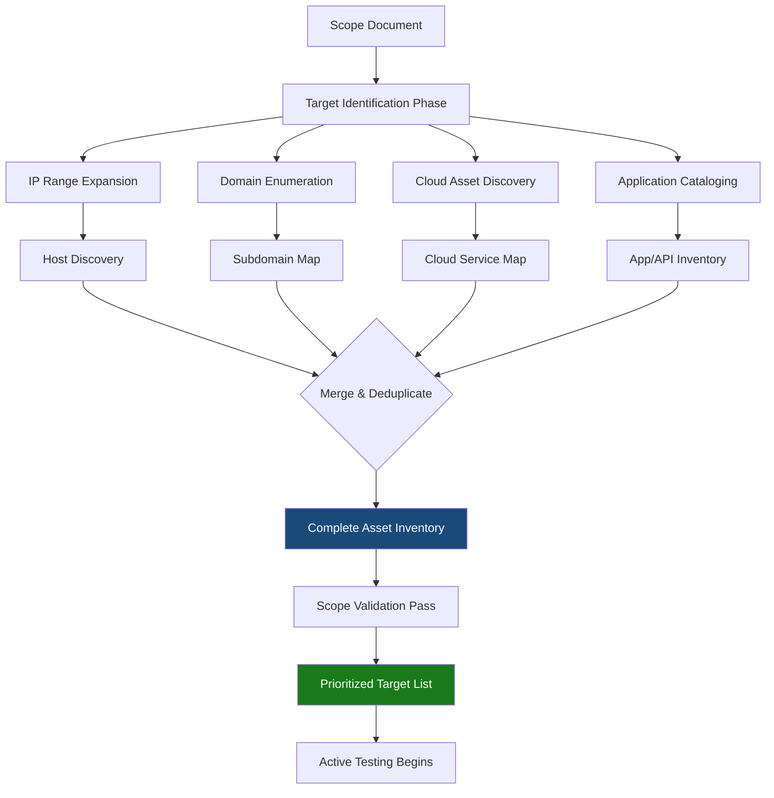
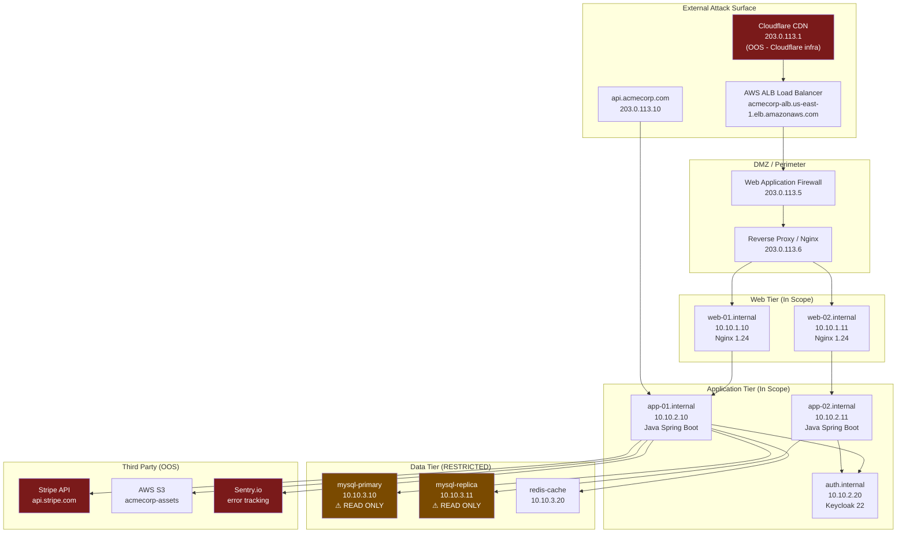

# Target Identification

> **Difficulty:** Beginner → Advanced | **Category:** Penetration Testing

Target identification is the disciplined process of cataloging every asset within scope before active exploitation begins. Unlike reconnaissance in the attack lifecycle — which aims to find unknowns — engagement-phase target identification aims to build a structured, verified inventory of what you are *authorized* to test. Knowing your targets completely prevents wasted effort, prevents accidental out-of-scope contact, and ensures comprehensive coverage. This document covers IP range analysis, domain enumeration, cloud asset discovery, third-party dependency mapping, and the tools and techniques professionals use to build complete target maps before firing a single exploit.

---

## Table of Contents

1. [Why Target Identification Matters](#why-it-matters)
2. [Asset Inventory Framework](#asset-inventory)
3. [IP Range Analysis](#ip-range-analysis)
4. [Domain Enumeration for Planning](#domain-enumeration)
5. [Cloud Asset Identification](#cloud-assets)
6. [Third-Party Dependency Mapping](#third-party)
7. [Target Relationship Mapping](#relationship-mapping)
8. [OSINT Tools: Shodan, Censys, WHOIS](#osint-tools)
9. [Building the Asset Inventory](#building-inventory)
10. [Prioritizing Targets](#prioritizing)

---

## Why Target Identification Matters {#why-it-matters}

The difference between a professional penetration test and an amateur one is systematic coverage. Without a complete target inventory, you will:

- Miss assets that contain critical vulnerabilities
- Waste hours attacking hardened systems while easy wins exist elsewhere
- Risk touching out-of-scope systems when target boundaries are unclear
- Produce a report that misses significant attack surface
- Fail to demonstrate business risk to the client

**Target identification** transforms the scope document (a list of strings) into an actionable technical map of every host, service, application, and relationship within the authorized boundary.



---

## Asset Inventory Framework {#asset-inventory}

A structured **asset inventory** organizes targets by type, criticality, and relationship. This becomes the master document referenced throughout the engagement.

### Asset Classification Schema

| Asset Class | Subtype | Example | Priority |
|---|---|---|---|
| **Network** | External Host | `203.0.113.45` | High |
| **Network** | Internal Host | `10.10.5.20` | Medium |
| **Network** | Network Device | `10.10.1.1` (firewall) | High |
| **DNS** | Root Domain | `acmecorp.com` | High |
| **DNS** | Subdomain | `api.acmecorp.com` | High |
| **DNS** | Wildcard | `*.dev.acmecorp.com` | Medium |
| **Web** | Public Application | `https://app.acmecorp.com` | Critical |
| **Web** | API Endpoint | `https://api.acmecorp.com/v2` | Critical |
| **Web** | Admin Panel | `https://admin.acmecorp.com` | Critical |
| **Cloud** | S3 Bucket | `acmecorp-data.s3.amazonaws.com` | High |
| **Cloud** | Cloud Instance | EC2 `i-0abc123def456` | High |
| **Cloud** | Serverless | Lambda `acmecorp-auth` | Medium |
| **Mobile** | Android App | `com.acmecorp.app` | Medium |
| **Mobile** | iOS App | `com.acmecorp.ios` | Medium |
| **Third-Party** | CDN | Cloudfront distribution | Context |
| **Third-Party** | SaaS CNAME | Zendesk, Salesforce | OOS flag |

### Inventory Database Schema

```sql
-- Asset inventory schema (use SQLite for engagement tracking)
CREATE TABLE assets (
    id INTEGER PRIMARY KEY AUTOINCREMENT,
    asset_type TEXT NOT NULL,          -- ip, domain, url, cloud, mobile
    value TEXT NOT NULL UNIQUE,        -- the actual asset identifier
    owner_confirmed BOOLEAN DEFAULT 0, -- is this confirmed client-owned?
    in_scope BOOLEAN DEFAULT 1,
    priority INTEGER DEFAULT 3,        -- 1=critical, 2=high, 3=medium, 4=low
    services TEXT,                     -- JSON array of open services
    notes TEXT,
    discovered_by TEXT,                -- which tool found this
    status TEXT DEFAULT 'pending',     -- pending, scanning, complete, excluded
    created_at TIMESTAMP DEFAULT CURRENT_TIMESTAMP
);

CREATE TABLE asset_relationships (
    parent_id INTEGER REFERENCES assets(id),
    child_id INTEGER REFERENCES assets(id),
    relationship_type TEXT,            -- resolves_to, hosts, cname_of, api_of
    PRIMARY KEY (parent_id, child_id, relationship_type)
);

-- Quick query: show all high-priority unchecked assets
SELECT value, asset_type, priority, status 
FROM assets 
WHERE in_scope = 1 AND status = 'pending' 
ORDER BY priority ASC, asset_type;
```

---

## IP Range Analysis {#ip-range-analysis}

### Expanding CIDR Ranges to Host Lists

```bash
#!/bin/bash
# expand_scope.sh — Convert CIDR ranges to individual host lists
# Requires: python3-netaddr OR ipcalc OR nmap

SCOPE_CIDRS=(
    "203.0.113.0/28"
    "198.51.100.16/29"
    "10.10.0.0/16"
)

# Method 1: Using nmap's list scan (fast, no packets sent)
for cidr in "${SCOPE_CIDRS[@]}"; do
    nmap -sL -n "$cidr" | grep "Nmap scan report" | awk '{print $NF}'
done | sort -t. -k1,1n -k2,2n -k3,3n -k4,4n > all_ips.txt

echo "Total IPs in scope: $(wc -l < all_ips.txt)"

# Method 2: Using Python netaddr
python3 << 'EOF'
from netaddr import IPNetwork, IPSet
import sys

cidrs = ["203.0.113.0/28", "198.51.100.16/29", "10.10.0.0/16"]
ip_set = IPSet()

for cidr in cidrs:
    net = IPNetwork(cidr)
    ip_set.add(net)
    print(f"{cidr}: {net.size - 2} usable hosts", file=sys.stderr)

for ip in sorted(ip_set):
    print(ip)
EOF
```

### Host Discovery — Determine Which IPs Are Live

```bash
# Phase 1: Ping sweep (ICMP) — fastest, often blocked
nmap -sn -PE -iL all_ips.txt -oG ping_sweep.gnmap \
  --min-hostgroup 256 --min-parallelism 256 -T4

# Extract live hosts
grep "Up" ping_sweep.gnmap | awk '{print $2}' > live_hosts_icmp.txt

# Phase 2: TCP discovery — more reliable when ICMP blocked
nmap -sn -PS22,80,443,3389,8080,8443 -PA80,443 \
  -iL all_ips.txt -oG tcp_discovery.gnmap -T4

grep "Up" tcp_discovery.gnmap | awk '{print $2}' > live_hosts_tcp.txt

# Phase 3: Merge results
cat live_hosts_icmp.txt live_hosts_tcp.txt | sort -u > live_hosts.txt
echo "Live hosts discovered: $(wc -l < live_hosts.txt)"

# Phase 4: UDP discovery for critical services
# (Much slower — run targeted)
nmap -sU --top-ports 20 -iL live_hosts.txt -oG udp_scan.gnmap -T4 \
  --max-retries 1 --host-timeout 30s

# Phase 5: High-speed external scope validation with masscan
# Only on external ranges — masscan is too loud for internal
masscan -iL external_scope.txt -p0-65535 --rate=10000 \
  --output-format xml --output-filename masscan_all_ports.xml
```

### Service Enumeration on Live Hosts

```bash
# Comprehensive service scan on confirmed live hosts
nmap -sV -sC -O --version-intensity 7 \
  -iL live_hosts.txt \
  -oA nmap_service_scan \
  --min-rate 500 \
  -T4 \
  --open

# Parse results into readable summary
python3 << 'EOF'
import xml.etree.ElementTree as ET

tree = ET.parse('nmap_service_scan.xml')
root = tree.getroot()

print(f"{'IP':<20} {'Port':<8} {'State':<10} {'Service':<20} {'Version'}")
print("-" * 80)

for host in root.findall('host'):
    addr = host.find('address').get('addr')
    ports = host.find('ports')
    if ports is None:
        continue
    for port in ports.findall('port'):
        state = port.find('state').get('state')
        if state != 'open':
            continue
        portid = port.get('portid')
        svc = port.find('service')
        if svc is not None:
            svc_name = svc.get('name', '')
            svc_ver = f"{svc.get('product', '')} {svc.get('version', '')}".strip()
        else:
            svc_name, svc_ver = '', ''
        print(f"{addr:<20} {portid:<8} {state:<10} {svc_name:<20} {svc_ver}")
EOF
```

---

## Domain Enumeration for Planning {#domain-enumeration}

Domain enumeration during the planning phase is about building a comprehensive picture of the client's web presence *before* active testing begins.

### Passive DNS Enumeration

```bash
# Method 1: subfinder — aggregates 50+ passive sources
subfinder -d acmecorp.com \
  -all \
  -o subfinder_passive.txt \
  -silent

# Method 2: amass passive mode (no active DNS brute-force)
amass enum -passive -d acmecorp.com \
  -o amass_passive.txt

# Method 3: Certificate Transparency logs
# crt.sh — search for all certificates issued for domain
curl -s "https://crt.sh/?q=%.acmecorp.com&output=json" | \
  python3 -c "
import json, sys
data = json.load(sys.stdin)
names = set()
for cert in data:
    name = cert.get('name_value', '')
    for n in name.split('\n'):
        n = n.strip().lstrip('*.')
        if n:
            names.add(n.lower())
for n in sorted(names):
    print(n)
" > crtsh_subdomains.txt

# Method 4: DNS Dumpster (via API)
curl -s "https://api.hackertarget.com/hostsearch/?q=acmecorp.com" | \
  cut -d',' -f1 > dnsdumpster_results.txt

# Method 5: Wayback Machine subdomain discovery
curl -s "http://web.archive.org/cdx/search/cdx?url=*.acmecorp.com/*&output=text&fl=original&collapse=urlkey" | \
  grep -oP 'https?://([a-z0-9._-]+\.acmecorp\.com)' | \
  sed 's|https\?://||' | sort -u > wayback_subdomains.txt

# Merge all passive results
cat subfinder_passive.txt amass_passive.txt crtsh_subdomains.txt \
    dnsdumpster_results.txt wayback_subdomains.txt | \
  tr '[:upper:]' '[:lower:]' | sort -u > all_subdomains_passive.txt

echo "Total unique subdomains (passive): $(wc -l < all_subdomains_passive.txt)"
```

### Active DNS Resolution and Validation

```bash
#!/bin/bash
# resolve_and_validate.sh
# Resolve all discovered subdomains and check if they're live

INPUT="all_subdomains_passive.txt"
RESOLVED="resolved_subdomains.txt"
UNRESOLVED="unresolved_subdomains.txt"

# Use massdns for high-speed resolution
# Install: apt install massdns
massdns -r /opt/massdns/lists/resolvers.txt \
  -t A \
  -o S \
  -w massdns_output.txt \
  "$INPUT"

# Parse massdns output
python3 << 'EOF'
resolved = []
unresolved = []

with open('massdns_output.txt') as f:
    for line in f:
        parts = line.strip().split()
        if len(parts) >= 3 and parts[1] == 'A':
            domain = parts[0].rstrip('.')
            ip = parts[2]
            resolved.append((domain, ip))

with open('resolved_subdomains.txt', 'w') as f:
    for domain, ip in sorted(resolved):
        f.write(f"{domain},{ip}\n")

print(f"Resolved: {len(resolved)} subdomains")
EOF

# Additionally check which ones have HTTP/HTTPS services
httpx -l resolved_subdomains.txt \
  -ports 80,443,8080,8443,8000,8888 \
  -threads 50 \
  -title \
  -status-code \
  -tech-detect \
  -o httpx_web_assets.txt

echo "Web assets with HTTP services: $(wc -l < httpx_web_assets.txt)"
```

### DNS Record Deep Dive

```bash
#!/bin/bash
# dns_deep_dive.sh — Collect all DNS records for in-scope domains

DOMAIN="acmecorp.com"
OUTPUT_DIR="dns_records"
mkdir -p "$OUTPUT_DIR"

echo "=== DNS Deep Dive: $DOMAIN ==="

# A records
echo "--- A Records ---"
dig A "$DOMAIN" +short | tee "$OUTPUT_DIR/a_records.txt"

# AAAA records (IPv6)
echo "--- AAAA Records ---"
dig AAAA "$DOMAIN" +short | tee "$OUTPUT_DIR/aaaa_records.txt"

# MX records — mail infrastructure
echo "--- MX Records (mail servers) ---"
dig MX "$DOMAIN" +short | sort -n | tee "$OUTPUT_DIR/mx_records.txt"

# NS records — nameservers
echo "--- NS Records ---"
dig NS "$DOMAIN" +short | tee "$OUTPUT_DIR/ns_records.txt"

# TXT records — SPF, DKIM, domain verification tokens
echo "--- TXT Records (SPF/DKIM/verification) ---"
dig TXT "$DOMAIN" +short | tee "$OUTPUT_DIR/txt_records.txt"

# SOA record — zone authority
echo "--- SOA Record ---"
dig SOA "$DOMAIN" +short | tee "$OUTPUT_DIR/soa_record.txt"

# CAA records — certificate authority restrictions
echo "--- CAA Records ---"
dig CAA "$DOMAIN" +short | tee "$OUTPUT_DIR/caa_records.txt"

# DMARC record
echo "--- DMARC Record ---"
dig TXT "_dmarc.$DOMAIN" +short | tee "$OUTPUT_DIR/dmarc.txt"

# SPF analysis
echo "--- SPF Analysis ---"
python3 << 'PYEOF'
import subprocess
import re

domain = "acmecorp.com"
result = subprocess.run(['dig', 'TXT', domain, '+short'], capture_output=True, text=True)
for line in result.stdout.splitlines():
    if 'spf' in line.lower() or 'v=spf' in line.lower():
        print(f"SPF Record: {line}")
        includes = re.findall(r'include:(\S+)', line)
        ips = re.findall(r'ip[46]:([^\s"]+)', line)
        print(f"  Included domains: {includes}")
        print(f"  Allowed IPs: {ips}")
PYEOF

# Zone transfer attempt (usually blocked, but worth trying)
echo "--- Zone Transfer Attempt (AXFR) ---"
for ns in $(dig NS "$DOMAIN" +short); do
    echo "  Trying nameserver: $ns"
    dig AXFR "$DOMAIN" @"$ns" 2>&1 | head -5
done
```

---

## Cloud Asset Identification {#cloud-assets}

Modern environments span multiple cloud providers. Identifying cloud assets requires a different approach than traditional network scanning.

### AWS Asset Discovery

```bash
# Prerequisite: AWS CLI configured with read-only credentials
# aws configure --profile pentest-readonly

PROFILE="pentest-readonly"
ACCOUNT_ID=$(aws sts get-caller-identity --profile $PROFILE --query Account --output text)
echo "AWS Account ID: $ACCOUNT_ID"

# EC2 Instances across all regions
echo "=== EC2 Instances ==="
aws ec2 describe-instances \
  --profile $PROFILE \
  --query 'Reservations[*].Instances[*].{ID:InstanceId,IP:PublicIpAddress,PrivateIP:PrivateIpAddress,State:State.Name,Name:Tags[?Key==`Name`]|[0].Value,Type:InstanceType}' \
  --output table \
  --region us-east-1

# All regions scan
for region in $(aws ec2 describe-regions --profile $PROFILE --query 'Regions[*].RegionName' --output text); do
    count=$(aws ec2 describe-instances --profile $PROFILE --region "$region" \
            --query 'length(Reservations[*].Instances[*])' --output text 2>/dev/null)
    [ "$count" != "0" ] && echo "Region $region: $count instances"
done

# S3 Buckets
echo "=== S3 Buckets ==="
aws s3 ls --profile $PROFILE

# Check each bucket's public access settings
for bucket in $(aws s3api list-buckets --profile $PROFILE --query 'Buckets[*].Name' --output text); do
    acl=$(aws s3api get-bucket-acl --profile $PROFILE --bucket "$bucket" \
          --query 'Grants[?Grantee.URI==`http://acs.amazonaws.com/groups/global/AllUsers`]' \
          --output text 2>/dev/null)
    if [ -n "$acl" ]; then
        echo "PUBLIC BUCKET: $bucket (ACL: $acl)"
    fi
done

# RDS Databases
echo "=== RDS Instances ==="
aws rds describe-db-instances \
  --profile $PROFILE \
  --query 'DBInstances[*].{ID:DBInstanceIdentifier,Engine:Engine,Endpoint:Endpoint.Address,Port:Endpoint.Port,Public:PubliclyAccessible}' \
  --output table

# Lambda Functions
echo "=== Lambda Functions ==="
aws lambda list-functions \
  --profile $PROFILE \
  --query 'Functions[*].{Name:FunctionName,Runtime:Runtime,LastModified:LastModified}' \
  --output table

# API Gateway
echo "=== API Gateway APIs ==="
aws apigateway get-rest-apis \
  --profile $PROFILE \
  --query 'items[*].{ID:id,Name:name,Created:createdDate}' \
  --output table

# ELB/ALB Load Balancers (entry points into the environment)
echo "=== Load Balancers ==="
aws elbv2 describe-load-balancers \
  --profile $PROFILE \
  --query 'LoadBalancers[*].{Name:LoadBalancerName,DNS:DNSName,Type:Type,State:State.Code}' \
  --output table

# Security Groups (understand network access controls)
echo "=== Security Groups with 0.0.0.0/0 Ingress ==="
aws ec2 describe-security-groups \
  --profile $PROFILE \
  --filters Name=ip-permission.cidr,Values='0.0.0.0/0' \
  --query 'SecurityGroups[*].{ID:GroupId,Name:GroupName,Port:IpPermissions[*].FromPort}' \
  --output table
```

### Azure Asset Discovery

```bash
# Azure CLI: az login first
# az login --service-principal -u <AppId> -p <Password> --tenant <TenantId>

SUBSCRIPTION_ID="<subscription-id>"

# Set active subscription
az account set --subscription "$SUBSCRIPTION_ID"

# List all resource groups
echo "=== Resource Groups ==="
az group list --query '[*].{Name:name,Location:location}' --output table

# Virtual Machines
echo "=== Virtual Machines ==="
az vm list --show-details \
  --query '[*].{Name:name,ResourceGroup:resourceGroup,State:powerState,PublicIP:publicIps,PrivateIP:privateIps,OS:storageProfile.osDisk.osType}' \
  --output table

# App Services (web applications)
echo "=== App Services ==="
az webapp list \
  --query '[*].{Name:name,URL:defaultHostName,State:state,ResourceGroup:resourceGroup}' \
  --output table

# Storage Accounts
echo "=== Storage Accounts ==="
az storage account list \
  --query '[*].{Name:name,ResourceGroup:resourceGroup,Location:location,Tier:sku.tier}' \
  --output table

# SQL Databases
echo "=== Azure SQL Servers ==="
az sql server list \
  --query '[*].{Name:name,FQDN:fullyQualifiedDomainName,State:state}' \
  --output table

# Network Security Groups (firewall rules)
echo "=== NSGs with any-source rules ==="
az network nsg list \
  --query '[*].{Name:name,ResourceGroup:resourceGroup}' \
  --output table
```

### GCP Asset Discovery

```bash
# Google Cloud SDK: gcloud auth login
PROJECT_ID="acmecorp-production-12345"

# Compute instances
echo "=== GCP Compute Instances ==="
gcloud compute instances list \
  --project "$PROJECT_ID" \
  --format="table(name,zone,machineType,status,networkInterfaces[0].accessConfigs[0].natIP,networkInterfaces[0].networkIP)"

# Cloud Storage Buckets
echo "=== Cloud Storage Buckets ==="
gsutil ls -p "$PROJECT_ID"

# Check bucket IAM for public access
for bucket in $(gsutil ls -p "$PROJECT_ID"); do
    iam=$(gsutil iam get "$bucket" 2>/dev/null | python3 -c "
import json,sys
d=json.load(sys.stdin)
for binding in d.get('bindings',[]):
    if 'allUsers' in binding.get('members',[]) or 'allAuthenticatedUsers' in binding.get('members',[]):
        print(f'PUBLIC: {binding[\"role\"]}')
" 2>/dev/null)
    [ -n "$iam" ] && echo "BUCKET: $bucket — $iam"
done

# Cloud Functions
echo "=== Cloud Functions ==="
gcloud functions list \
  --project "$PROJECT_ID" \
  --format="table(name,status,httpsTrigger.url,entryPoint)"

# Cloud Run services
echo "=== Cloud Run Services ==="
gcloud run services list \
  --project "$PROJECT_ID" \
  --format="table(metadata.name,status.url,status.conditions[0].status)"

# SQL Instances
echo "=== Cloud SQL Instances ==="
gcloud sql instances list \
  --project "$PROJECT_ID" \
  --format="table(name,databaseVersion,ipAddresses[0].ipAddress,state)"
```

### Cloud Asset Discovery via OSINT (No Credentials Required)

```bash
# S3 bucket permutation discovery (unauthenticated)
# Install: pip install cloud_enum
cloud_enum -k acmecorp \
  -k acme-corp \
  -k acme_corp \
  --disable-azure \
  --disable-gcp \
  -l s3_enum_results.txt

# GrayhatWarfare — public bucket search
# https://buckets.grayhatwarfare.com (web interface)
# API: 
curl -s "https://buckets.grayhatwarfare.com/api/v1/buckets?keywords=acmecorp&access_key=<your_api_key>" \
  | python3 -m json.tool

# AWS S3 bucket direct check
for name in acmecorp acme-corp acmecorp-dev acmecorp-staging acmecorp-backup \
            acmecorp-data acmecorp-logs acmecorp-assets; do
    status=$(curl -s -o /dev/null -w "%{http_code}" "https://$name.s3.amazonaws.com/")
    case $status in
        200) echo "ACCESSIBLE: $name.s3.amazonaws.com" ;;
        403) echo "EXISTS (private): $name.s3.amazonaws.com" ;;
        404) echo "Does not exist: $name" ;;
    esac
done
```

---

## Third-Party Dependency Mapping {#third-party}

**Third-party dependencies** are external services integrated into the client's infrastructure. These are almost always out of scope but must be identified to avoid accidental contact.

### CNAME Chain Analysis

```bash
#!/bin/bash
# cname_chain_mapper.sh — Follow CNAME chains to identify third parties

KNOWN_THIRD_PARTIES=(
    "zendesk.com" "salesforce.com" "cloudfront.net" "amazonaws.com"
    "azurewebsites.net" "github.io" "fastly.net" "cloudflare.com"
    "greenhouse.io" "workday.com" "servicenow.com" "okta.com"
    "auth0.com" "stripe.com" "twilio.com" "sendgrid.net"
    "hubspot.com" "marketo.com" "eloqua.com" "mailchimp.com"
    "cdn.shopify.com" "myshopify.com" "squarespace.com" "wix.com"
)

identify_third_party() {
    local cname="$1"
    for tp in "${KNOWN_THIRD_PARTIES[@]}"; do
        if echo "$cname" | grep -qi "$tp"; then
            echo "$tp"
            return
        fi
    done
    echo "UNKNOWN"
}

echo "=== CNAME Chain Analysis ==="
echo ""

while IFS= read -r domain; do
    cname=$(dig CNAME "$domain" +short 2>/dev/null | tail -1)
    if [ -n "$cname" ]; then
        tp=$(identify_third_party "$cname")
        if [ "$tp" != "UNKNOWN" ]; then
            echo "⚠ OOS: $domain → $cname [$tp]"
        else
            # Follow the chain further
            final=$(dig "$domain" CNAME +short | head -1)
            echo "? CHECK: $domain → $cname (verify ownership)"
        fi
    fi
done < all_subdomains_passive.txt
```

### Technology Stack Fingerprinting

```bash
# Identify what technologies back each in-scope web asset
# This reveals third-party service providers

# whatweb — web technology fingerprinting
whatweb -i httpx_web_assets.txt \
  --log-brief whatweb_tech_scan.txt \
  -a 1  # Aggression level 1 = passive/gentle

# wappalyzer-cli
npx wappalyzer https://app.acmecorp.com \
  --recursive=1 \
  --pretty

# Using nuclei for technology detection
nuclei -l httpx_web_assets.txt \
  -tags tech \
  -o nuclei_tech_detect.txt \
  -silent

# Manual headers check for all live hosts
while IFS= read -r url; do
    echo "=== $url ==="
    curl -sI "$url" 2>/dev/null | grep -iE "server:|x-powered-by:|x-generator:|via:|x-cdn:|cf-ray:|x-amz"
    echo ""
done < httpx_web_assets.txt
```

---

## Target Relationship Mapping {#relationship-mapping}

Understanding how targets relate to each other reveals the attack paths that matter most.

### Asset Relationship Map



### Mapping with Network Tracing

```bash
# Trace routing to understand network path to targets
traceroute -n -T -p 443 app.acmecorp.com

# Map relationships between web services via spider
# gospider — fast web crawler
gospider -s "https://app.acmecorp.com" \
  -c 10 \
  -d 3 \
  --include-subs \
  -o gospider_output/

# Extract all unique domains referenced by the app
cat gospider_output/*.txt | \
  grep -oP 'https?://([a-zA-Z0-9._-]+)' | \
  cut -d'/' -f3 | \
  sort -u > referenced_domains.txt

# Compare to known third parties
echo "=== Third-party domains referenced by app ==="
comm -13 <(echo "acmecorp.com") <(sort referenced_domains.txt) | \
  grep -v "^$"
```

---

## OSINT Tools: Shodan, Censys, WHOIS {#osint-tools}

### Shodan

**Shodan** is an internet-wide scanner that indexes banner information from billions of internet-connected devices. It's invaluable for understanding the external exposure of in-scope assets.

```bash
# Shodan CLI setup
pip install shodan
shodan init YOUR_API_KEY

# Search for organization's assets
shodan search "org:\"ACME Corporation\""

# Search by network range
shodan search "net:203.0.113.0/24"

# Search for specific technologies used by the org
shodan search "org:\"ACME Corporation\" product:Apache"

# Get detailed info on a specific IP
shodan host 203.0.113.45

# Look for exposed services that shouldn't be public
shodan search "org:\"ACME Corporation\" port:3306"   # MySQL exposed
shodan search "org:\"ACME Corporation\" port:27017"  # MongoDB exposed
shodan search "org:\"ACME Corporation\" port:6379"   # Redis exposed
shodan search "org:\"ACME Corporation\" port:9200"   # Elasticsearch exposed

# Download all results for offline analysis
shodan download --limit 1000 acmecorp_assets \
  "org:\"ACME Corporation\""
shodan parse --fields ip_str,port,transport,product,version \
  acmecorp_assets.json.gz

# Python API for automation
python3 << 'EOF'
import shodan

api = shodan.Shodan('YOUR_API_KEY')

# Count results first
count = api.count('org:"ACME Corporation"')
print(f"Total Shodan results for ACME: {count['total']}")

# Fetch all results
results = api.search('org:"ACME Corporation"')
for result in results['matches']:
    print(f"IP: {result['ip_str']}")
    print(f"  Port: {result['port']}")
    print(f"  Product: {result.get('product', 'unknown')}")
    print(f"  Version: {result.get('version', 'unknown')}")
    print(f"  Hostnames: {result.get('hostnames', [])}")
    print(f"  Country: {result.get('location', {}).get('country_name', 'unknown')}")
    print()
EOF
```

### Censys

**Censys** scans the entire IPv4 space and indexes certificates, open ports, and service banners.

```bash
# censys CLI
pip install censys

# Search for certificates containing the domain
censys search "parsed.names: acmecorp.com" \
  --index-type certificates \
  --fields parsed.names,parsed.subject_dn,parsed.validity.start

# Search for hosts by IP range
censys search "ip: 203.0.113.0/24" \
  --index-type ipv4

# Find all hosts presenting certificates for the domain
censys search "parsed.names: acmecorp.com" \
  --index-type certificates \
  --fields parsed.names,metadata.updated_at | head -50

# Python API
python3 << 'EOF'
from censys.search import CensysHosts
from censys.common.config import get_config

config = get_config()
h = CensysHosts()

# Search for hosts in target IP range
query = "ip: 203.0.113.0/24"
for page in h.search(query, per_page=25, pages=5):
    for host in page:
        print(f"IP: {host['ip']}")
        for service in host.get('services', []):
            print(f"  Port: {service.get('port')} / {service.get('transport_protocol')}")
            print(f"  Service: {service.get('service_name')}")
            print(f"  Banner: {service.get('banner', '')[:100]}")
EOF
```

### WHOIS Deep Dive

```bash
#!/bin/bash
# comprehensive_whois.sh

TARGET_DOMAIN="acmecorp.com"
TARGET_IP="203.0.113.45"

echo "=== Domain WHOIS ==="
whois "$TARGET_DOMAIN" | grep -iE \
  "Registrant|Admin|Technical|Name Server|Creation Date|Updated Date|Expiry Date|Status"

echo ""
echo "=== IP WHOIS (ARIN) ==="
whois -h whois.arin.net "$TARGET_IP"

echo ""
echo "=== IP WHOIS (Team Cymru - ASN lookup) ==="
whois -h whois.cymru.com " -v $TARGET_IP"

echo ""
echo "=== Historical WHOIS (via API) ==="
# Requires domaintools or similar API
curl -s "https://api.whoisfreaks.com/v1.0/whois?apiKey=YOUR_KEY&whois=live&domainName=$TARGET_DOMAIN" \
  | python3 -m json.tool 2>/dev/null || echo "API key required"

# Reverse WHOIS — find other domains registered by same entity
echo ""
echo "=== Reverse WHOIS (find related domains) ==="
curl -s "https://api.hackertarget.com/reversewhois/?q=ACME+Corporation" | head -30
```

---

## Building the Asset Inventory {#building-inventory}

### Automated Inventory Builder

```bash
#!/bin/bash
# build_inventory.sh — Master asset inventory builder
# Run from the engagement working directory

TARGET_DOMAIN="acmecorp.com"
TARGET_CIDR="203.0.113.0/28 198.51.100.16/29"
OUTPUT_DIR="./inventory"
DATE=$(date +%Y%m%d_%H%M)

mkdir -p "$OUTPUT_DIR"/{dns,network,web,cloud,reports}

echo "[*] Phase 1: DNS Enumeration"
subfinder -d "$TARGET_DOMAIN" -all -silent -o "$OUTPUT_DIR/dns/subfinder.txt"
amass enum -passive -d "$TARGET_DOMAIN" -o "$OUTPUT_DIR/dns/amass.txt" 2>/dev/null
curl -s "https://crt.sh/?q=%.$TARGET_DOMAIN&output=json" | \
  python3 -c "import json,sys; [print(x['name_value']) for x in json.load(sys.stdin)]" 2>/dev/null | \
  grep -v '^\*' | sort -u > "$OUTPUT_DIR/dns/crtsh.txt"
cat "$OUTPUT_DIR/dns/"*.txt | sort -u > "$OUTPUT_DIR/dns/all_subdomains.txt"
echo "[+] Subdomains found: $(wc -l < $OUTPUT_DIR/dns/all_subdomains.txt)"

echo "[*] Phase 2: DNS Resolution"
massdns -r /opt/massdns/lists/resolvers.txt -t A -o S \
  -w "$OUTPUT_DIR/dns/massdns_resolved.txt" \
  "$OUTPUT_DIR/dns/all_subdomains.txt" 2>/dev/null
grep " A " "$OUTPUT_DIR/dns/massdns_resolved.txt" | \
  awk '{print $1,$3}' | tr -d '.' | awk '{print $2,$1}' > "$OUTPUT_DIR/dns/ip_domain_map.txt"
echo "[+] Resolved: $(wc -l < $OUTPUT_DIR/dns/ip_domain_map.txt) domains"

echo "[*] Phase 3: Network Host Discovery"
for cidr in $TARGET_CIDR; do
    safe_name=$(echo "$cidr" | tr '/' '_')
    nmap -sn -PE -PS80,443,22,3389 "$cidr" -oG "$OUTPUT_DIR/network/hostdisc_${safe_name}.gnmap" -T4 2>/dev/null
done
grep "Up" "$OUTPUT_DIR/network/"*.gnmap | awk '{print $2}' | sort -u > "$OUTPUT_DIR/network/live_hosts.txt"
echo "[+] Live hosts: $(wc -l < $OUTPUT_DIR/network/live_hosts.txt)"

echo "[*] Phase 4: Web Asset Discovery"
httpx -l "$OUTPUT_DIR/dns/all_subdomains.txt" \
  -ports 80,443,8080,8443,8000 \
  -threads 50 \
  -title -status-code -tech-detect -follow-redirects \
  -o "$OUTPUT_DIR/web/live_web_assets.txt" 2>/dev/null
echo "[+] Web assets: $(wc -l < $OUTPUT_DIR/web/live_web_assets.txt)"

echo "[*] Phase 5: Generate Summary Report"
cat > "$OUTPUT_DIR/reports/inventory_summary_$DATE.txt" << REPORT
ASSET INVENTORY SUMMARY
========================
Engagement: $TARGET_DOMAIN
Date: $(date)

DOMAINS
-------
Total subdomains discovered: $(wc -l < $OUTPUT_DIR/dns/all_subdomains.txt)
Successfully resolved: $(wc -l < $OUTPUT_DIR/dns/ip_domain_map.txt)

NETWORK
-------
Live hosts discovered: $(wc -l < $OUTPUT_DIR/network/live_hosts.txt)

WEB ASSETS
----------
Live web services: $(wc -l < $OUTPUT_DIR/web/live_web_assets.txt)

FILES
-----
All subdomains:  $OUTPUT_DIR/dns/all_subdomains.txt
IP/Domain map:   $OUTPUT_DIR/dns/ip_domain_map.txt
Live hosts:      $OUTPUT_DIR/network/live_hosts.txt
Web assets:      $OUTPUT_DIR/web/live_web_assets.txt
REPORT

echo "[+] Inventory complete. Report: $OUTPUT_DIR/reports/inventory_summary_$DATE.txt"
```

---

## Prioritizing Targets {#prioritizing}

Not all targets are equal. A systematic prioritization ensures the highest-value, highest-risk targets receive attention first.

### Target Prioritization Matrix

| Priority | Criteria | Action |
|---|---|---|
| **P1 - Critical** | Admin panels, auth systems, payment endpoints, VPN gateways | Test first, escalate findings immediately |
| **P2 - High** | Public-facing web apps, APIs, database servers | Test early in engagement |
| **P3 - Medium** | Internal servers, supporting services, monitoring | Test after P1/P2 coverage |
| **P4 - Low** | Static content servers, logging infrastructure | Test if time permits |
| **P5 - Informational** | Development/staging mirrors of already-tested assets | Note coverage only |

### Automated Priority Scoring

```python
#!/usr/bin/env python3
# prioritize_targets.py

import re

targets = []

# Load from httpx output
with open('inventory/web/live_web_assets.txt') as f:
    for line in f:
        url = line.split()[0] if line.strip() else None
        if not url:
            continue
        
        score = 0
        reasons = []
        
        # High-value keywords in URL
        if re.search(r'admin|manage|dashboard|panel|control', url, re.I):
            score += 30
            reasons.append('admin interface')
        if re.search(r'api|graphql|rest|soap|rpc', url, re.I):
            score += 25
            reasons.append('API endpoint')
        if re.search(r'auth|login|sso|oauth|saml|jwt', url, re.I):
            score += 25
            reasons.append('authentication')
        if re.search(r'pay|checkout|billing|invoice|stripe', url, re.I):
            score += 30
            reasons.append('payment related')
        if re.search(r'upload|file|import|export', url, re.I):
            score += 20
            reasons.append('file handling')
        if re.search(r'dev\.|staging\.|test\.|uat\.', url, re.I):
            score += 15
            reasons.append('non-production (often weaker security)')
        if re.search(r'internal\.|corp\.|intranet\.', url, re.I):
            score += 20
            reasons.append('internal-facing exposed externally')
        
        targets.append({
            'url': url,
            'score': score,
            'reasons': reasons
        })

# Sort by score
targets.sort(key=lambda x: x['score'], reverse=True)

print(f"{'Priority':<10} {'Score':<8} {'URL':<50} {'Reasons'}")
print("-" * 100)
for i, t in enumerate(targets[:30], 1):
    priority = 'P1' if t['score'] >= 50 else 'P2' if t['score'] >= 30 else 'P3' if t['score'] >= 15 else 'P4'
    print(f"{priority:<10} {t['score']:<8} {t['url']:<50} {', '.join(t['reasons'])}")
```

### Final Target Inventory Template

```
FINAL TARGET INVENTORY
========================
Engagement: ACME Corp External Assessment
Date: 2024-03-15

P1 - CRITICAL (test first)
---------------------------
admin.acmecorp.com         | Admin Panel      | 203.0.113.10 | Port 443
sso.acmecorp.com           | Auth/SSO         | 203.0.113.11 | Port 443
api.acmecorp.com/v1        | REST API         | 203.0.113.12 | Port 443
vpn.acmecorp.com           | VPN Gateway      | 203.0.113.5  | Port 443,1194

P2 - HIGH
----------
app.acmecorp.com           | Customer Portal  | 203.0.113.13 | Port 443
www.acmecorp.com           | Marketing Site   | 203.0.113.14 | Port 80,443
api.acmecorp.com/v2        | REST API v2      | 203.0.113.12 | Port 443
dev.acmecorp.com           | Dev Environment  | 198.51.100.20| Port 443

P3 - MEDIUM
------------
status.acmecorp.com        | Status Page      | 198.51.100.21| Port 443
docs.acmecorp.com          | Documentation    | 198.51.100.22| Port 443
cdn.acmecorp.com           | Content Delivery | 198.51.100.23| Port 80,443

OUT-OF-SCOPE (confirmed)
-------------------------
support.acmecorp.com       | CNAME → Zendesk
careers.acmecorp.com       | CNAME → Greenhouse
mail.acmecorp.com          | Microsoft 365
```

> **Note:** Always re-verify the target inventory at the start of each testing day. IP addresses and DNS entries can change overnight, especially in cloud and dynamic environments.

> **Warning:** Never assume that a target discovered during the identification phase is automatically in scope. Always cross-reference against the signed scope document before interacting with any discovered asset.

---

*Last updated: 2024 | Category: Engagement Planning | Next: [Legal Authorizations](./legal-authorizations.md)*
