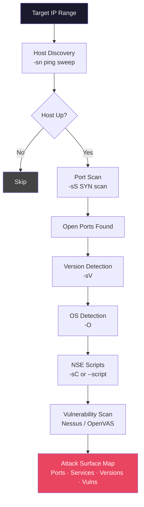

# Scanning

> **Actively probing a target's systems to discover open ports, running services, versions, and vulnerabilities — turning recon data into an attack surface map.**

## 🧠 What Is It?

Scanning is like a doctor performing an X-ray on a patient — you're imaging the internal structure of the target's network without (yet) performing surgery. You discover what's open, what's running, what version it is, and whether it's vulnerable.

Scanning bridges the gap between reconnaissance (knowing the target exists) and enumeration/exploitation (knowing what the target is running and how to attack it).

## 🏗️ How It Works

### The TCP Three-Way Handshake

Understanding TCP is fundamental to understanding port scanning:

```
Client (Scanner)          Server (Target)
      │                        │
      │──── SYN ──────────────►│   "I want to connect on port 80"
      │◄─── SYN/ACK ───────────│   "OK, I'm listening" (port is OPEN)
      │──── ACK ──────────────►│   "Great, connection established"
      │──── RST ──────────────►│   (Nmap tears down connection — SYN scan)
```

For **SYN scanning** (default Nmap stealth scan), Nmap sends SYN, receives SYN/ACK (open port), then immediately sends RST instead of completing the handshake. This avoids completing the TCP connection and is harder to detect.

**Port States:**
- `open` — Something is actively accepting connections
- `closed` — Port responds with RST (no service, but host is up)
- `filtered` — Firewall dropping packets (no response or ICMP unreachable)
- `open|filtered` — Can't determine (UDP scans often show this)
- `unfiltered` — ACK scan: port accessible but open/closed unknown

## 📊 Diagram



## ⚙️ Technical Details

### Nmap — The Complete Reference

Nmap (Network Mapper) is the industry-standard port scanner. Every security professional must master it.

#### Scan Types

| Flag | Scan Type | Description | Requires Root? |
|------|-----------|-------------|---------------|
| `-sS` | SYN/Stealth | Sends SYN, never completes handshake | Yes |
| `-sT` | TCP Connect | Full TCP connection (3-way handshake) | No |
| `-sU` | UDP Scan | Sends UDP packets, waits for response | Yes |
| `-sV` | Version Detection | Detects service versions | No |
| `-sC` | Default Scripts | Runs default NSE scripts | No |
| `-A` | Aggressive | OS + version + scripts + traceroute | Yes |
| `-O` | OS Detection | Guesses OS from TTL, TCP options | Yes |
| `-sN` | Null Scan | No TCP flags set — bypasses some firewalls | Yes |
| `-sF` | FIN Scan | Only FIN flag — RFC says closed ports respond | Yes |
| `-sX` | Xmas Scan | FIN+PSH+URG flags (lit up like a Xmas tree) | Yes |
| `-sA` | ACK Scan | Maps firewall rules, not open/closed | Yes |
| `-sW` | Window Scan | Examines TCP window field | Yes |
| `-sM` | Maimon Scan | FIN/ACK probe | Yes |
| `-sn` | No Port Scan | Host discovery only (ping sweep) | No |
| `-Pn` | No Ping | Skip host discovery, assume all up | No |

#### Timing Templates

| Template | Flag | Speed | Use Case |
|----------|------|-------|---------|
| Paranoid | `-T0` | 5 min/packet | Maximum IDS evasion |
| Sneaky | `-T1` | 15 sec/packet | IDS evasion |
| Polite | `-T2` | 0.4 sec/packet | Avoid network congestion |
| Normal | `-T3` | Default | Standard speed |
| Aggressive | `-T4` | Fast | Modern, fast networks |
| Insane | `-T5` | Maximum | May miss ports on slow networks |

#### Target Specification

```bash
# Single host
nmap 192.168.1.1

# CIDR range
nmap 192.168.1.0/24

# IP range
nmap 192.168.1.1-254

# Multiple targets
nmap 192.168.1.1 192.168.1.2 10.0.0.1

# From file
nmap -iL targets.txt

# Exclude hosts
nmap 192.168.1.0/24 --exclude 192.168.1.1,192.168.1.254

# Exclude from file
nmap 192.168.1.0/24 --excludefile exclude.txt

# Domain name
nmap target.com

# IPv6
nmap -6 fe80::1
```

#### Port Specification

```bash
# Single port
nmap -p 80 target

# Multiple ports
nmap -p 80,443,8080 target

# Port range
nmap -p 1-1000 target

# All 65535 ports
nmap -p- target
nmap -p 1-65535 target

# Top N ports
nmap --top-ports 100 target
nmap --top-ports 1000 target

# Top 20 ports (quick triage)
nmap --top-ports 20 target

# Specific UDP ports
nmap -sU -p 53,161,162 target

# Both TCP and UDP
nmap -sS -sU -p T:80,443,U:53,161 target
```

#### Output Formats

```bash
# Normal output (human readable)
nmap -oN output.nmap target

# XML output (machine readable, import to tools)
nmap -oX output.xml target

# Grepable output (easy to grep/awk)
nmap -oG output.gnmap target

# All formats simultaneously
nmap -oA output target    # Creates output.nmap, output.xml, output.gnmap

# Script kiddie (stars and exclamation marks — useless, for fun)
nmap -oS output.sk target
```

#### Firewall Evasion Techniques

```bash
# Fragment packets (bypass packet inspection)
nmap -f target                # 8-byte fragments
nmap -ff target               # 16-byte fragments

# Custom MTU (must be multiple of 8)
nmap --mtu 24 target

# Decoy scan (mix real scan with fake IPs)
nmap -D RND:10 target         # 10 random decoys
nmap -D 192.168.1.100,192.168.1.101,ME target   # Specific decoys

# Spoof source IP (requires being on same segment)
nmap -S 192.168.1.200 target -e eth0

# Spoof source port (bypass rules allowing DNS/HTTP)
nmap --source-port 53 target
nmap -g 80 target

# Slow scan (below IDS threshold)
nmap -T0 -sS target

# Randomize host scan order
nmap --randomize-hosts target_range

# Append random data to packets
nmap --data-length 25 target

# Use specific network interface
nmap -e eth0 target

# Combine evasion techniques
nmap -f -T0 -D RND:5 --source-port 53 target
```

#### NSE — Nmap Scripting Engine

NSE scripts automate detection tasks. Located in `/usr/share/nmap/scripts/`.

**Script Categories:**

| Category | Description | Example |
|----------|-------------|---------|
| `safe` | Won't harm target | `--script=safe` |
| `default` | Standard scripts (-sC) | `--script=default` |
| `discovery` | Find information | `--script=discovery` |
| `vuln` | Check for vulnerabilities | `--script=vuln` |
| `exploit` | Active exploitation | `--script=exploit` |
| `auth` | Authentication bypass/test | `--script=auth` |
| `brute` | Brute force credentials | `--script=brute` |
| `intrusive` | May affect target | `--script=intrusive` |
| `malware` | Check for malware/backdoors | `--script=malware` |

**Real NSE Examples:**

```bash
# HTTP enumeration
nmap --script=http-enum -p 80,443 target
nmap --script=http-title -p 80,443 target
nmap --script=http-methods target
nmap --script=http-headers -p 80 target

# SMB vulnerabilities
nmap --script=smb-vuln-ms17-010 -p 445 target       # EternalBlue
nmap --script=smb-vuln-ms08-067 -p 445 target       # MS08-067
nmap --script=smb-vuln-cve-2017-7494 -p 445 target  # SambaCry
nmap --script=smb-security-mode -p 445 target
nmap --script=smb-enum-shares -p 445 target
nmap --script=smb-enum-users -p 445 target

# FTP
nmap --script=ftp-anon -p 21 target                 # Anonymous login
nmap --script=ftp-bounce -p 21 target               # FTP bounce attack
nmap --script=ftp-brute -p 21 target

# SSH
nmap --script=ssh-hostkey -p 22 target
nmap --script=ssh-auth-methods -p 22 target
nmap --script=ssh2-enum-algos -p 22 target

# MySQL
nmap --script=mysql-info -p 3306 target
nmap --script=mysql-empty-password -p 3306 target
nmap --script=mysql-databases -p 3306 target

# DNS
nmap --script=dns-zone-transfer --script-args "dns-zone-transfer.domain=target.com" -p 53 target
nmap --script=dns-brute target

# SSL/TLS
nmap --script=ssl-enum-ciphers -p 443 target         # Find weak ciphers
nmap --script=ssl-cert -p 443 target                 # Certificate details
nmap --script=ssl-heartbleed -p 443 target           # CVE-2014-0160

# SNMP
nmap --script=snmp-info -sU -p 161 target
nmap --script=snmp-brute -sU -p 161 target

# RDP
nmap --script=rdp-vuln-ms12-020 -p 3389 target       # MS12-020
nmap --script=rdp-enum-encryption -p 3389 target

# Comprehensive vulnerability scan
nmap --script=vuln -sV target
```

### 20+ Real Nmap Command Examples

```bash
# 1. Quick scan (top 100 ports)
nmap --top-ports 100 192.168.1.1

# 2. Stealth SYN scan with version detection
sudo nmap -sS -sV 192.168.1.0/24

# 3. Full port scan with OS and scripts
sudo nmap -sS -sV -sC -O -p- target.com

# 4. Aggressive scan (all detection)
sudo nmap -A target.com

# 5. Stealth scan saving all outputs
sudo nmap -sS -sV -sC -O -p- -oA full_scan target.com

# 6. Fast UDP scan of common UDP ports
sudo nmap -sU --top-ports 200 target.com

# 7. Ping sweep of subnet
nmap -sn 192.168.1.0/24

# 8. Scan without ping (when ICMP is blocked)
nmap -Pn -sS -sV target.com

# 9. Scan multiple targets from file
nmap -iL targets.txt -sS -sV -oA results

# 10. Web server focused scan
nmap -sV -p 80,443,8080,8443,8000,8888 target.com --script=http-enum,http-title,http-headers

# 11. SMB vulnerability check
sudo nmap --script=smb-vuln-ms17-010,smb-vuln-ms08-067 -p 445 192.168.1.0/24

# 12. DNS zone transfer check
nmap --script=dns-zone-transfer -p 53 ns1.target.com

# 13. SSL cipher check
nmap --script=ssl-enum-ciphers -p 443 target.com

# 14. Slow evasive scan
sudo nmap -sS -T1 -f --source-port 53 target.com

# 15. Decoy scan
sudo nmap -D RND:10 -sS target.com

# 16. Service version detection deep probe
nmap -sV --version-intensity 9 target.com

# 17. Script scan with custom args
nmap --script=http-brute --script-args 'http-brute.path=/login,brute.mode=user' target.com

# 18. Compare two scans (detect changes)
ndiff scan1.xml scan2.xml

# 19. Convert XML to HTML report
xsltproc /usr/share/nmap/nmap.xsl results.xml -o results.html

# 20. Scan IPv6
sudo nmap -6 -sS -sV fe80::1

# 21. OS detection with aggressive fingerprinting
sudo nmap -O --osscan-guess target.com

# 22. Traceroute with scan
sudo nmap -sS --traceroute target.com

# 23. Full comprehensive scan (production use)
sudo nmap -sS -sV -sC -O -p- -T4 --script=vuln -oA comprehensive_scan target.com

# 24. Quick live host discovery
nmap -sn -n 10.0.0.0/8 --open
```

### Masscan

Masscan can scan the entire internet in under 6 minutes. It's 1000x faster than Nmap but less accurate. Use for initial wide-area discovery, then Nmap for detail.

```bash
# Install
apt install masscan

# Basic scan
sudo masscan 192.168.1.0/24 -p 80,443

# All ports
sudo masscan 192.168.1.0/24 -p 1-65535

# With rate limiting (packets per second)
sudo masscan 192.168.1.0/24 -p 1-65535 --rate 1000

# Top ports
sudo masscan 10.0.0.0/8 --top-ports 100 --rate 10000

# Save output
sudo masscan 10.0.0.0/8 -p 80,443,8080 --rate 5000 -oX masscan_results.xml
sudo masscan 10.0.0.0/8 -p 80,443,8080 --rate 5000 -oG masscan_results.gnmap

# Use specific interface
sudo masscan 10.0.0.0/8 -p 80 --rate 1000 -e eth0

# Scan from file
sudo masscan -p 80,443 --rate 5000 -iL targets.txt

# Combine masscan + nmap workflow
sudo masscan 192.168.1.0/24 -p 1-65535 --rate 1000 -oG masscan.gnmap
grep "open" masscan.gnmap | awk '{print $2}' | sort -u > live_hosts.txt
nmap -sV -sC -p- -iL live_hosts.txt -oA nmap_detail
```

**Masscan vs Nmap:**

| Feature | Masscan | Nmap |
|---------|---------|------|
| Speed | Extremely fast (1M+ pps) | Slower |
| Accuracy | Good for open/closed | More accurate |
| OS Detection | No | Yes |
| Version Detection | No | Yes |
| Scripts | No | Yes (NSE) |
| Best Use | Wide-area discovery | Detailed analysis |

### Vulnerability Scanning

#### Nessus

Nessus is the most widely-used commercial vulnerability scanner.

```bash
# Start Nessus service
sudo systemctl start nessusd

# Access web UI
https://localhost:8834

# Nessus CLI (nessuscli)
/opt/nessus/sbin/nessuscli adduser admin
/opt/nessus/sbin/nessuscli update --all

# Scan policies for pentesting:
# 1. Basic Network Scan — general purpose
# 2. Advanced Scan — full vulnerability discovery
# 3. Credentialed Patch Audit — with credentials
# 4. Web Application Tests — web-focused
# 5. PCI DSS — compliance

# Reading Nessus results:
# Critical (CVSS 9.0-10.0) — Exploit immediately
# High (7.0-8.9) — Prioritize
# Medium (4.0-6.9) — Schedule remediation
# Low (0.1-3.9) — Best effort
# Info (0.0) — Informational only
```

#### OpenVAS / Greenbone

Free alternative to Nessus.

```bash
# Install (Kali)
apt install gvm
gvm-setup
gvm-start

# Access
https://localhost:9392

# CLI with gvm-cli
gvm-cli --gmp-username admin --gmp-password admin socket \
  --socketpath /run/gvmd/gvmd.sock \
  --xml "<get_version/>"

# Create and run scan via CLI
gvm-cli socket --xml "
<create_task>
  <name>My Scan</name>
  <config id='daba56c8-73ec-11df-a475-002264764cea'/>
  <target id='TARGET_ID'/>
</create_task>"
```

### Nikto — Web Server Scanner

Nikto scans web servers for 6700+ potentially dangerous files, outdated software, and server misconfigurations.

```bash
# Basic scan
nikto -h http://target.com

# With SSL
nikto -h https://target.com

# Specify port
nikto -h http://target.com -p 8080

# Save output
nikto -h http://target.com -o nikto_results.txt
nikto -h http://target.com -o nikto_results.html -Format htm
nikto -h http://target.com -o nikto_results.xml -Format xml

# Scan with credentials
nikto -h http://target.com -id admin:password

# Specify scan plugins
nikto -h http://target.com -Plugins "headers;robots;shellshock"

# Tune scans (categories)
# 1 - Interesting File / Seen in logs
# 2 - Misconfiguration / Default File
# 3 - Information Disclosure
# 4 - Injection (XSS/Script/HTML)
# 5 - Remote File Retrieval
# 6 - Denial of Service
# 7 - Remote File Retrieval (Server Wide)
# 8 - Command Execution / Remote Shell
# 9 - SQL Injection
# a - Authentication Bypass
# b - Software Identification
# c - Remote Source Inclusion
nikto -h http://target.com -Tuning 3,4,9

# Evasion techniques
nikto -h http://target.com -evasion 1    # Random URI encoding
nikto -h http://target.com -evasion 2    # Directory self-reference
nikto -h http://target.com -evasion 3    # Premature URL ending

# Scan through proxy
nikto -h http://target.com -useproxy http://127.0.0.1:8080

# Maximum hosts from file
nikto -h hosts.txt -C all
```

### Banner Grabbing

Banner grabbing identifies services by reading their welcome banners.

```bash
# Netcat banner grabbing
nc -nv 192.168.1.1 22      # SSH banner
nc -nv 192.168.1.1 25      # SMTP banner
nc -nv 192.168.1.1 21      # FTP banner
nc -nv 192.168.1.1 80      # HTTP (then type: GET / HTTP/1.0)

# HTTP headers with curl
curl -I http://target.com
curl -I https://target.com
curl -I -k https://target.com   # Ignore SSL errors

# Verbose HTTP with all headers
curl -v http://target.com 2>&1 | head -30

# HTTP with custom user agent
curl -A "Mozilla/5.0" -I http://target.com

# Telnet for SMTP
telnet mail.target.com 25
# EHLO test
# VRFY admin

# Nmap banner grab script
nmap --script=banner -p 21,22,25,80,110,143 target.com

# amap — application mapper
amap -A target.com 1-1000

# whatweb — web technology fingerprinting
whatweb http://target.com
whatweb -a 3 http://target.com    # Aggressive
whatweb -v http://target.com      # Verbose
```

## 💥 Exploitation Step-by-Step

### Complete Scanning Workflow

```bash
#!/bin/bash
# Professional scanning workflow
TARGET="192.168.1.0/24"
OUTDIR="./scan_results"
mkdir -p $OUTDIR

echo "[*] Phase 1: Host Discovery"
nmap -sn -n $TARGET -oG $OUTDIR/hosts.gnmap
grep "Up" $OUTDIR/hosts.gnmap | awk '{print $2}' > $OUTDIR/live_hosts.txt
echo "[+] Found $(wc -l < $OUTDIR/live_hosts.txt) live hosts"

echo "[*] Phase 2: Quick Port Scan (top 1000)"
nmap -sS --top-ports 1000 -iL $OUTDIR/live_hosts.txt \
  -oA $OUTDIR/quick_scan -T4 --open

echo "[*] Phase 3: Full Port Scan"
sudo nmap -sS -p- -iL $OUTDIR/live_hosts.txt \
  -oA $OUTDIR/full_ports -T4 --open

echo "[*] Phase 4: Service Version + OS Detection"
sudo nmap -sV -sC -O -iL $OUTDIR/live_hosts.txt \
  -oA $OUTDIR/services -T4

echo "[*] Phase 5: Vulnerability Scripts"
sudo nmap --script=vuln -iL $OUTDIR/live_hosts.txt \
  -oA $OUTDIR/vuln_scan

echo "[*] Phase 6: Web-specific scanning"
grep "80\|443\|8080\|8443" $OUTDIR/services.nmap | \
  grep "open" | awk '{print $1}' > $OUTDIR/web_hosts.txt

echo "[+] Scanning complete. Results in $OUTDIR/"
```

## 🛠️ Tools

| Tool | Purpose | Key Command |
|------|---------|-------------|
| **Nmap** | Port/service/OS/vuln scan | `nmap -sS -sV -sC -O -p- target` |
| **Masscan** | Ultra-fast port discovery | `masscan -p1-65535 target --rate=10000` |
| **Nessus** | Commercial vuln scanner | Web UI at https://localhost:8834 |
| **OpenVAS** | Free vuln scanner | Web UI at https://localhost:9392 |
| **Nikto** | Web server scanner | `nikto -h http://target.com` |
| **Netcat** | Banner grabbing | `nc -nv target.com 22` |
| **Whatweb** | Web tech fingerprinting | `whatweb http://target.com` |
| **amap** | Application protocol detection | `amap target.com 1-1000` |

## 🔍 Detection

**How defenders detect scanning:**

- **Snort IDS rules**: Port scan detection triggers on multiple SYN packets
- **SIEM rules**: High connection volume from single source
- **Firewall logs**: Connections to many ports in sequence
- **Honeypot ports**: Scanning unoccupied ports triggers alerts

**Evasion techniques (for authorized testing):**
```bash
# Distribute scan across time
nmap -T1 target     # Very slow

# Use decoys
nmap -D RND:10 target

# Fragment packets
nmap -f target

# Use allowed source port
nmap --source-port 53 target
```

## 🛡️ Mitigation

1. **Firewall rules** — Block unrequested inbound SYN packets from internet
2. **IDS/IPS** — Deploy Snort/Suricata with port scan detection rules
3. **Port knocking** — Services only open after specific sequence
4. **Minimize exposed surface** — Only expose necessary ports
5. **Rate limiting** — Block IPs that exceed connection rate thresholds
6. **Regularly scan yourself** — Know what's exposed before attackers do
7. **Disable unused services** — Each open port is a potential entry point
8. **Update banners** — Don't reveal exact versions in service banners

## 📚 References

- [Nmap Official Documentation](https://nmap.org/book/man.html)
- [Nmap NSE Script Reference](https://nmap.org/nsedoc/)
- [Masscan GitHub](https://github.com/robertdavidgraham/masscan)
- [Nikto GitHub](https://github.com/sullo/nikto)
- [Nessus Documentation](https://docs.tenable.com/nessus/)
- [OpenVAS Documentation](https://docs.greenbone.net/)
- [Nmap Cheat Sheet — StationX](https://www.stationx.net/nmap-cheat-sheet/)
- [Port Scanning Techniques — Nmap Book](https://nmap.org/book/man-port-scanning-techniques.html)
