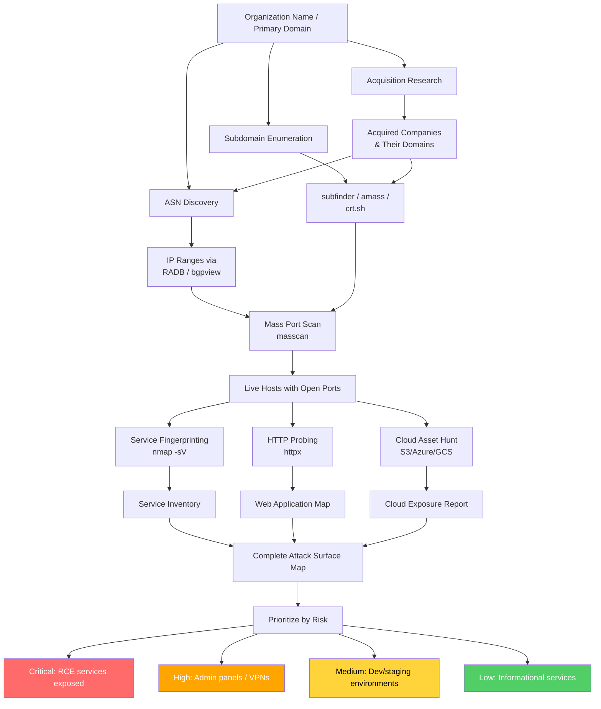

# Asset Discovery

> **Difficulty:** Beginner → Advanced | **Category:** Penetration Testing

**Asset discovery** is the process of building a complete inventory of an organization's digital footprint — every IP address, domain, subdomain, cloud resource, network range, and internet-facing service they own or control. Modern enterprises are sprawling: they acquire companies, spin up cloud infrastructure, spin down legacy services (but forget to remove them), use dozens of SaaS platforms, and employ shadow IT that the security team doesn't know exists. The attacker's advantage is that they enumerate the *entire* surface, not just what the IT team remembers. This document covers systematic methodology for external attack surface discovery: ASN-based IP enumeration, cloud storage hunting, shadow IT identification, mass port scanning, HTTP service fingerprinting, and integrating all findings into an actionable attack surface map.

---

## Table of Contents

1. [Attack Surface Concepts](#attack-surface-concepts)
2. [ASN-Based Discovery](#asn-based-discovery)
3. [IP Range Walking](#ip-range-walking)
4. [Cloud Asset Discovery](#cloud-asset-discovery)
5. [Shodan and Censys](#shodan-and-censys)
6. [Mass Port Scanning](#mass-port-scanning)
7. [HTTP Service Discovery with httpx](#http-service-discovery-with-httpx)
8. [Shadow IT and Forgotten Assets](#shadow-it-and-forgotten-assets)
9. [Acquisition-Based Attack Surface](#acquisition-based-attack-surface)
10. [Full Asset Discovery Workflow](#full-asset-discovery-workflow)

---

## Attack Surface Concepts

The **external attack surface** is every internet-accessible resource owned or operated by an organization. It includes not only what the organization is aware of, but everything they've forgotten, inherited, or accidentally exposed.

```mermaid
graph TD
    A[Organization's Attack Surface] --> B[Known Assets]
    A --> C[Unknown Assets]
    A --> D[Inherited Assets]
    A --> E[Third-Party Assets]
    
    B --> B1[Primary domain<br/>example.com]
    B --> B2[Main web app<br/>www.example.com]
    B --> B3[Mail server<br/>mail.example.com]
    
    C --> C1[Shadow IT<br/>team.slack-alternative.com]
    C --> C2[Dev environments<br/>dev-2019.example.com]
    C --> C3[Old cloud buckets<br/>example-backup-2020.s3.aws.com]
    C --> C4[Forgotten acquisitions<br/>acquiredcorp.com]
    
    D --> D1[Acquired company domains]
    D --> D2[Acquired company IP ranges]
    D --> D3[Acquired company cloud accounts]
    
    E --> E1[CDN edge nodes]
    E --> E2[SaaS portals with company data]
    E --> E3[Third-party API integrations]
    
    style C fill:#ff6b6b,color:#fff
    style D fill:#ffa500,color:#fff
    style C1 fill:#ff6b6b,color:#fff
    style C2 fill:#ff6b6b,color:#fff
    style C3 fill:#ff6b6b,color:#fff
```



> **Note:** Studies consistently show that companies underestimate their attack surface by 30-40%. Assets from acquisitions completed 2+ years ago are particularly likely to be forgotten.

---

## ASN-Based Discovery

An **Autonomous System Number (ASN)** is a unique identifier assigned to a network operator by a Regional Internet Registry (RIR). All IP addresses an organization directly owns (not leased from cloud providers) will be routed under their ASN. Enumerating an ASN reveals the complete set of owned IP ranges.

### Finding an Organization's ASN

```bash
# Method 1: whois lookup on a known IP
whois 93.184.216.34 | grep -i "orgname\|org-name\|netname\|aut-num\|origin"

# Method 2: RIPE/ARIN lookup by organization name
whois -h whois.arin.net "o ! example corporation"     # ARIN (North America)
whois -h whois.ripe.net "example corporation"          # RIPE (Europe/Middle East)
whois -h whois.apnic.net "example corporation"         # APNIC (Asia-Pacific)

# Method 3: BGP toolkit websites (via curl)
# bgp.he.net
curl -s "https://bgp.he.net/search?search%5Bsearch%5D=Example+Corp&commit=Search" | \
  grep -oP 'AS\d+' | sort -u

# Method 4: asnlookup / amass intel
amass intel -org "Example Corporation"

# Method 5: Using Shodan
shodan search "org:'Example Corporation'" --fields ip_str,org,asn | \
  awk '{print $3}' | sort -u

# Method 6: Using bgpview API
curl -s "https://api.bgpview.io/search?query_term=example+corporation" | \
  jq -r '.data.asns[] | "\(.asn) \(.name) \(.description)"'

# Method 7: ipinfo CLI
pip install ipinfo
ipinfo AS13335  # Cloudflare example
```

### Extracting IP Ranges from an ASN

```bash
# Method 1: whois via RADB
whois -h whois.radb.net -- '-i origin AS13335' | grep "^route:" | awk '{print $2}' | sort -u

# Method 2: Using bgpview API
ASN="AS13335"  # Replace with target ASN
curl -s "https://api.bgpview.io/asn/${ASN#AS}/prefixes" | \
  jq -r '.data.ipv4_prefixes[].prefix' | sort -u

# Method 3: Amass (comprehensive)
amass intel -asn 13335 -o asn_ranges.txt

# Method 4: Using nmap's NSE script
nmap --script targets-asn --script-args targets-asn.asn=13335

# Method 5: routeviews/bgp.he.net
curl -s "https://bgp.he.net/AS13335" | grep -oP '\d+\.\d+\.\d+\.\d+/\d+' | sort -u

# Method 6: Python with ipwhois
python3 << 'EOF'
from ipwhois import IPWhois
from ipwhois.net import Net
import json

def get_asn_ranges(asn):
    # Query RADB for prefixes
    import subprocess
    result = subprocess.run(
        ['whois', '-h', 'whois.radb.net', '--', f'-i origin AS{asn}'],
        capture_output=True, text=True
    )
    ranges = [line.split()[1] for line in result.stdout.split('\n') 
              if line.startswith('route:')]
    return ranges

ranges = get_asn_ranges('13335')
for r in ranges:
    print(r)
EOF
```

### Multiple ASN Enumeration

Large organizations often have multiple ASNs (due to mergers, acquisitions, or geographic distribution).

```bash
# Find all ASNs for a company
amass intel -org "Example Corporation" -asn

# Cross-reference: find ASNs sharing the same RDAP org handle
curl -s "https://rdap.arin.net/registry/entity/EXAMP-1" | \
  jq -r '.networks[].handle'

# Build comprehensive IP range list from multiple ASNs
for ASN in 12345 67890 11111; do
    curl -s "https://api.bgpview.io/asn/${ASN}/prefixes" | \
      jq -r '.data.ipv4_prefixes[].prefix'
done | sort -u > all_ip_ranges.txt
```

---

## IP Range Walking

Once you have IP ranges, systematic enumeration reveals live hosts and services.

### Generating IP Lists

```bash
# Install prips for CIDR expansion
apt install prips

# Expand a single CIDR
prips 192.168.1.0/24

# Expand multiple CIDRs
while read cidr; do prips "$cidr"; done < ip_ranges.txt

# Using nmap's list scan
nmap -sL 10.0.0.0/8 | grep "report for" | awk '{print $5}'

# Using Python's ipaddress module
python3 -c "
import ipaddress
network = ipaddress.IPv4Network('192.168.0.0/22', strict=False)
for ip in network.hosts():
    print(str(ip))
" > ip_list.txt
```

### Reverse DNS on IP Ranges

```bash
# Mass PTR lookup reveals organizational naming conventions
dnsx -l ip_list.txt -ptr -resp -silent | tee ptr_results.txt

# Filter by domain to confirm ownership
cat ptr_results.txt | grep "example.com"

# Extract IPs that resolved to target domain
awk '/example\.com/{print $1}' ptr_results.txt | sort -u > confirmed_ips.txt
```

---

## Cloud Asset Discovery

Cloud storage buckets are among the most commonly misconfigured assets. Public buckets can expose source code, database backups, credentials, PII, and internal documents.

### Amazon S3 Bucket Discovery

```bash
# Common bucket naming patterns
COMPANY="example"
PATTERNS=(
    "${COMPANY}"
    "${COMPANY}-backup"
    "${COMPANY}-backups"
    "${COMPANY}-prod"
    "${COMPANY}-production"
    "${COMPANY}-dev"
    "${COMPANY}-development"
    "${COMPANY}-staging"
    "${COMPANY}-static"
    "${COMPANY}-assets"
    "${COMPANY}-media"
    "${COMPANY}-uploads"
    "${COMPANY}-files"
    "${COMPANY}-data"
    "${COMPANY}-logs"
    "${COMPANY}-archive"
    "${COMPANY}-public"
    "${COMPANY}-private"
    "${COMPANY}-internal"
    "${COMPANY}-temp"
    "${COMPANY}-tmp"
    "${COMPANY}-code"
    "${COMPANY}-source"
    "${COMPANY}-src"
    "${COMPANY}-app"
    "${COMPANY}-website"
    "${COMPANY}-web"
    "${COMPANY}-cdn"
    "${COMPANY}-images"
    "${COMPANY}-docs"
    "${COMPANY}-documents"
    "${COMPANY}-terraform"
    "${COMPANY}-infra"
    "${COMPANY}-infrastructure"
    "${COMPANY}-deployment"
    "${COMPANY}-releases"
    "${COMPANY}-build"
    "${COMPANY}-builds"
    "${COMPANY}-ci"
    "${COMPANY}-pipeline"
    "${COMPANY}-test"
    "${COMPANY}-testing"
    "${COMPANY}-qa"
    "${COMPANY}-uat"
    "dev-${COMPANY}"
    "staging-${COMPANY}"
    "prod-${COMPANY}"
    "backup-${COMPANY}"
)

for bucket in "${PATTERNS[@]}"; do
    STATUS=$(curl -s -o /dev/null -w "%{http_code}" \
        "https://${bucket}.s3.amazonaws.com/" \
        "https://s3.amazonaws.com/${bucket}/")
    if [[ "$STATUS" == "200" ]]; then
        echo "[PUBLIC BUCKET] $bucket"
    elif [[ "$STATUS" == "403" ]]; then
        echo "[EXISTS/PRIVATE] $bucket"
    fi
done

# Using aws cli (anonymous access test)
aws s3 ls s3://example-backup --no-sign-request 2>/dev/null && echo "PUBLIC"

# Download public bucket contents
aws s3 sync s3://example-backup . --no-sign-request

# s3scanner - automated bucket scanner
pip install s3scanner
s3scanner scan --buckets-file bucket_names.txt
s3scanner dump --dump-dir ./bucket_dumps s3://public-bucket

# cloud_enum - multi-cloud asset enumeration
pip install cloud-enum
cloud_enum -k example -k examplecorp -k example-corp \
           --disable-azure --disable-gcp  # AWS only

# All clouds
cloud_enum -k example -k examplecorp
```

### Azure Blob Storage Discovery

```bash
# Azure blob storage URL format:
# https://<account>.blob.core.windows.net/<container>/

COMPANY="example"
AZURE_PATTERNS=(
    "${COMPANY}"
    "${COMPANY}storage"
    "${COMPANY}blob"
    "${COMPANY}backup"
    "${COMPANY}prod"
    "${COMPANY}dev"
    "${COMPANY}assets"
    "${COMPANY}media"
    "${COMPANY}static"
)

for account in "${AZURE_PATTERNS[@]}"; do
    STATUS=$(curl -s -o /dev/null -w "%{http_code}" \
        "https://${account}.blob.core.windows.net/")
    if [[ "$STATUS" != "000" ]] && [[ "$STATUS" != "400" ]]; then
        echo "[AZURE ACCOUNT EXISTS] $account (Status: $STATUS)"
        # Try common container names
        for container in public assets media uploads data logs backup; do
            CSTATUS=$(curl -s -o /dev/null -w "%{http_code}" \
                "https://${account}.blob.core.windows.net/${container}?restype=container&comp=list")
            [[ "$CSTATUS" == "200" ]] && echo "  [PUBLIC CONTAINER] $container"
        done
    fi
done

# MicroBurst (PowerShell) - comprehensive Azure enumeration
# Invoke-EnumerateAzureBlobs -Base example -OutputFile azure_blobs.txt

# Using az CLI for authorized testing
az storage account list --output table
az storage container list --account-name examplestorage
az storage blob list --container-name public --account-name examplestorage
```

### Google Cloud Storage Discovery

```bash
# GCS URL format:
# https://storage.googleapis.com/<bucket>/
# https://<bucket>.storage.googleapis.com/

COMPANY="example"
GCS_PATTERNS=(
    "${COMPANY}"
    "${COMPANY}-backup"
    "${COMPANY}-prod"
    "${COMPANY}-dev"
    "${COMPANY}-static"
    "${COMPANY}-assets"
)

for bucket in "${GCS_PATTERNS[@]}"; do
    STATUS=$(curl -s -o /dev/null -w "%{http_code}" \
        "https://storage.googleapis.com/${bucket}/")
    if [[ "$STATUS" == "200" ]]; then
        echo "[PUBLIC GCS BUCKET] $bucket"
        curl -s "https://storage.googleapis.com/${bucket}/" | \
          grep -oP '(?<=<Key>)[^<]+' | head -20
    elif [[ "$STATUS" == "403" ]]; then
        echo "[EXISTS/PRIVATE] $bucket"
    fi
done

# gsutil (Google Cloud SDK)
gsutil ls gs://example-backup 2>/dev/null && echo "Accessible"
gsutil ls -r gs://example-bucket/ | head -50
```

### Cloud Asset Discovery Tools

```bash
# GrayhatWarfare - search public buckets (web interface + API)
curl -s "https://buckets.grayhatwarfare.com/api/v1/buckets?keywords=example&access_key=YOUR_KEY" | \
  jq -r '.buckets[].bucket'

# CloudBrute - multi-cloud brute force
go install github.com/0xsha/CloudBrute@latest
CloudBrute -d example.com -k example -m storage \
           -t 80 -T 10 -w /opt/SecLists/Discovery/DNS/subdomains-top1million-110000.txt

# bucket-finder (Ruby)
gem install bucket-finder
bucket-finder --download wordlist.txt

# Enumerate cloud accounts linked to a domain
# AWS SES verification
dig _amazonses.example.com TXT +short
# → Reveals AWS Account usage

# Google Workspace/Firebase
dig _firebase.example.com TXT +short

# Finding S3 buckets from website source code
curl -s https://example.com | grep -oP 's3\.amazonaws\.com/[^"\']+|[a-z0-9-]+\.s3\.amazonaws\.com'
```

---

## Shodan and Censys

**Shodan** and **Censys** are internet-wide scanning databases that index every internet-facing device and service. They allow querying by organization, IP range, ASN, certificate, port, banner, and much more.

### Shodan

```bash
# Install Shodan CLI
pip install shodan
shodan init YOUR_API_KEY

# Search by organization
shodan search --fields ip_str,port,org,product "org:'Example Corporation'"

# Search by ASN
shodan search --fields ip_str,port,product "asn:AS13335"

# Search by IP range (CIDR)
shodan search --fields ip_str,port,product "net:93.184.216.0/24"

# Search for specific services
shodan search "org:'Example Corp' port:22"     # SSH servers
shodan search "org:'Example Corp' port:3389"   # RDP servers
shodan search "org:'Example Corp' port:5900"   # VNC servers
shodan search "org:'Example Corp' http.title:'Admin'" # Admin panels
shodan search "org:'Example Corp' product:Jenkins"    # Jenkins servers

# Search by SSL certificate
shodan search "ssl.cert.subject.cn:example.com" --fields ip_str,port,org

# Favicon hash search (find all instances of a specific app)
shodan search "http.favicon.hash:116323821"  # Fortinet favicon hash

# Get all hosts for an organization
shodan search --limit 1000 "org:'Example Corporation'" | \
  awk '{print $1}' | sort -u > shodan_ips.txt

# Detailed info on a specific IP
shodan host 93.184.216.34

# Count results
shodan count "org:'Example Corporation'"

# Download full results (requires API credits)
shodan download results "org:'Example Corporation'"
shodan parse results.json.gz | head -20
```

### Censys

```bash
# Censys CLI
pip install censys

# Set up credentials
export CENSYS_API_ID="YOUR_ID"
export CENSYS_API_SECRET="YOUR_SECRET"

# Search hosts by organization (Censys Search v2)
censys search "autonomous_system.name:Example" --index-type hosts

# Search by IP range
censys search "ip: 93.184.216.0/24" --index-type hosts

# Search by certificate
censys search "parsed.names: example.com" --index-type certificates

# Find services on org's IP space
censys search "autonomous_system.name:Example AND services.port:22"
censys search "autonomous_system.name:Example AND services.port:3389"
censys search "autonomous_system.name:Example AND services.port:8080"

# Python API (more control)
python3 << 'EOF'
from censys.search import CensysHosts

h = CensysHosts()

# Search for hosts
results = h.search(
    "autonomous_system.name: `Example Corporation`",
    per_page=100,
    pages=5
)

for page in results:
    for host in page:
        print(host['ip'], [s.get('port') for s in host.get('services', [])])
EOF

# Censys web interface queries:
# ip: 93.184.216.0/24
# autonomous_system.asn: 15133
# parsed.subject_dn: O=Example Corporation
# services.http.response.html_title: "Admin"
```

### Comparison: Shodan vs Censys

| Feature | Shodan | Censys |
|---|---|---|
| **IPv4 Coverage** | ~1.5 billion IPs | ~3.5 billion IPs |
| **IPv6 Support** | Limited | Better |
| **Scan Frequency** | Weekly (most) | Weekly |
| **SSL Certificates** | Yes | Yes (more detailed) |
| **Banner Grabbing** | Excellent | Good |
| **CLI Tool** | Yes (pip) | Yes (pip) |
| **Free Tier** | 1 result/query | 250 queries/month |
| **Favicon Hash Search** | Yes | No |
| **Historical Data** | Yes (paid) | No |
| **Best For** | Quick OSINT, banners | Certificate analysis, IPv6 |

---

## Mass Port Scanning

Once you have IP ranges, mass port scanning reveals live hosts and open services.

### masscan — High-Speed Port Scanner

**masscan** can scan the entire internet in under 6 minutes at 10 million packets/second. Use responsibly with appropriate rate limits.

```bash
# Install masscan
apt install masscan
# or from source
git clone https://github.com/robertdavidgraham/masscan.git && cd masscan && make

# Scan top 100 ports across a CIDR
masscan -p 80,443,8080,8443,22,21,25,110,143,3306,3389,5432,6379,27017 \
        192.168.1.0/24 \
        --rate 1000 \
        -oG masscan_results.gnmap

# Scan all 65535 ports on a small range
masscan -p 1-65535 \
        192.168.1.0/24 \
        --rate 500 \
        -oJ masscan_full.json

# Common top port scan
masscan --top-ports 1000 \
        10.0.0.0/8 \
        --rate 5000 \
        --exclude 10.0.0.1 \
        -oX masscan_results.xml

# From IP list file
masscan -iL ip_list.txt \
        -p 80,443,8080,8443,4443,10443,3000,8000,8888 \
        --rate 2000 \
        -oG web_services.gnmap

# Save and exclude already-scanned ranges
masscan -iL ip_ranges.txt \
        --top-ports 100 \
        --rate 10000 \
        --exclude-file already_scanned.txt \
        --resume paused.conf \
        -oX results.xml

# Parse masscan output
# From greppable output
grep "Host:" masscan_results.gnmap | awk '{print $2, $5}' | sort

# Extract open ports by IP
python3 << 'EOF'
import json
with open('masscan_full.json') as f:
    data = json.load(f)
for host in data:
    ip = host['ip']
    ports = [p['port'] for p in host.get('ports', []) if p['status'] == 'open']
    if ports:
        print(f"{ip}: {','.join(map(str, sorted(ports)))}")
EOF
```

### nmap — Service Fingerprinting

After masscan identifies open ports, use **nmap** for detailed service fingerprinting on specific hosts.

```bash
# Version detection on discovered open ports
nmap -sV -sC -p 80,443,8080,8443 \
     --open \
     -T4 \
     -oA nmap_web_services \
     192.168.1.0/24

# Aggressive scan (OS detection + scripts + version)
nmap -A -T4 --open -p 22,80,443,3306,3389 \
     -oA nmap_aggressive \
     -iL live_hosts.txt

# Scan from masscan results (use masscan for speed, nmap for detail)
# Step 1: masscan for speed
masscan -iL ip_ranges.txt --top-ports 1000 --rate 10000 -oX masscan.xml

# Step 2: Extract live IPs and ports
python3 << 'EOF'
import xml.etree.ElementTree as ET
tree = ET.parse('masscan.xml')
hosts = {}
for host in tree.findall('.//host'):
    ip = host.find('.//address[@addrtype="ipv4"]').get('addr')
    for port in host.findall('.//port'):
        p = port.get('portid')
        hosts.setdefault(ip, []).append(p)
# Write nmap-friendly format
with open('nmap_targets.txt', 'w') as f:
    for ip, ports in hosts.items():
        f.write(f"{ip}:{','.join(ports)}\n")
EOF

# Step 3: nmap version scan on masscan-discovered ports
nmap -sV -T4 --open \
     -p $(grep "192.168.1.1:" nmap_targets.txt | cut -d: -f2) \
     192.168.1.1 \
     -oA nmap_svc_192.168.1.1
```

---

## HTTP Service Discovery with httpx

**httpx** probes HTTP/HTTPS services across large IP/hostname lists, extracting titles, status codes, headers, and technology signatures.

```bash
# Install httpx
go install -v github.com/projectdiscovery/httpx/cmd/httpx@latest

# Basic HTTP probing
cat live_hosts.txt | httpx -silent -status-code -title

# Full fingerprinting
httpx -l all_hosts.txt \
      -title \
      -status-code \
      -tech-detect \
      -follow-redirects \
      -follow-host-redirects \
      -random-agent \
      -threads 50 \
      -timeout 10 \
      -o http_services.txt

# JSON output for automation
httpx -l all_hosts.txt \
      -json \
      -title \
      -status-code \
      -tech-detect \
      -content-length \
      -web-server \
      -response-time \
      -o http_services.json

# Probe specific ports (common web ports)
httpx -l ip_ranges.txt \
      -ports 80,443,8080,8443,8888,4443,10443,3000,5000,8000,8001,9000,9090 \
      -title \
      -status-code \
      -o all_web_ports.txt

# Filter interesting results
# Find admin panels
httpx -l all_hosts.txt -silent -title | grep -iE "admin|dashboard|panel|manage|console"

# Find login pages
httpx -l all_hosts.txt -silent -title | grep -iE "login|signin|auth|portal"

# Find API endpoints
httpx -l all_hosts.txt -silent -title | grep -iE "api|swagger|graphql"

# Find exposed development tools
httpx -l all_hosts.txt -silent -title | grep -iE "jenkins|gitlab|jira|grafana|kibana|sonar"

# Favicon hash extraction for Shodan correlation
httpx -l all_hosts.txt \
      -favicon \
      -json \
      -silent | jq -r 'select(.favicon_mmh3 != null) | "\(.input) \(.favicon_mmh3)"'
```

### Favicon Hashing

**Favicon hashing** uses the MurmurHash of a site's favicon to identify the underlying technology and find all instances of it via Shodan.

```bash
# Calculate favicon hash (Python)
python3 << 'EOF'
import requests
import mmh3
import base64
import sys

url = sys.argv[1] if len(sys.argv) > 1 else "https://example.com/favicon.ico"

try:
    response = requests.get(url, timeout=10, verify=False)
    favicon = base64.encodebytes(response.content)
    hash_value = mmh3.hash(favicon)
    print(f"Favicon URL: {url}")
    print(f"MurmurHash3: {hash_value}")
    print(f"Shodan query: http.favicon.hash:{hash_value}")
except Exception as e:
    print(f"Error: {e}")
EOF

# Install mmh3: pip install mmh3

# Common technology favicon hashes for Shodan
echo "
Fortinet/FortiGate:  116323821
F5 BIG-IP:          1232523862
Juniper:            1999559798
Cisco IOS:          1076670018
Jenkins:            81586312
Grafana:            -1399433489
Kibana:             -415812675
Jira:               -244067125
Confluence:         -305179312
GitLab:             1265477854
SonarQube:          1518508689
Jupyter:            465828893
phpMyAdmin:         1939957735
RouterOS (MikroTik): -1775544357
"

# Search Shodan for all instances of a specific favicon
shodan search "http.favicon.hash:81586312" --fields ip_str,port,org | head -20
```

---

## Shadow IT and Forgotten Assets

**Shadow IT** refers to systems, services, and accounts created by employees or departments outside the knowledge and control of the IT/security team. These are particularly dangerous because they're unmonitored and unpatched.

```bash
# Finding Shadow IT via DNS history
# SecurityTrails historical DNS records
curl -s "https://api.securitytrails.com/v1/history/example.com/dns/a" \
  --header "APIKEY: YOUR_KEY" | \
  jq -r '.records[].values[].ip' | sort -u

# Reverse IP lookup to find co-hosted sites
# (reveals hosting providers used)
curl -s "https://api.hackertarget.com/reverseiplookup/?q=93.184.216.34"

# Certificate transparency for expired/old certs
curl -s "https://crt.sh/?q=%.example.com&output=json" | \
  jq -r '.[].name_value' | sort -u | \
  while read sub; do
    # Check if it still resolves
    if ! dig +short "$sub" A > /dev/null 2>&1; then
        echo "[DEAD DNS] $sub"
    fi
  done

# Shodan historical data
shodan host 93.184.216.34 --history

# Finding dev/staging environments via common patterns
COMPANY="example"
DEV_PATTERNS=(
    "dev" "dev2" "dev3" "development"
    "staging" "stage" "stg"
    "uat" "test" "testing" "qa"
    "preprod" "pre-prod" "pre" 
    "sandbox" "lab" "labs"
    "old" "legacy" "archive"
    "backup" "bak"
    "tmp" "temp"
    "demo" "poc"
    "beta" "alpha"
    "new" "v2" "v3"
    "2019" "2020" "2021" "2022" "2023" "2024"
)

for pattern in "${DEV_PATTERNS[@]}"; do
    result=$(dig +short "${pattern}.${COMPANY}.com" A 2>/dev/null)
    [[ -n "$result" ]] && echo "[+] ${pattern}.${COMPANY}.com → $result"
done
```

---

## Acquisition-Based Attack Surface

When a company acquires another, it inherits the target's entire attack surface. The security team of the acquirer rarely has full visibility into what they just inherited.

```bash
# Finding acquisitions via public sources

# 1. Crunchbase/Wikipedia research (manual)
# Search: "Example Corp acquisitions"

# 2. SEC EDGAR filings (US public companies)
curl -s "https://efts.sec.gov/LATEST/search-index?q=%22acquired%22+%22Example+Corp%22&dateRange=custom&startdt=2015-01-01&enddt=2024-01-01&forms=8-K" | \
  jq -r '.hits.hits[]._source.file_date,.hits.hits[]._source.entity_name'

# 3. LinkedIn (manual but effective)
# Search LinkedIn for employees listing "formerly at" acquisitions

# 4. DNS history for related domains
# After identifying acquired company "AcquiredCorp":
for domain in acquiredcorp.com acquiredcorp.io acq-corp.com; do
    echo "=== $domain ==="
    # Full subdomain enumeration of acquired company
    subfinder -d "$domain" -silent | dnsx -silent -a -resp
    # Historical DNS
    curl -s "https://api.securitytrails.com/v1/history/${domain}/dns/a" \
      --header "APIKEY: YOUR_KEY" | jq -r '.records[].values[].ip'
done

# 5. Reverse lookup of acquired company's IP ranges
amass intel -d acquiredcorp.com -whois
# → Reveals RDAP org info, which may reveal inherited ASNs

# 6. Certificate search for related names
curl -s "https://crt.sh/?q=%.acquiredcorp.com&output=json" | \
  jq -r '.[].name_value' | sort -u

# 7. Shodan search for acquired company
shodan search "org:'Acquired Corp'" --fields ip_str,port,product
```

---

## Full Asset Discovery Workflow



### Complete Asset Discovery Script

```bash
#!/usr/bin/env bash
# asset_discovery.sh - Complete external attack surface enumeration
# Usage: ./asset_discovery.sh "Example Corporation" example.com

ORG="${1:?Usage: $0 'Org Name' domain.com}"
DOMAIN="${2:?Usage: $0 'Org Name' domain.com}"
OUTDIR="assets_${DOMAIN//\./_}"
mkdir -p "$OUTDIR"/{ip_ranges,subdomains,web_services,cloud,ports}

echo "[*] Asset discovery: $ORG ($DOMAIN)"

# === Phase 1: ASN & IP Range Discovery ===
echo "[*] Phase 1: ASN discovery..."

# Find ASNs via amass
amass intel -org "$ORG" -asn 2>/dev/null | \
  grep -oP 'AS\d+' | sort -u > "${OUTDIR}/ip_ranges/asns.txt"

echo "[+] Found ASNs: $(cat "${OUTDIR}/ip_ranges/asns.txt" | wc -l)"

# Get IP ranges for each ASN
while read asn; do
    ASN_NUM="${asn#AS}"
    curl -s "https://api.bgpview.io/asn/${ASN_NUM}/prefixes" 2>/dev/null | \
      jq -r '.data.ipv4_prefixes[].prefix' 2>/dev/null >> "${OUTDIR}/ip_ranges/all_ranges.txt"
done < "${OUTDIR}/ip_ranges/asns.txt"

sort -u "${OUTDIR}/ip_ranges/all_ranges.txt" > "${OUTDIR}/ip_ranges/unique_ranges.txt"
echo "[+] IP ranges: $(wc -l < "${OUTDIR}/ip_ranges/unique_ranges.txt")"

# === Phase 2: Subdomain Discovery ===
echo "[*] Phase 2: Subdomain discovery..."
subfinder -d "$DOMAIN" -all -silent \
  -o "${OUTDIR}/subdomains/subfinder.txt" 2>/dev/null || true
amass enum -passive -d "$DOMAIN" -silent \
  -o "${OUTDIR}/subdomains/amass.txt" 2>/dev/null || true

cat "${OUTDIR}/subdomains/"*.txt | sort -u > "${OUTDIR}/subdomains/all.txt"
echo "[+] Subdomains discovered: $(wc -l < "${OUTDIR}/subdomains/all.txt")"

# === Phase 3: Mass Port Scan ===
echo "[*] Phase 3: Port scanning IP ranges..."
if command -v masscan &>/dev/null && [[ -s "${OUTDIR}/ip_ranges/unique_ranges.txt" ]]; then
    masscan -iL "${OUTDIR}/ip_ranges/unique_ranges.txt" \
            -p 21,22,23,25,53,80,110,143,443,445,3306,3389,5432,5900,6379,8080,8443,27017 \
            --rate 2000 \
            -oX "${OUTDIR}/ports/masscan.xml" 2>/dev/null || true
fi

# === Phase 4: HTTP Service Discovery ===
echo "[*] Phase 4: HTTP probing..."
# Combine subdomains + discovered IPs
{
  cat "${OUTDIR}/subdomains/all.txt"
  # Extract IPs from masscan results
  [[ -f "${OUTDIR}/ports/masscan.xml" ]] && \
    grep -oP '(?<=addr=")\d+\.\d+\.\d+\.\d+' "${OUTDIR}/ports/masscan.xml"
} | sort -u | \
httpx -silent \
      -title \
      -status-code \
      -tech-detect \
      -follow-redirects \
      -threads 50 \
      -o "${OUTDIR}/web_services/live_web.txt" 2>/dev/null || true

echo "[+] Live web services: $(wc -l < "${OUTDIR}/web_services/live_web.txt" 2>/dev/null || echo 0)"

# === Phase 5: Cloud Asset Discovery ===
echo "[*] Phase 5: Cloud asset discovery..."
for pattern in "$DOMAIN" "${DOMAIN%%.*}" "${DOMAIN%%.*}-backup" "${DOMAIN%%.*}-prod"; do
    STATUS=$(curl -s -o /dev/null -w "%{http_code}" \
        "https://${pattern}.s3.amazonaws.com/" 2>/dev/null)
    case "$STATUS" in
        200) echo "[S3 PUBLIC] $pattern" >> "${OUTDIR}/cloud/buckets.txt" ;;
        403) echo "[S3 EXISTS] $pattern" >> "${OUTDIR}/cloud/buckets.txt" ;;
    esac
done

# === Summary ===
echo ""
echo "=== Asset Discovery Complete ==="
echo "Organization:     $ORG"
echo "Domain:           $DOMAIN"
echo "ASNs found:       $(wc -l < "${OUTDIR}/ip_ranges/asns.txt" 2>/dev/null || echo 0)"
echo "IP ranges:        $(wc -l < "${OUTDIR}/ip_ranges/unique_ranges.txt" 2>/dev/null || echo 0)"
echo "Subdomains:       $(wc -l < "${OUTDIR}/subdomains/all.txt" 2>/dev/null || echo 0)"
echo "Live web svcs:    $(wc -l < "${OUTDIR}/web_services/live_web.txt" 2>/dev/null || echo 0)"
echo "Output:           $OUTDIR/"
```

---

## Tool Reference Summary

| Tool | Purpose | Install |
|---|---|---|
| **amass** | ASN/domain OSINT, graph analysis | `go install` |
| **masscan** | High-speed port scanning | `apt install masscan` |
| **nmap** | Deep service fingerprinting | `apt install nmap` |
| **httpx** | HTTP probing and fingerprinting | `go install` |
| **shodan** | Internet-wide asset search | `pip install shodan` |
| **censys** | Certificate and host indexing | `pip install censys` |
| **subfinder** | Passive subdomain enumeration | `go install` |
| **dnsx** | Fast DNS resolution | `go install` |
| **cloud_enum** | Multi-cloud storage enumeration | `pip install cloud-enum` |
| **s3scanner** | AWS S3 bucket enumeration | `pip install s3scanner` |

> **Warning:** Mass scanning and cloud storage enumeration generate significant traffic and API activity. Always have written authorization before performing active discovery against any organization. Unauthorized scanning may violate computer fraud laws in your jurisdiction.
