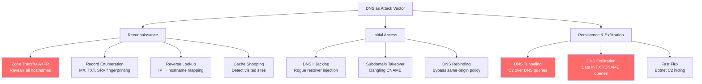
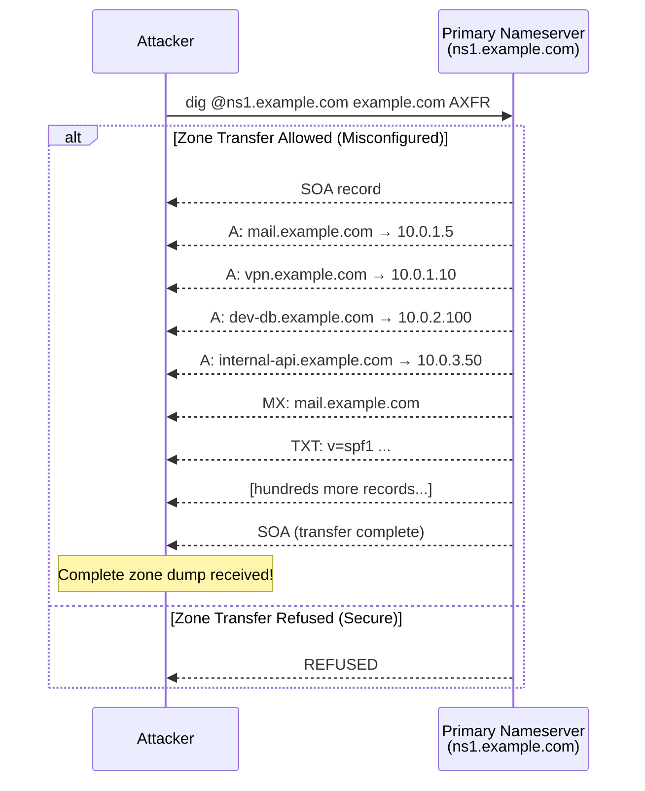
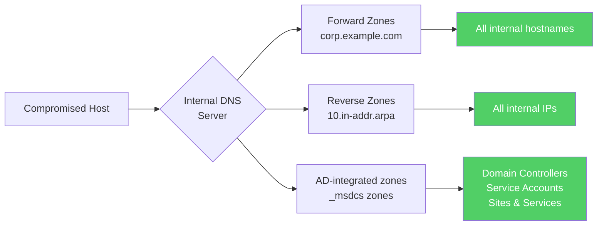
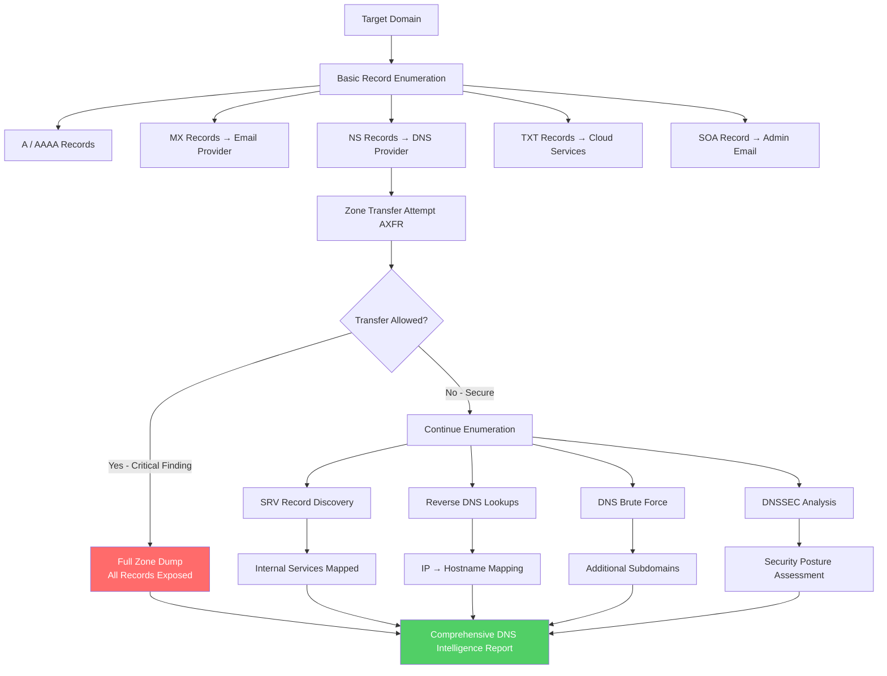

# DNS Enumeration

> **Difficulty:** Beginner → Advanced | **Category:** Penetration Testing

The **Domain Name System (DNS)** is the internet's directory service — it maps human-readable names to machine-readable addresses, routing email, locating services, and authenticating domains. For penetration testers, DNS is far more than a lookup mechanism: it is a rich source of intelligence about an organization's infrastructure, internal architecture, mail routing, third-party dependencies, and historical configuration. From external reconnaissance, DNS records reveal email providers, CDN usage, and cloud infrastructure. From an internal foothold, DNS servers expose the entire network topology. This document covers every DNS enumeration technique from basic record collection through zone transfer exploitation, cache snooping, DNSSEC analysis, and internal service discovery.

---

## Table of Contents

1. [DNS as an Attack Vector](#dns-as-an-attack-vector)
2. [DNS Record Types and What They Reveal](#dns-record-types-and-what-they-reveal)
3. [Core DNS Tools](#core-dns-tools)
4. [Zone Transfer Attack (AXFR)](#zone-transfer-attack-axfr)
5. [Reverse DNS Lookups](#reverse-dns-lookups)
6. [DNS Cache Snooping](#dns-cache-snooping)
7. [DNSSEC Analysis](#dnssec-analysis)
8. [Internal DNS Enumeration](#internal-dns-enumeration)
9. [DNS-Based Service Discovery](#dns-based-service-discovery)
10. [Full DNS Enumeration Workflow](#full-dns-enumeration-workflow)

---

## DNS as an Attack Vector

DNS attacks span the full kill chain — from initial reconnaissance through to persistence and exfiltration.



> **Note:** DNS traffic (UDP/53 and TCP/53) is frequently allowed through firewalls without inspection. This makes DNS an ideal covert channel for data exfiltration and C2 communication once inside a network.

---

## DNS Record Types and What They Reveal

Understanding what each DNS record type represents is fundamental to extracting maximum intelligence from DNS enumeration.

### Complete Record Type Reference

| Record Type | Full Name | Purpose | Recon Value |
|---|---|---|---|
| **A** | Address | Maps hostname → IPv4 | Server IPs, hosting provider |
| **AAAA** | IPv6 Address | Maps hostname → IPv6 | IPv6 infrastructure presence |
| **CNAME** | Canonical Name | Alias to another hostname | Third-party services, CDN, takeover candidates |
| **MX** | Mail Exchange | Email delivery servers | Email provider, mail server software |
| **TXT** | Text | Arbitrary text data | SPF, DKIM, DMARC, domain verification tokens, cloud account IDs |
| **NS** | Name Server | Authoritative DNS servers | DNS provider, potential for zone transfer |
| **SOA** | Start of Authority | Zone metadata | DNS admin email, serial number, zone transfer timing |
| **PTR** | Pointer | Reverse lookup (IP → name) | Hostname from IP, internal naming conventions |
| **SRV** | Service | Service location records | Internal services: SIP, XMPP, LDAP, Kerberos |
| **CAA** | Cert Authority Auth | Which CAs can issue certs | Certificate authority restrictions |
| **NAPTR** | Naming Authority Ptr | Regex-based rewriting | VoIP, ENUM telephony |
| **DKIM** | DomainKeys IM | Email signing key | Email provider, key strength |
| **DMARC** | Domain-based Msg Auth | Email policy | Email security posture |
| **SPF** | Sender Policy Framework | Authorized mail senders | All IP ranges allowed to send email |
| **HINFO** | Host Info | OS and CPU info | *Rarely used; reveals OS if set* |

### What TXT Records Reveal

TXT records are particularly rich in intelligence:

```bash
# Query all TXT records
dig TXT example.com +short

# Common TXT record contents and what they reveal:
# v=spf1 include:_spf.google.com include:mailchimp.com ~all
#   → Email provider: Google Workspace + Mailchimp
#   → "~all" = softfail (less secure than -all)

# google-site-verification=XXXXX
#   → Google Search Console account exists

# MS=ms12345678
#   → Microsoft 365 / Azure AD tenant verified

# atlassian-domain-verification=XXXXX
#   → Atlassian (Jira/Confluence) tenant

# docusign=XXXXX
#   → DocuSign account exists

# facebook-domain-verification=XXXXX
#   → Facebook Business account

# amazonses:XXXXX
#   → Amazon SES in use (AWS account)

# _dmarc.example.com TXT "v=DMARC1; p=none; rua=mailto:dmarc@example.com"
#   → DMARC policy (none = no enforcement, reject = strict)
#   → Reporting email address

# DKIM selector discovery
dig TXT google._domainkey.example.com +short
dig TXT selector1._domainkey.example.com +short   # Office 365 default
dig TXT selector2._domainkey.example.com +short
dig TXT k1._domainkey.example.com +short           # Mailchimp
```

### What MX Records Reveal

```bash
# Query MX records
dig MX example.com +short
# 10 aspmx.l.google.com.      → Google Workspace
# 10 mx1.privateemail.com.    → Namecheap Private Email
# 10 mail.example.com.        → Self-hosted mail
# 10 inbound-smtp.us-east-1.amazonaws.com. → Amazon SES

# MX providers and their implications
# Google Workspace (aspmx.l.google.com)  → Gmail-based org
# Microsoft 365 (*.mail.protection.outlook.com) → Exchange Online
# ProtonMail (mail.protonmail.ch) → Privacy-focused org
# Self-hosted → May have older mail server software (Postfix, Exim, etc.)
```

### What SRV Records Reveal

```bash
# Common SRV records that expose internal services
dig SRV _ldap._tcp.example.com         # LDAP servers (Active Directory)
dig SRV _kerberos._tcp.example.com     # Kerberos KDC (Active Directory)
dig SRV _kerberos._udp.example.com
dig SRV _gc._tcp.example.com           # Global Catalog (AD)
dig SRV _ldap._tcp.dc._msdcs.example.com  # Domain Controllers
dig SRV _sip._tls.example.com          # SIP/VoIP
dig SRV _xmpp-client._tcp.example.com  # XMPP/Jabber
dig SRV _caldav._tcp.example.com       # CalDAV calendar
dig SRV _carddav._tcp.example.com      # CardDAV contacts
dig SRV _autodiscover._tcp.example.com # Exchange Autodiscover
dig SRV _imaps._tcp.example.com        # IMAP over SSL
dig SRV _submission._tcp.example.com   # SMTP Submission
```

---

## Core DNS Tools

### dig — The Standard DNS Query Tool

**dig** (Domain Information Groper) is the authoritative command-line DNS query tool. It provides raw, unprocessed DNS responses with full control over query parameters.

```bash
# Basic A record lookup
dig example.com A

# Short output (just the answer)
dig +short example.com A

# Query all record types (ANY - may be refused by modern servers)
dig example.com ANY

# Query specific record types
dig example.com MX +short
dig example.com NS +short
dig example.com TXT +short
dig example.com SOA +short
dig example.com AAAA +short
dig example.com CAA +short

# Query specific nameserver
dig @8.8.8.8 example.com A             # Query Google DNS
dig @1.1.1.1 example.com A             # Query Cloudflare DNS
dig @ns1.example.com example.com AXFR  # Zone transfer from authoritative NS

# Get full SOA record with serial number
dig example.com SOA +noall +answer

# Trace DNS resolution path
dig +trace example.com A

# DNSSEC query
dig +dnssec example.com A
dig example.com DNSKEY
dig example.com DS

# Reverse lookup
dig -x 93.184.216.34 +short

# Find authoritative nameservers for zone
dig example.com NS +short

# Get SOA admin email (replace first dot before @ with @)
dig example.com SOA +short
# e.g., dns-admin.example.com → dns-admin@example.com

# Batch queries from file
dig -f dns_queries.txt +short
```

### nslookup

**nslookup** is simpler than dig and available by default on Windows.

```bash
# Interactive mode
nslookup
> server 8.8.8.8
> set type=MX
> example.com
> set type=ANY
> example.com
> exit

# Non-interactive (command line)
nslookup example.com
nslookup -type=MX example.com
nslookup -type=NS example.com
nslookup -type=TXT example.com
nslookup -type=SOA example.com
nslookup -type=ANY example.com 8.8.8.8

# Reverse lookup
nslookup 93.184.216.34
```

### host

**host** is a simplified DNS lookup utility.

```bash
# Basic lookup
host example.com

# Specific record type
host -t MX example.com
host -t NS example.com
host -t TXT example.com
host -t SOA example.com

# Reverse lookup
host 93.184.216.34

# Zone transfer attempt
host -l example.com ns1.example.com

# Verbose output
host -v example.com
```

### dnsrecon — Comprehensive DNS Enumeration

**dnsrecon** automates multiple DNS enumeration techniques.

```bash
# Install
pip install dnsrecon
# or
git clone https://github.com/darkoperator/dnsrecon.git

# Standard enumeration (A, AAAA, NS, SOA, MX, TXT, SPF, DMARC)
dnsrecon -d example.com

# Brute force subdomains
dnsrecon -d example.com -D /opt/SecLists/Discovery/DNS/subdomains-top1million-110000.txt -t brt

# Zone transfer
dnsrecon -d example.com -t axfr

# Reverse lookup range
dnsrecon -r 192.168.1.0/24 -t rvl

# Google dork + Bing search for subdomains
dnsrecon -d example.com -t goo

# Cache snooping against a specific resolver
dnsrecon -t snoop -n 192.168.1.1 -D /opt/domains.txt

# DNSSEC zone walk
dnsrecon -d example.com -t zonewalk

# SRV record enumeration
dnsrecon -d example.com -t srv

# Output to JSON
dnsrecon -d example.com -j dnsrecon_output.json

# Output to XML
dnsrecon -d example.com -x dnsrecon_output.xml

# Full enumeration
dnsrecon -d example.com \
         -t std,brt,axfr,goo,srv,rvl \
         -D /opt/SecLists/Discovery/DNS/subdomains-top1million-110000.txt \
         --xml dnsrecon_full.xml
```

### fierce — DNS Recon and Host Discovery

**fierce** is designed for DNS reconnaissance against a specific domain and surrounding network space.

```bash
# Install
pip install fierce
# or from source
git clone https://github.com/mschwager/fierce.git

# Basic enumeration
fierce --domain example.com

# Custom DNS server
fierce --domain example.com --dns-servers 8.8.8.8

# Custom wordlist
fierce --domain example.com --wordlist /opt/SecLists/Discovery/DNS/subdomains-top1million-110000.txt

# Traverse adjacent class C ranges after finding a host
fierce --domain example.com --traverse 10

# Wait between queries (avoid rate limiting)
fierce --domain example.com --delay 1

# Connect timeout
fierce --domain example.com --connect-timeout 5

# Save to file
fierce --domain example.com > fierce_results.txt
```

### dnsx — Fast DNS Resolver

```bash
# Install
go install -v github.com/projectdiscovery/dnsx/cmd/dnsx@latest

# Resolve hostnames
echo "example.com" | dnsx -a -resp

# Query multiple record types
echo "example.com" | dnsx -a -aaaa -cname -mx -txt -ns -resp

# Bulk resolve from file
dnsx -l subdomains.txt -a -resp -o resolved.txt

# Extract CNAME chains
dnsx -l subdomains.txt -cname -resp

# Reverse PTR lookups
dnsx -l ips.txt -ptr -resp

# Status codes
dnsx -l subdomains.txt -rcode noerror,servfail,refused

# JSON output
dnsx -l subdomains.txt -a -resp -json -o results.json

# Rate limiting (queries per second)
dnsx -l subdomains.txt -a -rl 1000 -resp
```

---

## Zone Transfer Attack (AXFR)

**DNS Zone Transfer** (AXFR - Authoritative Transfer) is a mechanism that allows a secondary DNS server to receive a complete copy of a DNS zone from the primary server. When misconfigured to allow transfers from any host (rather than only trusted secondaries), an attacker can retrieve the complete list of all DNS records in the zone — effectively a full network map.



### Attempting Zone Transfers

```bash
# Step 1: Find all authoritative nameservers
dig NS example.com +short
# Returns: ns1.example.com. ns2.example.com. ns3.example.com.

# Step 2: Attempt AXFR against each nameserver
dig @ns1.example.com example.com AXFR
dig @ns2.example.com example.com AXFR

# Using host
host -l example.com ns1.example.com
host -l example.com ns2.example.com

# Using nslookup
nslookup -type=AXFR example.com ns1.example.com

# Using dnsrecon (tries all nameservers automatically)
dnsrecon -d example.com -t axfr

# Script to try all nameservers
for NS in $(dig NS example.com +short | sed 's/\.$//'); do
    echo "=== Trying zone transfer from $NS ==="
    dig @$NS example.com AXFR | grep -v "^;" | grep -v "^$"
    echo ""
done

# Save successful zone transfer
dig @ns1.example.com example.com AXFR | tee zone_transfer.txt

# Parse zone transfer output for hostnames
dig @ns1.example.com example.com AXFR | \
  grep -E "^\S+\s+[0-9]+\s+IN\s+(A|AAAA|CNAME|MX|NS)\s+" | \
  awk '{print $1}' | sed 's/\.$//' | sort -u
```

### Parsing Zone Transfer Output

```bash
# Extract A records (hostname → IP mappings)
dig @ns1.example.com example.com AXFR | \
  awk '/\sIN\sA\s/{print $1, $5}' | sort -u

# Extract internal IPs
dig @ns1.example.com example.com AXFR | \
  awk '/\sIN\sA\s/{print $5}' | \
  grep -E '^(10\.|172\.(1[6-9]|2[0-9]|3[01])\.|192\.168\.)' | \
  sort -u

# Extract all hostnames
dig @ns1.example.com example.com AXFR | \
  grep -v '^;' | \
  awk '/IN\s+(A|AAAA|CNAME|MX|NS|TXT|SRV)/{print $1}' | \
  sed 's/\.$//g' | sort -u

# Extract TXT records (may contain sensitive info)
dig @ns1.example.com example.com AXFR | \
  awk '/\sIN\sTXT\s/{print}' 
```

> **Warning:** A successful zone transfer provides a complete inventory of an organization's DNS infrastructure. This is considered a critical misconfiguration. Report it immediately in penetration tests. In bug bounty programs, it is typically rated High to Critical.

### IXFR — Incremental Zone Transfer

**IXFR** (Incremental Zone Transfer) transfers only records that changed since a given serial number. Less commonly exploitable but worth attempting.

```bash
# Attempt IXFR with serial number 0 (request all changes)
dig @ns1.example.com example.com IXFR=0

# Get current serial first
dig example.com SOA +short
# Returns: ns1.example.com. hostmaster.example.com. 2024010101 3600 900 604800 300
# Serial is the 3rd field: 2024010101

# Request incremental from an older serial
dig @ns1.example.com example.com IXFR=2024010100
```

---

## Reverse DNS Lookups

**Reverse DNS (rDNS)** maps IP addresses back to hostnames using PTR records in the `in-addr.arpa` (IPv4) or `ip6.arpa` (IPv6) zones. This is invaluable for discovering hosts when you have IP ranges but not hostnames.

```bash
# Single IP reverse lookup
dig -x 93.184.216.34 +short
host 93.184.216.34

# Reverse lookup on a /24 subnet
for i in $(seq 1 254); do
    result=$(dig -x "192.168.1.$i" +short 2>/dev/null)
    [[ -n "$result" ]] && echo "192.168.1.$i → $result"
done

# Faster reverse lookup with dnsx
# Generate IP list
seq 1 254 | awk '{print "192.168.1."$1}' > ip_range.txt
# Or for a /24 CIDR
prips 10.0.0.0/24 > ips.txt  # install: apt install prips

# Mass PTR lookup
dnsx -l ips.txt -ptr -resp -silent

# Reverse lookup with nmap
nmap -sL 192.168.1.0/24 | grep "Nmap scan report" | awk '{print $5, $6}'

# dnsrecon range reverse lookup
dnsrecon -r 192.168.1.0/24 -t rvl

# Reverse lookup for an ASN's IP space
# First get the IP ranges for an ASN
whois -h whois.radb.net -- '-i origin AS13335' | grep ^route | awk '{print $2}'
```

### Walking PTR Zones

If you discover that an organization maintains its own PTR zone (self-managed reverse DNS), you can attempt to enumerate it:

```bash
# Check if reverse zone is self-managed
dig SOA 1.168.192.in-addr.arpa +short

# If SOA returns the target's nameserver, attempt zone transfer
NS=$(dig SOA 1.168.192.in-addr.arpa +short | awk '{print $1}')
dig @$NS 1.168.192.in-addr.arpa AXFR

# For a /16 range (e.g., 10.20.0.0/16)
dig @ns1.example.com 20.10.in-addr.arpa AXFR
```

---

## DNS Cache Snooping

**DNS cache snooping** is a technique that queries a resolver's cache to determine which domains it has recently resolved — without actually causing external DNS queries. This reveals which sites users of that resolver have recently visited, which software is phoning home, or which internal services are being accessed.

```bash
# Non-recursive query (RD=0) — if the answer is cached, the server responds
# If not cached, REFUSED or empty answer (no external query made)

# Check if google.com is in resolver's cache
dig @192.168.1.1 google.com A +norecurse

# If you get an answer with non-zero TTL, it's cached
# If you get REFUSED or empty, it's not cached

# Automated cache snooping with dnsrecon
cat > snooping_targets.txt << 'EOF'
facebook.com
twitter.com
slack.com
github.com
dropbox.com
box.com
office365.com
salesforce.com
workday.com
bamboohr.com
EOF

dnsrecon -t snoop -n 192.168.1.1 -D snooping_targets.txt

# Manual cache snooping script
RESOLVER="192.168.1.1"
while read domain; do
    response=$(dig @$RESOLVER "$domain" A +norecurse +time=2 2>/dev/null)
    ttl=$(echo "$response" | grep -E "^$domain\." | awk '{print $2}')
    if [[ -n "$ttl" ]] && [[ "$ttl" -gt 0 ]]; then
        echo "[CACHED] $domain (TTL: $ttl)"
    fi
done < snooping_targets.txt

# Check for presence of security tools (indicates security-conscious org)
for domain in virustotal.com hybrid-analysis.com any.run cuckoo.cert.pl; do
    result=$(dig @$RESOLVER $domain A +norecurse +short 2>/dev/null)
    [[ -n "$result" ]] && echo "[SEC TOOL CACHED] $domain"
done
```

> **Note:** Cache snooping effectiveness depends on the resolver's caching policy. BIND with `allow-recursion` controls can prevent snooping from untrusted clients. Modern resolvers with DNS-over-HTTPS are not snoopable this way.

---

## DNSSEC Analysis

**DNSSEC** (DNS Security Extensions) adds cryptographic authentication to DNS responses, allowing resolvers to verify that responses haven't been tampered with. Analyzing DNSSEC configuration reveals security posture and can uncover weaknesses.

```bash
# Check if DNSSEC is enabled
dig example.com DNSKEY +short

# Check for DS record in parent zone (proves chain of trust)
dig example.com DS +short

# Validate DNSSEC chain
dig +dnssec +sigchase example.com A     # requires BIND utils
dig +dnssec example.com A

# Use delv for full DNSSEC validation
delv @8.8.8.8 example.com A +rtrace

# Check NSEC/NSEC3 records (used to prove non-existence)
dig example.com NSEC
dig example.com NSEC3PARAM

# NSEC zone walking (if NSEC is used instead of NSEC3, zone walking is possible)
# NSEC links all existing records in a sorted chain
# Walking the chain enumerates all zone records

# Check NSEC3 configuration (should use opt-out and unique salt)
dig example.com NSEC3PARAM +short
# Returns: hash_algorithm iterations salt
# Iterations should be low (0-100). High iterations = older config.

# DNSSEC record verification
dig +dnssec +multi example.com DNSKEY

# Check algorithm strength
# 5  = RSA/SHA-1 (weak, deprecated)
# 7  = RSASHA1-NSEC3-SHA1 (weak)  
# 8  = RSA/SHA-256 (acceptable)
# 10 = RSA/SHA-512 (good)
# 13 = ECDSA P-256/SHA-256 (recommended)
# 14 = ECDSA P-384/SHA-384 (strongest common)
# 15 = Ed25519 (modern, recommended)
# 16 = Ed448 (modern)

# Find the key algorithm
dig example.com DNSKEY +short | awk '{print $1, $2, $3}'
# 256 3 13 → 256=ZSK, 3=protocol, 13=ECDSA P-256
# 257 3 13 → 257=KSK, 3=protocol, 13=ECDSA P-256
```

---

## Internal DNS Enumeration

Once you have a foothold inside a network (from a compromised host, VPN access, or physical access), internal DNS enumeration reveals the full network topology.



### Finding the Internal DNS Server

```bash
# Check resolv.conf
cat /etc/resolv.conf

# Check DHCP-assigned DNS
nmcli device show | grep DNS
cat /run/systemd/resolve/resolv.conf

# Check routing table for DNS server hints
route -n
ip route

# Windows
ipconfig /all | findstr /i "DNS"

# If on a corporate network, DNS is usually the domain controller
# Common DCs: dc01, dc1, addc, pdc, etc.
nslookup -type=SRV _ldap._tcp.corp.example.com
```

### Internal Zone Enumeration

```bash
# After finding internal DNS server at 10.0.0.1:

# Get SOA for internal zones
dig @10.0.0.1 corp.example.com SOA +short

# Attempt zone transfer (often allowed internally!)
dig @10.0.0.1 corp.example.com AXFR

# Attempt zone transfer for reverse zones
dig @10.0.0.1 0.0.10.in-addr.arpa AXFR
dig @10.0.0.1 0.0.172.in-addr.arpa AXFR

# Enumerate Active Directory DNS zones
# Active Directory creates several special zones:
dig @10.0.0.1 _msdcs.corp.example.com NS +short
dig @10.0.0.1 _sites.corp.example.com SRV +short
dig @10.0.0.1 _tcp.corp.example.com SRV +short
dig @10.0.0.1 _udp.corp.example.com SRV +short

# Find all domain controllers
dig @10.0.0.1 _ldap._tcp.dc._msdcs.corp.example.com SRV +short

# Find PDC emulator
dig @10.0.0.1 _ldap._tcp.pdc._msdcs.corp.example.com SRV +short

# Find Global Catalog servers
dig @10.0.0.1 _gc._tcp.corp.example.com SRV +short

# Find Kerberos servers
dig @10.0.0.1 _kerberos._tcp.corp.example.com SRV +short
dig @10.0.0.1 _kerberos._udp.corp.example.com SRV +short

# DNS brute force against internal server
dnsrecon -d corp.example.com \
         -n 10.0.0.1 \
         -D /opt/SecLists/Discovery/DNS/subdomains-top1million-110000.txt \
         -t brt

dnsx -d corp.example.com \
     -r 10.0.0.1 \
     -w /opt/SecLists/Discovery/DNS/subdomains-top1million-110000.txt \
     -silent -a -resp
```

### Windows DNS Enumeration (Post-Compromise)

```powershell
# From a Windows host on the domain

# Get DNS server
Get-DnsClientServerAddress

# Resolve internal hostnames
Resolve-DnsName dc01.corp.example.com
Resolve-DnsName -Name corp.example.com -Type MX
Resolve-DnsName -Name corp.example.com -Type NS

# Enumerate DNS zones (requires DNS Admin or Domain Admin)
Get-DnsServerZone -ComputerName dc01.corp.example.com

# Get all records from a zone (requires elevated privileges)
Get-DnsServerResourceRecord -ZoneName corp.example.com -ComputerName dc01

# List all DNS records
Get-DnsServerResourceRecord -ZoneName corp.example.com -ComputerName dc01 | \
  Select-Object HostName, RecordType, RecordData

# Export all DNS records
Get-DnsServerZone -ComputerName dc01 | \
  ForEach-Object { 
    Get-DnsServerResourceRecord -ZoneName $_.ZoneName -ComputerName dc01 
  } | Export-Csv dns_dump.csv
```

---

## DNS-Based Service Discovery

Many services register DNS records for automatic discovery. Enumerating these records reveals internal infrastructure.

```bash
# Comprehensive SRV service discovery
DOMAIN="example.com"
SERVICES=(
    "_http._tcp"         # HTTP
    "_https._tcp"        # HTTPS
    "_ftp._tcp"          # FTP
    "_sftp._tcp"         # SFTP
    "_ssh._tcp"          # SSH
    "_smtp._tcp"         # SMTP
    "_submission._tcp"   # SMTP Submission
    "_smtps._tcp"        # SMTPS
    "_pop3._tcp"         # POP3
    "_pop3s._tcp"        # POP3S
    "_imap._tcp"         # IMAP
    "_imaps._tcp"        # IMAPS
    "_ldap._tcp"         # LDAP
    "_ldaps._tcp"        # LDAPS
    "_kerberos._tcp"     # Kerberos TCP
    "_kerberos._udp"     # Kerberos UDP
    "_kpasswd._tcp"      # Kerberos Password Change
    "_gc._tcp"           # AD Global Catalog
    "_sip._tcp"          # SIP TCP
    "_sip._udp"          # SIP UDP
    "_sips._tcp"         # SIP TLS
    "_xmpp-client._tcp"  # XMPP Client
    "_xmpp-server._tcp"  # XMPP Federation
    "_caldav._tcp"       # CalDAV
    "_carddav._tcp"      # CardDAV
    "_printer._tcp"      # Printer
    "_ipp._tcp"          # IPP Printing
    "_rdp._tcp"          # RDP
    "_vnc._tcp"          # VNC
    "_nfs._tcp"          # NFS
    "_afpovertcp._tcp"   # AFP
    "_smb._tcp"          # SMB
    "_minecraft._tcp"    # Minecraft (for fun)
)

for svc in "${SERVICES[@]}"; do
    result=$(dig SRV "${svc}.${DOMAIN}" +short 2>/dev/null)
    if [[ -n "$result" ]]; then
        echo "[FOUND] ${svc}.${DOMAIN} → $result"
    fi
done

# Autodiscover (Exchange/Office 365 discovery)
dig SRV _autodiscover._tcp.example.com +short
dig A autodiscover.example.com +short
dig CNAME autodiscover.example.com +short

# Autoconfig (Thunderbird/Mozilla mail configuration)
dig A autoconfig.example.com +short

# DANE/TLSA records (certificate pinning in DNS)
dig TLSA _443._tcp.example.com +short
dig TLSA _25._tcp.mail.example.com +short

# MTA-STS (mail transport security policy)
dig TXT _mta-sts.example.com +short
curl https://mta-sts.example.com/.well-known/mta-sts.txt
```

---

## Full DNS Enumeration Workflow



### Complete DNS Enumeration Script

```bash
#!/usr/bin/env bash
# dns_enum.sh - Full DNS enumeration for a domain
# Usage: ./dns_enum.sh example.com

DOMAIN="${1:?Usage: $0 <domain>}"
OUTDIR="dns_recon_${DOMAIN}"
mkdir -p "$OUTDIR"

echo "[*] DNS Enumeration: $DOMAIN"
echo "========================================"

# Basic records
echo "[*] Collecting DNS records..."
for TYPE in A AAAA MX NS TXT SOA CAA HINFO; do
    echo "--- $TYPE ---"
    dig "$DOMAIN" "$TYPE" +short | tee "${OUTDIR}/${TYPE}_records.txt"
done

# SOA details
echo ""
echo "[*] SOA Analysis:"
dig "$DOMAIN" SOA +noall +answer | tee "${OUTDIR}/soa_full.txt"

# Find all nameservers
NAMESERVERS=$(dig NS "$DOMAIN" +short | sed 's/\.$//g')
echo ""
echo "[*] Attempting zone transfer against all nameservers..."
for NS in $NAMESERVERS; do
    echo "--- Zone transfer from $NS ---"
    AXFR=$(dig @"$NS" "$DOMAIN" AXFR 2>/dev/null)
    if echo "$AXFR" | grep -q "Transfer failed\|REFUSED\|SERVFAIL"; then
        echo "[-] Zone transfer refused from $NS"
    elif [[ $(echo "$AXFR" | wc -l) -lt 5 ]]; then
        echo "[-] No records returned from $NS"
    else
        echo "[!] ZONE TRANSFER SUCCESSFUL FROM $NS"
        echo "$AXFR" | tee "${OUTDIR}/zone_transfer_${NS}.txt"
    fi
done

# SRV records
echo ""
echo "[*] SRV service discovery..."
dnsrecon -d "$DOMAIN" -t srv 2>/dev/null | grep "SRV" | tee "${OUTDIR}/srv_records.txt"

# DNSSEC check
echo ""
echo "[*] DNSSEC analysis..."
dig "$DOMAIN" DNSKEY +short | tee "${OUTDIR}/dnskey.txt"
dig "$DOMAIN" DS +short | tee "${OUTDIR}/ds_record.txt"
[[ -s "${OUTDIR}/dnskey.txt" ]] && echo "[+] DNSSEC enabled" || echo "[-] DNSSEC not enabled"

# TXT record analysis
echo ""
echo "[*] TXT Record Analysis:"
TXT=$(dig "$DOMAIN" TXT +short)
echo "$TXT" | grep -i "v=spf1" && echo "  → SPF configured"
echo "$TXT" | grep -i "google-site-verification" && echo "  → Google Workspace/GSC"
echo "$TXT" | grep -i "MS=" && echo "  → Microsoft 365 / Azure AD"
echo "$TXT" | grep -i "atlassian" && echo "  → Atlassian suite"

# DMARC check
dig "_dmarc.${DOMAIN}" TXT +short | tee "${OUTDIR}/dmarc.txt"
DMARC_POLICY=$(dig "_dmarc.${DOMAIN}" TXT +short | grep -oP 'p=\K[^;]+')
[[ -n "$DMARC_POLICY" ]] && echo "  → DMARC policy: $DMARC_POLICY"

# DNS brute force
echo ""
echo "[*] DNS brute force (top 10k)..."
dnsx -d "$DOMAIN" \
     -w /opt/SecLists/Discovery/DNS/subdomains-top1million-110000.txt \
     -silent -a -resp \
     -o "${OUTDIR}/brute_force.txt" 2>/dev/null || \
  dnsrecon -d "$DOMAIN" \
    -D /opt/SecLists/Discovery/DNS/subdomains-top1million-110000.txt \
    -t brt 2>/dev/null | tee "${OUTDIR}/brute_force.txt"

echo ""
echo "[*] Enumeration complete. Results in: $OUTDIR/"
ls -la "$OUTDIR/"
```

### Quick Reference: Most Valuable DNS Queries

```bash
# One-stop DNS intelligence gathering
DOMAIN="example.com"

echo "=== A Records ==="
dig $DOMAIN A +short

echo "=== NS (Nameservers) ==="
dig $DOMAIN NS +short

echo "=== MX (Mail) ==="
dig $DOMAIN MX +short

echo "=== TXT (SPF/DKIM/Verification) ==="
dig $DOMAIN TXT +short
dig _dmarc.$DOMAIN TXT +short

echo "=== SOA (Zone Info) ==="
dig $DOMAIN SOA +short

echo "=== Nameserver IPs ==="
for ns in $(dig $DOMAIN NS +short); do dig $ns A +short; done

echo "=== Zone Transfer Attempt ==="
for ns in $(dig $DOMAIN NS +short | sed 's/\.$//'); do
  echo "Trying $ns..."
  dig @$ns $DOMAIN AXFR 2>/dev/null | head -20
done

echo "=== Active Directory SRV ==="
dig SRV _ldap._tcp.$DOMAIN +short
dig SRV _kerberos._tcp.$DOMAIN +short
dig SRV _gc._tcp.$DOMAIN +short
```

> **Note:** Even if zone transfers are refused externally, internal DNS servers at compromised organizations often allow AXFR from any internal IP. After gaining a foothold, zone transfer should be one of the first enumeration steps.
