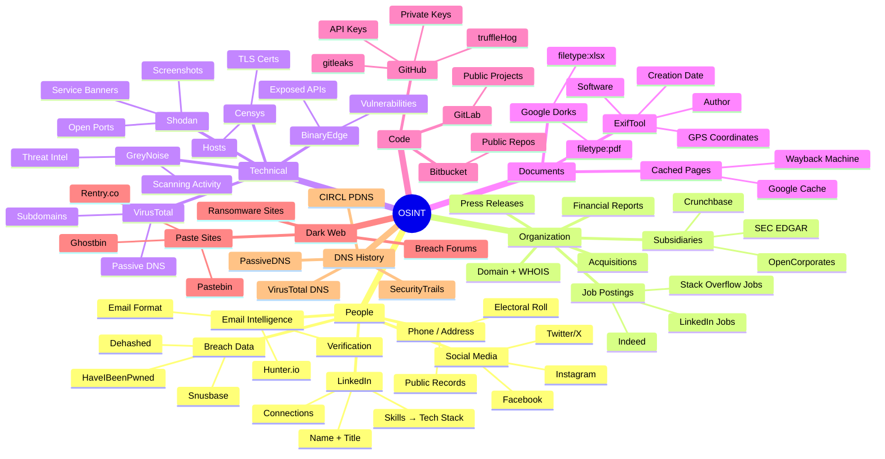
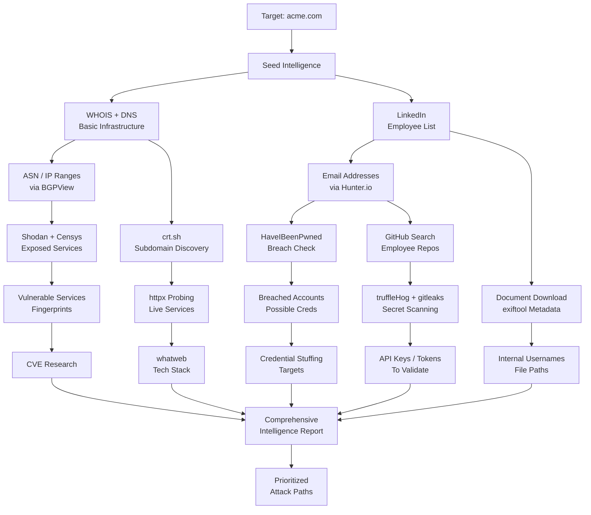

# OSINT — Open Source Intelligence

> **Difficulty:** Beginner → Advanced | **Category:** Penetration Testing

**Open Source Intelligence (OSINT)** is the collection, analysis, and application of information gathered from publicly available sources. The word "open" does not mean easily accessible — it means the information is not classified, proprietary, or illegally obtained. OSINT covers the entire spectrum of publicly available data: web pages, social media, public records, academic publications, satellite imagery, breach databases, and technical infrastructure data.

In offensive security, OSINT is the non-technical face of reconnaissance. Where passive DNS recon maps infrastructure, OSINT maps humans and organizations. It answers the questions: who works there, what do they know, what do they have access to, and what are they saying? The answers feed targeted phishing campaigns, social engineering scenarios, and credential attacks.

Professional OSINT is methodical, documented, and ethically bounded. This document covers the complete OSINT toolkit — from people intelligence to technical infrastructure to dark web monitoring.

---

## Table of Contents

1. [OSINT Framework Overview](#osint-framework-overview)
2. [People OSINT](#people-osint)
3. [Organization OSINT](#organization-osint)
4. [Technical OSINT](#technical-osint)
5. [Document OSINT and Metadata](#document-osint-and-metadata)
6. [Social Media OSINT](#social-media-osint)
7. [GitHub OSINT and Secret Hunting](#github-osint)
8. [Dark Web Mentions](#dark-web-mentions)
9. [OSINT Automation Tools](#osint-automation-tools)
10. [Passive DNS Intelligence](#passive-dns-intelligence)

---

## OSINT Map



---

## OSINT Framework Overview

The **OSINT Framework** (https://osintframework.com) is a curated directory of OSINT tools organized by category. It does not automate anything — it is a reference for knowing what tools exist for each intelligence requirement.

### OSINT Intelligence Cycle

The intelligence cycle applied to OSINT follows a structured methodology:


### OSINT Source Categories

| Category | Examples | What It Reveals |
|---|---|---|
| **Media** | News sites, press releases, blogs | Business activities, breaches, exec comments |
| **Public Records** | SEC filings, court records, patents | Company structure, legal issues, IP |
| **Social Media** | LinkedIn, Twitter, Facebook, Instagram | Employees, culture, technology, travel |
| **Internet** | Web archives, search engines, forums | Historical content, leaked data, discussions |
| **Geospatial** | Google Maps, satellite imagery | Office locations, physical security |
| **Technical** | Shodan, Censys, CT logs, DNS | Infrastructure, exposed services |
| **Human** | Conferences, podcasts, talks | Technical details, internal processes |
| **Dark Web** | Breach forums, paste sites | Stolen credentials, data leaks |

---

## People OSINT

### LinkedIn Intelligence

**LinkedIn** is the richest source of employee intelligence. A thorough LinkedIn investigation of a target organization reveals organizational hierarchy, technical skills in use, security staff identity, and employee movement.

```bash
# Google-powered LinkedIn searches (avoids LinkedIn's search throttling)
site:linkedin.com/in "Acme Corporation" "software engineer"
site:linkedin.com/in "Acme" "security" OR "infosec" OR "cyber"
site:linkedin.com/in "Acme" "AWS" OR "Azure" OR "GCP" OR "Kubernetes"
site:linkedin.com/in "Acme" "CISO" OR "CTO" OR "VP Engineering"

# Find former employees (who may have taken code/knowledge)
site:linkedin.com/in "formerly acme" OR "ex-acme" OR "previously acme"
site:linkedin.com/in "acme corporation" "2020" OR "2021"  # Indicates tenure dates

# Find the IT/Security team specifically
site:linkedin.com/in "acme" "Active Directory" OR "Splunk" OR "Palo Alto"
site:linkedin.com/in "acme" "penetration test" OR "red team" OR "incident response"
```

#### Building an Employee Database

Systematically capture employee data into a structured format:

```bash
# Using theHarvester for LinkedIn scraping
theHarvester -d acme.com -b linkedin -l 500 -f harvester-linkedin

# Parse results
cat harvester-linkedin.xml | grep -oP '<email>[^<]+</email>' | sed 's/<[^>]*>//g'
```

| Field | Source | Notes |
|---|---|---|
| Full Name | LinkedIn | Required for email derivation |
| Job Title | LinkedIn | Role and access level indicator |
| Department | LinkedIn | Org chart reconstruction |
| Location | LinkedIn | Office identification |
| Skills | LinkedIn | Technology stack hints |
| Education | LinkedIn | Graduation year → rough age |
| Start/End Date | LinkedIn | Tenure calculation |
| Email (derived) | Hunter.io / formula | For phishing simulation |
| Personal Email | HaveIBeenPwned | For breach correlation |

### Email Discovery and Verification

```bash
# Hunter.io — find email format and validate addresses
# Web: https://hunter.io/domain-search

# Hunter.io CLI (API key required)
curl -s "https://api.hunter.io/v2/domain-search?domain=acme.com&api_key=YOUR_KEY" | \
  jq -r '.data | "Format: \(.pattern)", "Total: \(.total)", (.emails[] | "\(.value) [\(.type)]")'

# Verify a specific email exists
curl -s "https://api.hunter.io/v2/email-verifier?email=john.smith@acme.com&api_key=YOUR_KEY" | \
  jq '{email: .data.email, status: .data.status, score: .data.score}'

# Derive emails when format is known
# Example: first.last@acme.com format
while IFS=',' read first last; do
  echo "${first,,}.${last,,}@acme.com"
done < employees.csv > derived-emails.txt

# theHarvester — automated email harvesting from multiple sources
theHarvester -d acme.com -b google,bing,yahoo,hunter,linkedin -f harvester-all
theHarvester -d acme.com -b all -l 500 -f harvester-full 2>&1 | tee theharvester-acme.txt

# Extract emails from theHarvester results
cat harvester-full.xml | grep -oP '[a-zA-Z0-9._%+-]+@acme\.com' | sort -u
```

### HaveIBeenPwned — Breach Data

**HaveIBeenPwned (HIBP)** is the authoritative public database of email addresses and phone numbers exposed in data breaches. Checking target employees against HIBP reveals:

- Which employees have been in data breaches
- Which breach datasets their credentials may appear in
- Password reuse risk indicators

```bash
# HIBP API v3 (requires API key — free for personal use, paid for bulk)
# https://haveibeenpwned.com/API/v3

# Check a single email
curl -s "https://haveibeenpwned.com/api/v3/breachedaccount/john.smith@acme.com" \
  -H "hibp-api-key: YOUR_API_KEY" \
  -H "user-agent: Security-Assessment" | \
  jq -r '.[] | "\(.Name) (\(.BreachDate)): \(.DataClasses | join(", "))"'

# Check for pastes (credentials pasted publicly)
curl -s "https://haveibeenpwned.com/api/v3/pasteaccount/john.smith@acme.com" \
  -H "hibp-api-key: YOUR_API_KEY" | jq .

# Bulk check with rate limiting (HIBP rate limits to 1 req/1.5s)
while read email; do
  result=$(curl -s "https://haveibeenpwned.com/api/v3/breachedaccount/$email" \
    -H "hibp-api-key: YOUR_KEY" -H "user-agent: sec-assessment")
  if [ "$result" != "null" ] && [ -n "$result" ]; then
    echo "$email: BREACHED"
    echo "$result" | jq -r '.[].Name'
  fi
  sleep 1.6  # Rate limit compliance
done < derived-emails.txt

# Domain-wide breach search
curl -s "https://haveibeenpwned.com/api/v3/breacheddomain/acme.com" \
  -H "hibp-api-key: YOUR_KEY" | jq .
```

### Dehashed — Deep Breach Database Search

**Dehashed** aggregates breach data including passwords (hashed and plaintext), usernames, IP addresses, and phone numbers. It covers many breaches not in HIBP.

```bash
# Dehashed API (requires subscription)
curl -s "https://api.dehashed.com/search?query=domain:acme.com&size=100" \
  -u "your-email@example.com:YOUR_API_KEY" \
  -H "Accept: application/json" | \
  jq -r '.entries[] | "\(.email) | \(.username) | \(.password) | \(.hashed_password)"'

# Search by email
curl -s "https://api.dehashed.com/search?query=email:john.smith@acme.com" \
  -u "your-email@example.com:YOUR_API_KEY" \
  -H "Accept: application/json" | jq .

# Search by username
curl -s "https://api.dehashed.com/search?query=username:jsmith" \
  -u "your-email@example.com:YOUR_API_KEY" \
  -H "Accept: application/json" | jq .
```

> **Warning:** Downloading and storing plaintext passwords from breach databases may be illegal in your jurisdiction, even for authorized security testing. Consult with legal counsel before using Dehashed or similar services in professional engagements. Always have explicit client authorization to check their employees against breach databases.

---

## Organization OSINT

### Corporate Structure Mapping

Understanding the full corporate structure prevents scoping blind spots. Subsidiaries and acquired companies often share infrastructure, employee accounts, and credentials with the parent but may have weaker security posture.

```bash
# OpenCorporates — free corporate registry database
curl -s "https://api.opencorporates.com/v0.4/companies/search?q=Acme+Corporation&jurisdiction_code=us_de" | \
  jq -r '.results.companies[].company | "\(.name) (\(.jurisdiction_code)) - \(.company_number)"'

# Crunchbase (requires API key for full access)
# Free: https://www.crunchbase.com/organization/acme-corporation

# SEC EDGAR — for US public companies (free, comprehensive)
# Full-text search
curl -s "https://efts.sec.gov/LATEST/search-index?q=%22Acme+Corporation%22&dateRange=custom&startdt=2020-01-01&enddt=2024-12-31&forms=10-K" | \
  jq -r '.hits.hits[].filing.file_date + " " + .hits.hits[]._source.file_num'

# Get filings for a known company
curl -s "https://data.sec.gov/submissions/CIK0000012345.json" | \
  jq -r '.filings.recent | [.form, .filingDate, .primaryDocument] | @tsv' | \
  head -20

# Find subsidiaries in 10-K annual reports
# Exhibit 21 lists all subsidiaries of a public company
curl -s "https://efts.sec.gov/LATEST/search-index?q=%22Acme+Corporation%22&forms=EX-21" | \
  jq -r '.hits.hits[]._source | "\(.file_date) \(.display_names[0].name)"'
```

### Job Posting Intelligence

```bash
# Aggregate job postings via Google
# Technology stack extraction
site:linkedin.com/jobs "Acme Corporation" "senior" 2024
site:greenhouse.io "acme" "security"
site:lever.co "acme" "devops"
site:careers.acme.com "engineer"

# Look for internal tooling mentions
"Acme Corporation" site:linkedin.com/jobs "Terraform" "Kubernetes" "Vault"
"Acme Corporation" site:linkedin.com/jobs "CrowdStrike" OR "Splunk" OR "Elastic"
"Acme Corporation" site:linkedin.com/jobs "Okta" OR "Duo" OR "Azure AD"

# Script to pull job descriptions and extract tech keywords
curl -s "https://www.linkedin.com/jobs/search/?keywords=Acme+Corporation&location=US" | \
  grep -oP '(?<=<span class="job-search-card__title">)[^<]+' | sort -u
```

---

## Technical OSINT

### Shodan Deep Dive

```bash
# Full organization search with multiple filters
shodan search "org:\"Acme Corporation\"" --fields ip_str,port,transport,hostnames,org,product,version,os | \
  column -t | tee shodan-acme.txt

# Find exposed administrative interfaces
shodan search "org:\"Acme Corporation\" http.title:\"admin\""
shodan search "org:\"Acme Corporation\" http.title:\"dashboard\""
shodan search "org:\"Acme Corporation\" http.title:\"Kibana\""
shodan search "org:\"Acme Corporation\" http.title:\"Grafana\""
shodan search "org:\"Acme Corporation\" http.title:\"Jenkins\""

# Find exposed databases
shodan search "org:\"Acme Corporation\" port:27017"   # MongoDB
shodan search "org:\"Acme Corporation\" port:6379"    # Redis
shodan search "org:\"Acme Corporation\" port:9200"    # Elasticsearch
shodan search "org:\"Acme Corporation\" port:5432"    # PostgreSQL
shodan search "org:\"Acme Corporation\" port:3306"    # MySQL

# Find exposed remote access
shodan search "org:\"Acme Corporation\" port:3389"   # RDP
shodan search "org:\"Acme Corporation\" port:5900"   # VNC
shodan search "org:\"Acme Corporation\" port:22"     # SSH

# Find vulnerable versions
shodan search "org:\"Acme Corporation\" product:\"Apache\" version:\"2.4.49\""
shodan search "org:\"Acme Corporation\" cpe:\"cpe:/a:log4j\""

# Monitor for new exposures (requires paid Shodan Monitor)
shodan alert create "Acme Corporation New Exposures" --ip 203.0.113.0/24

# Shodan CLI host details
shodan host 203.0.113.45 --history

# Download and parse results
shodan download acme-dump "org:\"Acme Corporation\""
shodan parse --fields ip_str,port,product,version,hostnames acme-dump.json.gz | \
  awk '$3 != "" {print}' | sort -k3,3 > acme-services.txt
```

### BinaryEdge

**BinaryEdge** scans the internet for exposed services and provides data on vulnerabilities, exposed credentials, and software versions. Strong for finding exposed APIs and services that Shodan may miss.

```bash
# Install BinaryEdge CLI
pip install binaryedge

# Configure
binaryedge configure --api-key YOUR_API_KEY

# Search for hosts
binaryedge host.search "organization:\"Acme Corporation\""

# Search for vulnerabilities
binaryedge host.search "organization:\"Acme Corporation\" has_vuln:true"

# Via API directly
curl -s "https://api.binaryedge.io/v2/query/search?query=organization:%22Acme+Corporation%22" \
  -H "X-Key: YOUR_API_KEY" | jq .

# Search by IP
curl -s "https://api.binaryedge.io/v2/query/ip/203.0.113.45" \
  -H "X-Key: YOUR_API_KEY" | jq .

# Subdomain search
curl -s "https://api.binaryedge.io/v2/query/domains/subdomain/acme.com" \
  -H "X-Key: YOUR_API_KEY" | jq -r '.events[]'
```

### GreyNoise — Contextual Threat Intelligence

**GreyNoise** analyzes internet scanning activity. It is particularly useful for determining whether IPs in your target's range are conducting scanning activities (indicating compromised hosts) or are being targeted by known scanners.

```bash
# GreyNoise CLI
pip install greynoise
greynoise setup --api-key YOUR_API_KEY

# Check if an IP is a known scanner/noisy actor
greynoise ip 203.0.113.45

# Check multiple IPs
cat ip-list.txt | gnql "ip in ['203.0.113.1', '203.0.113.2']" --format json

# GNQL queries
greynoise query "org:\"Acme Corporation\" last_seen:1d"
greynoise query "ip:203.0.113.0/24 classification:malicious"

# Via API
curl -s "https://api.greynoise.io/v3/community/203.0.113.45" \
  -H "key: YOUR_API_KEY" | jq .
```

---

## Document OSINT and Metadata

Documents published by an organization often contain **metadata** — hidden data embedded by the authoring software. This includes author names, usernames, creation dates, software versions, GPS coordinates (in photos), and internal file paths.

### Why Document Metadata Matters

| Metadata Field | Source Document | Intelligence Value |
|---|---|---|
| **Author** | Word, PDF, Excel | Reveals employee names, usernames |
| **Last Modified By** | Word, Excel | Different author → contributor list |
| **Company** | All Office docs | Confirms organization name |
| **Creator Application** | PDF | Software version → CVE potential |
| **GPS Coordinates** | Photos, PDFs with images | Physical location of photographer |
| **Internal File Path** | Word, PDF | Reveals internal folder structure, usernames |
| **Creation Date** | All documents | Timeline of organizational activity |
| **Template Path** | Word docs | Internal server names (`\\fileserver01\templates`) |
| **Email Address** | vCard, Outlook items | Direct contact information |

### `exiftool` — Metadata Extraction

```bash
# Install exiftool
apt install exiftool

# Extract metadata from a single file
exiftool document.pdf

# Extract all metadata from all files in a directory
exiftool /path/to/documents/ -r

# Extract specific fields
exiftool -Author -Creator -CreateDate document.pdf
exiftool -GPS* photo.jpg

# Extract GPS coordinates and format nicely
exiftool -n -GPSLatitude -GPSLongitude photo.jpg
# Then paste coordinates into Google Maps

# Batch extract metadata from downloaded files
exiftool -json /path/to/documents/*.pdf > metadata-all.json
cat metadata-all.json | jq -r '.[] | "\(.FileName): Author=\(.Author // "N/A"), Creator=\(.Creator // "N/A")"'

# Extract usernames from file paths
exiftool -r /path/to/docs/ | grep -i "path\|template\|author" | sort -u

# Strip metadata from files (useful for your own documents)
exiftool -all= document.pdf
```

### Finding Public Documents with Google Dorks

```bash
# Find PDFs
site:acme.com filetype:pdf

# Find Word documents
site:acme.com filetype:doc OR filetype:docx

# Find Excel files (may contain data exports)
site:acme.com filetype:xls OR filetype:xlsx

# Find PowerPoint presentations (may contain internal architecture diagrams)
site:acme.com filetype:ppt OR filetype:pptx

# Find documents with sensitive keywords
site:acme.com filetype:pdf "confidential" OR "internal use"
site:acme.com filetype:pdf "network diagram" OR "architecture"
site:acme.com filetype:pdf "password policy" OR "security policy"

# Specific document types
site:acme.com filetype:pdf "employee handbook"
site:acme.com filetype:ppt "Q4 2024"
```

### Automated Metadata Harvesting with FOCA

**FOCA (Fingerprinting Organizations with Collected Archives)** is a Windows tool that downloads documents, extracts metadata, and maps internal usernames and network paths:

```bash
# FOCA is Windows-only (use Wine on Linux, or a Windows VM)
# For Linux, combine tools manually:

# 1. Download all PDFs from a domain
wget -r -nd -A pdf "https://acme.com" -P docs/pdfs/

# 2. Extract metadata with exiftool
exiftool -json docs/pdfs/*.pdf > metadata.json

# 3. Parse for usernames
cat metadata.json | jq -r '.[].Author' | grep -v null | sort -u
cat metadata.json | jq -r '.[].Creator' | grep -v null | sort -u

# 4. Look for internal paths
cat metadata.json | jq -r '.[] | .TemplatePath // empty' | sort -u
# May reveal: \\fileserver\shares\templates\report.dotx
#             C:\Users\john.smith\Documents\Templates\
```

### metagoofil — Automated Metadata Harvesting

```bash
# Install metagoofil
pip install metagoofil

# Download and analyze documents
metagoofil -d acme.com -t pdf,doc,xls,ppt -o docs/ -f results.html

# Extract found usernames
cat results.html | grep -oP '(?<=<b>)[A-Za-z\s]+(?=</b>)' | sort -u
```

---

## Social Media OSINT

### Twitter/X Intelligence

Twitter/X is valuable for understanding an organization's culture, security posture, technology discussions, and employee sentiment:

```bash
# Advanced Twitter search (web-based)
# https://twitter.com/search-advanced

# Via Google (often better results than Twitter's own search)
site:twitter.com "acme corporation" "deployed" OR "launched" OR "outage"
site:twitter.com "acme" "kubernetes" OR "docker" OR "terraform"
site:twitter.com "@acme" "password" OR "credentials"

# Find employees' accounts
site:twitter.com "works at acme" OR "employed at acme"
site:twitter.com "acme engineer" OR "acme developer"

# Find conference talks mentioning the company
site:twitter.com "acme" "#DEFCON" OR "#BlackHat" OR "#RSA"
```

### LinkedIn Posts as Intelligence

Employee LinkedIn posts often reveal:
- New technology adoptions ("We just migrated to Kubernetes!")
- Incident indicators ("Exciting week dealing with a security incident...")
- New service launches ("Proud to announce our new API platform!")
- Internal tooling ("Just automated our deployment pipeline with Terraform!")

```bash
# Google-indexed LinkedIn posts
site:linkedin.com/posts "acme" "deployed" OR "migrated" OR "launched" 2024
site:linkedin.com/posts "acme" "kubernetes" OR "terraform" OR "microservices"
site:linkedin.com/posts "acme" "incident" OR "breach" OR "vulnerability"
```

### Instagram and Facebook for Physical Security

Visual social media can reveal physical security information:

```bash
# Search for location tags at target's office
# https://www.instagram.com/explore/locations/

# Google search for tagged photos
site:instagram.com "acme corporation headquarters"
site:instagram.com "acme office"

# Look for badge photos, security setups in background of photos
# (Badge RFID codes, access card designs, visitor badge procedures)
```

---

## GitHub OSINT and Secret Hunting

GitHub is consistently one of the most productive OSINT targets. Developers accidentally commit credentials, configuration files, API keys, private keys, and internal documentation.

### Organization Repository Discovery

```bash
# List all repos for a GitHub organization
curl -s "https://api.github.com/orgs/acme-corp/repos?per_page=100&type=public" \
  -H "Authorization: token YOUR_GITHUB_TOKEN" | \
  jq -r '.[].full_name' | tee github-repos.txt

# Get all pages of repos (orgs with >100 repos)
page=1
while true; do
  repos=$(curl -s "https://api.github.com/orgs/acme-corp/repos?per_page=100&page=$page&type=public" \
    -H "Authorization: token YOUR_GITHUB_TOKEN")
  echo "$repos" | jq -r '.[].full_name' >> github-repos.txt
  count=$(echo "$repos" | jq '. | length')
  [ "$count" -lt 100 ] && break
  ((page++))
done

# Get members of an organization
curl -s "https://api.github.com/orgs/acme-corp/members?per_page=100" \
  -H "Authorization: token YOUR_GITHUB_TOKEN" | \
  jq -r '.[].login' | tee github-members.txt

# Check repos owned by identified employees
while read username; do
  echo "=== $username ==="
  curl -s "https://api.github.com/users/$username/repos?per_page=100" \
    -H "Authorization: token YOUR_GITHUB_TOKEN" | \
    jq -r '.[] | "\(.full_name) [\(.updated_at)]"'
done < github-members.txt
```

### GitHub Code Search for Secrets

```bash
# GitHub CLI search
gh search code "acme.com password" --limit 100
gh search code "acme.com api_key" --limit 100
gh search code "acme.com AWS_SECRET" --limit 100

# GitHub REST API search
curl -s "https://api.github.com/search/code?q=org:acme-corp+password&per_page=50" \
  -H "Authorization: token YOUR_GITHUB_TOKEN" | \
  jq -r '.items[] | "\(.repository.full_name): \(.path) [\(.html_url)]"'

# Specific secret patterns
curl -s "https://api.github.com/search/code?q=org:acme-corp+BEGIN+RSA+PRIVATE+KEY&per_page=30" \
  -H "Authorization: token YOUR_GITHUB_TOKEN" | jq .

curl -s "https://api.github.com/search/code?q=org:acme-corp+AKIA&per_page=30" \
  -H "Authorization: token YOUR_GITHUB_TOKEN" | jq .
```

### `truffleHog` — Automated Secret Detection

```bash
# Install truffleHog v3
pip install trufflehog

# Scan GitHub organization
trufflehog github --org=acme-corp \
  --token=YOUR_GITHUB_TOKEN \
  --only-verified \
  --json | tee trufflehog-results.json

# Scan a specific repo
trufflehog github \
  --repo=https://github.com/acme-corp/backend \
  --only-verified

# Scan ALL history (not just recent commits)
trufflehog git https://github.com/acme-corp/backend \
  --since-commit="" \
  --json | tee trufflehog-full-history.json

# Scan a local repository
trufflehog git file:///path/to/cloned/repo \
  --json | tee trufflehog-local.json

# Scan for specific detector types
trufflehog github --org=acme-corp \
  --detector=aws \
  --detector=github \
  --detector=stripe \
  --json

# Parse results
cat trufflehog-results.json | jq -r '. | select(.Verified == true) | 
  "\(.DetectorName): \(.Raw[0:30])... in \(.SourceMetadata.Data.Github.repository)"'
```

### `gitleaks` — Fast Secret Scanner

```bash
# Install gitleaks
go install github.com/gitleaks/gitleaks/v8@latest
# or
apt install gitleaks

# Scan a repository
gitleaks detect \
  --source /path/to/repo \
  --report-path gitleaks-report.json \
  --report-format json

# Scan entire git history
gitleaks detect \
  --source /path/to/repo \
  --log-opts="--all" \
  --report-path gitleaks-full.json

# Scan remote repository directly
gitleaks detect \
  --source https://github.com/acme-corp/backend \
  --report-path gitleaks-remote.json

# Verbose mode — see what it finds
gitleaks detect --source /path/to/repo -v

# Custom config file (add custom rules)
gitleaks detect --source /path/to/repo -c .gitleaks.toml

# Protect mode — check only uncommitted changes
gitleaks protect --staged

# Parse JSON report
cat gitleaks-full.json | jq -r '.[] | "[\(.RuleID)] \(.Description): \(.Secret[0:20])... in \(.File):\(.StartLine)"'
```

### Finding Leaked Secrets in Git History

Even if a developer removes a secret in a later commit, the secret persists in git history:

```bash
# Clone the target repository
git clone https://github.com/acme-corp/backend acme-backend
cd acme-backend

# Search git log for sensitive patterns
git log --all --full-history -p | grep -E "password|secret|api_key|token" | head -50

# Find all commits that touched config files
git log --all --oneline -- "*.env" "*.cfg" "*config*" "*.yml" "*.yaml" | head -20

# View a specific old commit that touched a suspicious file
git show abc123def456 -- config.yml

# Find deleted files in history
git log --all --diff-filter=D --summary | grep delete

# Use git-secrets to scan
git secrets --scan-history
```

---

## Dark Web Mentions

Monitoring the dark web for target mentions reveals active threat activity against the organization. This includes:

- **Breach announcements**: Ransomware groups listing victims
- **Credential dumps**: Stolen employee logins for sale
- **Data for sale**: Customer databases, source code, financial records
- **Threat actor discussions**: Forums discussing attack methods against the target
- **Paste sites**: Publicly dumped credentials (clearnet)

> **Warning:** Accessing dark web resources requires Tor and carries legal and operational security risks. Only access dark web resources for legitimate, authorized intelligence work. Never download malware, interact with illegal marketplaces, or conduct activity that could be construed as procurement of stolen goods.

### Paste Site Monitoring (Clearnet)

```bash
# Search paste sites via Google
site:pastebin.com "acme.com" "password"
site:pastebin.com "acme corporation" credentials
site:paste.ee "acme.com"
site:ghostbin.com "acme"
site:rentry.co "acme.com"

# Search for credential dumps
"@acme.com" site:pastebin.com
"@acme.com" filetype:txt site:pastebin.com

# DeHashed covers many paste sites
# Intelx.io searches paste sites, dark web, and data leaks
curl -s "https://2.intelx.io/intelligent/search" \
  -X POST \
  -H "x-key: YOUR_INTELX_KEY" \
  -H "Content-Type: application/json" \
  -d '{"term":"acme.com","buckets":[],"lookuplevel":0,"maxresults":100,"timeout":5,"datefrom":"","dateto":"","sort":4,"media":0,"terminate":[]}' | jq .
```

### Ransomware Tracking

Several clearnet sites track ransomware gang activity and victim listings:

```
# RansomWatch — monitors ransomware gang sites
https://ransomwatch.telemetry.ltd/#/profiles

# Ransomware.live
https://www.ransomware.live/

# Search these for target organization name
# If found, this is a CRITICAL finding requiring immediate client notification
```

### Setting Up Monitoring

```bash
# SpiderFoot automated dark web and paste site monitoring
# (Covered in OSINT Automation section)

# Google Alert for organization mentions
# https://alerts.google.com
# Set alert for: "acme corporation" breach OR leak OR hacked OR ransomware

# OSINT Industries for dark web mentions (paid)
# https://app.osint.industries

# IntelX bulk search
curl -s "https://2.intelx.io/phonebook/search?term=acme.com&target=1&maxresults=100&timeout=5" \
  -H "x-key: YOUR_INTELX_KEY" | jq .
```

---

## OSINT Automation Tools

### `theHarvester` — Classic OSINT Aggregator

```bash
# Install theHarvester
apt install theharvester
# or
git clone https://github.com/laramies/theHarvester.git
cd theHarvester && pip install -r requirements/base.txt

# Full harvest — all sources
theHarvester -d acme.com -b all -l 500

# Specific sources
theHarvester -d acme.com -b google,bing,linkedin,hunter,virustotal,shodan

# Save to HTML and XML
theHarvester -d acme.com -b all -f results

# With DNS brute force
theHarvester -d acme.com -b all -c -n

# Subdomain takeover check
theHarvester -d acme.com -b all -t
```

### Recon-ng — Modular OSINT Framework

```bash
# Install recon-ng
pip install recon-ng
# or
git clone https://github.com/lanmaster53/recon-ng.git
cd recon-ng && pip install -r REQUIREMENTS

# Start recon-ng
recon-ng

# Inside recon-ng:
# Create a workspace
workspaces create acme-assessment

# Add target domain
db insert domains acme.com

# Load and run modules
modules load recon/domains-hosts/hackertarget
run

modules load recon/domains-hosts/certificate_transparency
run

modules load recon/hosts-hosts/resolve
run

modules load recon/domains-contacts/whois_pocs
run

# Search for modules
modules search domains
modules search email

# View collected data
show hosts
show contacts
show domains

# Generate report
modules load reporting/html
options set FILENAME /tmp/acme-report.html
run
```

### SpiderFoot — Automated OSINT Collection

```bash
# Install SpiderFoot
pip install spiderfoot
# or
git clone https://github.com/smicallef/spiderfoot.git
cd spiderfoot && pip install -r requirements.txt

# Start web UI
python sf.py -l 127.0.0.1:5001

# CLI mode
python sfcli.py -s acme.com -m sfp_dnsresolve,sfp_ssl,sfp_shodan \
  -o csv -f spiderfoot-results.csv

# Run all modules
python sfcli.py -s acme.com -t INTERNET_NAME -o json -f results.json

# Key modules:
# sfp_hunter        — Hunter.io email discovery
# sfp_shodan        — Shodan integration
# sfp_virustotal    — VirusTotal DNS/URL data
# sfp_hibp          — HaveIBeenPwned check
# sfp_github        — GitHub repository search
# sfp_dnsdumpster   — DNS Dumpster lookup
# sfp_censys        — Censys integration
# sfp_pastebin      — Pastebin mention search
```

### BBOT — Scalable OSINT Automation

```bash
# Install BBOT
pip install bbot

# Full passive scan
bbot -t acme.com -f passive -o bbot-passive/ --output-module json

# Aggressive scan (active + passive)
bbot -t acme.com -f aggressive -o bbot-aggressive/

# Subdomain enumeration focus
bbot -t acme.com -m subdomain-enum -o bbot-subdomains/

# Email discovery
bbot -t acme.com -m email-enum -o bbot-emails/

# Custom module selection
bbot -t acme.com \
  -m certspotter,hackertarget,sublist3r,virustotal,shodan_dns,dehashed \
  -o bbot-custom/

# View results
bbot -t acme.com -f passive --output-module csv -o bbot-csv/ --yes
cat bbot-csv/output.csv | grep "DNS_NAME" | cut -d, -f2 | sort -u
```

### Maltego — Visual OSINT Mapping

**Maltego** is the industry standard for visual OSINT intelligence mapping. It represents intelligence as a graph — entities (domains, emails, people, IP addresses) connected by edges (relationships). Its Transform Hub provides integrations with hundreds of data sources.

Key transforms for penetration testing:
- **DNS to IP**: Resolve discovered domains to IPs
- **IP to ASN**: Find ASN from IP address
- **Domain to certificates**: CT log integration
- **Email to person**: LinkedIn and breach database correlation
- **Person to social media**: Cross-platform profile discovery
- **IP to Shodan**: Pull Shodan data for any IP directly in graph

```bash
# Maltego CE (Community Edition) is free with limited transforms
# Download from: https://www.maltego.com/downloads/

# For CLI/automation — use the Maltego API or PTDS (Public Transform Distribution Server)
# Or use maltego-trx for building custom transforms
pip install maltego-trx
```

---

## Passive DNS Intelligence

**Passive DNS** databases record DNS queries observed at recursive resolvers over time, building a historical record of which domains resolved to which IPs at what times. This is invaluable for tracking infrastructure changes, finding related domains, and identifying infrastructure shared between attackers.

### SecurityTrails — DNS History

```bash
# SecurityTrails API
curl -s "https://api.securitytrails.com/v1/history/acme.com/dns/a" \
  -H "APIKEY: YOUR_KEY" | \
  jq -r '.records[] | "\(.first_seen) - \(.last_seen): \(.values[].ip)"'

# Current DNS records
curl -s "https://api.securitytrails.com/v1/domain/acme.com" \
  -H "APIKEY: YOUR_KEY" | jq .

# Find all domains that ever pointed to a given IP
curl -s "https://api.securitytrails.com/v1/reverse_dns/203.0.113.45" \
  -H "APIKEY: YOUR_KEY" | jq -r '.records[].hostname'

# Associated domains (same NS, MX, or IP)
curl -s "https://api.securitytrails.com/v1/domain/acme.com/associated" \
  -H "APIKEY: YOUR_KEY" | jq -r '.records[].hostname'

# Find subdomains
curl -s "https://api.securitytrails.com/v1/domain/acme.com/subdomains" \
  -H "APIKEY: YOUR_KEY" | jq -r '.subdomains[] | . + ".acme.com"'
```

### VirusTotal Passive DNS

```bash
# VirusTotal API v3 (free tier: 500 req/day)
# Resolutions for a domain
curl -s "https://www.virustotal.com/api/v3/domains/acme.com/resolutions?limit=40" \
  -H "x-apikey: YOUR_VT_KEY" | \
  jq -r '.data[] | "\(.attributes.date): \(.attributes.ip_address)"'

# Subdomains from VirusTotal
curl -s "https://www.virustotal.com/api/v3/domains/acme.com/subdomains?limit=40" \
  -H "x-apikey: YOUR_VT_KEY" | \
  jq -r '.data[].id'

# Reverse DNS — domains that resolved to an IP
curl -s "https://www.virustotal.com/api/v3/ip_addresses/203.0.113.45/resolutions?limit=40" \
  -H "x-apikey: YOUR_VT_KEY" | \
  jq -r '.data[].attributes.host_name'

# Check URL/domain reputation
curl -s "https://www.virustotal.com/api/v3/domains/acme.com" \
  -H "x-apikey: YOUR_VT_KEY" | \
  jq '.data.attributes | {last_analysis_stats, reputation}'
```

### CIRCL Passive DNS

**CIRCL (Computer Incident Response Center Luxembourg)** operates a free passive DNS service:

```bash
# CIRCL pDNS API (requires free account)
curl -s "https://www.circl.lu/pdns/query/acme.com" \
  -u "your-username:your-password" | \
  python3 -m json.tool | head -50

# Query for IP history
curl -s "https://www.circl.lu/pdns/query/203.0.113.45" \
  -u "user:pass" | python3 -m json.tool
```

### RiskIQ / Microsoft Defender EASM Passive DNS

```bash
# PassiveTotal API (RiskIQ — now Microsoft)
curl -s "https://api.riskiq.net/pt/v2/dns/passive?query=acme.com" \
  -u "your@email.com:YOUR_API_KEY" | \
  jq -r '.results[] | "\(.firstSeen) - \(.lastSeen): \(.resolve) -> \(.value)"'

# Find all domains on same IP
curl -s "https://api.riskiq.net/pt/v2/dns/passive/unique?query=203.0.113.45" \
  -u "your@email.com:YOUR_API_KEY" | \
  jq -r '.results[].resolve'
```

---

## OSINT Workflow Summary



---

## OSINT Ethics and Legal Considerations

OSINT operates in a complex legal and ethical space. "Publicly available" does not always mean "legally usable for all purposes."

| Activity | Legal Status | Notes |
|---|---|---|
| **WHOIS lookup** | Legal everywhere | Standard query |
| **LinkedIn profile viewing** | Legal — ToS may restrict automation | Manual is always safe |
| **Google dorking** | Legal | No automated scraping per Google ToS |
| **crt.sh queries** | Legal | Public API, encouraged |
| **Shodan search** | Legal | You query Shodan, not the target |
| **HaveIBeenPwned** | Legal | Troy Hunt's public service |
| **Dehashed** | Legal to query, gray area to store results | Check local data protection laws |
| **GitHub code search** | Legal for public repos | ToS restricts bulk automated scraping |
| **Dark web access** | Legal in most jurisdictions | Content consumption ≠ criminal activity |
| **Downloading breach data** | Potentially illegal | May constitute receipt of stolen goods |

> **Note:** In professional engagements, include an explicit OSINT authorization clause in your Rules of Engagement. This protects you when accessing breach databases, dark web sources, and when correlating personal data about employees (which may trigger GDPR, CCPA, or other privacy law obligations).

---

*Previous: [Active Reconnaissance](active-recon.md)*
*See also: [Recon Overview](recon-overview.md) | [Passive Reconnaissance](passive-recon.md)*
