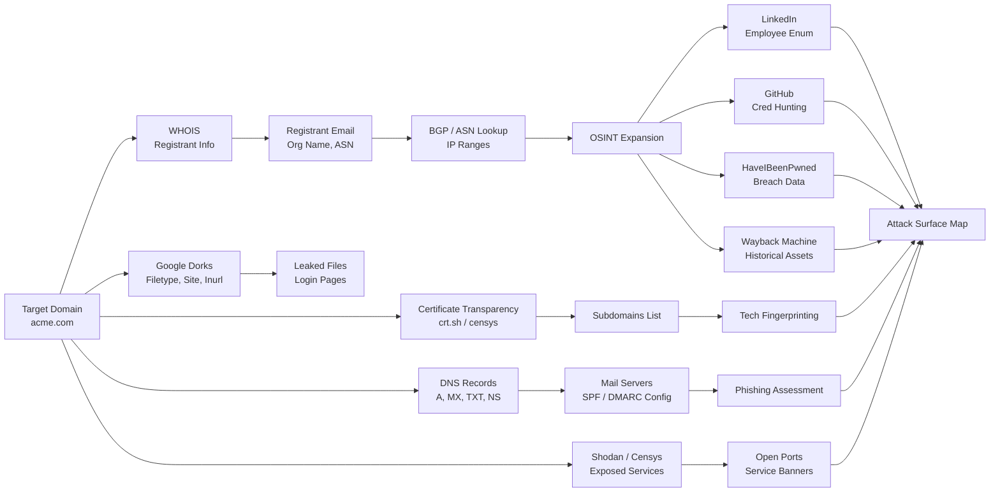

# Passive Reconnaissance

> **Difficulty:** Beginner → Advanced | **Category:** Penetration Testing

Passive reconnaissance is the art of collecting intelligence about a target without sending a single packet to their systems. Every query goes to a third party — a public database, a search engine, a certificate registry, a DNS resolver cache. The target cannot detect your activity. This makes passive recon uniquely powerful: you can learn an enormous amount about an organization's infrastructure, personnel, and security posture before they even know you exist.

The discipline of passive recon is breadth first. Cast the widest possible net before going deep. A subdomain you overlook in passive recon may be the easiest entry point in the entire engagement.

---

## Table of Contents

1. [WHOIS Lookups](#whois-lookups)
2. [DNS Records](#dns-records)
3. [Certificate Transparency Logs](#certificate-transparency-logs)
4. [Google Dorks](#google-dorks)
5. [Shodan](#shodan)
6. [Censys](#censys)
7. [LinkedIn and Social Media](#linkedin-and-social-media)
8. [Job Postings for Technology Stack Intel](#job-postings)
9. [GitHub and GitLab](#github-and-gitlab)
10. [Wayback Machine](#wayback-machine)
11. [BGP and ASN Lookups](#bgp-and-asn-lookups)
12. [Passive Recon Workflow](#passive-recon-workflow)

---

## Passive Recon Workflow



---

## WHOIS Lookups

**WHOIS** is a query-and-response protocol for querying databases that store registered users of internet resources — domain names, IP address blocks, and autonomous systems. WHOIS data can reveal registrant identity, contact information, registration dates, name servers, and registrar details.

### Domain WHOIS

```bash
# Basic WHOIS lookup
whois acme.com

# Pipe to less for easier reading
whois acme.com | less

# Save output
whois acme.com | tee whois-acme-domain.txt

# Look up a specific WHOIS server
whois -h whois.verisign-grs.com acme.com

# Use jwhois for better output parsing
jwhois acme.com
```

**Key fields to extract from WHOIS output:**

| Field | What It Tells You |
|---|---|
| **Registrant Organization** | Legal company name — useful for finding subsidiaries |
| **Registrant Email** | Admin/tech contact — target for phishing or checking breach DBs |
| **Registrar** | Where the domain is registered (GoDaddy, Namecheap, etc.) |
| **Name Servers** | DNS provider — often reveals cloud provider or DNS service |
| **Creation Date** | Domain age — old domains are more "established" to spam filters |
| **Expiry Date** | Upcoming expiry can indicate neglect or acquisition opportunities |
| **Admin/Tech Phone** | May reveal employee phone numbers |

### IP WHOIS — Finding the Organization Behind an IP

```bash
# WHOIS an IP address to find owner and netblock
whois 203.0.113.45

# More detailed — query ARIN (North America)
whois -h whois.arin.net 203.0.113.45

# Query RIPE (Europe)
whois -h whois.ripe.net 185.220.101.45

# Query APNIC (Asia-Pacific)
whois -h whois.apnic.net 1.1.1.1

# Identify which RIR to query
whois -h whois.iana.org 203.0.113.45
```

### WHOIS Privacy and Its Limitations

Many modern domain registrations use **WHOIS privacy protection** (e.g., Domains By Proxy, WhoisGuard). This replaces registrant information with proxy contact details. However:

- Historical WHOIS data (before privacy was enabled) may be available via services like DomainTools or SecurityTrails.
- Reverse WHOIS searches on the registrant email may reveal other domains owned by the same entity.
- The registrant organization may still be visible even when contact details are masked.

```bash
# Reverse WHOIS via command line (requires API key for commercial services)
# Free alternative — search SecurityTrails
curl -s "https://api.securitytrails.com/v1/domains/list" \
  -H "APIKEY: YOUR_API_KEY" \
  -H "Content-Type: application/json" \
  --data '{"filter":{"whois_email":"admin@acme.com"}}' | jq .

# Or use viewdns.info reverse WHOIS (web-based, free limited)
# https://viewdns.info/reversewhois/?q=admin%40acme.com
```

> **Note:** DomainTools offers the most comprehensive historical WHOIS database but requires a paid subscription. For professional engagements, it is worth the investment. The free tier at https://whois.domaintools.com still shows current data with some history.

---

## DNS Records

**DNS (Domain Name System)** records are a goldmine for recon. Different record types reveal different aspects of the target's infrastructure. Understanding each record type and what it reveals is fundamental to passive recon.

### Record Types and Their Intelligence Value

| Record Type | Purpose | Recon Value |
|---|---|---|
| **A** | Maps domain to IPv4 address | Identifies hosting providers, IP ranges |
| **AAAA** | Maps domain to IPv6 address | IPv6 attack surface, CDN detection |
| **CNAME** | Canonical name alias | Reveals third-party services (Salesforce, HubSpot) |
| **MX** | Mail server routing | Identifies email provider (O365, Google Workspace, self-hosted) |
| **TXT** | Arbitrary text records | SPF, DMARC, domain verification tokens — reveals cloud services |
| **NS** | Authoritative name servers | DNS provider, potential zone transfer targets |
| **SOA** | Start of Authority | Primary name server, admin email, zone serial |
| **PTR** | Reverse DNS | IP to hostname mapping — useful for IP range enumeration |
| **SRV** | Service locator | Reveals services and ports (SIP, XMPP, LDAP, Kerberos) |
| **CAA** | Certificate Authority Authorization | Restricts which CAs can issue certs for the domain |
| **DKIM** | Email signing key | Reveals email infrastructure, selector format |

### Basic DNS Queries with `dig`

```bash
# Query A record (IPv4)
dig acme.com A +short

# Query all record types
dig acme.com ANY +noall +answer

# Query MX records (mail servers)
dig acme.com MX +short

# Query NS records (name servers)
dig acme.com NS +short

# Query TXT records (SPF, DMARC, verifications)
dig acme.com TXT +short

# Query SOA record
dig acme.com SOA +short

# Query DMARC record
dig _dmarc.acme.com TXT +short

# Query DKIM record (need to know the selector)
dig mail._domainkey.acme.com TXT +short
# Common selectors: mail, google, k1, s1, s2, selector1, selector2

# Query SRV records (e.g., for autodiscover — Office 365)
dig _autodiscover._tcp.acme.com SRV +short
dig _sip._tls.acme.com SRV +short

# Query CAA records (reveals trusted CAs)
dig acme.com CAA +short

# Query with a specific DNS server
dig @8.8.8.8 acme.com A +short
dig @1.1.1.1 acme.com MX +short

# Reverse DNS lookup (PTR)
dig -x 203.0.113.45 +short

# Query IPv6
dig acme.com AAAA +short
```

### Using `nslookup`

```bash
# Basic lookup
nslookup acme.com

# Interactive mode for multiple queries
nslookup
> set type=MX
> acme.com
> set type=TXT
> acme.com
> set type=NS
> acme.com
> exit

# Query specific record type
nslookup -type=TXT acme.com
nslookup -type=MX acme.com 8.8.8.8
```

### Reading SPF Records

**SPF (Sender Policy Framework)** records define which servers are authorized to send email on behalf of a domain. They reveal infrastructure details:

```bash
dig acme.com TXT +short | grep "v=spf"
# Example output:
# "v=spf1 include:_spf.google.com include:sendgrid.net ip4:203.0.113.0/24 ~all"
```

Parsing this:
- `include:_spf.google.com` → Uses Google Workspace for email
- `include:sendgrid.net` → Uses SendGrid for transactional email
- `ip4:203.0.113.0/24` → This IP range sends email — likely their outbound mail server range

### Reading DMARC Records

**DMARC (Domain-based Message Authentication, Reporting & Conformance)** tells receiving servers what to do with emails that fail SPF/DKIM checks:

```bash
dig _dmarc.acme.com TXT +short
# Example output:
# "v=DMARC1; p=reject; rua=mailto:dmarc@acme.com; ruf=mailto:forensics@acme.com; pct=100"
```

- `p=none` → DMARC is in monitoring mode — phishing emails may be delivered
- `p=quarantine` → Failed emails go to spam
- `p=reject` → Failed emails are rejected — hardened against email spoofing
- `rua=` / `ruf=` → Report recipients — may reveal internal email addresses

> **Note:** A `p=none` DMARC policy is a significant finding. It means the domain can be spoofed in phishing attacks and the spoofed emails will be delivered to inboxes. Document this as a medium-to-high severity finding depending on the target's risk profile.

### Bulk DNS Queries

```bash
# Query multiple record types for a domain in sequence
for type in A AAAA NS MX TXT SOA CNAME; do
  echo "=== $type ==="
  dig acme.com $type +short
done

# DNS enumeration script for a list of subdomains
while read sub; do
  ip=$(dig +short "$sub.acme.com" A 2>/dev/null | head -1)
  [ -n "$ip" ] && echo "$sub.acme.com -> $ip"
done < /usr/share/wordlists/SecLists/Discovery/DNS/subdomains-top1million-5000.txt
```

---

## Certificate Transparency Logs

**Certificate Transparency (CT)** is a framework that requires all publicly trusted TLS certificates to be logged in public, append-only logs. This was designed to detect fraudulently issued certificates — but as a side effect, it creates a comprehensive, searchable public database of every TLS certificate ever issued for every domain, including subdomains.

### Why CT Logs Are Invaluable

Every time an organization creates a new service and issues a TLS certificate for it, that certificate — and its Subject Alternative Names (SANs) — are logged publicly. You get a real-time feed of new subdomains without touching the target.

### crt.sh — The Go-To CT Log Search Engine

```bash
# Search crt.sh for all certificates matching a domain (wildcard)
curl -s "https://crt.sh/?q=%25.acme.com&output=json" | jq -r '.[].name_value' | \
  sort -u | tee subdomains-crt.txt

# Filter out wildcard entries
curl -s "https://crt.sh/?q=%25.acme.com&output=json" | \
  jq -r '.[].name_value' | \
  grep -v '^\*' | \
  sort -u | tee subdomains-crt-clean.txt

# Search for specific certificate issuer (e.g., finding Let's Encrypt certs)
curl -s "https://crt.sh/?q=%25.acme.com&output=json" | \
  jq -r '.[] | select(.issuer_name | contains("Let'"'"'s Encrypt")) | .name_value' | \
  sort -u

# Find certificates issued in the last 30 days (new subdomains)
curl -s "https://crt.sh/?q=%25.acme.com&output=json" | \
  jq -r '.[] | select(.not_before > (now - 2592000 | strftime("%Y-%m-%dT%H:%M:%S"))) | .name_value' | \
  sort -u

# Extract both common name and SANs from crt.sh
curl -s "https://crt.sh/?q=%25.acme.com&output=json" | \
  jq -r '.[] | [.name_value, .common_name] | @csv' | \
  tr -d '"' | tr ',' '\n' | sort -u
```

### CT Logs with `subfinder` (Passive Subdomain Discovery)

**subfinder** aggregates multiple passive sources including CT logs, Shodan, Censys, and more:

```bash
# Install subfinder
go install github.com/projectdiscovery/subfinder/v2/cmd/subfinder@latest

# Basic subdomain enumeration
subfinder -d acme.com -o subdomains-subfinder.txt

# Use all sources (requires API keys configured)
subfinder -d acme.com -all -o subdomains-subfinder-all.txt

# Configure API keys at ~/.config/subfinder/provider-config.yaml
# Sources include: crtsh, certspotter, censys, shodan, virustotal, securitytrails, etc.

# Recursive subdomain discovery
subfinder -d acme.com -all -recursive -o subdomains-recursive.txt

# JSON output for further processing
subfinder -d acme.com -all -json | jq -r '.host' | sort -u
```

### certspotter — Alternative CT Log Search

```bash
# Query Certspotter API
curl -s "https://api.certspotter.com/v1/issuances?domain=acme.com&include_subdomains=true&expand=dns_names" | \
  jq -r '.[].dns_names[]' | sort -u
```

> **Note:** crt.sh and Certspotter search different CT log sets. Run both and deduplicate. You will often find subdomains in one that don't appear in the other.

---

## Google Dorks

**Google Dorking** (also called **Google Hacking**) uses advanced search operators to find information that is technically public but not easily discoverable through normal browsing. The **Google Hacking Database (GHDB)** maintained by Exploit-DB catalogs thousands of proven dork queries.

### Core Operators

| Operator | Function | Example |
|---|---|---|
| `site:` | Restrict results to a domain | `site:acme.com` |
| `filetype:` | Search for specific file types | `filetype:pdf site:acme.com` |
| `inurl:` | Match text in the URL | `inurl:admin site:acme.com` |
| `intitle:` | Match text in the page title | `intitle:"index of" site:acme.com` |
| `intext:` | Match text in the page body | `intext:"password" site:acme.com` |
| `cache:` | View Google's cached version | `cache:acme.com` |
| `link:` | Pages linking to a URL | `link:acme.com` |
| `related:` | Sites related to a URL | `related:acme.com` |
| `-` (minus) | Exclude terms | `site:acme.com -www` |
| `"` (quotes) | Exact phrase match | `"acme corporation" "api key"` |
| `*` (wildcard) | Wildcard match | `site:*.acme.com` |
| `OR` | Boolean OR | `site:acme.com OR site:acmecorp.com` |

### Subdomain and Infrastructure Discovery

```
# Find all indexed pages on a domain
site:acme.com

# Find subdomains (excludes www)
site:acme.com -www

# Find specific subdomains
site:*.acme.com

# Find subdomains with login pages
site:acme.com inurl:login OR inurl:signin OR inurl:portal
site:acme.com intitle:"login" OR intitle:"sign in"

# Find admin panels
site:acme.com inurl:admin OR inurl:administrator OR inurl:wp-admin OR inurl:cpanel
site:acme.com intitle:"admin panel" OR intitle:"control panel"

# Find API documentation
site:acme.com inurl:api OR inurl:/docs OR inurl:swagger
site:acme.com intitle:"swagger ui" OR intitle:"api reference"
```

### Sensitive File Discovery

```
# Configuration files
site:acme.com filetype:env OR filetype:cfg OR filetype:conf OR filetype:config
site:acme.com filetype:yml OR filetype:yaml
site:acme.com filetype:ini OR filetype:properties

# Database files
site:acme.com filetype:sql OR filetype:db OR filetype:sqlite

# Backup files
site:acme.com filetype:bak OR filetype:backup OR filetype:old
site:acme.com ext:bak inurl:"wp-config"

# Log files
site:acme.com filetype:log
site:acme.com inurl:access.log OR inurl:error.log

# Spreadsheets with potentially sensitive data
site:acme.com filetype:xls OR filetype:xlsx filetype:csv
site:acme.com filetype:xls "password" OR "username" OR "email"

# PDF documents (internal docs, policies, org charts)
site:acme.com filetype:pdf
site:acme.com filetype:pdf "confidential" OR "internal use only"

# Word documents
site:acme.com filetype:doc OR filetype:docx
```

### Exposed Credentials and Keys

```
# API keys in pages
site:acme.com intext:"api_key" OR intext:"api-key" OR intext:"apikey"
site:acme.com intext:"access_token" OR intext:"secret_key"

# AWS credentials
site:acme.com intext:"AKIA" (AWS access key prefix)
"acme.com" intext:"aws_access_key_id"

# Passwords in error messages or config
site:acme.com intext:"password=" filetype:env
site:acme.com intext:"DB_PASSWORD"

# Connection strings
site:acme.com intext:"jdbc:mysql" OR intext:"mongodb://"
```

### Directory Listings

```
# Open directory listings
site:acme.com intitle:"index of"
site:acme.com intitle:"index of /" "parent directory"
site:acme.com intitle:"directory listing"

# Specific directory types
site:acme.com intitle:"index of" inurl:backup
site:acme.com intitle:"index of" inurl:upload
site:acme.com intitle:"index of" inurl:logs
```

### Technology-Specific Dorks

```
# WordPress
site:acme.com inurl:wp-content OR inurl:wp-includes
site:acme.com inurl:wp-login.php

# phpMyAdmin
site:acme.com inurl:phpmyadmin

# Jenkins
site:acme.com intitle:"Dashboard [Jenkins]"
site:acme.com inurl:/jenkins/

# GitLab instances
site:acme.com intitle:"GitLab"

# Jira
site:acme.com inurl:jira OR intitle:"jira"

# Confluence
site:acme.com intitle:"Atlassian Confluence"

# Elasticsearch (unauthenticated)
site:acme.com inurl:9200 OR inurl:9300

# Kibana dashboards
site:acme.com intitle:"Kibana" inurl:app/kibana
```

> **Note:** Google rate-limits automated searches aggressively. For bulk dorking, use the Google Custom Search API, or use tools like `googler` or `pagodo` that handle rate limiting. Manual dorking in a browser remains the most reliable approach for targeted searches.

### Automate Google Dorking

```bash
# Install pagodo (automates GHDB dorks)
git clone https://github.com/opsdisk/pagodo.git
cd pagodo
pip install -r requirements.txt

# Run GHDB dorks against a target
python3 pagodo.py -d acme.com -g dorks.txt -l 50 -s -e 35.0 -j 1.1

# googler CLI tool for terminal-based searches
apt install googler
googler -n 20 -w acme.com filetype:pdf
googler -n 20 "site:acme.com inurl:admin"
```

---

## Shodan

**Shodan** is a search engine for internet-connected devices. Unlike Google, which indexes web page content, Shodan indexes service banners — the responses that servers give when you connect to them. Shodan continuously scans the entire internet and stores what it finds.

### What Shodan Reveals

- Open ports and running services (HTTP, FTP, SSH, Telnet, RDP, MongoDB, Elasticsearch, Redis)
- Service banners with version information
- TLS certificate details (including Common Name and SANs — a source of subdomain discovery)
- Screenshots of web services and VNC/RDP desktops
- Geographic location of servers
- Operating system fingerprints
- Industrial control systems (SCADA, ICS)
- Default credentials on exposed devices

### Shodan Search Syntax

```bash
# Install Shodan CLI
pip install shodan
shodan init YOUR_API_KEY

# Search for hosts belonging to an organization
shodan search "org:\"Acme Corporation\""

# Search by hostname
shodan search "hostname:acme.com"

# Search by IP range
shodan search "net:203.0.113.0/24"

# Search for specific service on a port
shodan search "hostname:acme.com port:22"
shodan search "hostname:acme.com port:3389"   # RDP

# Search for specific software versions
shodan search "hostname:acme.com product:nginx"
shodan search "hostname:acme.com apache/2.4.49"  # Vulnerable version

# Search for exposed databases
shodan search "org:\"Acme Corporation\" product:MongoDB"
shodan search "org:\"Acme Corporation\" product:Elasticsearch"
shodan search "org:\"Acme Corporation\" product:Redis"

# Search for specific SSL certificate details
shodan search "ssl.cert.subject.CN:acme.com"
shodan search "ssl.cert.subject.O:\"Acme Corporation\""

# Get host information for a specific IP
shodan host 203.0.113.45

# Download results (requires API credits)
shodan download --limit 1000 acme-results "org:\"Acme Corporation\""
shodan parse --fields ip_str,port,transport,hostnames,org acme-results.json.gz
```

### Shodan Web Search Filters (on shodan.io)

```
# All assets for an organization
org:"Acme Corporation"

# Combine with service filter
org:"Acme Corporation" http.title:"dashboard"
org:"Acme Corporation" http.component:"WordPress"
org:"Acme Corporation" http.status:401

# Find default pages (un-customized installs)
org:"Acme Corporation" http.title:"Welcome to nginx"
org:"Acme Corporation" http.title:"Apache2 Ubuntu Default Page"
org:"Acme Corporation" http.title:"IIS Windows Server"

# Find specific vulnerability indicators
org:"Acme Corporation" vuln:CVE-2021-44228      # Log4Shell
org:"Acme Corporation" http.title:"Log4Shell"

# Find exposed industrial systems
org:"Acme Corporation" tag:ics
org:"Acme Corporation" product:"Siemens"
```

> **Warning:** Shodan's data is powerful but may be stale (scans happen periodically, not in real-time). Always verify findings against live systems during authorized testing. Also note: using Shodan itself is passive recon — you're querying Shodan's database, not the target.

---

## Censys

**Censys** provides similar capabilities to Shodan but with a stronger focus on TLS certificates, a more structured data model, and better query syntax for complex searches. Censys is particularly strong for certificate-based subdomain discovery.

### Censys Search

```bash
# Install Censys CLI
pip install censys

# Configure API credentials
censys config

# Search for hosts
censys search "services.tls.certificates.leaf_data.subject.common_name: acme.com" \
  --index-type HOSTS

# Search by organization in certificates
censys search "services.tls.certificates.leaf_data.subject.organization: \"Acme Corporation\"" \
  --index-type HOSTS

# Search certificates directly
censys search "parsed.names: acme.com" --index-type CERTS

# Find all IPs with certificates for subdomains of acme.com
censys search "parsed.names: *.acme.com" --index-type CERTS | \
  jq -r '.[] | .parsed.names[]' | sort -u

# View details of a specific host
censys view 203.0.113.45 --index-type HOSTS
```

### Censys vs Shodan

| Feature | Censys | Shodan |
|---|---|---|
| **Certificate Data** | Excellent — full parse | Good |
| **Subdomain Discovery** | Excellent via cert SANs | Good |
| **Service Banners** | Good | Excellent |
| **Screenshots** | Limited | Available |
| **Historical Data** | Good | Paid tier |
| **ICS/SCADA** | Limited | Excellent |
| **Query Language** | SQL-like, powerful | Custom syntax |
| **Free Tier** | Limited queries | Limited queries |
| **IPv6 Coverage** | Good | Limited |

---

## LinkedIn and Social Media

Employee enumeration is a critical component of passive recon. Employees are vectors for:
- **Phishing attacks** (targeted spear phishing using personal context)
- **Credential stuffing** (breach data combined with discovered email format)
- **Social engineering** (pretexting, vishing)
- **Technology stack inference** (employee skills listed on LinkedIn)

### LinkedIn OSINT

```bash
# Search Google for LinkedIn profiles at a company
# (LinkedIn's own search is limited without an account)
site:linkedin.com/in "acme corporation" "security"
site:linkedin.com/in "acme.com" "engineer"
site:linkedin.com/in "Acme" "developer" "JavaScript"

# Find executives specifically
site:linkedin.com/in "acme corporation" "chief" OR "vice president" OR "director"

# Find IT and security staff
site:linkedin.com/in "acme" "network engineer" OR "sysadmin" OR "devops"
site:linkedin.com/in "acme" "security" OR "infosec" OR "SOC"
```

### Deriving Email Formats from LinkedIn

Once you have employee names, you need to derive the email format. Common patterns:

| Pattern | Example |
|---|---|
| `firstname@acme.com` | `john@acme.com` |
| `firstname.lastname@acme.com` | `john.smith@acme.com` |
| `f.lastname@acme.com` | `j.smith@acme.com` |
| `flastname@acme.com` | `jsmith@acme.com` |
| `lastname@acme.com` | `smith@acme.com` |
| `firstname_lastname@acme.com` | `john_smith@acme.com` |

```bash
# Use Hunter.io to verify email format
curl -s "https://api.hunter.io/v2/domain-search?domain=acme.com&api_key=YOUR_KEY" | \
  jq -r '.data.pattern'
# Returns something like: {first}.{last}

# Verify if an email exists
curl -s "https://api.hunter.io/v2/email-verifier?email=john.smith@acme.com&api_key=YOUR_KEY" | \
  jq -r '.data.status'
# Returns: valid, invalid, accept_all, or unknown

# theHarvester for email harvesting
theHarvester -d acme.com -b linkedin,google,bing,hunter,haveibeenpwned -f harvester-results
```

### Twitter/X OSINT

```bash
# Search for employees tweeting about company matters
# Useful for technology stack hints and internal issues

# Via Google
site:twitter.com "acme corporation" "deployed" OR "launched" OR "migrated"
site:twitter.com "acme" "kubernetes" OR "docker" OR "aws" OR "azure"

# Directly on Twitter/X advanced search:
# https://twitter.com/search-advanced
# Filter by: from accounts mentioning company, date ranges, keywords
```

---

## Job Postings for Technology Stack Intel

Job postings are an underutilized intelligence source. Companies cannot hire for technology they don't use, so job descriptions inadvertently document their entire technology stack, security tools, and internal processes.

### What to Look For

```bash
# Search job sites via Google
site:linkedin.com/jobs "acme corporation" "security engineer"
site:indeed.com "acme" "backend developer"
site:glassdoor.com "acme corporation" "devops"

# Search for specific technology clues
"acme corporation" site:linkedin.com/jobs "AWS" OR "Kubernetes" OR "Terraform"
"acme corporation" site:linkedin.com/jobs "Splunk" OR "CrowdStrike" OR "Palo Alto"
```

### Technology Indicators from Job Postings

| Job Title | What to Look For | Insights |
|---|---|---|
| **Backend Engineer** | Languages, frameworks, databases | Java/Spring? Ruby/Rails? PostgreSQL? |
| **DevOps / SRE** | Cloud, container, CI/CD tools | AWS vs Azure? Kubernetes? Jenkins? |
| **Security Engineer** | EDR, SIEM, WAF, IDS/IPS vendors | CrowdStrike? Splunk? Palo Alto? |
| **Network Engineer** | Firewall/router vendors | Cisco? Juniper? Fortinet? |
| **Database Admin** | Database platforms | Oracle? MySQL? MongoDB? |
| **Frontend Developer** | JS frameworks | React? Angular? Vue? |
| **IT Support** | Ticketing, MDM, directory | ServiceNow? Jamf? Active Directory? |

> **Note:** If a job posting requires experience with "CrowdStrike Falcon," you now know the EDR in use. Attackers with knowledge of how to bypass or operate within that EDR have a significant advantage.

---

## GitHub and GitLab

Code repositories are among the richest sources of sensitive information. Developers accidentally commit credentials, private keys, API tokens, configuration files, and internal documentation to public repositories constantly.

### Searching GitHub for Organization Code

```bash
# Install GitHub CLI
apt install gh

# Search for repositories owned by an organization
gh repo list acme-corp --limit 100

# Search for code containing domain references
gh search code "acme.com" --owner acme-corp

# Search for leaked secrets (keywords)
gh search code "acme.com password" --owner acme-corp
gh search code "acme.com api_key" --owner acme-corp
```

### GitHub Dorking (Web Search Operators)

Use GitHub's built-in search with org-scoped queries:

```
# On github.com search bar:

org:acme-corp password
org:acme-corp secret
org:acme-corp api_key
org:acme-corp "BEGIN RSA PRIVATE KEY"
org:acme-corp "BEGIN OPENSSH PRIVATE KEY"
org:acme-corp ".env"
org:acme-corp "db_password"
org:acme-corp "AWS_SECRET_ACCESS_KEY"
org:acme-corp "smtp_password"
org:acme-corp filename:.env
org:acme-corp filename:config.yml password
org:acme-corp filename:wp-config.php
org:acme-corp extension:pem private
```

### Automated Secret Scanning with `truffleHog`

```bash
# Install truffleHog
pip install trufflehog

# Scan a GitHub organization
trufflehog github --org=acme-corp --only-verified

# Scan a specific repository
trufflehog github --repo=https://github.com/acme-corp/backend-api

# Scan with JSON output
trufflehog github --org=acme-corp --json | jq .

# Scan a local git repository
trufflehog git file://./acme-repo --since-commit HEAD~100
```

### Automated Secret Scanning with `gitleaks`

```bash
# Install gitleaks
apt install gitleaks
# or
go install github.com/gitleaks/gitleaks/v8@latest

# Scan a repository
gitleaks detect --source /path/to/cloned/repo --report-path gitleaks-report.json

# Scan GitHub org (requires GITHUB_TOKEN)
GITHUB_TOKEN=your_token gitleaks detect \
  --source https://github.com/acme-corp \
  --report-path gitleaks-report.json

# Scan entire git history
gitleaks detect --source /path/to/repo --log-opts="--all" \
  --report-path full-history-report.json

# Use verbose mode to see matches
gitleaks detect --source /path/to/repo -v
```

### Find Repositories from Former Employees

Former employees may have personal forks or copies of internal code:

```bash
# Search for individuals who worked at the company
# (Find from LinkedIn first, then search their GitHub)
gh api users/jsmith-former-acme/repos --paginate | jq -r '.[].full_name'

# Look for repos with company name in them
gh search repos acme-corp --topic company-name

# Via Google
site:github.com "acme corporation" "internal"
site:github.com "acme.com" ".env"
```

---

## Wayback Machine

The **Internet Archive's Wayback Machine** stores historical snapshots of websites. Decommissioned subdomains, old login portals, and previously exposed configuration pages may live in the archive long after they've been removed from the live web.

### Manual Wayback Exploration

```bash
# Check if a URL has been archived
curl -s "https://archive.org/wayback/available?url=acme.com" | jq .

# Get all archived URLs for a domain (CDX API)
curl -s "http://web.archive.org/cdx/search/cdx?url=*.acme.com&output=text&fl=original&collapse=urlkey" | \
  sort -u | tee wayback-urls.txt

# Get URLs with specific extensions
curl -s "http://web.archive.org/cdx/search/cdx?url=*.acme.com/*&output=text&fl=original&collapse=urlkey&filter=mimetype:text/html" | \
  sort -u

# Find old subdomains
curl -s "http://web.archive.org/cdx/search/cdx?url=*.acme.com&output=json&fl=original&collapse=urlkey" | \
  jq -r '.[] | .[0]' | grep -oP '(?<=://)([^/]+)' | sort -u
```

### `waybackurls` Tool

```bash
# Install waybackurls
go install github.com/tomnomnom/waybackurls@latest

# Get all URLs for a domain
waybackurls acme.com | tee wayback-acme.txt

# Filter for interesting endpoints
waybackurls acme.com | grep -E "\.(php|asp|aspx|jsp|cgi)" | sort -u
waybackurls acme.com | grep -E "admin|login|config|backup|api" | sort -u

# Find parameters (useful for injection testing)
waybackurls acme.com | grep "?" | sort -u
```

### `gau` — GetAllUrls

```bash
# Install gau
go install github.com/lc/gau/v2/cmd/gau@latest

# Collect URLs from multiple sources (Wayback, CommonCrawl, OTX, URLScan)
gau acme.com | tee gau-acme.txt

# Filter by extension
gau acme.com --subs | grep -E "\.js$" | sort -u  # JavaScript files
gau acme.com --subs | grep -E "\.json$" | sort -u  # JSON files

# Combine with httpx to find live old URLs
gau acme.com | httpx -status-code -title -o live-old-urls.txt
```

> **Note:** Old JavaScript files found via Wayback Machine are gold. They may contain hardcoded API endpoints, authentication logic, internal hostnames, or credentials that have since been "removed" from the live site but persist in the archive.

---

## BGP and ASN Lookups

**BGP (Border Gateway Protocol)** is the routing protocol of the internet. **ASNs (Autonomous System Numbers)** identify networks operated by a single organization under a common routing policy. Finding a target's ASN gives you the complete list of IP ranges they own and advertise to the internet.

### Why ASN Lookup Matters

A target may own `acme.com` (203.0.113.5) but also operate infrastructure under:
- A data center block: `198.51.100.0/22`
- A co-location facility: `192.0.2.0/24`
- Cloud-native IPs assigned to their account

Without ASN lookup, you'd miss two-thirds of the attack surface.

```bash
# Find ASN for an IP address
whois -h whois.radb.net 203.0.113.45 | grep -E "^route|^origin"
# Returns:
# route: 203.0.113.0/24
# origin: AS64496

# Find all IP ranges for an ASN
whois -h whois.radb.net -- '-i origin AS64496' | grep "^route" | awk '{print $2}'

# Using bgp.he.net (Hurricane Electric BGP Toolkit)
curl -s "https://bgp.he.net/AS64496#_prefixes" | \
  grep -oP '\d+\.\d+\.\d+\.\d+/\d+' | sort -u

# Get ASN from organization name
curl -s "https://api.bgpview.io/search?query_term=Acme+Corporation" | \
  jq -r '.data.asns[] | "\(.asn) \(.name)"'

# Get all prefixes for an ASN
curl -s "https://api.bgpview.io/asn/64496/prefixes" | \
  jq -r '.data.ipv4_prefixes[].prefix'

# Combine — get all IPs for an org
curl -s "https://api.bgpview.io/asn/64496/prefixes" | \
  jq -r '.data.ipv4_prefixes[] | "\(.prefix) - \(.description)"'

# Using Amass for ASN discovery
amass intel -org "Acme Corporation" -asn

# Get IP ranges for an ASN with nmap format output
nmap --script targets-asn --script-args targets-asn.asn=64496
```

### Mapping IP Ranges to Subdomains (Reverse DNS Sweep)

Once you have IP ranges, do reverse DNS lookups to find hostnames:

```bash
# Reverse DNS on a range
for ip in $(seq 1 254); do
  host 203.0.113.$ip 2>/dev/null | grep -v "not found" | awk '{print $NF, "-> 203.0.113.'$ip'"}'
done

# Faster with nmap
nmap -sL 203.0.113.0/24 --dns-servers 8.8.8.8 | \
  grep -v "Not shown" | grep "Nmap scan report" | \
  awk '{print $NF}' | tr -d '()' | sort -u

# Using hakrevdns (fast reverse DNS)
go install github.com/hakluke/hakrevdns@latest
prips 203.0.113.0/24 | hakrevdns -d | tee reverse-dns-results.txt
```

---

*Next: [Active Reconnaissance →](active-recon.md)*
*See also: [Recon Overview](recon-overview.md) | [OSINT Deep Dive](osint.md)*
