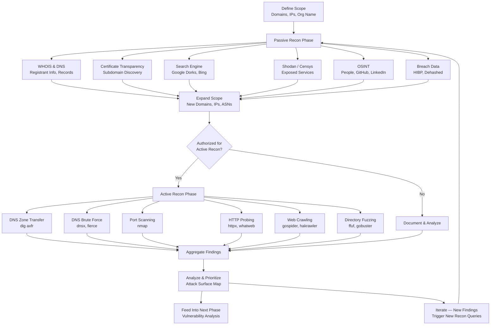

# Reconnaissance Overview

> **Difficulty:** Beginner → Advanced | **Category:** Penetration Testing

Reconnaissance is the foundational phase of every professional penetration test and real-world attack. Before a single exploit fires, a skilled attacker will spend the majority of their time mapping the target — understanding its infrastructure, technology stack, personnel, and digital footprint. The quality of your reconnaissance directly determines the quality of everything that follows. A poorly scoped recon phase means missed attack surfaces, wasted exploitation attempts, and incomplete reports. A thorough recon phase hands you the blueprint of the target before you ever knock on its door.

This document covers the recon mindset, the distinction between passive and active techniques, the overall workflow from target scope to actionable intelligence, and the full toolkit available to you at this phase.

---

## Table of Contents

1. [Why Reconnaissance Is the Most Important Phase](#why-reconnaissance)
2. [The Recon Mindset](#the-recon-mindset)
3. [Passive vs Active Reconnaissance](#passive-vs-active)
4. [What You Are Looking For](#what-you-are-looking-for)
5. [Recon Workflow](#recon-workflow)
6. [Recon as an Ongoing Process](#recon-as-an-ongoing-process)
7. [Tools Overview](#tools-overview)
8. [Scoping and Legal Considerations](#scoping-and-legal-considerations)
9. [Documentation Strategy](#documentation-strategy)

---

## Why Reconnaissance Is the Most Important Phase

**Reconnaissance** (often shortened to "recon") is the systematic process of collecting information about a target before attempting any form of interaction or exploitation. In military doctrine, reconnaissance is the intelligence-gathering operation that precedes any offensive action — the same principle applies in offensive security.

Consider the attack lifecycle. Every successful breach in history — from nation-state intrusions to bug bounty findings — began with information gathering. The attacker who finds the critical RCE on a forgotten subdomain found it because they enumerated subdomains thoroughly. The attacker who phished the CFO successfully did so because they researched the company's email format, found the CFO's name on LinkedIn, and studied their writing style on social media. Reconnaissance is the force multiplier.

### What Reconnaissance Reveals

- **Attack surface**: Every IP, domain, subdomain, and exposed service is a potential entry point.
- **Technology stack**: Knowing the web framework, CMS, server software, and libraries lets you target known CVEs.
- **Personnel and org structure**: Employees are targets for phishing, pretexting, and social engineering.
- **Credential exposure**: Leaked passwords, API keys, and tokens in public repositories or breach databases.
- **Misconfigurations**: Open S3 buckets, publicly exposed admin panels, unauthenticated APIs.
- **Historical data**: Old subdomains, decommissioned services, and forgotten assets.
- **Third-party relationships**: Vendors, partners, and service providers are potential pivot points.

> **Note:** On average, professional penetration testers spend 30–40% of their total engagement time on reconnaissance. In red team operations, this figure is even higher. Never rush recon.

---

## The Recon Mindset

### Be Thorough

**Completeness over speed.** A single missed subdomain can be the difference between finding a critical vulnerability and delivering a clean (and therefore misleading) report. Use multiple tools for every task — no single tool has perfect coverage. Validate findings across sources.

### Document Everything

From the moment you begin recon, document every finding, every query, every tool run. Use a structured note-taking system. At minimum, record:

- The date and time of each action
- The tool or technique used
- The exact command run
- The raw output
- Your interpretation of the finding

This discipline serves you in multiple ways: it prevents duplicating work, it builds the evidence base for your report, and it creates a defensible audit trail in case your activities are questioned.

### Think Like a Criminal, Work Like an Analyst

Aggressive curiosity combined with analytical rigor. Ask "what else could be here?" at every step. When you find a subdomain, enumerate its subdomains. When you find an employee, find their colleagues. When you find a technology, find its version and its known vulnerabilities. Every answer spawns new questions.

### Maintain OPSEC During Active Recon

When performing active recon (direct interaction with target systems), your traffic is potentially visible to the target's SOC, SIEM, and WAF. Use VPNs, proxy chains, or dedicated infrastructure. Avoid scanning from your personal IP. Pace your activity to avoid triggering rate limits and alerting.

---

## Passive vs Active Reconnaissance

The most fundamental distinction in reconnaissance methodology.

| Dimension | Passive Recon | Active Recon |
|---|---|---|
| **Target Interaction** | None — uses publicly available data | Direct — packets reach target systems |
| **Detectability** | Essentially undetectable | Leaves traces in logs, IDS alerts |
| **Legality (pre-auth)** | Generally legal for any target | Restricted — requires authorization |
| **Data freshness** | May be stale (cached/archived) | Real-time data from live systems |
| **Depth** | Limited to what is publicly exposed | Can reveal internal architecture |
| **Examples** | WHOIS, Shodan, Google Dorks, crt.sh | Port scanning, DNS zone transfer, banner grabbing |
| **Risk to operator** | Very low | Medium to high without authorization |

**Passive reconnaissance** never sends packets to the target. You query third-party databases, search engines, certificate logs, and public registries. The target has no way to detect this activity.

**Active reconnaissance** involves direct interaction with target systems — DNS queries, port scans, HTTP probes. This activity is logged. In an authorized penetration test, this is expected and sanctioned. Without authorization, active recon is illegal in most jurisdictions under computer fraud statutes.

> **Warning:** Never perform active reconnaissance against systems you do not have explicit written authorization to test. Even "just scanning" is illegal without authorization in the US (CFAA), UK (Computer Misuse Act), EU (Directive 2013/40/EU), and most other jurisdictions.

---

## What You Are Looking For

A comprehensive recon effort targets six categories of intelligence:

### 1. Infrastructure Intelligence
- IP address ranges and CIDR blocks
- Autonomous System Numbers (ASNs)
- Hostnames and subdomains
- CDN providers and reverse proxies
- Cloud providers (AWS, Azure, GCP) and their services
- Mail servers (MX records)
- Name servers (NS records)

### 2. Technology Intelligence
- Web server software and versions (Apache, Nginx, IIS)
- Application frameworks (Django, Laravel, Rails, Spring)
- CMS platforms (WordPress, Drupal, Joomla)
- JavaScript libraries and frontend frameworks
- Programming languages in use
- Database indicators (error messages, response headers)
- WAF/CDN detection (Cloudflare, Akamai, Imperva)

### 3. Personnel Intelligence
- Employee names, titles, and departments
- Email addresses and formats
- Phone numbers and office locations
- Social media profiles
- Executive team and key decision-makers
- IT and security staff (high-value targets)

### 4. Credential Intelligence
- Leaked password databases (HaveIBeenPwned, Dehashed)
- API keys and tokens in public code repositories
- Hardcoded credentials in public source code
- Old password reset tokens or session cookies in Wayback Machine

### 5. Code and Configuration Intelligence
- Public GitHub/GitLab repositories owned by the organization
- Forked repositories from former employees
- Configuration files accidentally committed (`.env`, `config.yml`, `settings.py`)
- Internal paths, endpoints, and API structures revealed in JavaScript

### 6. Business Intelligence
- Acquisitions and subsidiaries (new attack surface)
- Technology vendors and third-party integrations
- Job postings (reveal technology stack and internal processes)
- Press releases and announcements (reveal new infrastructure)
- Regulatory filings (SEC EDGAR for US public companies)

---

## Recon Workflow

The recon workflow is iterative, not linear. Each finding informs the next query. The diagram below shows the general flow:



### Phase 1: Scope Definition

Before any recon begins, you need a clearly defined scope. This comes from your **Rules of Engagement (RoE)** document:

```
Target Organization: Acme Corporation
In-Scope Domains:    acme.com, *.acme.com, acmecorp.net
In-Scope IPs:        203.0.113.0/24
Out-of-Scope:        mail.acme.com (live mail server - no disruption)
                     hr.acme.com (contains PII - hands off)
Start Date:          2024-01-15 09:00 UTC
End Date:            2024-01-29 17:00 UTC
```

### Phase 2: Seed Data Collection

With the scope defined, begin collecting **seed data** — the initial data points from which all further discovery branches. For a domain-based engagement:

```bash
# Collect WHOIS data
whois acme.com | tee whois-acme.txt

# Collect DNS records
dig acme.com ANY +noall +answer
dig acme.com NS +short
dig acme.com MX +short
dig acme.com TXT +short

# Find ASN for organization
whois -h whois.radb.net -- '-i origin AS15169' | grep route
```

### Phase 3: Expand Attack Surface

Using seed data, systematically expand your view of the attack surface. Each tool and technique below feeds new data back into the process:

```bash
# Subdomain discovery via certificate transparency
curl -s "https://crt.sh/?q=%25.acme.com&output=json" | \
  jq -r '.[].name_value' | sort -u | tee subdomains-crt.txt

# Subdomain brute force (active — requires authorization)
dnsx -d acme.com -w /usr/share/wordlists/SecLists/Discovery/DNS/subdomains-top1million-5000.txt \
  -a -aaaa -cname -mx -ns -txt -resp -o dnsx-results.txt

# Combine and deduplicate
cat subdomains-*.txt | sort -u > all-subdomains.txt
```

### Phase 4: Technology Fingerprinting

For every discovered host, fingerprint the technology stack:

```bash
# HTTP probing across all discovered subdomains
cat all-subdomains.txt | httpx -title -tech-detect -status-code -ip \
  -ports 80,443,8080,8443,8888 -o httpx-results.txt

# Detailed fingerprinting
whatweb -a 3 https://acme.com --log-json=whatweb-acme.json
```

### Phase 5: Intelligence Aggregation

Consolidate all findings into a structured format. A simple folder structure works well:

```
recon/
├── whois/
├── dns/
├── subdomains/
├── technologies/
├── personnel/
├── credentials/
├── screenshots/
└── notes.md
```

---

## Recon as an Ongoing Process

Reconnaissance does not end when exploitation begins. It is a **continuous activity** that runs throughout the engagement:

- **During exploitation**: A successful foothold reveals internal hostnames, IP ranges, and service accounts invisible from the outside.
- **During post-exploitation**: Internal network scanning, Active Directory enumeration, and credential harvesting are forms of reconnaissance against the internal environment.
- **After major findings**: A newly discovered subdomain or acquired company may require a full new recon cycle.

> **Note:** In long-running red team operations (weeks or months), the target's attack surface changes. New subdomains are spun up, services are deployed, and employees join or leave. Schedule periodic re-runs of your passive recon tooling to catch these changes.

---

## Tools Overview

### Passive Recon Tools

| Tool | Category | Description | URL |
|---|---|---|---|
| **whois** | Domain Intel | WHOIS registration data | Built-in / `apt install whois` |
| **dig** | DNS | DNS record queries | Built-in (bind-utils) |
| **nslookup** | DNS | DNS lookup utility | Built-in |
| **crt.sh** | Cert Transparency | Subdomain discovery via TLS certs | https://crt.sh |
| **Shodan** | Internet Scanner | Exposed service search engine | https://shodan.io |
| **Censys** | Internet Scanner | Host and certificate search | https://censys.io |
| **theHarvester** | OSINT | Emails, hosts, IPs from public sources | `apt install theharvester` |
| **Recon-ng** | OSINT Framework | Modular recon framework | `pip install recon-ng` |
| **SpiderFoot** | OSINT Automation | Automated OSINT collection | https://spiderfoot.net |
| **Maltego** | OSINT Visualization | Graph-based intelligence mapping | https://maltego.com |
| **OSINT Framework** | Reference | Curated OSINT tool directory | https://osintframework.com |
| **SecurityTrails** | DNS History | Historical DNS records | https://securitytrails.com |
| **VirusTotal** | Passive DNS | Subdomain and DNS intel | https://virustotal.com |
| **Wayback Machine** | Web Archive | Historical website content | https://web.archive.org |
| **Hunter.io** | Email Intel | Email format discovery | https://hunter.io |
| **HaveIBeenPwned** | Breach Data | Check for credential exposure | https://haveibeenpwned.com |

### Active Recon Tools

| Tool | Category | Description | Install |
|---|---|---|---|
| **nmap** | Port Scanner | The gold standard port scanner | `apt install nmap` |
| **masscan** | Port Scanner | Extremely fast port scanner | `apt install masscan` |
| **dnsx** | DNS Brute Force | Fast DNS toolkit | `go install github.com/projectdiscovery/dnsx/cmd/dnsx@latest` |
| **fierce** | DNS Recon | DNS recon and subdomain finder | `pip install fierce` |
| **dnsrecon** | DNS Recon | Comprehensive DNS recon | `apt install dnsrecon` |
| **httpx** | HTTP Probing | Fast HTTP toolkit | `go install github.com/projectdiscovery/httpx/cmd/httpx@latest` |
| **whatweb** | Tech Fingerprint | Web technology identifier | `apt install whatweb` |
| **wappalyzer** | Tech Fingerprint | Browser extension / CLI | https://wappalyzer.com |
| **gospider** | Web Crawler | Fast web spider | `go install github.com/jaeles-project/gospider@latest` |
| **hakrawler** | Web Crawler | Simple, fast web crawler | `go install github.com/hakluke/hakrawler@latest` |
| **ffuf** | Fuzzing | Web fuzzer (directory, parameter) | `go install github.com/ffuf/ffuf/v2@latest` |
| **gobuster** | Fuzzing | Directory/DNS/vhost brute force | `go install github.com/OJ/gobuster/v3@latest` |
| **netcat** | Banner Grab | Swiss-army knife for networking | `apt install netcat-openbsd` |
| **curl** | HTTP Inspection | Manual HTTP requests and headers | Built-in |

### Integrated / Automation Platforms

| Tool | Description | Install |
|---|---|---|
| **Amass** | Comprehensive attack surface mapping | `go install github.com/owasp-amass/amass/v4/...@master` |
| **subfinder** | Passive subdomain discovery | `go install github.com/projectdiscovery/subfinder/v2/cmd/subfinder@latest` |
| **nuclei** | Vulnerability scanner with templates | `go install github.com/projectdiscovery/nuclei/v3/cmd/nuclei@latest` |
| **reNgine** | Automated recon framework (web UI) | https://github.com/yogeshojha/rengine |
| **BBOT** | Scalable OSINT automation | `pip install bbot` |

---

## Scoping and Legal Considerations

Every recon engagement must be bounded by a formal **Rules of Engagement** document that specifies:

1. **Authorized targets**: Exact domains, IP ranges, and applications in scope
2. **Out-of-scope assets**: Explicitly excluded systems (shared infrastructure, third-party services)
3. **Authorized techniques**: Whether active recon is permitted, and to what degree
4. **Testing windows**: Time periods during which testing is authorized
5. **Emergency contacts**: Who to call if critical systems are accidentally impacted
6. **Data handling**: How to treat sensitive data discovered during recon (PII, credentials)

> **Warning:** "Bug bounty scope" is not the same as "penetration test scope." Bug bounty programs often allow passive recon against wildcard scopes but explicitly prohibit active scanning. Read the program policy before running any tool. Violating scope terms can result in legal action and permanent bans.

### The Gray Area: Third-Party Services

Many organizations use third-party SaaS platforms (Salesforce, HubSpot, Zendesk) as subdomains. For example, `support.acme.com` may resolve to a Zendesk instance. **Scanning the underlying Zendesk infrastructure is out of scope** — you have authorization for `acme.com`, not for Zendesk's servers. Identify CDN/proxy/third-party relationships before scanning.

```bash
# Identify if a subdomain is behind a third-party service
dig support.acme.com CNAME +short
# Returns: acme.zendesk.com — this is NOT your target to scan
```

---

## Documentation Strategy

Professional recon generates enormous volumes of data. Without discipline, you'll lose findings in a sea of terminal output.

### Recommended Folder Structure

```bash
mkdir -p recon/{passive,active}/{dns,web,people,creds,code}
mkdir -p recon/screenshots
mkdir -p recon/reports

# Create a session log
echo "=== Recon Session: $(date) ===" >> recon/session.log
```

### Automated Screenshot Collection

Visual documentation of discovered web services saves time during reporting:

```bash
# Take screenshots of all discovered HTTP services
cat httpx-results.txt | awk '{print $1}' | \
  gowitness scan file -f - --screenshot-path recon/screenshots/

# Or use aquatone
cat all-subdomains.txt | aquatone -out recon/aquatone/
```

### Structured Output with Markdown

Keep a running `notes.md` in each subdirectory with findings, observations, and next steps. Always include timestamps:

```markdown
## 2024-01-15 14:32 UTC — DNS Records for acme.com

Found 3 interesting TXT records:
- `v=spf1 include:sendgrid.net include:mailchimp.com ~all` → uses SendGrid + Mailchimp
- `google-site-verification=...` → has Google Workspace
- `atlassian-domain-verification=...` → uses Atlassian (Jira/Confluence)

**Next steps:** Check for Confluence public access, look for Jira issue trackers
```

### Tool Output Logging

Always save raw tool output alongside your notes. Use `tee` to simultaneously view and save:

```bash
# Log all tool output
subfinder -d acme.com -all -recursive | tee recon/passive/dns/subfinder-acme.txt

# Add timestamps to output files
theHarvester -d acme.com -b all 2>&1 | ts '[%Y-%m-%d %H:%M:%S]' | \
  tee recon/passive/people/harvester-acme.txt
```

---

## Quick-Start Recon Checklist

Use this checklist at the start of every engagement:

```
[ ] Rules of Engagement signed and scope confirmed
[ ] Recon folder structure created
[ ] WHOIS lookups (domain + IP ranges)
[ ] DNS record enumeration (A, MX, TXT, NS, CNAME, SOA)
[ ] Certificate Transparency subdomain search (crt.sh, censys)
[ ] Passive subdomain enumeration (subfinder, amass passive)
[ ] Shodan search for org name and IP ranges
[ ] Google Dorks for domain (site:, filetype:, inurl:)
[ ] GitHub search for org name and domain
[ ] LinkedIn employee enumeration
[ ] Job postings review (technology clues)
[ ] HaveIBeenPwned / Dehashed breach check
[ ] Wayback Machine review for old subdomains/content
[ ] BGP/ASN lookup for IP range discovery
[ ] theHarvester / BBOT full scan
--- Active (if authorized) ---
[ ] DNS zone transfer attempts
[ ] DNS brute force (dnsx / fierce)
[ ] Live host detection (nmap -sn)
[ ] HTTP probing (httpx)
[ ] Technology fingerprinting (whatweb)
[ ] Web crawling (gospider)
[ ] Screenshot collection (gowitness)
[ ] Attack surface map compiled
[ ] Findings documented and prioritized
```

---

*Next: [Passive Reconnaissance →](passive-recon.md)*
*See also: [Active Reconnaissance](active-recon.md) | [OSINT Deep Dive](osint.md)*
