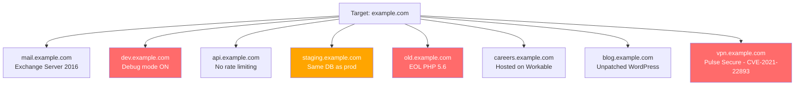
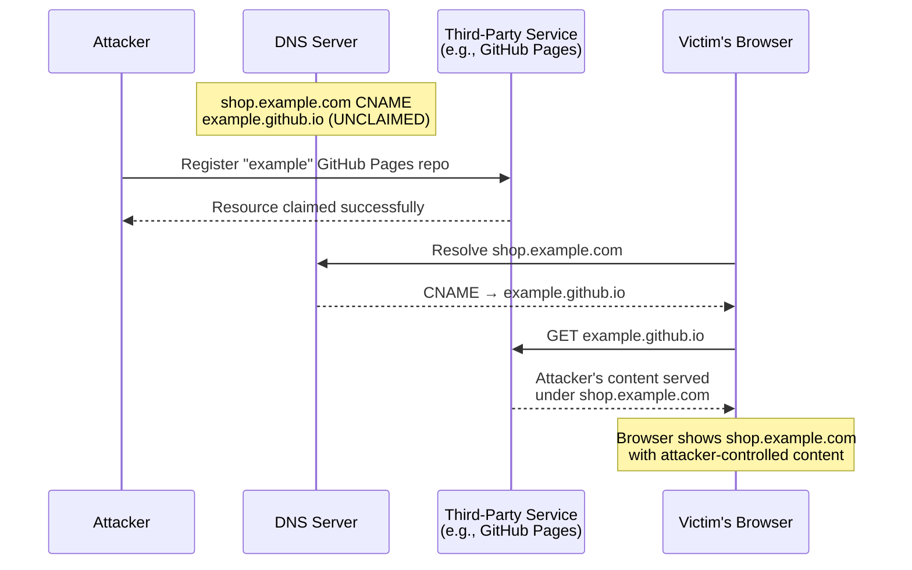
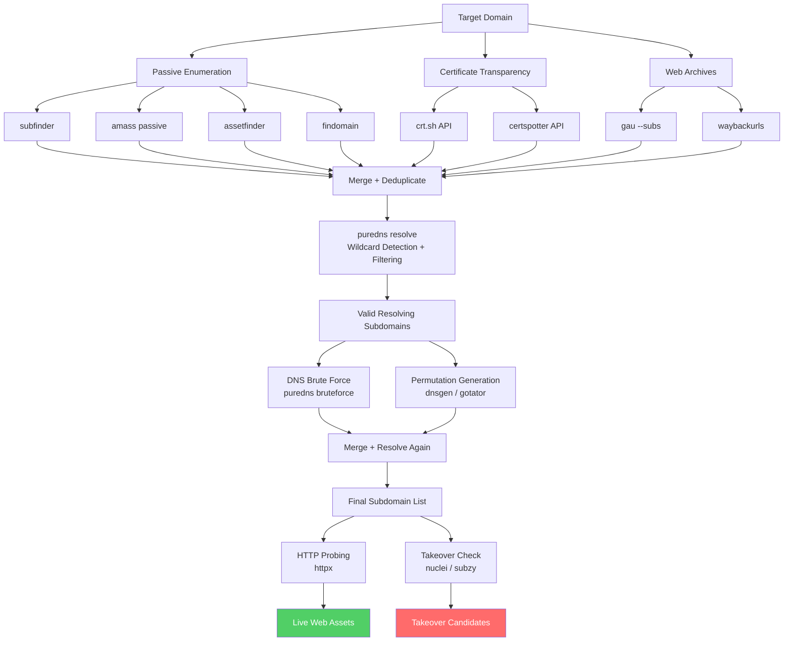

# Subdomain Enumeration

> **Difficulty:** Beginner → Advanced | **Category:** Penetration Testing

Subdomain enumeration is the process of discovering all subdomains belonging to a target domain. Every subdomain represents a potential entry point — a forgotten staging server, an unpatched API endpoint, a misconfigured admin panel, or an abandoned application still reachable from the internet. Thorough subdomain enumeration is the foundation of external attack surface mapping and is a prerequisite for virtually every bug bounty and penetration test engagement. This document covers every enumeration technique from passive OSINT collection through active DNS brute-forcing, wildcard detection, permutation attacks, and subdomain takeover exploitation.

---

## Table of Contents

1. [Why Subdomains Expand the Attack Surface](#why-subdomains-expand-the-attack-surface)
2. [Certificate Transparency Logs](#certificate-transparency-logs)
3. [Passive DNS Sources](#passive-dns-sources)
4. [DNS Brute Force Enumeration](#dns-brute-force-enumeration)
5. [Permutation and Alteration Attacks](#permutation-and-alteration-attacks)
6. [Web Archive Subdomain Scraping](#web-archive-subdomain-scraping)
7. [DNS Wildcard Detection and Handling](#dns-wildcard-detection-and-handling)
8. [Subdomain Takeover Vulnerabilities](#subdomain-takeover-vulnerabilities)
9. [Tool Comparison](#tool-comparison)
10. [Full Automation Workflow](#full-automation-workflow)

---

## Why Subdomains Expand the Attack Surface

A company's primary domain (`example.com`) may be hardened, patched, and monitored — but its **attack surface** extends far beyond the main site. Subdomains routinely host:

- **Development and staging environments** — often with debug modes enabled, weaker authentication, or direct database access
- **Forgotten legacy applications** — old product versions, acquired company infrastructure, or decommissioned services with DNS records never cleaned up
- **Third-party integrations** — marketing platforms, support portals, analytics dashboards, each with their own vulnerability profile
- **Internal services accidentally exposed** — admin panels, monitoring dashboards (Grafana, Kibana), CI/CD pipelines
- **API gateways** — `api.example.com`, `v2-api.example.com`, `internal-api.example.com`

Each subdomain may run on different infrastructure, different software versions, and be maintained by different teams with different security postures.



> **Note:** In bug bounty programs, subdomains of in-scope domains are typically in-scope unless explicitly excluded. Always confirm scope boundaries before testing.

---

## Certificate Transparency Logs

**Certificate Transparency (CT)** is a public logging framework (RFC 6962) that requires certificate authorities to log every TLS certificate they issue to publicly auditable logs. Because certificates are issued per domain/subdomain, these logs become a goldmine for passive subdomain discovery — every subdomain that has ever had a TLS certificate is permanently recorded.

### crt.sh

`crt.sh` is a web interface built on top of CT logs maintained by Sectigo. It supports wildcard queries.

```bash
# Query crt.sh via browser or API
curl -s "https://crt.sh/?q=%.example.com&output=json" | \
  jq -r '.[].name_value' | \
  sed 's/\*\.//g' | \
  sort -u

# Filter out wildcards, deduplicate, and save
curl -s "https://crt.sh/?q=%.example.com&output=json" | \
  jq -r '.[].name_value' | \
  grep -v '^\*' | \
  tr '[:upper:]' '[:lower:]' | \
  sort -u > ct_subdomains.txt

# One-liner with error handling
curl -s --retry 3 --retry-delay 2 \
  "https://crt.sh/?q=%.example.com&output=json" 2>/dev/null | \
  jq -r 'if type == "array" then .[].name_value else empty end' | \
  sed 's/\*\.//g' | sort -u
```

> **Note:** `crt.sh` may return `common_name` and `name_value` fields separately. The `name_value` field contains Subject Alternative Names (SANs), which often list multiple subdomains per certificate.

### certspotter

**certspotter** by SSLMate monitors CT logs in real-time and can also be used for one-off enumeration via their API.

```bash
# Install certspotter CLI
go install software.sslmate.com/src/certspotter/cmd/certspotter@latest

# Query certspotter API (free tier available)
curl -s "https://api.certspotter.com/v1/issuances?domain=example.com&include_subdomains=true&expand=dns_names" | \
  jq -r '.[].dns_names[]' | \
  sort -u

# With API key for higher rate limits
curl -s \
  -H "Authorization: Bearer YOUR_API_KEY" \
  "https://api.certspotter.com/v1/issuances?domain=example.com&include_subdomains=true&expand=dns_names" | \
  jq -r '.[].dns_names[]' | sort -u
```

### Parsing Multiple CT Sources

```bash
# Combine crt.sh + certspotter output
cat ct_subdomains.txt certspotter_subdomains.txt | sort -u > all_ct_subdomains.txt

# Verify which subdomains actually resolve
cat all_ct_subdomains.txt | dnsx -silent -a -resp > resolving_ct_subdomains.txt
```

---

## Passive DNS Sources

**Passive DNS** collection involves querying third-party databases that have historically observed DNS resolutions. These databases accumulate records over years of internet scanning, crawling, and traffic analysis — without generating any traffic toward the target.

### VirusTotal

VirusTotal's subdomain API aggregates data from multiple scanning engines.

```bash
# VirusTotal API v3 (requires free API key)
curl -s \
  --request GET \
  --url "https://www.virustotal.com/api/v3/domains/example.com/subdomains?limit=40" \
  --header "x-apikey: YOUR_VT_API_KEY" | \
  jq -r '.data[].id'

# Paginate through all results
VT_KEY="YOUR_VT_API_KEY"
DOMAIN="example.com"
CURSOR=""
while true; do
    URL="https://www.virustotal.com/api/v3/domains/${DOMAIN}/subdomains?limit=40"
    [[ -n "$CURSOR" ]] && URL="${URL}&cursor=${CURSOR}"
    RESPONSE=$(curl -s --request GET --url "$URL" --header "x-apikey: ${VT_KEY}")
    echo "$RESPONSE" | jq -r '.data[].id'
    CURSOR=$(echo "$RESPONSE" | jq -r '.meta.cursor // empty')
    [[ -z "$CURSOR" ]] && break
    sleep 1
done | sort -u > vt_subdomains.txt
```

### Shodan

**Shodan** indexes internet-connected devices and their certificates, making it an excellent passive subdomain source.

```bash
# Shodan CLI (pip install shodan)
shodan domain example.com

# Shodan API via curl
curl -s "https://api.shodan.io/dns/domain/example.com?key=YOUR_SHODAN_KEY" | \
  jq -r '.subdomains[]' | \
  awk '{print $1".example.com"}' | \
  sort -u

# Search Shodan for hosts belonging to domain
shodan search --fields ip_str,port,org "ssl.cert.subject.cn:example.com" | \
  awk '{print $1}' | sort -u
```

### SecurityTrails

**SecurityTrails** is one of the most comprehensive passive DNS databases available.

```bash
# SecurityTrails API
curl -s \
  --request GET \
  --url "https://api.securitytrails.com/v1/domain/example.com/subdomains?children_only=false&include_inactive=true" \
  --header "APIKEY: YOUR_ST_KEY" | \
  jq -r '.subdomains[]' | \
  awk '{print $1".example.com"}' | sort -u

# Historical DNS data
curl -s \
  --request GET \
  --url "https://api.securitytrails.com/v1/history/example.com/dns/a" \
  --header "APIKEY: YOUR_ST_KEY" | \
  jq -r '.records[].values[].ip'
```

### Additional Passive Sources

```bash
# HackerTarget
curl -s "https://api.hackertarget.com/hostsearch/?q=example.com" | \
  cut -d',' -f1 | sort -u

# RapidDNS
curl -s "https://rapiddns.io/subdomain/example.com?full=1" | \
  grep -oP '(?<=<td>)[a-zA-Z0-9._-]+\.example\.com(?=</td>)' | \
  sort -u

# AlienVault OTX
curl -s "https://otx.alienvault.com/api/v1/indicators/domain/example.com/passive_dns" | \
  jq -r '.passive_dns[].hostname' | sort -u

# URLScan.io
curl -s "https://urlscan.io/api/v1/search/?q=domain:example.com&size=10000" | \
  jq -r '.results[].page.domain' | sort -u
```

---

## DNS Brute Force Enumeration

**DNS brute force** involves systematically querying DNS servers for subdomains by iterating over a wordlist. Unlike passive methods, this generates DNS queries that could appear in DNS server logs. Use responsible resolvers and rate-limit appropriately.

### Wordlists

Quality wordlists are critical. Use domain-specific lists when possible.

```bash
# Install SecLists (comprehensive wordlist collection)
git clone https://github.com/danielmiessler/SecLists.git /opt/SecLists

# Best subdomain wordlists (ordered by quality/coverage)
ls /opt/SecLists/Discovery/DNS/
# - dns-Jhaddix.txt          (~1.8M entries, curated)
# - bitquark-subdomains-top100000.txt
# - subdomains-top1million-110000.txt
# - deepmagic.com-prefixes-top50000.txt
# - namelist.txt (assetnote.io)

# Download Assetnote wordlists (best available)
wget https://wordlists-cdn.assetnote.io/data/manual/best-dns-wordlist.txt
wget https://wordlists-cdn.assetnote.io/data/automated/httparchive_subdomains_2024_01_28.txt
```

### dnsx — Fast DNS Resolution

**dnsx** is a fast and reliable DNS toolkit designed for mass resolution.

```bash
# Install dnsx
go install -v github.com/projectdiscovery/dnsx/cmd/dnsx@latest

# Basic brute force with wordlist
dnsx -d example.com \
     -w /opt/SecLists/Discovery/DNS/subdomains-top1million-110000.txt \
     -t 50 \
     -silent \
     -a \
     -resp \
     -o dnsx_results.txt

# Resolve a list of subdomains (output from passive tools)
cat passive_subdomains.txt | dnsx -silent -a -resp -o resolved.txt

# Query specific record types
dnsx -d example.com -w wordlist.txt -a -aaaa -cname -mx -txt -silent

# Use custom resolvers (important for accurate results)
dnsx -d example.com \
     -w wordlist.txt \
     -r /opt/resolvers/public-resolvers.txt \
     -rl 500 \
     -silent

# Extract only IP addresses from results
cat resolved.txt | grep -oP '\[[\d.]+\]' | tr -d '[]' | sort -u
```

### subfinder — Passive + Active Aggregator

**subfinder** is a subdomain discovery tool that queries over 40 passive sources simultaneously.

```bash
# Install subfinder
go install -v github.com/projectdiscovery/subfinder/v2/cmd/subfinder@latest

# Configure API keys (~/.config/subfinder/provider-config.yaml)
cat > ~/.config/subfinder/provider-config.yaml << 'EOF'
virustotal:
  - YOUR_VT_KEY
shodan:
  - YOUR_SHODAN_KEY
securitytrails:
  - YOUR_ST_KEY
certspotter:
  - YOUR_CERTSPOTTER_KEY
passivetotal:
  - YOUR_PT_KEY:YOUR_PT_USER
binaryedge:
  - YOUR_BE_KEY
EOF

# Basic enumeration
subfinder -d example.com -o subfinder_results.txt

# Verbose output with source attribution
subfinder -d example.com -v -o subfinder_results.txt

# Multiple domains
subfinder -dL domains.txt -o all_subdomains.txt

# Silent output for piping
subfinder -d example.com -silent | dnsx -silent -a -resp

# With all sources enabled (slower but more complete)
subfinder -d example.com -all -o subfinder_all.txt

# Recursive enumeration (find subdomains of subdomains)
subfinder -d example.com -recursive -o recursive_results.txt
```

### amass — Deep Enumeration

**amass** is the most comprehensive subdomain enumeration tool, combining passive sources, active DNS brute force, and advanced graph analysis. It is slower but more thorough than subfinder.

```bash
# Install amass
go install -v github.com/owasp-amass/amass/v4/...@master

# Configure API keys (~/.config/amass/datasources.yaml)
cat > ~/.config/amass/datasources.yaml << 'EOF'
datasources:
  - name: VirusTotal
    creds:
      - apikey: YOUR_VT_KEY
  - name: Shodan
    creds:
      - apikey: YOUR_SHODAN_KEY
  - name: SecurityTrails
    creds:
      - apikey: YOUR_ST_KEY
  - name: Censys
    creds:
      - apikey: YOUR_CENSYS_ID
      - secret: YOUR_CENSYS_SECRET
EOF

# Passive enumeration only (no DNS brute force)
amass enum -passive -d example.com -o amass_passive.txt

# Active enumeration with brute force
amass enum -active -d example.com \
           -brute \
           -w /opt/SecLists/Discovery/DNS/subdomains-top1million-110000.txt \
           -o amass_active.txt

# Full enumeration with database storage
amass enum -d example.com \
           -active \
           -brute \
           -w /opt/SecLists/Discovery/DNS/dns-Jhaddix.txt \
           -dir /opt/amass/example.com \
           -o amass_full.txt

# Visualize the results as a graph
amass viz -d3 -dir /opt/amass/example.com -o amass_graph.html

# Database queries post-enumeration
amass db -dir /opt/amass/example.com -d example.com -show
amass db -dir /opt/amass/example.com -names -d example.com
```

> **Warning:** Full amass active enumeration can take hours for large targets and generates significant DNS traffic. Always ensure you have written authorization before running active enumeration.

---

## Permutation and Alteration Attacks

**Permutation-based enumeration** takes known valid subdomains and generates variations by altering prefixes, adding numbers, swapping words, and inserting common infixes. This technique discovers subdomains that wordlists miss because they follow organization-specific naming patterns.

### altdns — DNS Alteration Scanner

```bash
# Install altdns
pip install py-altdns
# or
git clone https://github.com/infosec-au/altdns.git && cd altdns && pip install -r requirements.txt

# Generate permutations and resolve them
# Input: known subdomains; Words: common alterations
altdns -i known_subdomains.txt \
       -o permutations_output.txt \
       -w /opt/SecLists/Discovery/DNS/dns-Jhaddix.txt \
       -r \
       -s resolved_permutations.txt

# altdns wordlist example (common infixes)
cat > altdns_words.txt << 'EOF'
dev
development
staging
stage
stg
prod
production
test
testing
qa
uat
api
internal
admin
manage
management
corp
vpn
mail
smtp
pop
imap
ftp
sftp
ssh
git
gitlab
jenkins
jira
confluence
grafana
kibana
prometheus
EOF
```

### dnsgen — Wordlist-Based Permutation Generator

**dnsgen** is faster than altdns for pure permutation generation and works well when piped into a resolver.

```bash
# Install dnsgen
pip3 install dnsgen

# Generate permutations from known subdomains
cat known_subdomains.txt | dnsgen - | dnsx -silent -a > permutation_results.txt

# With custom wordlist
cat known_subdomains.txt | dnsgen -w custom_words.txt - | \
  dnsx -silent -a -resp | sort -u

# Large-scale permutation pipeline
subfinder -d example.com -silent | \
  dnsgen - | \
  dnsx -silent -a -resp -o permutation_resolved.txt

# Check permutation count before resolving (can be millions)
cat known_subdomains.txt | dnsgen - | wc -l
```

### gotator — Advanced Permutation

```bash
# Install gotator
go install github.com/Josue87/gotator@latest

# Generate permutations
gotator -sub known_subdomains.txt \
        -perm /opt/SecLists/Discovery/DNS/dns-Jhaddix.txt \
        -depth 1 \
        -numbers 3 \
        -mindup \
        -adv \
        -md | \
  dnsx -silent -a -resp > gotator_results.txt
```

---

## Web Archive Subdomain Scraping

The **Wayback Machine** and web crawlers like CommonCrawl have archived URLs for billions of pages. These archives contain subdomains that may no longer appear in active DNS but still resolve — or may have been recently re-registered (a takeover scenario).

```bash
# Query Wayback CDX API for subdomains
curl -s "http://web.archive.org/cdx/search/cdx?url=*.example.com/*&output=text&fl=original&collapse=urlkey" | \
  grep -oP '(?<=://)[^/]+' | \
  sort -u > wayback_subdomains.txt

# CommonCrawl index
curl -s "http://index.commoncrawl.org/CC-MAIN-2024-10-index?url=*.example.com&output=json" | \
  jq -r '.url' | \
  grep -oP '(?<=://)[^/]+' | \
  sort -u

# gau (Get All URLs) - combines multiple web archive sources
go install github.com/lc/gau/v2/cmd/gau@latest

gau --subs example.com | \
  grep -oP '(?<=://)[^/]+' | \
  grep '\.example\.com$' | \
  sort -u

# waybackurls
go install github.com/tomnomnom/waybackurls@latest
echo "example.com" | waybackurls | \
  grep -oP '(?<=://)[^/]+\.example\.com' | \
  sort -u

# Combine all archive sources
{
  curl -s "http://web.archive.org/cdx/search/cdx?url=*.example.com&output=text&fl=original&collapse=urlkey" | \
    grep -oP '(?<=://)[^/]+\.example\.com'
  gau --subs example.com 2>/dev/null | grep -oP '(?<=://)[^/]+\.example\.com'
} | sort -u > archive_subdomains.txt
```

---

## DNS Wildcard Detection and Handling

A **DNS wildcard** (`*.example.com`) causes all subdomains — including non-existent ones — to resolve to a specific IP. This invalidates brute-force results: every subdomain in your wordlist will appear to "exist". Wildcard detection is critical before trusting DNS brute-force output.

### Detection

```bash
# Test for wildcard: query a clearly random subdomain
dig this-subdomain-definitely-does-not-exist-$(openssl rand -hex 8).example.com A

# If it resolves, there's a wildcard
# Check what IP it resolves to
WILDCARD_IP=$(dig +short random-$(date +%s)-nxdomain.example.com A 2>/dev/null | head -1)

if [[ -n "$WILDCARD_IP" ]]; then
    echo "[!] Wildcard detected: *.example.com -> $WILDCARD_IP"
else
    echo "[+] No wildcard detected"
fi

# dnsx wildcard detection
dnsx -d example.com -w /opt/SecLists/Discovery/DNS/subdomains-top1million-110000.txt \
     -silent -resp -wd example.com
# The -wd flag enables automatic wildcard filtering
```

### Handling Wildcards

```bash
# massdns with wildcard filtering
# First, establish the wildcard response
WILDCARD=$(dig +short "randomtest$(date +%s).example.com" | head -1)
echo "Wildcard IP: $WILDCARD"

# Filter results that match the wildcard IP
cat dnsx_results.txt | grep -v "$WILDCARD" > filtered_results.txt

# puredns - resolves and filters wildcards automatically
go install github.com/d3mondev/puredns/v2@latest

# Download a reliable public resolvers list
curl -s https://raw.githubusercontent.com/trickest/resolvers/main/resolvers.txt \
  -o /opt/resolvers.txt

puredns bruteforce /opt/SecLists/Discovery/DNS/subdomains-top1million-110000.txt example.com \
  --resolvers /opt/resolvers.txt \
  --wildcard-tests 5 \
  --wildcard-batch 1000000 \
  -w puredns_results.txt

# puredns resolve (from existing subdomain list)
puredns resolve passive_subdomains.txt \
  --resolvers /opt/resolvers.txt \
  -w puredns_resolved.txt
```

> **Warning:** Wildcard domains will cause massive false positive rates in DNS brute-force tools that don't handle wildcards. Always verify with `puredns` or manual checks before reporting findings.

---

## Subdomain Takeover Vulnerabilities

**Subdomain takeover** occurs when a DNS record (usually CNAME) points to a third-party service that no longer has the corresponding account/resource provisioned. An attacker can register the resource on the third-party platform and gain control of the subdomain — serving content under the target's domain.

### How It Works



### Common Takeover Fingerprints

| Service | Vulnerable Response | CNAME Pattern |
|---|---|---|
| GitHub Pages | `There isn't a GitHub Pages site here` | `*.github.io` |
| Heroku | `No such app` | `*.herokudns.com` |
| Shopify | `Sorry, this shop is currently unavailable` | `*.myshopify.com` |
| Fastly | `Fastly error: unknown domain` | `*.fastly.net` |
| Amazon S3 | `NoSuchBucket` | `*.s3.amazonaws.com` |
| Azure | `404 Web Site not found` | `*.azurewebsites.net` |
| Zendesk | `Help Center Closed` | `*.zendesk.com` |
| HubSpot | `Domain not configured` | `*.hubspot.net` |
| Tumblr | `There's nothing here` | `*.tumblr.com` |
| WordPress.com | `Do you want to register` | `*.wordpress.com` |
| Pantheon | `404 error unknown site` | `*.pantheonsite.io` |
| Ghost | `The thing you were looking for is no longer here` | `*.ghost.io` |
| Cargo | `404 Not Found` | `*.cargocollective.com` |
| Surge.sh | `project not found` | `*.surge.sh` |

### Finding Takeover Candidates

```bash
# subjack - fast subdomain takeover scanner
go install github.com/haccer/subjack@latest

subjack -w all_subdomains.txt \
        -t 100 \
        -timeout 30 \
        -o takeover_candidates.txt \
        -ssl \
        -v

# subzy - comprehensive takeover checker
go install -v github.com/LukaSikic/subzy@latest

subzy run --targets all_subdomains.txt \
          --concurrency 50 \
          --hide_fails \
          --output takeover_results.json

# nuclei - takeover templates
nuclei -l all_subdomains.txt \
       -t /opt/nuclei-templates/http/takeovers/ \
       -o nuclei_takeovers.txt

# Manual CNAME check for dangling records
while read subdomain; do
    CNAME=$(dig +short CNAME "$subdomain" 2>/dev/null)
    if [[ -n "$CNAME" ]]; then
        # Check if CNAME resolves
        RESOLVES=$(dig +short A "$CNAME" 2>/dev/null)
        if [[ -z "$RESOLVES" ]]; then
            echo "[DANGLING] $subdomain -> $CNAME"
        fi
    fi
done < all_subdomains.txt
```

### Exploiting a GitHub Pages Takeover

```bash
# 1. Confirm the dangling CNAME
dig shop.example.com CNAME
# Returns: shop.example.com. 300 IN CNAME victimorg.github.io.

# 2. Confirm victimorg.github.io doesn't exist
curl -s https://victimorg.github.io | grep "There isn't a GitHub Pages"
# Confirm: vulnerable

# 3. Create GitHub repository named "victimorg.github.io" (if org is unclaimed)
# OR create repo and configure custom domain

# 4. Add CNAME file to repository
echo "shop.example.com" > CNAME
git add CNAME && git commit -m "poc"
git push

# 5. Verify takeover
curl -s https://shop.example.com
# Your content is now served under shop.example.com
```

> **Warning:** Only exploit subdomain takeovers during authorized penetration tests or bug bounty programs that explicitly allow it. Unauthorized takeovers — even benign PoC — may constitute unauthorized access.

---

## Tool Comparison

| Feature | subfinder | amass | assetfinder | findomain |
|---|---|---|---|---|
| **Language** | Go | Go | Go | Rust |
| **Speed** | Fast | Slow | Very Fast | Fast |
| **Passive Sources** | 40+ | 55+ | ~12 | 18+ |
| **Active DNS Brute Force** | No | Yes | No | No |
| **Recursive Enumeration** | Yes | Yes | No | No |
| **Graph Database** | No | Yes | No | No |
| **API Key Support** | Yes (many) | Yes (many) | Limited | Yes |
| **Output Formats** | txt, json | txt, json, gexf | txt | txt, csv, json |
| **Wildcard Handling** | Basic | Advanced | None | Basic |
| **Best For** | Quick passive | Deep OSINT | Speed | Monitoring |
| **Memory Usage** | Low | High | Very Low | Low |
| **Install** | `go install` | `go install` | `go install` | `cargo install` / binary |

```bash
# assetfinder
go install github.com/tomnomnom/assetfinder@latest
assetfinder --subs-only example.com > assetfinder_results.txt

# findomain
curl -LO https://github.com/Findomain/Findomain/releases/latest/download/findomain-linux-i386.zip
unzip findomain-linux-i386.zip && chmod +x findomain
./findomain -t example.com -u findomain_results.txt

# Running all four in parallel
{
  subfinder -d example.com -silent
  amass enum -passive -d example.com -norecursive -silent
  assetfinder --subs-only example.com
  findomain -t example.com -q
} | sort -u > combined_passive.txt
```

---

## Full Automation Workflow

This workflow combines all techniques into a single pipeline suitable for bug bounty recon or penetration test kickoff.



### Complete Automation Script

```bash
#!/usr/bin/env bash
# subdomain_enum.sh - Comprehensive subdomain enumeration
# Usage: ./subdomain_enum.sh example.com

set -euo pipefail

DOMAIN="${1:?Usage: $0 <domain>}"
OUTDIR="recon/${DOMAIN}"
TIMESTAMP=$(date +%Y%m%d_%H%M%S)

# Color output
RED='\033[0;31m'
GREEN='\033[0;32m'
YELLOW='\033[1;33m'
NC='\033[0m'

mkdir -p "${OUTDIR}"/{passive,active,permutation,resolved,final}

echo -e "${GREEN}[*] Starting subdomain enumeration for ${DOMAIN}${NC}"

# --- PHASE 1: Passive Enumeration ---
echo -e "${YELLOW}[*] Phase 1: Passive enumeration${NC}"

# subfinder
subfinder -d "$DOMAIN" -all -silent \
  -o "${OUTDIR}/passive/subfinder.txt" 2>/dev/null || true

# amass passive
amass enum -passive -d "$DOMAIN" -norecursive -silent \
  -o "${OUTDIR}/passive/amass.txt" 2>/dev/null || true

# assetfinder
assetfinder --subs-only "$DOMAIN" \
  > "${OUTDIR}/passive/assetfinder.txt" 2>/dev/null || true

# Certificate transparency
curl -s "https://crt.sh/?q=%.${DOMAIN}&output=json" | \
  jq -r '.[].name_value' 2>/dev/null | \
  sed 's/\*\.//g' | \
  grep "\.${DOMAIN}$" | \
  sort -u > "${OUTDIR}/passive/crt_sh.txt" || true

# Web archives
gau --subs "$DOMAIN" 2>/dev/null | \
  grep -oP "(?<=://)[^/]+\.${DOMAIN}" | \
  sort -u > "${OUTDIR}/passive/gau.txt" || true

# Merge passive results
cat "${OUTDIR}/passive/"*.txt | \
  grep "\.${DOMAIN}$" | \
  sed 's/\*\.//g' | \
  tr '[:upper:]' '[:lower:]' | \
  sort -u > "${OUTDIR}/passive/all_passive.txt"

PASSIVE_COUNT=$(wc -l < "${OUTDIR}/passive/all_passive.txt")
echo -e "${GREEN}[+] Passive: ${PASSIVE_COUNT} unique subdomains${NC}"

# --- PHASE 2: DNS Resolution + Wildcard Filtering ---
echo -e "${YELLOW}[*] Phase 2: Resolving passive results${NC}"

puredns resolve "${OUTDIR}/passive/all_passive.txt" \
  --resolvers /opt/resolvers.txt \
  --wildcard-tests 5 \
  -w "${OUTDIR}/resolved/passive_resolved.txt" 2>/dev/null || \
  dnsx -l "${OUTDIR}/passive/all_passive.txt" -silent -a \
    -o "${OUTDIR}/resolved/passive_resolved.txt"

# --- PHASE 3: DNS Brute Force ---
echo -e "${YELLOW}[*] Phase 3: DNS brute force${NC}"

puredns bruteforce /opt/SecLists/Discovery/DNS/subdomains-top1million-110000.txt \
  "$DOMAIN" \
  --resolvers /opt/resolvers.txt \
  --wildcard-tests 5 \
  -w "${OUTDIR}/active/bruteforce.txt" 2>/dev/null || true

# --- PHASE 4: Permutation ---
echo -e "${YELLOW}[*] Phase 4: Permutation attacks${NC}"

# Generate and resolve permutations
cat "${OUTDIR}/resolved/passive_resolved.txt" | \
  dnsgen - 2>/dev/null | \
  puredns resolve - \
    --resolvers /opt/resolvers.txt \
    -w "${OUTDIR}/permutation/dnsgen_resolved.txt" 2>/dev/null || true

# --- PHASE 5: Final Merge ---
echo -e "${YELLOW}[*] Phase 5: Building final list${NC}"

cat "${OUTDIR}/resolved/passive_resolved.txt" \
    "${OUTDIR}/active/bruteforce.txt" \
    "${OUTDIR}/permutation/dnsgen_resolved.txt" 2>/dev/null | \
  grep "\.${DOMAIN}$" | \
  sort -u > "${OUTDIR}/final/all_subdomains.txt"

FINAL_COUNT=$(wc -l < "${OUTDIR}/final/all_subdomains.txt")
echo -e "${GREEN}[+] Final unique resolving subdomains: ${FINAL_COUNT}${NC}"

# --- PHASE 6: HTTP Probing ---
echo -e "${YELLOW}[*] Phase 6: HTTP probing${NC}"

httpx -l "${OUTDIR}/final/all_subdomains.txt" \
      -silent \
      -title \
      -status-code \
      -tech-detect \
      -follow-redirects \
      -threads 50 \
      -o "${OUTDIR}/final/live_hosts.txt" 2>/dev/null || true

# --- PHASE 7: Takeover Check ---
echo -e "${YELLOW}[*] Phase 7: Subdomain takeover check${NC}"

subzy run --targets "${OUTDIR}/final/all_subdomains.txt" \
          --concurrency 50 \
          --hide_fails \
          --output "${OUTDIR}/final/takeover_candidates.json" 2>/dev/null || true

nuclei -l "${OUTDIR}/final/all_subdomains.txt" \
       -t /opt/nuclei-templates/http/takeovers/ \
       -silent \
       -o "${OUTDIR}/final/nuclei_takeovers.txt" 2>/dev/null || true

# --- Summary ---
echo ""
echo -e "${GREEN}=== Enumeration Complete ===${NC}"
echo -e "Domain:           ${DOMAIN}"
echo -e "Passive found:    ${PASSIVE_COUNT}"
echo -e "Final resolved:   ${FINAL_COUNT}"
echo -e "Live HTTP hosts:  $(wc -l < "${OUTDIR}/final/live_hosts.txt" 2>/dev/null || echo 0)"
echo -e "Output:           ${OUTDIR}/final/"
```

### Quick Passive-Only One-Liner

```bash
# For rapid results during initial recon
TARGET="example.com" && \
  { subfinder -d $TARGET -silent; \
    assetfinder --subs-only $TARGET; \
    curl -s "https://crt.sh/?q=%.$TARGET&output=json" | jq -r '.[].name_value' | sed 's/\*\.//g'; \
  } | grep "\.$TARGET$" | sort -u | \
  dnsx -silent -a -resp | \
  tee "${TARGET}_quick_recon.txt" | \
  httpx -silent -title -status-code
```

### Resolver Management

Using reliable, fast DNS resolvers is critical for accurate results.

```bash
# Download fresh public resolvers
curl -s https://raw.githubusercontent.com/trickest/resolvers/main/resolvers.txt \
  -o /opt/resolvers.txt

# Validate resolvers with dnsvalidator
go install github.com/vortexau/dnsvalidator@latest
dnsvalidator -tL https://public-dns.info/nameservers.txt \
             -threads 200 \
             -o /opt/valid_resolvers.txt

# Check resolver count
wc -l /opt/valid_resolvers.txt
```

---

## Summary Reference Card

| Technique | Tool | Noise Level | Completeness |
|---|---|---|---|
| Certificate Transparency | crt.sh, certspotter | None | High |
| Passive DNS | subfinder, amass passive | None | High |
| DNS Brute Force | puredns, dnsx | Low | Medium |
| Permutation | dnsgen, gotator | Low | Medium |
| Web Archives | gau, waybackurls | None | Medium |
| Wildcard Filter | puredns | None | Required |
| Takeover Check | subzy, nuclei | Low | Critical |

> **Note:** Always combine passive and active techniques. Passive sources will miss subdomains that were never publicly visible (internal, newly created), while brute force will miss uniquely named subdomains not in wordlists. The combination of all techniques provides the most complete coverage.
