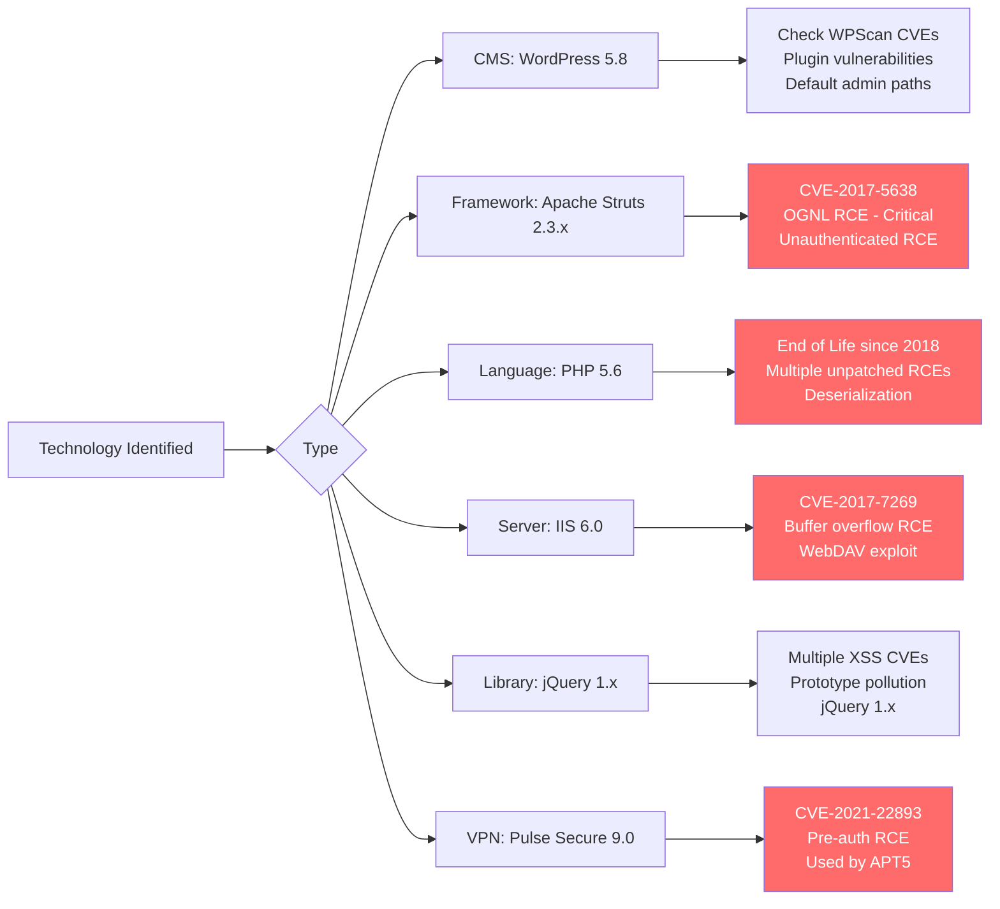
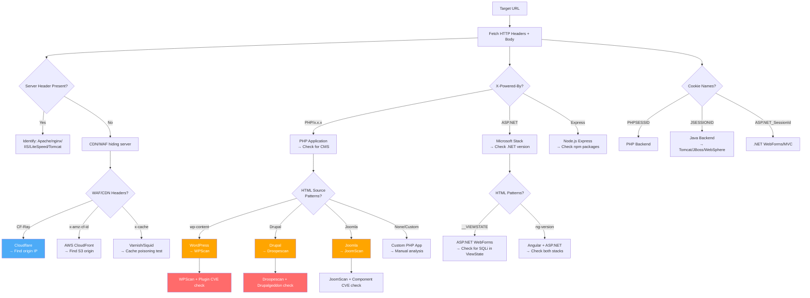

# Technology Fingerprinting

> **Difficulty:** Beginner → Advanced | **Category:** Penetration Testing

**Technology fingerprinting** — also called **stack identification** or **tech detection** — is the process of determining what software, frameworks, libraries, servers, and infrastructure a target uses. Every technology in the stack has a known vulnerability profile: outdated versions, CVEs, default credentials, known misconfigurations, and bypass techniques. A target running WordPress 5.8 leads directly to a CVE lookup. A target identified as running Apache Struts 2 prompts an immediate check for CVE-2017-5638 (the Equifax breach vulnerability). ASP.NET errors reveal the exact framework version. Identifying the full technology stack is the bridge between reconnaissance and exploitation. This document covers every fingerprinting technique: HTTP headers, cookie analysis, HTML inspection, JavaScript framework detection, favicon hashing, WAF identification, CDN detection, and CMS fingerprinting.

---

## Table of Contents

1. [Why Technology Fingerprinting Matters](#why-technology-fingerprinting-matters)
2. [HTTP Header Analysis](#http-header-analysis)
3. [HTML Source Analysis](#html-source-analysis)
4. [Cookie Name Analysis](#cookie-name-analysis)
5. [JavaScript Framework Detection](#javascript-framework-detection)
6. [Error Message Analysis](#error-message-analysis)
7. [Favicon Hashing](#favicon-hashing)
8. [Automated Fingerprinting Tools](#automated-fingerprinting-tools)
9. [Port and Service Fingerprinting](#port-and-service-fingerprinting)
10. [WAF Detection](#waf-detection)
11. [CDN Detection](#cdn-detection)
12. [CMS Fingerprinting](#cms-fingerprinting)
13. [Fingerprinting Decision Tree](#fingerprinting-decision-tree)

---

## Why Technology Fingerprinting Matters

Each identified technology narrows the attack surface to a known set of vulnerabilities. The return on investment from thorough fingerprinting is enormous.



> **Note:** Technology fingerprinting should be performed before any exploitation phase. Even a single version number can reduce hundreds of potential exploits to the 2-3 that are actually applicable.

---

## HTTP Header Analysis

HTTP response headers are the richest source of technology fingerprinting data. Many servers and frameworks inadvertently (or explicitly) announce themselves in headers.

### Collecting Headers

```bash
# curl - most flexible, shows all headers
curl -sI https://example.com

# Full response with body (useful for extracting additional clues)
curl -sv https://example.com 2>&1 | grep -E "^[<>]"

# Follow redirects and show headers at each hop
curl -sIL https://example.com

# Custom User-Agent (bypass basic bot detection)
curl -sI https://example.com \
  -H "User-Agent: Mozilla/5.0 (Windows NT 10.0; Win64; x64) AppleWebKit/537.36"

# Extract specific headers
curl -sI https://example.com | grep -iE "server|x-powered-by|x-generator|via|x-aspnet"

# Compare headers with and without authentication
curl -sI https://example.com/admin
curl -sI https://example.com/admin -H "Cookie: session=YOURTOKEN"

# HEAD vs GET (some servers respond differently)
curl -sI https://example.com      # HEAD request
curl -sv https://example.com -o /dev/null 2>&1 | grep "^< "  # GET request headers
```

### Key Headers and What They Reveal

```bash
# Server header - web server identity and version
curl -sI https://example.com | grep -i "^Server:"
# Examples:
# Server: Apache/2.4.41 (Ubuntu)     → Apache 2.4.41 on Ubuntu
# Server: nginx/1.14.0 (Ubuntu)      → nginx 1.14.0 on Ubuntu
# Server: Microsoft-IIS/10.0         → IIS 10.0 (Windows Server 2016/2019)
# Server: LiteSpeed                  → LiteSpeed web server
# Server: openresty                  → OpenResty (nginx + Lua)
# Server: cloudflare                 → Behind Cloudflare CDN
# Server: AmazonS3                   → Amazon S3 bucket
# Server: gws                        → Google Web Server
# Server: Cowboy                     → Elixir/Erlang Cowboy HTTP server
# Server: Jetty(9.4.z-SNAPSHOT)      → Java Jetty
# Server: Apache Tomcat/9.0.45       → Apache Tomcat
# Server: WildFly/16                 → JBoss WildFly (Java EE)

# X-Powered-By header - application framework
curl -sI https://example.com | grep -i "x-powered-by"
# Examples:
# X-Powered-By: PHP/7.4.3            → PHP 7.4.3
# X-Powered-By: PHP/5.6.40           → Old PHP! EOL since 2018
# X-Powered-By: ASP.NET              → Microsoft ASP.NET (version not specified)
# X-Powered-By: Express              → Node.js Express framework
# X-Powered-By: Servlet/3.1          → Java Servlet (likely Tomcat/JBoss)
# X-Powered-By: Next.js              → Next.js (React SSR)
# X-Powered-By: PleskLin             → Plesk hosting panel (Linux)
# X-Powered-By: ARR/3.0+url-rewrite  → Azure Application Request Routing

# X-AspNet-Version
curl -sI https://example.com | grep -i "x-aspnet-version"
# X-AspNet-Version: 4.0.30319        → .NET Framework 4.x
# X-AspNet-Version: 2.0.50727        → .NET Framework 2.0 (very old)

# X-AspNetMvc-Version
curl -sI https://example.com | grep -i "x-aspnetmvc"
# X-AspNetMvc-Version: 5.2           → ASP.NET MVC 5.2

# X-Generator
curl -sI https://example.com | grep -i "x-generator"
# X-Generator: Drupal 8 (https://www.drupal.org)
# X-Generator: TYPO3 CMS

# Via header (proxy/CDN presence)
curl -sI https://example.com | grep -i "^via:"
# Via: 1.1 varnish                   → Varnish cache
# Via: 1.1 vegur                     → Heroku proxy

# X-Varnish
curl -sI https://example.com | grep -i "x-varnish"
# → Varnish cache server in use

# CF-RAY (Cloudflare)
curl -sI https://example.com | grep -i "cf-ray"
# CF-RAY: 7abc123def456789-IAD       → Cloudflare CDN confirmed

# X-Cache (CDN/caching layer)
curl -sI https://example.com | grep -i "x-cache"
# X-Cache: HIT from proxy.example.com → Squid proxy
# X-Cache: Hit from cloudfront       → AWS CloudFront CDN

# Strict-Transport-Security (security posture)
curl -sI https://example.com | grep -i "strict-transport"
# Missing → HSTS not configured (potential downgrade attack vector)
# max-age=0 → HSTS misconfigured

# Content-Security-Policy (CSP maturity indicator)
curl -sI https://example.com | grep -i "content-security-policy"
# Missing CSP → XSS likely viable
# CSP: default-src 'unsafe-inline' → Weak CSP, XSS likely viable

# X-Frame-Options
curl -sI https://example.com | grep -i "x-frame-options"
# Missing → Clickjacking possible

# Set-Cookie (framework fingerprinting via cookie names)
curl -sI https://example.com | grep -i "set-cookie"
```

### Header-Based Version Fingerprinting

```bash
# Comprehensive header collection script
TARGETS_FILE="targets.txt"
while read url; do
    echo "=== $url ==="
    curl -sIL "$url" \
      -H "User-Agent: Mozilla/5.0 (compatible; Googlebot/2.1)" \
      --max-time 10 \
      2>/dev/null | grep -iE \
      "server:|x-powered-by:|x-generator:|x-aspnet|via:|cf-ray:|x-varnish:|x-drupal|x-cache|set-cookie:" | \
      sort -u
    echo ""
done < "$TARGETS_FILE"
```

---

## HTML Source Analysis

The HTML source of a page contains framework-specific patterns, meta tags, generator comments, and asset paths that reveal the technology stack.

```bash
# Fetch full page source
curl -s https://example.com | head -200

# Extract meta tags
curl -s https://example.com | grep -i "<meta"

# Key HTML source indicators:

# WordPress
# <meta name="generator" content="WordPress 6.4.2" />
# /wp-content/themes/
# /wp-content/plugins/
# /wp-includes/js/

# Drupal
# <meta name="Generator" content="Drupal 10" />
# /sites/default/files/
# /core/themes/
# Drupal.settings =

# Joomla
# <meta name="generator" content="Joomla! - Open Source Content Management" />
# /media/jui/js/
# /templates/

# TYPO3
# <!--TYPO3SEARCH_begin-->
# typo3/sysext/

# Django (Python)
# csrfmiddlewaretoken
# django-debug-toolbar patterns

# Ruby on Rails
# <meta name="csrf-param" content="authenticity_token" />
# <meta name="csrf-token" content="..." />

# Laravel (PHP)
# <meta name="csrf-token" content="...">
# /vendor/laravel/

# React
# __NEXT_DATA__  (Next.js)
# data-reactroot
# React DevTools footer comment

# Angular
# ng-version="..."
# _nghost- class prefixes
# ng-app attribute

# Vue.js
# __vue__ property on DOM elements
# v-app, v-bind patterns

# ASP.NET WebForms
# __VIEWSTATE
# __EVENTVALIDATION
# __VIEWSTATEGENERATOR

# Extract all JavaScript file paths (version info often in filenames)
curl -s https://example.com | grep -oP '(?<=src=["\'])[^"\']+\.js[^"\']*' | sort -u

# Extract all CSS file paths
curl -s https://example.com | grep -oP '(?<=href=["\'])[^"\']+\.css[^"\']*' | sort -u

# Look for version numbers in asset URLs
curl -s https://example.com | \
  grep -oP '(?<=src=["\'])[^"\']+' | \
  grep -oP 'v?\d+\.\d+[\.\d]*' | sort -u

# Framework detection via HTML patterns
curl -s https://example.com | python3 -c "
import sys, re
html = sys.stdin.read()

patterns = {
    'WordPress':      r'wp-content|wp-includes',
    'Drupal':         r'Drupal\.|drupal\.js|sites/default',
    'Joomla':         r'joomla|/media/jui',
    'Django':         r'csrfmiddlewaretoken|django',
    'Rails':          r'authenticity_token|rails-ujs',
    'Laravel':        r'laravel|csrf-token.*[A-Za-z0-9+/]{40}',
    'ASP.NET':        r'__VIEWSTATE|__EVENTVALIDATION',
    'Angular':        r'ng-version|angular\.min\.js|_nghost',
    'React':          r'__NEXT_DATA__|data-reactroot|react\.min',
    'Vue.js':         r'vue\.min\.js|v-app|data-v-',
    'Bootstrap':      r'bootstrap\.min\.(css|js)',
    'jQuery':         r'jquery[.-]\d+\.\d+',
}

for tech, pattern in patterns.items():
    if re.search(pattern, html, re.IGNORECASE):
        match = re.search(pattern, html, re.IGNORECASE)
        print(f'[+] {tech}: {match.group(0)[:50]}')
"
```

---

## Cookie Name Analysis

Session cookie names are highly technology-specific. Identifying the session cookie immediately reveals the backend framework.

### Cookie Fingerprint Reference

```bash
# Capture cookies
curl -sv https://example.com 2>&1 | grep -i "set-cookie"
# or using a browser's DevTools → Network → Response Headers

# Cookie name → Technology mapping:
cat << 'EOF'
PHPSESSID           → PHP (any version)
JSESSIONID          → Java (Tomcat, JBoss, WebSphere, WebLogic)
ASP.NET_SessionId   → ASP.NET WebForms / MVC
.ASPXAUTH           → ASP.NET Forms Authentication
__RequestVerificationToken → ASP.NET MVC / Razor Pages
_session_id         → Ruby on Rails (default)
rack.session        → Ruby Rack
django_session      → Django (Python)
session             → Flask (Python), Express (Node.js), generic
_ga                 → Google Analytics (third-party, not backend)
_gid                → Google Analytics
_fbp                → Facebook Pixel
connect.sid         → Node.js Express (express-session)
XSRF-TOKEN          → Angular / Laravel CSRF token
csrftoken           → Django CSRF
authenticity_token  → Ruby on Rails CSRF
laravel_session     → Laravel (PHP)
ci_session          → CodeIgniter (PHP)
CAKEPHP             → CakePHP (PHP)
SimpleSAMLSessionID → SimpleSAML PHP (SAML SSO)
AWSALB              → AWS Application Load Balancer
AWSALBCORS          → AWS ALB CORS
BIGipServer         → F5 BIG-IP load balancer
NSC_                → Netscaler (Citrix ADC) load balancer
TS01                → IBM DataPower
SERVERID            → HAProxy load balancer
SITESERVER          → IIS/ASP classic
CFID + CFTOKEN      → ColdFusion (Adobe)
CFGLOBALS           → ColdFusion
EOF

# Decode and analyze cookie values
# Base64 session data (Rails, Django)
echo "COOKIEVALUE" | base64 -d 2>/dev/null | python3 -m json.tool 2>/dev/null

# Flask session token (dot-separated base64.base64.signature)
python3 << 'EOF'
import base64, json, sys

session = "eyJrZXkiOiJ2YWx1ZSJ9.SIGNATURE"  # Replace with actual
try:
    payload = session.split('.')[0]
    # Add padding
    payload += '=' * (-len(payload) % 4)
    decoded = base64.b64decode(payload)
    print(json.loads(decoded))
except Exception as e:
    print(f"Error: {e}")
EOF

# F5 BIG-IP cookie decoding (reveals internal IP and port)
python3 << 'EOF'
import sys, struct, socket

# BIGipServerPOOL=1677787402.36895.0000
cookie_value = "1677787402.36895.0000"
ip_port = cookie_value.split('.')[:2]

# Convert decimal IP to hex, reverse bytes → dotted decimal
ip_dec = int(ip_port[0])
ip_hex = f"{ip_dec:08x}"
ip = ".".join(str(int(ip_hex[i:i+2], 16)) for i in range(6, -2, -2))

# Port: decimal to hex, swap bytes, decimal
port_dec = int(ip_port[1])
port = int(f"{port_dec:04x}"[2:] + f"{port_dec:04x}"[:2], 16)

print(f"Internal IP: {ip}")
print(f"Internal Port: {port}")
EOF
```

---

## JavaScript Framework Detection

JavaScript files contain version strings, framework-specific globals, and library fingerprints.

```bash
# Download and search main JavaScript files
JS_URL="https://example.com/static/app.js"
curl -s "$JS_URL" | grep -oP '(?<![a-zA-Z])[vV]?(\d+\.\d+\.\d+)(?![a-zA-Z])' | sort -u

# React version detection
curl -s https://example.com | grep -oP 'react@\d+\.\d+\.\d+|React version \d+\.\d+'
# React leaves clues:
# window.__REACT_DEVTOOLS_GLOBAL_HOOK__
# data-reactroot attribute
# In bundle: "react": "^18.2.0"

# Angular detection and version
curl -s https://example.com | grep -oP 'ng-version="[^"]+"'
# Or in main bundle:
curl -s https://example.com/main.js 2>/dev/null | grep -oP '"angular":"[^"]+"'
# Angular leaves: ng-version attribute in HTML
# NgZone, platformBrowser in source

# Vue.js detection
curl -s https://example.com | grep -oP 'Vue\.version|vue@\d+\.\d+'
# Vue 2: Vue.config, vm._uid
# Vue 3: __VUE__ global, createApp

# Next.js detection
curl -s https://example.com | grep -oP '__NEXT_DATA__|nextjs|_next/static'
curl -s https://example.com/_next/static/chunks/framework.js 2>/dev/null | \
  grep -oP '"react":"[^"]+"'

# Nuxt.js (Vue SSR)
curl -s https://example.com | grep -oP '__nuxt|nuxtjs'
curl -s https://example.com/_nuxt/ 2>/dev/null

# Check package.json (accidentally exposed)
curl -s https://example.com/package.json 2>/dev/null | python3 -m json.tool
# This is a critical finding - exposes all dependency versions

# Check webpack stats (accidentally exposed)
curl -s https://example.com/webpack-stats.json 2>/dev/null | head -50

# Source maps reveal technology stack
curl -s https://example.com/app.js.map 2>/dev/null | \
  python3 -c "import json,sys; d=json.load(sys.stdin); print('\n'.join(d.get('sources',[][:20])))"

# Check for exposed .env files (critical)
for path in /.env /.env.local /.env.production /.env.development; do
    STATUS=$(curl -sI "https://example.com$path" -o /dev/null -w "%{http_code}")
    [[ "$STATUS" == "200" ]] && echo "[CRITICAL] Exposed: $path"
done

# JavaScript library inventory via WappalyzerCLI
npm install -g wappalyzer
wappalyzer https://example.com --pretty

# Retire.js - scan for vulnerable JavaScript libraries
npm install -g retire
retire --js --jspath ./downloaded_js/ --outputformat json
# Or scan a live URL
retire --url https://example.com
```

---

## Error Message Analysis

Deliberately triggering errors can reveal framework versions, file system paths, database types, and server details that headers don't expose.

```bash
# Trigger 404 to reveal server error page
curl -s https://example.com/this-page-definitely-does-not-exist-$(date +%s)

# Trigger 500 via malformed requests
curl -s "https://example.com/?id='"  # SQL injection attempt for error
curl -s "https://example.com/?foo[bar]=baz"  # Array parameter confusion

# Common error message fingerprints:
# "PHP Fatal error: " → PHP
# "Notice: Undefined variable" → PHP
# "Warning: mysql_" → Old PHP MySQL extension

# ASP.NET Yellow Screen of Death (YSOD):
# "Server Error in '/' Application" → ASP.NET
# "Description: An unhandled exception occurred" → ASP.NET
# "Stack Trace:" with "System.Web." → ASP.NET
# "Version Information: Microsoft .NET Framework Version:4.0.30319" → .NET 4.x

# Django debug page:
# "Django Version: 3.2.18" → Django version
# "Python Version: 3.9.7" → Python version
# "Exception Value:" with Python traceback

# Rails debug page:
# "ActionController::RoutingError" → Rails
# "Ruby version: 3.0.0" → Ruby version

# Java stack traces:
# "java.lang.NullPointerException" → Java
# "org.apache.struts2." → Apache Struts 2
# "org.springframework." → Spring Framework
# "javax.servlet.ServletException" → Java Servlet

# Node.js/Express errors:
# "Cannot GET /path" → Express.js (default 404)
# "ReferenceError: xxx is not defined\n    at..." → Node.js stack trace

# Tomcat default error page reveals version
curl -s https://example.com/invoker/servlet | grep -i "apache tomcat"

# Force a SQL error (useful for DB fingerprinting)
curl -s "https://example.com/api/users/'" | grep -iE "mysql|postgres|oracle|mssql|sqlite"

# Path disclosure via error messages
curl -s "https://example.com/index.php?debug=1" | grep -oP '/[a-z][^\"\'<>]+'
```

---

## Favicon Hashing

Every web application and technology stack typically ships with a distinctive favicon. **MurmurHash3** of the favicon (base64-encoded) is used by Shodan for indexing, enabling discovery of all instances of a specific technology.

```bash
# Python favicon hasher
python3 << 'PYEOF'
import requests
import mmh3
import base64
import sys

def get_favicon_hash(url):
    """Calculate MurmurHash3 of favicon for Shodan search."""
    # Try common favicon locations
    locations = [
        f"{url}/favicon.ico",
        f"{url}/favicon.png",
        f"{url}/apple-touch-icon.png",
    ]
    
    # Also check HTML for favicon link
    try:
        r = requests.get(url, timeout=10, verify=False)
        from bs4 import BeautifulSoup
        soup = BeautifulSoup(r.text, 'html.parser')
        for link in soup.find_all('link', rel=['icon', 'shortcut icon']):
            href = link.get('href', '')
            if href.startswith('http'):
                locations.insert(0, href)
            elif href:
                locations.insert(0, url.rstrip('/') + '/' + href.lstrip('/'))
    except:
        pass
    
    for loc in locations:
        try:
            r = requests.get(loc, timeout=10, verify=False)
            if r.status_code == 200 and r.content:
                encoded = base64.encodebytes(r.content)
                hash_val = mmh3.hash(encoded)
                print(f"URL: {loc}")
                print(f"Size: {len(r.content)} bytes")
                print(f"MurmurHash3: {hash_val}")
                print(f"Shodan query: http.favicon.hash:{hash_val}")
                return hash_val
        except:
            continue
    return None

target = sys.argv[1] if len(sys.argv) > 1 else "https://example.com"
get_favicon_hash(target)
PYEOF

# Install dependencies
pip install requests mmh3 beautifulsoup4

# Bulk favicon hashing with httpx
httpx -l targets.txt -favicon -json -silent | \
  jq -r 'select(.favicon_mmh3 != null) | "\(.url) \(.favicon_mmh3)"'

# Search Shodan for all targets sharing the same favicon
shodan search "http.favicon.hash:116323821" --fields ip_str,port,org

# Common technology favicon hashes (Shodan-searchable)
cat << 'EOF'
Technology          | Shodan Hash
--------------------|-------------
Fortinet FortiGate  | 116323821
F5 BIG-IP           | 1232523862
Juniper NetScreen   | 1999559798
Cisco IOS           | 1076670018
Cisco ASA           | -1248000000
Palo Alto           | -1014400305
SonicWall           | 1534146038
Citrix Netscaler    | -1737567802
Jenkins             | 81586312
Grafana             | -1399433489
Kibana              | -415812675
Jira                | -244067125
Confluence          | -305179312
GitLab              | 1265477854
SonarQube           | 1518508689
Jupyter Notebook    | 465828893
phpMyAdmin          | 1939957735
MikroTik RouterOS   | -1775544357
pfSense             | -452351846
OpenVPN Access Server | -1575935826
Webmin              | 1401177616
cPanel              | -949052558
Plesk               | 2130489628
Nagios              | 1066907998
Zabbix              | 1218530076
Prometheus          | 617793014
RabbitMQ Management | -943759912
Redis Commander     | -1497644534
Portainer           | -1275706741
VMware vSphere      | 1259530786
Proxmox VE          | -2026083652
EOF
```

---

## Automated Fingerprinting Tools

### WhatWeb — Command-Line Technology Scanner

```bash
# Install WhatWeb
apt install whatweb
# or
gem install whatweb

# Basic scan
whatweb https://example.com

# Verbose (shows match evidence)
whatweb -v https://example.com

# Aggression levels (1-4)
whatweb -a 1 https://example.com  # Stealthy (passive)
whatweb -a 3 https://example.com  # Aggressive (makes more requests)
whatweb -a 4 https://example.com  # Very aggressive

# Scan multiple targets
whatweb -i targets.txt -a 1 --log-json=whatweb_results.json

# Color output levels
whatweb --color=auto https://example.com

# Disable output suppression
whatweb -v --no-errors https://example.com 2>/dev/null

# Output formats
whatweb https://example.com --log-json=out.json
whatweb https://example.com --log-xml=out.xml
whatweb https://example.com --log-csv=out.csv

# Custom user agent
whatweb https://example.com \
  --user-agent "Mozilla/5.0 (Windows NT 10.0; Win64; x64) AppleWebKit/537.36"

# Follow redirects
whatweb --follow-redirect=always https://example.com
```

### Wappalyzer CLI

```bash
# Install
npm install -g wappalyzer

# Scan a URL
wappalyzer https://example.com

# Pretty-printed output
wappalyzer https://example.com --pretty

# JSON output
wappalyzer https://example.com --pretty | python3 -m json.tool

# Recursive crawl (follows links)
wappalyzer https://example.com --recursive --max-urls=10

# Custom user agent
wappalyzer https://example.com --user-agent="Custom Agent"

# Browser-based (uses Puppeteer for JavaScript rendering)
# Handles SPAs where headers alone miss React/Angular/Vue
wappalyzer https://example.com  # Renders JavaScript automatically
```

### httpx — Fast HTTP Fingerprinting

```bash
# httpx tech detection uses Wappalyzer signatures
httpx -u https://example.com -tech-detect -title -status-code -web-server

# Bulk scanning with technology detection
httpx -l targets.txt \
      -tech-detect \
      -title \
      -status-code \
      -web-server \
      -ip \
      -cdn \
      -json \
      -o fingerprints.json

# Parse results
cat fingerprints.json | jq -r '.[] | "\(.url) | \(.tech[]?) | \(.title)"' 2>/dev/null
cat fingerprints.json | jq -r 'select(.tech != null) | "\(.url): \(.tech | join(", "))"'

# Filter by technology
cat fingerprints.json | jq -r 'select(.tech[]? | contains("WordPress")) | .url'
cat fingerprints.json | jq -r 'select(.tech[]? | contains("PHP")) | .url'
```

---

## Port and Service Fingerprinting

Network-level fingerprinting identifies exact software versions running on non-HTTP ports.

```bash
# nmap version and script scanning
nmap -sV --version-intensity 9 -p- --open -T4 example.com

# Operating system detection
nmap -O -T4 example.com

# Comprehensive aggressive scan
nmap -A -T4 --open example.com

# Script-based service detection
nmap -sC -sV --open -T4 example.com

# Specific script categories
nmap --script=banner,version -sV example.com
nmap --script=default,safe -sV example.com

# Target specific ports
nmap -sV -p 22,80,443,3306,5432,6379,27017,8080,8443 example.com

# SMB fingerprinting (reveals Windows version, domain, hostname)
nmap -sV --script smb-os-discovery -p 445 192.168.1.1
nmap --script smb-security-mode -p 445 192.168.1.1

# HTTP banner grabbing
nmap --script http-headers -p 80,443,8080,8443 example.com
nmap --script http-server-header -p 80,443 example.com
nmap --script http-generator -p 80,443 example.com   # CMS detection
nmap --script http-title -p 80,443,8080,8443 example.com

# Database fingerprinting
nmap --script mysql-info -p 3306 192.168.1.100
nmap --script ms-sql-info -p 1433,1434 192.168.1.100
nmap --script oracle-tns-version -p 1521 192.168.1.100
nmap --script pgsql-brute -p 5432 192.168.1.100

# SSH version and algorithm disclosure
nmap --script ssh2-enum-algos -p 22 example.com
nmap --script ssh-hostkey -p 22 example.com

# SSL/TLS fingerprinting
nmap --script ssl-enum-ciphers -p 443 example.com
nmap --script ssl-cert -p 443 example.com

# Banner grabbing with netcat
echo "" | nc -w 3 example.com 80     # HTTP banner
echo "" | nc -w 3 example.com 22     # SSH banner
echo "" | nc -w 3 example.com 21     # FTP banner
echo "" | nc -w 3 example.com 25     # SMTP banner
echo "EHLO test" | nc -w 3 example.com 25  # SMTP EHLO

# JA3 TLS fingerprinting (client fingerprint)
# Useful for identifying TLS library versions
tshark -r capture.pcap -Y "tls.handshake.type == 1" \
  -T fields -e ja3.md5 2>/dev/null | sort | uniq -c | sort -rn

# JARM active TLS fingerprint (server-side)
go install github.com/hdm/jarm-go@latest
jarm example.com:443
```

---

## WAF Detection

**Web Application Firewalls (WAFs)** sit in front of web applications and block malicious requests. Identifying the WAF is the first step toward bypassing it.

```bash
# wafw00f - dedicated WAF detection tool
pip install wafw00f

# Basic detection
wafw00f https://example.com

# Verbose output
wafw00f -v https://example.com

# Test all WAFs
wafw00f -a https://example.com

# List all supported WAFs
wafw00f -l

# Batch scan
wafw00f -i targets.txt -o waf_results.csv

# Manual WAF detection via response analysis
# Send a simple XSS payload and observe the response:
curl -sI "https://example.com/?q=<script>alert(1)</script>" | head -20
# Blocked by WAF: 403, 406, or redirect to "access denied" page

# Send SQLi payload
curl -sI "https://example.com/?id=1' OR '1'='1" | head -20

# WAF fingerprinting via response headers:
# Cloudflare: cf-ray header, server: cloudflare
# Akamai: x-check-cacheable, akamai-origin-hop
# AWS WAF: x-amzn-requestid, x-amz-cf-id
# Imperva/Incapsula: x-iinfo, incap_ses_*, visid_incap_*
# Barracuda: barra_counter_session
# F5 BIG-IP ASM: TS (cookie)
# Sucuri: x-sucuri-id, x-sucuri-cache
# Wordfence (WordPress plugin): Can't fingerprint via headers alone
# Fortiweb: FORTIWAFSID cookie

# nmap WAF detection script
nmap --script http-waf-detect -p 80,443 example.com
nmap --script http-waf-fingerprint -p 80,443 example.com

# Identify WAF bypass opportunities
# 1. Case variation: <ScRiPt>
# 2. Encoding: %3Cscript%3E
# 3. Double encoding: %253Cscript%253E
# 4. Unicode: \u003cscript\u003e
# 5. Comments: /<\/\*foo\*\/>script>
# 6. HTTP parameter pollution: ?id=1&id=2' OR '1
# 7. Chunked transfer encoding bypass
# 8. JSON parameter injection
# 9. XML alternative content type

# Check if WAF returns fingerprint in blocked page body
curl -s "https://example.com/?q=<script>alert(1)</script>" | \
  grep -iE "cloudflare|imperva|akamai|incapsula|barracuda|f5|sucuri|wordfence|fortiweb"
```

---

## CDN Detection

**Content Delivery Networks (CDNs)** affect how you approach testing. The IP you connect to is a CDN edge node — not the origin server. Testing the CDN edge tests the CDN's WAF, not the actual application.

```bash
# CDN detection via DNS
dig example.com CNAME +short
# Common CDN CNAME indicators:
# .cdn.cloudflare.net      → Cloudflare
# .azureedge.net           → Azure CDN
# .cloudfront.net          → AWS CloudFront
# .akamaized.net           → Akamai
# .fastly.net              → Fastly
# .edgekey.net             → Akamai
# .edgesuite.net           → Akamai
# .hwcdn.net               → Highwinds CDN
# .cdn77.net               → CDN77
# .stackpathdns.com        → StackPath
# .b-cdn.net               → BunnyCDN

# Header-based CDN detection
curl -sI https://example.com | grep -iE "x-cache|cf-ray|x-amz|x-cdn|x-served-by|via"

# httpx CDN detection
httpx -u https://example.com -cdn -silent

# Find the real origin IP behind a CDN (important for direct access)
# Method 1: Check historical DNS records (before CDN was added)
curl -s "https://api.securitytrails.com/v1/history/example.com/dns/a" \
  --header "APIKEY: YOUR_KEY" | jq -r '.records[].values[].ip' | sort -u

# Method 2: Check mx record IPs (often same data center as origin)
dig MX example.com +short | xargs -I{} dig {} A +short

# Method 3: Find IP in SSL certificate SAN/CN
# Shodan query: ssl.cert.subject.cn:example.com
shodan search "ssl.cert.subject.cn:example.com" --fields ip_str,port,org | \
  grep -v cloudflare | grep -v akamai | grep -v fastly

# Method 4: Check SPF record for mail server IPs
dig TXT example.com +short | grep spf | grep -oP '\d+\.\d+\.\d+\.\d+'

# Method 5: Try direct IP access with Host header
ORIGIN_IP="1.2.3.4"  # Suspected origin
curl -sk "https://$ORIGIN_IP/" -H "Host: example.com" | head -20

# Method 6: subfinder / subdomain enum for origin-adjacent subdomains
# direct.example.com, origin.example.com, backend.example.com, etc.

# CloudFlair - automates CDN bypass for Cloudflare
pip install cloudflair
cloudflair example.com
```

---

## CMS Fingerprinting

**Content Management Systems (CMS)** are extremely common and have extensive public vulnerability databases. Precise version identification enables targeted CVE searches.

### WordPress

```bash
# WPScan - the definitive WordPress scanner
gem install wpscan
# or Docker
docker pull wpscanteam/wpscan

# Version detection
wpscan --url https://example.com --enumerate vp,vt,tt,cb,dbe,u,m

# API token for vulnerability data (free registration)
wpscan --url https://example.com \
       --api-token YOUR_WP_SCAN_KEY \
       --enumerate p,t,u

# Manual WordPress fingerprinting
# Version from readme.txt (often publicly accessible)
curl -s https://example.com/readme.html | grep -i "version"
curl -s https://example.com/wp-includes/version.php 2>/dev/null | grep wp_version

# Version from RSS feed
curl -s "https://example.com/feed/" | grep "generator"

# Enumerate users via author archive
curl -s "https://example.com/?author=1" -D - -o /dev/null | grep "Location:"
curl -s "https://example.com/wp-json/wp/v2/users" | jq -r '.[].slug'

# Enumerate installed plugins
curl -s https://example.com | grep -oP '/wp-content/plugins/[^/"]+' | sort -u

# Check for common vulnerable plugins
for plugin in contact-form-7 yoast-seo woocommerce elementor wordfence; do
    STATUS=$(curl -sI "https://example.com/wp-content/plugins/${plugin}/readme.txt" \
             -o /dev/null -w "%{http_code}")
    [[ "$STATUS" == "200" ]] && echo "[+] Plugin found: $plugin"
done

# Scan with all checks
wpscan --url https://example.com \
       --enumerate vp \
       --plugins-detection aggressive \
       --api-token YOUR_KEY \
       --output wpscan_results.json \
       --format json
```

### Drupal

```bash
# Droopescan
pip install droopescan
droopescan scan drupal -u https://example.com

# Manual Drupal fingerprinting
# Version from CHANGELOG.txt
curl -s https://example.com/CHANGELOG.txt | head -5
curl -s https://example.com/core/CHANGELOG.txt | head -5  # Drupal 8+

# Version from install.php or system.module
curl -s https://example.com/core/modules/system/system.info.yml | grep "^version:"

# Drupal generator meta tag
curl -s https://example.com | grep -i "generator.*drupal"

# Enumerate modules
curl -s https://example.com | grep -oP '/modules/[^/"]+' | sort -u

# Drupalgeddon check (CVE-2018-7600)
curl -s "https://example.com/user/register?element_parents=account/mail/%23value&ajax_form=1&_wrapper_format=drupal_ajax" \
  --data "form_id=user_register_form&_drupal_ajax=1&mail[#post_render][]=exec&mail[#type]=markup&mail[#markup]=id"
```

### Joomla

```bash
# JoomScan
perl joomscan.pl -u https://example.com
# or
docker run -it --rm rezasp/joomscan -u https://example.com

# Manual Joomla fingerprinting
# Version from administrator/manifests/files/joomla.xml
curl -s "https://example.com/administrator/manifests/files/joomla.xml" | \
  grep "<version>"

# Joomla version from README.txt
curl -s "https://example.com/README.txt" | head -5

# Enumerate components
curl -s https://example.com | grep -oP '/components/com_[^/"]+' | sort -u

# Check for common vulnerable components
for comp in com_contact com_users com_search com_content; do
    curl -sI "https://example.com/index.php?option=${comp}" | grep "200 OK"
done
```

---

## Fingerprinting Decision Tree



### Automated Full-Stack Fingerprinting Script

```bash
#!/usr/bin/env bash
# tech_fingerprint.sh - Comprehensive technology fingerprinting
# Usage: ./tech_fingerprint.sh https://example.com

TARGET="${1:?Usage: $0 <url>}"
echo "[*] Technology Fingerprinting: $TARGET"
echo "========================================"

# Headers
echo ""
echo "[*] HTTP Headers:"
HEADERS=$(curl -sIL "$TARGET" \
  -H "User-Agent: Mozilla/5.0 (Windows NT 10.0; Win64; x64) AppleWebKit/537.36" \
  --max-time 15 2>/dev/null)
echo "$HEADERS" | grep -iE "^server:|^x-powered-by:|^x-generator:|^x-aspnet|^via:|cf-ray:|x-varnish:|x-cache:|set-cookie:|content-type:" | sort -u

# Technology stack
echo ""
echo "[*] Technology Stack (WhatWeb):"
whatweb "$TARGET" -v 2>/dev/null | grep -v "^http" | head -30

# WAF detection
echo ""
echo "[*] WAF Detection:"
wafw00f "$TARGET" 2>/dev/null | grep -iE "detected|behind|no waf"

# Cookies
echo ""
echo "[*] Cookie Analysis:"
COOKIES=$(echo "$HEADERS" | grep -i "set-cookie:" | awk -F: '{print $2}')
echo "$COOKIES" | grep -oP '^[^=;]+' | while read name; do
    case "$name" in
        *PHPSESSID*)      echo "  → PHP Session" ;;
        *JSESSIONID*)     echo "  → Java/Tomcat Session" ;;
        *ASP.NET*)        echo "  → ASP.NET Session" ;;
        *laravel_session*) echo "  → Laravel (PHP)" ;;
        *connect.sid*)    echo "  → Node.js Express" ;;
        *django_session*) echo "  → Django (Python)" ;;
        *CFID*)           echo "  → ColdFusion" ;;
        *AWSALB*)         echo "  → AWS Application Load Balancer" ;;
        *BIGipServer*)    echo "  → F5 BIG-IP" ;;
    esac
    echo "  Cookie: $name"
done

# HTML source analysis
echo ""
echo "[*] HTML Source Analysis:"
HTML=$(curl -s "$TARGET" \
  -H "User-Agent: Mozilla/5.0" \
  --max-time 15 2>/dev/null | head -500)

echo "$HTML" | grep -i "<meta name=\"generator\"" | head -3
echo "$HTML" | grep -oP '/wp-content/[^"\']+' | head -3 && echo "  → WordPress"
echo "$HTML" | grep -oP 'Drupal\.[^;]+' | head -1 && echo "  → Drupal"
echo "$HTML" | grep -i "__VIEWSTATE" | head -1 && echo "  → ASP.NET WebForms"
echo "$HTML" | grep -i "ng-version" | head -1 && echo "  → Angular"
echo "$HTML" | grep -i "__NEXT_DATA__" | head -1 && echo "  → Next.js (React)"
echo "$HTML" | grep -i "__nuxt" | head -1 && echo "  → Nuxt.js (Vue)"
echo "$HTML" | grep -i "authenticity_token" | head -1 && echo "  → Ruby on Rails"
echo "$HTML" | grep -i "csrfmiddlewaretoken" | head -1 && echo "  → Django"

# Favicon hash
echo ""
echo "[*] Favicon Hash:"
python3 -c "
import requests, mmh3, base64, warnings
warnings.filterwarnings('ignore')
try:
    r = requests.get('$TARGET/favicon.ico', timeout=5, verify=False)
    if r.status_code == 200 and r.content:
        h = mmh3.hash(base64.encodebytes(r.content))
        print(f'  MurmurHash3: {h}')
        print(f'  Shodan: http.favicon.hash:{h}')
except Exception as e:
    print(f'  Error: {e}')
" 2>/dev/null

echo ""
echo "[*] Fingerprinting complete."
```

---

## Quick Reference: Fingerprinting Cheat Sheet

| Indicator | Technology |
|---|---|
| `Server: Apache/2.4.x (Ubuntu)` | Apache on Ubuntu Linux |
| `Server: nginx/1.x.x` | nginx |
| `Server: Microsoft-IIS/10.0` | IIS 10 / Windows Server 2016-2022 |
| `X-Powered-By: PHP/8.x` | PHP 8.x |
| `X-Powered-By: ASP.NET` | Microsoft ASP.NET |
| `X-Powered-By: Express` | Node.js Express |
| `Cookie: PHPSESSID` | PHP |
| `Cookie: JSESSIONID` | Java (Tomcat / JBoss) |
| `Cookie: ASP.NET_SessionId` | ASP.NET WebForms |
| `Cookie: laravel_session` | Laravel PHP |
| `Cookie: connect.sid` | Node.js Express |
| `Cookie: AWSALB` | AWS Application Load Balancer |
| `Cookie: BIGipServer` | F5 BIG-IP |
| `Header: CF-Ray` | Cloudflare CDN |
| `Header: X-Varnish` | Varnish cache |
| `Header: X-Amz-Cf-Id` | AWS CloudFront |
| `HTML: /wp-content/` | WordPress |
| `HTML: Drupal.settings` | Drupal |
| `HTML: __VIEWSTATE` | ASP.NET WebForms |
| `HTML: ng-version` | Angular |
| `HTML: __NEXT_DATA__` | Next.js / React |
| `HTML: authenticity_token` | Ruby on Rails |
| `HTML: csrfmiddlewaretoken` | Django |
| `Error: PHP Fatal error` | PHP |
| `Error: Server Error in '/' Application` | ASP.NET |
| `Error: ActionController::RoutingError` | Ruby on Rails |
| `Error: Cannot GET /path` | Node.js Express |

> **Note:** No single indicator is conclusive. Cross-reference multiple signals for accurate identification. A site may run PHP (PHPSESSID) behind an nginx reverse proxy (Server: nginx) in front of a Cloudflare CDN (CF-Ray) — all are true simultaneously.

> **Warning:** Some organizations deliberately serve false headers to mislead fingerprinting. A `Server: Apache` header on a Windows IIS server, for example. Always validate fingerprints with multiple independent methods before drawing conclusions.
