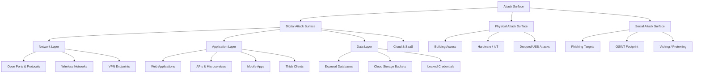
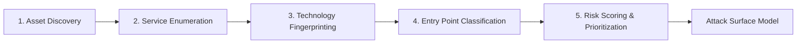
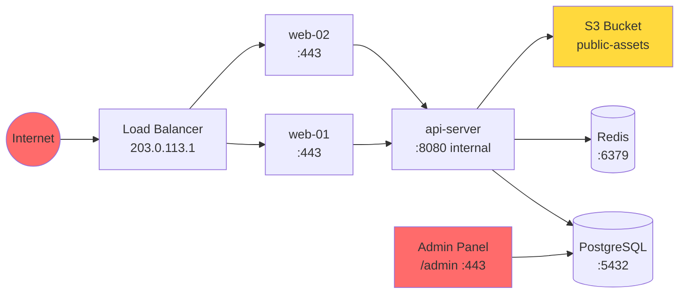
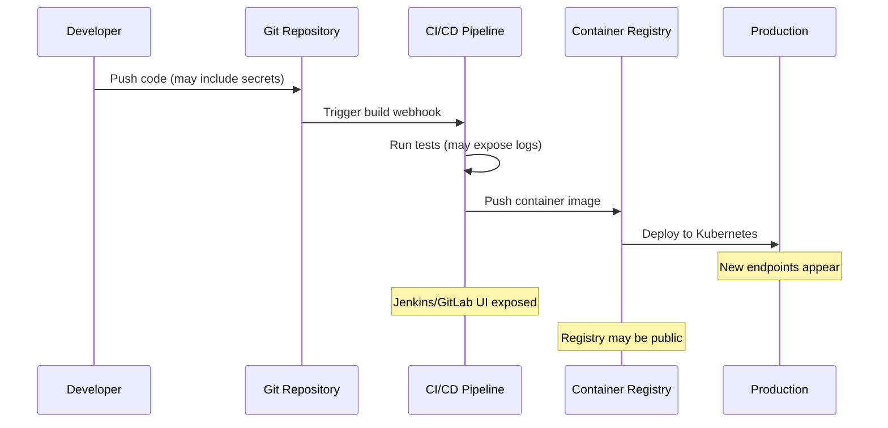
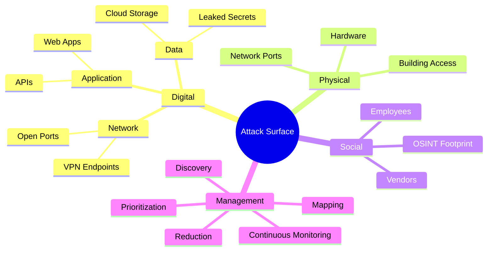

# Attack Surface Analysis

> **Difficulty:** Beginner → Advanced | **Category:** Penetration Testing

Understanding the **attack surface** of a target is the foundational step of any professional penetration test or red team engagement. Before exploiting vulnerabilities, a skilled attacker — or defender — must first know every possible entry point into a system, network, or organization. Attack surface analysis is the discipline of systematically identifying, cataloging, and prioritizing all those entry points. This note covers the full methodology: from defining what an attack surface is, through mapping all three dimensions (digital, physical, social), to managing how that surface evolves over time in modern DevOps and cloud environments.

---

## Table of Contents

1. [What Is an Attack Surface?](#what-is-an-attack-surface)
2. [The Three Types of Attack Surface](#the-three-types)
3. [Attack Vectors vs Attack Surface](#attack-vectors-vs-attack-surface)
4. [Systematic Attack Surface Mapping](#systematic-mapping)
5. [Building an Attack Surface Model](#building-a-model)
6. [Prioritization — High-Value Targets First](#prioritization)
7. [Attack Surface Reduction Principles](#reduction-principles)
8. [Tools for Attack Surface Management](#tools)
9. [Attack Surface Over Time](#over-time)
10. [Worked Example](#worked-example)

---

## What Is an Attack Surface?

The **attack surface** is the sum of all the different points (the "surface") where an unauthorized user can try to enter data into or extract data from an environment. More precisely, it is the total set of exploitable weaknesses — every exposed API endpoint, open port, physical door, phishing target, and misconfigured permission that could be leveraged by an adversary.

The concept was formalized by security researchers at Carnegie Mellon University and is central to frameworks such as MITRE ATT&CK, NIST SP 800-53, and the OWASP Testing Guide.

> **Note:** Attack surface is *not* the same as vulnerability count. A system with 1,000 open ports and zero CVEs still has a massive attack surface. Attack surface measures *exposure*; vulnerabilities measure *exploitability*.

### Core Properties

| Property | Description |
|---|---|
| **Breadth** | Total number of exposed entry points |
| **Depth** | How deep an attacker can reach through any single entry point |
| **Criticality** | The value or sensitivity of assets reachable from each entry point |
| **Visibility** | Whether defenders can observe activity at each entry point |
| **Persistence** | Whether the entry point is temporary (e.g., a dev branch) or permanent |

---

## The Three Types of Attack Surface



### 1. Digital Attack Surface

The **digital attack surface** encompasses every technology-facing exposure. It is the largest and most complex of the three types in modern environments.

#### Network Layer

- Open TCP/UDP ports on internet-facing hosts
- Routing infrastructure (BGP, OSPF, misrouted prefixes)
- Wireless networks (WPA2 enterprise, open guest Wi-Fi, rogue APs)
- VPN gateways (IPSec, SSL-VPN, WireGuard endpoints)
- Load balancers, CDN origin bypass

#### Application Layer

- Web applications (authentication forms, file uploads, admin panels)
- REST and GraphQL APIs
- Mobile application backends
- Thick client applications communicating over proprietary protocols
- Third-party integrations (OAuth providers, payment processors)

#### Data Layer

- Publicly exposed databases (MongoDB, Elasticsearch, Redis without auth)
- Misconfigured cloud storage (S3 buckets, Azure Blob, GCS)
- Git repositories with secrets committed
- Pastebin and similar sites with leaked configuration

#### Cloud and SaaS

- Identity providers (Okta, Azure AD, Google Workspace)
- Cloud management consoles (AWS Console, GCP Cloud Shell)
- Serverless function endpoints (Lambda URLs, Cloud Run)
- CI/CD pipeline interfaces (GitHub Actions, Jenkins, GitLab CI)

### 2. Physical Attack Surface

The **physical attack surface** covers all tangible, in-person attack vectors. Often underestimated in corporate security assessments.

| Physical Vector | Example Attack |
|---|---|
| Unlocked server rooms | Direct console access, hardware implant |
| Visitor badges / tailgating | Unauthorized floor access |
| Network ports in lobbies | Rogue device plug-in, 802.1X bypass |
| Kiosks and point-of-sale terminals | Skimmers, USB boot attacks |
| Printer / scanner devices | Configuration exfiltration, pivot point |
| Dumpster diving | Discarded documents, hard drives |
| Parking lot USB drops | Malicious firmware delivery |

### 3. Social Attack Surface

The **social attack surface** consists of human targets that can be manipulated through psychological techniques.

- **Employees**: Reachable via email (spear-phishing), LinkedIn, corporate directory
- **Executive assistants**: High-value targets for BEC (Business Email Compromise)
- **IT helpdesk**: Susceptible to pretexting ("I forgot my password")
- **Third-party vendors**: Supply chain entry point
- **Social media presence**: Information leakage about technology stack, personnel

---

## Attack Vectors vs Attack Surface

> **Note:** These terms are often confused. Understanding the distinction is essential for professional communication.

| Term | Definition | Example |
|---|---|---|
| **Attack Surface** | The set of all possible entry points | All 47 open ports on a server |
| **Attack Vector** | The specific path or method used to reach a vulnerability | SSH brute-force via port 22 |
| **Attack Path** | A chained sequence of vectors leading to an objective | Port 22 → SSH key reuse → sudo misconfiguration → root |
| **Threat Actor** | The entity that exploits a vector | APT28, ransomware group, insider threat |

An attack surface can contain thousands of potential attack vectors, but only a subset will be viable (exploitable) given a specific threat actor's capabilities.

---

## Systematic Attack Surface Mapping

A professional attack surface mapping follows five phases:



### Phase 1: Asset Discovery

Before you can map the surface, you must find all assets. This includes both known assets from the client's asset inventory (if scoping allows) and *unknown* assets discovered through reconnaissance.

```bash
# Enumerate subdomains via certificate transparency logs
curl -s "https://crt.sh/?q=%25.example.com&output=json" | \
  jq -r '.[].name_value' | sort -u > subdomains.txt

# Amass passive enumeration
amass enum -passive -d example.com -o amass_passive.txt

# Amass active enumeration (DNS brute force)
amass enum -active -d example.com -brute -w /usr/share/seclists/Discovery/DNS/subdomains-top1million-5000.txt

# Subfinder for fast passive discovery
subfinder -d example.com -all -o subfinder.txt

# Combine and deduplicate
cat subdomains.txt amass_passive.txt subfinder.txt | sort -u > all_subdomains.txt
```

```bash
# Resolve subdomains to IPs
cat all_subdomains.txt | dnsx -a -resp -o resolved.txt

# Find all ASNs for an organization
whois -h whois.radb.net -- '-i origin AS12345' | grep ^route

# Get all IP ranges from ASN
nmap --script targets-asn --script-args targets-asn.whois-server=whois.arin.net,targets-asn.asn=12345
```

### Phase 2: Service Enumeration

With a list of assets and IP ranges, enumerate what is running on each.

```bash
# Fast TCP port discovery across a /16
masscan -p1-65535 10.0.0.0/16 --rate=10000 -oG masscan_output.gnmap

# Parse Masscan results and feed to Nmap for service detection
grep "open" masscan_output.gnmap | awk '{print $2}' | sort -u > live_hosts.txt
nmap -sV -sC -p- -iL live_hosts.txt -oA full_service_scan --min-rate 1000

# UDP top ports (slower, essential for completeness)
nmap -sU --top-ports 200 -iL live_hosts.txt -oA udp_scan
```

### Phase 3: Technology Fingerprinting

Identify the specific technologies in use — frameworks, CMS, databases, cloud providers.

```bash
# Web technology fingerprinting
whatweb -a 3 https://example.com
wappalyzer-cli https://example.com

# HTTP headers analysis
curl -s -I https://example.com | grep -E "Server:|X-Powered-By:|X-Framework:|Via:"

# TLS certificate analysis
echo | openssl s_client -connect example.com:443 2>/dev/null | openssl x509 -noout -text | grep -E "Subject:|DNS:"

# SSL/TLS configuration
testssl.sh --fast https://example.com
sslscan example.com:443
```

### Phase 4: Entry Point Classification

Classify every discovered entry point into a taxonomy:

```
entry_points/
├── network/
│   ├── tcp_ports.csv
│   ├── udp_ports.csv
│   └── vpn_endpoints.txt
├── web/
│   ├── login_forms.txt
│   ├── file_uploads.txt
│   ├── api_endpoints.txt
│   └── admin_panels.txt
├── email/
│   └── spf_dmarc_analysis.txt
└── cloud/
    ├── s3_buckets.txt
    └── exposed_functions.txt
```

### Phase 5: Risk Scoring

Apply a risk score to each entry point using a consistent formula:

```
Risk Score = (Exploitability × Impact × Exposure) / Detectability
```

| Factor | 1 (Low) | 2 (Medium) | 3 (High) |
|---|---|---|---|
| **Exploitability** | Requires auth + expertise | Requires auth or expertise | Unauthenticated, public exploit |
| **Impact** | Minimal data exposure | Internal data access | Crown jewel access / RCE |
| **Exposure** | Internal only | Partner network | Public internet |
| **Detectability** | Highly monitored (IDS/WAF) | Some logging | No detection |

---

## Building an Attack Surface Model

An **attack surface model** is a living document (or database) that captures the full picture of your target's exposure. It should include:

### Model Schema

```json
{
  "asset": {
    "id": "AS-001",
    "hostname": "api.example.com",
    "ip": "203.0.113.42",
    "owner": "Platform Team",
    "criticality": "high"
  },
  "entry_points": [
    {
      "id": "EP-001",
      "type": "tcp_port",
      "port": 443,
      "service": "HTTPS",
      "technology": "nginx/1.21.6",
      "authentication": "none",
      "notes": "Returns API swagger UI unauthenticated"
    }
  ],
  "risk_score": 8.4,
  "last_scanned": "2024-11-15T09:00:00Z"
}
```

### Visualization with Asset Maps



### Attack Surface Register

Maintain a spreadsheet or database with these columns:

| Field | Description |
|---|---|
| Asset ID | Unique identifier |
| Asset Name | Hostname or IP |
| Asset Type | Web, API, Database, Network Device |
| Owner / Team | Responsible team |
| Exposure | Internal / External / Both |
| Services | Port:Protocol:Version |
| Authentication Required | Yes / No / Partial |
| Known Vulnerabilities | CVE list |
| Risk Score | 1–10 |
| Last Reviewed | Date |
| Status | Active / Deprecated / Decommissioned |

---

## Prioritization — High-Value Targets First

Not all entry points deserve equal attention. Prioritize using the following hierarchy:

### Tier 1 — Critical (Immediate Focus)

- **Unauthenticated internet-facing admin panels**
- **Exposed database ports** (3306, 5432, 27017) with no firewall
- **Default credentials** on any service
- **Remote code execution surfaces** (Jenkins, GitLab, Apache Struts)
- **Cloud storage with public read/write ACLs**

### Tier 2 — High (Priority After Tier 1)

- Authentication bypass opportunities (OAuth misconfigurations, JWT weaknesses)
- Outdated software with known CVEs (CVSS ≥ 7.0)
- VPN gateways running old firmware
- Email relay (open SMTP relays, weak SPF/DMARC)
- Exposed internal services via SSRF vectors

### Tier 3 — Medium

- Information disclosure (server banners, verbose error messages)
- Missing security headers (CSP, HSTS, X-Frame-Options)
- TLS misconfigurations (SSLv3, TLS 1.0, weak ciphers)
- Non-sensitive file exposure (directory listing, old sitemaps)

### Tier 4 — Low (Document, Do Not Prioritize)

- Informational findings (WHOIS data, DNS zone transfers on non-sensitive domains)
- Low-impact misconfigurations (X-Content-Type-Options missing)

> **Warning:** Never skip Tier 1 findings to jump to more interesting Tier 2 work. Unauthenticated critical exposures can lead to immediate compromise and scope creep.

---

## Attack Surface Reduction Principles

Reducing the attack surface means eliminating or hardening every unnecessary entry point.

### Principle 1: Minimize Exposed Services

```bash
# Audit all listening services on a Linux host
ss -tlnup
netstat -tlnup

# Disable unnecessary services (systemd)
systemctl disable --now avahi-daemon
systemctl disable --now cups
systemctl disable --now bluetooth

# Check for services bound to 0.0.0.0 (all interfaces) vs 127.0.0.1
ss -tlnup | grep "0.0.0.0"
```

### Principle 2: Enforce Least Privilege

```bash
# Audit sudo permissions
sudo -l -U username
cat /etc/sudoers

# Find world-writable files
find / -perm -0002 -type f 2>/dev/null

# Find SUID/SGID binaries (common pivot points)
find / -perm /4000 -o -perm /2000 2>/dev/null | sort
```

### Principle 3: Network Segmentation

```bash
# Audit iptables rules
iptables -L -n -v
ip6tables -L -n -v

# Verify no overly permissive rules exist
iptables -L -n | grep -E "ACCEPT.*0\.0\.0\.0"

# Check AWS Security Groups via CLI
aws ec2 describe-security-groups --query \
  "SecurityGroups[?IpPermissions[?IpRanges[?CidrIp=='0.0.0.0/0']]].[GroupId,GroupName]" \
  --output table
```

### Principle 4: Eliminate Default Credentials

Common default credential combinations to test:

| Service | Default Username | Default Password |
|---|---|---|
| Cisco IOS | admin | admin / cisco |
| Tomcat Manager | tomcat | tomcat / s3cret |
| Jenkins (old) | admin | (from `/var/jenkins_home/secrets/initialAdminPassword`) |
| phpMyAdmin | root | (empty) |
| SNMP v1/v2 | — | public / private |
| MongoDB (old) | — | (no auth) |
| CouchDB | admin | (empty in old versions) |
| Elasticsearch | elastic | changeme (old default) |
| Redis | — | (no auth by default) |

### Principle 5: Patch Aggressively

```bash
# Check for outdated packages (Debian/Ubuntu)
apt list --upgradable 2>/dev/null

# Check for security-specific updates
apt-get --simulate upgrade | grep -i security

# Show CVE data for installed packages (Ubuntu)
ubuntu-security-status

# Lynis security audit
lynis audit system
```

---

## Tools for Attack Surface Management

### Commercial Platforms

| Tool | Type | Key Feature |
|---|---|---|
| **Shodan** | Passive ASM | Internet-wide device scanner |
| **Censys** | Passive ASM | Certificate + banner data |
| **Tenable.io** | Active ASM | Continuous vulnerability scanning |
| **CrowdStrike Falcon Surface** | ASM Platform | Shadow IT discovery |
| **Microsoft Defender EASM** | ASM Platform | Azure-integrated discovery |
| **Cycognito** | ASM Platform | Attacker-perspective mapping |

### Open Source Tools

| Tool | Purpose | Command |
|---|---|---|
| **Amass** | Subdomain discovery | `amass enum -d target.com` |
| **Subfinder** | Passive subdomain enum | `subfinder -d target.com` |
| **Nmap** | Port/service scanning | `nmap -sV -sC target` |
| **Masscan** | High-speed port scan | `masscan -p1-65535 target/24` |
| **Shodan CLI** | Query Shodan API | `shodan search "hostname:target.com"` |
| **Nuclei** | Template-based vuln scan | `nuclei -u https://target.com -t exposures/` |
| **httpx** | HTTP probe/fingerprint | `cat hosts.txt \| httpx -title -tech-detect` |
| **dnsx** | DNS resolution + probing | `dnsx -l subdomains.txt -a -cname` |
| **Hakrawler** | Web crawler | `echo https://target.com \| hakrawler` |
| **Gau** | Get all URLs (Wayback etc.) | `gau target.com \| sort -u` |

```bash
# Full passive ASM pipeline
subfinder -d target.com -all -silent | \
  dnsx -a -resp -silent | \
  awk '{print $1}' | \
  httpx -title -tech-detect -status-code -silent | \
  tee asm_results.txt

# Nuclei scan for common exposures
nuclei -l all_subdomains.txt \
  -t /root/nuclei-templates/exposures/ \
  -t /root/nuclei-templates/misconfiguration/ \
  -severity critical,high,medium \
  -o nuclei_findings.txt

# Shodan dorking for the target org
shodan search 'org:"Example Corporation"' --fields ip_str,port,hostnames,product
shodan search 'ssl:"example.com" 200' --fields ip_str,port
```

---

## Attack Surface Over Time

The attack surface is **not static**. It grows and changes in response to:

### DevOps and CI/CD

Modern CI/CD pipelines introduce new attack surface with every deployment:



**New surfaces introduced by DevOps:**
- Exposed CI/CD dashboards (Jenkins `:8080`, GitLab `:80`)
- Container registries with publicly pullable images
- Secrets in environment variables or build logs
- Feature flags enabling hidden endpoints in production
- Staging/QA environments with production data

### Cloud Adoption

```bash
# Discover cloud assets for an org
# S3 bucket enumeration
aws s3 ls s3://example-company-backups 2>/dev/null
for name in $(cat company_names.txt); do
  aws s3 ls s3://$name 2>/dev/null && echo "FOUND: $name"
done

# Azure blob storage
az storage account list --output table
az storage blob list --account-name examplestorage --container-name backups

# GCS bucket testing
gsutil ls gs://example-com-backups 2>/dev/null
```

### Mergers and Acquisitions

Acquisitions are one of the **highest-risk moments** for attack surface expansion:

| Phase | Risk |
|---|---|
| Pre-acquisition | Target's security posture unknown |
| Announcement | Adversaries begin targeting the weaker entity |
| Integration | Network interconnection before security review |
| Post-integration | Orphaned systems from old company |

> **Warning:** During M&A, the acquiring company inherits ALL technical debt and ALL vulnerabilities of the acquired company. A rushed integration can instantly expose the acquirer's crown jewels through the newly connected subsidiary network.

### Tracking Surface Changes

```bash
# Git-style diff of attack surface (conceptual workflow)
# Take baseline scan
nmap -sV -p- 10.0.0.0/24 -oX baseline_$(date +%Y%m%d).xml

# Compare with previous scan using ndiff
ndiff baseline_20241001.xml baseline_20241101.xml

# Monitor for new subdomains (run in cron)
subfinder -d example.com -silent | sort > /tmp/current_subs.txt
diff /var/monitor/previous_subs.txt /tmp/current_subs.txt | grep "^>" >> /var/monitor/new_subs.txt
cp /tmp/current_subs.txt /var/monitor/previous_subs.txt
```

---

## Worked Example

**Scenario:** A penetration tester is assigned a black-box external test against `example-corp.com`. No asset list is provided.

### Step 1: DNS and Subdomain Discovery

```bash
# Passive
subfinder -d example-corp.com -all -silent > subs.txt
amass enum -passive -d example-corp.com >> subs.txt
sort -u subs.txt -o subs.txt

# Certificate transparency
curl -s "https://crt.sh/?q=%25.example-corp.com&output=json" | \
  jq -r '.[].name_value' | sort -u >> subs.txt

# DNS brute force
gobuster dns -d example-corp.com \
  -w /usr/share/seclists/Discovery/DNS/subdomains-top1million-110000.txt \
  -o gobuster_dns.txt
```

### Step 2: HTTP Probing

```bash
cat subs.txt | httpx \
  -title \
  -tech-detect \
  -status-code \
  -content-length \
  -follow-redirects \
  -o httpx_results.txt

# Screenshot all live hosts
gowitness file -f <(awk '{print $1}' httpx_results.txt) -P screenshots/
```

### Step 3: Port Scanning on Resolved IPs

```bash
# Extract IPs
cat httpx_results.txt | grep "200\|301\|302\|403" | \
  grep -oP '\d+\.\d+\.\d+\.\d+' | sort -u > live_ips.txt

# Full port scan
masscan -iL live_ips.txt -p1-65535 --rate 5000 -oG masscan.gnmap
grep "open" masscan.gnmap | awk '{print $2":"$5}' | sed 's/\/tcp//' > open_ports.txt

# Nmap service scan on discovered ports
nmap -sV -sC -p $(grep "203.0.113.42" masscan.gnmap | \
  grep -oP '\d+/open' | grep -oP '\d+' | tr '\n' ',') \
  203.0.113.42 -oA nmap_203.0.113.42
```

### Step 4: Cloud Asset Discovery

```bash
# S3 bucket guessing
for word in corp backup data dev staging prod www api; do
  aws s3 ls s3://example-corp-$word 2>/dev/null && echo "OPEN: example-corp-$word"
done

# Nuclei cloud misconfigurations
nuclei -u https://example-corp.com \
  -t /root/nuclei-templates/cloud/ \
  -t /root/nuclei-templates/exposures/configs/ \
  -silent
```

### Step 5: Compile Attack Surface Register

At this point, the tester documents all findings in a structured register:

| # | Asset | Exposure | Type | Risk | Priority |
|---|---|---|---|---|---|
| 1 | `dev.example-corp.com` | External | Web App | 8.5 | Tier 1 |
| 2 | `203.0.113.42:27017` | External | MongoDB (no auth) | 9.8 | Tier 1 |
| 3 | `api.example-corp.com/v1/swagger` | External | API Docs | 6.0 | Tier 2 |
| 4 | `example-corp-backup` (S3) | External | Public S3 Bucket | 9.0 | Tier 1 |
| 5 | `mail.example-corp.com` | External | SMTP open relay | 7.5 | Tier 2 |

---

## Summary



> **Note:** A penetration test without thorough attack surface analysis is like trying to secure a building without knowing how many doors and windows it has. Always invest time in surface mapping before moving to exploitation phases.

The attack surface analysis phase produces the roadmap for all subsequent testing. Every finding in later phases — from service vulnerabilities to web application bugs — traces back to an entry point catalogued here. Treat this phase as foundational infrastructure for the entire engagement.
