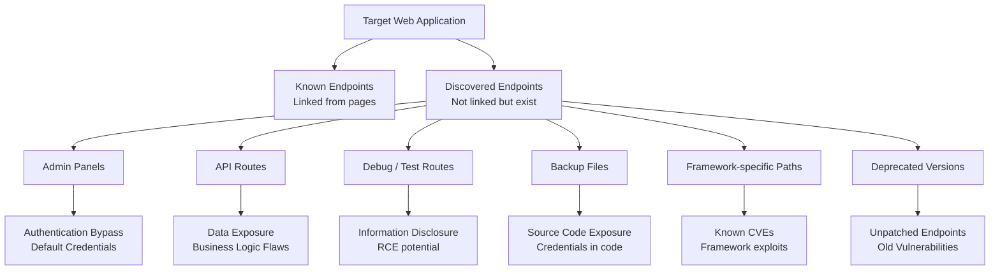
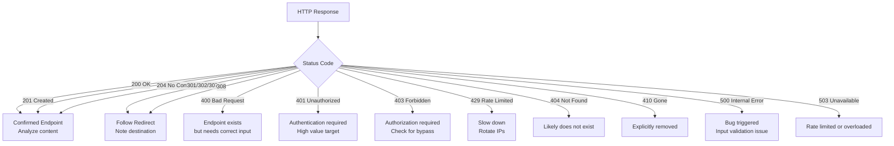
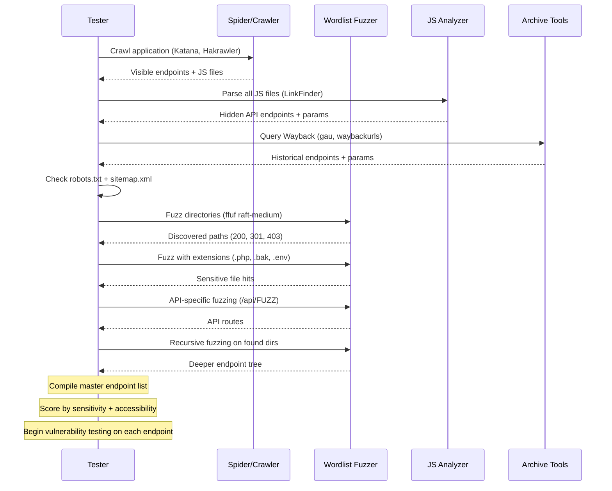

# Endpoint Discovery

> **Difficulty:** Beginner → Advanced | **Category:** Penetration Testing

**Endpoint discovery** is the process of finding every URL, path, API route, and parameter that a web application exposes — including those not linked from the homepage, not indexed by search engines, and not documented in any public-facing resource. Hidden endpoints represent an enormous slice of the attack surface: forgotten admin interfaces, debug routes, deprecated API versions, and accidentally exposed files. This note covers the complete methodology from wordlist-based fuzzing to JavaScript parsing, Wayback Machine mining, and recursive discovery strategies.

---

## Table of Contents

1. [Why Endpoint Discovery Matters](#why-it-matters)
2. [Reconnaissance Before Fuzzing](#recon-before-fuzzing)
3. [Directory and Path Fuzzing with ffuf](#ffuf)
4. [Directory and Path Fuzzing with Gobuster](#gobuster)
5. [Wordlists — Choosing and Building](#wordlists)
6. [API Endpoint Discovery](#api-discovery)
7. [JavaScript File Analysis](#javascript-analysis)
8. [Sitemap and robots.txt Analysis](#sitemap-robots)
9. [Wayback Machine and Archive Mining](#wayback)
10. [Parameter Discovery from Endpoints](#parameter-discovery)
11. [Response Code Filtering Strategies](#response-filtering)
12. [Recursive Discovery](#recursive)
13. [Endpoint Discovery Workflow](#workflow)

---

## Why Endpoint Discovery Matters

Modern web applications contain far more routes than what a user typically sees. Development teams add:

- **Admin interfaces** deployed on the same server as the application
- **Debug endpoints** left over from development (`/debug`, `/healthz`, `/test`)
- **API versions** that are no longer the "current" version but still functional (`/api/v1/`, `/api/v2/`)
- **Backup files** that expose source code (`.php.bak`, `config.yml.orig`)
- **Exposed framework routes** (Laravel Telescope, Spring Actuator, Django admin)

Each of these can become a direct path to compromise.



---

## Reconnaissance Before Fuzzing

Before blindly firing wordlists, gather information that will make discovery more targeted and effective.

### Spider the Application

```bash
# Hakrawler — fast, Go-based crawler
echo "https://target.com" | hakrawler -d 3 -u | sort -u > crawled_urls.txt

# Katana — advanced crawler with JS rendering support
katana -u https://target.com -d 5 -jc -o katana_output.txt

# GoSpider
gospider -s https://target.com -d 3 -o gospider_output/ --js --subs

# Burp Suite passive crawl (proxy traffic through Burp while manually browsing)
# Then export sitemap: Target → Sitemap → Right-click → Copy URLs to clipboard
```

### Enumerate Technologies First

Knowing the tech stack directs which wordlists to use:

```bash
# Detect technologies
whatweb https://target.com
wappalyzer-cli https://target.com

# From HTTP headers
curl -s -I https://target.com | grep -iE "server:|x-powered-by:|x-framework:|x-generator:"

# WordPress? Use WPScan
wpscan --url https://target.com --enumerate ap,at,u

# Drupal? Use droopescan
droopescan scan drupal -u https://target.com

# Joomla? Use joomscan
joomscan -u https://target.com
```

| Technology Detected | Targeted Wordlist |
|---|---|
| WordPress | `wp-admin`, `wp-content`, `wp-includes`, `wp-json/wp/v2` |
| Laravel | `artisan`, `storage`, `bootstrap`, `.env`, `api` |
| Django | `admin`, `static`, `api`, `__debug__` |
| Spring Boot | `actuator`, `actuator/health`, `actuator/env`, `actuator/dump` |
| Tomcat | `manager`, `host-manager`, `examples`, `docs` |
| phpMyAdmin | `phpmyadmin`, `pma`, `mysqladmin`, `phpMyAdmin` |
| Strapi | `admin`, `api`, `uploads`, `graphql` |
| Grafana | `api/datasources`, `api/users`, `api/admin` |

---

## Directory and Path Fuzzing with ffuf

**ffuf** (Fuzz Faster U Fool) is a fast, flexible web fuzzer written in Go. It is the modern standard tool for endpoint discovery.

### Installation

```bash
# Via apt (may be outdated)
sudo apt install ffuf

# From Go (recommended — gets latest)
go install github.com/ffuf/ffuf/v2@latest

# From releases
wget https://github.com/ffuf/ffuf/releases/latest/download/ffuf_2.1.0_linux_amd64.tar.gz
tar -xvf ffuf_2.1.0_linux_amd64.tar.gz
sudo mv ffuf /usr/local/bin/
```

### Basic Directory Discovery

```bash
# Basic directory fuzz
ffuf -u https://target.com/FUZZ \
  -w /usr/share/seclists/Discovery/Web-Content/directory-list-2.3-medium.txt \
  -mc 200,204,301,302,307,401,403

# With extensions
ffuf -u https://target.com/FUZZ \
  -w /usr/share/seclists/Discovery/Web-Content/raft-medium-words.txt \
  -e .php,.html,.txt,.js,.json,.bak,.old \
  -mc 200,204,301,302,307,401,403

# Faster with threads
ffuf -u https://target.com/FUZZ \
  -w /usr/share/seclists/Discovery/Web-Content/raft-large-directories.txt \
  -t 100 \
  -mc 200,204,301,302,307,401,403

# Filter by size (remove false positives with consistent size)
ffuf -u https://target.com/FUZZ \
  -w /usr/share/wordlists/dirb/common.txt \
  -fs 1234

# Filter by word count (remove specific word-count responses)
ffuf -u https://target.com/FUZZ \
  -w /usr/share/wordlists/dirb/common.txt \
  -fw 12

# Filter by regex (remove responses matching pattern)
ffuf -u https://target.com/FUZZ \
  -w /usr/share/wordlists/dirb/common.txt \
  -fr "Not Found"
```

### Advanced ffuf Usage

```bash
# Match only specific status codes (more permissive)
ffuf -u https://target.com/FUZZ \
  -w /opt/SecLists/Discovery/Web-Content/directory-list-lowercase-2.3-big.txt \
  -mc all \
  -fc 404,400

# POST body fuzzing
ffuf -u https://target.com/api/endpoint \
  -w /opt/SecLists/Discovery/Web-Content/api/objects.txt \
  -X POST \
  -H "Content-Type: application/json" \
  -d '{"FUZZ": "test"}' \
  -mc 200,201,204

# Subdomain fuzzing
ffuf -u https://FUZZ.target.com \
  -w /opt/SecLists/Discovery/DNS/subdomains-top1million-5000.txt \
  -mc 200,301,302 \
  -H "Host: FUZZ.target.com"

# Virtual host discovery
ffuf -u http://192.168.1.100 \
  -H "Host: FUZZ.target.com" \
  -w /opt/SecLists/Discovery/DNS/subdomains-top1million-5000.txt \
  -fs 4242  # filter out default vhost response size

# With cookies (authenticated fuzzing)
ffuf -u https://target.com/api/FUZZ \
  -w /opt/SecLists/Discovery/Web-Content/api/api-endpoints.txt \
  -b "session=abc123; token=def456" \
  -mc 200,201,204,301,302,307,401,403

# With bearer token
ffuf -u https://target.com/api/FUZZ \
  -w /opt/SecLists/Discovery/Web-Content/api/api-endpoints.txt \
  -H "Authorization: Bearer eyJhbGc..." \
  -mc 200,201,204,301,302,307,403

# Save output
ffuf -u https://target.com/FUZZ \
  -w /opt/SecLists/Discovery/Web-Content/raft-medium-words.txt \
  -o ffuf_results.json \
  -of json

# Human-readable output
ffuf -u https://target.com/FUZZ \
  -w /opt/SecLists/Discovery/Web-Content/raft-medium-words.txt \
  -o ffuf_results.html \
  -of html
```

### ffuf Rate Limiting and Evasion

```bash
# Rate limit to avoid WAF triggering
ffuf -u https://target.com/FUZZ \
  -w /opt/SecLists/Discovery/Web-Content/raft-medium-words.txt \
  -p 0.1   # 100ms delay between requests

# Maximum rate
ffuf -u https://target.com/FUZZ \
  -w /opt/SecLists/Discovery/Web-Content/raft-medium-words.txt \
  -rate 50  # 50 requests per second

# Random agent
ffuf -u https://target.com/FUZZ \
  -w /opt/SecLists/Discovery/Web-Content/raft-medium-words.txt \
  -H "User-Agent: Mozilla/5.0 (Windows NT 10.0; Win64; x64) AppleWebKit/537.36"

# Through proxy (Burp Suite)
ffuf -u https://target.com/FUZZ \
  -w /opt/SecLists/Discovery/Web-Content/raft-medium-words.txt \
  -x http://127.0.0.1:8080
```

---

## Directory and Path Fuzzing with Gobuster

**Gobuster** is another Go-based fuzzer, excellent for directory scanning, DNS, and virtual host enumeration.

### Installation

```bash
sudo apt install gobuster
# or
go install github.com/OJ/gobuster/v3@latest
```

### Gobuster dir Mode

```bash
# Basic directory scan
gobuster dir \
  -u https://target.com \
  -w /opt/SecLists/Discovery/Web-Content/directory-list-2.3-medium.txt \
  -t 50

# With extensions
gobuster dir \
  -u https://target.com \
  -w /opt/SecLists/Discovery/Web-Content/raft-medium-words.txt \
  -x php,html,txt,js,json,bak,old,gz \
  -t 50

# Show only specific status codes
gobuster dir \
  -u https://target.com \
  -w /opt/SecLists/Discovery/Web-Content/raft-large-directories.txt \
  -s 200,204,301,302,307,401,403 \
  -t 100

# Output to file
gobuster dir \
  -u https://target.com \
  -w /opt/SecLists/Discovery/Web-Content/raft-medium-words.txt \
  -o gobuster_results.txt \
  -t 50

# With cookies
gobuster dir \
  -u https://target.com/dashboard/ \
  -w /opt/SecLists/Discovery/Web-Content/raft-medium-words.txt \
  -c "session=abc123; token=xyz" \
  -t 50

# Insecure TLS
gobuster dir \
  -u https://target.com \
  -w /opt/SecLists/Discovery/Web-Content/raft-medium-words.txt \
  -k

# Follow redirects
gobuster dir \
  -u https://target.com \
  -w /opt/SecLists/Discovery/Web-Content/raft-medium-words.txt \
  -r
```

### Gobuster DNS Mode

```bash
# Subdomain enumeration
gobuster dns \
  -d target.com \
  -w /opt/SecLists/Discovery/DNS/subdomains-top1million-5000.txt \
  -t 50

# With wildcard detection
gobuster dns \
  -d target.com \
  -w /opt/SecLists/Discovery/DNS/subdomains-top1million-5000.txt \
  --wildcard

# Show IPs
gobuster dns \
  -d target.com \
  -w /opt/SecLists/Discovery/DNS/subdomains-top1million-5000.txt \
  -i
```

### Gobuster vhost Mode

```bash
# Virtual host discovery
gobuster vhost \
  -u http://192.168.1.100 \
  -w /opt/SecLists/Discovery/DNS/subdomains-top1million-5000.txt \
  --append-domain \
  -t 50

# Filter by excluding certain response sizes
gobuster vhost \
  -u http://192.168.1.100 \
  -w /opt/SecLists/Discovery/DNS/subdomains-top1million-5000.txt \
  --exclude-length 4242
```

---

## Wordlists — Choosing and Building

### SecLists — The Gold Standard

```bash
# Install SecLists
sudo apt install seclists
# or
git clone https://github.com/danielmiessler/SecLists /opt/SecLists

# Key wordlists by use case:

# General directory discovery
/opt/SecLists/Discovery/Web-Content/directory-list-2.3-medium.txt      # 220,560 entries
/opt/SecLists/Discovery/Web-Content/directory-list-2.3-big.txt         # 1,273,833 entries
/opt/SecLists/Discovery/Web-Content/raft-large-directories.txt         # 163,514 entries
/opt/SecLists/Discovery/Web-Content/raft-medium-words.txt              # 63,088 entries

# File discovery
/opt/SecLists/Discovery/Web-Content/raft-large-files.txt               # 37,050 entries
/opt/SecLists/Discovery/Web-Content/raft-medium-files.txt

# API endpoints
/opt/SecLists/Discovery/Web-Content/api/api-endpoints.txt
/opt/SecLists/Discovery/Web-Content/api/objects.txt

# Specific technologies
/opt/SecLists/Discovery/Web-Content/CMS/wordpress.fuzz.txt
/opt/SecLists/Discovery/Web-Content/CMS/joomla.txt
/opt/SecLists/Discovery/Web-Content/CMS/drupal.txt

# Sensitive files
/opt/SecLists/Discovery/Web-Content/CommonBackupExtensions.fuzz.txt
/opt/SecLists/Discovery/Web-Content/quickhits.txt                      # High-value quick hits

# Subdomain wordlists
/opt/SecLists/Discovery/DNS/subdomains-top1million-5000.txt
/opt/SecLists/Discovery/DNS/subdomains-top1million-110000.txt
/opt/SecLists/Discovery/DNS/dns-Jhaddix.txt                            # Jhaddix's compiled list
```

### Custom Wordlist Generation

```bash
# Generate wordlist from target website (CeWL)
cewl https://target.com -d 3 -m 5 -w custom_wordlist.txt

# Include email addresses
cewl https://target.com -d 2 --email -w cewl_with_email.txt

# Generate tech-specific wordlists
# Extract all paths from JS files
grep -oP '(?<=["'"'"'])/[a-zA-Z0-9/_-]+(?=['"'"'"])' app.js | sort -u

# Build wordlist from Wayback Machine URLs
gau target.com | grep -oP 'https?://[^/]+\K/[^?]+' | \
  awk -F/ '{print $NF}' | sort -u | \
  grep -v '\.' > paths_from_archive.txt

# Combine and deduplicate wordlists
cat /opt/SecLists/Discovery/Web-Content/raft-medium-words.txt \
    custom_wordlist.txt \
    paths_from_archive.txt | sort -u > combined_wordlist.txt
```

---

## API Endpoint Discovery

REST APIs, GraphQL, and gRPC endpoints have their own discovery methodology.

### REST API Discovery

```bash
# API-specific wordlists
ffuf -u https://target.com/api/FUZZ \
  -w /opt/SecLists/Discovery/Web-Content/api/api-endpoints.txt \
  -mc 200,201,204,401,403 \
  -t 50

# API versioning discovery
ffuf -u https://target.com/FUZZ/users \
  -w /opt/SecLists/Discovery/Web-Content/api/api-seen-in-wild.txt \
  -mc 200,201,204,401,403

# Common API paths
for path in api v1 v2 v3 rest service services graphql gql rpc; do
  curl -s -o /dev/null -w "%{http_code} https://target.com/$path\n" "https://target.com/$path"
done

# API documentation endpoints
for doc in swagger swagger-ui swagger.json swagger.yaml \
           openapi openapi.json openapi.yaml \
           api-docs api/docs docs/api redoc; do
  status=$(curl -s -o /dev/null -w "%{http_code}" "https://target.com/$doc")
  [[ "$status" != "404" ]] && echo "$status https://target.com/$doc"
done
```

### Swagger/OpenAPI Exploitation

```bash
# If Swagger UI found, enumerate all documented endpoints
# Parse swagger.json manually
curl -s https://target.com/swagger.json | python3 -c "
import json, sys
spec = json.load(sys.stdin)
base = spec.get('basePath', '/api')
for path, methods in spec.get('paths', {}).items():
    for method in methods:
        print(f'{method.upper()} {base}{path}')
"

# Use swagger-cli to validate and explore
swagger-cli validate swagger.json

# kiterunner — API endpoint discovery using real API wordlists
kr scan https://target.com -w /opt/SecLists/Discovery/Web-Content/api/kiterunner/routes-large.kite

# With authentication
kr scan https://target.com \
  -w /opt/SecLists/Discovery/Web-Content/api/kiterunner/routes-large.kite \
  -H "Authorization: Bearer eyJhbGc..."
```

### GraphQL Introspection

```bash
# Test if GraphQL is available
curl -s -X POST https://target.com/graphql \
  -H "Content-Type: application/json" \
  -d '{"query": "{ __typename }"}'

# Full schema introspection
curl -s -X POST https://target.com/graphql \
  -H "Content-Type: application/json" \
  -d '{
    "query": "{ __schema { types { name fields { name type { name kind ofType { name kind } } } } } }"
  }' | python3 -m json.tool

# Extract all queries and mutations
curl -s -X POST https://target.com/graphql \
  -H "Content-Type: application/json" \
  -d '{
    "query": "{ __schema { queryType { fields { name description args { name type { name } } } } mutationType { fields { name description } } } }"
  }' | python3 -m json.tool

# GraphQL IDE endpoints to check
for endpoint in graphql graphiql graphql-playground api/graphql v1/graphql; do
  status=$(curl -s -o /dev/null -w "%{http_code}" -X POST "https://target.com/$endpoint" \
    -H "Content-Type: application/json" \
    -d '{"query":"{__typename}"}')
  echo "$status: https://target.com/$endpoint"
done
```

---

## JavaScript File Analysis

Modern web applications load business logic, API endpoints, and sometimes credentials through JavaScript. Mining JS files is one of the highest-yield endpoint discovery techniques.

### Extract Endpoints from JS

```bash
# Download all JavaScript files
# First, get all JS URLs
hakrawler -url https://target.com -js -depth 3 | grep "\.js$" | sort -u > js_urls.txt
katana -u https://target.com -jc -d 3 | grep "\.js$" | sort -u >> js_urls.txt
sort -u js_urls.txt -o js_urls.txt

# Download them
mkdir -p js_files
while IFS= read -r url; do
  filename=$(echo "$url" | md5sum | cut -d' ' -f1).js
  curl -s "$url" -o "js_files/$filename"
  echo "$url -> js_files/$filename"
done < js_urls.txt

# Extract API endpoints from JS (multiple regex patterns)
grep -orhP '(?:["'"'"'`])(/[a-zA-Z0-9_/.-]+)(?:["'"'"'`])' js_files/ | \
  grep -oP '/[a-zA-Z0-9_/.-]+' | sort -u

# Extract relative API paths
grep -orhP '(?:fetch|axios|xhr\.open|http\.get|api)\(['"'"'"`]([^'"'"'"`]+)['"'"'"`]' js_files/ | \
  grep -oP '(?<=[('"'"'"`])[^'"'"'"`)]+' | sort -u

# Extract endpoints with common prefixes
grep -orhP '"(/(?:api|v[0-9]+|internal|admin|graphql|rest)[^"]*)"' js_files/ | \
  grep -oP '"/[^"]*"' | tr -d '"' | sort -u
```

### Dedicated JS Analysis Tools

```bash
# LinkFinder — extracts endpoints from JS files
python3 linkfinder.py -i https://target.com/static/app.js -o cli

# Against all files in a directory
for f in js_files/*.js; do
  python3 linkfinder.py -i "$f" -o cli 2>/dev/null
done | sort -u

# SecretFinder — finds secrets in JS files
python3 SecretFinder.py -i https://target.com/static/app.js -o cli

# Batch SecretFinder
while IFS= read -r url; do
  python3 SecretFinder.py -i "$url" -o cli 2>/dev/null
done < js_urls.txt

# JSParser
python3 jsparser.py --url https://target.com

# subjs — extract endpoints from JS across subdomains
cat all_subdomains.txt | subjs | sort -u > all_js_endpoints.txt
```

### React/Angular/Vue Source Map Extraction

```bash
# Source maps often expose original source code
# Check for .map files
curl -s https://target.com/static/js/main.chunk.js.map | python3 -m json.tool | head -50

# Extract original source paths
curl -s https://target.com/static/js/main.chunk.js.map | \
  python3 -c "import json,sys; d=json.load(sys.stdin); [print(s) for s in d.get('sources',[])]"

# Reconstruct source from map
npm install -g source-map-explorer
source-map-explorer main.chunk.js main.chunk.js.map
```

---

## Sitemap and robots.txt Analysis

These files are designed to help search engines — and they helpfully tell attackers what exists.

```bash
# Fetch robots.txt
curl -s https://target.com/robots.txt

# Parse Disallow entries (things the site doesn't want crawled = interesting)
curl -s https://target.com/robots.txt | grep -i "disallow:" | awk '{print $2}'

# Fetch sitemap
curl -s https://target.com/sitemap.xml

# Handle sitemap index (nested sitemaps)
curl -s https://target.com/sitemap.xml | \
  grep -oP '(?<=<loc>)[^<]+(?=</loc>)' | \
  while IFS= read -r url; do
    if echo "$url" | grep -q "sitemap"; then
      curl -s "$url" | grep -oP '(?<=<loc>)[^<]+(?=</loc>)'
    else
      echo "$url"
    fi
  done | sort -u > all_sitemap_urls.txt

# Common sitemap locations
for path in sitemap.xml sitemap_index.xml sitemap.txt sitemap.html \
            sitemaps/sitemap.xml wp-sitemap.xml news-sitemap.xml; do
  status=$(curl -s -o /dev/null -w "%{http_code}" "https://target.com/$path")
  [[ "$status" != "404" ]] && echo "$status https://target.com/$path"
done

# Extract unique paths from sitemap
cat all_sitemap_urls.txt | grep -oP 'https?://[^/]+\K/[^?]+' | sort -u
```

---

## Wayback Machine and Archive Mining

The Wayback Machine and similar services archive historical versions of websites, often including pages and endpoints that no longer appear in the live application.

```bash
# gau — Get All URLs (Wayback, Common Crawl, OTX, URLScan)
gau target.com --subs --o gau_output.txt

# Filter gau by type
gau target.com | grep -E "\.(php|asp|aspx|jsp|json|xml|yaml|yml|env|bak|old|txt)$"

# waybackurls
waybackurls target.com > wayback.txt

# Katana with archive mode
katana -u https://target.com -d 5 -jc -known-files all -o katana_full.txt

# Fetch URLs from Wayback Machine API directly
curl -s "http://web.archive.org/cdx/search/cdx?url=*.target.com/*&output=json&fl=original&collapse=urlkey&limit=10000" | \
  python3 -c "import json,sys; urls=json.load(sys.stdin); [print(u[0]) for u in urls[1:]]" | \
  sort -u > wayback_all.txt

# Filter interesting files from archive
cat wayback_all.txt | grep -E '\.(js|json|xml|yaml|yml|env|bak|old|sql|zip|tar|gz|log|conf|config|ini|php|asp|aspx|jsp)$' \
  | sort -u > interesting_archived_files.txt

# Find parameters from archived URLs
cat wayback_all.txt | grep "?" | python3 -c "
import sys
from urllib.parse import urlparse, parse_qs
params = set()
for line in sys.stdin:
    parsed = urlparse(line.strip())
    params.update(parse_qs(parsed.query).keys())
for p in sorted(params):
    print(p)
" > historical_params.txt
```

---

## Parameter Discovery from Endpoints

Once endpoints are found, discover what parameters they accept.

```bash
# ffuf for GET parameter fuzzing
ffuf -u "https://target.com/search?FUZZ=test" \
  -w /opt/SecLists/Discovery/Web-Content/burp-parameter-names.txt \
  -mc 200 \
  -fw 42  # filter word count to find unique responses

# POST parameter fuzzing
ffuf -u "https://target.com/api/user" \
  -X POST \
  -H "Content-Type: application/x-www-form-urlencoded" \
  -d "FUZZ=test" \
  -w /opt/SecLists/Discovery/Web-Content/burp-parameter-names.txt \
  -mc 200,201,400,422

# Arjun — intelligent parameter discovery
arjun -u https://target.com/search
arjun -u https://target.com/api/user -m POST
arjun -u https://target.com/api/data -m JSON

# x8 — hidden parameter discovery
x8 -u "https://target.com/search?FUZZ=test" \
  -w /opt/SecLists/Discovery/Web-Content/burp-parameter-names.txt

# From endpoints list
arjun -i endpoints.txt -t 10 -o arjun_params.json
```

---

## Response Code Filtering Strategies

Interpreting and filtering responses is as important as generating requests.



### 403 Bypass Techniques

A **403 Forbidden** response means the endpoint *exists* but access is blocked. These bypasses frequently work:

```bash
# Path normalization bypass
curl -s https://target.com/admin
curl -s https://target.com/%2fadmin
curl -s https://target.com/admin/
curl -s https://target.com/./admin
curl -s https://target.com//admin
curl -s https://target.com/admin/.

# Header-based bypass
curl -s https://target.com/admin -H "X-Forwarded-For: 127.0.0.1"
curl -s https://target.com/admin -H "X-Real-IP: 127.0.0.1"
curl -s https://target.com/admin -H "X-Originating-IP: 127.0.0.1"
curl -s https://target.com/admin -H "X-Custom-IP-Authorization: 127.0.0.1"
curl -s https://target.com/admin -H "X-Forwarded-Host: localhost"
curl -s https://target.com/admin -H "Referer: https://target.com/admin"

# Case manipulation
curl -s https://target.com/ADMIN
curl -s https://target.com/Admin
curl -s https://target.com/aDmIn

# Unicode normalization
curl -s "https://target.com/%c0%af%c0%afadmin"

# Extension tricks
curl -s https://target.com/admin.json
curl -s https://target.com/admin.html
curl -s https://target.com/admin;.js
```

---

## Recursive Discovery

Finding endpoints at the top level often reveals subdirectories that need their own fuzzing pass.

```bash
# ffuf recursive discovery (built-in)
ffuf -u https://target.com/FUZZ \
  -w /opt/SecLists/Discovery/Web-Content/raft-medium-words.txt \
  -recursion \
  -recursion-depth 3 \
  -mc 200,301,302,307,401,403 \
  -t 50

# Dirsearch with recursion
dirsearch -u https://target.com \
  -w /opt/SecLists/Discovery/Web-Content/directory-list-2.3-medium.txt \
  -r \
  -R 4 \
  -e php,html,js,json \
  --threads 50

# Manual recursive script
#!/bin/bash
WORDLIST="/opt/SecLists/Discovery/Web-Content/raft-medium-words.txt"
TARGET="https://target.com"
MAX_DEPTH=3

discover() {
  local path="$1"
  local depth="$2"
  [[ $depth -gt $MAX_DEPTH ]] && return
  
  ffuf -u "${TARGET}${path}FUZZ" \
    -w "$WORDLIST" \
    -mc 200,301,302,307,401,403 \
    -o "/tmp/ffuf_$(echo $path | tr '/' '_').json" \
    -of json \
    -t 50 \
    -s 2>/dev/null
  
  # Parse new directories and recurse
  local new_dirs
  new_dirs=$(jq -r '.results[] | select(.status == 301 or .status == 302) | .input.FUZZ' \
    "/tmp/ffuf_$(echo $path | tr '/' '_').json" 2>/dev/null)
  
  while IFS= read -r dir; do
    [[ -n "$dir" ]] && discover "${path}${dir}/" $((depth + 1))
  done <<< "$new_dirs"
}

discover "/" 1
```

---

## Endpoint Discovery Workflow



### Final Checklist

```
[ ] robots.txt parsed and all Disallow entries tested
[ ] sitemap.xml fully extracted and reviewed
[ ] All JS files downloaded and parsed for endpoints
[ ] gau / waybackurls run for historical endpoint data
[ ] ffuf with raft-medium wordlist on base URL
[ ] ffuf with extensions (.php .bak .env .json .xml .old)
[ ] API path fuzzing (/api/FUZZ, /v1/FUZZ, /v2/FUZZ)
[ ] Recursive fuzzing to depth 3 on all 200/301 directories
[ ] 403 bypass attempts on all forbidden endpoints
[ ] Technology-specific paths tested (WordPress, Spring, Django etc.)
[ ] Swagger/OpenAPI/GraphQL introspection attempted
[ ] Parameter discovery on all identified endpoints
```

> **Note:** Endpoint discovery is iterative. As you discover new technology indicators (e.g., a Laravel app detected mid-engagement), return to this phase with technology-specific wordlists to find routes you missed initially.
