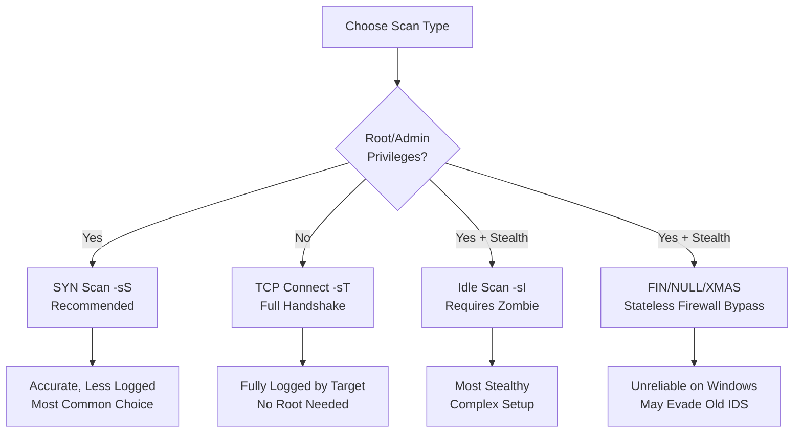
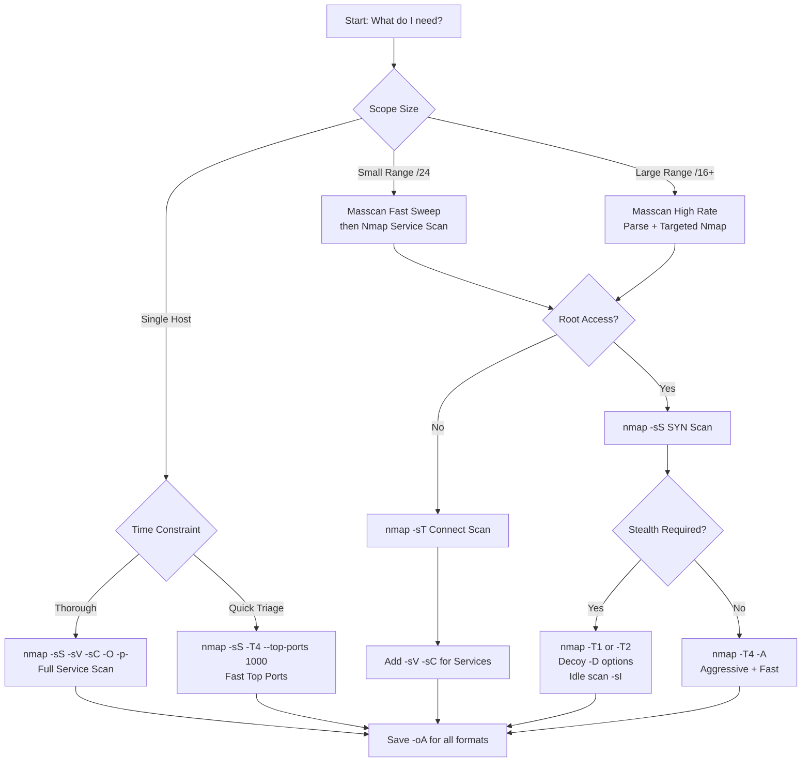
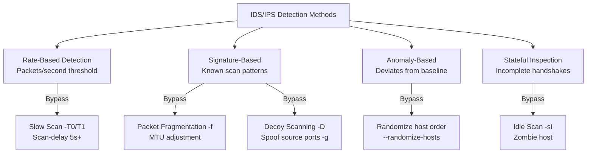

# Port Scanning

> **Difficulty:** Beginner → Advanced | **Category:** Penetration Testing

**Port scanning** is the systematic probing of a target host's network ports to determine which ones are open, closed, or filtered. It is one of the most fundamental skills in offensive security — every engagement begins with knowing what doors exist before deciding which ones to try. This deep-dive covers every major scan type, timing strategies, evasion techniques, the full Nmap flag reference, high-speed scanning with Masscan, output handling, and a comprehensive look at what common port-scan findings mean in practice.

---

## Table of Contents

1. [Port Scanning Fundamentals](#fundamentals)
2. [TCP Scan Types — Deep Dive](#tcp-scan-types)
3. [UDP Scanning](#udp-scanning)
4. [Scan Strategy Decision Tree](#scan-strategy)
5. [Nmap Full Cheat Sheet](#nmap-cheat-sheet)
6. [Masscan — High Speed Scanning](#masscan)
7. [Timing, Evasion, and Firewall Bypass](#timing-evasion)
8. [Output Formats and Parsing](#output-formats)
9. [Scanning Large Ranges](#large-ranges)
10. [Common Findings from Port Scans](#common-findings)

---

## Port Scanning Fundamentals

Every TCP/IP service binds to a **port** — a 16-bit number (0–65535) that acts as a logical communication endpoint. Port scanning answers the core question: "What services is this host advertising to the network?"

### Port Number Ranges

| Range | Name | Description |
|---|---|---|
| 0–1023 | **Well-Known Ports** | IANA-assigned: HTTP (80), SSH (22), SMTP (25) |
| 1024–49151 | **Registered Ports** | Application-registered: MySQL (3306), RDP (3389) |
| 49152–65535 | **Dynamic/Private** | Ephemeral ports for outgoing connections |

### The TCP Three-Way Handshake

Understanding TCP state is prerequisite to understanding scan types:

```
┌──────────┐                    ┌──────────┐
│  Client  │                    │  Server  │
└──────────┘                    └──────────┘
      │  ── SYN (seq=x) ──────────>  │   Client wants to connect
      │  <── SYN-ACK (seq=y, ack=x+1)│   Server acknowledges, has port open
      │  ── ACK (ack=y+1) ─────────> │   Connection established
      │                              │
      │  ── RST ───────────────────> │   SYN scan: reset before data transfer
      │                              │
```

If the port is **closed**:
```
Client  ── SYN ──────────────────> Server
Client  <── RST-ACK ─────────────  Server  (closed, no service)
```

If the port is **filtered**:
```
Client  ── SYN ──────────────────> Firewall  (packet dropped, no response)
         [timeout]
```

---

## TCP Scan Types — Deep Dive



### TCP SYN Scan (`-sS`) — Half-Open Scan

The **SYN scan** is the default and most widely used technique when running as root. It sends a SYN packet and waits for the response:

- **SYN-ACK** → Port is **open** → Send RST (never complete handshake)
- **RST** → Port is **closed**
- **No response** → Port is **filtered**

**Advantages:**
- Faster than connect scan (no full handshake)
- Less likely to appear in application-level logs (TCP state not fully established)
- Works against any compliant TCP/IP stack

**Disadvantages:**
- Requires raw socket access (root)
- Still visible in firewall/IDS logs at the packet level

```bash
sudo nmap -sS -p 1-65535 192.168.1.100
sudo nmap -sS --top-ports 1000 192.168.1.0/24
sudo nmap -sS -p- --min-rate 5000 192.168.1.100
```

### TCP Connect Scan (`-sT`) — Full Handshake

The **Connect scan** uses the operating system's `connect()` syscall to complete the full three-way handshake. No raw socket required.

**Advantages:**
- Works without root/admin privileges
- More accurate (OS handles all edge cases)
- Useful through proxies (SOCKS proxychains)

**Disadvantages:**
- Slower (full handshake per port)
- Fully logged by target's TCP stack and application

```bash
nmap -sT -p 22,80,443,8080,8443 192.168.1.100
nmap -sT -p 1-65535 192.168.1.100

# Through a SOCKS proxy
proxychains nmap -sT -Pn -p 80,443,8080 192.168.1.100
```

### FIN Scan (`-sF`)

Sends a TCP packet with only the **FIN flag** set. No SYN, no established connection.

- **RFC 793 compliant closed port**: Must send RST
- **Open port**: Ignores the packet (no response = possibly open)
- **Filtered**: ICMP unreachable or drop

```bash
sudo nmap -sF -p 1-1024 192.168.1.100
```

### NULL Scan (`-sN`)

Sends a TCP packet with **no flags** set — not valid per RFC, but useful for confusing stateless packet filters.

```bash
sudo nmap -sN -p 80,443 192.168.1.100
```

### XMAS Scan (`-sX`)

Sets the **FIN, PSH, and URG** flags simultaneously — "lights up like a Christmas tree." Same interpretation as FIN scan.

```bash
sudo nmap -sX -p 1-1024 192.168.1.100
```

> **Note:** FIN, NULL, and XMAS scans are unreliable against Windows hosts because Windows sends RST for all such packets regardless of port state, making all ports appear closed.

### ACK Scan (`-sA`) — Firewall Rule Mapping

The **ACK scan** does not determine if ports are open — it maps firewall rules by determining which ports are *reachable* (unfiltered):

- **RST received**: Unfiltered (packet reached the host)
- **No response or ICMP**: Filtered (firewall blocking)

```bash
sudo nmap -sA -p 80,443,22 192.168.1.100
sudo nmap -sA -p 1-1024 10.0.0.1  # Map firewall
```

### Window Scan (`-sW`)

Similar to ACK scan but examines the TCP window size in RST packets. On some systems, open ports produce a non-zero window size in RST packets.

```bash
sudo nmap -sW -p 1-1024 192.168.1.100
```

### Maimon Scan (`-sM`)

Uses FIN/ACK combination. Some BSD-derived systems drop the packet for open ports.

```bash
sudo nmap -sM -p 1-1024 192.168.1.100
```

### Idle / Zombie Scan (`-sI`)

The most stealthy TCP scan. Uses a third-party "zombie" host's **IP ID sequence** to infer port state on the target. Your IP is never seen by the target.

**Mechanism:**
1. Probe zombie's IP ID (predictable increment needed)
2. Send spoofed SYN to target with zombie's source IP
3. If target port is open, target sends SYN-ACK to zombie → zombie sends RST → IP ID increments by 2
4. If target port is closed, target sends RST to zombie → zombie ignores it → IP ID increments by 1

```bash
# First, find a suitable zombie (needs predictable IP ID)
nmap -O -v --script=ipidseq 192.168.1.200

# Perform idle scan against target using zombie
sudo nmap -sI 192.168.1.200 -p 22,80,443 192.168.1.100
sudo nmap -sI 192.168.1.200:80 -p 1-1024 192.168.1.100
```

### Protocol Scan (`-sO`)

Scans which IP protocols are supported (not ports): TCP (6), UDP (17), ICMP (1), IGMP (2), etc.

```bash
sudo nmap -sO 192.168.1.100
```

---

## UDP Scanning

UDP is **connectionless** — there is no handshake, so determining port state is harder:

- **UDP response**: Port is **open**
- **ICMP port unreachable (type 3, code 3)**: Port is **closed**
- **No response**: Port is **open|filtered** (ambiguous)
- **Other ICMP unreachable**: Port is **filtered**

```bash
# Top 200 UDP ports (reasonable balance)
sudo nmap -sU --top-ports 200 192.168.1.100

# Specific UDP services
sudo nmap -sU -p 53,67,69,123,137,138,161,162,500,514,1900 192.168.1.100

# UDP + version detection (slow but thorough)
sudo nmap -sU -sV --top-ports 100 192.168.1.100

# Combined UDP and TCP
sudo nmap -sU -sS -p U:53,161,T:22,80,443 192.168.1.100

# Faster UDP with reduced retries
sudo nmap -sU --top-ports 100 --max-retries 1 --host-timeout 10m 192.168.1.100
```

### Critical UDP Services to Always Check

```bash
# DNS (may allow zone transfer)
sudo nmap -sU -p 53 --script=dns-zone-transfer 192.168.1.100

# SNMP (community string leak)
sudo nmap -sU -p 161 --script=snmp-info 192.168.1.100

# TFTP (unauthenticated file access)
sudo nmap -sU -p 69 --script=tftp-enum 192.168.1.100

# NTP (version + monlist)
sudo nmap -sU -p 123 --script=ntp-info,ntp-monlist 192.168.1.100

# NetBIOS name service
sudo nmap -sU -p 137 --script=nbstat 192.168.1.100
```

---

## Scan Strategy Decision Tree



---

## Nmap Full Cheat Sheet

### Host Discovery

```bash
# Ping sweep — find live hosts without port scanning
sudo nmap -sn 192.168.1.0/24

# ARP scan (local network — most reliable)
sudo nmap -sn -PR 192.168.1.0/24

# Skip host discovery (treat all as up)
nmap -Pn 192.168.1.100

# TCP SYN ping on specific ports
nmap -PS22,80,443,3389 192.168.1.0/24

# TCP ACK ping
nmap -PA80,443 192.168.1.0/24

# UDP ping
nmap -PU53,161 192.168.1.0/24

# ICMP ping types
nmap -PE 192.168.1.0/24   # Echo
nmap -PP 192.168.1.0/24   # Timestamp
nmap -PM 192.168.1.0/24   # Address mask
```

### Scan Types Quick Reference

```bash
-sS    # SYN/Half-open (root required, default)
-sT    # TCP Connect (no root)
-sU    # UDP
-sN    # NULL (no flags)
-sF    # FIN
-sX    # XMAS (FIN+PSH+URG)
-sA    # ACK (firewall mapping)
-sW    # Window scan
-sM    # Maimon (FIN+ACK)
-sI    # Idle/Zombie scan
-sO    # IP Protocol scan
-sY    # SCTP INIT scan
-sZ    # SCTP COOKIE-ECHO scan
```

### Port Specification

```bash
-p 22                   # Single port
-p 22,80,443            # Comma-separated
-p 1-1024               # Range
-p 1-65535              # All TCP
-p-                     # All ports (shorthand)
-p U:53,T:22,80         # UDP+TCP mixed
--top-ports 100         # Top 100 most common
--top-ports 1000        # Top 1000 most common
-p http,ftp,ssh         # By service name
-F                      # Fast scan (top 100 ports)
```

### Detection Flags

```bash
-sV                      # Service/version detection
--version-intensity 0-9  # Detection aggression (default 7)
--version-light          # Intensity 2
--version-all            # Intensity 9

-O                       # OS detection
--osscan-guess           # Aggressive OS guessing
--osscan-limit           # Only attempt likely OS detection

-A                       # Aggressive (OS + version + scripts + traceroute)

--script=<name>          # Run specific NSE script
--script=<category>      # Run script category
-sC                      # Default scripts (same as --script=default)
--script-args key=val    # Arguments to NSE scripts
--script-trace           # Show script communication
```

### NSE Script Categories

```bash
# Categories
auth        # Authentication bypass, credential checks
broadcast   # Network broadcast discovery
brute       # Credential brute forcing
default     # Safe, useful info gathering (same as -sC)
discovery   # Service and host discovery
dos         # Denial of service (use with extreme care)
exploit     # Active exploitation
external    # Uses external resources (DNS, Whois)
fuzzer      # Fuzzing
intrusive   # May crash services, generate logs
malware     # Detect malware
safe        # Unlikely to crash services
version     # Version detection support
vuln        # Vulnerability detection
```

```bash
# Common NSE script combinations

# Web application recon
nmap --script=http-title,http-headers,http-methods,http-auth-finder,\
http-robots.txt,http-sitemap-generator,http-server-header \
-p 80,443,8080,8443 192.168.1.100

# Full SMB enumeration
nmap --script=smb-os-discovery,smb-enum-shares,smb-enum-users,\
smb-security-mode,smb-vuln-ms17-010,smb-vuln-ms08-067 \
-p 445 192.168.1.100

# Full FTP enumeration
nmap --script=ftp-anon,ftp-bounce,ftp-brute,ftp-proftpd-backdoor,\
ftp-vsftpd-backdoor,ftp-libopie \
-p 21 192.168.1.100

# Full SSH enumeration
nmap --script=ssh-auth-methods,ssh2-enum-algos,ssh-hostkey,\
ssh-publickey-acceptance \
--script-args ssh.user=root \
-p 22 192.168.1.100

# Full SNMP enumeration
nmap -sU --script=snmp-brute,snmp-info,snmp-interfaces,snmp-netstat,\
snmp-processes,snmp-sysdescr,snmp-win32-services \
-p 161 192.168.1.100

# RDP enumeration
nmap --script=rdp-enum-encryption,rdp-vuln-ms12-020 \
-p 3389 192.168.1.100

# MySQL enumeration  
nmap --script=mysql-audit,mysql-databases,mysql-dump-hashes,\
mysql-empty-password,mysql-enum,mysql-info,mysql-query,mysql-users,\
mysql-variables,mysql-vuln-cve2012-2122 \
-p 3306 192.168.1.100

# Vulnerability scan (safe scripts)
nmap --script=vuln -T4 192.168.1.100

# CVE-based with Vulners
nmap -sV --script=vulners --script-args mincvss=5 192.168.1.100
```

### Timing Templates Detail

| Template | Name | RTT Timeout | Max Retries | Scan Delay | Parallelism |
|---|---|---|---|---|---|
| `-T0` | Paranoid | 5 min | 10 | 5 min | 1 |
| `-T1` | Sneaky | 15 sec | 10 | 15 sec | 1 |
| `-T2` | Polite | 10 sec | 6 | 400 ms | varies |
| `-T3` | Normal | 10 sec | 6 | none | varies |
| `-T4` | Aggressive | 5 sec | 3 | none | up to 300 |
| `-T5` | Insane | 1.25 sec | 2 | none | up to 300 |

### Fine-Grained Timing

```bash
--min-rtt-timeout 100ms    # Minimum round-trip timeout
--max-rtt-timeout 3000ms   # Maximum round-trip timeout  
--initial-rtt-timeout 1s   # Initial RTT estimate
--max-retries 3            # Max retransmission retries
--host-timeout 30m         # Give up on host after this time
--scan-delay 500ms         # Minimum delay between probes
--max-scan-delay 3s        # Maximum scan delay
--min-rate 100             # Minimum packets per second
--max-rate 1000            # Maximum packets per second
--min-parallelism 10       # Minimum concurrent probes
--max-parallelism 100      # Maximum concurrent probes
```

### Output Options

```bash
-oN file.txt     # Normal output (human-readable)
-oX file.xml     # XML output (machine-parseable)
-oG file.gnmap   # Grepable output
-oS file.txt     # ScRiPt KiDdIe output (novelty)
-oA basename     # All formats simultaneously (basename.nmap, .xml, .gnmap)
-v               # Verbose (show open ports as discovered)
-vv              # Very verbose
-d               # Debug output
-dd              # More debug
--open           # Only show open ports
--packet-trace   # Show all packets sent/received
--reason         # Show reason for each port state
--stats-every 30s # Show progress every 30 seconds
```

### Firewall / IDS Evasion

```bash
# Decoys — scan appears to come from multiple sources
sudo nmap -D 10.0.0.1,10.0.0.2,ME 192.168.1.100

# Random decoys
sudo nmap -D RND:10 192.168.1.100

# Spoof source IP (you won't get responses — use with care)
sudo nmap -S 10.0.0.99 -e eth0 192.168.1.100

# Spoof source port (bypass legacy ACLs that trust 53/80)
sudo nmap --source-port 53 192.168.1.100
sudo nmap -g 80 192.168.1.100

# Fragment packets (bypass simple packet filters)
sudo nmap -f 192.168.1.100      # 8-byte fragments
sudo nmap -ff 192.168.1.100     # 16-byte fragments
sudo nmap --mtu 24 192.168.1.100  # Custom MTU

# Randomize host scan order
nmap --randomize-hosts 192.168.1.0/24

# Add random data to packets
sudo nmap --data-length 25 192.168.1.100

# Slow down to evade rate-based IDS
sudo nmap -T0 192.168.1.100
sudo nmap --scan-delay 5s 192.168.1.100

# Use a specific network interface
nmap -e eth1 192.168.1.100

# IPv6 scanning
nmap -6 fe80::1%eth0
```

---

## Masscan — High Speed Scanning

**Masscan** is an asynchronous port scanner capable of scanning the entire IPv4 internet in under 6 minutes (at 10 Gbps). It implements its own TCP/IP stack and is ideal for broad, fast sweeps.

> **Warning:** Masscan sends packets at extreme rates. Even at default rates it can cause network disruption. Always use `--rate` to throttle. Never use default rate on production networks.

### Installation

```bash
# Debian/Ubuntu
sudo apt install masscan

# From source
git clone https://github.com/robertdavidgraham/masscan
cd masscan
make -j$(nproc)
sudo make install
```

### Basic Usage

```bash
# Scan single host (all ports)
sudo masscan 192.168.1.100 -p1-65535

# Scan with rate limiting
sudo masscan 192.168.1.0/24 -p1-65535 --rate=1000

# Top port equivalents
sudo masscan 192.168.1.0/24 -p21,22,23,25,53,80,110,111,135,139,143,443,445,3306,3389,5432,6379,8080,8443,27017

# Multiple ranges
sudo masscan 10.0.0.0/8 172.16.0.0/12 192.168.0.0/16 -p 80,443

# Scan from target file
sudo masscan -iL targets.txt -p 1-65535 --rate=5000
```

### Masscan Output Formats

```bash
# Binary output
sudo masscan 192.168.1.0/24 -p1-65535 --rate=1000 -oB scan.bin

# XML output
sudo masscan 192.168.1.0/24 -p1-65535 --rate=1000 -oX scan.xml

# Grepable output
sudo masscan 192.168.1.0/24 -p1-65535 --rate=1000 -oG scan.gnmap

# JSON output
sudo masscan 192.168.1.0/24 -p1-65535 --rate=1000 -oJ scan.json

# Simple list
sudo masscan 192.168.1.0/24 -p1-65535 --rate=1000 -oL scan.txt
```

### Masscan → Nmap Pipeline

The professional workflow is to use Masscan for speed, then feed discovered open ports to Nmap for deep service detection:

```bash
#!/bin/bash
# masscan_to_nmap.sh — Fast scan then deep scan pipeline

TARGET="$1"
OUTDIR="${2:-scan_$(date +%Y%m%d_%H%M%S)}"
mkdir -p "$OUTDIR"

echo "[*] Phase 1: Masscan fast port discovery"
sudo masscan "$TARGET" -p 1-65535 \
  --rate=10000 \
  -oG "$OUTDIR/masscan.gnmap"

echo "[*] Parsing open ports..."
grep "open" "$OUTDIR/masscan.gnmap" | awk '{print $2}' | sort -u > "$OUTDIR/live_hosts.txt"

# Extract ports per host
declare -A HOST_PORTS
while IFS= read -r line; do
  if [[ "$line" =~ ^Host:\ ([0-9.]+) ]]; then
    host="${BASH_REMATCH[1]}"
    port=$(echo "$line" | grep -oP '\d+/open' | grep -oP '\d+' | tr '\n' ',' | sed 's/,$//')
    HOST_PORTS["$host"]="$port"
  fi
done < "$OUTDIR/masscan.gnmap"

echo "[*] Phase 2: Nmap service detection on open ports"
for host in "${!HOST_PORTS[@]}"; do
  ports="${HOST_PORTS[$host]}"
  echo "[*] Scanning $host on ports: $ports"
  sudo nmap -sV -sC -O \
    -p "$ports" \
    "$host" \
    -oA "$OUTDIR/nmap_${host//\./_}" \
    --min-rate 1000 \
    -T4
done

echo "[+] Scan complete. Results in $OUTDIR/"
```

### Masscan Configuration File

```bash
# masscan.conf
rate = 1000
output-format = xml
output-filename = scan_results.xml
ports = 1-65535
range = 192.168.1.0/24

# Exclude local broadcast
exclude-file = exclude.txt
```

```bash
# Run with config
sudo masscan --conf masscan.conf

# Exclude file contents (exclude.txt)
# 255.255.255.255/32
# 192.168.1.1/32
```

---

## Timing, Evasion, and Firewall Bypass

### IDS/IPS Evasion Strategies



### Firewall Bypass Techniques

```bash
# Fragment packets to avoid deep packet inspection
sudo nmap -f --mtu 16 192.168.1.100

# Use source port 53 (DNS - often allowed by firewalls)
sudo nmap -g 53 192.168.1.100
sudo nmap --source-port 53 192.168.1.100

# Use source port 80 (HTTP - bypass naive ACLs)
sudo nmap -g 80 192.168.1.100

# Append random data to confuse signature detection
sudo nmap --data-length 200 192.168.1.100

# Randomize MAC address
sudo nmap --spoof-mac 0 192.168.1.100  # Random vendor MAC
sudo nmap --spoof-mac Apple 192.168.1.100  # Specific vendor prefix

# Decoy scan (your IP + decoys appear)
sudo nmap -D 10.1.1.1,10.1.1.2,10.1.1.3,ME,10.1.1.4 192.168.1.100

# IPv6 — often less monitored
sudo nmap -6 -sS fe80::1%eth0
```

### Bypassing Application-Layer Firewalls

```bash
# Some WAFs/firewalls rate-limit based on source IP
# Use multiple source interfaces or IPs

# Slow scan with randomized hosts (evades rate + pattern detection)
sudo nmap -T1 --randomize-hosts --scan-delay 2s 192.168.1.0/24

# Scan only after business hours in the target timezone (operational evasion)
# Use at/cron scheduling:
echo "sudo nmap -sS -p- 192.168.1.100 -oA after_hours_scan" | at 03:00

# Ncat proxy bounce (scan through intermediate host)
ssh user@jump_host "nmap -sT -Pn -p 1-1024 192.168.2.100" > remote_scan.txt
```

---

## Output Formats and Parsing

### Working with XML Output

```bash
# View XML output
cat scan.xml | xmllint --format -

# Extract open ports from XML using Python
python3 - <<'EOF'
import xml.etree.ElementTree as ET

tree = ET.parse('scan.xml')
root = tree.getroot()

for host in root.findall('host'):
    ip = host.find('address').get('addr')
    for port in host.findall('.//port'):
        if port.find('state').get('state') == 'open':
            portid = port.get('portid')
            svc = port.find('service')
            name = svc.get('name', 'unknown') if svc is not None else 'unknown'
            version = f"{svc.get('product','')} {svc.get('version','')}".strip() if svc is not None else ''
            print(f"{ip}:{portid} ({name}) {version}")
EOF
```

### Working with Grepable Output

```bash
# Find all hosts with port 22 open
grep "22/open" scan.gnmap | awk '{print $2}'

# Find all hosts with port 3389 (RDP) open
grep "3389/open" scan.gnmap | awk '{print $2}' > rdp_hosts.txt

# Count open ports per host
grep "^Host:" scan.gnmap | awk '{print NF-2, $2}' | sort -rn | head -20

# Extract all open ports for a specific host
grep "192.168.1.100" scan.gnmap | tr ' ' '\n' | grep "open"

# List all unique services discovered
grep "Ports:" scan.gnmap | grep -oP '\d+/open/\w+//[^/]+' | awk -F/ '{print $5}' | sort | uniq -c | sort -rn
```

### Using ndiff for Scan Comparison

```bash
# Compare two scans (e.g., before and after a change)
ndiff scan_before.xml scan_after.xml

# Quiet diff (only show changes)
ndiff --quiet scan_before.xml scan_after.xml

# Human-readable diff
ndiff scan_baseline.xml scan_current.xml | grep -E "^\+" 
```

### Generating HTML Reports

```bash
# XSL transform Nmap XML to HTML
xsltproc /usr/share/nmap/nmap.xsl scan.xml > scan_report.html

# Using nmap-bootstrap-xsl (nicer output)
xsltproc nmap-bootstrap.xsl scan.xml > scan_report.html
```

---

## Scanning Large Ranges

### Strategy for /16 Networks

```bash
# Phase 1: Host discovery only (no port scan)
sudo nmap -sn 10.0.0.0/16 -oA host_discovery --min-rate 1000
grep "Up" host_discovery.gnmap | awk '{print $2}' > live_hosts.txt
echo "[*] Found $(wc -l < live_hosts.txt) live hosts"

# Phase 2: Quick top-port scan
sudo nmap -sS --top-ports 100 -iL live_hosts.txt \
  -oA quick_scan --min-rate 2000 -T4

# Phase 3: Full port scan on interesting hosts (filtered from phase 2)
grep "open" quick_scan.gnmap | awk '{print $2}' | sort -u > interesting_hosts.txt
sudo nmap -sS -p- -iL interesting_hosts.txt \
  -oA full_scan --min-rate 1000 -T4

# Phase 4: Service detection on full scan results  
# (extract open ports per host and run targeted -sV)
```

### Masscan for Enterprise Ranges

```bash
# Scan multiple RFC1918 ranges
sudo masscan \
  10.0.0.0/8 \
  172.16.0.0/12 \
  192.168.0.0/16 \
  -p 21,22,23,25,53,80,110,135,139,143,443,445,1433,1521,3306,3389,5432,6379,8080,8443,9200,27017 \
  --rate=50000 \
  --exclude 10.255.255.255,172.31.255.255,192.168.255.255 \
  -oX enterprise_scan.xml

# Process output
python3 -c "
import xml.etree.ElementTree as ET
tree = ET.parse('enterprise_scan.xml')
for host in tree.findall('.//host'):
    ip = host.find('address').get('addr')
    for port in host.findall('.//port'):
        p = port.get('portid')
        print(f'{ip}:{p}')
" | sort > open_ports.txt
wc -l open_ports.txt
```

### Distributed Scanning

```bash
# Split a /16 into /24 chunks and scan in parallel
for third_octet in $(seq 0 255); do
  sudo nmap -sS -p 1-65535 \
    10.0.${third_octet}.0/24 \
    --min-rate 1000 \
    -oA "scan_10.0.${third_octet}" &
  
  # Run max 8 parallel scans
  while [[ $(jobs -r | wc -l) -ge 8 ]]; do sleep 5; done
done
wait
echo "[+] All scans complete"

# Combine XML results
cat scan_10.0.*.xml > combined_scan.xml
```

---

## Common Findings from Port Scans

### High-Risk Open Ports

```mermaid
graph TD
    FINDINGS[Port Scan Findings] --> CRIT[Critical Risk]
    FINDINGS --> HIGH[High Risk]
    FINDINGS --> MED[Medium Risk]
    FINDINGS --> INFO[Informational]

    CRIT --> MONGO[27017 MongoDB\nNo Auth]
    CRIT --> REDIS[6379 Redis\nNo Auth / Writable Config]
    CRIT --> DOCKER[2375 Docker API\nUnauthenticated]
    CRIT --> K8S[10250 Kubelet\nNo Auth]
    CRIT --> ELASTIC[9200 Elasticsearch\nPublic Index]
    CRIT --> TELNET[23 Telnet\nCleartext Protocol]

    HIGH --> SMB[445 SMB\nPotential EternalBlue]
    HIGH --> RDP[3389 RDP\nBrute Force / BlueKeep]
    HIGH --> MSSQL[1433 MSSQL\nWeakly Auth]
    HIGH --> VNC[5900 VNC\nWeak/No Auth]
    HIGH --> SNMP[161/UDP SNMP\nPublic Community]
    HIGH --> JENKINS[8080 Jenkins\nDefault Creds]

    MED --> SSH[22 SSH\nOld Version]
    MED --> FTP[21 FTP\nAnon or Cleartext]
    MED --> MYSQL[3306 MySQL\nDefault Creds]
    MED --> SMTP[25 SMTP\nOpen Relay?]
```



### Findings Analysis Table

| Finding | Port(s) | Immediate Test | Critical Risk |
|---|---|---|---|
| MongoDB open | 27017 | `mongo --host target` | Full DB access |
| Redis open | 6379 | `redis-cli -h target info` | RCE via config write |
| Elasticsearch open | 9200 | `curl http://target:9200/_cat/indices` | Data exfiltration |
| Docker API open | 2375 | `docker -H tcp://target:2375 ps` | Container/host RCE |
| Unauthenticated Jupyter | 8888 | Browser to `http://target:8888` | Direct code execution |
| Telnet | 23 | `telnet target` | Credential interception |
| VNC open | 5900 | `vncviewer target` | GUI access |
| SNMP default community | 161/UDP | `snmpwalk -c public target` | Full device info |
| Anonymous FTP | 21 | `ftp target` → anonymous | File read/write |
| RSync open | 873 | `rsync --list-only rsync://target/` | File access |
| TFTP open | 69/UDP | `tftp target` → `get /etc/passwd` | File read |
| Jenkins default creds | 8080 | Browser → admin/admin | RCE via Groovy console |
| Hadoop HDFS | 50070 | `curl http://target:50070/listPaths/` | Full data access |

### Default Credentials to Test

```bash
# Test common service default credentials

# Tomcat (port 8080/8443)
curl -s http://192.168.1.100:8080/manager/html -u tomcat:tomcat
curl -s http://192.168.1.100:8080/manager/html -u admin:admin
curl -s http://192.168.1.100:8080/manager/html -u admin:password

# Jenkins (port 8080)
cat /var/lib/jenkins/secrets/initialAdminPassword  # Local
# Or try: admin:admin, admin:password

# MySQL (port 3306)
mysql -h 192.168.1.100 -u root --password=""
mysql -h 192.168.1.100 -u root -p'root'
mysql -h 192.168.1.100 -u root -p'password'

# PostgreSQL (port 5432)
psql -h 192.168.1.100 -U postgres -c "\l"
# Default: postgres/postgres, postgres/password

# Redis (port 6379)
redis-cli -h 192.168.1.100 ping

# MSSQL (port 1433)
sqsh -S 192.168.1.100 -U sa -P ""
sqsh -S 192.168.1.100 -U sa -P "sa"
```

> **Note:** Always document *why* each port finding matters. An open port 3306 in isolation is less critical than a 3306 bound to `0.0.0.0` with no authentication and accessible from the internet. Context determines severity.

> **Warning:** Scanning rates above 10,000 packets/second on production networks can cause network degradation, router CPU spikes, and crash fragile embedded devices (VoIP phones, printers, SCADA). Always confirm with the client before running high-rate scans.
