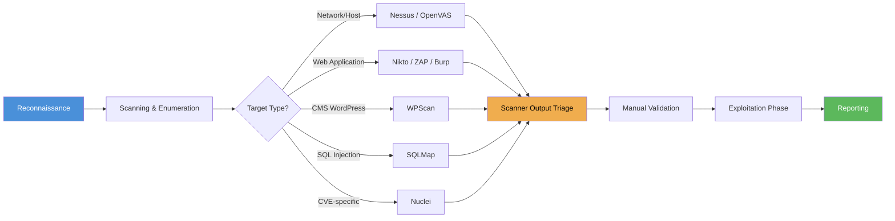
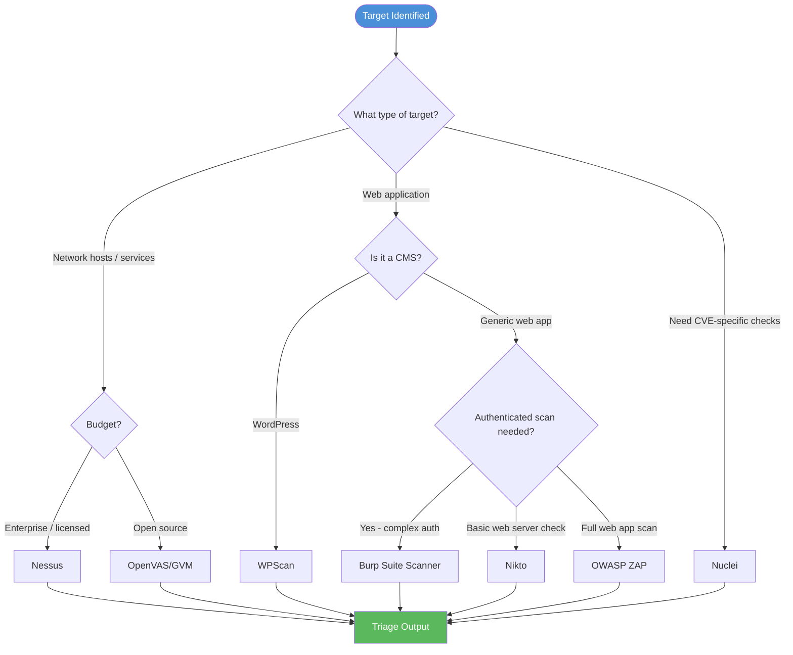

# Automated Scanning
> **Difficulty:** Beginner–Advanced | **Category:** Penetration Testing

---

## Table of Contents

1. [Role of Automated Scanners](#role-of-automated-scanners)
2. [Scanner Selection Guide](#scanner-selection-guide)
3. [Nessus](#nessus)
4. [OpenVAS / GVM](#openvas--gvm)
5. [Nikto](#nikto)
6. [OWASP ZAP](#owasp-zap)
7. [Nuclei](#nuclei)
8. [Burp Suite Scanner](#burp-suite-scanner)
9. [SQLMap](#sqlmap)
10. [WPScan](#wpscan)
11. [Scanner Limitations](#scanner-limitations)
12. [Scanner Tuning](#scanner-tuning)
13. [Integrating Scanners Into Workflow](#integrating-scanners-into-workflow)
14. [Reading and Triaging Output](#reading-and-triaging-scanner-output)

---

## Role of Automated Scanners

**Automated scanners** are tools that systematically probe targets for known vulnerabilities, misconfigurations, and weaknesses without requiring a human to craft each test manually. They are a force multiplier — enabling a single tester to cover hundreds of vulnerabilities across dozens of hosts in the time it would take to manually test five.

In a professional penetration test, automated scanning typically occurs in the **vulnerability discovery** phase and serves three purposes:

1. **Baseline sweep** — Identify low-hanging fruit: unpatched services, default credentials, known CVEs
2. **Attack surface enumeration** — Discover services, open ports, and web application content
3. **Report completeness** — Ensure well-known vulnerabilities aren't missed due to human oversight

> **Note:** Automated scanners are a starting point, not a finish line. Use them to generate a hypothesis list, then validate each finding manually before including it in a report.

### Where Scanners Fit in the Pentest Lifecycle



---

## Scanner Selection Guide



| Tool | Type | License | Best For | Speed |
|------|------|---------|----------|-------|
| **Nessus** | Network/Host | Commercial | Enterprise network audits | Medium |
| **OpenVAS/GVM** | Network/Host | Open Source | Network audits, cost-free | Slow |
| **Nikto** | Web Server | Open Source | Quick web server checks | Fast |
| **OWASP ZAP** | Web Application | Open Source | Full web app scanning | Medium |
| **Nuclei** | CVE/Template | Open Source | CVE-specific, fast, scalable | Very Fast |
| **Burp Suite** | Web Application | Commercial | Authenticated deep scanning | Slow |
| **SQLMap** | SQL Injection | Open Source | SQL injection automation | Fast |
| **WPScan** | WordPress | Open Source/Commercial | WordPress security audits | Fast |

---

## Nessus

**Nessus** (by Tenable) is the industry-leading commercial vulnerability scanner, widely used in enterprise environments. It contains 170,000+ plugins covering CVEs, misconfigurations, compliance checks, and malware detection.

### Installation (Nessus Essentials — Free)

```bash
# Download Nessus from Tenable website, then:
sudo dpkg -i Nessus-10.x.x-debian10_amd64.deb
sudo systemctl start nessusd
sudo systemctl enable nessusd

# Access web UI
# https://localhost:8834
# Complete initial setup and register for Essentials key
```

### Running a Basic Scan via CLI (Nessus API)

```bash
# Export scan results via Nessus API
NESSUS_URL="https://localhost:8834"
API_KEY="your_api_key"
SECRET_KEY="your_secret_key"

# List scans
curl -s -k -X GET "$NESSUS_URL/scans" \
  -H "X-ApiKeys: accessKey=$API_KEY; secretKey=$SECRET_KEY" \
  | python3 -m json.tool

# Launch a scan (replace POLICY_ID and TARGET)
curl -s -k -X POST "$NESSUS_URL/scans" \
  -H "X-ApiKeys: accessKey=$API_KEY; secretKey=$SECRET_KEY" \
  -H "Content-Type: application/json" \
  -d '{
    "uuid": "POLICY_UUID",
    "settings": {
      "name": "Pentest Scan - Target Corp",
      "text_targets": "192.168.1.0/24",
      "enabled": true
    }
  }'

# Export scan report as PDF
SCAN_ID=15
curl -s -k -X POST "$NESSUS_URL/scans/$SCAN_ID/export" \
  -H "X-ApiKeys: accessKey=$API_KEY; secretKey=$SECRET_KEY" \
  -d '{"format":"pdf","chapters":"vuln_hosts_summary"}' \
  | python3 -m json.tool
```

### Reading Nessus Reports

Nessus reports organize findings by:

| Section | Description |
|---------|-------------|
| **Executive Summary** | High-level risk posture, counts by severity |
| **Vulnerabilities by Host** | Per-host breakdown of all findings |
| **Vulnerabilities by Plugin** | Grouped by plugin (CVE/check type) |
| **Plugin Output** | Raw scanner evidence for each finding |

Key columns to focus on when triaging:

```
Severity  | Plugin ID | CVE          | Description
----------|-----------|--------------|----------------------------------
Critical  | 33850     | CVE-2008-4250| MS08-067: Microsoft Server Service RCE
Critical  | 70658     | CVE-2014-6271| Shellshock: Bash Remote Code Execution
High      | 65821     | CVE-2013-1899| PostgreSQL Database Password Exposure
```

> **Note:** Nessus severity uses a 5-level scale: Critical, High, Medium, Low, Informational. Always cross-reference CVSS scores from NVD before using Nessus severity verbatim in reports, as plugin mappings occasionally differ from official CVSS.

---

## OpenVAS / GVM

**OpenVAS** (Open Vulnerability Assessment Scanner), now called **Greenbone Vulnerability Manager (GVM)**, is the leading open-source network scanner. It uses the same vulnerability test families as commercial tools and is maintained by Greenbone Networks.

### Installation via Docker (Recommended)

```bash
# Install GVM using Docker Compose (easiest method)
git clone https://github.com/mikesplain/openvas-docker.git
cd openvas-docker
docker-compose up -d

# Or via official Greenbone Community Edition
curl -f -L https://greenbone.github.io/docs/latest/_static/setup-and-start-greenbone-community-edition.sh \
  -o setup-and-start-greenbone-community-edition.sh
chmod +x setup-and-start-greenbone-community-edition.sh
bash setup-and-start-greenbone-community-edition.sh

# Access web UI at https://localhost:9392
# Default credentials: admin / admin (change immediately)
```

### CLI Usage with gvm-cli

```bash
# Install gvm-tools
pip3 install gvm-tools

# Connect to GVM socket
gvm-cli --gmp-username admin --gmp-password admin socket \
  --socketpath /run/gvmd/gvmd.sock \
  --xml "<get_version/>"

# Create target
gvm-cli socket --xml "
<create_target>
  <name>Pentest Target 2024</name>
  <hosts>192.168.1.0/24</hosts>
  <port_list id='730ef368-57e2-11e1-a90f-406186ea4fc5'/>
</create_target>"

# List scan configs
gvm-cli socket --xml "<get_configs/>" | grep -oP 'name>[^<]+' | head -20

# Start scan (Full and Fast config)
gvm-cli socket --xml "
<create_task>
  <name>Full Scan - Corp Network</name>
  <config id='daba56c8-73ec-11df-a475-002264764cea'/>
  <target id='TARGET_ID'/>
</create_task>"
```

### NVT (Network Vulnerability Tests) Feed Update

```bash
# Keep NVT database current (critical for accurate results)
sudo runuser -u _gvm -- greenbone-nvt-sync
sudo runuser -u _gvm -- greenbone-feed-sync --type GVMD_DATA
sudo runuser -u _gvm -- greenbone-feed-sync --type SCAP
sudo runuser -u _gvm -- greenbone-feed-sync --type CERT
```

---

## Nikto

**Nikto** is an open-source web server scanner that performs comprehensive tests against web servers for dangerous files/programs, outdated server software, and other problems.

### Basic Usage

```bash
# Basic scan
nikto -h https://target.com

# Scan specific port
nikto -h target.com -p 8443

# Scan with authentication
nikto -h https://target.com -id admin:password

# Scan through Burp Suite proxy (for traffic inspection)
nikto -h https://target.com -useproxy http://127.0.0.1:8080

# Save output to file
nikto -h https://target.com -o nikto-report.html -Format html

# Scan multiple hosts from file
nikto -h targets.txt -o bulk-scan.csv -Format csv

# Tune scan (select specific test categories)
# 1=Interesting File/Seen in logs  2=Misconfiguration  3=Information Disclosure
# 4=Injection (XSS/Script/HTML)    5=Remote File Retrieval  6=Denial of Service
nikto -h https://target.com -Tuning 1234
```

### Interpreting Nikto Output

```
- Nikto v2.1.6
---------------------------------------------------------------------------
+ Target IP:          203.0.113.42
+ Target Hostname:    target.com
+ Target Port:        443
---------------------------------------------------------------------------
+ Server: Apache/2.4.41 (Ubuntu)                      ← Version disclosure
+ The anti-clickjacking X-Frame-Options header is not present.  ← Missing header
+ The X-XSS-Protection header is not defined.         ← Missing header
+ The X-Content-Type-Options header is not set.       ← Missing header
+ Allowed HTTP Methods: GET, POST, OPTIONS, PUT        ← PUT enabled!
+ OSVDB-397: HTTP method ('Allow' Header): PUT...      ← Dangerous method
+ /admin/: This might be interesting...               ← Found admin panel
+ /phpinfo.php: PHP info file found.                  ← Information disclosure
+ /backup/: Directory indexing found.                 ← Directory listing
+ /config.php.bak: Configuration backup               ← Sensitive backup file
```

### Nikto + SSL/TLS Analysis

```bash
# Check SSL configuration alongside Nikto
nikto -h https://target.com -ssl

# Check TLS with testssl.sh (more detailed)
./testssl.sh --full --html testssl-report.html https://target.com
```

---

## OWASP ZAP

**OWASP ZAP** (Zed Attack Proxy) is a free, open-source web application security scanner maintained by OWASP. It supports both active (sending attack payloads) and passive scanning (analyzing traffic without sending attacks).

### Installation and Setup

```bash
# Install via apt (Kali Linux)
sudo apt install zaproxy

# Or run via Docker
docker run -u zap -p 8080:8080 -p 8090:8090 \
  ghcr.io/zaproxy/zaproxy:stable \
  zap-webswing.sh

# ZAP Desktop: use GUI
# ZAP Daemon: headless mode for CI/CD
zap.sh -daemon -port 8090 -host 0.0.0.0 \
  -config api.addrs.addr.name=.* \
  -config api.addrs.addr.enabled=true \
  -config api.key=YOUR_API_KEY
```

### Passive vs Active Scanning

| Mode | Description | Risk to Target | When to Use |
|------|-------------|----------------|-------------|
| **Passive** | Analyzes traffic flowing through proxy, no attacks sent | None | Always safe to enable; use during manual browsing |
| **Active** | Sends malicious payloads to discover vulnerabilities | Possible impact | Only with explicit authorization, non-production |

### Automated Scan via CLI

```bash
# Full automated scan using ZAP CLI wrapper
docker run --rm ghcr.io/zaproxy/zaproxy:stable \
  zap-full-scan.py \
  -t https://target.com \
  -r zap-full-report.html \
  -J zap-full-report.json \
  -x zap-full-report.xml

# Baseline scan (passive only — safe for prod-like envs)
docker run --rm ghcr.io/zaproxy/zaproxy:stable \
  zap-baseline.py \
  -t https://target.com \
  -r zap-baseline-report.html

# API scan (for REST APIs with OpenAPI/Swagger spec)
docker run --rm ghcr.io/zaproxy/zaproxy:stable \
  zap-api-scan.py \
  -t https://target.com/api/openapi.json \
  -f openapi \
  -r zap-api-report.html
```

### ZAP API for Custom Automation

```bash
ZAP_API_KEY="your_key_here"
ZAP_URL="http://localhost:8090"

# Spider the target
curl -s "$ZAP_URL/JSON/spider/action/scan/?apikey=$ZAP_API_KEY&url=https://target.com"

# Wait for spider to complete (poll status)
curl -s "$ZAP_URL/JSON/spider/view/status/?apikey=$ZAP_API_KEY&scanId=0"

# Start active scan
curl -s "$ZAP_URL/JSON/ascan/action/scan/?apikey=$ZAP_API_KEY&url=https://target.com&recurse=true"

# Get alerts
curl -s "$ZAP_URL/JSON/alert/view/alerts/?apikey=$ZAP_API_KEY&baseurl=https://target.com" \
  | python3 -m json.tool | grep -E '"risk"|"name"|"url"'
```

---

## Nuclei

**Nuclei** is a fast, template-based vulnerability scanner developed by ProjectDiscovery. It uses YAML templates to define scan checks, making it highly customizable and extremely fast at scale.

### Installation

```bash
# Install via Go
go install -v github.com/projectdiscovery/nuclei/v3/cmd/nuclei@latest

# Or via apt (Kali)
sudo apt install nuclei

# Update templates (do this frequently)
nuclei -update-templates
```

### Basic Usage

```bash
# Scan with all default templates
nuclei -u https://target.com

# Scan multiple targets from file
nuclei -list targets.txt -o results.txt

# Scan with specific severity
nuclei -u https://target.com -severity critical,high

# Scan with specific template tags
nuclei -u https://target.com -tags cve,rce,sqli

# Scan for specific CVE
nuclei -u https://target.com -id CVE-2021-44228

# Scan with specific template directory
nuclei -u https://target.com -t ~/nuclei-templates/cves/2023/

# Run with rate limiting (be respectful)
nuclei -u https://target.com -rate-limit 50 -timeout 5

# JSON output for parsing
nuclei -u https://target.com -json -o nuclei-results.json
```

### Template Structure (How Templates Work)

```yaml
# Example Nuclei template for detecting exposed .git directory
id: git-config-exposure

info:
  name: Git Config File Exposure
  author: pdteam
  severity: medium
  description: Detects publicly accessible .git/config files
  tags: git,exposure,misconfig
  reference:
    - https://cwe.mitre.org/data/definitions/200.html

requests:
  - method: GET
    path:
      - "{{BaseURL}}/.git/config"
    
    matchers-condition: and
    matchers:
      - type: word
        words:
          - "[core]"
        part: body
      
      - type: status
        status:
          - 200
```

```bash
# Run this specific template
nuclei -u https://target.com -t git-config-exposure.yaml

# Create custom template for a new CVE
# Template structure is in ~/nuclei-templates/
ls ~/nuclei-templates/cves/ | head -20

# Search templates by technology
nuclei -u https://target.com -tags wordpress,apache,nginx
```

### Nuclei for CVE Hunting at Scale

```bash
# Generate target list with httpx first
cat domains.txt | httpx -silent -status-code -title -o live-targets.txt

# Scan all live targets for critical/high CVEs
nuclei -list live-targets.txt \
  -severity critical,high \
  -tags cve \
  -rate-limit 100 \
  -bulk-size 50 \
  -c 50 \
  -json \
  -o cve-scan-results.json

# Parse results
cat cve-scan-results.json | jq '.[] | {host: .host, id: .templateID, severity: .info.severity}'
```

---

## Burp Suite Scanner

**Burp Suite Pro's** built-in scanner performs deep, authenticated web application scanning with both passive analysis and active attack probing.

### Setting Up an Authenticated Scan

```
1. Configure browser to use Burp proxy (127.0.0.1:8080)
2. Log in to target application manually — Burp records session cookies
3. Dashboard → New Scan → "Scan a URL list"
4. In "Application login":
   - Select "Record manually" 
   - Click through login in the embedded browser
   - Confirm session is captured
5. Set scope to only the target domain
6. Configure scan type: "Audit checks - all insertions points"
7. Start scan
```

### Burp Scanner Configuration for Stealth

```
Scan configuration settings:
- "Scan speed": Slow (reduces server-side impact and detection)
- "Reduce scan footprint" → Enabled (avoids registrations, password resets)
- "Timeout": 30 seconds
- "Follow redirects": In-scope only
- "Exclude from scope" patterns: /logout, /delete, /reset-password
```

### Reviewing Burp Scan Results

```
Dashboard → Issue activity log:
- Filter by severity: Critical, High, Medium, Low, Informational
- Right-click issue → "Report selected issues" (generates HTML/XML report)
- Click issue → "Advisory" tab: description, remediation, references
- Click issue → "Request" tab: full HTTP request that triggered finding
- Click issue → "Response" tab: server response confirming the issue
```

> **Warning:** Burp Suite Scanner's active scan sends real attack payloads to the application. Never run an active scan against a production system without explicit written authorization and awareness that it may cause errors, log entries, or data changes.

---

## SQLMap

**SQLMap** is the gold-standard automated SQL injection detection and exploitation tool. It supports all major database backends and can extract data, read/write files, and achieve OS-level code execution.

### Basic Detection

```bash
# Test a GET parameter for SQL injection
sqlmap -u "https://target.com/item?id=1" --dbs

# Test a POST parameter
sqlmap -u "https://target.com/login" \
  --data="username=admin&password=test" \
  --dbs

# Test with session cookie (authenticated)
sqlmap -u "https://target.com/profile?id=5" \
  --cookie="session=abc123def456" \
  --dbs

# Test a specific parameter only
sqlmap -u "https://target.com/search?q=test&cat=1" \
  -p cat \
  --dbs
```

### Using Burp Suite Captured Request

```bash
# Save request from Burp as request.txt, then:
sqlmap -r request.txt --dbs

# Content of request.txt:
# POST /login HTTP/1.1
# Host: target.com
# Content-Type: application/x-www-form-urlencoded
# Cookie: session=abc123
#
# username=admin&password=test
```

### Data Extraction

```bash
# List databases
sqlmap -u "https://target.com/item?id=1" --dbs

# List tables in a database
sqlmap -u "https://target.com/item?id=1" -D targetdb --tables

# Dump a specific table
sqlmap -u "https://target.com/item?id=1" -D targetdb -T users --dump

# Dump specific columns
sqlmap -u "https://target.com/item?id=1" \
  -D targetdb -T users \
  -C username,password,email \
  --dump

# Dump all databases (use cautiously — can be very large)
sqlmap -u "https://target.com/item?id=1" --dump-all
```

### Advanced Techniques

```bash
# Bypass WAF with tamper scripts
sqlmap -u "https://target.com/item?id=1" \
  --tamper=space2comment,between,randomcase \
  --dbs

# Time-based blind injection (slower but stealthy)
sqlmap -u "https://target.com/item?id=1" \
  --technique=T \
  --dbs

# Increase verbosity to see payloads
sqlmap -u "https://target.com/item?id=1" -v 3 --dbs

# Read a file (if FILE privilege available)
sqlmap -u "https://target.com/item?id=1" \
  --file-read="/etc/passwd"

# OS shell (if stacked queries and FILE priv available)
sqlmap -u "https://target.com/item?id=1" --os-shell
```

---

## WPScan

**WPScan** is a WordPress security scanner that enumerates users, plugins, themes, and known vulnerabilities in WordPress installations.

### Installation

```bash
# Install via RubyGems
gem install wpscan

# Or via Docker
docker run -it --rm wpscanteam/wpscan --url https://target.com

# Get WPScan API token (free at https://wpscan.com/register)
# Needed for vulnerability database lookups
```

### Basic Enumeration

```bash
# Basic scan with vulnerability DB lookup
wpscan --url https://target.com --api-token YOUR_API_TOKEN

# Enumerate users (common: admin exists on default installs)
wpscan --url https://target.com --enumerate u

# Enumerate all plugins (installed plugins often have CVEs)
wpscan --url https://target.com --enumerate ap --api-token YOUR_TOKEN

# Enumerate all themes
wpscan --url https://target.com --enumerate at --api-token YOUR_TOKEN

# Enumerate config backups and interesting files
wpscan --url https://target.com --enumerate cb,dbe

# Full enumeration
wpscan --url https://target.com \
  --enumerate u,ap,at,cb,dbe \
  --api-token YOUR_TOKEN \
  -o wpscan-report.json \
  --format json
```

### Password Attack

```bash
# Brute force login with found usernames
wpscan --url https://target.com \
  --usernames admin,editor \
  --passwords /usr/share/wordlists/rockyou.txt \
  --max-threads 5

# Single user brute force
wpscan --url https://target.com \
  --username admin \
  --wordlist /usr/share/wordlists/fasttrack.txt
```

### Interpreting WPScan Output

```
[+] WordPress version 6.2.1 identified          ← Check for WordPress CVEs
[+] WordPress theme in use: twentytwentythree
[!] 3 vulnerabilities identified:
 | [!] Title: Plugin: Contact Form 7 < 5.7.3 - Arbitrary File Upload
 |     Fixed in: 5.7.3
 |     References:
 |      - CVE-2023-6449
 |      - https://www.wordfence.com/...
[+] Enumerating Users:
 | [+] admin                                    ← Username confirmed
 | [+] john.doe
```

---

## Scanner Limitations

Understanding what scanners *cannot* do is as important as knowing what they can do.

| Limitation | Impact | Mitigation |
|------------|--------|------------|
| **False positives** | Wastes client patching effort | Manual verification of each finding |
| **False negatives** | Miss real vulnerabilities | Supplement with manual testing |
| **No logic flaw detection** | IDOR, auth bypass, workflow abuse missed | Manual testing required |
| **Version-based vs proof-based** | Flag vuln based on version, not actual exploitability | Verify backported patches |
| **Auth complexity limits** | Multi-factor auth, OAuth, custom auth not fully handled | Manual authentication setup |
| **Rate limiting/WAF evasion** | Scanner may be blocked, reporting false negatives | Tune request rates, use evasion modules |
| **Dynamic content** | JavaScript-heavy apps may not be fully spidered | Use headless browser in ZAP/Burp |
| **Out-of-band detection** | Blind SQLi, SSRF, XXE may not be detected | Use OAST (interactsh/Burp Collaborator) |
| **Business context** | Cannot know if an action is "intended" or not | Human analyst required |

---

## Scanner Tuning

### Reducing Noise

```bash
# Nikto: skip specific tests that generate false positives
nikto -h https://target.com -Tuning -1  # Exclude "Interesting File" tests

# Nuclei: exclude specific template IDs
nuclei -u https://target.com -exclude-id CVE-2021-XXXX,info-disclosure

# SQLMap: set risk level (1=safe, 3=aggressive)
sqlmap -u "https://target.com/item?id=1" --risk=1 --level=3

# Limit scanner rate to avoid DoS and detection
nikto -h https://target.com -maxtime 120    # Stop after 2 minutes
nuclei -u https://target.com -rate-limit 20 # Max 20 req/sec
sqlmap -u "https://target.com/item?id=1" --delay=1  # 1 second between requests
```

### Defining Scope

```bash
# Nessus: configure scope in scan policy
# Policy → Advanced Settings → "Scan limit" (exclude host ranges)

# ZAP: set context scope
# Right-click target in Sites tree → "Include in Context" → New Context
# Then define regex patterns for in-scope URLs

# Nuclei: scope to specific paths
nuclei -u https://target.com/api/ -tags api

# Burp Suite: Target → Scope → Include/Exclude regex patterns
# Example include: ^https://target\.com/.*
# Example exclude: ^https://target\.com/logout.*
```

### Authenticated Scanning Setup

```bash
# ZAP with authentication (form-based)
# Via API:
curl -s "http://localhost:8090/JSON/authentication/action/setAuthenticationMethod/?\
apikey=$API_KEY&contextId=1&authMethodName=formBasedAuthentication&\
authMethodConfigParams=loginUrl=https%3A%2F%2Ftarget.com%2Flogin%26loginRequestData%3Dusername%3D%7B%25username%25%7D%26password%3D%7B%25password%25%7D"

# SQLMap with authentication cookie
sqlmap -u "https://target.com/api/users?id=1" \
  --cookie="auth_token=eyJhbGc..." \
  --headers="Authorization: Bearer eyJhbGc..."
```

---

## Integrating Scanners Into Workflow

### CI/CD Integration with Nuclei

```yaml
# .github/workflows/security-scan.yml
name: Security Scan
on: [push, pull_request]

jobs:
  nuclei-scan:
    runs-on: ubuntu-latest
    steps:
      - name: Run Nuclei
        uses: projectdiscovery/nuclei-action@main
        with:
          target: ${{ secrets.STAGING_URL }}
          flags: "-severity critical,high -tags cve"
          output: nuclei-results.txt
      
      - name: Upload Results
        uses: actions/upload-artifact@v3
        with:
          name: nuclei-scan-results
          path: nuclei-results.txt
```

### Recommended Scan Sequence

```bash
# Phase 1: Network reconnaissance (before web scanning)
nmap -sV -sC -p- --open -oA nmap-full target.com

# Phase 2: Web server fingerprint
nikto -h https://target.com -o nikto.html -Format html

# Phase 3: CVE-specific checks  
nuclei -u https://target.com -severity critical,high -o nuclei.json -json

# Phase 4: Deep web app scan (run while doing manual testing)
# ZAP or Burp Scanner running in background

# Phase 5: Technology-specific (if WordPress detected)
wpscan --url https://target.com --enumerate ap,u --api-token TOKEN

# Phase 6: SQL injection validation
# Only for parameters identified as suspicious
sqlmap -u "https://target.com/item?id=1" --dbs --level=2 --risk=2
```

---

## Reading and Triaging Scanner Output

### Triage Priority Matrix

| Scanner Severity | Likely CVSS | Action | Timeline |
|-----------------|-------------|--------|----------|
| Critical | 9.0–10.0 | Immediate manual verification | Same day |
| High | 7.0–8.9 | Manual verification + exploit attempt | 24 hours |
| Medium | 4.0–6.9 | Verify, assess context | 2–3 days |
| Low | 0.1–3.9 | Review for chains | End of engagement |
| Info | 0.0 | Review for intel value | End of engagement |

### False Positive Filtering Workflow

```bash
# Step 1: Check if service is actually running on reported port
nmap -sV -p PORT target.com

# Step 2: For version-based findings, check if patch was backported
# (Common on CentOS/RHEL/Ubuntu LTS — they backport without version bump)
curl -s -I https://target.com/ | grep Server
# Apache/2.4.41 → check Ubuntu patches: https://ubuntu.com/security/CVE-XXXX

# Step 3: Attempt manual exploitation of the specific vector
# If it fails with appropriate error → likely false positive

# Step 4: Check vendor advisories for that specific version
# e.g., Red Hat CVE database: https://access.redhat.com/security/vulnerabilities

# Step 5: Document conclusion
echo "CVE-XXXX: FALSE POSITIVE — Ubuntu 20.04 backported patch in 2.4.41-4ubuntu3.14" \
  >> false-positives.txt
```

> **Note:** Always include false positive analysis in your final report. Clients need to know that you verified the findings — not just that the scanner found them. A report that says "scanner said X, I verified Y" is worth far more than one that just regurgitates scanner output.
