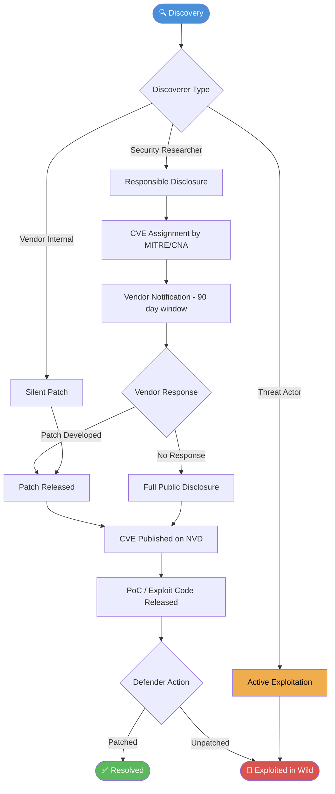

# Vulnerability Analysis
> **Difficulty:** Beginner–Advanced | **Category:** Penetration Testing

---

## Table of Contents

1. [What Is Vulnerability Analysis?](#what-is-vulnerability-analysis)
2. [Vulnerability Classification Systems](#vulnerability-classification-systems)
3. [CVSSv3 Scoring Deep Dive](#cvssv3-scoring-deep-dive)
4. [Vulnerability Lifecycle](#vulnerability-lifecycle)
5. [Vulnerability Intelligence Sources](#vulnerability-intelligence-sources)
6. [Manual vs Automated Analysis](#manual-vs-automated-analysis)
7. [False Positive Management](#false-positive-management)
8. [Vulnerability Chaining](#vulnerability-chaining)
9. [Severity Classification](#severity-classification)
10. [Real-World Examples](#real-world-examples)

---

## What Is Vulnerability Analysis?

**Vulnerability analysis** (also called **vulnerability assessment**) is the systematic process of identifying, classifying, and prioritizing security weaknesses in a target system, application, or network. It sits between the reconnaissance phase and the exploitation phase in the penetration testing methodology.

The goal is not just to find vulnerabilities — it is to understand their **exploitability**, **impact**, and **remediation priority**. A well-executed vulnerability analysis phase answers three critical questions:

1. What weaknesses exist?
2. Which ones can actually be exploited in this environment?
3. What is the realistic business impact if they are exploited?

> **Note:** Vulnerability analysis is not the same as exploitation. You are gathering intelligence and triaging findings, not yet pulling triggers. Understanding this distinction prevents scope creep and legal risk.

Vulnerability analysis feeds directly into the **exploitation** and **reporting** phases. Without thorough analysis, exploitation becomes guesswork, and the final report loses credibility.

---

## Vulnerability Classification Systems

### CVE — Common Vulnerabilities and Exposures

**CVE** is a dictionary of publicly disclosed cybersecurity vulnerabilities maintained by MITRE Corporation and funded by the US Department of Homeland Security. Each entry receives a unique identifier in the format `CVE-YEAR-NUMBER`.

- **CVE-2021-44228** — Log4Shell: Remote code execution in Apache Log4j 2
- **CVE-2017-0144** — EternalBlue: SMB vulnerability exploited by WannaCry
- **CVE-2014-0160** — Heartbleed: Memory disclosure in OpenSSL
- **CVE-2021-34527** — PrintNightmare: Windows Print Spooler RCE

The CVE database is the universal reference language for vulnerabilities. When a scanner reports a finding, it links to CVE identifiers so everyone from the penetration tester to the client's IT team is speaking the same language.

### CWE — Common Weakness Enumeration

**CWE** classifies underlying *types* of weaknesses rather than specific instances. While CVE says "this product has this bug," CWE says "this category of programming mistake leads to vulnerabilities."

| CWE ID | Name | Description |
|--------|------|-------------|
| CWE-79 | Cross-Site Scripting | Improper neutralization of input during web page generation |
| CWE-89 | SQL Injection | Improper neutralization of special elements in SQL commands |
| CWE-119 | Buffer Overflow | Improper restriction of operations within memory bounds |
| CWE-200 | Information Exposure | Exposing sensitive information to unauthorized actors |
| CWE-287 | Improper Authentication | Not properly verifying identity of an actor |
| CWE-352 | CSRF | Cross-Site Request Forgery |
| CWE-502 | Deserialization of Untrusted Data | Deserializing data from untrusted sources without validation |
| CWE-611 | XXE | XML External Entity injection |

> **Note:** CWE is invaluable for developers fixing root causes. Instead of patching one SQL injection instance, fixing the CWE-89 root cause eliminates the entire class of vulnerability.

### CVSS — Common Vulnerability Scoring System

**CVSS** provides a standardized numerical score (0.0–10.0) representing the severity of a vulnerability. The current standard is **CVSSv3.1**, maintained by FIRST (Forum of Incident Response and Security Teams).

---

## CVSSv3 Scoring Deep Dive

CVSSv3 uses three metric groups: **Base**, **Temporal**, and **Environmental**. The **Base Score** is what you see most commonly and is calculated from 8 metrics.

### Base Score Metrics

#### Attack Vector (AV)
How the vulnerability is exploited:

| Value | Score | Description |
|-------|-------|-------------|
| Network (N) | 0.85 | Exploitable remotely over the internet |
| Adjacent (A) | 0.62 | Requires access to the same network segment |
| Local (L) | 0.55 | Requires local access or user interaction |
| Physical (P) | 0.20 | Requires physical access to the device |

#### Attack Complexity (AC)
Conditions beyond the attacker's control:

| Value | Score | Description |
|-------|-------|-------------|
| Low (L) | 0.77 | No special conditions required |
| High (H) | 0.44 | Specific conditions must be met |

#### Privileges Required (PR)
Level of access required before exploiting:

| Value | Score (Unchanged Scope) | Score (Changed Scope) |
|-------|--------------------------|------------------------|
| None (N) | 0.85 | 0.85 |
| Low (L) | 0.62 | 0.68 |
| High (H) | 0.27 | 0.50 |

#### User Interaction (UI)
Whether a victim must take an action:

| Value | Score |
|-------|-------|
| None (N) | 0.85 |
| Required (R) | 0.62 |

#### Scope (S)
Whether impact extends beyond the vulnerable component:

- **Unchanged (U)** — Impact stays within the same authorization scope
- **Changed (C)** — Impact extends to other components or systems

#### CIA Impact Metrics
Each of **Confidentiality (C)**, **Integrity (I)**, and **Availability (A)**:

| Value | Score |
|-------|-------|
| None (N) | 0.00 |
| Low (L) | 0.22 |
| High (H) | 0.56 |

### Step-by-Step Scoring: CVE-2021-44228 (Log4Shell)

**Vulnerability:** Remote code execution via JNDI injection in Apache Log4j 2.x

**Step 1 — Assign metric values:**

| Metric | Value | Justification |
|--------|-------|---------------|
| Attack Vector | Network (N) | Exploitable over the internet |
| Attack Complexity | Low (L) | No special conditions needed |
| Privileges Required | None (N) | No authentication required |
| User Interaction | None (N) | No victim interaction needed |
| Scope | Changed (C) | JNDI callback can reach external server |
| Confidentiality | High (H) | Full RCE → full data access |
| Integrity | High (H) | Full RCE → full system control |
| Availability | High (H) | Full RCE → can crash/destroy system |

**Step 2 — Calculate Impact Sub-Score (ISS):**

```
ISS = 1 - [(1 - C_impact) × (1 - I_impact) × (1 - A_impact)]
ISS = 1 - [(1 - 0.56) × (1 - 0.56) × (1 - 0.56)]
ISS = 1 - [0.44 × 0.44 × 0.44]
ISS = 1 - 0.0852 = 0.9148
```

**Step 3 — Calculate Impact Score (Scope Changed):**

```
Impact = 7.52 × (ISS - 0.029) - 3.25 × (ISS - 0.02)^15
Impact = 7.52 × (0.9148 - 0.029) - 3.25 × (0.9148 - 0.02)^15
Impact = 7.52 × 0.8858 - 3.25 × 0.8948^15
Impact ≈ 6.661 - 3.25 × 0.180 ≈ 6.661 - 0.585 ≈ 6.076
```

**Step 4 — Calculate Exploitability Score:**

```
Exploitability = 8.22 × AV × AC × PR × UI
Exploitability = 8.22 × 0.85 × 0.77 × 0.85 × 0.85
Exploitability = 8.22 × 0.4717 ≈ 3.877
```

**Step 5 — Base Score (Scope Changed formula):**

```
Base Score = Roundup(min(1.08 × (Impact + Exploitability), 10))
Base Score = Roundup(min(1.08 × (6.076 + 3.877), 10))
Base Score = Roundup(min(1.08 × 9.953, 10))
Base Score = Roundup(min(10.749, 10))
Base Score = Roundup(10) = 10.0
```

**Final CVSS Score: 10.0 (Critical)**

> **Warning:** A CVSS score of 10.0 represents the theoretical maximum. Log4Shell earned this because it requires zero authentication, zero user interaction, is exploitable from the internet, and grants full system compromise. Treat any 10.0 finding as an emergency.

---

## Vulnerability Lifecycle

The journey of a vulnerability from discovery to being addressed (or exploited) follows a predictable lifecycle:



### Key Lifecycle Phases

**1. Discovery**
A vulnerability is found — by a researcher, a bug bounty hunter, an automated scanner, a threat actor, or the vendor themselves. The discoverer's motives determine what happens next.

**2. Responsible Disclosure (CVD)**
Under **Coordinated Vulnerability Disclosure**, the researcher notifies the vendor privately and gives them time (typically 90 days, per Google Project Zero's standard) to develop a patch before public disclosure.

**3. CVE Assignment**
A **CVE Numbering Authority (CNA)** assigns a CVE identifier. MITRE is the root CNA; major vendors (Microsoft, Google, Red Hat) are also CNAs for their own products.

**4. Patch Development**
The vendor analyzes the bug, develops a fix, tests it, and stages a release. This window is critical — if it leaks, exploitation begins immediately.

**5. Public Disclosure**
The CVE details are published on NVD (National Vulnerability Database) with CVSS scores, affected versions, and remediation guidance.

**6. Weaponization**
Proof-of-concept code appears on GitHub, Exploit-DB, or Metasploit. The time between NVD publication and weaponized exploit availability has shrunk from weeks to hours.

**7. Patch or Exploit**
Organizations that patched promptly are protected. Those that didn't become targets.

> **Note:** The period between when a patch is released and when an organization applies it is called the **window of exposure**. Studies show the average enterprise takes 60–150 days to patch critical vulnerabilities — meanwhile, exploitation typically begins within 7 days of public disclosure.

---

## Vulnerability Intelligence Sources

| Source | URL | Type | Best For |
|--------|-----|------|----------|
| **NVD** | https://nvd.nist.gov | Government database | Authoritative CVSS scores, affected CPE versions |
| **CVE Mitre** | https://cve.mitre.org | CVE registry | CVE lookup, CNA information |
| **Exploit-DB** | https://exploit-db.com | Exploit repository | Finding PoC exploits by CVE or product |
| **Vulhub** | https://vulhub.org | Docker labs | Reproducing vulnerabilities in safe lab environments |
| **PacketStorm** | https://packetstormsecurity.com | Security content | Exploits, advisories, papers, tools |
| **Shodan** | https://shodan.io | Internet scanner | Finding vulnerable internet-exposed services |
| **CISA KEV** | https://www.cisa.gov/known-exploited-vulnerabilities-catalog | Gov watchlist | Vulnerabilities actively exploited in the wild |
| **VulnDB** | https://vulndb.cyberriskanalytics.com | Commercial DB | Comprehensive coverage, pre-CVE disclosures |
| **GitHub Advisory** | https://github.com/advisories | Code-centric | Open source library vulnerabilities |
| **OSV** | https://osv.dev | Open source | Cross-ecosystem vulnerability tracking |

### Using Exploit-DB from the Command Line

```bash
# Install searchsploit (comes with Kali Linux)
sudo apt install exploitdb

# Search for exploits by product
searchsploit apache struts

# Search for a specific CVE
searchsploit CVE-2021-44228

# Show full path to exploit file
searchsploit -p 50592

# Copy exploit to current directory
searchsploit -m 50592

# Update the local database
searchsploit -u
```

### Querying NVD API

```bash
# Get details for a specific CVE via NVD API v2
curl -s "https://services.nvd.nist.gov/rest/json/cves/2.0?cveId=CVE-2021-44228" \
  | python3 -m json.tool | grep -A5 '"cvssMetricV31"'

# Search for recent critical CVEs in a product
curl -s "https://services.nvd.nist.gov/rest/json/cves/2.0?\
keywordSearch=apache+log4j&cvssV3Severity=CRITICAL" \
  | python3 -m json.tool
```

---

## Manual vs Automated Analysis

| Aspect | Manual Analysis | Automated Scanning |
|--------|-----------------|-------------------|
| **Speed** | Slow — hours to days per target | Fast — minutes to hours |
| **Depth** | Deep — understands context and logic | Shallow — pattern matching only |
| **Logic Flaws** | Excellent — human understands workflow | Poor — cannot model business logic |
| **False Positives** | Low — analyst verifies each finding | High — must be triaged |
| **False Negatives** | Medium — depends on analyst skill | High — misses custom/unknown vulns |
| **Cost** | High — skilled labor intensive | Low — can be automated/scheduled |
| **Consistency** | Variable — depends on analyst | Consistent — same checks every time |
| **Auth Handling** | Excellent — can follow complex auth flows | Moderate — requires configuration |
| **Custom Vulns** | Excellent — analyst can reason about novel issues | None — no signatures for unknown vulns |
| **Reporting** | Manual — analyst writes narrative | Automated — templates generated |
| **Best For** | Logic flaws, business workflows, chaining | Known CVEs, misconfiguration, CMS plugins |

> **Note:** The industry consensus is to use automated scanning *first* to sweep for known issues, then spend manual testing time on what scanners cannot find — logic flaws, auth bypasses, and chained vulnerabilities. Neither approach alone is sufficient.

---

## False Positive Management

A **false positive** is when a scanner (or analyst) reports a vulnerability that does not actually exist or is not exploitable in the target's specific context.

### Why False Positives Matter

- They waste the client's patching effort
- They erode trust in the penetration tester's findings
- They can mask real vulnerabilities buried in noise
- High false positive rates cause "alert fatigue"

### Common Sources of False Positives

1. **Version-based detection** — Scanner sees Apache 2.4.46 and flags CVE-XXXX without checking if the distribution has backported the patch
2. **Port/service assumptions** — Scanner assumes service X runs on port Y without confirmation
3. **Response pattern matching** — Web scanner sees "error" in response and flags SQLi
4. **WAF-altered responses** — Scanner receives blocked response, misinterprets it as vulnerability confirmation

### Verification Workflow

```bash
# Step 1: Check if vulnerability actually applies to this version
# Example: CVE-2021-41773 Apache Path Traversal
# Scanner flagged Apache 2.4.49 on target

# Verify exact version
curl -s -I http://target.com | grep Server

# Step 2: Attempt manual exploitation (in scope)
curl -s --path-as-is http://target.com/cgi-bin/.%2e/.%2e/.%2e/.%2e/etc/passwd

# Step 3: Check if patched by distro even on vulnerable version
# RedHat/CentOS often backport security patches without version bump
rpm -qi httpd | grep -i version

# Step 4: Document result
# If response is 400/403/404 with no file content → FALSE POSITIVE
# If response contains /etc/passwd content → CONFIRMED
```

### False Positive Documentation Template

```
Finding ID:     VULN-2024-047
Tool:           Nessus 10.x
Plugin ID:      12345
CVE:            CVE-2021-41773
Initial Status: Unconfirmed

Verification Steps:
1. Checked Apache version: 2.4.49 confirmed via Server header
2. Sent manual PoC request: curl --path-as-is .../cgi-bin/.%2e/...
3. Response: HTTP 403 Forbidden (WAF block, not patched response)
4. Checked mod_cgi: not enabled on target

Result: FALSE POSITIVE
Reason: mod_cgi is not enabled; exploit requires mod_cgi to execute
Action: Excluded from report
```

---

## Vulnerability Chaining

**Vulnerability chaining** (also called **exploit chaining**) is the process of combining multiple low-to-medium severity vulnerabilities to achieve a high-impact outcome. Real-world compromises almost always involve chains rather than single critical vulnerabilities.

### Classic Chain Example: Information Disclosure → Auth Bypass → RCE

```
[Step 1] Directory listing enabled on /backup/
         → Reveals config.php.bak
         
[Step 2] config.php.bak contains hardcoded database credentials
         → DB user: app_user / pass: Welcome123!
         
[Step 3] MySQL port 3306 exposed to internet (misconfiguration)
         → Login to DB with leaked credentials
         
[Step 4] MySQL user has FILE privilege
         → Write PHP webshell: SELECT '<?php system($_GET["c"]);?>'
           INTO OUTFILE '/var/www/html/shell.php'
           
[Step 5] Execute webshell via HTTP
         → Remote code execution as www-data
```

Individually: Information Disclosure (Medium), Exposed DB port (Medium), Weak credentials (Medium), FILE privilege (Low). Together: **Critical RCE**.

### Chain Severity Calculation

When documenting a chain, report:
1. Each individual vulnerability with its standalone CVSS score
2. The chain as a separate finding with the combined impact score
3. The attack narrative connecting each step

> **Warning:** During reporting, chains must be clearly explained as narratives. If the client only patches one link in the chain (e.g., closes port 3306) but leaves others (directory listing, weak credentials), the risk is not fully eliminated. Always recommend fixing all links.

---

## Severity Classification

| Severity | CVSS Range | Color | Typical Response SLA | Examples |
|----------|------------|-------|----------------------|----------|
| **Critical** | 9.0–10.0 | 🔴 Red | Patch within 24–48 hours | RCE, unauthenticated SQLi, Log4Shell |
| **High** | 7.0–8.9 | 🟠 Orange | Patch within 7 days | Auth bypass, SSRF, XXE, LFI |
| **Medium** | 4.0–6.9 | 🟡 Yellow | Patch within 30 days | Stored XSS, IDOR (limited), CSRF |
| **Low** | 0.1–3.9 | 🔵 Blue | Patch within 90 days | Reflected XSS, verbose errors, clickjacking |
| **Info** | 0.0 | ⚪ Grey | Best effort | Version disclosure, missing headers |

> **Note:** CVSS scores are a starting point, not the final word. A Medium CVSS vulnerability may be Critical in your environment if it affects a payment processing component. Always contextualize with **business impact**.

---

## Real-World Examples

### Example 1: CVE-2017-0144 (EternalBlue / WannaCry)

- **Type:** Buffer overflow in SMBv1 (`MS17-010`)
- **CWE:** CWE-119 (Improper Restriction of Operations within Memory Bounds)
- **CVSS:** 9.3 (Critical)
- **Impact:** Remote code execution as SYSTEM on unpatched Windows systems
- **Exploited by:** WannaCry ransomware, NotPetya, Shadow Brokers leak

```bash
# Check for MS17-010 with nmap
nmap -p 445 --script smb-vuln-ms17-010 192.168.1.0/24

# Sample output for vulnerable host:
# Host script results:
# | smb-vuln-ms17-010:
# |   VULNERABLE:
# |   Remote Code Execution vulnerability in Microsoft SMBv1 servers (ms17-010)
# |     State: VULNERABLE
# |     IDs:  CVE:CVE-2017-0144
```

### Example 2: CVE-2014-0160 (Heartbleed)

- **Type:** Out-of-bounds memory read in OpenSSL `TLS heartbeat` extension
- **CWE:** CWE-126 (Buffer Over-read)
- **CVSS:** 7.5 (High)
- **Impact:** Leaks up to 64KB of server memory per request — may contain private keys, session tokens, passwords

```bash
# Test for Heartbleed with nmap
nmap -p 443 --script ssl-heartbleed target.com

# Test with sslscan
sslscan target.com | grep -i heartbleed

# Test with OpenSSL (manual)
openssl s_client -connect target.com:443 -tlsextdebug 2>&1 | grep heartbeat
```

### Example 3: CVE-2019-0708 (BlueKeep)

- **Type:** Use-after-free in Windows Remote Desktop Services
- **CWE:** CWE-416 (Use After Free)
- **CVSS:** 9.8 (Critical)
- **Impact:** Pre-authentication RCE over RDP; wormable (no user interaction)

```bash
# Detect BlueKeep with nmap
nmap -p 3389 --script rdp-vuln-ms12-020,rdp-enum-encryption target.com

# Metasploit detection (no exploitation)
use auxiliary/scanner/rdp/cve_2019_0708_bluekeep
set RHOSTS 192.168.1.0/24
run
```

---

## Summary Checklist

- [ ] Identified all CVEs applicable to target versions
- [ ] Assigned CWE categories to each finding
- [ ] Calculated or noted CVSS scores (Base minimum, Temporal/Environmental if possible)
- [ ] Verified each finding is not a false positive
- [ ] Documented verification steps for each finding
- [ ] Identified vulnerability chains and documented attack narratives
- [ ] Classified each finding by severity with business context
- [ ] Mapped findings to vulnerability intelligence sources
- [ ] Cross-referenced against CISA KEV for active exploitation status
- [ ] Prepared remediation recommendations with CVE patch references
